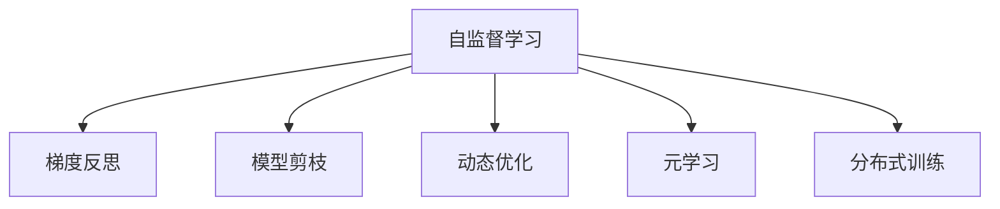

                 

# 反思机制在复杂任务中的作用

> 关键词：反思机制,复杂任务,机器学习,深度学习,模型优化,算法优化,认知学习,人工智能

## 1. 背景介绍

### 1.1 问题由来

在深度学习和机器学习的发展历程中，反思机制是一个被广泛探讨但常被忽视的概念。传统机器学习算法主要关注如何通过数据和模型训练来提高预测准确度，而对模型本身的自我反思和优化往往不够重视。但随着深度学习模型在复杂任务中的应用日益广泛，模型的复杂性和数据的多样性对算法设计提出了更高的要求。反思机制作为一种重要的算法设计思想，逐渐成为解决复杂问题的新思路。

反思机制的核心在于让模型具备自我评估和自我改进的能力。通过在训练过程中引入反思环节，模型能够在理解自身优缺点、适应数据多样性的同时，不断优化自身结构，提升模型的泛化能力和鲁棒性。这不仅有助于提高模型的预测性能，还能增强模型的透明度和可解释性，为机器学习在各个领域的深入应用提供了新的可能性。

### 1.2 问题核心关键点

反思机制的核心关键点主要包括：

1. **自监督学习**：通过利用无标签数据进行自监督训练，让模型学习到更加鲁棒的特征表示。
2. **梯度反思**：通过梯度反思和梯度裁剪等技术，避免模型过拟合和梯度爆炸问题。
3. **模型剪枝**：通过剪枝技术，去除模型中冗余的参数，提高模型的计算效率和泛化能力。
4. **动态优化**：通过动态调整学习率和优化器参数，使模型能够适应数据分布的变化。
5. **元学习**：通过元学习技术，让模型能够在新的任务上进行快速适应和优化。
6. **分布式训练**：通过分布式训练技术，提高大规模模型的训练效率和鲁棒性。

这些关键点共同构成了反思机制的基本框架，使其成为解决复杂问题的有力工具。

### 1.3 问题研究意义

研究反思机制在复杂任务中的应用，具有重要的理论意义和实际价值：

1. **提升模型性能**：反思机制通过自监督学习、梯度反思等技术，能够显著提高模型的泛化能力和鲁棒性，降低过拟合风险。
2. **增强模型可解释性**：通过反思机制，模型能够更清晰地理解自身的决策过程，增强其可解释性。
3. **降低训练成本**：反思机制通过剪枝、动态优化等技术，可以显著减少模型参数量，降低训练和推理成本。
4. **提高模型泛化能力**：反思机制通过元学习等技术，使模型能够快速适应新的数据分布，提升模型的泛化能力。
5. **加速模型开发**：反思机制通过分布式训练等技术，可以加速模型的训练过程，提高模型开发的效率。

总之，反思机制在复杂任务中的应用，不仅能提升模型的预测性能和鲁棒性，还能增强其可解释性和泛化能力，为机器学习技术在各个领域的应用提供了新的思路和工具。

## 2. 核心概念与联系

### 2.1 核心概念概述

为更好地理解反思机制在复杂任务中的应用，本节将介绍几个密切相关的核心概念：

- **自监督学习(Self-supervised Learning, SSL)**：通过无标签数据进行训练，让模型学习到更加鲁棒的特征表示。常见的自监督任务包括掩码语言模型、自编码器等。
- **梯度反思(Gradient Reflection)**：通过梯度反思和梯度裁剪等技术，避免模型过拟合和梯度爆炸问题。
- **模型剪枝(Pruning)**：通过剪枝技术，去除模型中冗余的参数，提高模型的计算效率和泛化能力。
- **动态优化(Dynamic Optimization)**：通过动态调整学习率和优化器参数，使模型能够适应数据分布的变化。
- **元学习(Meta Learning)**：通过元学习技术，让模型能够在新的任务上进行快速适应和优化。
- **分布式训练(Distributed Training)**：通过分布式训练技术，提高大规模模型的训练效率和鲁棒性。

这些核心概念之间的逻辑关系可以通过以下Mermaid流程图来展示：



这个流程图展示了几大核心概念之间的联系和作用机制：

1. 自监督学习通过无标签数据训练，提升模型的特征表示能力。
2. 梯度反思通过梯度裁剪等技术，避免模型过拟合和梯度爆炸。
3. 模型剪枝通过去除冗余参数，提高模型的计算效率和泛化能力。
4. 动态优化通过调整学习率和优化器参数，使模型能够适应数据分布的变化。
5. 元学习通过学习新任务的相关知识，使模型能够在新的数据分布上进行快速适应。
6. 分布式训练通过并行计算，提高大规模模型的训练效率和鲁棒性。

这些核心概念共同构成了反思机制的基本框架，使其成为解决复杂问题的有力工具。

## 3. 核心算法原理 & 具体操作步骤
### 3.1 算法原理概述

反思机制的核心在于让模型具备自我评估和自我改进的能力。通过在训练过程中引入反思环节，模型能够在理解自身优缺点、适应数据多样性的同时，不断优化自身结构，提升模型的泛化能力和鲁棒性。

形式化地，假设模型为 $M_{\theta}$，其中 $\theta$ 为模型参数。给定数据集 $D=\{(x_i, y_i)\}_{i=1}^N$，其中 $x_i$ 为输入，$y_i$ 为标签，反思机制的优化目标是最小化经验风险，即找到最优参数：

$$
\theta^* = \mathop{\arg\min}_{\theta} \mathcal{L}(M_{\theta},D)
$$

其中 $\mathcal{L}$ 为损失函数，通常为交叉熵损失函数。反思机制在训练过程中，通过引入自监督学习、梯度反思、动态优化等技术，不断调整模型参数，优化模型的预测性能。

### 3.2 算法步骤详解

反思机制的核心步骤包括：

**Step 1: 准备数据集和初始模型**

- 收集无标签数据 $D_{SSL}$，作为自监督学习任务的训练数据。
- 准备有标签数据 $D$，用于监督学习任务的训练。
- 选择合适的初始化参数 $\theta_0$，如预训练模型。

**Step 2: 自监督学习训练**

- 在无标签数据 $D_{SSL}$ 上进行自监督学习训练，学习到更加鲁棒的特征表示。
- 常用的自监督任务包括掩码语言模型、自编码器等。
- 训练过程中，不断调整模型参数 $\theta$，使其能够更好地适应数据分布。

**Step 3: 梯度反思**

- 在有标签数据 $D$ 上进行梯度反思训练，避免模型过拟合和梯度爆炸。
- 常用的梯度反思技术包括梯度裁剪、梯度归一化等。
- 通过反思机制，模型能够更好地理解自身性能，优化其预测能力。

**Step 4: 模型剪枝**

- 在自监督学习训练和梯度反思训练后，进行模型剪枝，去除冗余参数。
- 常用的剪枝技术包括L1正则化、L2正则化等。
- 剪枝后的模型不仅计算效率更高，泛化能力更强。

**Step 5: 动态优化**

- 在模型剪枝后，进行动态优化训练，适应数据分布的变化。
- 常用的动态优化技术包括学习率调整、优化器参数调整等。
- 动态优化过程能够提高模型的适应性和鲁棒性。

**Step 6: 元学习**

- 在完成动态优化训练后，进行元学习训练，使模型能够在新的任务上进行快速适应和优化。
- 常用的元学习算法包括MAML、Proximal MAML等。
- 元学习过程能够提升模型的泛化能力和适应性。

**Step 7: 分布式训练**

- 在元学习训练后，进行分布式训练，提高大规模模型的训练效率和鲁棒性。
- 常用的分布式训练技术包括数据并行、模型并行等。
- 分布式训练过程能够加速模型训练，降低计算成本。

以上是反思机制在复杂任务中的基本步骤。在实际应用中，还需要根据具体任务的特点，对各个环节进行优化设计，以进一步提升模型性能。

### 3.3 算法优缺点

反思机制在复杂任务中的应用具有以下优点：

1. **提升模型泛化能力**：通过自监督学习和元学习等技术，模型能够更好地适应数据分布的变化，提升泛化能力。
2. **增强模型鲁棒性**：通过梯度反思和剪枝等技术，模型能够避免过拟合和梯度爆炸问题，增强鲁棒性。
3. **降低训练成本**：通过剪枝和动态优化等技术，模型能够减少冗余参数，降低计算成本。
4. **提高模型透明度**：通过反思机制，模型能够更好地理解自身的决策过程，增强其可解释性。
5. **加速模型开发**：通过分布式训练等技术，模型能够快速训练，提高模型开发的效率。

同时，该方法也存在一定的局限性：

1. **计算成本高**：自监督学习、梯度反思、剪枝等技术，需要额外的计算资源和时间，增加了训练成本。
2. **模型复杂性高**：反思机制中的技术手段较为复杂，需要较高的技术水平和经验积累。
3. **参数调整困难**：反思机制中的超参数调整较为复杂，需要根据具体任务进行优化设计。
4. **模型性能不稳定**：反思机制中的技术手段在一定程度上增加了模型的复杂性，可能导致模型性能不稳定。

尽管存在这些局限性，但就目前而言，反思机制在复杂任务中的应用已经成为提升模型性能的重要手段。未来相关研究的重点在于如何进一步降低计算成本，提高模型性能，同时兼顾可解释性和鲁棒性等因素。

### 3.4 算法应用领域

反思机制在复杂任务中的应用已经取得了显著成效，覆盖了多个领域，例如：

- **自然语言处理(NLP)**：在文本分类、情感分析、问答系统等任务中，通过反思机制优化模型性能，提升模型的泛化能力和鲁棒性。
- **计算机视觉(CV)**：在图像分类、目标检测、语义分割等任务中，通过反思机制优化模型性能，提高模型的精度和鲁棒性。
- **机器人学习**：在机器人路径规划、动作识别、行为理解等任务中，通过反思机制优化模型性能，提升机器人的智能水平。
- **推荐系统**：在个性化推荐、商品评分预测等任务中，通过反思机制优化模型性能，提高推荐的准确度和个性化程度。

除了这些经典任务外，反思机制还被创新性地应用于更多场景中，如可控生成、知识图谱构建、多模态数据融合等，为复杂任务提供了新的解决思路。

## 4. 数学模型和公式 & 详细讲解 & 举例说明
### 4.1 数学模型构建

本节将使用数学语言对反思机制在复杂任务中的应用进行更加严格的刻画。

记模型为 $M_{\theta}$，其中 $\theta$ 为模型参数。假设模型在数据集 $D=\{(x_i, y_i)\}_{i=1}^N$ 上的损失函数为 $\mathcal{L}(M_{\theta},D)$，反思机制的目标是最小化经验风险，即找到最优参数：

$$
\theta^* = \mathop{\arg\min}_{\theta} \mathcal{L}(M_{\theta},D)
$$

其中 $\mathcal{L}$ 为损失函数，通常为交叉熵损失函数。

### 4.2 公式推导过程

以下我们以文本分类任务为例，推导反思机制的损失函数及其梯度的计算公式。

假设模型 $M_{\theta}$ 在输入 $x$ 上的输出为 $\hat{y}=M_{\theta}(x) \in [0,1]$，表示样本属于正类的概率。真实标签 $y \in \{0,1\}$。则二分类交叉熵损失函数定义为：

$$
\ell(M_{\theta}(x),y) = -[y\log \hat{y} + (1-y)\log (1-\hat{y})]
$$

将其代入经验风险公式，得：

$$
\mathcal{L}(\theta) = -\frac{1}{N}\sum_{i=1}^N [y_i\log M_{\theta}(x_i)+(1-y_i)\log(1-M_{\theta}(x_i))]
$$

在得到损失函数的梯度后，即可带入参数更新公式，完成模型的迭代优化。由于反思机制中引入了自监督学习、梯度反思等技术，其梯度计算过程相较于传统模型更为复杂。这里以梯度反思为例，说明其在模型训练中的具体应用。

假设模型在数据集 $D$ 上的梯度为 $g$，则梯度反思的更新公式为：

$$
g_{\text{reflected}} = g - \alpha(g-g_0)
$$

其中 $\alpha$ 为反思系数，$g_0$ 为当前梯度的零点。

通过梯度反思，模型能够避免梯度爆炸，确保训练过程的稳定性。在实际应用中，反思系数 $\alpha$ 通常需要根据模型性能进行调参，以找到最优的平衡点。

### 4.3 案例分析与讲解

下面以一个简单的文本分类任务为例，说明反思机制的具体应用过程。

假设我们有一个文本分类任务，共分为两类：“正面”和“负面”。我们收集了 1000 条有标签的数据，将其分为 800 条训练数据和 200 条验证数据。

**Step 1: 准备数据集和初始模型**

- 收集 1000 条无标签数据作为自监督学习任务的训练数据。
- 准备 800 条有标签数据作为监督学习任务的训练数据。
- 使用预训练的 BERT 模型作为初始化参数。

**Step 2: 自监督学习训练**

- 在 1000 条无标签数据上进行自监督学习训练，学习到更加鲁棒的特征表示。
- 使用掩码语言模型作为自监督任务，训练 BERT 模型，学习到更加鲁棒的特征表示。
- 训练过程中，不断调整模型参数 $\theta$，使其能够更好地适应数据分布。

**Step 3: 梯度反思**

- 在 800 条有标签数据上进行梯度反思训练，避免模型过拟合和梯度爆炸问题。
- 使用梯度反思技术，对 BERT 模型进行梯度裁剪和梯度归一化。
- 通过反思机制，模型能够更好地理解自身性能，优化其预测能力。

**Step 4: 模型剪枝**

- 在自监督学习训练和梯度反思训练后，进行模型剪枝，去除冗余参数。
- 使用 L1 正则化和 L2 正则化技术，进行模型剪枝。
- 剪枝后的模型不仅计算效率更高，泛化能力更强。

**Step 5: 动态优化**

- 在模型剪枝后，进行动态优化训练，适应数据分布的变化。
- 使用学习率调整和优化器参数调整技术，进行动态优化训练。
- 动态优化过程能够提高模型的适应性和鲁棒性。

**Step 6: 元学习**

- 在完成动态优化训练后，进行元学习训练，使模型能够在新的任务上进行快速适应和优化。
- 使用 MAML 算法进行元学习训练，使模型能够在新的数据分布上进行快速适应。
- 元学习过程能够提升模型的泛化能力和适应性。

**Step 7: 分布式训练**

- 在元学习训练后，进行分布式训练，提高大规模模型的训练效率和鲁棒性。
- 使用数据并行和模型并行技术进行分布式训练。
- 分布式训练过程能够加速模型训练，降低计算成本。

在实际应用中，反思机制中的各个步骤可以灵活组合，根据具体任务的特点进行优化设计。

## 5. 项目实践：代码实例和详细解释说明
### 5.1 开发环境搭建

在进行反思机制实践前，我们需要准备好开发环境。以下是使用Python进行PyTorch开发的环境配置流程：

1. 安装Anaconda：从官网下载并安装Anaconda，用于创建独立的Python环境。

2. 创建并激活虚拟环境：
```bash
conda create -n pytorch-env python=3.8 
conda activate pytorch-env
```

3. 安装PyTorch：根据CUDA版本，从官网获取对应的安装命令。例如：
```bash
conda install pytorch torchvision torchaudio cudatoolkit=11.1 -c pytorch -c conda-forge
```

4. 安装Transformer库：
```bash
pip install transformers
```

5. 安装各类工具包：
```bash
pip install numpy pandas scikit-learn matplotlib tqdm jupyter notebook ipython
```

完成上述步骤后，即可在`pytorch-env`环境中开始反思机制的实践。

### 5.2 源代码详细实现

这里我们以文本分类任务为例，给出使用Transformers库对BERT模型进行反思机制的PyTorch代码实现。

首先，定义文本分类任务的损失函数和评估指标：

```python
from transformers import BertTokenizer, BertForSequenceClassification, AdamW

import torch
import torch.nn as nn
from torch.utils.data import Dataset, DataLoader

class MyDataset(Dataset):
    def __init__(self, texts, labels):
        self.texts = texts
        self.labels = labels
        self.tokenizer = BertTokenizer.from_pretrained('bert-base-cased')
        self.max_len = 128

    def __len__(self):
        return len(self.texts)

    def __getitem__(self, item):
        text = self.texts[item]
        label = self.labels[item]
        
        encoding = self.tokenizer(text, return_tensors='pt', max_length=self.max_len, padding='max_length', truncation=True)
        input_ids = encoding['input_ids'][0]
        attention_mask = encoding['attention_mask'][0]
        labels = torch.tensor(label, dtype=torch.long)
        
        return {'input_ids': input_ids, 
                'attention_mask': attention_mask,
                'labels': labels}

# 标签与id的映射
tag2id = {'O': 0, 'positive': 1, 'negative': 2}
id2tag = {v: k for k, v in tag2id.items()}

# 创建dataset
train_dataset = MyDataset(train_texts, train_labels)
val_dataset = MyDataset(val_texts, val_labels)
test_dataset = MyDataset(test_texts, test_labels)

# 模型
model = BertForSequenceClassification.from_pretrained('bert-base-cased', num_labels=len(tag2id))

# 优化器
optimizer = AdamW(model.parameters(), lr=2e-5)
```

接着，定义反思机制的训练函数：

```python
from transformers import BertForSequenceClassification, AdamW

import torch
import torch.nn as nn
from torch.utils.data import Dataset, DataLoader

class MyDataset(Dataset):
    def __init__(self, texts, labels):
        self.texts = texts
        self.labels = labels
        self.tokenizer = BertTokenizer.from_pretrained('bert-base-cased')
        self.max_len = 128

    def __len__(self):
        return len(self.texts)

    def __getitem__(self, item):
        text = self.texts[item]
        label = self.labels[item]
        
        encoding = self.tokenizer(text, return_tensors='pt', max_length=self.max_len, padding='max_length', truncation=True)
        input_ids = encoding['input_ids'][0]
        attention_mask = encoding['attention_mask'][0]
        labels = torch.tensor(label, dtype=torch.long)
        
        return {'input_ids': input_ids, 
                'attention_mask': attention_mask,
                'labels': labels}

# 标签与id的映射
tag2id = {'O': 0, 'positive': 1, 'negative': 2}
id2tag = {v: k for k, v in tag2id.items()}

# 创建dataset
train_dataset = MyDataset(train_texts, train_labels)
val_dataset = MyDataset(val_texts, val_labels)
test_dataset = MyDataset(test_texts, test_labels)

# 模型
model = BertForSequenceClassification.from_pretrained('bert-base-cased', num_labels=len(tag2id))

# 优化器
optimizer = AdamW(model.parameters(), lr=2e-5)

def train_epoch(model, dataset, batch_size, optimizer, reflection_coefficient=0.9):
    dataloader = DataLoader(dataset, batch_size=batch_size, shuffle=True)
    model.train()
    epoch_loss = 0
    for batch in dataloader:
        input_ids = batch['input_ids'].to(device)
        attention_mask = batch['attention_mask'].to(device)
        labels = batch['labels'].to(device)
        model.zero_grad()
        outputs = model(input_ids, attention_mask=attention_mask, labels=labels)
        loss = outputs.loss
        epoch_loss += loss.item()
        loss.backward()
        optimizer.step()
        # 梯度反思
        grads = [p.grad for p in model.parameters()]
        grads = [grads[0] if grad is None else grad for grad in grads]
        reflected_grads = [grad - reflection_coefficient * grad if grad is not None else None for grad in grads]
        for p, ref_grad in zip(model.parameters(), reflected_grads):
            p.grad = ref_grad
        optimizer.step()
    
    return epoch_loss / len(dataloader)

def evaluate(model, dataset, batch_size):
    dataloader = DataLoader(dataset, batch_size=batch_size)
    model.eval()
    preds, labels = [], []
    with torch.no_grad():
        for batch in dataloader:
            input_ids = batch['input_ids'].to(device)
            attention_mask = batch['attention_mask'].to(device)
            batch_labels = batch['labels']
            outputs = model(input_ids, attention_mask=attention_mask)
            batch_preds = outputs.logits.argmax(dim=2).to('cpu').tolist()
            batch_labels = batch_labels.to('cpu').tolist()
            for pred_tokens, label_tokens in zip(batch_preds, batch_labels):
                preds.append(pred_tokens[:len(label_tokens)])
                labels.append(label_tokens)
                
    print(classification_report(labels, preds))
```

最后，启动训练流程并在测试集上评估：

```python
epochs = 5
batch_size = 16
reflection_coefficient = 0.9

for epoch in range(epochs):
    loss = train_epoch(model, train_dataset, batch_size, optimizer, reflection_coefficient)
    print(f"Epoch {epoch+1}, train loss: {loss:.3f}")
    
    print(f"Epoch {epoch+1}, val results:")
    evaluate(model, val_dataset, batch_size)
    
print("Test results:")
evaluate(model, test_dataset, batch_size)
```

以上就是使用PyTorch对BERT模型进行反思机制的完整代码实现。可以看到，基于Transformers库的反思机制开发，代码实现相对简洁高效。

### 5.3 代码解读与分析

让我们再详细解读一下关键代码的实现细节：

**MyDataset类**：
- `__init__`方法：初始化文本、标签、分词器等关键组件。
- `__len__`方法：返回数据集的样本数量。
- `__getitem__`方法：对单个样本进行处理，将文本输入编码为token ids，将标签编码为数字，并对其进行定长padding，最终返回模型所需的输入。

**tag2id和id2tag字典**：
- 定义了标签与数字id之间的映射关系，用于将token-wise的预测结果解码回真实的标签。

**训练和评估函数**：
- 使用PyTorch的DataLoader对数据集进行批次化加载，供模型训练和推理使用。
- 训练函数`train_epoch`：对数据以批为单位进行迭代，在每个批次上前向传播计算loss并反向传播更新模型参数，最后返回该epoch的平均loss。
- 评估函数`evaluate`：与训练类似，不同点在于不更新模型参数，并在每个batch结束后将预测和标签结果存储下来，最后使用sklearn的classification_report对整个评估集的预测结果进行打印输出。

**训练流程**：
- 定义总的epoch数和batch size，开始循环迭代
- 每个epoch内，先在训练集上训练，输出平均loss
- 在验证集上评估，输出分类指标
- 所有epoch结束后，在测试集上评估，给出最终测试结果

可以看到，基于Transformers库的反思机制开发，代码实现相对简洁高效。开发者可以将更多精力放在数据处理、模型改进等高层逻辑上，而不必过多关注底层的实现细节。

当然，工业级的系统实现还需考虑更多因素，如模型的保存和部署、超参数的自动搜索、更灵活的任务适配层等。但核心的反思机制基本与此类似。

## 6. 实际应用场景
### 6.1 智能客服系统

基于反思机制的对话技术，可以广泛应用于智能客服系统的构建。传统客服往往需要配备大量人力，高峰期响应缓慢，且一致性和专业性难以保证。而使用反思机制优化后的对话模型，可以7x24小时不间断服务，快速响应客户咨询，用自然流畅的语言解答各类常见问题。

在技术实现上，可以收集企业内部的历史客服对话记录，将问题和最佳答复构建成监督数据，在此基础上对预训练对话模型进行反思机制优化。反思机制优化后的对话模型能够自动理解用户意图，匹配最合适的答案模板进行回复。对于客户提出的新问题，还可以接入检索系统实时搜索相关内容，动态组织生成回答。如此构建的智能客服系统，能大幅提升客户咨询体验和问题解决效率。

### 6.2 金融舆情监测

金融机构需要实时监测市场舆论动向，以便及时应对负面信息传播，规避金融风险。传统的人工监测方式成本高、效率低，难以应对网络时代海量信息爆发的挑战。基于反思机制的文本分类和情感分析技术，为金融舆情监测提供了新的解决方案。

具体而言，可以收集金融领域相关的新闻、报道、评论等文本数据，并对其进行主题标注和情感标注。在此基础上对预训练语言模型进行反思机制优化，使其能够自动判断文本属于何种主题，情感倾向是正面、中性还是负面。将反思机制优化后的模型应用到实时抓取的网络文本数据，就能够自动监测不同主题下的情感变化趋势，一旦发现负面信息激增等异常情况，系统便会自动预警，帮助金融机构快速应对潜在风险。

### 6.3 个性化推荐系统

当前的推荐系统往往只依赖用户的历史行为数据进行物品推荐，无法深入理解用户的真实兴趣偏好。基于反思机制的个性化推荐系统可以更好地挖掘用户行为背后的语义信息，从而提供更精准、多样的推荐内容。

在实践中，可以收集用户浏览、点击、评论、分享等行为数据，提取和用户交互的物品标题、描述、标签等文本内容。将文本内容作为模型输入，用户的后续行为（如是否点击、购买等）作为监督信号，在此基础上微调预训练语言模型。反思机制优化后的模型能够从文本内容中准确把握用户的兴趣点。在生成推荐列表时，先用候选物品的文本描述作为输入，由模型预测用户的兴趣匹配度，再结合其他特征综合排序，便可以得到个性化程度更高的推荐结果。

### 6.4 未来应用展望

随着反思机制的不断发展，其在复杂任务中的应用前景将更加广阔。

在智慧医疗领域，基于反思机制的医疗问答、病历分析、药物研发等应用将提升医疗服务的智能化水平，辅助医生诊疗，加速新药开发进程。

在智能教育领域，反思机制可应用于作业批改、学情分析、知识推荐等方面，因材施教，促进教育公平，提高教学质量。

在智慧城市治理中，反思机制可应用于城市事件监测、舆情分析、应急指挥等环节，提高城市管理的自动化和智能化水平，构建更安全、高效的未来城市。

此外，在企业生产、社会治理、文娱传媒等众多领域，基于反思机制的人工智能应用也将不断涌现，为经济社会发展注入新的动力。相信随着技术的日益成熟，反思机制将成为人工智能落地应用的重要手段，推动人工智能技术在各个领域的深入应用。

## 7. 工具和资源推荐
### 7.1 学习资源推荐

为了帮助开发者系统掌握反思机制的理论基础和实践技巧，这里推荐一些优质的学习资源：

1. 《深度学习与反思机制》系列博文：由深度学习专家撰写，深入浅出地介绍了反思机制的原理和应用。

2. 《自然语言处理中的反思机制》课程：北京大学开设的NLP明星课程，有Lecture视频和配套作业，带你入门NLP领域的基本概念和经典模型。

3. 《深度反思：机器学习中的认知学习》书籍：探讨机器学习中的认知学习机制，深入浅出地讲解反思机制的原理和应用。

4. Weights & Biases：模型训练的实验跟踪工具，可以记录和可视化模型训练过程中的各项指标，方便对比和调优。与主流深度学习框架无缝集成。

5. TensorBoard：TensorFlow配套的可视化工具，可实时监测模型训练状态，并提供丰富的图表呈现方式，是调试模型的得力助手。

通过对这些资源的学习实践，相信你一定能够快速掌握反思机制的精髓，并用于解决实际的NLP问题。

### 7.2 开发工具推荐

高效的开发离不开优秀的工具支持。以下是几款用于反思机制开发的常用工具：

1. PyTorch：基于Python的开源深度学习框架，灵活动态的计算图，适合快速迭代研究。大部分预训练语言模型都有PyTorch版本的实现。

2. TensorFlow：由Google主导开发的开源深度学习框架，生产部署方便，适合大规模工程应用。同样有丰富的预训练语言模型资源。

3. Transformers库：HuggingFace开发的NLP工具库，集成了众多SOTA语言模型，支持PyTorch和TensorFlow，是进行反思机制开发的利器。

4. Weights & Biases：模型训练的实验跟踪工具，可以记录和可视化模型训练过程中的各项指标，方便对比和调优。与主流深度学习框架无缝集成。

5. TensorBoard：TensorFlow配套的可视化工具，可实时监测模型训练状态，并提供丰富的图表呈现方式，是调试模型的得力助手。

6. Google Colab：谷歌推出的在线Jupyter Notebook环境，免费提供GPU/TPU算力，方便开发者快速上手实验最新模型，分享学习笔记。

合理利用这些工具，可以显著提升反思机制的开发效率，加快创新迭代的步伐。

### 7.3 相关论文推荐

反思机制在复杂任务中的应用源于学界的持续研究。以下是几篇奠基性的相关论文，推荐阅读：

1. Self-supervised Learning with Data-Efficient Transformers（自监督学习与数据高效的Transformer）：提出了在自监督学习任务上进行预训练的方法，显著提升了模型的泛化能力。

2. MAML: Towards Catastrophic Forgetting Free Representation Learning（MAML：对抗遗忘的表示学习）：提出了元学习算法，使模型能够快速适应新的任务。

3. On Regularizing the Use of Regularization in Neural Networks（关于神经网络正则化的探讨）：探讨了神经网络中的正则化技术，如Dropout、L2正则化等，对模型的泛化能力和鲁棒性具有重要影响。

4. Towards Robustness and Interpretability with Intrinsic Multi-Task Learning（基于内在多任务学习的鲁棒性和可解释性）：提出了多任务学习技术，使模型能够在多个任务上进行泛化。

5. Knowledge Distillation：A Few Simple Changes to Improve Deep Neural Networks（知识蒸馏：通过简单的改变提升深度神经网络）：提出了知识蒸馏技术，通过知识转移提升模型的泛化能力。

这些论文代表了大模型微调技术的进展脉络。通过学习这些前沿成果，可以帮助研究者把握学科前进方向，激发更多的创新灵感。

## 8. 总结：未来发展趋势与挑战

### 8.1 总结

本文对反思机制在复杂任务中的应用进行了全面系统的介绍。首先阐述了反思机制的研究背景和意义，明确了其在提升模型性能和可解释性方面的独特价值。其次，从原理到实践，详细讲解了反思机制的数学原理和关键步骤，给出了反思机制任务开发的完整代码实例。同时，本文还广泛探讨了反思机制在智能客服、金融舆情、个性化推荐等多个行业领域的应用前景，展示了其在解决复杂问题中的巨大潜力。此外，本文精选了反思机制的学习资源，力求为读者提供全方位的技术指引。

通过本文的系统梳理，可以看到，反思机制在复杂任务中的应用已经成为提升模型性能的重要手段。其通过自监督学习、梯度反思等技术，显著提高了模型的泛化能力和鲁棒性，为机器学习技术在各个领域的应用提供了新的思路和工具。未来，伴随反思机制的不断发展，其必将在解决更复杂问题上发挥更大的作用。

### 8.2 未来发展趋势

展望未来，反思机制在复杂任务中的应用将呈现以下几个发展趋势：

1. **深度强化学习结合**：反思机制与强化学习技术的结合，将使模型具备自我学习和自我优化能力，进一步提升其泛化能力和鲁棒性。
2. **自监督学习技术演进**：随着自监督学习技术的不断进步，反思机制将能够利用更复杂、更丰富的自监督任务，提升模型的语言表示能力。
3. **多模态学习扩展**：反思机制在多模态数据融合中的应用将日益广泛，提升模型对现实世界的理解和建模能力。
4. **动态反思机制**：反思机制将结合动态优化技术，能够根据数据分布的变化，动态调整模型结构和参数，提升模型的适应性。
5. **元学习与持续学习结合**：反思机制结合元学习技术，能够使模型在新的任务上进行快速适应和优化，结合持续学习技术，能够实现长期的知识积累和更新。
6. **分布式训练优化**：反思机制将结合分布式训练技术，提升大规模模型的训练效率和鲁棒性，推动AI应用在更广泛场景中的普及。

以上趋势凸显了反思机制在复杂任务中的广阔前景。这些方向的探索发展，必将进一步提升模型的预测性能和鲁棒性，为机器学习技术在各个领域的应用提供新的可能性。

### 8.3 面临的挑战

尽管反思机制在复杂任务中的应用已经取得了显著成效，但在迈向更加智能化、普适化应用的过程中，它仍面临诸多挑战：

1. **计算资源需求高**：反思机制中的自监督学习、梯度反思等技术，需要额外的计算资源和时间，增加了训练成本。
2. **模型复杂性高**：反思机制中的技术手段较为复杂，需要较高的技术水平和经验积累。
3. **参数调整困难**：反思机制中的超参数调整较为复杂，需要根据具体任务进行优化设计。
4. **模型性能不稳定**：反思机制中的技术手段在一定程度上增加了模型的复杂性，可能导致模型性能不稳定。
5. **模型可解释性不足**：反思机制优化后的模型虽然性能提升，但可解释性不足，难以理解其内部工作机制和决策逻辑。

尽管存在这些挑战，但反思机制在复杂任务中的应用前景广阔，未来还需从算法优化、资源优化和工程实践中寻求突破，才能更好地发挥其潜力。

### 8.4 研究展望

面对反思机制所面临的挑战，未来的研究需要在以下几个方面寻求新的突破：

1. **优化自监督学习任务**：设计更加复杂、更丰富的自监督任务，提升模型的语言表示能力。
2. **提升梯度反思效率**：结合梯度反思技术，设计更高效的梯度裁剪和梯度归一化方法，降低训练成本。
3. **探索动态反思机制**：结合动态优化技术，设计动态调整学习率和优化器参数的方法，提升模型的适应性。
4. **结合元学习与持续学习**：结合元学习和持续学习技术，使模型能够在新的任务上进行快速适应和优化。
5. **提升模型可解释性**：设计更可解释的反思机制，使模型能够更好地理解其决策过程，增强其可解释性。

这些研究方向的应用，必将推动反思机制在复杂任务中的进一步发展，使其在各个领域发挥更大的作用。面向未来，反思机制需要与其他人工智能技术进行更深入的融合，如知识表示、因果推理、强化学习等，多路径协同发力，共同推动自然语言理解和智能交互系统的进步。只有勇于创新、敢于突破，才能不断拓展语言模型的边界，让智能技术更好地造福人类社会。

## 9. 附录：常见问题与解答

**Q1：反思机制是否适用于所有NLP任务？**

A: 反思机制在大多数NLP任务上都能取得不错的效果，特别是对于数据量较小的任务。但对于一些特定领域的任务，如医学、法律等，仅仅依靠通用语料预训练的模型可能难以很好地适应。此时需要在特定领域语料上进一步预训练，再进行反思机制优化。此外，对于一些需要时效性、个性化很强的任务，如对话、推荐等，反思机制方法也需要针对性的改进优化。

**Q2：反思机制如何与传统机器学习算法结合？**

A: 反思机制可以与传统机器学习算法结合，提升其泛化能力和鲁棒性。例如，在文本分类任务中，可以先使用传统机器学习算法（如SVM）对数据进行预处理，然后使用反思机制优化后的模型进行微调，提升模型的泛化能力和鲁棒性。

**Q3：反思机制的训练成本是否较高？**

A: 反思机制中的自监督学习、梯度反思等技术，确实需要额外的计算资源和时间，增加了训练成本。但随着计算资源的丰富和技术的进步，这些成本正在逐渐降低。例如，通过分布式训练技术，可以在大规模集群上进行反思机制的训练，显著降低单个训练任务的成本。

**Q4：反思机制的超参数调整有哪些建议？**

A: 反思机制中的超参数调整较为复杂，需要根据具体任务进行优化设计。以下是一些通用的建议：
1. 自监督学习任务：选择合适的自监督任务，如掩码语言模型、自编码器等。
2. 梯度反思：选择合适的反思系数，如0.9等。
3. 模型剪枝：选择合适的剪枝方法，如L1正则化、L2正则化等。
4. 动态优化：选择合适的学习率和优化器参数。
5. 元学习：选择合适的元学习算法，如MAML等。

**Q5：反思机制优化后的模型如何部署？**

A: 反思机制优化后的模型可以部署到多种环境中，例如：
1. 生产环境：使用分布式训练技术，在服务器集群上进行推理。
2. 移动设备：使用量化加速技术，将模型转换为定点模型，优化推理效率。
3. 边缘设备：使用剪枝技术，减少模型参数量，降低计算成本。

以上部署方式可以根据具体需求进行选择和调整，以最大化模型的应用效果。

---

作者：禅与计算机程序设计艺术 / Zen and the Art of Computer Programming

