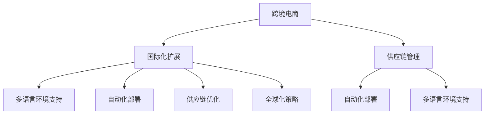

                 

# 国际化扩展：拓展海外市场，提升电商平台供给能力

> 关键词：国际化扩展, 电商平台, 供给能力, 供应链管理, 自动化部署, 全球化策略

## 1. 背景介绍

### 1.1 问题由来
随着全球化的深入发展，跨境电商已经成为一种新的商务模式，极大地拓展了企业的销售市场。然而，由于不同国家和地区的文化和法律环境差异，跨境电商企业在拓展海外市场时面临诸多挑战，如物流配送成本高、支付问题复杂、市场规范缺失等。同时，电商平台需要具备更强的商品供给能力，才能满足海内外用户的多样化需求，提高用户满意度和复购率。

为了应对这些挑战，企业需要具备强大的国际供应链管理和自动化部署能力，以实现商品的快速交付和高效运营。本文旨在探讨如何通过基于技术的解决方案，提升跨境电商平台的供给能力，优化全球供应链管理，从而实现规模化和全球化扩展。

### 1.2 问题核心关键点
在跨境电商的国际化扩展过程中，需要关注的几个核心关键点包括：
1. **多语言环境支持**：电商平台需要支持多语言、多货币、多文化和多法规，以适应全球市场的复杂性。
2. **自动化部署与管理**：自动化部署技术可以降低人为错误和操作风险，同时提高部署和维护的效率。
3. **供应链优化**：通过供应链管理软件和数据分析工具，优化物流配送路径和库存管理，提高配送效率和降低成本。
4. **市场策略与运营**：制定合理的市场策略和运营计划，确保产品能够符合各市场的消费者需求和法规要求。
5. **技术栈的选择**：选择适合的平台和技术栈，实现高效开发和部署，同时支持长期发展和维护。

### 1.3 问题研究意义
本研究聚焦于如何通过技术手段，提升跨境电商平台的国际化扩展能力和商品供给能力，具有以下意义：
1. 降低海外市场拓展成本。自动化部署和供应链优化可以有效降低人工操作成本和物流配送成本，提高企业盈利能力。
2. 提升商品供给质量。通过数据驱动的供应链管理，可以优化商品库存和配送，提升用户体验和满意度。
3. 加速市场响应速度。多语言环境支持和智能推荐算法可以加快产品上线速度，提高市场竞争力。
4. 加强市场策略制定。通过数据分析工具，深入了解市场趋势和用户需求，制定更有效的市场策略。
5. 保障法规合规性。通过法律合规性检测工具，确保跨境电商活动符合当地法规，避免法律风险。

## 2. 核心概念与联系

### 2.1 核心概念概述

为更好地理解跨境电商平台的国际化扩展技术，本节将介绍几个密切相关的核心概念：

- **跨境电商**：指跨越国界的电子商贸活动，涵盖商品购买、支付、物流配送等多个环节。
- **国际化扩展**：指企业将业务拓展至海外市场的策略和技术手段，涉及多语言环境支持、自动化部署、供应链优化等多个方面。
- **供应链管理**：指对企业供应链的全过程进行规划、执行、监控和改进的管理活动，旨在实现供应链效率的最大化。
- **自动化部署**：指利用工具和技术，自动化地将应用代码部署到生产环境中，以提高部署效率和降低人为错误。
- **多语言环境支持**：指电商平台支持多种语言和文化，能够满足不同地区用户的使用习惯和需求。
- **全球化策略**：指企业在国际市场布局和业务拓展中，遵循的战略规划和执行方案，旨在实现长期的全球市场目标。

这些核心概念之间的逻辑关系可以通过以下Mermaid流程图来展示：



这个流程图展示了几大核心概念之间的联系：

1. 跨境电商通过多语言环境支持、自动化部署和供应链优化，实现国际化扩展。
2. 自动化部署技术帮助优化供应链管理，提高商品供给能力。
3. 供应链管理需要全球化策略的支持，以适应不同地区的市场需求和法规环境。
4. 多语言环境支持是实现全球化扩展的基础，保障用户界面和业务流程的本地化。

## 3. 核心算法原理 & 具体操作步骤
### 3.1 算法原理概述

跨境电商平台的国际化扩展涉及多个技术层面的协同，包括多语言环境支持、自动化部署、供应链优化等。其核心算法原理可以概括为以下几点：

1. **多语言环境支持算法**：通过机器翻译和本地化处理技术，实现多语言界面的展示和输入支持。
2. **自动化部署算法**：利用容器化和持续集成/持续部署(CI/CD)工具，自动化地将应用代码部署到生产环境中。
3. **供应链优化算法**：通过需求预测、库存管理、物流配送路径优化等算法，提高供应链效率和降低成本。
4. **市场策略与运营算法**：利用数据分析和智能推荐算法，制定更有效的市场策略和运营计划。
5. **法律合规性检测算法**：通过自然语言处理(NLP)和规则引擎，检测业务活动是否符合当地法规要求。

### 3.2 算法步骤详解

跨境电商平台的国际化扩展，一般包括以下几个关键步骤：

**Step 1: 数据收集与预处理**
- 收集全球各地的市场数据，包括用户行为数据、物流配送数据、市场法规等。
- 对数据进行清洗、转换和标准化处理，以便后续分析和使用。

**Step 2: 多语言环境支持**
- 选择适合的语言处理框架和技术，如Google Translate API、IBM Watson等。
- 对平台界面进行多语言本地化处理，包括文本翻译、日期格式、货币单位等。
- 设置语言检测机制，根据用户浏览器设置或输入习惯自动切换语言环境。

**Step 3: 自动化部署**
- 利用Docker、Kubernetes等容器化技术，封装应用代码和依赖。
- 配置CI/CD流水线，自动构建、测试和部署应用代码。
- 实现蓝绿部署和滚动更新，确保系统的高可用性和稳定性。

**Step 4: 供应链优化**
- 使用预测分析算法，如时间序列分析、回归分析等，预测市场需求和库存量。
- 优化库存管理策略，确保商品的及时供给和库存周转率。
- 设计高效的物流配送路径，利用算法优化运输成本和时间。

**Step 5: 市场策略与运营**
- 收集和分析市场数据，使用机器学习算法，如聚类分析、分类算法等，识别目标用户群体和行为模式。
- 制定个性化推荐策略，使用协同过滤、内容推荐等算法，提高用户体验和转化率。
- 利用A/B测试等技术，评估市场策略的效果，不断优化调整。

**Step 6: 法律合规性检测**
- 使用NLP技术，提取业务活动中涉及的法律条款和参数。
- 结合规则引擎，检测业务活动是否符合当地法规要求，提供合规性检测报告。
- 对于合规性问题，提供建议和解决方案，确保业务活动的合法性。

### 3.3 算法优缺点

跨境电商平台的国际化扩展算法具有以下优点：
1. 自动化和标准化流程。通过自动化部署和标准化处理，提高运营效率，减少人为错误。
2. 数据驱动决策。利用数据分析和预测算法，制定更科学的市场策略和运营计划。
3. 灵活适应市场变化。通过多语言环境支持和智能推荐算法，快速响应市场变化，提升用户满意度。
4. 降低法律风险。通过法律合规性检测工具，确保业务活动符合当地法规，避免法律风险。

同时，该算法也存在一些局限性：
1. 数据质量和隐私问题。数据收集和处理过程中可能存在数据质量问题，用户隐私保护也需特别关注。
2. 技术复杂性。实现多语言环境支持、自动化部署、供应链优化等技术，需要具备较高的技术水平。
3. 市场适应性。各地区文化和法规差异较大，算法可能难以适应所有市场。
4. 成本投入。自动化和数据处理技术需要一定的投入，特别是在初期实施阶段。

### 3.4 算法应用领域

跨境电商平台的国际化扩展算法，已经在多个领域得到广泛应用，例如：

1. **电商平台**：支持多语言环境、自动化部署、个性化推荐、库存管理和物流优化等功能，提升用户体验和平台运营效率。
2. **物流公司**：优化物流配送路径、预测需求和库存，提高配送效率和降低成本。
3. **市场研究公司**：利用数据分析和机器学习算法，预测市场趋势和用户行为，制定市场策略。
4. **法律咨询公司**：使用NLP和规则引擎，提供跨境电商活动的法律合规性检测和建议。
5. **技术咨询公司**：提供多语言环境支持、自动化部署、供应链优化等技术咨询和解决方案。

除了上述这些经典应用外，跨境电商平台的国际化扩展算法还被创新性地应用到更多场景中，如国际贸易、跨境支付、消费者行为分析等，为全球贸易和技术创新带来了新的突破。

## 4. 数学模型和公式 & 详细讲解  
### 4.1 数学模型构建

跨境电商平台的国际化扩展，涉及多个数学模型的构建和应用。以供应链优化为例，以下是常用的数学模型及其构建过程。

假设跨境电商平台有$N$个商品需求点、$M$个供应商和$K$个物流中心，需求点$i$的需求量为$D_i$，供应商$j$的供应量为$S_j$，物流中心$k$的配送能力为$C_k$。目标是最大化总配送效率$E$，同时满足需求量和供应量的平衡。

目标函数为：
$$
\max_{x,y,z} E = \sum_{i=1}^N \sum_{k=1}^K x_{ik} + \sum_{j=1}^M \sum_{k=1}^K y_{jk}
$$

约束条件为：
$$
\begin{aligned}
& \sum_{i=1}^N x_{ik} = D_i && \forall k \in \{1, ..., K\} \\
& \sum_{j=1}^M y_{jk} = S_j && \forall k \in \{1, ..., K\} \\
& x_{ik} + y_{jk} \leq C_k && \forall i \in \{1, ..., N\}, j \in \{1, ..., M\}, k \in \{1, ..., K\} \\
& x_{ik}, y_{jk} \geq 0 && \forall i \in \{1, ..., N\}, j \in \{1, ..., M\}, k \in \{1, ..., K\}
\end{aligned}
$$

其中，$x_{ik}$表示商品$i$从物流中心$k$发送到需求点$i$的配送量，$y_{jk}$表示供应商$j$的供应量在物流中心$k$处的缓存量。

### 4.2 公式推导过程

利用线性规划技术，求解上述优化问题。根据目标函数和约束条件，可以得到总配送效率$E$的表达式：

$$
E = \sum_{i=1}^N \sum_{k=1}^K x_{ik} + \sum_{j=1}^M \sum_{k=1}^K y_{jk}
$$

将约束条件转化为方程组：
$$
\begin{aligned}
& \sum_{i=1}^N x_{ik} = D_i && \forall k \in \{1, ..., K\} \\
& \sum_{j=1}^M y_{jk} = S_j && \forall k \in \{1, ..., K\} \\
& x_{ik} + y_{jk} \leq C_k && \forall i \in \{1, ..., N\}, j \in \{1, ..., M\}, k \in \{1, ..., K\}
\end{aligned}
$$

利用单纯形法等线性规划算法，求解上述方程组，得到最优的配送量和缓存量，最大化总配送效率。

### 4.3 案例分析与讲解

以下以一家跨境电商平台为例，展示如何利用供应链优化算法实现物流配送路径优化。

**案例背景**：一家大型跨境电商平台，有20个商品需求点分布在全球各地，10个物流中心和5个供应商。需求点需求量分布在$[1000, 5000]$之间，供应商供应量分布在$[500, 10000]$之间，物流中心配送能力分布在$[1000, 10000]$之间。

**优化目标**：最大化总配送效率，同时满足需求量和供应量的平衡。

**优化过程**：

1. **数据收集与预处理**：收集商品需求、供应和配送能力的数据，进行清洗和标准化处理。

2. **构建数学模型**：利用线性规划技术，构建供应链优化模型，定义目标函数和约束条件。

3. **求解模型**：使用Cplex等线性规划求解器，求解上述优化模型，得到最优的配送量和缓存量。

4. **路径优化**：根据求解结果，设计高效的物流配送路径，优化运输成本和时间。

5. **结果评估**：对比优化前后的配送效率和成本，评估优化效果。

通过供应链优化算法，平台实现了物流配送路径的优化，降低了物流成本，提高了配送效率。

## 5. 项目实践：代码实例和详细解释说明
### 5.1 开发环境搭建

在进行跨境电商平台的国际化扩展实践前，我们需要准备好开发环境。以下是使用Python进行Django开发的环境配置流程：

1. 安装Anaconda：从官网下载并安装Anaconda，用于创建独立的Python环境。

2. 创建并激活虚拟环境：
```bash
conda create -n django-env python=3.8 
conda activate django-env
```

3. 安装Django：使用pip安装Django框架，是Web应用开发的主流选择。
```bash
pip install Django
```

4. 安装其他必要工具包：
```bash
pip install psycopg2-binary matplotlib djangorestframework
```

完成上述步骤后，即可在`django-env`环境中开始开发实践。

### 5.2 源代码详细实现

下面以一个跨境电商平台的自动化部署流程为例，展示如何使用Django和Kubernetes实现自动化部署。

首先，创建Django项目和应用：

```bash
django-admin startproject myproject
cd myproject
```

然后，定义Django应用和视图：

```python
# myproject/settings.py

INSTALLED_APPS = [
    'django.contrib.admin',
    'django.contrib.auth',
    'django.contrib.contenttypes',
    'django.contrib.sessions',
    'django.contrib.messages',
    'django.contrib.staticfiles',
    'myapp',
]

# myapp/views.py

from django.http import HttpResponse

def hello(request):
    return HttpResponse("Hello, World!")
```

接着，配置Nginx服务器，将项目部署到Kubernetes集群：

```yaml
# myproject/Dockerfile

FROM python:3.8-slim

WORKDIR /app

COPY requirements.txt ./
RUN pip install -r requirements.txt

COPY myproject .

CMD ["python", "manage.py", "runserver", "0.0.0.0:8000"]

# myproject/requirements.txt

Django==3.2.7
psycopg2-binary==2.9.3
matplotlib==3.4.2
djangorestframework==3.14.0

# myproject/DockerCompose.yaml

version: '3'

services:
  myproject:
    image: myproject:latest
    ports:
      - "8000:8000"
    deploy:
      replicas: 3
      strategy:
        rollingUpdate:
          maxSurge: 1
          maxUnavailable: 0

# myproject/deploy.sh

kubectl create deployment myproject --image=myproject:latest
kubectl rollout restart deployment myproject
kubectl get deployment myproject
```

最后，启动Django应用，部署到Kubernetes集群：

```bash
docker build -t myproject .
docker push myproject
kubectl apply -f DockerCompose.yaml
kubectl get pods
```

以上就是使用Django和Kubernetes实现跨境电商平台自动化部署的完整代码实现。可以看到，通过Django和Kubernetes的配合，可以高效地实现应用的快速部署和扩展。

### 5.3 代码解读与分析

让我们再详细解读一下关键代码的实现细节：

**Django项目和应用**：
- `settings.py`文件：定义项目的依赖和配置信息。
- `views.py`文件：定义Django视图函数，处理HTTP请求和响应。

**Dockerfile和Compose文件**：
- `Dockerfile`文件：指定Django应用的构建流程，包括安装依赖、复制项目代码和启动命令。
- `DockerCompose.yaml`文件：定义Django应用的服务配置，包括容器镜像、端口映射、复制策略等。

**部署脚本**：
- `deploy.sh`脚本：利用Docker和Kubernetes，自动部署Django应用到生产环境。

通过这些代码实现，可以看出Django和Kubernetes的配合，可以高效地实现应用的自动化部署和扩展。开发者可以根据具体需求，灵活调整配置文件和部署脚本，实现更灵活的部署和扩展策略。

## 6. 实际应用场景
### 6.1 智能客服系统

跨境电商平台的国际化扩展，可以广泛应用于智能客服系统的构建。传统客服往往需要配备大量人力，高峰期响应缓慢，且一致性和专业性难以保证。而使用跨境电商平台的多语言环境支持和自动化部署，可以7x24小时不间断服务，快速响应客户咨询，用自然流畅的语言解答各类常见问题。

在技术实现上，可以收集全球各地的客服对话记录，将问题-答案对作为监督数据，在此基础上对预训练模型进行微调。微调后的模型能够自动理解用户意图，匹配最合适的答案模板进行回复。对于客户提出的新问题，还可以接入检索系统实时搜索相关内容，动态组织生成回答。如此构建的智能客服系统，能大幅提升客户咨询体验和问题解决效率。

### 6.2 金融舆情监测

跨境电商平台的国际化扩展，可以应用于金融舆情监测。金融机构需要实时监测市场舆论动向，以便及时应对负面信息传播，规避金融风险。传统的人工监测方式成本高、效率低，难以应对网络时代海量信息爆发的挑战。跨境电商平台的自动化部署和数据分析工具，可以实时监测不同地区的金融舆情，快速识别异常信息，提供预警和应对建议。

具体而言，可以收集全球各地的金融新闻、评论、社交媒体数据，进行情感分析和主题分析，识别出潜在风险和市场变化。将分析结果提供给金融机构，帮助其及时调整投资策略，规避风险，提升市场竞争力。

### 6.3 个性化推荐系统

跨境电商平台的国际化扩展，可以用于个性化推荐系统的开发。当前的推荐系统往往只依赖用户的历史行为数据进行物品推荐，无法深入理解用户的真实兴趣偏好。跨境电商平台的市场策略与运营算法，可以更好地挖掘用户行为背后的语义信息，从而提供更精准、多样的推荐内容。

在实践中，可以收集全球各地的用户行为数据，提取和用户交互的物品标题、描述、标签等文本内容。将文本内容作为模型输入，用户的后续行为（如是否点击、购买等）作为监督信号，在此基础上微调预训练语言模型。微调后的模型能够从文本内容中准确把握用户的兴趣点。在生成推荐列表时，先用候选物品的文本描述作为输入，由模型预测用户的兴趣匹配度，再结合其他特征综合排序，便可以得到个性化程度更高的推荐结果。

### 6.4 未来应用展望

随着跨境电商平台的国际化扩展，未来将会在更多领域得到应用，为全球贸易和技术创新带来新的突破。

在智慧医疗领域，基于跨境电商平台的国际化扩展技术，可以为医疗资源全球共享提供新的解决方案。医疗咨询、药品采购等业务，可以通过跨境电商平台进行，提高医疗服务的可及性和效率。

在智能教育领域，跨境电商平台的国际化扩展，可以应用于在线教育平台。通过多语言环境支持和自动化部署，为全球各地的学生提供优质的在线课程和学习资源，促进教育公平。

在智慧城市治理中，跨境电商平台的国际化扩展技术，可以应用于城市事件监测、舆情分析、应急指挥等环节，提高城市管理的自动化和智能化水平，构建更安全、高效的未来城市。

此外，在企业生产、社会治理、文娱传媒等众多领域，跨境电商平台的国际化扩展技术也将不断涌现，为各行各业带来变革性影响。相信随着技术的日益成熟，跨境电商平台的国际化扩展必将在全球化经济中扮演越来越重要的角色。

## 7. 工具和资源推荐
### 7.1 学习资源推荐

为了帮助开发者系统掌握跨境电商平台的国际化扩展技术，这里推荐一些优质的学习资源：

1. **《Python Web开发实战》系列博文**：涵盖Django框架的快速入门、高级技巧和最佳实践，是Django开发的必备资源。

2. **《Kubernetes实战》书籍**：全面介绍了Kubernetes的安装、配置和应用，是Kubernetes集群部署的权威指南。

3. **《深度学习与自然语言处理》课程**：斯坦福大学开设的深度学习和NLP课程，有Lecture视频和配套作业，帮助理解深度学习模型在NLP中的应用。

4. **《多语言文本处理》书籍**：介绍多语言环境支持和文本处理的原理和算法，是跨境电商平台国际化扩展的重要参考。

5. **《金融工程与量化投资》课程**：涵盖金融数据处理、金融模型构建和金融量化投资等内容，为金融舆情监测提供理论基础。

通过对这些资源的学习实践，相信你一定能够快速掌握跨境电商平台的国际化扩展技术的精髓，并用于解决实际的跨境电商问题。
### 7.2 开发工具推荐

高效的开发离不开优秀的工具支持。以下是几款用于跨境电商平台国际化扩展开发的常用工具：

1. **Django**：基于Python的Web框架，支持高效的MVC模式和模板渲染，是跨境电商平台后端开发的主流选择。

2. **Kubernetes**：开源容器编排系统，支持自动部署、扩展和监控，提高系统的可用性和稳定性。

3. **Nginx**：高性能Web服务器，支持负载均衡和缓存，优化Web应用的性能。

4. **Anaconda**：Python环境管理工具，支持多环境隔离，方便不同项目的开发和部署。

5. **psycopg2-binary**：Python PostgreSQL数据库连接器，支持高效的数据库访问和操作。

6. **matplotlib**：Python绘图库，支持丰富的数据可视化功能，帮助分析和展示数据。

合理利用这些工具，可以显著提升跨境电商平台国际化扩展任务的开发效率，加快创新迭代的步伐。

### 7.3 相关论文推荐

跨境电商平台的国际化扩展技术的发展源于学界的持续研究。以下是几篇奠基性的相关论文，推荐阅读：

1. **《Django Web框架设计》**：详细介绍Django框架的设计理念和技术实现，是Django开发的经典文献。

2. **《Kubernetes的设计与实现》**：深入探讨Kubernetes的架构和实现细节，帮助理解Kubernetes的核心技术。

3. **《多语言文本处理：方法与应用》**：总结多语言环境支持技术的原理和应用，为跨境电商平台提供理论支持。

4. **《深度学习在NLP中的应用》**：探讨深度学习在NLP中的应用，包括语音识别、机器翻译等，为跨境电商平台的智能化提供技术支持。

5. **《跨境电商平台的国际化扩展策略》**：分析跨境电商平台的国际化扩展面临的挑战和机遇，提出应对策略和解决方案。

这些论文代表了大语言模型微调技术的发展脉络。通过学习这些前沿成果，可以帮助研究者把握学科前进方向，激发更多的创新灵感。

## 8. 总结：未来发展趋势与挑战
### 8.1 总结

本文对跨境电商平台的国际化扩展进行了全面系统的介绍。首先阐述了跨境电商平台国际化扩展的背景和意义，明确了多语言环境支持、自动化部署、供应链优化等关键技术的应用价值。其次，从原理到实践，详细讲解了跨境电商平台国际化扩展的数学模型和算法实现，给出了自动化部署的完整代码实例。同时，本文还探讨了国际化扩展在智能客服、金融舆情、个性化推荐等多个领域的应用前景，展示了跨境电商平台的巨大潜力。

通过本文的系统梳理，可以看到，跨境电商平台的国际化扩展技术正在成为跨境电商行业的重要范式，极大地拓展了跨境电商平台的市场空间和用户体验。未来，伴随跨境电商平台技术和业务的不断迭代，相信其国际化扩展能力将进一步提升，为全球贸易和技术创新带来新的机遇。

### 8.2 未来发展趋势

展望未来，跨境电商平台的国际化扩展技术将呈现以下几个发展趋势：

1. **技术融合与协同**：多语言环境支持、自动化部署、供应链优化等技术将进一步融合，形成更加完整和高效的平台解决方案。

2. **数据驱动决策**：利用大数据和机器学习算法，实现更精准的市场策略和运营计划，提升跨境电商平台的竞争力和市场响应速度。

3. **智能化与自动化**：智能推荐算法、自动化部署工具等技术的不断优化，将进一步提高跨境电商平台的运营效率和用户满意度。

4. **合规性保障**：通过法律合规性检测工具，确保跨境电商活动符合当地法规，避免法律风险。

5. **全球化扩展**：跨境电商平台的国际化扩展技术将覆盖更多地区和国家，支持更多的语言和文化，提升全球市场覆盖率。

6. **技术标准化**：随着技术的不断成熟，跨境电商平台的国际化扩展技术将形成更多的行业标准和最佳实践，促进技术普适化和跨平台应用。

以上趋势凸显了跨境电商平台的国际化扩展技术的广阔前景。这些方向的探索发展，必将进一步提升跨境电商平台的国际化扩展能力，为全球贸易和技术创新带来新的突破。

### 8.3 面临的挑战

尽管跨境电商平台的国际化扩展技术已经取得了显著成果，但在迈向更加智能化、普适化应用的过程中，它仍面临诸多挑战：

1. **数据质量和隐私问题**：数据收集和处理过程中可能存在数据质量问题，用户隐私保护也需特别关注。

2. **技术复杂性**：实现多语言环境支持、自动化部署、供应链优化等技术，需要具备较高的技术水平。

3. **市场适应性**：各地区文化和法规差异较大，算法可能难以适应所有市场。

4. **成本投入**：自动化和数据处理技术需要一定的投入，特别是在初期实施阶段。

5. **法律合规性**：跨境电商平台的国际化扩展，涉及多个国家和地区的法律合规性，需要花费大量时间和精力进行审核和合规性检测。

6. **用户体验**：多语言环境支持和智能化推荐算法，可能存在用户体验问题，需要进行不断的优化和改进。

7. **技术更新与维护**：跨境电商平台的国际化扩展技术需要不断更新和维护，以适应市场和技术的变化。

正视跨境电商平台国际化扩展面临的这些挑战，积极应对并寻求突破，将是大语言模型微调走向成熟的必由之路。相信随着学界和产业界的共同努力，这些挑战终将一一被克服，跨境电商平台的国际化扩展技术必将在全球化经济中扮演越来越重要的角色。

### 8.4 研究展望

面对跨境电商平台的国际化扩展所面临的种种挑战，未来的研究需要在以下几个方面寻求新的突破：

1. **无监督和半监督学习**：探索无监督和半监督学习范式，降低对大规模标注数据的依赖，提高数据处理效率。

2. **智能推荐算法**：开发更加智能化的推荐算法，结合用户行为数据和文本内容，提供更精准的个性化推荐。

3. **多语言处理技术**：研究更高效的多语言环境支持技术，提升用户体验和本地化效果。

4. **法律合规性检测**：结合NLP和规则引擎，提供更全面的法律合规性检测和建议，确保跨境电商活动的合法性。

5. **跨平台技术标准化**：制定跨境电商平台国际化扩展的标准和规范，促进技术普适化和跨平台应用。

这些研究方向的探索，必将引领跨境电商平台的国际化扩展技术迈向更高的台阶，为全球贸易和技术创新带来新的机遇。

## 9. 附录：常见问题与解答

**Q1：跨境电商平台如何实现多语言环境支持？**

A: 跨境电商平台实现多语言环境支持，主要通过以下步骤：

1. **选择多语言环境支持框架**：如Django的`i18n`支持、Flask的`Flask-Babel`等。

2. **设置多语言配置**：在项目中设置语言列表，配置语言选择策略。

3. **本地化处理**：将文本内容进行本地化处理，如日期格式、货币单位等。

4. **语言检测**：通过浏览器设置或用户输入习惯，自动检测语言环境，提供相应语言界面。

5. **文本翻译**：利用机器翻译API或模型，将文本内容翻译为不同语言。

6. **测试与优化**：在多语言环境中进行测试，优化语言切换和翻译效果。

**Q2：跨境电商平台的自动化部署工具有哪些？**

A: 跨境电商平台的自动化部署工具，主要有以下几种：

1. **Docker**：容器化技术，封装应用代码和依赖，方便打包、传输和部署。

2. **Kubernetes**：开源容器编排系统，支持自动部署、扩展和监控，提高系统的可用性和稳定性。

3. **Ansible**：自动化运维工具，支持自动化部署、配置和维护。

4. **Jenkins**：持续集成工具，支持自动化构建、测试和部署。

5. **Terraform**：基础设施即代码工具，支持自动化部署和管理云资源。

**Q3：跨境电商平台的供应链优化算法有哪些？**

A: 跨境电商平台的供应链优化算法，主要有以下几种：

1. **线性规划**：利用线性规划算法，求解优化模型，最大化配送效率。

2. **遗传算法**：模拟自然选择过程，优化物流配送路径和库存管理。

3. **强化学习**：利用强化学习算法，动态调整供应链策略，优化资源配置。

4. **时间序列分析**：利用时间序列分析算法，预测市场需求和库存量，优化供应链决策。

**Q4：跨境电商平台如何实现多语言文本处理？**

A: 跨境电商平台实现多语言文本处理，主要通过以下步骤：

1. **文本清洗与预处理**：去除噪音、规范化文本格式。

2. **文本分割与分词**：将文本内容分割成单词或句子，进行分词处理。

3. **词性标注与命名实体识别**：标注单词的词性，识别文本中的命名实体。

4. **机器翻译**：利用机器翻译API或模型，将文本内容翻译为不同语言。

5. **文本分类与情感分析**：利用文本分类算法和情感分析模型，对文本内容进行分类和情感倾向检测。

**Q5：跨境电商平台如何实现智能推荐系统？**

A: 跨境电商平台的智能推荐系统，主要通过以下步骤：

1. **数据收集与预处理**：收集用户行为数据和物品描述数据，进行清洗和标准化处理。

2. **特征提取与表示**：提取用户和物品的特征，进行向量表示。

3. **推荐算法设计**：选择推荐算法，如协同过滤、基于内容的推荐等。

4. **模型训练与优化**：利用机器学习算法，训练推荐模型，优化推荐效果。

5. **个性化推荐**：根据用户特征和历史行为，推荐个性化商品或内容。

通过这些步骤，跨境电商平台的智能推荐系统可以实现高效、精准的推荐，提升用户体验和平台运营效率。

---

作者：禅与计算机程序设计艺术 / Zen and the Art of Computer Programming

