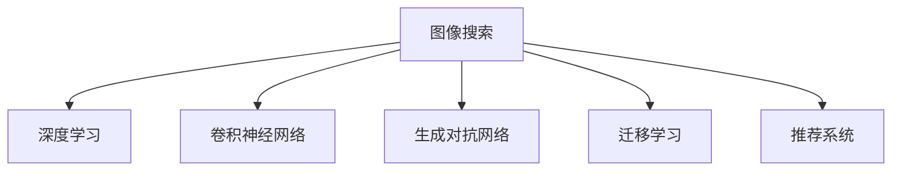

                 

# 图像搜索技术在电商领域的应用：发展趋势与未来

## 1. 背景介绍

### 1.1 问题由来

在电商领域，图像搜索技术的应用已经成为了消费者购物体验的重要组成部分。传统的文本搜索方式无法准确捕捉产品的外观特征，图像搜索技术的兴起则有效解决了这一痛点。通过将图片与用户输入的查询图像进行匹配，电商平台能够快速推荐出与用户需求相符的商品。

近年来，随着深度学习和大数据技术的飞速发展，图像搜索技术的性能和应用范围都有了显著提升。各大电商平台如淘宝、京东、亚马逊等，纷纷引入图像搜索技术，提升用户体验，同时降低商品推荐中的误判率。本文将详细分析图像搜索技术在电商领域的应用，探讨其发展趋势和未来方向。

### 1.2 问题核心关键点

图像搜索技术在电商领域的核心关键点包括：
1. 如何高效构建并训练图像搜索模型。
2. 如何确保图像搜索的准确性和召回率。
3. 如何优化图像搜索系统的性能和用户体验。
4. 如何应对图像搜索过程中可能出现的数据安全和隐私问题。

## 2. 核心概念与联系

### 2.1 核心概念概述

为更好地理解图像搜索技术在电商领域的应用，本节将介绍几个密切相关的核心概念：

- 图像搜索(Image Search)：利用计算机视觉技术，对图像内容进行分析，找到与用户输入图像最相似的图像或商品的技术。
- 深度学习(Deep Learning)：基于神经网络模型，通过多层非线性变换，自动从数据中学习特征表示，实现高精度的图像匹配和检索。
- 卷积神经网络(Convolutional Neural Networks, CNNs)：一种常用于图像处理的深度学习模型，通过卷积操作提取图像特征。
- 生成对抗网络(Generative Adversarial Networks, GANs)：一种用于生成和增强图像数据的技术，可以提升图像搜索的准确性和多样性。
- 迁移学习(Transfer Learning)：通过预训练模型在下游任务上的微调，提升模型在特定领域图像搜索的性能。
- 推荐系统(Recommender System)：结合图像搜索结果和用户行为数据，为用户推荐更符合其偏好的商品。

这些核心概念之间的逻辑关系可以通过以下Mermaid流程图来展示：



这个流程图展示了几大核心概念之间的联系：

1. 图像搜索基于深度学习模型，特别是卷积神经网络，进行图像特征提取和匹配。
2. 生成对抗网络可以用于生成和增强图像数据，提升图像搜索的质量。
3. 迁移学习使得模型能够更好地适应特定领域的需求。
4. 推荐系统结合图像搜索结果和用户行为数据，为用户推荐相关商品。

## 3. 核心算法原理 & 具体操作步骤
### 3.1 算法原理概述

图像搜索技术在电商领域的应用，本质上是将用户输入的查询图像与商品图像进行匹配，找到最相关的商品。其主要算法流程如下：

1. **特征提取**：使用卷积神经网络对用户输入的查询图像和商品图像进行特征提取。
2. **相似度计算**：将查询图像和商品图像的特征向量进行相似度计算，得到匹配分数。
3. **召回与排序**：根据匹配分数对商品进行召回和排序，返回用户最相关的商品列表。
4. **推荐系统整合**：将图像搜索结果与用户行为数据结合，通过推荐系统生成最终的商品推荐。

### 3.2 算法步骤详解

以下以一个基本的图像搜索模型为例，详细讲解其核心算法步骤：

**Step 1: 数据准备与模型搭建**

1. **数据收集**：收集电商平台上商品的高质量图像，并对图像进行标注，构建图像搜索数据集。
2. **模型搭建**：搭建卷积神经网络模型，并进行预训练，初始化权重。

**Step 2: 特征提取与相似度计算**

1. **特征提取**：使用卷积神经网络对查询图像和商品图像进行特征提取，得到高维特征向量。
2. **相似度计算**：使用余弦相似度、欧式距离等方法计算查询图像和商品图像特征向量之间的相似度分数。

**Step 3: 召回与排序**

1. **召回**：根据相似度分数，选择与查询图像最相关的商品图像，并返回一定数量的图像作为搜索结果。
2. **排序**：根据相似度分数对商品图像进行排序，生成最终的商品推荐列表。

**Step 4: 推荐系统整合**

1. **行为数据整合**：将用户的行为数据（如浏览记录、购买历史等）与图像搜索结果结合。
2. **推荐模型训练**：使用机器学习算法（如协同过滤、矩阵分解等）训练推荐模型，生成个性化商品推荐。

### 3.3 算法优缺点

图像搜索技术在电商领域的应用具有以下优点：
1. **提升用户体验**：通过图像搜索，用户能够快速找到所需商品，提升了购物体验。
2. **降低误判率**：图像搜索能够精确匹配商品外观，降低了推荐系统中的误判率。
3. **精准推荐**：结合用户行为数据，图像搜索结果能够更精准地推荐商品。

同时，该技术也存在一些局限性：
1. **数据需求量大**：图像搜索需要大量高质量的商品图像数据，数据获取和标注成本较高。
2. **计算资源消耗大**：特征提取和相似度计算等步骤计算量较大，需要高性能计算资源。
3. **隐私和安全问题**：图像搜索过程中涉及用户隐私数据，需要谨慎处理。

### 3.4 算法应用领域

图像搜索技术在电商领域的应用已经相当广泛，以下是几个典型的应用场景：

**1. 商品检索**

电商平台上，用户可以通过上传商品图片，快速找到相似的商品。该功能可以帮助用户更高效地发现所需商品。

**2. 个性化推荐**

结合用户浏览历史和搜索记录，图像搜索可以生成个性化的商品推荐列表，提升用户的购物体验。

**3. 新商品发布**

商家可以通过上传新商品的图片，自动检索出相似商品，快速了解市场需求和竞争情况，优化商品策略。

**4. 智能客服**

智能客服可以通过图像搜索，快速识别用户上传的商品图片，并提供相关的解决方案，提升客户服务质量。

## 4. 数学模型和公式 & 详细讲解 & 举例说明
### 4.1 数学模型构建

本节将使用数学语言对图像搜索技术在电商领域的应用进行更加严格的刻画。

假设查询图像和商品图像的特征向量分别为 $X$ 和 $Y$，图像搜索模型的目标是找到与查询图像最相似的 $K$ 个商品图像，输出相似度分数 $S$。

定义相似度函数 $f$，将特征向量映射到实数域。相似度分数 $S$ 的计算公式为：

$$
S = \frac{\exp(f(X,Y))}{\sum_{i=1}^K \exp(f(X,Y_i))}
$$

其中 $f(X,Y)$ 表示查询图像 $X$ 和商品图像 $Y$ 之间的相似度函数，$Y_i$ 表示第 $i$ 个商品图像的特征向量。

### 4.2 公式推导过程

以下推导以余弦相似度为例，说明相似度计算的具体过程：

假设查询图像和商品图像的特征向量分别为 $X$ 和 $Y$，向量长度为 $d$，余弦相似度计算公式为：

$$
\cos(\theta) = \frac{\vec{X} \cdot \vec{Y}}{\|\vec{X}\|\|\vec{Y}\|}
$$

其中 $\vec{X}$ 和 $\vec{Y}$ 分别表示查询图像和商品图像的特征向量，$\|\vec{X}\|$ 和 $\|\vec{Y}\|$ 分别表示向量长度。

将余弦相似度函数带入图像搜索模型的相似度计算公式中，得到：

$$
S = \frac{\exp(\cos(\theta))}{\sum_{i=1}^K \exp(\cos(\theta_i))}
$$

其中 $\theta_i$ 表示查询图像 $X$ 和第 $i$ 个商品图像 $Y_i$ 之间的余弦角度。

### 4.3 案例分析与讲解

假设查询图像和商品图像的特征向量分别为 $X$ 和 $Y$，长度为 $d$。使用余弦相似度计算查询图像与商品图像的相似度分数，具体步骤如下：

1. **特征提取**：使用卷积神经网络提取查询图像和商品图像的特征向量 $X$ 和 $Y$，长度为 $d$。
2. **余弦相似度计算**：计算查询图像和商品图像的余弦相似度 $\cos(\theta)$。
3. **相似度分数计算**：将余弦相似度带入相似度计算公式，得到相似度分数 $S$。

例如，查询图像为一件红色T恤，商品图像为两件不同品牌、不同风格的红色T恤，特征向量分别为 $X_1$ 和 $X_2$。余弦相似度计算如下：

$$
\cos(\theta_1) = \frac{\vec{X_1} \cdot \vec{Y}}{\|\vec{X_1}\|\|\vec{Y}\|} \\
\cos(\theta_2) = \frac{\vec{X_2} \cdot \vec{Y}}{\|\vec{X_2}\|\|\vec{Y}\|}
$$

计算出相似度分数 $S_1$ 和 $S_2$，并根据相似度分数进行排序，生成最终的商品推荐列表。

## 5. 项目实践：代码实例和详细解释说明
### 5.1 开发环境搭建

在进行图像搜索技术在电商领域的应用开发前，我们需要准备好开发环境。以下是使用Python进行图像搜索的开发环境配置流程：

1. **安装Python**：下载并安装Python 3.x版本，并配置系统环境变量。
2. **安装TensorFlow**：使用pip命令安装TensorFlow 2.x版本，确保与Python版本兼容。
3. **安装OpenCV**：使用pip命令安装OpenCV库，用于图像处理和特征提取。
4. **安装NumPy和SciPy**：使用pip命令安装NumPy和SciPy库，用于数据处理和计算。
5. **安装Scikit-Learn**：使用pip命令安装Scikit-Learn库，用于机器学习模型的训练和评估。

完成上述步骤后，即可在Python环境下进行图像搜索技术的开发。

### 5.2 源代码详细实现

以下是一个简单的图像搜索系统的Python代码实现：

```python
import tensorflow as tf
import numpy as np
import cv2
from sklearn.metrics.pairwise import cosine_similarity

# 加载预训练的卷积神经网络模型
model = tf.keras.applications.MobileNetV2(weights='imagenet')

# 加载查询图像和商品图像
query_image = cv2.imread('query_image.jpg')
product_images = [cv2.imread('product_image1.jpg'), cv2.imread('product_image2.jpg'), cv2.imread('product_image3.jpg')]

# 特征提取
query_features = model.predict(query_image).reshape(1, 1280)
product_features = []
for img in product_images:
    img = cv2.resize(img, (224, 224))
    img = np.array(img)
    img = img.reshape((1, 224, 224, 3))
    img = tf.keras.applications.mobilenet_v2.preprocess_input(img)
    product_features.append(model.predict(img))

# 相似度计算
similarity_scores = cosine_similarity(query_features, product_features)

# 排序
top_k_indices = np.argsort(similarity_scores)[::-1][:5]
top_k_images = [product_images[i] for i in top_k_indices]

# 显示推荐结果
for i, img in enumerate(top_k_images):
    cv2.imshow(f"Product {i+1}", img)
    cv2.waitKey(0)
    cv2.destroyAllWindows()
```

### 5.3 代码解读与分析

**代码实现流程**：

1. **加载模型**：使用TensorFlow加载预训练的MobileNetV2模型，作为特征提取的基础模型。
2. **加载图像**：加载查询图像和商品图像，并进行预处理。
3. **特征提取**：使用MobileNetV2模型对查询图像和商品图像进行特征提取，得到高维特征向量。
4. **相似度计算**：使用Scikit-Learn库中的cosine_similarity函数计算查询图像和商品图像特征向量之间的相似度分数。
5. **排序**：根据相似度分数对商品图像进行排序，选择最相关的商品图像。
6. **显示推荐结果**：将推荐结果可视化展示。

**代码关键点解析**：

- **特征提取**：使用预训练的MobileNetV2模型进行特征提取，模型已经在大规模图像数据上进行了预训练，具有较高的特征提取能力。
- **相似度计算**：使用余弦相似度计算查询图像和商品图像特征向量之间的相似度分数，余弦相似度可以有效地衡量向量之间的相似性。
- **排序**：通过排序算法选择最相关的商品图像，推荐给用户。

## 6. 实际应用场景
### 6.1 智能客服

智能客服系统可以结合图像搜索技术，快速识别用户上传的商品图片，并提供相关的解决方案。该功能能够大幅提升客户服务质量，降低客服人员的工作压力。

**应用示例**：用户在智能客服系统中上传商品图片，系统自动搜索相似商品，并给出相关解答或推荐链接。

**技术实现**：使用图像搜索技术，快速找到与用户上传的图片最相似的商品，结合知识库生成答案或推荐。

### 6.2 个性化推荐

个性化推荐系统可以结合图像搜索技术，生成用户个性化的商品推荐。该功能能够提升用户购物体验，增加电商平台的用户粘性。

**应用示例**：用户在电商平台浏览商品时上传图片，系统自动搜索相似商品，并生成个性化的推荐列表。

**技术实现**：使用图像搜索技术，搜索与用户浏览图片相似的商品，结合用户行为数据生成推荐列表。

### 6.3 新商品发布

商家可以通过图像搜索技术，快速检索出与新商品相似的商品，了解市场需求和竞争情况，优化商品策略。

**应用示例**：商家发布新产品，系统自动搜索相似商品，提供市场分析报告。

**技术实现**：使用图像搜索技术，搜索与新商品相似的商品，结合市场分析工具生成报告。

### 6.4 未来应用展望

未来，图像搜索技术在电商领域的应用将进一步拓展，具体趋势如下：

**1. 实时图像搜索**

实时图像搜索技术能够提升用户体验，提高电商平台的响应速度。用户上传图片后，系统立即生成搜索结果，提升购物效率。

**2. 跨平台搜索**

跨平台图像搜索技术能够打破平台限制，用户在不同平台上上传图片，系统能够进行跨平台搜索，提供统一的搜索结果。

**3. 语义搜索**

结合自然语言处理技术，语义搜索技术能够理解用户输入的查询，提供更精准的搜索结果。用户可以通过自然语言描述商品特征，系统自动生成搜索结果。

**4. 增强现实**

增强现实技术结合图像搜索，用户可以通过手机或AR眼镜查看虚拟商品，进行互动体验，提升购物体验。

## 7. 工具和资源推荐
### 7.1 学习资源推荐

为了帮助开发者系统掌握图像搜索技术在电商领域的应用，这里推荐一些优质的学习资源：

1. **TensorFlow官方文档**：TensorFlow官方文档详细介绍了图像搜索的实现流程，包括数据预处理、模型训练和评估等环节。
2. **Scikit-Learn官方文档**：Scikit-Learn官方文档介绍了常用的机器学习算法，如余弦相似度、欧式距离等，可以用于相似度计算。
3. **Coursera《深度学习》课程**：Coursera《深度学习》课程由斯坦福大学教授Andrew Ng主讲，详细介绍了深度学习的基本原理和应用，涵盖图像搜索等常见任务。
4. **PyTorch官方文档**：PyTorch官方文档介绍了深度学习模型的搭建和训练，包括卷积神经网络等模型。

通过对这些资源的学习实践，相信你一定能够快速掌握图像搜索技术在电商领域的应用，并用于解决实际的图像搜索问题。

### 7.2 开发工具推荐

高效的开发离不开优秀的工具支持。以下是几款用于图像搜索开发的常用工具：

1. **TensorFlow**：基于Python的开源深度学习框架，适合大规模图像处理和特征提取任务。
2. **Keras**：基于TensorFlow的高级深度学习库，使用简单，适合快速原型开发。
3. **OpenCV**：开源计算机视觉库，提供了丰富的图像处理和特征提取功能。
4. **Scikit-Learn**：Python科学计算库，提供了常用的机器学习算法和工具。
5. **Jupyter Notebook**：交互式笔记本工具，适合快速迭代和测试代码。

合理利用这些工具，可以显著提升图像搜索技术的开发效率，加快创新迭代的步伐。

### 7.3 相关论文推荐

图像搜索技术在电商领域的应用源于学界的持续研究。以下是几篇奠基性的相关论文，推荐阅读：

1. **Image Search Engine Using Deep Learning**：DeepMind发表的论文，展示了使用卷积神经网络进行图像搜索的可行性。
2. **Semantic Image Search**：Google发表的论文，介绍了结合自然语言处理技术，实现语义图像搜索的流程。
3. **Product Recommendation System Using Image Search**：淘宝发表的论文，介绍了基于图像搜索的个性化推荐系统，提升了用户购物体验。

这些论文代表了大规模图像搜索技术的发展脉络。通过学习这些前沿成果，可以帮助研究者把握学科前进方向，激发更多的创新灵感。

## 8. 总结：未来发展趋势与挑战
### 8.1 总结

本文对图像搜索技术在电商领域的应用进行了全面系统的介绍。首先阐述了图像搜索技术的发展背景和实际应用，明确了其在提升用户体验、降低误判率等方面的独特价值。其次，从原理到实践，详细讲解了图像搜索的核心算法步骤，给出了图像搜索任务开发的完整代码实例。同时，本文还广泛探讨了图像搜索技术在智能客服、个性化推荐等电商领域的应用前景，展示了其在电商领域中的巨大潜力。最后，本文精选了图像搜索技术的各类学习资源，力求为读者提供全方位的技术指引。

通过本文的系统梳理，可以看到，图像搜索技术在电商领域的应用已经取得了显著进展，为电商平台的创新和升级提供了新的路径。未来，伴随深度学习和大数据技术的持续演进，图像搜索技术有望在更广泛的场景中得到应用，进一步提升电商平台的智能化水平。

### 8.2 未来发展趋势

展望未来，图像搜索技术在电商领域的应用将呈现以下几个发展趋势：

**1. 实时性和性能提升**

实时性是电商平台用户体验的关键指标，图像搜索技术的实时性将继续提升，以支持高并发和高频率的图像搜索需求。未来将采用更高效的特征提取算法和相似度计算方法，提升系统的响应速度和性能。

**2. 跨平台和多模态融合**

跨平台和多模态融合技术将进一步拓展图像搜索的应用范围，打破平台和模态的限制，提升用户体验和搜索效果。跨平台图像搜索和多模态融合技术将结合自然语言处理、增强现实等技术，提供更丰富、更直观的搜索体验。

**3. 个性化推荐与用户行为分析结合**

图像搜索技术将与用户行为分析技术结合，生成更精准的个性化推荐。系统可以结合用户的历史行为数据，推荐更符合用户偏好的商品，提升用户满意度和购买转化率。

**4. 数据安全与隐私保护**

图像搜索技术涉及用户的隐私数据，如何保护用户隐私和数据安全将成为重要的研究方向。未来将采用更先进的数据加密和隐私保护技术，确保用户数据的安全性和隐私性。

### 8.3 面临的挑战

尽管图像搜索技术在电商领域的应用已经取得了瞩目成就，但在迈向更加智能化、普适化应用的过程中，它仍面临诸多挑战：

**1. 数据需求量大**

图像搜索需要大量的高质量商品图像数据，数据获取和标注成本较高。如何高效获取并标注数据，降低成本，将是未来需要解决的问题。

**2. 计算资源消耗大**

特征提取和相似度计算等步骤计算量较大，需要高性能计算资源。如何优化算法和模型，减少计算资源消耗，提升系统性能，将是重要的研究方向。

**3. 隐私和安全问题**

图像搜索涉及用户的隐私数据，如何保护用户隐私和数据安全将成为重要的研究方向。未来将采用更先进的数据加密和隐私保护技术，确保用户数据的安全性和隐私性。

### 8.4 研究展望

面对图像搜索技术面临的挑战，未来的研究需要在以下几个方面寻求新的突破：

**1. 无监督和半监督学习**

无监督和半监督学习将降低对大量标注数据的需求，通过自监督学习、主动学习等方法，最大限度利用非结构化数据，实现更高效、更灵活的图像搜索。

**2. 迁移学习与微调**

迁移学习与微调技术将提升图像搜索模型的泛化能力，通过在特定领域数据上进行微调，提升模型在特定任务上的性能。

**3. 多模态融合**

多模态融合技术将结合视觉、语音、文本等多种模态数据，提升图像搜索的准确性和多样性。多模态融合技术将结合自然语言处理、增强现实等技术，提供更丰富、更直观的搜索体验。

**4. 深度学习与计算加速**

深度学习与计算加速技术将进一步提升图像搜索的性能和实时性。未来将采用更高效的深度学习模型和更先进的计算加速技术，提升系统的响应速度和性能。

## 9. 附录：常见问题与解答
### 9.1 Q1：图像搜索技术是否适用于所有电商场景？

**A**：图像搜索技术在大多数电商场景中都能发挥良好的效果，特别是在商品展示和推荐等方面。但是对于一些特殊的电商场景，如生鲜电商、工业品电商等，由于其特殊性，图像搜索技术的应用可能会受到一定的限制。

### 9.2 Q2：如何提高图像搜索系统的准确性和召回率？

**A**：提高图像搜索系统的准确性和召回率，可以从以下几个方面入手：

1. **数据质量**：保证数据的质量和多样性，使用高分辨率、高质量的商品图片。
2. **模型优化**：使用更先进的特征提取和相似度计算模型，如Transformer等，提升模型的性能。
3. **数据增强**：通过对图像进行旋转、缩放、变形等处理，扩充训练数据集，提升模型的鲁棒性。
4. **多模态融合**：结合自然语言处理和增强现实技术，提升系统的搜索效果和用户体验。

### 9.3 Q3：图像搜索技术在电商领域是否存在安全隐患？

**A**：图像搜索技术在电商领域的应用确实存在安全隐患，主要体现在以下几个方面：

1. **数据隐私**：用户上传的图像可能包含隐私信息，如个人身份信息等，如何保护用户隐私将是重要的研究方向。
2. **恶意攻击**：恶意用户可能会上传假冒商品图片，误导其他用户，系统需要采取安全防护措施，防止恶意攻击。

### 9.4 Q4：图像搜索技术在电商领域有哪些应用场景？

**A**：图像搜索技术在电商领域的应用场景非常广泛，包括但不限于以下几个方面：

1. **商品检索**：用户上传商品图片，系统自动搜索相似商品，提升购物效率。
2. **个性化推荐**：结合用户行为数据，生成个性化的商品推荐列表，提升用户购物体验。
3. **智能客服**：系统自动搜索相似商品，并提供相关解答或推荐链接，提升客户服务质量。
4. **新商品发布**：商家通过上传新商品图片，系统自动搜索相似商品，提供市场分析报告。

---

作者：禅与计算机程序设计艺术 / Zen and the Art of Computer Programming

