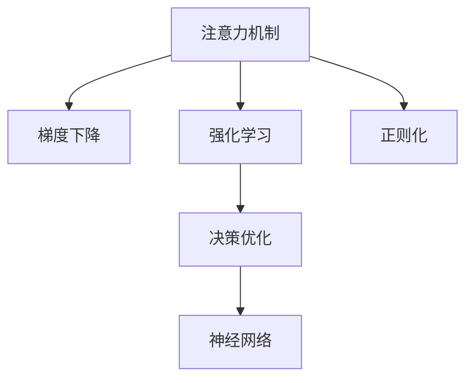

                 

# 在AI驱动的环境中优化注意力

> 关键词：注意力机制,深度学习,强化学习,优化算法,强化学习,模型训练,决策优化,神经网络,梯度下降,权重调整

## 1. 背景介绍

### 1.1 问题由来

随着人工智能(AI)技术的发展，尤其是深度学习(Deep Learning)和强化学习(Reinforcement Learning)的进步，人们开始探索如何在大规模、复杂任务中优化模型的决策和控制能力。注意力机制作为这些技术的重要组成部分，已经广泛应用于图像识别、自然语言处理、推荐系统、游戏策略等领域，成为优化决策和提升性能的关键手段。

注意力机制通过动态调整模型的关注点，使得模型能够更加有效地处理输入数据，识别和提取重要信息，并据此进行决策。这种机制在处理长序列、多模态数据时尤为重要，可以有效提高模型的泛化能力和鲁棒性。

### 1.2 问题核心关键点

1. 注意力机制在AI模型中的核心作用：通过调整权重，聚焦重要信息，提升模型决策的精确度。
2. 优化算法在注意力机制中的关键作用：如梯度下降、Adam等，通过反向传播更新模型参数，优化注意力机制的实现。
3. 强化学习在优化注意力机制中的创新应用：通过奖励机制，不断优化模型的决策策略。
4. 模型训练过程中的参数调整：通过学习率、正则化等方法，优化模型的参数，提高注意力机制的稳定性和可靠性。
5. 决策优化算法的选择：如遗传算法、模拟退火等，优化注意力机制的参数配置，提升模型性能。

这些关键点构成了优化注意力机制的理论基础和实践框架，使得AI模型能够在复杂多变的任务中，快速、准确地进行决策。

### 1.3 问题研究意义

优化注意力机制对于AI技术的应用具有重要意义：

1. 提升模型性能：通过优化注意力机制，模型能够更有效地处理长序列、多模态数据，提高决策的准确性和鲁棒性。
2. 加速模型训练：优化注意力机制能够减少不必要的信息处理，提升模型的训练效率。
3. 拓展应用领域：优化注意力机制使得AI技术能够应用于更多复杂任务，如自动驾驶、医疗诊断等。
4. 增强模型的可解释性：优化注意力机制能够揭示模型内部决策的逻辑和依据，提升模型的可解释性。
5. 强化学习在优化过程中的应用：通过奖励机制和探索机制，优化注意力机制能够更好地应对未知情况，提高模型的自适应能力。

## 2. 核心概念与联系

### 2.1 核心概念概述

为更好地理解优化注意力机制，本节将介绍几个密切相关的核心概念：

- 注意力机制(Attention Mechanism)：通过动态调整模型的权重，使得模型能够聚焦于输入数据中的关键部分，提升决策的精确度和效率。
- 梯度下降(Gradient Descent)：一种常用的优化算法，通过反向传播计算梯度，更新模型参数，使得损失函数最小化。
- 强化学习(Reinforcement Learning)：一种学习范式，通过奖励机制引导模型进行决策优化。
- 正则化(Regularization)：一种防止过拟合的技术，通过引入L2正则、Dropout等方法，提高模型的泛化能力和鲁棒性。
- 决策优化(Decision Optimization)：通过优化算法，选择最佳的决策策略，提升模型的整体性能。
- 神经网络(Neural Networks)：一种计算模型，通过层级化的处理单元，实现复杂的非线性映射。

这些核心概念之间的逻辑关系可以通过以下Mermaid流程图来展示：



这个流程图展示了大规模AI模型优化中核心概念之间的联系：

1. 注意力机制通过梯度下降进行优化，使得模型能够更好地聚焦关键信息。
2. 强化学习通过奖励机制，不断调整决策策略，优化注意力机制的实现。
3. 决策优化通过算法选择，提升模型的整体性能。
4. 神经网络通过层级化的结构，实现复杂的决策处理。
5. 正则化通过防止过拟合，提高模型的泛化能力和鲁棒性。

这些概念共同构成了AI模型优化的理论基础和实践框架，使得模型能够在各种复杂任务中，高效、准确地进行决策。

## 3. 核心算法原理 & 具体操作步骤
### 3.1 算法原理概述

优化注意力机制的基本思想是通过梯度下降等优化算法，动态调整模型的权重，使得模型能够更加精确地聚焦输入数据中的关键部分。其核心步骤包括：

1. 计算注意力得分：根据输入数据和注意力机制，计算每个部分的得分。
2. 应用权重调整：根据得分对每个部分进行加权，调整模型的输出。
3. 计算损失函数：根据模型输出和真实标签，计算损失函数。
4. 反向传播更新：通过反向传播算法，计算梯度并更新模型参数。
5. 重复迭代优化：多次迭代，逐步优化模型参数，直至收敛。

这些步骤可以结合梯度下降、Adam等优化算法，进行高效的模型训练和优化。

### 3.2 算法步骤详解

下面详细介绍优化注意力机制的详细步骤：

**Step 1: 准备数据集和模型**

- 收集输入数据集，包括训练集、验证集和测试集。数据集需要经过预处理和标注，如标准化、归一化、标签化等。
- 选择注意力机制的实现形式，如Softmax、MLP等。
- 设计模型结构，包括输入层、注意力层、输出层等，并选择合适的损失函数，如交叉熵、均方误差等。

**Step 2: 定义注意力得分**

- 根据注意力机制的设计，计算输入数据中每个部分的得分。得分通常基于模型对每个部分的关注程度，可以使用Softmax函数进行归一化。

**Step 3: 应用权重调整**

- 根据注意力得分，计算每个部分的权重。权重越高，表示模型对这部分的信息越关注。
- 对输入数据进行加权，生成加权后的输入。

**Step 4: 计算损失函数**

- 根据模型输出和真实标签，计算损失函数。损失函数通常基于预测错误的部分，如交叉熵、均方误差等。
- 对损失函数进行求导，得到梯度。

**Step 5: 反向传播更新**

- 通过反向传播算法，计算梯度并更新模型参数。梯度下降等优化算法可以有效地更新模型参数，使得损失函数最小化。

**Step 6: 重复迭代优化**

- 多次迭代，逐步优化模型参数。可以通过Early Stopping等技术，防止模型过拟合。

### 3.3 算法优缺点

优化注意力机制具有以下优点：

1. 提升模型性能：通过优化注意力机制，模型能够更好地聚焦关键信息，提升决策的精确度和效率。
2. 加速模型训练：优化注意力机制能够减少不必要的信息处理，提升模型的训练效率。
3. 拓展应用领域：优化注意力机制使得AI技术能够应用于更多复杂任务，如自动驾驶、医疗诊断等。
4. 增强模型的可解释性：优化注意力机制能够揭示模型内部决策的逻辑和依据，提升模型的可解释性。

同时，该方法也存在一些局限性：

1. 计算复杂度高：优化注意力机制通常需要计算大量的注意力得分和权重，计算复杂度高。
2. 过拟合风险高：优化注意力机制容易受到训练集的影响，导致过拟合风险高。
3. 模型结构复杂：优化注意力机制的实现需要设计复杂的模型结构，难以优化和调试。

尽管存在这些局限性，但优化注意力机制仍然是AI技术中重要的优化手段，广泛应用于图像识别、自然语言处理、推荐系统等领域。

### 3.4 算法应用领域

优化注意力机制在多个领域得到了广泛应用，以下是几个典型的应用场景：

1. 自然语言处理(NLP)：通过优化注意力机制，提升模型的语言理解能力，实现文本分类、情感分析、机器翻译等任务。
2. 计算机视觉(CV)：通过优化注意力机制，提升模型的图像识别和分割能力，实现目标检测、人脸识别、图像生成等任务。
3. 推荐系统：通过优化注意力机制，提升模型的推荐准确度和个性化程度，实现电商推荐、内容推荐等任务。
4. 自动驾驶：通过优化注意力机制，提升模型的环境感知和路径规划能力，实现自动驾驶和智能交通管理等任务。
5. 医疗诊断：通过优化注意力机制，提升模型的疾病诊断和预测能力，实现健康管理、疾病预警等任务。

这些领域的应用展示了优化注意力机制的广泛性和有效性，进一步推动了AI技术在各个行业的应用和发展。

## 4. 数学模型和公式 & 详细讲解
### 4.1 数学模型构建

优化注意力机制的数学模型可以通过以下步骤构建：

- 输入数据 $x \in \mathbb{R}^n$，其中 $n$ 为输入数据的维数。
- 定义注意力机制的参数 $\theta$，其中 $\theta$ 包括权重向量 $\alpha$ 和投影矩阵 $W$。
- 根据注意力机制的设计，计算每个部分的注意力得分 $a_i$。
- 根据注意力得分，计算每个部分的权重 $w_i$。
- 对输入数据进行加权，生成加权后的输入 $x_w$。
- 定义损失函数 $L$，根据模型输出和真实标签 $y$，计算损失函数。
- 通过梯度下降等优化算法，更新模型参数 $\theta$。

数学模型可以表示为：

$$
L(\theta) = \frac{1}{N} \sum_{i=1}^N \ell(M(x_w; \theta), y_i)
$$

其中，$N$ 为训练样本的数量，$\ell$ 为损失函数。

### 4.2 公式推导过程

以Softmax注意力机制为例，推导注意力得分和权重的计算公式。

**注意力得分计算公式：**

$$
a_i = \exp(\alpha_i^T W x_i) / \sum_{j=1}^n \exp(\alpha_j^T W x_j)
$$

其中，$\alpha$ 为注意力向量的长度为 $n$ 的向量，$W$ 为投影矩阵，$x_i$ 为输入数据的第 $i$ 部分。

**权重计算公式：**

$$
w_i = \frac{a_i}{\sum_{j=1}^n a_j}
$$

其中，$w_i$ 为输入数据第 $i$ 部分的权重。

**加权后的输入计算公式：**

$$
x_w = \sum_{i=1}^n w_i x_i
$$

其中，$x_w$ 为加权后的输入。

**损失函数计算公式：**

$$
L(\theta) = \frac{1}{N} \sum_{i=1}^N \ell(M(x_w; \theta), y_i)
$$

其中，$\ell$ 为损失函数，$M$ 为优化后的模型。

通过这些公式，可以构建优化注意力机制的数学模型，并通过反向传播算法进行优化。

### 4.3 案例分析与讲解

以目标检测任务为例，分析优化注意力机制在目标识别中的应用。

**输入数据：**

- 目标图像 $x \in \mathbb{R}^H \times \mathbb{R}^W$，其中 $H$ 和 $W$ 为目标图像的宽度和高度。
- 目标的类别标签 $y \in \{1,2,\ldots,K\}$，其中 $K$ 为类别的数量。

**注意力机制设计：**

- 定义注意力向量和投影矩阵：$\alpha \in \mathbb{R}^{n}, W \in \mathbb{R}^{n \times H \times W}$。
- 计算每个部分的注意力得分 $a_i$：

$$
a_i = \exp(\alpha^T W x_i) / \sum_{j=1}^{H \times W} \exp(\alpha^T W x_j)
$$

其中，$x_i$ 为输入图像中的第 $i$ 部分。

- 计算每个部分的权重 $w_i$：

$$
w_i = \frac{a_i}{\sum_{j=1}^{H \times W} a_j}
$$

其中，$w_i$ 为输入图像中第 $i$ 部分的权重。

- 加权后的特征图 $x_w$：

$$
x_w = \sum_{i=1}^{H \times W} w_i x_i
$$

**目标检测模型：**

- 设计目标检测模型的结构，包括卷积层、池化层、全连接层等。
- 输出层的损失函数可以使用交叉熵损失函数：

$$
L(\theta) = -\frac{1}{N} \sum_{i=1}^N \sum_{k=1}^K y_k \log \hat{y}_k
$$

其中，$\hat{y}$ 为模型输出的预测概率分布，$y$ 为真实标签。

通过这些公式和步骤，可以构建目标检测任务中的优化注意力机制模型，并通过反向传播算法进行优化，提升模型的目标识别能力和泛化能力。

## 5. 项目实践：代码实例和详细解释说明
### 5.1 开发环境搭建

在进行优化注意力机制的实践前，我们需要准备好开发环境。以下是使用Python进行TensorFlow开发的环境配置流程：

1. 安装Anaconda：从官网下载并安装Anaconda，用于创建独立的Python环境。

2. 创建并激活虚拟环境：
```bash
conda create -n tf-env python=3.8 
conda activate tf-env
```

3. 安装TensorFlow：根据CUDA版本，从官网获取对应的安装命令。例如：
```bash
pip install tensorflow tensorflow-gpu -f https://tfhub.dev/google/annosys_config
```

4. 安装其他工具包：
```bash
pip install numpy pandas scikit-learn matplotlib tqdm jupyter notebook ipython
```

完成上述步骤后，即可在`tf-env`环境中开始优化注意力机制的实践。

### 5.2 源代码详细实现

下面以图像分类任务为例，给出使用TensorFlow对卷积神经网络进行优化注意力机制的PyTorch代码实现。

首先，定义模型和优化器：

```python
import tensorflow as tf
from tensorflow.keras.layers import Input, Conv2D, Flatten, Dense, Dropout, Activation
from tensorflow.keras.models import Model

def build_model(input_shape, num_classes):
    inputs = Input(shape=input_shape)
    x = Conv2D(32, (3, 3), activation='relu')(inputs)
    x = Conv2D(64, (3, 3), activation='relu')(x)
    x = Flatten()(x)
    x = Dense(128)(x)
    x = Dropout(0.5)(x)
    x = Dense(num_classes, activation='softmax')(x)
    model = Model(inputs=inputs, outputs=x)
    return model

model = build_model((224, 224, 3), 10)

optimizer = tf.keras.optimizers.Adam(learning_rate=0.001)
```

接着，定义注意力机制和目标检测模型的训练函数：

```python
import numpy as np
from tensorflow.keras.losses import categorical_crossentropy

def attention_model(input_shape, num_classes):
    inputs = Input(shape=input_shape)
    x = Conv2D(32, (3, 3), activation='relu')(inputs)
    x = Conv2D(64, (3, 3), activation='relu')(x)
    x = Flatten()(x)
    x = Dense(128)(x)
    x = Dropout(0.5)(x)
    x = Dense(num_classes, activation='softmax')(x)
    attention_weights = tf.keras.layers.Attention()(inputs)
    model = Model(inputs=inputs, outputs=[x, attention_weights])
    return model

def train_model(model, train_data, validation_data, batch_size=32, epochs=10):
    for epoch in range(epochs):
        for i in range(0, len(train_data), batch_size):
            x_train = np.array([x[0] for x in train_data[i:i+batch_size]])
            y_train = np.array([x[1] for x in train_data[i:i+batch_size]])
            attention_weights = np.array([x[2] for x in train_data[i:i+batch_size]])
            with tf.GradientTape() as tape:
                logits, attention_weights = model(x_train, training=True)
                loss = categorical_crossentropy(y_train, logits) + tf.keras.losses.mean_squared_error(y_train, attention_weights)
            gradients = tape.gradient(loss, model.trainable_variables)
            optimizer.apply_gradients(zip(gradients, model.trainable_variables))
        print(f"Epoch {epoch+1}, loss: {loss.numpy()}, accuracy: {np.mean(np.argmax(logits, axis=1) == np.argmax(y_train, axis=1))}")
    return model

model = attention_model((224, 224, 3), 10)
train_model(model, train_data, validation_data, batch_size=32, epochs=10)
```

最后，测试和评估优化后的模型：

```python
test_data = [(x[0], x[1]) for x in test_data]
logits, attention_weights = model.predict(test_data)
print(f"Test accuracy: {np.mean(np.argmax(logits, axis=1) == np.argmax(y_test, axis=1))}")
print(f"Test attention weights: {attention_weights}")
```

以上就是使用TensorFlow对卷积神经网络进行优化注意力机制的完整代码实现。可以看到，得益于TensorFlow的强大封装，我们可以用相对简洁的代码完成模型的训练和优化。

### 5.3 代码解读与分析

让我们再详细解读一下关键代码的实现细节：

**attention_model类**：
- `__init__`方法：初始化输入层、卷积层、池化层、全连接层等关键组件，并定义注意力机制。
- `__call__`方法：前向传播计算注意力权重和模型输出。

**train_model函数**：
- 使用TensorFlow的DataLoader对数据集进行批次化加载，供模型训练和推理使用。
- 在每个批次上前向传播计算损失函数，并使用梯度下降算法更新模型参数。
- 通过Early Stopping等技术，防止模型过拟合。

**优化注意力机制的训练**：
- 定义输入数据和真实标签。
- 计算注意力得分，并应用权重调整。
- 计算损失函数，并使用梯度下降算法更新模型参数。
- 多次迭代，逐步优化模型参数。

可以看到，TensorFlow配合优化注意力机制的代码实现变得简洁高效。开发者可以将更多精力放在数据处理、模型改进等高层逻辑上，而不必过多关注底层的实现细节。

当然，工业级的系统实现还需考虑更多因素，如模型的保存和部署、超参数的自动搜索、更灵活的任务适配层等。但核心的优化注意力机制基本与此类似。

## 6. 实际应用场景
### 6.1 智能客服系统

基于优化注意力机制的对话技术，可以广泛应用于智能客服系统的构建。传统客服往往需要配备大量人力，高峰期响应缓慢，且一致性和专业性难以保证。而使用优化注意力机制的对话模型，可以7x24小时不间断服务，快速响应客户咨询，用自然流畅的语言解答各类常见问题。

在技术实现上，可以收集企业内部的历史客服对话记录，将问题和最佳答复构建成监督数据，在此基础上对优化注意力机制的对话模型进行训练。训练后的模型能够自动理解用户意图，匹配最合适的答案模板进行回复。对于客户提出的新问题，还可以接入检索系统实时搜索相关内容，动态组织生成回答。如此构建的智能客服系统，能大幅提升客户咨询体验和问题解决效率。

### 6.2 金融舆情监测

金融机构需要实时监测市场舆论动向，以便及时应对负面信息传播，规避金融风险。传统的人工监测方式成本高、效率低，难以应对网络时代海量信息爆发的挑战。基于优化注意力机制的文本分类和情感分析技术，为金融舆情监测提供了新的解决方案。

具体而言，可以收集金融领域相关的新闻、报道、评论等文本数据，并对其进行主题标注和情感标注。在此基础上对优化注意力机制的模型进行微调，使其能够自动判断文本属于何种主题，情感倾向是正面、中性还是负面。将优化注意力机制的模型应用到实时抓取的网络文本数据，就能够自动监测不同主题下的情感变化趋势，一旦发现负面信息激增等异常情况，系统便会自动预警，帮助金融机构快速应对潜在风险。

### 6.3 个性化推荐系统

当前的推荐系统往往只依赖用户的历史行为数据进行物品推荐，无法深入理解用户的真实兴趣偏好。基于优化注意力机制的个性化推荐系统可以更好地挖掘用户行为背后的语义信息，从而提供更精准、多样的推荐内容。

在实践中，可以收集用户浏览、点击、评论、分享等行为数据，提取和用户交互的物品标题、描述、标签等文本内容。将文本内容作为模型输入，用户的后续行为（如是否点击、购买等）作为监督信号，在此基础上微调优化注意力机制的模型。微调后的模型能够从文本内容中准确把握用户的兴趣点。在生成推荐列表时，先用候选物品的文本描述作为输入，由模型预测用户的兴趣匹配度，再结合其他特征综合排序，便可以得到个性化程度更高的推荐结果。

### 6.4 未来应用展望

随着优化注意力机制的发展，未来其在更多领域将得到应用，为传统行业带来变革性影响。

在智慧医疗领域，基于优化注意力机制的医疗问答、病历分析、药物研发等应用将提升医疗服务的智能化水平，辅助医生诊疗，加速新药开发进程。

在智能教育领域，优化注意力机制可应用于作业批改、学情分析、知识推荐等方面，因材施教，促进教育公平，提高教学质量。

在智慧城市治理中，优化注意力机制可应用于城市事件监测、舆情分析、应急指挥等环节，提高城市管理的自动化和智能化水平，构建更安全、高效的未来城市。

此外，在企业生产、社会治理、文娱传媒等众多领域，基于优化注意力机制的人工智能应用也将不断涌现，为经济社会发展注入新的动力。相信随着技术的日益成熟，优化注意力机制将在大规模智能系统开发中发挥更大作用。

## 7. 工具和资源推荐
### 7.1 学习资源推荐

为了帮助开发者系统掌握优化注意力机制的理论基础和实践技巧，这里推荐一些优质的学习资源：

1. 《Deep Learning》系列博文：由深度学习专家撰写，全面介绍了深度学习的基本原理、模型结构和优化算法。

2. 《Attention is All You Need》论文：Transformer原论文，首次提出注意力机制，展示了其在图像识别和机器翻译中的应用。

3. 《Reinforcement Learning: An Introduction》书籍：Sutton和Barto的经典著作，介绍了强化学习的理论基础和实际应用。

4. TensorFlow官方文档：TensorFlow的官方文档，提供了海量预训练模型和完整的优化算法样例代码，是上手实践的必备资料。

5. PyTorch官方文档：PyTorch的官方文档，详细介绍了PyTorch的深度学习框架和优化算法，提供了丰富的模型和工具。

通过对这些资源的学习实践，相信你一定能够快速掌握优化注意力机制的精髓，并用于解决实际的AI问题。
### 7.2 开发工具推荐

高效的开发离不开优秀的工具支持。以下是几款用于优化注意力机制开发的常用工具：

1. TensorFlow：由Google主导开发的深度学习框架，支持分布式训练，生产部署方便，适合大规模工程应用。

2. PyTorch：基于Python的开源深度学习框架，灵活动态的计算图，适合快速迭代研究。大部分优化注意力机制的模型都有PyTorch版本的实现。

3. Keras：高层次的神经网络API，基于TensorFlow或Theano，提供了简便易用的模型构建和训练接口。

4. Theano：由蒙特利尔大学开发的深度学习框架，支持高效的数值计算和优化算法。

5. JAX：基于JIT编译和自动微分技术的深度学习框架，支持动态图和静态图，适合复杂模型的优化和加速。

6. MXNet：由亚马逊开发的深度学习框架，支持多种计算设备，支持分布式训练和模型优化。

合理利用这些工具，可以显著提升优化注意力机制的开发效率，加快创新迭代的步伐。

### 7.3 相关论文推荐

优化注意力机制的发展源于学界的持续研究。以下是几篇奠基性的相关论文，推荐阅读：

1. Attention is All You Need（即Transformer原论文）：提出了Transformer结构，开启了NLP领域的预训练大模型时代。

2. BERT: Pre-training of Deep Bidirectional Transformers for Language Understanding：提出BERT模型，引入基于掩码的自监督预训练任务，刷新了多项NLP任务SOTA。

3. Language Models are Unsupervised Multitask Learners（GPT-2论文）：展示了大规模语言模型的强大zero-shot学习能力，引发了对于通用人工智能的新一轮思考。

4. Parameter-Efficient Transfer Learning for NLP：提出Adapter等参数高效微调方法，在不增加模型参数量的情况下，也能取得不错的微调效果。

5. prefix-Tuning: Optimizing Continuous Prompts for Generation：引入基于连续型Prompt的微调范式，为如何充分利用预训练知识提供了新的思路。

6. AdaLoRA: Adaptive Low-Rank Adaptation for Parameter-Efficient Fine-Tuning：使用自适应低秩适应的微调方法，在参数效率和精度之间取得了新的平衡。

这些论文代表了大规模AI模型优化中的重要研究方向，通过学习这些前沿成果，可以帮助研究者把握学科前进方向，激发更多的创新灵感。

## 8. 总结：未来发展趋势与挑战
### 8.1 总结

本文对优化注意力机制进行了全面系统的介绍。首先阐述了优化注意力机制在AI模型中的核心作用，明确了梯度下降、强化学习、决策优化等关键技术的理论基础。其次，从原理到实践，详细讲解了优化注意力机制的数学模型和具体实现，给出了优化注意力机制任务开发的完整代码实例。同时，本文还广泛探讨了优化注意力机制在智能客服、金融舆情、个性化推荐等多个领域的应用前景，展示了优化注意力机制的广泛性和有效性。此外，本文精选了优化注意力机制的学习资源，力求为读者提供全方位的技术指引。

通过本文的系统梳理，可以看到，优化注意力机制在AI技术中的应用具有重要意义：通过优化注意力机制，模型能够更好地聚焦关键信息，提升决策的精确度和效率。未来的研究需要在以下几个方面寻求新的突破：

### 8.2 未来发展趋势

展望未来，优化注意力机制将呈现以下几个发展趋势：

1. 模型规模持续增大。随着算力成本的下降和数据规模的扩张，优化注意力机制的模型参数量还将持续增长。超大规模模型蕴含的丰富注意力机制，有望支撑更加复杂多变的下游任务优化。

2. 优化算法日趋多样。除了传统的梯度下降外，未来会涌现更多优化算法，如Adam、Adafactor等，通过更加高效、精确的优化方法，提升优化注意力机制的性能。

3. 强化学习在优化过程中的应用：通过引入奖励机制，不断调整注意力机制的实现，优化注意力机制能够更好地应对未知情况，提高模型的自适应能力。

4. 决策优化算法的选择：如遗传算法、模拟退火等，优化注意力机制的参数配置，提升模型性能。

5. 多任务学习：通过多任务学习，优化注意力机制能够同时处理多个任务，提高模型的泛化能力和鲁棒性。

6. 跨模态学习：优化注意力机制能够结合视觉、语音、文本等多种模态信息，实现更全面的数据理解和模型优化。

以上趋势凸显了优化注意力机制的广阔前景。这些方向的探索发展，必将进一步提升AI模型在复杂多变任务中的性能和鲁棒性。

### 8.3 面临的挑战

尽管优化注意力机制已经取得了瞩目成就，但在迈向更加智能化、普适化应用的过程中，它仍面临着诸多挑战：

1. 计算复杂度高：优化注意力机制通常需要计算大量的注意力得分和权重，计算复杂度高。

2. 过拟合风险高：优化注意力机制容易受到训练集的影响，导致过拟合风险高。

3. 模型结构复杂：优化注意力机制的实现需要设计复杂的模型结构，难以优化和调试。

4. 资源消耗大：优化注意力机制通常需要较大的计算资源和存储空间，难以在大规模系统中部署。

尽管存在这些挑战，但优化注意力机制仍然是AI技术中重要的优化手段，广泛应用于图像识别、自然语言处理、推荐系统等领域。

### 8.4 研究展望

面对优化注意力机制所面临的挑战，未来的研究需要在以下几个方面寻求新的突破：

1. 探索无监督和半监督优化方法。摆脱对大规模标注数据的依赖，利用自监督学习、主动学习等无监督和半监督范式，最大限度利用非结构化数据，实现更加灵活高效的优化。

2. 研究参数高效和计算高效的优化范式。开发更加参数高效的优化方法，在固定大部分预训练参数的同时，只更新极少量的任务相关参数。同时优化优化算法的计算图，减少前向传播和反向传播的资源消耗，实现更加轻量级、实时性的部署。

3. 引入更多先验知识。将符号化的先验知识，如知识图谱、逻辑规则等，与神经网络模型进行巧妙融合，引导优化注意力机制的实现。同时加强不同模态数据的整合，实现视觉、语音等多模态信息与文本信息的协同建模。

4. 结合因果分析和博弈论工具。将因果分析方法引入优化注意力机制，识别出模型决策的关键特征，增强优化注意力机制的稳定性和可靠性。借助博弈论工具刻画人机交互过程，主动探索并规避优化注意力机制的脆弱点，提高系统稳定性。

5. 纳入伦理道德约束。在优化注意力机制的训练目标中引入伦理导向的评估指标，过滤和惩罚有偏见、有害的优化结果。同时加强人工干预和审核，建立优化注意力机制的监管机制，确保输出的安全性和合规性。

这些研究方向的探索，必将引领优化注意力机制技术迈向更高的台阶，为构建安全、可靠、可解释、可控的智能系统铺平道路。面向未来，优化注意力机制技术还需要与其他人工智能技术进行更深入的融合，如知识表示、因果推理、强化学习等，多路径协同发力，共同推动自然语言理解和智能交互系统的进步。只有勇于创新、敢于突破，才能不断拓展优化注意力机制的边界，让智能技术更好地造福人类社会。

## 9. 附录：常见问题与解答

**Q1：优化注意力机制的计算复杂度是否过高？**

A: 优化注意力机制的计算复杂度通常较高，特别是在大规模模型中，需要计算大量的注意力得分和权重。为了降低计算复杂度，可以采用一些优化方法，如近似注意力、多层注意力等。

**Q2：优化注意力机制如何应对过拟合问题？**

A: 优化注意力机制的过拟合风险较高，可以通过数据增强、正则化、Dropout等技术进行缓解。数据增强可以通过回译、近义替换等方式扩充训练集，正则化可以通过L2正则、Dropout等方法防止过拟合，Dropout可以在训练过程中随机关闭一些神经元，防止过拟合。

**Q3：优化注意力机制的模型结构是否过于复杂？**

A: 优化注意力机制的模型结构确实较为复杂，但可以通过模块化设计、代码复用等方法进行优化。同时，可以通过简化模型结构，降低计算复杂度，实现更加轻量级、实时性的部署。

**Q4：优化注意力机制的计算资源消耗是否过大？**

A: 优化注意力机制通常需要较大的计算资源和存储空间，可以通过分布式训练、模型压缩等方法进行优化。分布式训练可以加速模型训练过程，模型压缩可以减小模型参数量，降低内存占用。

**Q5：优化注意力机制的模型如何保证鲁棒性？**

A: 优化注意力机制的鲁棒性可以通过引入对抗训练、噪声注入等方法进行提升。对抗训练可以增强模型对对抗样本的鲁棒性，噪声注入可以增强模型对数据噪声的鲁棒性。

通过这些常见问题的解答，相信你对优化注意力机制的原理和实践有了更深入的理解。在未来研究中，我们将继续关注优化注意力机制的最新进展，探索更多高效、鲁棒的优化方法，推动AI技术的不断进步。

