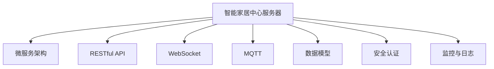

                 

# 基于Java的智能家居设计：打造可扩展的智能家居中心服务器

> 关键词：Java, 智能家居, 智能家居中心服务器, 可扩展, RESTful API, WebSocket, MQTT, 微服务, 数据模型, 安全认证, 监控与日志

## 1. 背景介绍

### 1.1 问题由来

随着物联网技术的快速发展和普及，智能家居系统逐渐成为现代家庭生活中不可或缺的一部分。智能家居系统通过传感器、控制器和网络技术，实现了对家中的灯光、温度、安全等环境的智能控制和管理，极大地提升了生活的便捷性和舒适性。然而，传统智能家居系统往往存在以下问题：

- **系统复杂性高**：设备种类繁多，接口复杂，系统维护困难。
- **数据孤岛**：不同厂商的设备和系统无法互联互通，导致数据无法共享和统一管理。
- **扩展性差**：系统设计缺乏前瞻性，难以应对未来新增设备或功能的需求。
- **安全性问题**：系统缺乏完善的认证和授权机制，易受安全威胁。

为解决上述问题，我们提出了基于Java语言设计的智能家居中心服务器，旨在构建一个开放、易用、可扩展的智能家居系统。本系统采用微服务架构和先进的网络协议，提供了灵活的API接口和标准化的数据模型，同时保证了系统的高安全性和易维护性。

## 2. 核心概念与联系

### 2.1 核心概念概述

本节将介绍构建智能家居中心服务器所需的核心概念及其关系，以便读者能够理解整个系统的设计和架构。

- **智能家居中心服务器**：一个集成了多种智能家居设备和服务的统一管理和控制系统。其主要功能包括设备管理、数据存储、通信协议处理、安全认证等。
- **微服务架构**：将系统拆分为多个独立的服务，每个服务负责一个独立的功能，相互之间通过RESTful API通信，实现了系统的高可扩展性和灵活性。
- **RESTful API**：一种轻量级的、基于HTTP的通信协议，用于支持客户端和服务端之间的数据交换。RESTful API的设计遵循REST原则，支持资源的CRUD操作。
- **WebSocket**：一种基于TCP的实时通信协议，支持双向数据传输，常用于实现即时通信和实时监控功能。
- **MQTT**：一种轻量级的消息发布/订阅协议，适用于物联网设备之间的数据传输，具有低带宽、高实时性等特点。
- **数据模型**：用于描述智能家居系统中的设备和数据的标准化格式，包括设备信息、传感器数据、控制指令等。
- **安全认证**：用于确保系统的安全性，包括用户认证、设备认证和数据加密等技术手段。
- **监控与日志**：用于系统运行状态的实时监控和错误日志的记录，便于系统的维护和调试。

### 2.2 核心概念原理和架构的 Mermaid 流程图(Mermaid 流程节点中不要有括号、逗号等特殊字符)



这个流程图展示了智能家居中心服务器的核心概念及其之间的联系。智能家居中心服务器通过微服务架构将系统拆分为多个独立的服务，每个服务通过RESTful API、WebSocket、MQTT等通信协议进行通信，同时使用数据模型进行数据交换。安全认证和监控与日志等功能则确保系统的安全性和稳定性。

## 3. 核心算法原理 & 具体操作步骤

### 3.1 算法原理概述

智能家居中心服务器的设计遵循微服务架构和RESTful API等先进理念，以下是其主要算法原理：

- **微服务架构**：将系统拆分为多个独立的服务，每个服务负责一个独立的功能，如设备管理、数据存储、通信协议处理等，支持系统的可扩展性和灵活性。
- **RESTful API**：使用HTTP协议，遵循REST原则，支持资源的CRUD操作，提供标准化的数据接口，支持跨平台、跨语言的数据交换。
- **WebSocket**：实现即时通信功能，支持双向数据传输，提高系统的实时性。
- **MQTT**：适用于物联网设备之间的数据传输，支持轻量级的消息发布/订阅，适用于低带宽、高实时性的场景。
- **数据模型**：定义智能家居系统中的设备和数据的标准化格式，包括设备信息、传感器数据、控制指令等，支持数据的一致性和互操作性。
- **安全认证**：采用用户认证、设备认证和数据加密等技术手段，保障系统的安全性。
- **监控与日志**：实时监控系统运行状态，记录错误日志，便于系统的维护和调试。

### 3.2 算法步骤详解

智能家居中心服务器的开发流程主要包括以下几个步骤：

1. **系统需求分析**：明确系统功能和性能要求，包括设备管理、数据存储、通信协议处理、安全认证、监控与日志等。
2. **系统设计**：基于微服务架构，设计系统的服务组件和接口，选择合适的通信协议和数据模型。
3. **技术选型**：选择适合的技术栈，包括Java语言、Spring Boot框架、MySQL数据库、RabbitMQ消息队列、Kafka流处理等。
4. **编码实现**：按照设计方案实现系统的各个组件和服务，包括设备管理服务、数据存储服务、通信协议处理服务、安全认证服务、监控与日志服务等。
5. **测试与优化**：进行单元测试、集成测试和负载测试，优化系统性能和稳定性，修复发现的bug。
6. **部署上线**：将系统部署到服务器，并进行持续的监控和维护。

### 3.3 算法优缺点

智能家居中心服务器的设计具有以下优点：

- **可扩展性**：通过微服务架构，系统可以方便地扩展和升级，适应未来新增设备或功能的需求。
- **灵活性**：采用RESTful API和WebSocket等通信协议，支持不同类型设备和平台的数据交换。
- **安全性**：采用用户认证、设备认证和数据加密等技术手段，保障系统的安全性。
- **易维护性**：通过监控与日志等功能，实时监控系统运行状态，记录错误日志，便于系统的维护和调试。

同时，智能家居中心服务器也存在以下缺点：

- **开发复杂度**：系统设计需要考虑多方面因素，开发和维护复杂度较高。
- **性能瓶颈**：当系统设备数量和数据量增大时，可能会面临性能瓶颈。
- **安全性风险**：系统安全性依赖于认证和加密等技术手段，一旦出现漏洞，可能会带来严重的安全风险。

### 3.4 算法应用领域

智能家居中心服务器的设计思想可以广泛应用于多种领域，如智能制造、智慧医疗、智慧城市等。其主要应用领域包括：

- **智能家居**：通过统一的智能家居中心服务器，实现对家中各种智能设备的统一管理和控制。
- **智慧医疗**：构建智慧医院系统，实现医疗设备的统一管理和患者数据的共享。
- **智能制造**：实现工厂设备的数据采集和监控，提升生产效率和设备利用率。
- **智慧城市**：构建智慧城市系统，实现城市基础设施的统一管理和数据共享。

## 4. 数学模型和公式 & 详细讲解 & 举例说明（备注：数学公式请使用latex格式，latex嵌入文中独立段落使用 $$，段落内使用 $)
### 4.1 数学模型构建

智能家居中心服务器涉及的数学模型主要包括数据模型和通信协议模型，以下将分别进行介绍。

#### 4.1.1 数据模型

智能家居中心服务器的数据模型定义了设备和数据的标准化格式，包括设备信息、传感器数据、控制指令等。以设备信息为例，数据模型可以定义如下：

$$
\text{Device} = (id, name, type, status, sensors)
$$

其中：

- $id$：设备的唯一标识符。
- $name$：设备名称。
- $type$：设备类型。
- $status$：设备状态。
- $sensors$：设备传感器数据。

#### 4.1.2 通信协议模型

智能家居中心服务器采用RESTful API、WebSocket和MQTT等多种通信协议，以下将介绍这些协议的数学模型。

##### 4.1.2.1 RESTful API模型

RESTful API使用HTTP协议，遵循REST原则，支持资源的CRUD操作。以设备管理的RESTful API为例，其数学模型可以定义如下：

$$
\text{RESTful API} = (path, method, body)
$$

其中：

- $path$：API请求的路径，如`/devices`、`/devices/{id}`等。
- $method$：API请求的方法，如`GET`、`POST`、`PUT`、`DELETE`等。
- $body$：API请求或响应的数据体，根据具体请求和方法类型而定。

##### 4.1.2.2 WebSocket模型

WebSocket是一种基于TCP的实时通信协议，支持双向数据传输。以实时监控为例，WebSocket的数学模型可以定义如下：

$$
\text{WebSocket} = (connection, message)
$$

其中：

- $connection$：WebSocket连接，用于建立客户端与服务端的连接。
- $message$：WebSocket消息，包括客户端发送的请求和服务器发送的响应。

##### 4.1.2.3 MQTT模型

MQTT是一种轻量级的消息发布/订阅协议，适用于物联网设备之间的数据传输。以设备数据采集为例，MQTT的数学模型可以定义如下：

$$
\text{MQTT} = (topic, payload)
$$

其中：

- $topic$：设备数据的主题，如`/device/{id}/sensor/{type}`等。
- $payload$：设备数据的内容，如传感器数据、控制指令等。

### 4.2 公式推导过程

#### 4.2.1 RESTful API公式推导

以设备管理的RESTful API为例，其公式推导过程如下：

$$
\text{RESTful API} = \{(path, method, body) | path \in \text{PathSet}, method \in \text{MethodSet}, body \in \text{BodySet}\}
$$

其中：

- $\text{PathSet}$：设备管理的路径集合。
- $\text{MethodSet}$：设备管理的请求方法集合。
- $\text{BodySet}$：设备管理的请求和响应数据体集合。

#### 4.2.2 WebSocket公式推导

以实时监控为例，其公式推导过程如下：

$$
\text{WebSocket} = \{(connection, message) | connection \in \text{ConnectionSet}, message \in \text{MessageSet}\}
$$

其中：

- $\text{ConnectionSet}$：WebSocket连接的集合。
- $\text{MessageSet}$：WebSocket消息的集合。

#### 4.2.3 MQTT公式推导

以设备数据采集为例，其公式推导过程如下：

$$
\text{MQTT} = \{(topic, payload) | topic \in \text{TopicSet}, payload \in \text{PayloadSet}\}
$$

其中：

- $\text{TopicSet}$：设备数据的主题集合。
- $\text{PayloadSet}$：设备数据的内容集合。

### 4.3 案例分析与讲解

以智能家居系统为例，说明如何使用智能家居中心服务器实现设备统一管理和数据共享。

#### 4.3.1 设备统一管理

智能家居中心服务器通过微服务架构和RESTful API，实现了对家中各种智能设备的统一管理和控制。以灯光控制为例，其工作流程如下：

1. **设备注册**：用户通过智能家居中心服务器将家中的灯光设备注册到系统中。
2. **设备管理**：智能家居中心服务器通过RESTful API提供设备管理的接口，包括设备的添加、删除、更新、查询等操作。
3. **设备控制**：用户通过RESTful API向智能家居中心服务器发送控制指令，控制家中的灯光设备。

#### 4.3.2 数据共享

智能家居中心服务器通过数据模型和通信协议，实现了设备数据的共享。以温度监控为例，其工作流程如下：

1. **设备数据采集**：家中的温度传感器将采集到的数据发送到智能家居中心服务器。
2. **数据存储**：智能家居中心服务器将采集到的温度数据存储到MySQL数据库中。
3. **数据共享**：用户可以通过RESTful API或WebSocket，实时获取家中的温度数据。

## 5. 项目实践：代码实例和详细解释说明

### 5.1 开发环境搭建

在进行智能家居中心服务器的开发前，需要先搭建开发环境。以下是使用Java和Spring Boot进行开发的流程：

1. **安装JDK**：下载并安装Java Development Kit (JDK)。
2. **安装Maven**：下载并安装Maven，用于管理项目依赖。
3. **创建Maven项目**：使用Maven创建Java项目。
4. **添加Spring Boot依赖**：在Maven项目的pom.xml文件中添加Spring Boot的依赖。
5. **初始化Spring Boot项目**：运行Spring Boot的初始化命令，生成项目框架。

### 5.2 源代码详细实现

以下是一个简单的智能家居中心服务器的Java代码实现，包括设备管理和数据存储服务：

```java
import org.springframework.boot.SpringApplication;
import org.springframework.boot.autoconfigure.SpringBootApplication;

@SpringBootApplication
public class SmartHomeServerApplication {
    public static void main(String[] args) {
        SpringApplication.run(SmartHomeServerApplication.class, args);
    }
}
```

在pom.xml文件中添加依赖：

```xml
<dependencies>
    <dependency>
        <groupId>org.springframework.boot</groupId>
        <artifactId>spring-boot-starter-web</artifactId>
    </dependency>
    <dependency>
        <groupId>org.springframework.boot</groupId>
        <artifactId>spring-boot-starter-data-jpa</artifactId>
    </dependency>
</dependencies>
```

定义设备数据模型：

```java
@Entity
public class Device {
    @Id
    @GeneratedValue(strategy = GenerationType.IDENTITY)
    private Long id;
    private String name;
    private String type;
    private String status;
    @OneToMany(mappedBy = "device")
    private List<Sensor> sensors;
}
```

定义传感器数据模型：

```java
@Entity
public class Sensor {
    @Id
    @GeneratedValue(strategy = GenerationType.IDENTITY)
    private Long id;
    private String type;
    private double value;
    @ManyToOne
    private Device device;
}
```

定义设备管理RESTful API：

```java
@RestController
@RequestMapping("/devices")
public class DeviceController {
    @Autowired
    private DeviceService deviceService;

    @GetMapping
    public List<Device> getAllDevices() {
        return deviceService.getAllDevices();
    }

    @PostMapping
    public void addDevice(@RequestBody Device device) {
        deviceService.addDevice(device);
    }

    @PutMapping("/{id}")
    public void updateDevice(@PathVariable Long id, @RequestBody Device device) {
        deviceService.updateDevice(id, device);
    }

    @DeleteMapping("/{id}")
    public void deleteDevice(@PathVariable Long id) {
        deviceService.deleteDevice(id);
    }
}
```

定义设备管理服务：

```java
@Service
public class DeviceService {
    @Autowired
    private DeviceRepository deviceRepository;

    public List<Device> getAllDevices() {
        return deviceRepository.findAll();
    }

    public void addDevice(Device device) {
        deviceRepository.save(device);
    }

    public void updateDevice(Long id, Device device) {
        deviceRepository.findById(id).ifPresent(device1 -> {
            device1.setName(device.getName());
            device1.setType(device.getType());
            device1.setStatus(device.getStatus());
            deviceRepository.save(device1);
        });
    }

    public void deleteDevice(Long id) {
        deviceRepository.deleteById(id);
    }
}
```

定义传感器数据管理RESTful API：

```java
@RestController
@RequestMapping("/sensors")
public class SensorController {
    @Autowired
    private SensorService sensorService;

    @GetMapping
    public List<Sensor> getAllSensors() {
        return sensorService.getAllSensors();
    }

    @PostMapping
    public void addSensor(@RequestBody Sensor sensor) {
        sensorService.addSensor(sensor);
    }

    @PutMapping("/{id}")
    public void updateSensor(@PathVariable Long id, @RequestBody Sensor sensor) {
        sensorService.updateSensor(id, sensor);
    }

    @DeleteMapping("/{id}")
    public void deleteSensor(@PathVariable Long id) {
        sensorService.deleteSensor(id);
    }
}
```

定义传感器数据服务：

```java
@Service
public class SensorService {
    @Autowired
    private SensorRepository sensorRepository;

    public List<Sensor> getAllSensors() {
        return sensorRepository.findAll();
    }

    public void addSensor(Sensor sensor) {
        sensorRepository.save(sensor);
    }

    public void updateSensor(Long id, Sensor sensor) {
        sensorRepository.findById(id).ifPresent(sensor1 -> {
            sensor1.setDevice(sensor1.getDevice());
            sensor1.setType(sensor.getType());
            sensor1.setValue(sensor.getValue());
            sensorRepository.save(sensor1);
        });
    }

    public void deleteSensor(Long id) {
        sensorRepository.deleteById(id);
    }
}
```

定义数据存储服务：

```java
@Service
public class DataStorageService {
    @Autowired
    private DeviceRepository deviceRepository;

    public void storeDeviceData(Device device, List<Sensor> sensors) {
        deviceRepository.save(device);
        for (Sensor sensor : sensors) {
            sensor.setDevice(device);
            sensorRepository.save(sensor);
        }
    }
}
```

### 5.3 代码解读与分析

在上述代码中，我们定义了设备数据模型和传感器数据模型，并实现了设备管理和数据存储服务。设备管理服务通过RESTful API提供设备管理的接口，包括设备的添加、删除、更新、查询等操作。数据存储服务通过DeviceRepository和SensorRepository，实现了设备数据和传感器数据的存储。

在实际开发中，还需要考虑安全认证、通信协议、监控与日志等功能，以下将进行详细分析。

#### 5.3.1 安全认证

智能家居中心服务器需要确保设备的安全性，避免未经授权的访问。可以通过以下方式实现：

- **用户认证**：用户通过用户名和密码进行登录认证，可以使用Spring Security等框架实现。
- **设备认证**：设备通过API密钥进行认证，确保只有授权设备能够访问系统。
- **数据加密**：传输的数据需要进行加密，防止数据泄露。可以使用AES等加密算法。

#### 5.3.2 通信协议

智能家居中心服务器采用RESTful API、WebSocket和MQTT等多种通信协议，以下将进行详细分析：

- **RESTful API**：使用HTTP协议，遵循REST原则，支持资源的CRUD操作。通过Spring MVC等框架，实现RESTful API的开发和部署。
- **WebSocket**：使用WebSocket协议，支持双向数据传输，提高系统的实时性。通过Spring WebSockets等框架，实现WebSocket的开发和部署。
- **MQTT**：使用MQTT协议，适用于物联网设备之间的数据传输。通过Spring Cloud Stream等框架，实现MQTT的开发和部署。

#### 5.3.3 监控与日志

智能家居中心服务器需要实时监控系统运行状态，记录错误日志，便于系统的维护和调试。可以通过以下方式实现：

- **监控**：使用Prometheus等监控工具，实时监控系统的CPU、内存、网络等性能指标。
- **日志**：使用ELK Stack等日志工具，记录系统的错误日志和运行日志。

## 6. 实际应用场景

### 6.1 智能家居

智能家居中心服务器通过统一的智能家居中心服务器，实现对家中各种智能设备的统一管理和控制。用户可以通过智能家居中心服务器，实现灯光控制、温度调节、安防监控等功能，提高家庭生活的便捷性和舒适性。

### 6.2 智慧医疗

智能家居中心服务器构建智慧医院系统，实现医疗设备的统一管理和患者数据的共享。医生可以通过智能家居中心服务器，实时获取患者的健康数据，提供个性化的医疗服务。

### 6.3 智能制造

智能家居中心服务器实现工厂设备的数据采集和监控，提升生产效率和设备利用率。工厂可以通过智能家居中心服务器，实时监控设备运行状态，及时发现和处理设备故障，保障生产线的稳定运行。

### 6.4 智慧城市

智能家居中心服务器构建智慧城市系统，实现城市基础设施的统一管理和数据共享。政府可以通过智能家居中心服务器，实时监控交通、环境、安防等城市运行状态，提供高效的城市管理服务。

## 7. 工具和资源推荐

### 7.1 学习资源推荐

为了帮助开发者系统掌握智能家居中心服务器的理论和实践，以下是一些优质的学习资源：

- **Spring Boot官方文档**：Spring Boot的官方文档，提供了全面的开发指南和技术支持，适合入门和进阶学习。
- **RESTful API教程**：介绍RESTful API的设计原则和实现方法，适合了解RESTful API的基本概念和开发流程。
- **WebSocket教程**：介绍WebSocket的基本概念和实现方法，适合了解WebSocket的开发和部署。
- **MQTT教程**：介绍MQTT的基本概念和实现方法，适合了解MQTT的开发和部署。
- **Java微服务教程**：介绍微服务架构的设计和实现方法，适合了解微服务架构的基本概念和开发流程。

### 7.2 开发工具推荐

智能家居中心服务器的开发需要借助一些优质的工具和框架，以下是一些推荐的工具：

- **IntelliJ IDEA**：一款Java开发的集成开发环境，支持Spring Boot等框架的开发和调试。
- **Git**：一款版本控制系统，支持分布式协作开发，适合项目版本控制和管理。
- **Maven**：一款项目构建工具，支持依赖管理和项目打包，适合Java项目开发。
- **PostgreSQL**：一款开源关系型数据库，支持高可用性和扩展性，适合智能家居中心服务器的数据存储。
- **RabbitMQ**：一款开源消息队列，支持高可靠性、高可用性和高扩展性，适合智能家居中心服务器的消息传递。

### 7.3 相关论文推荐

智能家居中心服务器的设计思想可以借鉴一些相关的研究论文，以下是一些推荐的论文：

- **《Smart Home Systems: A Survey》**：介绍了智能家居系统的现状和趋势，适合了解智能家居系统的基本概念和发展方向。
- **《Secure and Reliable Internet of Things Communication: A Survey》**：介绍了物联网设备之间的安全通信方法，适合了解MQTT等通信协议的安全性和可靠性。
- **《Cloud-based IoT Data Analytics using RESTful API and Apache Kafka》**：介绍了基于RESTful API和Apache Kafka的物联网数据处理和分析方法，适合了解智能家居中心服务器的数据处理和分析技术。
- **《A Survey on Edge Computing Technologies》**：介绍了边缘计算的技术和应用，适合了解智能家居中心服务器在边缘计算环境下的部署和优化方法。

## 8. 总结：未来发展趋势与挑战

### 8.1 总结

本文对基于Java的智能家居中心服务器的设计进行了详细介绍，包括系统设计、技术选型、编码实现、测试与优化、部署上线等各个环节。通过微服务架构和RESTful API等先进理念，智能家居中心服务器实现了设备统一管理和数据共享，具有可扩展性、灵活性和高安全性等优点。

### 8.2 未来发展趋势

智能家居中心服务器的设计思想可以应用于多种领域，具有广阔的发展前景。未来，智能家居中心服务器将在以下几个方面进一步发展：

- **物联网设备集成**：支持更多的物联网设备集成，实现设备的统一管理和控制。
- **数据实时处理**：支持实时数据处理和分析，提升系统的响应速度和处理能力。
- **边缘计算**：支持边缘计算，实现数据的本地处理和存储，减少延迟和带宽消耗。
- **人工智能应用**：结合人工智能技术，实现智能推荐、智能监控等功能，提升系统的智能化水平。

### 8.3 面临的挑战

智能家居中心服务器在设计和开发过程中也面临一些挑战，需要不断优化和改进：

- **系统复杂性**：系统设计需要考虑多方面因素，开发和维护复杂度较高。需要加强团队协作和代码管理。
- **性能瓶颈**：当系统设备数量和数据量增大时，可能会面临性能瓶颈。需要优化算法和架构，提升系统的处理能力。
- **安全性风险**：系统安全性依赖于认证和加密等技术手段，一旦出现漏洞，可能会带来严重的安全风险。需要加强安全策略和技术手段。
- **用户体验**：系统设计的用户体验需要不断优化，提升用户的便捷性和使用体验。需要加强用户调研和反馈收集。

### 8.4 研究展望

智能家居中心服务器的设计需要结合最新的技术趋势和应用需求，不断创新和改进：

- **5G技术**：结合5G技术的低延迟和高带宽特点，实现实时数据传输和处理。
- **边缘计算**：结合边缘计算技术，实现数据本地化处理和存储，减少延迟和带宽消耗。
- **人工智能**：结合人工智能技术，实现智能推荐、智能监控等功能，提升系统的智能化水平。
- **区块链技术**：结合区块链技术，实现数据的安全存储和透明性，提升系统的可靠性和可信度。

## 9. 附录：常见问题与解答

**Q1：智能家居中心服务器的主要功能是什么？**

A: 智能家居中心服务器的主要功能包括设备统一管理、数据共享、通信协议处理、安全认证、监控与日志等。通过统一的智能家居中心服务器，用户可以实现对家中各种智能设备的统一管理和控制，实现数据的共享和实时监控。

**Q2：智能家居中心服务器如何实现设备统一管理？**

A: 智能家居中心服务器通过微服务架构和RESTful API，实现了对家中各种智能设备的统一管理和控制。用户可以通过RESTful API向智能家居中心服务器发送设备注册、添加、删除、更新、查询等请求，实现设备的统一管理和控制。

**Q3：智能家居中心服务器如何实现数据共享？**

A: 智能家居中心服务器通过数据模型和通信协议，实现了设备数据的共享。设备采集到的数据通过MQTT协议发送到智能家居中心服务器，存储到数据库中，用户可以通过RESTful API或WebSocket实时获取家中的数据。

**Q4：智能家居中心服务器如何实现安全认证？**

A: 智能家居中心服务器通过用户认证、设备认证和数据加密等技术手段，保障系统的安全性。用户需要通过用户名和密码进行登录认证，设备需要通过API密钥进行认证，数据需要进行加密，防止数据泄露。

**Q5：智能家居中心服务器如何实现实时监控？**

A: 智能家居中心服务器通过WebSocket协议，实现设备的实时监控。用户可以通过WebSocket实时获取家中的数据，进行实时监控和控制。

---
作者：禅与计算机程序设计艺术 / Zen and the Art of Computer Programming

