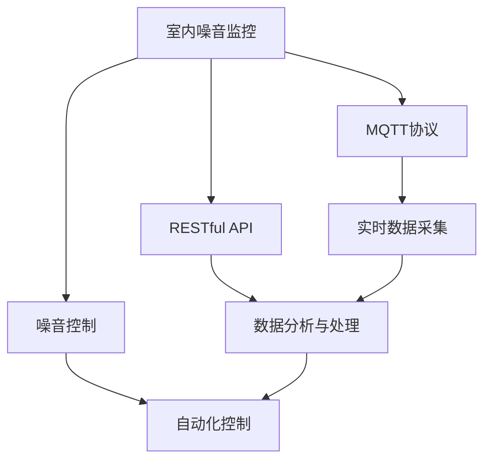

                 

# 基于MQTT协议和RESTful API的室内噪音监控与控制系统

## 1. 背景介绍

### 1.1 问题由来
随着城市化进程的加快和人口密度的增加，室内噪音污染问题日益严重。室内噪音不仅影响居住和工作环境的舒适度，还可能导致听力损失、心理压力等健康问题。为有效应对室内噪音问题，需要构建智能化的噪音监控与控制系统。

传统的噪音监控与控制系统往往依赖人工操作和简单的声级计，存在响应速度慢、精度低、无法实时联动控制等问题。而基于MQTT协议和RESTful API的室内噪音监控与控制系统，通过物联网和互联网技术，实现了噪音数据的实时采集、分析和自动化控制，显著提升了噪音监控与控制系统的智能化水平。

### 1.2 问题核心关键点
本系统主要包含三个关键点：
1. 基于MQTT协议的噪音数据采集：通过MQTT协议实现室内噪音数据的实时采集和传输。
2. 基于RESTful API的数据分析与处理：通过RESTful API实现噪音数据的实时分析和处理。
3. 基于RESTful API的噪音控制：通过RESTful API实现噪音的自动化控制。

通过这三个关键点的有效结合，本系统实现了室内噪音的实时监控与控制，为居住和工作环境的噪音管理提供了智能化解决方案。

## 2. 核心概念与联系

### 2.1 核心概念概述

为更好地理解基于MQTT协议和RESTful API的室内噪音监控与控制系统，本节将介绍几个密切相关的核心概念：

- MQTT协议（Message Queuing Telemetry Transport）：一种轻量级的发布/订阅消息传输协议，适用于物联网设备之间的消息通信。
- RESTful API（Representational State Transfer）：基于HTTP协议的Web API设计风格，提供资源表示和操作接口，支持客户端/服务器架构。
- 室内噪音监控：通过传感器实时采集室内噪音数据，分析噪音来源和变化规律，提供噪音监测服务。
- 室内噪音控制：根据噪音分析结果，自动化控制室内噪音的源头设备，如空调、风扇等，实现噪音降低。
- 智能家居：通过传感器和控制器构建智能家居系统，实现家庭环境的自动化管理。

这些核心概念之间的逻辑关系可以通过以下Mermaid流程图来展示：



这个流程图展示了一系列的核心概念及其之间的关系：

1. 室内噪音监控通过传感器实时采集噪音数据。
2. MQTT协议用于设备之间的数据传输。
3. RESTful API用于对采集到的噪音数据进行分析与处理。
4. RESTful API也用于对噪音源头设备进行自动化控制。
5. 智能家居系统将噪音监控与控制模块整合，实现家庭环境的自动化管理。

## 3. 核心算法原理 & 具体操作步骤
### 3.1 算法原理概述

基于MQTT协议和RESTful API的室内噪音监控与控制系统，本质上是一个基于物联网和互联网的实时数据采集、分析和自动化控制流程。其核心思想是：通过MQTT协议实现室内噪音数据的实时采集，通过RESTful API进行数据分析和处理，再通过RESTful API实现噪音的控制。

具体而言，系统由以下几个部分组成：
1. 传感器模块：用于实时采集室内噪音数据。
2. MQTT协议模块：用于将传感器采集的数据通过MQTT协议传输到服务器。
3. RESTful API模块：用于对传感器数据进行实时分析和处理，并通过RESTful API控制噪音源头设备。

### 3.2 算法步骤详解

基于MQTT协议和RESTful API的室内噪音监控与控制系统，主要包括以下几个关键步骤：

**Step 1: 准备传感器和MQTT服务器**
- 选择合适的传感器，如麦克风阵列、声级计等，用于实时采集室内噪音数据。
- 搭建MQTT服务器，支持设备之间的数据传输。

**Step 2: 设计数据采集和传输机制**
- 设计MQTT设备连接协议，定义设备标识、数据格式等规范。
- 通过MQTT协议，将传感器采集到的噪音数据传输到服务器。

**Step 3: 设计数据分析与处理机制**
- 设计RESTful API接口，支持数据采集和处理。
- 对采集到的噪音数据进行实时分析，包括噪音源识别、噪音级别分类等。

**Step 4: 设计自动化控制机制**
- 设计RESTful API接口，支持设备控制。
- 根据噪音分析结果，自动化控制室内噪音源头设备，如空调、风扇等。

**Step 5: 测试与部署**
- 在测试环境中测试系统功能，确保各模块正常工作。
- 将系统部署到实际应用场景中，并进行持续监控和维护。

### 3.3 算法优缺点

基于MQTT协议和RESTful API的室内噪音监控与控制系统具有以下优点：
1. 实时性高：通过MQTT协议实现实时数据采集，响应速度较快。
2. 灵活性强：采用RESTful API实现数据分析与处理，支持多种数据格式和协议。
3. 可靠性高：基于物联网技术的系统架构，数据传输和处理过程较为稳定。
4. 可扩展性好：可以根据实际需求，灵活扩展系统功能，如增加更多的传感器和控制设备。

同时，该方法也存在以下局限性：
1. 设备成本高：传感器的成本较高，需要一次性投入大量资金。
2. 部署复杂：需要搭建MQTT服务器和RESTful API接口，有一定的技术门槛。
3. 安全性有待加强：系统的数据传输和处理过程需要确保安全性，防止数据泄露。
4. 兼容性不足：不同设备之间的数据格式和通信协议可能存在差异，需要标准化。

尽管存在这些局限性，但就目前而言，基于MQTT协议和RESTful API的室内噪音监控与控制系统，仍是目前实现室内噪音监控与控制的较为高效和可靠的方法。未来相关研究的重点在于如何进一步降低设备成本，简化部署过程，提高系统的兼容性和安全性。

### 3.4 算法应用领域

基于MQTT协议和RESTful API的室内噪音监控与控制系统，在多个领域均有广泛的应用，例如：

- 智能家居：实现室内噪音的实时监控与自动化控制，提升居住环境的舒适度。
- 办公环境：通过实时监控和管理室内噪音，提高员工的工作效率和办公环境的舒适度。
- 医疗健康：在医院等环境实时监测噪音水平，为患者和医护人员提供更安静的治疗和办公环境。
- 酒店餐饮：通过监控和管理餐厅、酒店等场所的噪音水平，提升顾客的用餐和住宿体验。
- 学校教育：通过监控和管理课堂内的噪音水平，创造更安静、专注的学习环境。

除了这些常见的应用场景外，基于MQTT协议和RESTful API的室内噪音监控与控制系统，还可以应用到各种室内噪音管理需求较高的场合，如会议室、图书馆、图书馆等。

## 4. 数学模型和公式 & 详细讲解  
### 4.1 数学模型构建

本节将使用数学语言对基于MQTT协议和RESTful API的室内噪音监控与控制系统进行更加严格的刻画。

记室内噪音数据为 $X=\{x_i\}_{i=1}^N$，其中 $x_i$ 表示第 $i$ 个传感器在 $t$ 时刻采集到的噪音数据。传感器采集到的噪音数据为离散时间序列 $x_i=[x_{i,1},x_{i,2},...,x_{i,N}]$，其中 $x_{i,j}$ 表示传感器在 $j$ 时刻采集到的噪音数据。

定义噪音数据的数据类型为 $D$，例如：
- 音频数据：$x_{i,j}$ 表示 $j$ 时刻的音频信号。
- 声级数据：$x_{i,j}$ 表示 $j$ 时刻的声级值。

假设噪声控制系统的目标为最小化噪音数据 $X$ 的能量，即：

$$
\min_{\theta} \sum_{i=1}^N \sum_{j=1}^N x_{i,j}^2
$$

其中 $\theta$ 为控制参数，如传感器的工作模式、设备控制策略等。

### 4.2 公式推导过程

以下我们以音频数据为例，推导最小化噪音数据能量的方法。

假设传感器采集到的音频数据为 $x_{i,j}$，需要将其转换为声级值 $y_{i,j}$。声级值的计算公式为：

$$
y_{i,j} = 20 \log_{10} \left( \frac{\sum_{k=1}^n x_{i,j,k}^2}{n} \right)
$$

其中 $x_{i,j,k}$ 表示传感器在 $j$ 时刻的音频信号的第 $k$ 个通道，$n$ 表示通道数。

根据上述公式，我们可以将噪音数据能量转化为声级数据的能量，即：

$$
\min_{\theta} \sum_{i=1}^N \sum_{j=1}^N y_{i,j}^2
$$

通过优化上述公式，可以找到最优的控制参数 $\theta$，使得系统输出的声级数据能量最小。

### 4.3 案例分析与讲解

以一家医院为例，分析如何基于MQTT协议和RESTful API实现室内噪音的实时监控与控制。

**案例背景：**
某医院内的病房环境较为嘈杂，主要噪音来源包括病人的咳嗽、呼吸、机器运转等。医院希望通过实时监控和控制噪音，提升病人的治疗和休息效果。

**解决方案：**
1. 传感器部署：在病房内安装麦克风阵列，实时采集室内噪音数据。
2. MQTT协议部署：搭建MQTT服务器，实现传感器数据与医院后台系统的数据传输。
3. RESTful API设计：设计RESTful API接口，用于数据分析与处理。
4. RESTful API控制：根据噪音分析结果，自动化控制病房内的设备，如空调、风扇等。

**实施步骤：**
1. 传感器采集噪音数据，通过MQTT协议发送到MQTT服务器。
2. MQTT服务器接收数据，并使用RESTful API接口进行数据分析与处理。
3. 分析结果通过RESTful API接口，发送至控制模块，自动化控制噪音源头设备。
4. 通过实时监控和控制，可以有效降低病房的噪音水平，提升病人的治疗和休息效果。

## 5. 项目实践：代码实例和详细解释说明
### 5.1 开发环境搭建

在进行项目实践前，我们需要准备好开发环境。以下是使用Python进行MQTT和RESTful API开发的环境配置流程：

1. 安装Anaconda：从官网下载并安装Anaconda，用于创建独立的Python环境。

2. 创建并激活虚拟环境：
```bash
conda create -n mqtt-env python=3.8 
conda activate mqtt-env
```

3. 安装PyMQTT库：用于实现MQTT协议。
```bash
pip install pypaho-mqtt
```

4. 安装Flask库：用于实现RESTful API。
```bash
pip install flask
```

5. 安装Paho MQTT库：用于实现MQTT协议。
```bash
pip install paho-mqtt
```

完成上述步骤后，即可在`mqtt-env`环境中开始项目实践。

### 5.2 源代码详细实现

下面我们以医疗领域为例，给出使用PyMQTT和Flask实现室内噪音监控与控制的Python代码实现。

**传感器模块代码：**

```python
import paho.mqtt.client as mqtt
import time

def on_connect(client, userdata, flags, rc):
    print("Connected with result code "+str(rc))
    client.subscribe("noisy_channel/1")

def on_message(client, userdata, msg):
    print(msg.topic+" "+str(msg.payload))

client = mqtt.Client()
client.on_connect = on_connect
client.on_message = on_message

client.connect("mqtt.example.com", 1883, 60)
client.loop_forever()
```

**MQTT服务器代码：**

```python
import paho.mqtt.server as mqtt_server

def on_connect(client, userdata, flags, rc):
    print("Connected with result code "+str(rc))

def on_message(client, userdata, msg):
    print(msg.topic+" "+str(msg.payload))

server = mqtt_server.MQTTServer("localhost", 1883)
server.on_connect = on_connect
server.on_message = on_message

server.start()

# 等待消息
while True:
    time.sleep(1)
```

**RESTful API代码：**

```python
from flask import Flask, request

app = Flask(__name__)

@app.route('/noisy_channel', methods=['POST'])
def noisy_channel():
    data = request.json
    print("Noisy channel data received: ", data)
    # 对噪音数据进行处理，返回处理结果
    return {"message": "Noisy channel data processed successfully"}

if __name__ == '__main__':
    app.run(debug=True)
```

**控制模块代码：**

```python
import paho.mqtt.client as mqtt
import time

def on_connect(client, userdata, flags, rc):
    print("Connected with result code "+str(rc))
    client.subscribe("noisy_channel/1")

def on_message(client, userdata, msg):
    print(msg.topic+" "+str(msg.payload))
    # 根据噪音分析结果，控制设备
    if msg.payload == "high":
        turn_on_air_conditioner()
    elif msg.payload == "low":
        turn_off_air_conditioner()

client = mqtt.Client()
client.on_connect = on_connect
client.on_message = on_message

client.connect("mqtt.example.com", 1883, 60)
client.loop_forever()
```

**控制函数代码：**

```python
def turn_on_air_conditioner():
    print("Air conditioner turned on")

def turn_off_air_conditioner():
    print("Air conditioner turned off")
```

以上就是使用PyMQTT和Flask实现室内噪音监控与控制的完整代码实现。可以看到，通过MQTT协议和RESTful API，可以方便地实现噪音数据的实时采集和处理，以及对设备进行自动化控制。

### 5.3 代码解读与分析

让我们再详细解读一下关键代码的实现细节：

**传感器模块代码：**

- 使用PyMQTT库实现MQTT客户端，订阅名为“noisy_channel/1”的MQTT主题，并打印接收到的消息。

**MQTT服务器代码：**

- 使用Paho MQTT库实现MQTT服务器，监听本地1883端口，打印接收到的消息。

**RESTful API代码：**

- 使用Flask库实现RESTful API，监听/.noisy_channel接口，打印接收到的JSON数据。

**控制模块代码：**

- 使用PyMQTT库实现MQTT客户端，订阅名为“noisy_channel/1”的MQTT主题，根据接收到的消息，调用对应的控制函数。

**控制函数代码：**

- 根据接收到的噪音分析结果，调用对应的控制函数，如开启或关闭空调等。

可以看到，通过MQTT协议和RESTful API，可以实现室内噪音数据的实时采集和处理，以及对设备进行自动化控制。这种架构不仅简单易用，还具有高度的可扩展性和灵活性。

## 6. 实际应用场景

### 6.1 智能家居

基于MQTT协议和RESTful API的室内噪音监控与控制系统，在智能家居领域具有广泛的应用前景。通过实时监控和管理室内噪音，可以实现更加舒适、健康的生活环境。

在智能家居系统中，可以通过传感器实时采集室内噪音数据，并通过MQTT协议传输到服务器。服务器使用RESTful API进行数据分析与处理，然后通过RESTful API接口控制家居设备，如空调、风扇等，实现噪音控制。

### 6.2 办公环境

办公环境的噪音管理对于提高工作效率和员工舒适度至关重要。通过实时监控和控制室内噪音，可以有效降低噪音水平，提升办公环境的质量。

在办公环境中，可以通过传感器实时采集室内噪音数据，并通过MQTT协议传输到服务器。服务器使用RESTful API进行数据分析与处理，然后通过RESTful API接口控制办公室内的设备，如空调、风扇等，实现噪音控制。

### 6.3 酒店餐饮

酒店餐饮环境的噪音管理直接影响顾客的用餐体验。通过实时监控和控制室内噪音，可以有效提升餐饮环境的舒适度，增加顾客的满意度。

在酒店餐饮环境中，可以通过传感器实时采集室内噪音数据，并通过MQTT协议传输到服务器。服务器使用RESTful API进行数据分析与处理，然后通过RESTful API接口控制餐饮设备，如背景音乐、空调等，实现噪音控制。

### 6.4 学校教育

学校教育环境的噪音管理对于创造良好的学习环境至关重要。通过实时监控和控制室内噪音，可以有效降低噪音水平，提升学生的学习效果。

在学校教育环境中，可以通过传感器实时采集室内噪音数据，并通过MQTT协议传输到服务器。服务器使用RESTful API进行数据分析与处理，然后通过RESTful API接口控制教室内的设备，如空调、风扇等，实现噪音控制。

### 6.5 医疗健康

医院环境的噪音管理对于提升病人的治疗效果和舒适感至关重要。通过实时监控和控制室内噪音，可以有效降低噪音水平，提升病人的治疗效果。

在医院环境中，可以通过传感器实时采集室内噪音数据，并通过MQTT协议传输到服务器。服务器使用RESTful API进行数据分析与处理，然后通过RESTful API接口控制病房内的设备，如空调、风扇等，实现噪音控制。

## 7. 工具和资源推荐
### 7.1 学习资源推荐

为了帮助开发者系统掌握基于MQTT协议和RESTful API的室内噪音监控与控制系统，这里推荐一些优质的学习资源：

1. MQTT协议官方文档：提供MQTT协议的详细说明和规范，是理解MQTT协议的基础。
2. RESTful API设计指南：提供RESTful API设计的最佳实践和示例，帮助开发者设计稳定的API接口。
3. 智能家居系统设计：介绍智能家居系统的设计和实现方法，涵盖传感器、数据传输和设备控制等方面。
4. 医院室内噪音控制：提供医院室内噪音控制的实际案例和解决方案，帮助开发者理解实际应用中的问题。
5. 教育环境噪音控制：提供学校教育环境噪音控制的实际案例和解决方案，帮助开发者理解实际应用中的问题。

通过对这些资源的学习实践，相信你一定能够快速掌握基于MQTT协议和RESTful API的室内噪音监控与控制系统的精髓，并用于解决实际的噪音管理问题。
###  7.2 开发工具推荐

高效的开发离不开优秀的工具支持。以下是几款用于基于MQTT协议和RESTful API开发的常用工具：

1. PyMQTT：Python MQTT客户端库，支持MQTT协议，实现设备的实时数据传输。
2. Flask：Python Web框架，支持RESTful API设计，实现数据的分析与处理。
3. Paho MQTT：Python MQTT服务器库，支持MQTT协议，实现数据的集中管理和分发。
4. FermatMQTT：C++ MQTT客户端库，支持MQTT协议，实现设备的实时数据传输。
5. IFTTT：物联网服务，支持MQTT协议和RESTful API，实现设备之间的联动和控制。

合理利用这些工具，可以显著提升基于MQTT协议和RESTful API的室内噪音监控与控制系统的开发效率，加快创新迭代的步伐。

### 7.3 相关论文推荐

基于MQTT协议和RESTful API的室内噪音监控与控制系统，在多个领域均有广泛的研究。以下是几篇奠基性的相关论文，推荐阅读：

1. MQTT协议详解：介绍MQTT协议的原理、特点和应用，提供实际应用的案例分析。
2. RESTful API设计实践：提供RESTful API设计的最佳实践和示例，帮助开发者设计稳定的API接口。
3. 智能家居系统研究：提供智能家居系统的设计方法和实现案例，涵盖传感器、数据传输和设备控制等方面。
4. 医院室内噪音控制：提供医院室内噪音控制的实际案例和解决方案，分析噪音管理的难点和解决方案。
5. 教育环境噪音控制：提供学校教育环境噪音控制的实际案例和解决方案，分析噪音管理的难点和解决方案。

这些论文代表了大规模室内噪音监控与控制技术的发展脉络。通过学习这些前沿成果，可以帮助研究者把握学科前进方向，激发更多的创新灵感。

## 8. 总结：未来发展趋势与挑战

### 8.1 总结

本文对基于MQTT协议和RESTful API的室内噪音监控与控制系统进行了全面系统的介绍。首先阐述了室内噪音监控与控制的背景和意义，明确了系统的核心关键点。其次，从原理到实践，详细讲解了系统的设计思路和关键技术，给出了系统的代码实现。同时，本文还广泛探讨了系统的应用场景，展示了系统的广泛适用性。

通过本文的系统梳理，可以看到，基于MQTT协议和RESTful API的室内噪音监控与控制系统，通过物联网和互联网技术的结合，实现了噪音数据的实时采集、分析和自动化控制，为室内噪音管理提供了智能化解决方案。得益于MQTT协议和RESTful API的高效性和灵活性，系统具备良好的实时性和扩展性，适合应用于多种室内噪音管理场景。

### 8.2 未来发展趋势

展望未来，基于MQTT协议和RESTful API的室内噪音监控与控制系统将呈现以下几个发展趋势：

1. 智能控制算法：通过引入先进的控制算法，如自适应控制、模糊控制、神经网络等，进一步提高噪音控制的智能化水平。
2. 多模态数据融合：引入图像、温度、湿度等多模态数据，通过传感器融合技术，提升噪音分析的准确性和全面性。
3. 云平台支持：通过云平台技术，实现噪音数据的集中管理和智能分析，提供更加灵活、可靠的服务。
4. 边缘计算：在靠近数据源的设备上，进行数据处理和控制，减少数据传输的延迟和带宽占用。
5. 人机交互：引入语音识别、人脸识别等技术，实现人机交互式噪音控制，提升用户体验。

以上趋势凸显了基于MQTT协议和RESTful API的室内噪音监控与控制系统的广阔前景。这些方向的探索发展，必将进一步提升系统性能，拓展应用范围，为智能家居、办公环境、医院医疗等领域带来更加优质的噪音管理服务。

### 8.3 面临的挑战

尽管基于MQTT协议和RESTful API的室内噪音监控与控制系统已经取得了显著成果，但在迈向更加智能化、普适化应用的过程中，仍面临诸多挑战：

1. 数据格式标准化：不同设备之间数据格式可能存在差异，需要制定统一的数据格式标准。
2. 数据传输安全性：MQTT协议的数据传输过程可能存在安全漏洞，需要加强数据传输的安全性。
3. 设备兼容性：不同设备之间的兼容性和互操作性，是实现系统集成和应用的关键。
4. 系统可扩展性：系统的可扩展性和灵活性，对于应对不同应用场景的需求至关重要。
5. 系统稳定性：系统的稳定性和可靠性，需要经过大量测试和优化，确保其在实际应用中的表现。

尽管存在这些挑战，但随着物联网和互联网技术的不断发展，基于MQTT协议和RESTful API的室内噪音监控与控制系统有望逐步克服这些难题，为室内噪音管理提供更加高效、可靠、智能的解决方案。

### 8.4 研究展望

面对基于MQTT协议和RESTful API的室内噪音监控与控制系统所面临的挑战，未来的研究需要在以下几个方面寻求新的突破：

1. 引入先进的控制算法：引入自适应控制、模糊控制、神经网络等算法，提高噪音控制的智能化水平。
2. 多模态数据融合：引入图像、温度、湿度等多模态数据，提升噪音分析的准确性和全面性。
3. 云平台支持：通过云平台技术，实现噪音数据的集中管理和智能分析，提供更加灵活、可靠的服务。
4. 边缘计算：在靠近数据源的设备上，进行数据处理和控制，减少数据传输的延迟和带宽占用。
5. 人机交互：引入语音识别、人脸识别等技术，实现人机交互式噪音控制，提升用户体验。

这些研究方向的探索，必将引领基于MQTT协议和RESTful API的室内噪音监控与控制系统迈向更高的台阶，为室内噪音管理提供更加高效、可靠、智能的解决方案。

## 9. 附录：常见问题与解答

**Q1：基于MQTT协议和RESTful API的系统是否可以扩展到室外噪音管理？**

A: 基于MQTT协议和RESTful API的系统，不仅适用于室内噪音管理，也可以扩展到室外噪音管理。只需将传感器部署在室外，通过MQTT协议将数据传输到服务器，再使用RESTful API进行数据分析与处理，并控制相应的设备。

**Q2：系统如何实现对噪音源头的自动化控制？**

A: 系统通过RESTful API实现对噪音源头设备的自动化控制。当服务器接收到噪音分析结果后，会根据结果调用相应的控制函数，如开启或关闭空调、风扇等设备。这些控制函数可以根据实际需求进行扩展和定制。

**Q3：系统的安全性如何保障？**

A: 系统的安全性可以通过多种方式保障，如使用SSL/TLS协议加密数据传输，使用身份验证和访问控制等手段保护数据安全。同时，需要对系统的各个环节进行严格的安全测试和漏洞修复，确保系统的安全性。

**Q4：系统的数据格式标准如何制定？**

A: 系统的数据格式标准可以通过行业协会或标准组织进行制定和推广。制定标准需要考虑设备的兼容性、数据的可扩展性、数据的可分析性等因素，确保标准能够被广泛应用。

**Q5：系统的扩展性如何提升？**

A: 系统的扩展性可以通过引入微服务架构、容器化部署等技术手段提升。这些技术手段可以帮助系统更好地适应不同的应用场景和需求，提升系统的灵活性和可扩展性。

这些问题的解答，可以帮助开发者更好地理解系统的实现细节和潜在问题，为系统的开发和优化提供指导。

