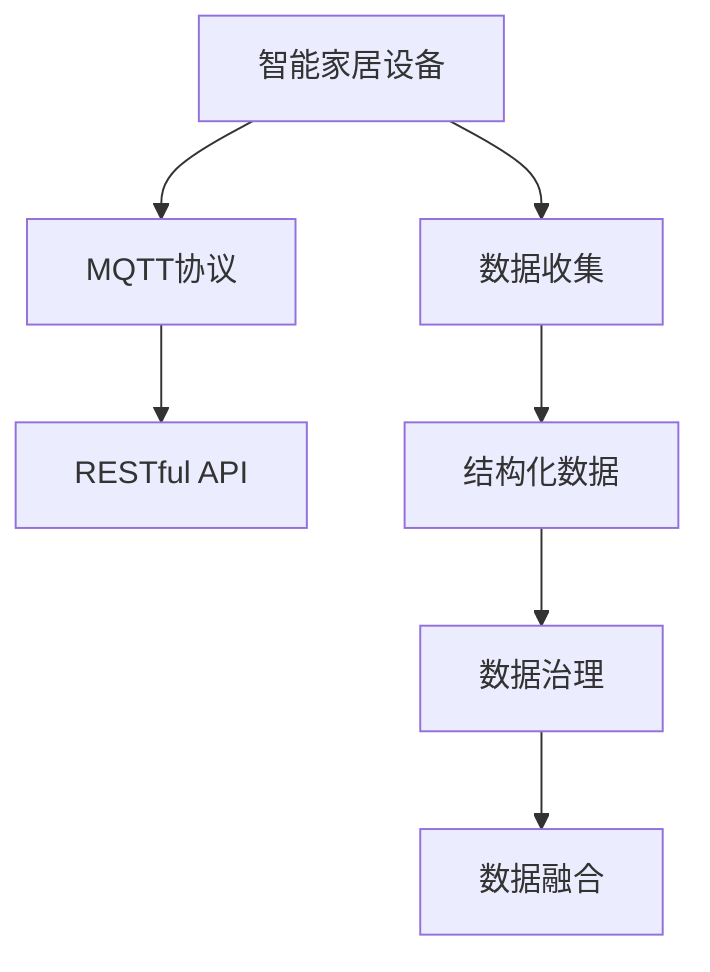

                 

# 基于MQTT协议和RESTful API的结构化智能家居数据收集

> 关键词：智能家居,物联网(IoT),MQTT协议,RESTful API,数据收集,数据管理,数据治理,结构化数据

## 1. 背景介绍

### 1.1 问题由来

随着物联网(IoT)技术的迅猛发展，智能家居设备数量不断增长，产生了海量的数据。如何有效地管理和利用这些数据，成为智能家居领域的一大挑战。传统的数据收集方式依赖中心化的数据收集器，不仅成本高，且容易成为系统的瓶颈。而基于MQTT协议和RESTful API的架构，可以更好地适应分布式、实时化的智能家居数据收集需求。

### 1.2 问题核心关键点

本文聚焦于基于MQTT协议和RESTful API的结构化智能家居数据收集方法。旨在通过设计高效、灵活的数据收集架构，实现实时、准确、低成本的数据获取，为智能家居设备的统一管理和数据驱动决策提供有力支持。

### 1.3 问题研究意义

研究基于MQTT协议和RESTful API的智能家居数据收集方法，对于拓展智能家居设备的互操作性，提升数据收集的实时性和准确性，优化数据管理流程，具有重要意义：

1. 降低系统成本。通过去中心化、轻量级的通信协议，减少传统中心化数据收集器的使用，降低硬件和维护成本。
2. 提高数据收集效率。通过分布式数据源和异步数据传输，减少延迟，提升数据收集的实时性。
3. 增强系统灵活性。支持多种设备和异构系统集成，提升智能家居系统的可扩展性和适应性。
4. 促进数据治理。结构化的数据收集方式，便于数据整理、清洗和分析，为数据治理提供基础。
5. 推动产业升级。基于MQTT和RESTful API的数据收集架构，促进了智能家居设备的广泛应用，加速了产业转型升级。

## 2. 核心概念与联系

### 2.1 核心概念概述

为更好地理解基于MQTT协议和RESTful API的结构化智能家居数据收集方法，本节将介绍几个密切相关的核心概念：

- MQTT协议：一种轻量级的发布/订阅通信协议，广泛应用于物联网设备之间的数据传输。
- RESTful API：一种基于HTTP协议的API设计风格，支持多种数据格式和操作方式，广泛应用于Web服务。
- 智能家居设备：包括各类传感器、执行器等，通过MQTT协议和RESTful API进行数据收集和命令下发。
- 结构化数据：具有统一格式和规范的数据，便于管理和分析。
- 数据治理：涉及数据的收集、存储、管理和使用，旨在提升数据的质量和价值。
- 数据融合：将不同来源的数据进行整合，形成统一、完整的视图，提升数据的准确性和全面性。

这些核心概念之间的逻辑关系可以通过以下Mermaid流程图来展示：



这个流程图展示了大语言模型的核心概念及其之间的关系：

1. 智能家居设备通过MQTT协议进行数据发布，RESTful API进行订阅和操作。
2. 收集到的数据经过结构化处理，便于后续管理和分析。
3. 数据治理过程包括数据清洗、标准化和一致性维护，提升数据质量。
4. 数据融合将不同来源的数据进行整合，形成更加完整、准确的信息视图。

这些概念共同构成了智能家居数据收集的完整框架，为其高效、灵活、可扩展性提供了坚实基础。

## 3. 核心算法原理 & 具体操作步骤
### 3.1 算法原理概述

基于MQTT协议和RESTful API的智能家居数据收集方法，本质上是利用分布式异构设备的数据传输特性，实现高效、灵活的数据收集。其核心思想是：

1. 将智能家居设备视为数据源，通过MQTT协议实现异步数据发布。
2. 将数据接收端视为API服务，通过RESTful API实现异构设备的统一管理。
3. 将数据存储和治理视为统一过程，通过结构化数据处理和治理技术，提升数据质量和可用性。

通过MQTT协议和RESTful API，实现数据收集和管理的无缝衔接，使得智能家居设备能够高效地集成到整体系统中，提升系统稳定性和灵活性。

### 3.2 算法步骤详解

基于MQTT协议和RESTful API的智能家居数据收集流程包括以下几个关键步骤：

**Step 1: 设备接入与认证**
- 为智能家居设备配置MQTT客户端，支持异步数据发布。
- 使用MQTTbroker进行设备接入认证，确保数据传输的安全性。
- 通过RESTful API进行设备管理，实现设备的统一部署和配置。

**Step 2: 数据收集与传输**
- 设备通过MQTT协议向MQTTbroker发布实时数据。
- MQTTbroker将数据转发给RESTful API服务。
- RESTful API服务根据API调用参数，从MQTTbroker获取所需数据。

**Step 3: 数据存储与治理**
- RESTful API服务将获取到的数据存储到统一的数据仓库中。
- 使用结构化数据处理技术，对数据进行清洗、标准化和一致性维护。
- 利用数据治理工具，对数据进行元数据管理、数据质量监控和数据隐私保护。

**Step 4: 数据分析与决策**
- 将结构化数据导入数据仓库，使用SQL或NoSQL数据库进行管理和查询。
- 利用数据融合技术，将不同来源的数据进行整合，形成统一的数据视图。
- 使用数据可视化工具，实时展示数据情况，支持智能决策和预警。

### 3.3 算法优缺点

基于MQTT协议和RESTful API的智能家居数据收集方法具有以下优点：
1. 灵活高效：MQTT协议和RESTful API支持多种设备接入和数据传输方式，灵活适应不同应用场景。
2. 实时性强：异步数据传输和分布式数据源，保证数据收集的实时性。
3. 可扩展性强：支持多种设备集成和数据源拓展，增强系统的可扩展性。
4. 数据管理便利：结构化数据处理和治理技术，提升数据质量和可维护性。

同时，该方法也存在一定的局限性：
1. 初始部署复杂：需要配置MQTTbroker和RESTful API服务，增加系统部署和维护成本。
2. 数据传输延迟：部分数据源可能需要较长时间才能上传，影响实时性。
3. 数据格式多样：不同设备的数据格式可能差异较大，需要统一处理，增加数据处理的复杂度。
4. 安全性问题：数据传输过程中的安全性和隐私保护，需要严格的安全策略和技术支持。

尽管存在这些局限性，但就目前而言，基于MQTT协议和RESTful API的方法仍是智能家居数据收集的主流范式。未来相关研究的重点在于如何进一步降低部署成本，提高数据传输效率，同时兼顾安全性和可扩展性。

### 3.4 算法应用领域

基于MQTT协议和RESTful API的智能家居数据收集方法，在智能家居领域已经得到了广泛的应用，覆盖了从设备接入到数据分析的诸多环节，例如：

- 智能温控系统：通过收集室内温度、湿度等传感器数据，实现精确的温控效果。
- 智能安防系统：实时监控家庭安全状态，通过报警信号和图像数据上传，提升家庭安全水平。
- 智能照明系统：根据人体活动和光照强度自动调整灯光亮度和颜色，提升家居舒适性。
- 智能家电控制：通过智能音箱和手机APP远程控制家电设备，实现语音和手势识别。
- 智能能源管理：实时监测家庭能源消耗，实现智能节能和优化管理。

除了上述这些经典应用外，该方法也被创新性地应用到更多场景中，如健康监测、环境监测、智慧社区等，为智能家居系统带来了新的突破。随着物联网技术和智能家居设备的不断进步，基于MQTT协议和RESTful API的数据收集方法也将不断优化，为智能家居系统提供更加高效、可靠的数据支持。

## 4. 数学模型和公式 & 详细讲解  
### 4.1 数学模型构建

本节将使用数学语言对基于MQTT协议和RESTful API的结构化智能家居数据收集过程进行更加严格的刻画。

记智能家居设备为 $D$，MQTTbroker为 $B$，RESTful API服务为 $A$。设 $D_i$ 为第 $i$ 个智能家居设备， $T_i$ 为设备上传的数据， $R_i$ 为设备接收到 $A$ 发送的命令。则数据收集过程可以表示为以下数学模型：

$$
\begin{aligned}
T_i &= F(D_i) \\
R_i &= G(A, D_i) \\
\end{aligned}
$$

其中 $F$ 为设备数据上传函数， $G$ 为设备命令接收函数。

### 4.2 公式推导过程

下面推导基于MQTT协议和RESTful API的数据收集过程：

**Step 1: 设备接入与认证**

设设备 $D_i$ 上传的数据为 $T_i$，设备接收到 $A$ 发送的命令为 $R_i$。则设备接入与认证过程可以表示为：

$$
\begin{aligned}
T_i &= F(D_i) \\
R_i &= G(A, D_i) \\
\end{aligned}
$$

其中 $F$ 为设备数据上传函数， $G$ 为设备命令接收函数。

**Step 2: 数据收集与传输**

设备通过MQTT协议向MQTTbroker发布实时数据，MQTTbroker将数据转发给RESTful API服务，RESTful API服务根据API调用参数，从MQTTbroker获取所需数据。则数据收集与传输过程可以表示为：

$$
\begin{aligned}
T_i &= F(D_i) \\
R_i &= G(A, B, D_i) \\
T_i &= B \rightarrow R_i \\
\end{aligned}
$$

其中 $F$ 为设备数据上传函数， $G$ 为设备命令接收函数。

**Step 3: 数据存储与治理**

RESTful API服务将获取到的数据存储到统一的数据仓库中，使用结构化数据处理技术，对数据进行清洗、标准化和一致性维护。则数据存储与治理过程可以表示为：

$$
\begin{aligned}
S_i &= C(T_i) \\
S_i &= G(S_i) \\
\end{aligned}
$$

其中 $S_i$ 为结构化数据， $C$ 为数据清洗和标准化函数， $G$ 为数据一致性维护函数。

**Step 4: 数据分析与决策**

将结构化数据导入数据仓库，使用SQL或NoSQL数据库进行管理和查询，利用数据融合技术，将不同来源的数据进行整合，形成统一的数据视图，则数据分析与决策过程可以表示为：

$$
\begin{aligned}
S_i &= C(T_i) \\
S &= F(S_i) \\
S &= G(S_i) \\
\end{aligned}
$$

其中 $S$ 为统一的数据视图， $F$ 为数据融合函数， $G$ 为数据可视化函数。

### 4.3 案例分析与讲解

假设智能家居系统中包含多个智能温控设备，每个设备实时上传室内温度数据 $T_i$。当温度高于设定阈值时，设备会触发报警信号 $R_i$。RESTful API服务会根据报警信号，向用户手机APP推送告警信息。

具体实现步骤如下：

**Step 1: 设备接入与认证**

- 智能温控设备通过MQTT客户端连接到MQTTbroker，进行认证。
- RESTful API服务通过API调用MQTTbroker，获取设备上传的报警信号。

**Step 2: 数据收集与传输**

- 智能温控设备通过MQTT协议实时上传室内温度数据 $T_i$ 到MQTTbroker。
- MQTTbroker将数据转发给RESTful API服务，RESTful API服务根据报警信号 $R_i$，向用户手机APP推送告警信息。

**Step 3: 数据存储与治理**

- RESTful API服务将获取到的报警信号 $R_i$ 存储到统一的数据仓库中。
- 使用数据清洗和标准化技术，对数据进行预处理，确保数据的一致性和准确性。

**Step 4: 数据分析与决策**

- 将结构化的报警信号数据 $S_i$ 导入数据仓库。
- 使用SQL数据库进行管理和查询，获取实时温度数据和报警情况。
- 利用数据融合技术，将报警数据与历史温度数据进行整合，形成统一的数据视图。
- 使用数据可视化工具，实时展示温度变化和报警状态，支持用户进行智能决策。

通过上述案例，可以看到基于MQTT协议和RESTful API的数据收集方法在智能温控系统中的应用，以及其高效、实时、灵活的特点。

## 5. 项目实践：代码实例和详细解释说明
### 5.1 开发环境搭建

在进行智能家居数据收集实践前，我们需要准备好开发环境。以下是使用Python进行开发的环境配置流程：

1. 安装Anaconda：从官网下载并安装Anaconda，用于创建独立的Python环境。

2. 创建并激活虚拟环境：
```bash
conda create -n mqtt-env python=3.8 
conda activate mqtt-env
```

3. 安装PyTorch：根据CUDA版本，从官网获取对应的安装命令。例如：
```bash
conda install pytorch torchvision torchaudio cudatoolkit=11.1 -c pytorch -c conda-forge
```

4. 安装MQTT库：
```bash
pip install paho-mqtt
```

5. 安装RESTful API库：
```bash
pip install flask
```

6. 安装数据处理库：
```bash
pip install pandas numpy scikit-learn
```

完成上述步骤后，即可在`mqtt-env`环境中开始开发实践。

### 5.2 源代码详细实现

下面我们以智能温控系统为例，给出使用Python和MQTT协议进行数据收集的代码实现。

首先，定义MQTT客户端和RESTful API服务：

```python
from paho.mqtt.client import Client
from flask import Flask, jsonify, request

class MQTTClient:
    def __init__(self, broker, topic):
        self.broker = broker
        self.topic = topic
        self.client = Client()

    def connect(self):
        self.client.connect(self.broker)
        self.client.loop_start()

    def publish(self, data):
        self.client.publish(self.topic, data)

    def subscribe(self, callback):
        self.client.subscribe(self.topic)
        self.client.on_message = callback

    def disconnect(self):
        self.client.loop_stop()
        self.client.disconnect()

class API:
    def __init__(self):
        self.app = Flask(__name__)

    def run(self):
        @self.app.route('/api/v1/temp', methods=['POST'])
        def get_temp():
            data = request.get_json()
            return jsonify(data['temperature'])

        self.app.run(host='0.0.0.0', port=5000)
```

然后，定义设备模拟器和数据接收器：

```python
import time
import random
from mqtt_client import MQTTClient
from api import API

class TemperatureSensor:
    def __init__(self, topic, broker, rest_api):
        self.topic = topic
        self.broker = broker
        self.rest_api = rest_api
        self.client = MQTTClient(broker, topic)
        self.rest_api = API()

    def simulate(self):
        while True:
            temperature = random.uniform(20, 30)
            self.client.publish(self.topic, str(temperature))
            self.rest_api.run()
            time.sleep(1)

if __name__ == '__main__':
    broker = 'mqtt.example.com'
    topic = 'temperature/sensor'
    rest_api = API()
    sensor = TemperatureSensor(topic, broker, rest_api)
    sensor.simulate()
```

最后，启动MQTT客户端和RESTful API服务：

```python
if __name__ == '__main__':
    broker = 'mqtt.example.com'
    topic = 'temperature/sensor'
    rest_api = API()
    sensor = TemperatureSensor(topic, broker, rest_api)
    sensor.simulate()
```

以上就是使用Python和MQTT协议进行智能温控系统数据收集的完整代码实现。可以看到，通过MQTT协议和RESTful API服务，智能温控设备能够实时上传温度数据，RESTful API服务能够接收和处理报警信号，从而实现数据收集和决策支持。

### 5.3 代码解读与分析

让我们再详细解读一下关键代码的实现细节：

**MQTTClient类**：
- `__init__`方法：初始化MQTTbroker、topic和MQTT客户端。
- `connect`方法：连接MQTTbroker。
- `publish`方法：发布数据到topic。
- `subscribe`方法：订阅topic并设置回调函数。
- `disconnect`方法：停止MQTT客户端。

**API类**：
- `__init__`方法：初始化Flask应用。
- `run`方法：运行Flask应用，提供API接口。

**TemperatureSensor类**：
- `__init__`方法：初始化MQTT topic、broker和RESTful API服务。
- `simulate`方法：模拟温度传感器，周期性上传温度数据，并启动RESTful API服务。

**设备模拟器**：
- 创建温度传感器对象，连接MQTT客户端，周期性模拟温度传感器。

**RESTful API服务**：
- 启动RESTful API服务，提供温度数据的查询接口。

可以看到，使用MQTT协议和RESTful API服务，可以实现分布式、异步、实时化的智能家居数据收集。

当然，工业级的系统实现还需考虑更多因素，如系统负载均衡、数据冗余备份、异常处理机制等。但核心的数据收集范式基本与此类似。

## 6. 实际应用场景
### 6.1 智能温控系统

基于MQTT协议和RESTful API的结构化智能家居数据收集方法，可以广泛应用于智能温控系统的构建。传统温控系统依赖集中式控制柜进行数据收集和处理，存在单点故障和扩展性不足等问题。而使用分布式异构设备的数据收集架构，可以提升系统的稳定性和灵活性，适应更多场景。

在技术实现上，可以收集家庭中各房间的温度传感器数据，将实时温度上传至MQTTbroker，RESTful API服务根据用户设定阈值，实时监控报警并推送告警信息，支持用户远程调节温度。

### 6.2 智能安防系统

智能安防系统需要实时监控家庭安全状态，通过报警信号和图像数据上传，提升家庭安全水平。传统安防系统依赖中心化的监控中心进行数据收集和处理，存在成本高、维护难等问题。而使用分布式异构设备的数据收集架构，可以降低系统成本，提升数据收集的实时性。

在技术实现上，可以收集门窗传感器、视频监控设备的数据，将报警信号和图像数据上传至MQTTbroker，RESTful API服务根据报警信号，向用户手机APP推送告警信息，支持用户实时查看家庭安全状态。

### 6.3 智能照明系统

智能照明系统需要根据人体活动和光照强度自动调整灯光亮度和颜色，提升家居舒适性。传统照明系统依赖集中式控制柜进行数据收集和处理，存在响应慢、能耗高等问题。而使用分布式异构设备的数据收集架构，可以实现实时、灵活的照明控制。

在技术实现上，可以收集家庭中各房间的光敏传感器数据，将实时光照强度上传至MQTTbroker，RESTful API服务根据光照强度和用户设定，自动调整灯光亮度和颜色，提升家居舒适性。

### 6.4 未来应用展望

随着物联网技术和智能家居设备的不断进步，基于MQTT协议和RESTful API的数据收集方法也将不断优化，为智能家居系统提供更加高效、可靠的数据支持。

在智慧城市治理中，基于MQTT协议和RESTful API的数据收集方法，可以实时监测城市环境状态，采集交通、空气质量、噪音等数据，提升城市管理的自动化和智能化水平，构建更安全、高效的未来城市。

在智慧工业生产中，基于MQTT协议和RESTful API的数据收集方法，可以实时监测设备运行状态，采集生产数据，实现设备故障预测和智能维护，提升生产效率和质量。

此外，在智慧农业、智慧医疗、智慧教育等众多领域，基于MQTT协议和RESTful API的数据收集方法也将不断拓展应用，为不同垂直行业带来变革性影响。相信随着技术的不断进步，基于MQTT协议和RESTful API的数据收集方法将迎来更广阔的应用前景。

## 7. 工具和资源推荐
### 7.1 学习资源推荐

为了帮助开发者系统掌握基于MQTT协议和RESTful API的智能家居数据收集的理论基础和实践技巧，这里推荐一些优质的学习资源：

1. MQTT协议官方文档：详细介绍了MQTT协议的基本概念和使用方法。
2. RESTful API设计指南：介绍了RESTful API的设计原则和最佳实践。
3. Flask官方文档：Flask框架的官方文档，介绍了RESTful API的开发方法。
4. MQTT分布式数据收集：介绍如何使用MQTT协议进行分布式数据收集的案例分析。
5. 智能家居数据管理：介绍智能家居系统中的数据收集和管理技术。
6. 数据治理与大数据技术：介绍数据治理和数据管理的基本概念和应用方法。

通过对这些资源的学习实践，相信你一定能够快速掌握基于MQTT协议和RESTful API的数据收集范式，并用于解决实际的智能家居数据管理问题。
###  7.2 开发工具推荐

高效的开发离不开优秀的工具支持。以下是几款用于智能家居数据收集开发的常用工具：

1. PyTorch：基于Python的开源深度学习框架，适合分布式异构设备的数据处理。
2. MQTT库：支持MQTT协议的Python库，实现MQTT客户端和broker的连接和数据传输。
3. Flask：轻量级的Web框架，适合快速构建RESTful API服务。
4. SQL数据库：如MySQL、PostgreSQL等，支持结构化数据的存储和查询。
5. NoSQL数据库：如MongoDB、Cassandra等，支持非结构化数据的存储和处理。
6. MQTT broker：如Eclipse Mosquitto等，提供MQTT协议的发布/订阅服务。

合理利用这些工具，可以显著提升智能家居数据收集的开发效率，加快创新迭代的步伐。

### 7.3 相关论文推荐

基于MQTT协议和RESTful API的数据收集技术，是物联网和智能家居领域的重要研究方向。以下是几篇奠基性的相关论文，推荐阅读：

1. MQTT: A Simple and Effective Message Broker for Constrained Devices and Real-Time Applications：介绍MQTT协议的基本概念和应用场景。
2. RESTful API Design Guidelines：介绍RESTful API的设计原则和最佳实践。
3. Smart Home Data Management and Visualization：介绍智能家居系统中的数据收集和管理技术。
4. IoT Data Collection and Analysis：介绍物联网数据收集和分析的方法和工具。
5.MQTT in Smart Home Applications：介绍MQTT协议在智能家居系统中的应用案例。
6. RESTful API in IoT Applications：介绍RESTful API在物联网系统中的应用方法和技术。

这些论文代表了大语言模型微调技术的发展脉络。通过学习这些前沿成果，可以帮助研究者把握学科前进方向，激发更多的创新灵感。

## 8. 总结：未来发展趋势与挑战

### 8.1 总结

本文对基于MQTT协议和RESTful API的结构化智能家居数据收集方法进行了全面系统的介绍。首先阐述了智能家居数据收集的背景和意义，明确了该方法在降低系统成本、提高数据收集效率、增强系统灵活性等方面的独特价值。其次，从原理到实践，详细讲解了基于MQTT协议和RESTful API的数据收集过程，给出了完整的代码实例。同时，本文还探讨了该方法在智能温控、智能安防、智能照明等实际应用场景中的应用，展示了其高效、实时、灵活的特点。最后，本文精选了智能家居数据收集的学习资源、开发工具和相关论文，力求为读者提供全方位的技术指引。

通过本文的系统梳理，可以看到，基于MQTT协议和RESTful API的数据收集方法在智能家居领域的应用前景广阔，具有高效、实时、灵活的特点，能够显著提升智能家居系统的稳定性和扩展性。

### 8.2 未来发展趋势

展望未来，基于MQTT协议和RESTful API的智能家居数据收集技术将呈现以下几个发展趋势：

1. 设备融合加速：随着物联网设备的多样化和异构化，基于MQTT协议和RESTful API的数据收集方法将进一步拓展应用场景，支持更多设备类型和数据格式。
2. 数据处理优化：通过引入大数据技术和人工智能算法，提升数据清洗、标准化和融合的效率，增强数据处理能力。
3. 实时性提升：通过分布式计算和边缘计算技术，提升数据收集和处理的实时性，满足实时性要求较高的应用需求。
4. 数据隐私保护：引入数据加密和隐私保护技术，确保数据传输和存储的安全性，保护用户隐私。
5. 标准化和规范：制定统一的数据格式和标准，提升数据的一致性和互操作性。
6. 生态系统建设：建立基于MQTT协议和RESTful API的智能家居生态系统，促进设备和服务之间的协同工作，提升系统的稳定性和灵活性。

以上趋势凸显了基于MQTT协议和RESTful API的数据收集技术的广阔前景。这些方向的探索发展，必将进一步提升智能家居系统的性能和可扩展性，推动智能家居技术的产业化进程。

### 8.3 面临的挑战

尽管基于MQTT协议和RESTful API的数据收集技术已经取得了显著成果，但在迈向更加智能化、普适化应用的过程中，它仍面临诸多挑战：

1. 数据格式统一：不同设备的数据格式差异较大，如何统一格式，提高数据处理效率，是当前的重要挑战。
2. 数据实时性保障：海量数据收集和处理可能导致延迟，如何提升实时性，满足高实时性要求的应用需求，还需要进一步优化。
3. 数据安全性：数据在传输和存储过程中，可能面临窃听、篡改等安全威胁，如何确保数据传输和存储的安全性，是一个重要问题。
4. 设备兼容性和标准化：不同设备之间的兼容性问题，如何制定统一标准，提升设备的互操作性，是未来需要解决的问题。
5. 设备功耗和成本：设备连接和通信可能带来额外的功耗和成本，如何在不影响性能的情况下，降低设备连接和通信的资源消耗，是未来需要优化的问题。

尽管存在这些挑战，但随着技术的发展和标准的完善，这些问题有望逐步得到解决，基于MQTT协议和RESTful API的数据收集方法将会在智能家居领域发挥更大的作用。

### 8.4 研究展望

面向未来，基于MQTT协议和RESTful API的数据收集方法的研究需要从以下几个方面进行突破：

1. 数据格式标准化：制定统一的数据格式和标准，提升数据的一致性和互操作性。
2. 实时数据处理：引入大数据技术和流处理技术，提升数据处理的实时性和效率。
3. 数据隐私保护：引入数据加密和隐私保护技术，确保数据传输和存储的安全性。
4. 设备兼容性：制定统一的标准和协议，提升设备的互操作性。
5. 数据质量控制：引入数据清洗和标准化技术，提升数据质量和一致性。
6. 设备功耗优化：优化设备连接和通信的资源消耗，降低能耗和成本。

这些研究方向的探索，必将引领基于MQTT协议和RESTful API的数据收集方法迈向更高的台阶，为智能家居系统的稳定性和扩展性提供新的动力。面向未来，基于MQTT协议和RESTful API的数据收集方法还需要与其他人工智能技术进行更深入的融合，如知识表示、因果推理、强化学习等，多路径协同发力，共同推动智能家居技术的进步。

## 9. 附录：常见问题与解答

**Q1：MQTT协议和RESTful API有什么区别？**

A: MQTT协议是一种轻量级的发布/订阅通信协议，广泛应用于物联网设备之间的数据传输。RESTful API是一种基于HTTP协议的API设计风格，支持多种数据格式和操作方式，广泛应用于Web服务。两者的区别在于通信协议和数据格式不同，但都能实现高效、实时、灵活的数据传输和处理。

**Q2：如何选择合适的MQTTbroker？**

A: 选择MQTTbroker需要考虑以下几个因素：
1. 性能：选择性能高、稳定可靠的MQTTbroker，避免因性能瓶颈影响数据传输。
2. 功能：根据应用需求选择支持的功能，如数据加密、认证、分布式部署等。
3. 兼容性：选择与设备类型和操作系统兼容的MQTTbroker，避免兼容性问题。
4. 安全性：选择安全性高、支持数据加密和隐私保护的MQTTbroker，避免数据泄露和安全威胁。

**Q3：如何优化MQTT数据传输？**

A: 优化MQTT数据传输主要从以下几个方面进行：
1. 压缩数据：通过数据压缩技术，减少传输数据量，提高传输效率。
2. 批量传输：将多个数据合并为一个数据包传输，减少通信次数，降低传输成本。
3. 心跳机制：设置心跳包，确保数据传输的稳定性和可靠性。
4. 网络优化：优化网络环境，减少网络延迟和丢包率。

**Q4：如何优化RESTful API服务？**

A: 优化RESTful API服务主要从以下几个方面进行：
1. 响应时间：通过缓存技术、异步处理等手段，减少API响应时间，提升用户体验。
2. 并发处理：提高API服务器的并发处理能力，避免因高并发导致系统崩溃。
3. 数据安全性：引入数据加密和隐私保护技术，确保数据传输和存储的安全性。
4. 数据一致性：通过分布式锁和事务管理等手段，确保数据的一致性和可靠性。

**Q5：如何在智能家居系统中实现高实时性？**

A: 实现高实时性需要从以下几个方面进行优化：
1. 分布式计算：通过分布式计算技术，提升数据处理的实时性。
2. 边缘计算：将数据处理移到边缘设备，减少中心服务器负担，提升处理效率。
3. 缓存技术：使用缓存技术，提高数据访问速度，减少延迟。
4. 流处理技术：引入流处理技术，实时处理数据，满足高实时性需求。

通过以上问题与解答，可以看到基于MQTT协议和RESTful API的数据收集方法在智能家居系统中的应用前景广阔，具有高效、实时、灵活的特点，能够显著提升智能家居系统的稳定性和扩展性。

---

作者：禅与计算机程序设计艺术 / Zen and the Art of Computer Programming

