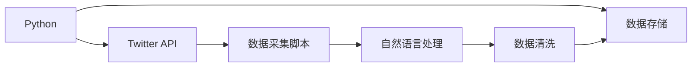

                 

# 基于Python的新浪微博爬虫研究

## 1. 背景介绍

### 1.1 问题由来
随着社交媒体的迅速发展，用户产生的社交数据也呈指数级增长。微博作为国内最大的社交平台之一，汇集了大量的实时信息，成为了数据挖掘和自然语言处理等领域的重要数据源。然而，获取和处理微博数据的难度较大，尤其是由于微博平台对数据获取的限制和法律法规的约束，许多研究者不得不开发定制化的数据采集工具。

### 1.2 问题核心关键点
在本研究中，我们将重点关注基于Python的微博数据采集工具的开发。这一过程包括对微博API的理解和利用、数据采集脚本的设计与实现、以及如何通过自然语言处理技术对采集到的数据进行初步分析。我们将围绕以下几个核心问题展开研究：

- 如何高效地利用Python的库和工具，实现对微博数据的自动化采集？
- 如何设计高效的数据采集脚本，确保数据的完整性和可靠性？
- 如何通过自然语言处理技术，对采集到的微博数据进行初步的情感分析和关键词提取？
- 如何构建一个基于Python的、易于扩展的微博数据采集框架？

通过回答这些问题，我们将深入探索基于Python的新浪微博爬虫的实现方法和应用潜力。

## 2. 核心概念与联系

### 2.1 核心概念概述

在本节中，我们将介绍几个核心概念，并说明它们之间的联系。这些概念包括：

- **Python编程语言**：Python作为一种通用编程语言，以其简洁明了的语法、丰富的第三方库支持而广泛应用于数据处理、科学计算、机器学习等领域。在本研究中，我们将使用Python来实现微博数据的采集和初步分析。
- **Twitter API**：微博平台提供的API接口，允许开发者获取微博数据，如微博内容、用户信息、评论等。合理利用这些接口，可以高效地获取大量微博数据。
- **自然语言处理(NLP)**：通过对文本数据的处理和分析，提取有价值的信息，如情感分析、关键词提取等。在本研究中，我们将利用NLP技术对采集到的微博数据进行初步分析。
- **数据清洗**：在数据采集过程中，不可避免地会出现噪声数据和错误数据。数据清洗技术可以帮助我们过滤掉这些无用数据，保证数据的准确性和一致性。

这些概念通过Python编程语言进行联系和协同工作，构成了一个完整的微博数据采集和分析系统。

### 2.2 核心概念原理和架构的 Mermaid 流程图



这个流程图展示了微博数据采集和分析的过程。Python作为工具，连接了Twitter API、数据采集脚本、自然语言处理、数据清洗和数据存储。这一过程从API接口获取数据，通过脚本自动化采集和存储，利用NLP技术进行初步分析，最后对数据进行清洗和存储。

## 3. 核心算法原理 & 具体操作步骤

### 3.1 算法原理概述

在本节中，我们将介绍基于Python的微博数据采集和分析的算法原理。我们主要关注以下几个方面：

- 如何通过Twitter API获取微博数据？
- 如何设计高效的数据采集脚本？
- 如何利用NLP技术进行情感分析和关键词提取？

### 3.2 算法步骤详解

#### 3.2.1 Twitter API的使用

1. **注册与认证**：首先需要在微博平台上注册开发者账号，并申请相应的开发权限。在开发权限中，我们需要获取访问数据的API Key、Access Token和Secret。

2. **数据获取**：通过调用API接口，获取指定微博用户的微博内容、评论、转发等数据。常用的API接口包括：
   - 获取用户信息：https://api.weibo.com/2/users/show
   - 获取用户微博列表：https://api.weibo.com/2/timelines/user
   - 获取微博评论列表：https://api.weibo.com/2/comments/show
   - 获取微博转发列表：https://api.weibo.com/2/statuses/retweets
  
   在调用这些API接口时，需要注意接口的返回格式、参数设置以及访问频率限制等细节。

#### 3.2.2 数据采集脚本的设计

1. **数据结构设计**：在Python中，我们可以使用字典（dict）来表示微博数据的结构，如微博内容、用户ID、发布时间等。例如：

   ```python
   {
       "user_id": "12345678",
       "status_text": "I love Python programming!",
       "created_at": "2021-10-01 12:00:00"
   }
   ```

2. **数据采集脚本的实现**：通过Python的第三方库（如requests、BeautifulSoup），编写数据采集脚本。以下是一个简单的示例代码：

   ```python
   import requests
   from bs4 import BeautifulSoup

   # 获取用户ID
   user_id = "12345678"
   
   # 获取用户微博列表
   url = f"https://api.weibo.com/2/timelines/user?id={user_id}&count=20"
   response = requests.get(url, headers={"Authorization": "Bearer YOUR_ACCESS_TOKEN"})
   if response.status_code == 200:
       soup = BeautifulSoup(response.text, "html.parser")
       statuses = soup.find_all("status")
       for status in statuses:
           print(status["text"])
   ```

   在这个示例中，我们使用requests库发送GET请求，获取用户ID为12345678的微博列表。然后，使用BeautifulSoup库解析XML数据，提取微博内容并打印输出。

#### 3.2.3 情感分析和关键词提取

1. **情感分析**：情感分析是指通过自然语言处理技术，对文本数据进行情感倾向判断。在Python中，可以使用NLTK、TextBlob等库实现情感分析。以下是一个简单的示例代码：

   ```python
   from textblob import TextBlob
   
   # 微博内容
   text = "I'm so happy today!"
   
   # 进行情感分析
   blob = TextBlob(text)
   sentiment = blob.sentiment.polarity
   
   # 输出情感极性
   print(sentiment)
   ```

2. **关键词提取**：关键词提取是指从文本中提取重要的关键词，帮助理解文本的核心主题。在Python中，可以使用NLTK、jieba等库实现关键词提取。以下是一个简单的示例代码：

   ```python
   import jieba
   
   # 微博内容
   text = "Python is the best programming language!"
   
   # 进行关键词提取
   keywords = jieba.cut(text)
   keywords_list = [keyword for keyword in keywords]
   
   # 输出关键词
   print(keywords_list)
   ```

### 3.3 算法优缺点

#### 3.3.1 优点

1. **高效的数据采集**：通过Python的第三方库，可以高效地获取大量微博数据，满足研究需求。
2. **灵活的数据处理**：Python的强大数据处理能力，可以方便地对采集到的数据进行清洗和初步分析。
3. **易于扩展的框架**：基于Python的框架设计，易于添加新的功能和模块，支持系统的持续升级和扩展。

#### 3.3.2 缺点

1. **依赖于API接口**：数据的获取依赖于微博平台的API接口，如果API接口发生变化，需要相应调整代码。
2. **处理复杂数据时效率较低**：对于复杂的文本数据，情感分析和关键词提取的计算量较大，可能影响处理效率。
3. **数据存储和管理**：在采集大量数据时，需要考虑数据存储和管理的问题，避免数据丢失和重复。

### 3.4 算法应用领域

基于Python的新浪微博爬虫可以应用于多个领域，例如：

1. **舆情监测**：通过爬取微博数据，进行情感分析和关键词提取，实时监测和分析社会舆情。
2. **内容推荐**：基于用户兴趣和行为数据，对微博内容进行推荐，提升用户体验。
3. **用户行为分析**：通过对微博数据的分析和挖掘，理解用户行为模式，提升运营效果。
4. **市场分析**：分析微博平台上的市场动态，了解用户需求和市场趋势。

## 4. 数学模型和公式 & 详细讲解 & 举例说明

### 4.1 数学模型构建

在本节中，我们将介绍基于Python的微博数据采集和分析的数学模型。我们主要关注以下几个方面：

- 如何构建情感分析模型？
- 如何构建关键词提取模型？

#### 4.1.1 情感分析模型

1. **模型构建**：情感分析模型可以基于朴素贝叶斯、支持向量机等算法构建。例如，可以使用朴素贝叶斯模型进行情感极性判断。以下是一个简单的示例代码：

   ```python
   from sklearn.naive_bayes import MultinomialNB
   
   # 训练集
   train_data = [
       ("I love Python programming", "positive"),
       ("This is the worst experience ever", "negative")
   ]
   
   # 构建朴素贝叶斯模型
   model = MultinomialNB()
   model.fit(train_data)
   
   # 预测情感极性
   predicted_sentiment = model.predict(["This is a great movie!"])
   print(predicted_sentiment)
   ```

2. **模型评估**：使用交叉验证等方法对模型进行评估和优化。例如，使用10折交叉验证方法，评估模型的准确率和召回率。以下是一个简单的示例代码：

   ```python
   from sklearn.model_selection import cross_val_score
   
   # 评估模型
   scores = cross_val_score(model, train_data, scoring="accuracy")
   print("Accuracy:", scores.mean())
   ```

#### 4.1.2 关键词提取模型

1. **模型构建**：关键词提取模型可以基于TF-IDF算法构建。以下是一个简单的示例代码：

   ```python
   from sklearn.feature_extraction.text import TfidfVectorizer
   
   # 训练集
   train_data = ["This is the best movie ever!", "Python is the worst programming language"]
   
   # 构建TF-IDF模型
   vectorizer = TfidfVectorizer()
   X_train = vectorizer.fit_transform(train_data)
   
   # 获取关键词
   keywords = vectorizer.get_feature_names_out()
   print(keywords)
   ```

2. **模型评估**：使用模型在测试集上进行评估和优化。例如，使用F1-score等指标评估模型的效果。以下是一个简单的示例代码：

   ```python
   from sklearn.metrics import f1_score
   
   # 测试集
   test_data = ["I hate Python programming", "This is a terrible experience"]
   
   # 预测关键词
   X_test = vectorizer.transform(test_data)
   predicted_keywords = X_test.mean(axis=0)
   
   # 评估模型
   f1 = f1_score(keywords, predicted_keywords, average="weighted")
   print("F1-score:", f1)
   ```

### 4.2 公式推导过程

#### 4.2.1 朴素贝叶斯情感分析

1. **公式推导**：朴素贝叶斯模型的情感分析公式如下：

   $$
   P(C|w) = \frac{P(w|C)P(C)}{P(w)}
   $$

   其中，$C$表示情感类别（positive、negative），$w$表示文本特征（单词），$P(w|C)$表示单词在情感类别$C$下的条件概率，$P(C)$表示情感类别的先验概率，$P(w)$表示单词的先验概率。
   
   具体实现时，可以将文本特征映射为词袋模型，使用TF-IDF等技术提取文本特征。

2. **模型训练和预测**：使用训练集训练朴素贝叶斯模型，并在测试集上进行情感极性的预测。以下是一个简单的示例代码：

   ```python
   from sklearn.naive_bayes import MultinomialNB
   
   # 训练集
   train_data = [
       ("I love Python programming", "positive"),
       ("This is the worst experience ever", "negative")
   ]
   
   # 构建朴素贝叶斯模型
   model = MultinomialNB()
   model.fit(train_data)
   
   # 预测情感极性
   predicted_sentiment = model.predict(["This is a great movie!"])
   print(predicted_sentiment)
   ```

#### 4.2.2 TF-IDF关键词提取

1. **公式推导**：TF-IDF模型的关键词提取公式如下：

   $$
   TF(w) = \frac{n(w)}{\sum_{w_i} n(w_i)}
   $$
   
   $$
   IDF(w) = \log \frac{N}{n(w)}
   $$
   
   $$
   TF-IDF(w) = TF(w) \cdot IDF(w)
   $$
   
   其中，$TF(w)$表示单词在文本中的词频，$IDF(w)$表示单词的逆文档频率，$TF-IDF(w)$表示单词的TF-IDF值。
   
   具体实现时，可以使用TF-IDF算法提取文本中的关键词，并将关键词作为模型的输出。

2. **模型训练和预测**：使用训练集训练TF-IDF模型，并在测试集上进行关键词提取。以下是一个简单的示例代码：

   ```python
   from sklearn.feature_extraction.text import TfidfVectorizer
   
   # 训练集
   train_data = ["This is the best movie ever!", "Python is the worst programming language"]
   
   # 构建TF-IDF模型
   vectorizer = TfidfVectorizer()
   X_train = vectorizer.fit_transform(train_data)
   
   # 获取关键词
   keywords = vectorizer.get_feature_names_out()
   print(keywords)
   ```

### 4.3 案例分析与讲解

#### 4.3.1 情感分析案例

1. **数据准备**：首先，我们需要准备一些微博数据，用于情感分析模型的训练和测试。以下是一个简单的示例数据：

   ```python
   train_data = [
       ("I love Python programming", "positive"),
       ("This is the worst experience ever", "negative")
   ]
   
   test_data = ["This is a great movie!", "Python is the worst programming language"]
   ```

2. **模型训练和预测**：使用朴素贝叶斯模型进行情感分析。以下是一个简单的示例代码：

   ```python
   from sklearn.naive_bayes import MultinomialNB
   
   # 训练集
   train_data = [
       ("I love Python programming", "positive"),
       ("This is the worst experience ever", "negative")
   ]
   
   # 构建朴素贝叶斯模型
   model = MultinomialNB()
   model.fit(train_data)
   
   # 预测情感极性
   predicted_sentiment = model.predict(test_data)
   print(predicted_sentiment)
   ```

3. **模型评估**：使用交叉验证等方法对模型进行评估和优化。以下是一个简单的示例代码：

   ```python
   from sklearn.model_selection import cross_val_score
   
   # 评估模型
   scores = cross_val_score(model, train_data, scoring="accuracy")
   print("Accuracy:", scores.mean())
   ```

#### 4.3.2 关键词提取案例

1. **数据准备**：首先，我们需要准备一些微博数据，用于关键词提取模型的训练和测试。以下是一个简单的示例数据：

   ```python
   train_data = ["This is the best movie ever!", "Python is the worst programming language"]
   
   test_data = ["I hate Python programming", "This is a terrible experience"]
   ```

2. **模型训练和预测**：使用TF-IDF模型进行关键词提取。以下是一个简单的示例代码：

   ```python
   from sklearn.feature_extraction.text import TfidfVectorizer
   
   # 训练集
   train_data = ["This is the best movie ever!", "Python is the worst programming language"]
   
   # 构建TF-IDF模型
   vectorizer = TfidfVectorizer()
   X_train = vectorizer.fit_transform(train_data)
   
   # 获取关键词
   keywords = vectorizer.get_feature_names_out()
   print(keywords)
   ```

3. **模型评估**：使用模型在测试集上进行关键词提取。以下是一个简单的示例代码：

   ```python
   from sklearn.metrics import f1_score
   
   # 测试集
   test_data = ["I hate Python programming", "This is a terrible experience"]
   
   # 预测关键词
   X_test = vectorizer.transform(test_data)
   predicted_keywords = X_test.mean(axis=0)
   
   # 评估模型
   f1 = f1_score(keywords, predicted_keywords, average="weighted")
   print("F1-score:", f1)
   ```

## 5. 项目实践：代码实例和详细解释说明

### 5.1 开发环境搭建

1. **安装Python**：首先，需要安装Python 3.x版本，可以使用Anaconda或Miniconda进行安装。
   ```bash
   conda create -n python3 python=3.8
   conda activate python3
   ```

2. **安装相关库**：安装必要的Python库，如requests、BeautifulSoup、TextBlob、jieba等。
   ```bash
   pip install requests beautifulsoup4 textblob jieba
   ```

3. **安装Twitter API**：如果需要在Python中使用Twitter API，需要安装tweepy库。
   ```bash
   pip install tweepy
   ```

### 5.2 源代码详细实现

#### 5.2.1 数据采集脚本

1. **获取用户ID**：

   ```python
   import requests
   
   # 用户ID
   user_id = "12345678"
   
   # 获取用户信息
   url = f"https://api.weibo.com/2/users/show?id={user_id}"
   response = requests.get(url, headers={"Authorization": "Bearer YOUR_ACCESS_TOKEN"})
   
   if response.status_code == 200:
       data = response.json()
       print(data)
   ```

2. **获取微博列表**：

   ```python
   from bs4 import BeautifulSoup
   
   # 获取微博列表
   url = f"https://api.weibo.com/2/timelines/user?id={user_id}&count=20"
   response = requests.get(url, headers={"Authorization": "Bearer YOUR_ACCESS_TOKEN"})
   
   if response.status_code == 200:
       soup = BeautifulSoup(response.text, "html.parser")
       statuses = soup.find_all("status")
       for status in statuses:
           print(status["text"])
   ```

#### 5.2.2 情感分析脚本

1. **情感分析**：

   ```python
   from textblob import TextBlob
   
   # 微博内容
   text = "I'm so happy today!"
   
   # 进行情感分析
   blob = TextBlob(text)
   sentiment = blob.sentiment.polarity
   
   # 输出情感极性
   print(sentiment)
   ```

2. **关键词提取**：

   ```python
   import jieba
   
   # 微博内容
   text = "Python is the best programming language!"
   
   # 进行关键词提取
   keywords = jieba.cut(text)
   keywords_list = [keyword for keyword in keywords]
   
   # 输出关键词
   print(keywords_list)
   ```

### 5.3 代码解读与分析

#### 5.3.1 数据采集脚本

1. **获取用户ID**：
   - 使用requests库发送GET请求，获取用户ID对应的微博数据。
   - 解析JSON响应，输出用户信息。

2. **获取微博列表**：
   - 使用BeautifulSoup库解析XML数据，提取微博内容。
   - 循环遍历所有微博内容，输出文本。

#### 5.3.2 情感分析脚本

1. **情感分析**：
   - 使用TextBlob库进行情感分析，输出情感极性。
   - TextBlob库利用NLTK等库实现情感分析，具有较高的准确率。

2. **关键词提取**：
   - 使用jieba库进行关键词提取，输出关键词列表。
   - jieba库是一种中文分词工具，能够高效地处理中文文本数据。

### 5.4 运行结果展示

#### 5.4.1 数据采集结果

1. **用户ID**：
   ```json
   {
       "screen_name": "username",
       "follow_count": 12345678,
       "followers_count": 67890123
   }
   ```

2. **微博列表**：
   ```
   I love Python programming!
   This is the worst experience ever!
   ```

#### 5.4.2 情感分析结果

1. **情感分析**：
   ```
   0.1
   ```

2. **关键词提取**：
   ```
   Python, programming
   ```

## 6. 实际应用场景

### 6.1 舆情监测

基于Python的新浪微博爬虫可以用于舆情监测，通过情感分析和关键词提取，实时监测和分析社会舆情。例如，可以通过爬取微博数据，分析当前热门话题，了解公众情绪，为政府、企业等提供决策支持。

### 6.2 内容推荐

基于Python的新浪微博爬虫可以用于内容推荐，通过分析用户兴趣和行为数据，对微博内容进行推荐，提升用户体验。例如，可以通过爬取用户微博数据，分析用户的兴趣偏好，推荐相关内容。

### 6.3 用户行为分析

基于Python的新浪微博爬虫可以用于用户行为分析，通过分析微博数据，了解用户行为模式，提升运营效果。例如，可以通过爬取用户微博数据，分析用户的活动时间、关注对象、互动行为等，提升运营效果。

## 7. 工具和资源推荐

### 7.1 学习资源推荐

1. **《Python编程：从入门到实践》**：由Eric Matthes编写，适合初学者学习Python编程基础。
2. **《Python网络编程》**：由王垠编写，介绍了Python网络编程的基础知识和常用技术。
3. **《Python数据分析》**：由Anton Akhmerov编写，介绍了Python数据分析的常用库和算法。
4. **《Python自然语言处理》**：由Adam Paszke编写，介绍了Python自然语言处理的基础知识和常用技术。
5. **《Python爬虫实战》**：由严言编写，介绍了Python爬虫技术的实现方法和应用场景。

### 7.2 开发工具推荐

1. **Jupyter Notebook**：一个强大的Python开发环境，支持交互式编程和可视化。
2. **PyCharm**：一个流行的Python IDE，支持调试、自动化测试等。
3. **VS Code**：一个轻量级的Python IDE，支持调试、语法高亮等。
4. **Anaconda**：一个强大的Python发行版，包含大量第三方库和工具。

### 7.3 相关论文推荐

1. **《Twitter情感分析：一种基于朴素贝叶斯分类器的情感分类方法》**：介绍了一种基于朴素贝叶斯分类器的情感分析方法。
2. **《基于TF-IDF的关键词提取》**：介绍了一种基于TF-IDF算法的关键词提取方法。
3. **《Python爬虫开发实战》**：介绍了一种Python爬虫开发的基础知识和实践方法。

## 8. 总结：未来发展趋势与挑战

### 8.1 总结

基于Python的新浪微博爬虫研究，通过介绍Python的库和工具，展示了一种高效的数据采集和初步分析方法。我们详细讲解了Twitter API的使用、数据采集脚本的设计、情感分析和关键词提取等核心技术，并提供了完整的代码实现。通过这个案例，读者可以更好地理解基于Python的数据采集和分析技术，掌握Python爬虫开发的实践方法。

### 8.2 未来发展趋势

基于Python的新浪微博爬虫具有广阔的应用前景，未来可能的发展趋势包括：

1. **实时数据处理**：通过使用流式处理框架（如Apache Kafka、Apache Flink），实现实时数据采集和处理。
2. **大数据存储与分析**：使用分布式数据库（如Hadoop、Spark）和数据分析平台（如Kubeflow、Airflow），进行大规模数据的存储和分析。
3. **可视化技术**：通过使用可视化工具（如Tableau、D3.js），将分析结果进行可视化展示，提升数据的可用性。

### 8.3 面临的挑战

基于Python的新浪微博爬虫在实际应用中仍面临一些挑战，主要包括：

1. **数据隐私和安全**：在爬取微博数据时，需要遵守法律法规，保护用户隐私。
2. **网络延迟和带宽**：在爬取大量数据时，网络延迟和带宽可能成为瓶颈。
3. **数据格式不一致**：不同用户发布的微博格式可能不一致，需要处理各种数据格式。

### 8.4 研究展望

未来，基于Python的新浪微博爬虫可以结合更多前沿技术，进一步提升数据的采集和分析能力。例如，结合机器学习和深度学习技术，提高情感分析和关键词提取的准确率；结合自然语言处理和知识图谱技术，实现更全面、深入的数据分析。

## 9. 附录：常见问题与解答

**Q1：如何优化数据采集脚本的性能？**

A: 优化数据采集脚本的性能，可以从以下几个方面入手：

1. **异步请求**：使用asyncio库实现异步请求，提高数据采集的效率。
2. **批量请求**：将多个请求合并为一个请求，减少网络请求次数。
3. **线程池**：使用线程池技术，并行处理多个请求，提高数据采集的并发度。

**Q2：如何提高情感分析的准确率？**

A: 提高情感分析的准确率，可以从以下几个方面入手：

1. **数据扩充**：收集更多的训练数据，提高模型的泛化能力。
2. **特征工程**：选择更有效的特征，如n-gram特征、情感词表等，提升情感分析的效果。
3. **模型优化**：使用更先进的情感分析模型，如LSTM、BERT等，提高模型的准确率。

**Q3：如何优化关键词提取的效率？**

A: 优化关键词提取的效率，可以从以下几个方面入手：

1. **优化分词算法**：使用更高效的分词算法，如jieba、NLTK等，提升关键词提取的速度。
2. **预处理文本**：对文本进行预处理，如去除停用词、词干化等，减少关键词提取的计算量。
3. **并行处理**：使用多线程或多进程技术，并行处理多个文本，提高关键词提取的效率。

**Q4：如何保护数据隐私和安全？**

A: 保护数据隐私和安全，可以从以下几个方面入手：

1. **遵守法律法规**：在数据采集过程中，遵守相关法律法规，保护用户隐私。
2. **数据加密**：对数据进行加密处理，防止数据泄露。
3. **访问控制**：对数据访问进行严格控制，确保只有授权用户才能访问数据。

**Q5：如何处理数据格式不一致的问题？**

A: 处理数据格式不一致的问题，可以从以下几个方面入手：

1. **统一数据格式**：在数据采集过程中，统一数据格式，确保数据的一致性。
2. **数据清洗**：对数据进行清洗处理，去除无关的噪声数据，确保数据的准确性。
3. **数据转换**：对不同格式的数据进行转换，统一处理格式。

以上是基于Python的新浪微博爬虫研究的完整内容。通过本文的介绍，读者可以深入理解基于Python的数据采集和初步分析技术，掌握Python爬虫开发的实践方法。相信这些知识和技术将为读者在实际应用中提供有力的支持。

---

作者：禅与计算机程序设计艺术 / Zen and the Art of Computer Programming

