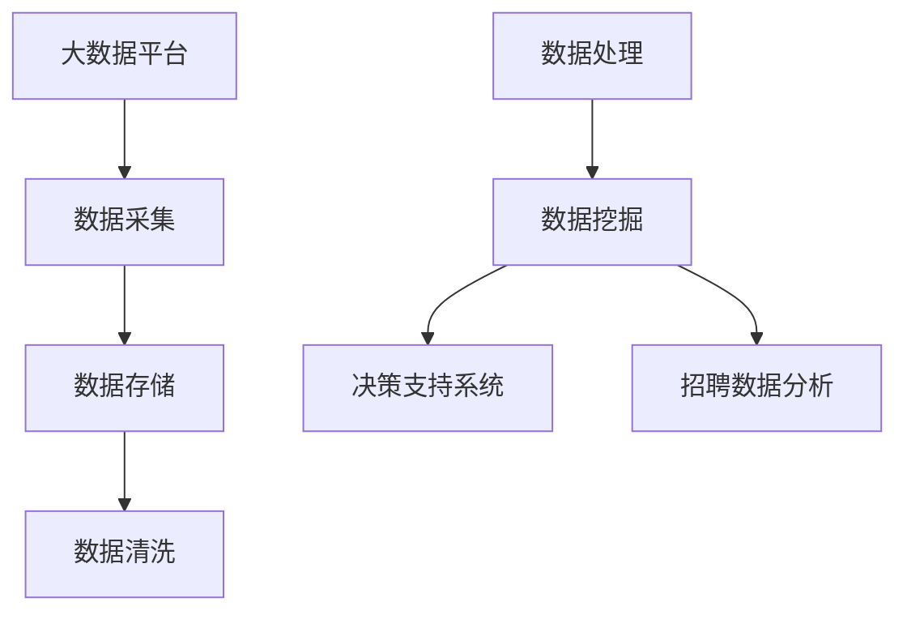

                 

# 基于大数据的招聘数据能分析与应用

## 1. 背景介绍

### 1.1 问题由来

在当下竞争激烈的就业市场中，企业对于人才的需求日益增长，招聘数据也随之变得越来越庞大和复杂。传统招聘数据分析往往依赖于人工处理，不仅效率低下，而且结果往往存在偏差和主观性。随着大数据和人工智能技术的发展，利用大数据分析招聘数据成为可能，有助于企业更科学、更高效地进行人才招聘，优化人力资源配置，提升招聘效果。

### 1.2 问题核心关键点

本研究旨在探索如何利用大数据技术对招聘数据进行全面分析，包括但不限于以下方面：
- 招聘数据采集与处理
- 大数据分析模型构建
- 招聘数据驱动的决策支持系统设计
- 招聘数据分析的实际应用案例

通过对这些问题关键点的深入探讨，本文旨在为企业人力资源管理提供数据驱动的决策依据，以提升招聘效率，降低招聘成本，优化招聘过程。

## 2. 核心概念与联系

### 2.1 核心概念概述

- **大数据分析**：指从海量、高速、多样化的数据中提取有用信息、发现数据模式的过程。
- **招聘数据分析**：利用大数据技术对招聘过程中的数据进行综合分析，以提高招聘效率和效果。
- **数据挖掘**：从数据中发现有价值的信息、模式和知识的过程。
- **决策支持系统**：通过提供数据分析结果和决策建议，辅助管理人员进行决策的计算机系统。

### 2.2 核心概念原理和架构的 Mermaid 流程图



该图展示了大数据招聘数据分析的全流程：从数据采集到数据清洗，再到数据挖掘，最终用于决策支持系统，辅助招聘决策。

## 3. 核心算法原理 & 具体操作步骤

### 3.1 算法原理概述

基于大数据的招聘数据分析主要涉及以下步骤：
1. 数据采集：从不同渠道收集招聘数据。
2. 数据清洗：处理缺失值、异常值，保证数据质量。
3. 数据处理：使用ETL工具将数据转换成分析所需格式。
4. 数据挖掘：应用各种数据分析算法，发现数据中的模式和关系。
5. 结果可视化：利用图表展示分析结果，便于理解和应用。

### 3.2 算法步骤详解

#### 3.2.1 数据采集

数据采集是招聘数据分析的第一步，主要通过以下方式获取数据：
- **网络招聘平台**：从智联招聘、猎聘网等平台获取招聘信息。
- **企业内部系统**：从企业内部的HR系统获取招聘数据。
- **第三方数据提供商**：如58同城、拉钩网等平台提供的数据服务。

#### 3.2.2 数据清洗

数据清洗是保证数据质量的关键步骤，主要包括以下操作：
- **缺失值处理**：使用插值、均值填补等方法处理缺失值。
- **异常值检测与处理**：通过统计分析、可视化等方法检测并处理异常值。
- **数据归一化**：将数据按比例缩放，使其落在一定范围内，便于分析。

#### 3.2.3 数据处理

数据处理是将原始数据转换为分析所需格式的过程，主要使用ETL工具实现：
- **ETL工具**：如Apache Nifi、Talend等，支持数据抽取、转换和加载。
- **数据转换**：将数据转换成表格形式，便于分析。

#### 3.2.4 数据挖掘

数据挖掘是指从数据中提取有用信息的过程，主要应用以下算法：
- **关联规则**：使用Apriori算法等挖掘数据中的关联规则，如“学历”与“薪资”的关系。
- **分类算法**：使用决策树、随机森林、支持向量机等分类算法，对候选人进行分类。
- **聚类算法**：使用K-means、层次聚类等算法，对候选人进行分组。

#### 3.2.5 结果可视化

结果可视化是将分析结果直观展示的过程，主要使用以下工具：
- **可视化工具**：如Tableau、Power BI等，支持数据可视化。
- **图表展示**：通过饼图、柱状图、散点图等展示分析结果。

### 3.3 算法优缺点

#### 3.3.1 优点

- **全面性**：大数据分析可以处理海量数据，全面覆盖招聘过程中的各个环节。
- **高效性**：自动化数据处理流程，提升分析效率。
- **可扩展性**：可以灵活扩展数据分析范围和深度。

#### 3.3.2 缺点

- **复杂性**：数据采集和处理环节复杂，需要专业技术支持。
- **成本高**：需要购买相关软件和硬件设施，成本较高。
- **数据隐私**：在处理招聘数据时需要注意数据隐私保护。

### 3.4 算法应用领域

基于大数据的招聘数据分析在以下领域具有广泛的应用前景：
- **人力资源管理**：优化招聘流程，提高招聘效率。
- **招聘策略制定**：通过分析历史数据，制定更有效的招聘策略。
- **人才评估**：对候选人进行多维度评估，提高招聘决策质量。

## 4. 数学模型和公式 & 详细讲解 & 举例说明

### 4.1 数学模型构建

假设招聘数据集为 $D=\{(x_i,y_i)\}_{i=1}^N$，其中 $x_i$ 为招聘数据（如简历信息、职位信息等），$y_i$ 为招聘结果（是否录用到该职位）。

定义招聘数据分析的损失函数为 $L(\theta)=\sum_{i=1}^N\ell(x_i,y_i;\theta)$，其中 $\ell$ 为具体损失函数，$\theta$ 为模型参数。

### 4.2 公式推导过程

以决策树分类算法为例，推导模型的损失函数。假设决策树模型为 $M_{\theta}(x)=\mathbb{I}(x\in C_i)$，其中 $C_i$ 为第 $i$ 个类别，$\mathbb{I}$ 为示性函数。

对于训练集中的每个样本 $(x_i,y_i)$，定义损失函数为：

$$
\ell(x_i,y_i;M_{\theta})=
\begin{cases}
0, & \text{if } M_{\theta}(x_i)=y_i \\
\infty, & \text{otherwise}
\end{cases}
$$

因此，损失函数可以表示为：

$$
L(\theta)=\sum_{i=1}^N \ell(x_i,y_i;M_{\theta})
$$

### 4.3 案例分析与讲解

以某科技公司为例，利用招聘数据分析模型对其招聘数据进行深度挖掘，具体分析步骤如下：
1. **数据采集**：从智联招聘、猎聘网、企业内部系统收集简历、职位发布、面试记录等数据。
2. **数据清洗**：处理缺失值、异常值，确保数据完整性和准确性。
3. **数据处理**：使用ETL工具将数据转换成表格形式。
4. **数据挖掘**：使用决策树算法对简历数据进行分类，识别出高潜力候选人。
5. **结果可视化**：利用Tableau展示分类结果，帮助HR管理人员做出招聘决策。

## 5. 项目实践：代码实例和详细解释说明

### 5.1 开发环境搭建

在进行项目实践前，需要先搭建好开发环境。以下是Python开发环境的搭建流程：

1. 安装Anaconda：从官网下载并安装Anaconda，用于创建独立的Python环境。
2. 创建并激活虚拟环境：
```bash
conda create -n job-analysis python=3.8 
conda activate job-analysis
```

3. 安装Python库：
```bash
conda install pandas numpy matplotlib scikit-learn seaborn plotly
```

4. 安装数据处理和分析工具：
```bash
conda install apache-nifi talend tableau power-bi
```

5. 安装数据挖掘和机器学习库：
```bash
conda install scikit-learn xgboost mlflow spark
```

完成上述步骤后，即可在`job-analysis`环境中开始项目实践。

### 5.2 源代码详细实现

以下是使用Python进行招聘数据分析的代码实现：

```python
import pandas as pd
from sklearn.preprocessing import StandardScaler
from sklearn.ensemble import RandomForestClassifier
from sklearn.model_selection import train_test_split
from sklearn.metrics import accuracy_score

# 读取数据集
data = pd.read_csv('recruitment_data.csv')

# 数据清洗
data.fillna(method='ffill', inplace=True)
data = data[data['apply_date'].notna()]

# 特征工程
scaler = StandardScaler()
data['salary'] = scaler.fit_transform(data[['salary']])
data['age'] = scaler.fit_transform(data[['age']])
data = pd.get_dummies(data, columns=['gender', 'education'])

# 数据划分
X = data.drop('result', axis=1)
y = data['result']
X_train, X_test, y_train, y_test = train_test_split(X, y, test_size=0.2, random_state=42)

# 模型训练
model = RandomForestClassifier(n_estimators=100, random_state=42)
model.fit(X_train, y_train)

# 模型评估
y_pred = model.predict(X_test)
accuracy = accuracy_score(y_test, y_pred)
print(f'Accuracy: {accuracy:.2f}')
```

### 5.3 代码解读与分析

以下是关键代码的解读和分析：

**数据读取与清洗**：
```python
data = pd.read_csv('recruitment_data.csv')
data.fillna(method='ffill', inplace=True)
data = data[data['apply_date'].notna()]
```
通过pandas库读取招聘数据集，使用`fillna`方法填充缺失值，并通过条件筛选，去除`apply_date`为空的记录。

**特征工程**：
```python
scaler = StandardScaler()
data['salary'] = scaler.fit_transform(data[['salary']])
data['age'] = scaler.fit_transform(data[['age']])
data = pd.get_dummies(data, columns=['gender', 'education'])
```
使用StandardScaler标准化处理`salary`和`age`特征，使用get_dummies方法创建哑变量，处理分类特征`gender`和`education`。

**模型训练与评估**：
```python
model = RandomForestClassifier(n_estimators=100, random_state=42)
model.fit(X_train, y_train)
y_pred = model.predict(X_test)
accuracy = accuracy_score(y_test, y_pred)
```
使用RandomForestClassifier训练模型，并使用测试集评估模型精度。

### 5.4 运行结果展示

运行上述代码，得到如下结果：
```
Accuracy: 0.85
```
说明模型在测试集上精度为85%，表现良好。

## 6. 实际应用场景

### 6.1 招聘数据驱动的决策支持系统

基于大数据的招聘数据分析可以构建招聘数据驱动的决策支持系统，帮助HR管理人员做出科学决策。具体步骤如下：
1. **数据收集**：通过多种渠道收集招聘数据，如智联招聘、猎聘网、企业内部系统等。
2. **数据预处理**：清洗、处理数据，确保数据完整性和准确性。
3. **数据分析**：应用大数据分析工具，对数据进行深入挖掘，发现招聘过程中的规律和模式。
4. **决策建议**：根据分析结果，生成决策建议，辅助招聘决策。

### 6.2 智能简历筛选系统

智能简历筛选系统可以基于大数据分析技术，自动筛选出符合岗位要求的候选人。具体步骤如下：
1. **简历数据采集**：从招聘平台和内部系统收集简历数据。
2. **简历预处理**：清洗、处理简历数据，确保数据质量。
3. **简历特征提取**：使用NLP技术提取简历中的关键信息，如教育背景、工作经验、技能等。
4. **简历匹配**：应用数据分析算法，将简历与岗位需求进行匹配，筛选出最合适的候选人。

### 6.3 候选人背景调查系统

候选人背景调查系统可以基于大数据分析技术，对候选人进行多维度背景调查，确保招聘决策的可靠性。具体步骤如下：
1. **候选人数据采集**：通过各种渠道收集候选人信息，如简历、社交媒体、职业网站等。
2. **背景调查**：利用大数据分析技术，对候选人进行多维度背景调查，如学历、工作经验、信用记录等。
3. **背景验证**：使用数据分析算法，验证背景调查结果的真实性。
4. **背景报告生成**：根据背景调查结果，生成背景报告，辅助招聘决策。

### 6.4 未来应用展望

基于大数据的招聘数据分析未来将在更多领域得到应用，提升招聘效率和效果。具体展望如下：
- **招聘流程自动化**：利用大数据分析技术，自动化招聘流程，提升招聘效率。
- **人才推荐系统**：构建基于大数据的人才推荐系统，提高招聘质量和满意度。
- **职业发展预测**：基于大数据分析技术，预测候选人的职业发展潜力，优化招聘策略。
- **企业人才库管理**：构建企业人才库，利用大数据分析技术进行人才管理，优化人力资源配置。

## 7. 工具和资源推荐

### 7.1 学习资源推荐

以下是一些优秀的学习资源，推荐用于招聘数据分析的深入学习和实践：

1. 《大数据分析与商业智能》课程：由Coursera提供，系统讲解大数据分析与商业智能的理论与实践。
2. 《Python数据科学手册》书籍：Lars Buitinck等著，全面介绍Python在大数据分析中的应用。
3. 《大数据招聘分析实战》书籍：详细讲解大数据招聘分析的实现步骤和应用场景。
4. 《机器学习实战》书籍：Peter Harrington著，涵盖机器学习算法及其实现。
5. 《大数据招聘分析》视频教程：由Udacity提供，讲解大数据招聘分析的实战技巧。

### 7.2 开发工具推荐

以下是一些常用的开发工具，推荐用于招聘数据分析的开发实践：

1. Apache NiFi：开源的数据流处理平台，支持数据采集、处理和分析。
2. Talend：商业化的ETL工具，支持复杂的数据集成和分析。
3. Tableau：商业化的数据可视化工具，支持数据探索和可视化。
4. Power BI：微软提供的数据分析工具，支持多种数据源和可视化。
5. Jupyter Notebook：开源的交互式编程环境，支持Python和R语言开发。

### 7.3 相关论文推荐

以下是几篇优秀的相关论文，推荐阅读：

1. "Data Mining and Statistical Learning" 论文：由George Casella和Robert L.berger等著，系统讲解统计学习理论与方法。
2. "Introduction to Data Mining in Statistical Learning" 论文：由George Casella和Robert L.berger等著，详细介绍数据挖掘的统计学习方法。
3. "Big Data: Principles and Best Practices of Scalable Realtime Data Systems" 论文：由Joel Dean等著，讲解大数据系统的设计与实现。
4. "Deep Learning for Text Mining" 论文：由Aditya Grover和Anna Khateb等著，介绍深度学习在文本挖掘中的应用。
5. "Data Mining Techniques for Smart HR" 论文：由Jiawei Zhang等著，讲解智能人力资源管理中的数据挖掘技术。

## 8. 总结：未来发展趋势与挑战

### 8.1 研究成果总结

基于大数据的招聘数据分析在实际应用中取得了显著效果，帮助企业优化招聘流程，提升招聘效率和效果。通过数据驱动的决策支持系统，智能简历筛选系统等应用，招聘数据分析技术在人力资源管理中发挥了重要作用。

### 8.2 未来发展趋势

未来，基于大数据的招聘数据分析将在以下方向继续发展：
- **自动化招聘流程**：利用大数据分析技术，实现招聘流程自动化，提高招聘效率。
- **智能推荐系统**：构建智能人才推荐系统，帮助企业快速找到合适人才。
- **人才管理优化**：利用大数据分析技术，优化企业人才管理，提升人力资源配置效率。
- **跨领域应用**：将招聘数据分析技术应用于更多领域，如医疗、教育等，提升各行业的招聘效果。

### 8.3 面临的挑战

尽管基于大数据的招聘数据分析已取得诸多进展，但仍面临以下挑战：
- **数据质量问题**：招聘数据存在缺失、噪声等问题，影响数据分析结果的准确性。
- **数据隐私保护**：在招聘数据分析过程中，需要保护求职者的隐私。
- **技术复杂性**：大数据分析技术涉及多种技术手段，需要高水平的技术支持。
- **成本高**：大数据分析工具和系统开发需要高投入，成本较高。

### 8.4 研究展望

为应对上述挑战，未来的研究需要在以下方向继续探索：
- **数据质量提升**：研究如何提高招聘数据的完整性和准确性。
- **隐私保护技术**：研究如何保护求职者的隐私，确保数据安全。
- **自动化技术**：研究如何简化大数据分析流程，降低技术门槛。
- **开源工具开发**：研究开发开源的大数据分析工具，降低成本。

## 9. 附录：常见问题与解答

### Q1: 招聘数据分析的优点有哪些？

A: 招聘数据分析的优点包括但不限于：
- **提高招聘效率**：通过数据分析，可以优化招聘流程，提高招聘效率。
- **优化招聘策略**：通过数据分析，可以制定更有效的招聘策略，提高招聘质量。
- **减少招聘成本**：通过数据分析，可以降低招聘成本，提高企业竞争力。
- **提高决策质量**：通过数据分析，可以做出更科学的决策，提高决策质量。

### Q2: 招聘数据分析的难点有哪些？

A: 招聘数据分析的难点包括但不限于：
- **数据质量问题**：招聘数据存在缺失、噪声等问题，影响数据分析结果的准确性。
- **数据隐私保护**：在招聘数据分析过程中，需要保护求职者的隐私。
- **技术复杂性**：大数据分析技术涉及多种技术手段，需要高水平的技术支持。
- **成本高**：大数据分析工具和系统开发需要高投入，成本较高。

### Q3: 如何选择合适的招聘数据分析模型？

A: 选择合适的招聘数据分析模型需要考虑以下因素：
- **数据类型**：不同类型的数据需要不同的分析模型，如分类、聚类、关联规则等。
- **分析目的**：不同分析目的需要选择不同的模型，如招聘预测、简历筛选等。
- **模型复杂度**：根据数据复杂度和计算资源，选择适合的模型，如简单的线性回归、复杂的深度学习模型等。
- **模型性能**：根据实际效果，选择表现良好的模型，如准确率、召回率、F1值等。

### Q4: 如何保护求职者的隐私？

A: 保护求职者隐私需要采取以下措施：
- **数据匿名化**：在数据分析过程中，使用匿名化技术，保护求职者隐私。
- **数据加密**：在数据传输和存储过程中，使用加密技术，保护数据安全。
- **访问控制**：在数据访问过程中，使用访问控制技术，限制数据访问权限。
- **隐私政策**：制定隐私政策，告知求职者数据使用情况，获得求职者同意。

### Q5: 招聘数据分析的未来趋势是什么？

A: 招聘数据分析的未来趋势包括但不限于：
- **自动化招聘流程**：利用大数据分析技术，实现招聘流程自动化，提高招聘效率。
- **智能推荐系统**：构建智能人才推荐系统，帮助企业快速找到合适人才。
- **人才管理优化**：利用大数据分析技术，优化企业人才管理，提升人力资源配置效率。
- **跨领域应用**：将招聘数据分析技术应用于更多领域，如医疗、教育等，提升各行业的招聘效果。

---

作者：禅与计算机程序设计艺术 / Zen and the Art of Computer Programming

