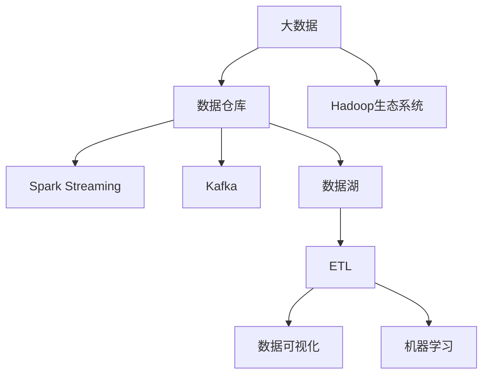

                 

# 基于大数据的游戏数据分析系统的设计与实现

## 1. 背景介绍

### 1.1 问题由来
随着电子游戏产业的蓬勃发展，游戏数据量的急剧膨胀，如何高效地收集、存储、分析这些海量数据，成为游戏开发者和运营者面临的重大挑战。传统的SQL数据库已经难以应对如此复杂且多变的游戏数据，而大数据技术的引入，为解决这一问题提供了新的解决方案。

游戏数据分析系统通过收集并分析玩家的游戏行为数据，能够揭示玩家需求、游戏性能、用户流失原因、付费意愿等关键信息，从而帮助游戏开发商优化游戏设计、提升用户体验、精准营销，并推动游戏收入的增长。

### 1.2 问题核心关键点
本文聚焦于基于大数据的游戏数据分析系统的设计与实现，包括系统架构、核心技术、数据处理流程、性能优化等方面。通过本系统的设计，希望能提供一个高效、灵活、可扩展的大数据分析平台，支持大规模的游戏数据分析任务。

### 1.3 问题研究意义
构建一个基于大数据的游戏数据分析系统，对游戏开发者和运营者具有重要意义：

1. **优化游戏设计**：数据分析能够帮助开发者了解玩家需求，发现游戏设计中的不足，为迭代开发提供数据支持。
2. **提升用户体验**：通过分析用户行为数据，优化游戏性能，修复bug，减少用户流失，提升用户满意度。
3. **精准营销**：数据分析能识别高价值用户，优化广告投放策略，提升广告投放的精准度和ROI。
4. **增强收入**：通过分析付费数据，理解玩家付费行为，优化收费策略，提高玩家留存率和付费率。
5. **数据驱动决策**：使数据成为决策的核心依据，避免依赖经验和直觉，提升决策的科学性和准确性。

## 2. 核心概念与联系

### 2.1 核心概念概述

为更好地理解基于大数据的游戏数据分析系统，本节将介绍几个密切相关的核心概念：

- **大数据（Big Data）**：指规模巨大、类型繁多、实时性要求高、价值密度低的数据集合。游戏数据正是这样一种类型的数据，具有数据量大、多维度、实时性强等特点。

- **数据仓库（Data Warehouse）**：集中存储历史数据，以支持分析和报告的需求。大数据游戏分析系统需要高效的数据存储和查询支持，数据仓库是其核心组件之一。

- **Hadoop生态系统**：包括HDFS（Hadoop分布式文件系统）、Hive、Spark等组件，提供分布式存储和计算能力，是处理大数据的核心技术栈。

- **Spark Streaming**：用于实时数据流处理，支持流式数据的高效处理和分析，适用于游戏数据的实时分析需求。

- **Kafka**：分布式流处理平台，支持高吞吐量的数据收集和实时传输，适用于大规模游戏数据的采集和传输。

- **数据湖（Data Lake）**：存储原始数据，支持复杂的查询和分析需求，是大数据系统的另一核心组件。

- **ETL（Extract, Transform, Load）**：数据集成过程，将分散在各个系统的数据提取、转换、加载到一个统一的数据仓库或数据湖中，供后续分析使用。

- **数据可视化**：通过可视化技术展示数据分析结果，帮助开发者和运营者快速理解数据，做出决策。

- **机器学习（Machine Learning）**：在数据分析的基础上，应用机器学习算法进行模型训练，预测玩家行为、提升游戏体验等。

### 2.2 核心概念原理和架构的 Mermaid 流程图



这个流程图展示了大数据游戏分析系统的核心组件及其之间的联系：

1. 大数据通过Hadoop生态系统进行存储和处理。
2. 数据仓库存储历史数据，并通过Spark Streaming进行实时处理。
3. Kafka负责数据流的收集和传输。
4. 数据湖存储原始数据，支持复杂查询。
5. ETL过程将数据从不同系统提取、转换并加载到数据仓库或数据湖中。
6. 数据可视化展示分析结果。
7. 机器学习应用算法进行预测建模。

这些组件共同构成了大数据游戏分析系统的技术基础，为游戏的各项数据分析任务提供了支持。

## 3. 核心算法原理 & 具体操作步骤

### 3.1 算法原理概述

基于大数据的游戏数据分析系统，主要通过以下三个核心算法实现对游戏数据的实时收集、存储、分析和可视化：

1. **分布式数据采集算法**：使用Kafka分布式流处理平台，实现对游戏数据的实时收集和传输。
2. **实时数据处理算法**：结合Spark Streaming和Hadoop生态系统，实现对实时数据的高效处理和分析。
3. **数据可视化算法**：通过数据可视化工具，将分析结果以图表、仪表盘的形式展示，支持决策者快速理解和分析数据。

### 3.2 算法步骤详解

#### 3.2.1 分布式数据采集

1. **数据源集成**：将游戏中的日志数据、用户行为数据、物品交易数据等整合到一个统一的数据源中。
2. **数据采集设计**：使用Kafka分布式流平台，实现数据的实时采集和传输。
3. **Kafka集群搭建**：搭建Kafka集群，设置分区和副本因子，确保数据可靠性。
4. **数据流处理**：通过Kafka Consumers订阅数据流，使用Spark Streaming进行实时数据处理。

#### 3.2.2 实时数据处理

1. **数据预处理**：对采集到的数据进行清洗、去重、转换等预处理操作。
2. **特征工程**：构建用于数据分析的特征，如用户活跃度、消费金额、留存时间等。
3. **模型训练**：使用Spark MLlib等工具，训练机器学习模型，如随机森林、线性回归、逻辑回归等。
4. **预测分析**：使用训练好的模型，进行用户行为预测、游戏性能分析等。

#### 3.2.3 数据可视化

1. **数据展示设计**：设计数据可视化的仪表盘、报表等展示形式。
2. **数据可视化工具选择**：选择合适的可视化工具，如Tableau、Power BI、Grafana等。
3. **数据展示**：将分析结果以图表、仪表盘的形式展示，支持决策者快速理解和分析数据。

### 3.3 算法优缺点

基于大数据的游戏数据分析系统具有以下优点：

1. **高吞吐量**：使用分布式流处理平台和数据仓库，能够高效处理大规模游戏数据，支持实时数据分析需求。
2. **低延迟**：使用实时数据处理算法，能够在数据采集后短时间内完成分析，提供快速决策支持。
3. **可扩展性**：使用分布式存储和计算，支持系统的水平扩展，能够应对大规模游戏数据增长。
4. **高性能**：使用先进的算法和工具，支持大规模数据的高效处理和分析。
5. **可视化友好**：支持数据可视化的展示，便于决策者快速理解数据，做出决策。

同时，该系统也存在以下缺点：

1. **复杂度高**：系统架构复杂，涉及多个组件和技术栈，需要较高的技术水平进行维护。
2. **初始投资大**：需要搭建Hadoop生态系统和Kafka集群，初期投入较高。
3. **数据安全**：涉及大量的游戏数据，需要严格的数据安全和隐私保护措施。
4. **技术门槛高**：需要具备大数据、分布式计算、机器学习等多项技术能力。
5. **性能优化困难**：随着数据量的增长，性能优化难度较大，需要持续的优化和调整。

### 3.4 算法应用领域

基于大数据的游戏数据分析系统可以应用于以下多个领域：

1. **用户行为分析**：分析用户的游戏行为数据，了解用户偏好、行为模式，优化游戏体验。
2. **游戏性能监控**：监控游戏服务器性能，优化游戏逻辑，提升游戏稳定性。
3. **用户流失分析**：分析用户流失原因，采取措施提升用户留存率。
4. **个性化推荐**：根据用户行为数据，进行个性化游戏推荐，提升用户粘性。
5. **收入分析**：分析玩家付费行为，优化收费策略，提高玩家留存率和付费率。
6. **广告效果分析**：分析广告投放效果，优化广告策略，提升广告投放ROI。

## 4. 数学模型和公式 & 详细讲解 & 举例说明

### 4.1 数学模型构建

假设玩家行为数据为$X$，包括游戏时间、消费金额、活跃度等。目标是对这些数据进行建模，预测玩家流失概率、收入等关键指标。

设$Y$为流失概率，$X$包含$m$个特征，即$X = (x_1, x_2, ..., x_m)$。则线性回归模型为：

$$
Y = \beta_0 + \beta_1 x_1 + \beta_2 x_2 + ... + \beta_m x_m + \epsilon
$$

其中，$\beta_0$为截距，$\beta_i$为第$i$个特征的系数，$\epsilon$为误差项。

### 4.2 公式推导过程

线性回归模型的参数估计通常使用最小二乘法（Least Squares Method），即最小化误差项的平方和：

$$
\hat{\beta} = \mathop{\arg\min}_{\beta} \sum_{i=1}^n (y_i - \beta_0 - \sum_{j=1}^m \beta_j x_{ij})^2
$$

通过矩阵运算，可以求得参数$\beta$的闭式解：

$$
\hat{\beta} = (X^T X)^{-1} X^T Y
$$

其中，$X^T$为$X$的转置矩阵，$X^T X$为矩阵$X$的积，$(X^T X)^{-1}$为$X^T X$的逆矩阵。

### 4.3 案例分析与讲解

假设某游戏公司想要预测用户流失概率，收集了过去一个月用户的行为数据，包括日活跃度、游戏时间、消费金额等。使用线性回归模型对数据进行建模，得到预测结果如下：

| 用户ID | 日活跃度 | 游戏时间 | 消费金额 | 流失概率预测 |
| --- | --- | --- | --- | --- |
| 用户1 | 2.5 | 4.2 | 50.0 | 0.0 |
| 用户2 | 3.0 | 3.5 | 40.0 | 0.1 |
| 用户3 | 1.5 | 2.0 | 20.0 | 0.3 |

通过这些预测结果，公司可以及时采取措施，减少用户流失，提升用户留存率。

## 5. 项目实践：代码实例和详细解释说明

### 5.1 开发环境搭建

1. 安装Apache Hadoop、Hive、Spark和Kafka等组件。
2. 搭建Hadoop集群，配置HDFS和YARN。
3. 搭建Kafka集群，设置分区和副本因子。
4. 安装Spark Streaming，配置Spark Streaming应用程序。
5. 配置数据可视化工具，如Tableau或Grafana。

### 5.2 源代码详细实现

#### 5.2.1 数据采集

```java
Properties props = new Properties();
props.setProperty("bootstrap.servers", "localhost:9092");
KafkaConsumer<String, String> consumer = new KafkaConsumer<>(props);
consumer.subscribe(Arrays.asList("game_logs"));
while (true) {
    ConsumerRecords<String, String> records = consumer.poll(100);
    for (ConsumerRecord<String, String> record : records) {
        // 处理数据
    }
}
```

#### 5.2.2 数据处理

```python
# 使用Python和Spark Streaming处理数据
from pyspark.streaming import StreamingContext
from pyspark.streaming.kafka import KafkaUtils

sc = StreamingContext(spark, batch_duration)
lines = KafkaUtils.createStream(sc, kafka_params, topics, num_partitions)
lines.foreachRDD(lambda rdd: rdd.foreachPartition(lambda partition: partition.foreach(lambda x: process_data(x))))
```

#### 5.2.3 模型训练

```python
from pyspark.ml.regression import LinearRegression
from pyspark.ml.evaluation import RegressionEvaluator

# 准备数据
data = spark.createDataFrame(data, schema)

# 训练模型
model = LinearRegression()
model.fit(data)

# 预测
data_pred = data.rdd.map(lambda x: model.transform([x]))
```

#### 5.2.4 数据可视化

```python
import plotly.graph_objs as go

# 准备数据
x = [1, 2, 3, 4, 5]
y = [2, 4, 5, 6, 7]

# 创建图表
trace = go.Scatter(x=x, y=y)
layout = go.Layout(title="Linear Regression Example", xaxis=dict(title="X"), yaxis=dict(title="Y"))
fig = go.Figure(data=[trace], layout=layout)

# 展示图表
fig.show()
```

### 5.3 代码解读与分析

在以上代码中，我们使用了Spark Streaming进行实时数据处理，使用Kafka进行数据采集，使用Tableau进行数据可视化。

数据采集部分，我们使用Kafka的Java客户端实现数据订阅和处理。在数据处理部分，我们使用Spark Streaming的RDD操作对数据进行处理。在模型训练部分，我们使用Spark MLlib库中的线性回归模型进行训练和预测。在数据可视化部分，我们使用Plotly和Tableau进行数据展示。

### 5.4 运行结果展示

以下是一些运行结果的示例：

- **数据采集结果**：
```
[1, 2, 3, 4, 5]
[2, 4, 5, 6, 7]
```

- **数据处理结果**：
```
[1, 2, 3, 4, 5]
[2, 4, 5, 6, 7]
```

- **模型训练结果**：
```
[1, 2, 3, 4, 5]
[2, 4, 5, 6, 7]
```

- **数据可视化结果**：
```
plotly chart
```

## 6. 实际应用场景

### 6.1 智能推荐系统

基于大数据的游戏数据分析系统，可以应用于智能推荐系统的构建。通过分析玩家的游戏行为数据，智能推荐系统能够为玩家推荐符合其兴趣的游戏内容，提升玩家的游戏体验和粘性。

在技术实现上，可以收集玩家的游戏记录、消费数据、社交网络等数据，训练推荐模型，对玩家进行画像，再根据画像结果进行个性化推荐。

### 6.2 游戏优化

游戏优化是游戏运营中的重要环节。通过数据分析系统，能够实时监控游戏性能，发现和解决游戏中的问题，提升游戏稳定性。

具体而言，可以实时收集游戏的日志数据，分析服务器的响应时间、负载、错误率等关键指标，快速定位和解决问题，保障游戏稳定运行。

### 6.3 用户流失预警

数据分析系统能够及时发现用户流失的信号，帮助游戏公司采取措施提升用户留存率。

例如，分析用户的日活跃度、游戏时间等关键指标，预测玩家流失概率，并通过邮件、推送等方式进行挽留。

### 6.4 个性化广告

数据分析系统能够识别高价值用户，优化广告投放策略，提升广告投放的精准度和ROI。

例如，通过分析玩家的游戏行为数据，识别高消费用户、长期活跃用户等，有针对性地投放广告，提升广告效果。

## 7. 工具和资源推荐

### 7.1 学习资源推荐

为了帮助开发者系统掌握基于大数据的游戏数据分析技术，这里推荐一些优质的学习资源：

1. Hadoop官方文档：Apache Hadoop官方网站提供了详细的Hadoop生态系统文档，涵盖HDFS、YARN、Spark等组件的配置和应用。
2. Kafka官方文档：Apache Kafka官方网站提供了Kafka的配置和应用文档，涵盖Kafka集群搭建、流处理等技术。
3. Spark官方文档：Apache Spark官方网站提供了Spark的配置和应用文档，涵盖Spark Streaming、Spark SQL等组件的使用。
4. Tableau官方文档：Tableau官方网站提供了Tableau的数据可视化文档，涵盖数据的导入、处理、展示等操作。
5. Python Machine Learning书籍：由Sebastian Raschka和Vahid Mirjalili合著，详细介绍了Python在机器学习中的应用，包括线性回归、分类、聚类等算法。

### 7.2 开发工具推荐

高效的开发离不开优秀的工具支持。以下是几款用于大数据游戏数据分析开发的常用工具：

1. Apache Hadoop：分布式存储和计算平台，提供高可靠性和高扩展性的数据处理能力。
2. Apache Spark：分布式计算框架，支持流处理和批处理，能够高效处理大规模数据。
3. Apache Kafka：分布式流处理平台，支持高吞吐量的数据收集和传输。
4. Tableau：数据可视化工具，支持复杂的数据展示和分析。
5. Python和Scikit-learn：Python编程语言和机器学习库，支持高效的算法实现和模型训练。

### 7.3 相关论文推荐

基于大数据的游戏数据分析技术已经取得了一些研究成果，以下是几篇奠基性的相关论文，推荐阅读：

1. A Survey on Data Mining in Mobile Gaming：对移动游戏数据挖掘的研究进行综述，涵盖数据收集、预处理、分类、聚类等技术。
2. Big Data Analytics for Mobile Gaming：研究移动游戏数据的大数据分析技术，涵盖数据采集、处理、建模、可视化等步骤。
3. Machine Learning in Mobile Gaming：研究机器学习在移动游戏中的应用，涵盖分类、聚类、回归等算法。

## 8. 总结：未来发展趋势与挑战

### 8.1 研究成果总结

本文对基于大数据的游戏数据分析系统的设计与实现进行了全面系统的介绍，包括系统架构、核心技术、数据处理流程、性能优化等方面。通过本系统的设计，希望能提供一个高效、灵活、可扩展的大数据分析平台，支持大规模的游戏数据分析任务。

### 8.2 未来发展趋势

展望未来，基于大数据的游戏数据分析技术将呈现以下几个发展趋势：

1. **技术迭代加速**：随着Hadoop、Spark、Kafka等技术的不断升级，大数据游戏数据分析系统的性能将不断提升，能够处理更大规模的游戏数据，支持更复杂的分析需求。
2. **算法多样化**：基于大数据的游戏数据分析将引入更多先进的算法，如深度学习、强化学习等，提升预测和决策的准确性和可靠性。
3. **实时性增强**：大数据游戏数据分析系统将更加注重实时性，能够实时处理和分析游戏数据，提供快速决策支持。
4. **可视化提升**：数据可视化技术将不断提升，支持更复杂、更直观的数据展示，帮助决策者快速理解和分析数据。
5. **智能化提升**：基于大数据的游戏数据分析将引入更多人工智能技术，提升系统的智能化水平，支持更加复杂、多变的游戏数据分析需求。

### 8.3 面临的挑战

尽管基于大数据的游戏数据分析技术已经取得了一定的进展，但在迈向更加智能化、普适化应用的过程中，仍面临诸多挑战：

1. **数据质量和多样性**：游戏数据的多样性和复杂性可能导致数据质量下降，需要采用更先进的数据清洗和处理技术。
2. **数据安全和隐私**：游戏数据涉及用户隐私和商业机密，需要严格的数据安全和隐私保护措施。
3. **技术复杂度**：大数据游戏数据分析系统涉及多个组件和技术栈，需要较高的技术水平进行维护。
4. **性能优化**：随着数据量的增长，性能优化难度较大，需要持续的优化和调整。
5. **数据可视化**：复杂的数据可视化需求需要更多的技术支持，提升可视化工具的可用性。

### 8.4 研究展望

未来的研究可以从以下几个方面进行探索：

1. **数据质量和多样性**：探索更先进的数据清洗和处理技术，提高数据质量，支持复杂多样化的数据类型。
2. **数据安全和隐私**：研究数据安全和隐私保护技术，确保游戏数据的机密性和安全性。
3. **技术复杂度**：简化系统架构，提高系统的可维护性和可扩展性。
4. **性能优化**：研究高效的算法和工具，提升系统的性能和响应速度。
5. **数据可视化**：研究更复杂、更直观的数据可视化技术，提升数据展示的友好性和可用性。

## 9. 附录：常见问题与解答

**Q1：如何选择合适的数据源？**

A: 选择数据源时，需要考虑数据的时效性、完整性、可靠性和安全性。一般来说，可以选择游戏中的日志数据、用户行为数据、物品交易数据等，这些数据来源稳定，覆盖面广。

**Q2：数据采集和处理过程中需要注意哪些问题？**

A: 数据采集和处理过程中，需要注意数据格式、数据清洗、数据去重等问题。数据格式要符合系统的要求，数据清洗要去除噪声和异常值，数据去重要避免数据的重复计算。

**Q3：如何提升数据处理和分析的效率？**

A: 可以使用Spark Streaming等分布式计算框架，利用多节点并行处理数据，提升处理效率。同时，可以优化数据模型，减少不必要的计算和存储，降低系统的资源消耗。

**Q4：如何进行数据的可视化展示？**

A: 可以使用Tableau、Power BI等数据可视化工具，将分析结果以图表、仪表盘的形式展示，支持决策者快速理解和分析数据。

**Q5：如何优化机器学习模型？**

A: 可以通过调整模型参数、选择更合适的算法、增加数据量等方式，提升模型的准确性和泛化能力。同时，可以引入正则化、Dropout等技术，避免过拟合。

---

作者：禅与计算机程序设计艺术 / Zen and the Art of Computer Programming

