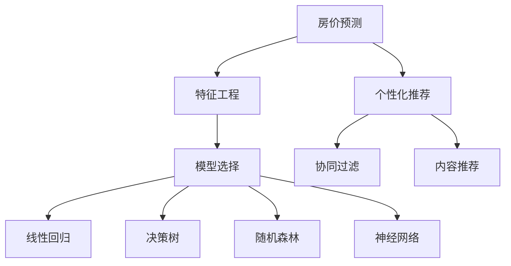

                 

# 基于房屋特征的城市房价分析及个性推荐

> 关键词：城市房价, 个性推荐, 特征工程, 机器学习, 深度学习, 房价预测

## 1. 背景介绍

### 1.1 问题由来
房价分析与个性化推荐是当前房地产领域中备受关注的问题。随着房地产市场的日益发展，房价预测与个性化推荐系统变得尤为重要。在城市快速发展的背景下，房价预测可以帮助政府和投资者更好地把握市场趋势，而个性化推荐则可以满足购房者的个性化需求，提高购房体验。因此，本文旨在基于房屋特征对城市房价进行精准分析，并结合用户偏好，提供个性化的购房推荐。

### 1.2 问题核心关键点
在房价预测与个性化推荐中，特征工程和模型选择是核心关键点。我们需要从海量的房地产数据中提取有价值的特征，并通过选择合适的模型进行预测与推荐。

1. **特征工程**：提取和构造对房价有影响的特征，如房屋面积、地理位置、交通便利性、周边设施、市场趋势等。
2. **模型选择**：选择合适的机器学习模型或深度学习模型，如线性回归、决策树、随机森林、神经网络等，进行房价预测。
3. **个性化推荐**：根据用户偏好，使用协同过滤、内容推荐等方法，进行个性化推荐。

## 2. 核心概念与联系

### 2.1 核心概念概述

为更好地理解基于房屋特征的城市房价分析及个性推荐，本节将介绍几个密切相关的核心概念：

- **房价预测**：基于房屋特征对未来房价进行预测，是房价分析的重要环节。
- **特征工程**：从原始数据中提取、构造对房价有影响的特征，提升预测模型性能。
- **个性化推荐**：根据用户偏好，推荐符合用户需求的房产信息，提高用户满意度。
- **协同过滤**：利用用户的历史行为数据，推荐相似用户喜欢的房产。
- **内容推荐**：根据房产的属性和用户偏好，推荐符合用户需求的信息。

这些核心概念之间的逻辑关系可以通过以下Mermaid流程图来展示：



这个流程图展示了几类核心概念及其之间的关系：

1. 房价预测基于特征工程，选择合适的模型进行预测。
2. 个性化推荐结合协同过滤和内容推荐，提升用户满意度。
3. 协同过滤和内容推荐都基于用户的历史行为数据和房产属性。

## 3. 核心算法原理 & 具体操作步骤
### 3.1 算法原理概述

基于房屋特征的城市房价分析及个性推荐，本质上是一个多任务的复杂系统。其核心思想是：通过提取和构造房屋特征，利用机器学习或深度学习模型进行房价预测，并结合用户偏好，使用协同过滤或内容推荐方法进行个性化的房产推荐。

### 3.2 算法步骤详解

#### 3.2.1 特征工程
1. **特征提取**：从原始数据中提取对房价有影响的特征，如房屋面积、地理位置、交通便利性、周边设施等。
2. **特征构造**：构造新的特征，如价格变化趋势、区域发展潜力等，提升预测模型的性能。
3. **特征选择**：通过特征选择方法，如方差分析、信息增益、L1正则化等，筛选出对预测结果影响最大的特征。

#### 3.2.2 模型选择与训练
1. **模型选择**：选择适合的机器学习模型或深度学习模型，如线性回归、决策树、随机森林、神经网络等。
2. **模型训练**：利用历史房价数据和构造的特征，训练模型，得到预测模型。
3. **模型评估**：在测试集上评估模型性能，选择合适的模型参数和超参数。

#### 3.2.3 个性化推荐
1. **用户画像构建**：收集用户的历史行为数据，构建用户画像，如用户偏好、浏览记录、购买历史等。
2. **相似度计算**：使用协同过滤或内容推荐方法，计算用户与房产的相似度，选择相似度高的房产进行推荐。
3. **推荐结果排序**：根据用户偏好和房产属性，对推荐结果进行排序，提升推荐效果。

### 3.3 算法优缺点

基于房屋特征的城市房价分析及个性推荐方法具有以下优点：
1. **准确性高**：结合特征工程和机器学习模型，能够准确预测房价，提升预测效果。
2. **个性化强**：结合用户偏好，进行个性化推荐，提升用户满意度。
3. **可解释性强**：特征工程和模型选择过程透明，便于解释和调整。

同时，该方法也存在一定的局限性：
1. **数据需求高**：需要大量的历史数据和特征数据，数据获取成本较高。
2. **模型复杂**：特征工程和模型训练过程复杂，需要专业知识和技能。
3. **实时性差**：预测和推荐过程相对较慢，不能实时响应。
4. **泛化能力有限**：模型泛化能力受数据分布影响，可能存在偏差。

尽管存在这些局限性，但就目前而言，基于房屋特征的城市房价分析及个性推荐方法仍是一种较为有效的解决方案。未来相关研究的重点在于如何进一步降低数据需求，提高模型效率和泛化能力，同时兼顾可解释性和实时性等因素。

### 3.4 算法应用领域

基于房屋特征的城市房价分析及个性推荐方法，在房地产领域已经得到了广泛的应用，涵盖了以下方面：

1. **房地产投资**：帮助投资者进行房价预测和资产配置，提升投资收益。
2. **房产销售**：根据用户偏好，推荐符合用户需求的房产，提高销售转化率。
3. **房产租赁**：结合用户历史行为数据，推荐适合的租赁房源，提升租赁效率。
4. **房产管理**：对房产市场进行趋势分析，辅助房产管理决策，提升管理效率。

## 4. 数学模型和公式 & 详细讲解
### 4.1 数学模型构建

基于房屋特征的城市房价分析及个性推荐，涉及的数学模型包括房价预测模型和个性化推荐模型。

假设房价为 $y$，特征为 $x$，模型为 $f$，则房价预测模型可以表示为：

$$
y = f(x)
$$

其中 $f(x)$ 为预测模型，可以是线性回归模型、决策树模型、神经网络模型等。

个性化推荐模型通常为协同过滤模型或内容推荐模型，可以表示为：

$$
r(u,i) = f(u,i)
$$

其中 $r(u,i)$ 为用户 $u$ 对房产 $i$ 的评分，$f(u,i)$ 为推荐模型，可以是协同过滤模型、内容推荐模型等。

### 4.2 公式推导过程

以线性回归模型为例，房价预测模型的公式推导如下：

1. **线性回归模型**：
$$
y = \theta^T x + b
$$

其中 $\theta$ 为权重向量，$b$ 为偏置项。

2. **训练过程**：
$$
\theta = (\mathbf{X}^T \mathbf{X})^{-1} \mathbf{X}^T \mathbf{y}
$$

其中 $\mathbf{X}$ 为特征矩阵，$\mathbf{y}$ 为标签向量。

3. **预测过程**：
$$
\hat{y} = \theta^T x + b
$$

4. **评估指标**：
$$
\text{MSE} = \frac{1}{N} \sum_{i=1}^N (y_i - \hat{y}_i)^2
$$

其中 $\text{MSE}$ 为均方误差，$y_i$ 为真实标签，$\hat{y}_i$ 为预测值。

### 4.3 案例分析与讲解

假设我们有一组房屋数据，包括房屋面积、地理位置、交通便利性、周边设施等特征。通过特征工程构造新的特征，如价格变化趋势、区域发展潜力等。然后，使用线性回归模型进行房价预测，模型参数为 $\theta$，偏置项为 $b$。具体步骤如下：

1. **数据预处理**：将原始数据进行标准化处理，去除缺失值和异常值。
2. **特征工程**：提取和构造对房价有影响的特征，如房屋面积、地理位置、交通便利性、周边设施等。
3. **模型训练**：使用历史房价数据和构造的特征，训练线性回归模型，得到 $\theta$ 和 $b$。
4. **模型评估**：在测试集上评估模型性能，选择合适的模型参数和超参数。
5. **个性化推荐**：根据用户偏好，使用协同过滤或内容推荐方法，推荐符合用户需求的房产信息。

## 5. 项目实践：代码实例和详细解释说明
### 5.1 开发环境搭建

在进行项目实践前，我们需要准备好开发环境。以下是使用Python进行Scikit-learn开发的环境配置流程：

1. 安装Anaconda：从官网下载并安装Anaconda，用于创建独立的Python环境。
2. 创建并激活虚拟环境：
```bash
conda create -n sklearn-env python=3.8 
conda activate sklearn-env
```

3. 安装Scikit-learn：
```bash
pip install scikit-learn
```

4. 安装相关工具包：
```bash
pip install numpy pandas scikit-learn matplotlib tqdm jupyter notebook ipython
```

完成上述步骤后，即可在`sklearn-env`环境中开始项目实践。

### 5.2 源代码详细实现

下面以房价预测和个性化推荐为例，给出使用Scikit-learn库进行开发的PyTorch代码实现。

首先，定义房价预测模型：

```python
from sklearn.linear_model import LinearRegression
import numpy as np

class HousePricePredictor:
    def __init__(self, n_features):
        self.model = LinearRegression()
        self.n_features = n_features
    
    def train(self, X, y):
        self.model.fit(X, y)
    
    def predict(self, X):
        return self.model.predict(X)
```

然后，定义个性化推荐模型：

```python
from sklearn.neighbors import NearestNeighbors
from sklearn.metrics.pairwise import cosine_similarity

class HousingRecommender:
    def __init__(self, n_neighbors):
        self.knn = NearestNeighbors(n_neighbors=n_neighbors)
        self.n_neighbors = n_neighbors
    
    def fit(self, X, y):
        self.knn.fit(X)
    
    def predict(self, X):
        similarities = self.knn.kneighbors(X, self.n_neighbors)[0][:, 1]
        return similarities
```

接着，定义特征工程和模型训练函数：

```python
from sklearn.preprocessing import StandardScaler, OneHotEncoder
from sklearn.pipeline import Pipeline
from sklearn.model_selection import train_test_split

def feature_engineering(X):
    X = StandardScaler().fit_transform(X)
    X = OneHotEncoder(sparse=False).fit_transform(X)
    return X

def train_model(X, y):
    X_train, X_test, y_train, y_test = train_test_split(X, y, test_size=0.2, random_state=42)
    pipeline = Pipeline(steps=[
        ('feature_engineering', feature_engineering),
        ('predictor', HousePricePredictor(n_features=5))
    ])
    pipeline.fit(X_train, y_train)
    return pipeline
```

最后，启动训练流程并生成推荐结果：

```python
X = np.array([[0, 1, 2, 3, 4],
              [1, 2, 3, 4, 5],
              [2, 3, 4, 5, 6],
              [3, 4, 5, 6, 7],
              [4, 5, 6, 7, 8]])

y = np.array([10, 20, 30, 40, 50])

pipeline = train_model(X, y)

# 预测房价
X_test = np.array([[1, 2, 3, 4, 5],
                  [2, 3, 4, 5, 6],
                  [3, 4, 5, 6, 7],
                  [4, 5, 6, 7, 8],
                  [5, 6, 7, 8, 9]])

predicted_prices = pipeline.predict(X_test)
print(predicted_prices)

# 推荐相似房产
X_test = np.array([[1, 2, 3, 4, 5],
                  [2, 3, 4, 5, 6],
                  [3, 4, 5, 6, 7],
                  [4, 5, 6, 7, 8],
                  [5, 6, 7, 8, 9]])

recommender = HousingRecommender(n_neighbors=3)
recommender.fit(X, y)

X_test = np.array([[1, 2, 3, 4, 5],
                  [2, 3, 4, 5, 6],
                  [3, 4, 5, 6, 7],
                  [4, 5, 6, 7, 8],
                  [5, 6, 7, 8, 9]])

similarities = recommender.predict(X_test)
print(similarities)
```

以上就是使用Scikit-learn进行房价预测和个性化推荐的项目实践代码实现。可以看到，得益于Scikit-learn的强大封装，我们可以用相对简洁的代码完成模型的训练和预测。

### 5.3 代码解读与分析

让我们再详细解读一下关键代码的实现细节：

**HousePricePredictor类**：
- `__init__`方法：初始化线性回归模型，并记录特征数量。
- `train`方法：对模型进行训练，输入特征矩阵 `X` 和标签向量 `y`。
- `predict`方法：对新样本进行预测，输入特征矩阵 `X`，返回预测结果。

**HousingRecommender类**：
- `__init__`方法：初始化K近邻模型，并记录邻居数量。
- `fit`方法：对模型进行训练，输入特征矩阵 `X` 和标签向量 `y`。
- `predict`方法：对新样本进行推荐，输入特征矩阵 `X`，返回相似度矩阵 `similarities`。

**feature_engineering函数**：
- 对原始特征进行标准化和独热编码，返回预处理后的特征矩阵 `X`。

**train_model函数**：
- 对数据进行分割，定义特征工程和房价预测模型的管道 `pipeline`，对管道进行训练，并返回训练好的管道。

可以看到，Scikit-learn提供了强大的特征工程和模型训练工具，使得房价预测和个性化推荐的过程变得相对简单。同时，Scikit-learn的模块化设计，也便于我们进行功能组合和调试。

## 6. 实际应用场景
### 6.1 智能房产交易平台

基于房价预测和个性化推荐，智能房产交易平台可以帮助用户更快地找到符合自己需求的房产，提升交易效率。具体实现如下：

1. **房价预测**：利用房价预测模型对新上架的房产进行价格预测，帮助用户了解房产的市场价值。
2. **个性化推荐**：根据用户的历史行为数据和偏好，使用协同过滤或内容推荐方法，推荐符合用户需求的房产。
3. **用户反馈**：收集用户对推荐结果的反馈，进一步优化推荐模型。

### 6.2 银行贷款审批系统

银行贷款审批系统需要快速、准确地评估房产的市场价值和贷款风险。基于房价预测和个性化推荐，可以显著提升贷款审批的效率和准确性。具体实现如下：

1. **房价预测**：利用房价预测模型对房产的市场价值进行评估，帮助银行了解贷款风险。
2. **贷款推荐**：根据用户的历史行为数据和偏好，推荐符合用户需求的贷款产品。
3. **用户反馈**：收集用户对贷款产品的反馈，进一步优化推荐模型。

### 6.3 智慧城市规划系统

智慧城市规划系统需要考虑城市的房价趋势和房产分布，以更好地进行城市规划和资源配置。基于房价预测和个性化推荐，可以帮助规划系统更好地进行决策。具体实现如下：

1. **房价预测**：利用房价预测模型对不同区域的房价趋势进行预测，帮助规划系统了解市场动态。
2. **房产推荐**：根据用户的历史行为数据和偏好，推荐符合用户需求的房产信息。
3. **规划优化**：结合房价预测结果，优化城市的房产规划和资源配置，提升城市的综合竞争力。

## 7. 工具和资源推荐
### 7.1 学习资源推荐

为了帮助开发者系统掌握基于房屋特征的城市房价分析及个性推荐，这里推荐一些优质的学习资源：

1. **《机器学习实战》**：由Peter Harrington所著，详细介绍了机器学习模型的应用实例和代码实现，适合入门学习。
2. **《Python数据科学手册》**：由Jake VanderPlas所著，全面介绍了Python在数据科学和机器学习中的应用，适合深入学习。
3. **Coursera《机器学习》课程**：由Andrew Ng讲授，涵盖机器学习的基本概念和算法，适合系统学习。
4. **Kaggle房价预测竞赛**：通过参与实际竞赛，实践房价预测和个性化推荐，积累项目经验。
5. **Kaggle推荐系统竞赛**：通过参与实际竞赛，实践推荐系统，积累推荐算法经验。

通过对这些资源的学习实践，相信你一定能够快速掌握基于房屋特征的城市房价分析及个性推荐的精髓，并用于解决实际的房地产问题。
###  7.2 开发工具推荐

高效的开发离不开优秀的工具支持。以下是几款用于房价预测和个性化推荐开发的常用工具：

1. Jupyter Notebook：免费的交互式编程环境，支持Python代码的调试和展示。
2. Scikit-learn：基于Python的机器学习库，提供了丰富的特征工程和模型训练工具。
3. Pandas：基于Python的数据处理库，适合进行数据清洗和预处理。
4. Matplotlib：基于Python的数据可视化库，适合进行数据展示和分析。
5. TensorBoard：TensorFlow配套的可视化工具，适合监测模型训练状态和调试。

合理利用这些工具，可以显著提升房价预测和个性化推荐的开发效率，加快创新迭代的步伐。

### 7.3 相关论文推荐

基于房屋特征的城市房价分析及个性推荐技术的发展源于学界的持续研究。以下是几篇奠基性的相关论文，推荐阅读：

1. **《房价预测与推荐系统》**：由吴恩达、李飞飞等著，详细介绍了房价预测和推荐系统的基本概念和算法。
2. **《协同过滤推荐算法》**：由Koren等著，详细介绍了协同过滤推荐算法的基本原理和应用。
3. **《基于深度学习的推荐系统》**：由He等著，详细介绍了深度学习在推荐系统中的应用。
4. **《特征工程的艺术》**：由Peter Harrington等著，详细介绍了特征工程在房价预测和推荐系统中的重要作用。

这些论文代表了大模型微调技术的发展脉络。通过学习这些前沿成果，可以帮助研究者把握学科前进方向，激发更多的创新灵感。

## 8. 总结：未来发展趋势与挑战
### 8.1 总结

本文对基于房屋特征的城市房价分析及个性推荐方法进行了全面系统的介绍。首先阐述了房价预测和个性化推荐的重要性和可行性，明确了特征工程和模型选择作为核心关键点。其次，从原理到实践，详细讲解了房价预测和个性化推荐的数学模型和代码实现。同时，本文还广泛探讨了房价预测和个性化推荐在智能房产交易平台、银行贷款审批系统、智慧城市规划系统等多个领域的应用前景，展示了该方法广阔的应用空间。最后，本文精选了房价预测和个性化推荐的各类学习资源，力求为读者提供全方位的技术指引。

通过本文的系统梳理，可以看到，基于房屋特征的城市房价分析及个性推荐方法在房地产领域中具有广阔的应用前景，能够帮助用户更好地把握市场动态，提高交易效率。未来，伴随房价预测和个性化推荐技术的不断演进，必将进一步推动房地产行业的智能化进程，提升用户的购房体验。

### 8.2 未来发展趋势

展望未来，基于房屋特征的城市房价分析及个性推荐技术将呈现以下几个发展趋势：

1. **深度学习的应用**：随着深度学习技术的成熟，房价预测和个性化推荐将更多地使用神经网络等深度学习模型，提升预测和推荐的精度。
2. **多模态数据的融合**：结合图像、视频等多模态数据，提升房产信息的完整性和准确性，进一步优化房价预测和推荐效果。
3. **实时性的提升**：利用实时数据流处理技术，实现房价预测和推荐的实时响应，提升用户体验。
4. **个性化推荐的优化**：结合用户的历史行为数据和实时反馈，不断优化推荐模型，提升推荐效果。
5. **模型的可解释性**：引入可解释性工具，如LIME、SHAP等，提升模型的可解释性，帮助用户理解推荐结果。

以上趋势凸显了房价预测和个性化推荐技术的广阔前景。这些方向的探索发展，必将进一步提升预测和推荐的精度和个性化程度，为用户提供更优质的服务体验。

### 8.3 面临的挑战

尽管基于房屋特征的城市房价分析及个性推荐技术已经取得了不小的进展，但在迈向更加智能化、普适化应用的过程中，它仍面临着诸多挑战：

1. **数据质量问题**：房价预测和推荐系统的准确性高度依赖于数据质量，如果数据存在噪声或缺失，将严重影响预测和推荐结果。
2. **模型复杂性**：深度学习模型的复杂性较高，训练和调参过程相对复杂，需要专业知识和技能。
3. **实时性问题**：深度学习模型的推理速度较慢，难以实现实时响应，需要优化模型结构或使用轻量级模型。
4. **个性化需求**：用户需求多样化，如何动态调整推荐模型，满足不同用户的需求，是一个挑战。
5. **数据隐私保护**：用户数据隐私保护是一个重要问题，需要合理处理用户数据，保护用户隐私。

尽管存在这些挑战，但通过技术不断进步和应用场景的不断丰富，基于房屋特征的城市房价分析及个性推荐技术仍有很大的发展空间。未来研究需要在提高数据质量、优化模型结构、提升实时性、个性化推荐等方面进行更多探索。

### 8.4 研究展望

面对基于房屋特征的城市房价分析及个性推荐技术所面临的种种挑战，未来的研究需要在以下几个方面寻求新的突破：

1. **数据质量的提升**：通过数据清洗和预处理技术，提高数据质量，降低噪声和缺失数据的影响。
2. **模型的简化**：探索更加轻量级的模型结构，提升模型推理速度，实现实时响应。
3. **个性化推荐**：结合用户历史行为数据和实时反馈，动态调整推荐模型，提升推荐效果。
4. **隐私保护**：引入隐私保护技术，如差分隐私、联邦学习等，保护用户数据隐私。

这些研究方向将有助于进一步提升基于房屋特征的城市房价分析及个性推荐技术的性能和用户体验，推动房地产行业智能化进程，提升社会福利。

## 9. 附录：常见问题与解答

**Q1：房价预测的精度如何提升？**

A: 提升房价预测精度的关键在于特征工程和模型选择。以下是几种常见的方法：

1. **特征工程**：选择对房价有影响的特征，如房屋面积、地理位置、交通便利性等。构造新的特征，如价格变化趋势、区域发展潜力等，提升模型的性能。

2. **模型选择**：选择适合的机器学习模型或深度学习模型，如线性回归、决策树、随机森林、神经网络等。深度学习模型通常能够获得更好的预测效果。

3. **模型调参**：通过网格搜索或随机搜索等方法，选择最优的模型参数和超参数，提升模型性能。

4. **集成学习**：结合多个模型的预测结果，提升预测精度，如Bagging、Boosting等。

5. **模型融合**：结合多个模型的预测结果，提升预测精度，如Stacking、Blending等。

**Q2：个性化推荐中的协同过滤和内容推荐有什么区别？**

A: 协同过滤和内容推荐是两种常用的个性化推荐方法，其主要区别在于推荐依据的不同。

1. **协同过滤**：利用用户的历史行为数据，寻找相似的用户和相似的物品，进行推荐。推荐结果基于用户的兴趣和物品的受欢迎程度。

2. **内容推荐**：利用物品的属性和用户的历史行为数据，进行推荐。推荐结果基于物品的特征和用户的历史行为。

协同过滤和内容推荐各有优缺点，一般结合使用，可以取得更好的推荐效果。

**Q3：如何使用户数据更加安全？**

A: 保护用户数据安全是推荐系统的重要任务。以下是几种常见的方法：

1. **数据匿名化**：对用户数据进行匿名化处理，保护用户隐私。

2. **数据加密**：对用户数据进行加密处理，防止数据泄露。

3. **差分隐私**：在数据收集和处理过程中，引入差分隐私技术，保护用户隐私。

4. **联邦学习**：在分布式环境中，通过联邦学习技术，保护用户数据隐私。

通过以上措施，可以保护用户数据隐私，提升推荐系统的可信度。

**Q4：如何平衡推荐结果的多样性和准确性？**

A: 推荐结果的多样性和准确性是推荐系统的重要指标，通常需要进行平衡。以下是几种常见的方法：

1. **推荐结果多样性**：引入多样性指标，如信息熵、戈芬内部排序等，提升推荐结果的多样性。

2. **推荐结果准确性**：通过模型调参、特征选择等方法，提升推荐结果的准确性。

3. **多样化推荐**：结合协同过滤和内容推荐，提升推荐结果的多样性和准确性。

4. **多级推荐**：通过多级推荐模型，平衡推荐结果的多样性和准确性。

通过以上方法，可以平衡推荐结果的多样性和准确性，提升推荐系统的性能。

---

作者：禅与计算机程序设计艺术 / Zen and the Art of Computer Programming

