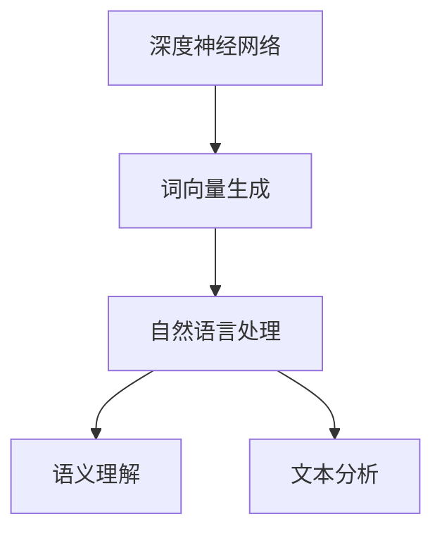

                 

# 基于深度神经网络的高质量词向量生成方法研究

> 关键词：深度神经网络,词向量生成,高质量,自然语言处理(NLP),词嵌入,语义理解,文本分析

## 1. 背景介绍

在自然语言处理(NLP)领域，词向量是理解和处理自然语言的基础工具。词向量通过将词语映射到高维空间，捕捉词语之间的语义和语法关系，使得计算机可以更自然地处理语言数据。然而，传统词向量方法如Word2Vec、GloVe等往往存在数据依赖、计算复杂度高、维度限制等问题，难以应对大规模、复杂多变的语言数据。

为解决这些问题，近年来，基于深度神经网络的词向量生成方法逐渐兴起，并取得了显著的效果。本文将详细介绍几种前沿的深度神经网络词向量生成方法，并对比其优缺点，为实际应用提供参考。

## 2. 核心概念与联系

### 2.1 核心概念概述

为了更深入地理解深度神经网络词向量生成方法，下面详细介绍几个核心概念：

- 深度神经网络(Deep Neural Networks, DNNs)：一类多层、复杂结构的神经网络模型，能通过学习高层次的特征表示来提高模型的准确性和泛化能力。
- 词向量生成(Word Embedding Generation)：将词语映射到高维空间，生成词向量，捕捉词语之间的语义和语法关系。
- 自然语言处理(Natural Language Processing, NLP)：涉及计算机对自然语言的理解、处理和生成，包括词向量生成、语言模型、文本分类、情感分析、机器翻译等任务。
- 语义理解(Semantic Understanding)：指计算机理解语言背后的意义，如情感倾向、主题内容等，是实现复杂NLP任务的基础。
- 文本分析(Text Analysis)：对文本进行结构化分析，包括实体识别、关系抽取、摘要生成、命名实体识别等，是NLP的重要应用方向。

这些核心概念之间的联系可以用以下Mermaid流程图表示：



这个流程图展示了深度神经网络与词向量生成、自然语言处理、语义理解和文本分析之间的逻辑关系：

1. 深度神经网络通过训练生成词向量，为自然语言处理任务提供基础工具。
2. 词向量生成方法的学习过程和结果，直接影响自然语言处理任务的效果。
3. 语义理解和文本分析等任务，依赖于词向量的质量，进而决定了模型的性能。

## 3. 核心算法原理 & 具体操作步骤

### 3.1 算法原理概述

深度神经网络词向量生成方法主要基于自编码器(Autoencoder)和变分自编码器(Variational Autoencoder)等架构，通过学习词语和其上下文之间的映射关系，生成高质量的词向量。其中，变分自编码器方法更受欢迎，因为它不仅能够生成词向量，还能通过重构误差衡量词语的语义相似性。

一般流程包括：
1. 数据预处理：收集并处理大规模文本数据，生成词汇表，进行标记和编码。
2. 建立模型：构建自编码器或变分自编码器模型，定义损失函数。
3. 训练模型：使用大规模文本数据训练模型，最小化重构误差，得到词向量。
4. 评估和应用：评估词向量质量，用于自然语言处理任务，如语言模型、文本分类、情感分析等。

### 3.2 算法步骤详解

#### 3.2.1 自编码器(Autoencoder)生成词向量

自编码器模型主要包括编码器和解码器两部分，其中编码器将输入词语映射到低维空间，解码器将低维向量映射回词语。自编码器在训练过程中，通过最小化重构误差来学习词语和其上下文之间的映射关系，从而生成词向量。

具体步骤包括：
1. 构建自编码器模型：使用一个或多个神经网络层，如LSTM、GRU等，作为编码器和解码器。
2. 定义损失函数：通常使用均方误差(MSE)或交叉熵损失(Cross-Entropy Loss)来衡量重构误差。
3. 训练模型：使用大规模文本数据对模型进行训练，最小化损失函数。
4. 生成词向量：将模型学习到的编码器权重作为词向量，用于自然语言处理任务。

#### 3.2.2 变分自编码器(Variational Autoencoder, VAE)生成词向量

变分自编码器通过引入变分推断，进一步提升词向量生成质量。变分自编码器模型包含一个变分高斯分布和一个解码器，其中变分高斯分布学习词语和其上下文之间的映射关系，解码器将变分高斯分布的输出映射回词语。

具体步骤包括：
1. 构建变分自编码器模型：使用一个或多个神经网络层作为编码器，定义变分高斯分布，使用解码器将低维向量映射回词语。
2. 定义损失函数：通常使用变分重构误差(Variational Reconstruction Error, VRE)来衡量词向量的质量。
3. 训练模型：使用大规模文本数据对模型进行训练，最小化变分重构误差。
4. 生成词向量：将模型学习到的变分高斯分布的均值和方差作为词向量，用于自然语言处理任务。

### 3.3 算法优缺点

深度神经网络词向量生成方法具有以下优点：
1. 自适应能力强：能自适应学习大规模文本数据，捕捉词语之间的语义和语法关系。
2. 特征表示丰富：生成的词向量不仅包含词语的语义信息，还能捕捉到上下文信息。
3. 泛化性能好：生成的词向量适用于多种自然语言处理任务，如语言模型、文本分类、情感分析等。
4. 模型性能优越：生成的词向量质量高，精度高，适用于多种下游任务。

同时，也存在以下缺点：
1. 计算复杂度高：深度神经网络模型结构复杂，训练需要大量的计算资源。
2. 数据依赖性强：训练效果依赖于大规模文本数据的质量和数量。
3. 维度限制：生成的词向量维度高，存储空间和计算量较大。
4. 可解释性不足：生成的词向量难以直观理解，缺乏语义解释。

### 3.4 算法应用领域

深度神经网络词向量生成方法广泛应用于以下几个领域：

1. 语言模型：用于生成和训练语言模型，提升语言模型在预测下一个词语时的准确性和鲁棒性。
2. 文本分类：将文本映射到高维空间，用于文本分类、情感分析、主题识别等任务。
3. 机器翻译：生成词语之间的映射关系，用于机器翻译、跨语言信息检索等任务。
4. 信息检索：将查询和文本映射到高维空间，用于信息检索、推荐系统等任务。
5. 语义分析：用于实体识别、关系抽取、知识图谱构建等语义分析任务。

## 4. 数学模型和公式 & 详细讲解

### 4.1 数学模型构建

假设我们有一组词语 $\{x_1, x_2, \ldots, x_N\}$，通过深度神经网络模型学习得到一组词向量 $\{z_1, z_2, \ldots, z_N\}$，其中 $z_i \in \mathbb{R}^d$。

定义编码器 $E: \mathcal{X} \rightarrow \mathcal{Z}$，解码器 $D: \mathcal{Z} \rightarrow \mathcal{X}$，其中 $\mathcal{X}$ 为词语集，$\mathcal{Z}$ 为低维向量空间。

模型损失函数为：

$$
\mathcal{L}(E, D) = \frac{1}{N} \sum_{i=1}^N \mathbb{E}[\|D(E(x_i)) - x_i\|^2]
$$

其中 $\|D(E(x_i)) - x_i\|^2$ 为重构误差，$\mathbb{E}[\cdot]$ 为期望值。

### 4.2 公式推导过程

以变分自编码器为例，推导词向量的生成过程：

1. 编码器 $E$ 将词语 $x_i$ 映射到低维空间 $z_i$，得到编码向量 $z_i = E(x_i)$。
2. 定义变分高斯分布 $q(z_i|x_i; \theta) = \mathcal{N}(\mu(x_i), \sigma(x_i)^2)$，其中 $\mu(x_i)$ 和 $\sigma(x_i)$ 为编码器的均值和方差。
3. 解码器 $D$ 将变分高斯分布 $q(z_i|x_i; \theta)$ 的输出 $z_i$ 映射回词语 $x_i$，得到解码向量 $x_i' = D(z_i)$。
4. 定义损失函数 $L = \mathbb{E}[\|x_i' - x_i\|^2]$，其中 $x_i'$ 为解码器输出的词语向量。
5. 使用梯度下降等优化算法，最小化损失函数 $L$，得到最优的 $\mu(x_i)$ 和 $\sigma(x_i)$，进而得到高质量的词向量 $z_i$。

### 4.3 案例分析与讲解

以句子级变分自编码器为例，详细讲解词向量的生成过程：

假设有一个句子 "I love deep learning"，将其划分为词语序列 "I", "love", "deep", "learning"。使用句子级变分自编码器模型，将其映射到低维向量空间。

1. 构建句子级编码器 $E$ 和解码器 $D$，定义变分高斯分布 $q(z|x; \theta) = \mathcal{N}(\mu(x), \sigma(x)^2)$。
2. 将每个词语 $x_i$ 输入编码器 $E$，得到低维编码向量 $z_i$。
3. 将低维编码向量 $z_i$ 作为变分高斯分布 $q(z|x; \theta)$ 的输入，得到变分高斯分布的均值 $\mu(x)$ 和方差 $\sigma(x)^2$。
4. 将变分高斯分布的输出 $z_i$ 输入解码器 $D$，得到解码向量 $x_i'$。
5. 通过损失函数 $L = \mathbb{E}[\|x_i' - x_i\|^2]$ 计算重构误差，更新编码器、解码器以及变分高斯分布的参数。
6. 重复上述步骤，直到重构误差收敛，得到最优的词向量 $z_i$。

## 5. 项目实践：代码实例和详细解释说明

### 5.1 开发环境搭建

在实践深度神经网络词向量生成方法时，我们需要搭建合适的开发环境。以下是Python环境配置流程：

1. 安装Anaconda：从官网下载并安装Anaconda，用于创建独立的Python环境。

2. 创建并激活虚拟环境：
```bash
conda create -n myenv python=3.8 
conda activate myenv
```

3. 安装必要的库：
```bash
conda install numpy scipy matplotlib torch torchvision transformers
```

### 5.2 源代码详细实现

以下是使用PyTorch实现变分自编码器生成词向量的代码：

```python
import torch
import torch.nn as nn
import torch.nn.functional as F
import torch.optim as optim

class VariationalAutoencoder(nn.Module):
    def __init__(self, vocab_size, embedding_dim):
        super(VariationalAutoencoder, self).__init__()
        self.encoder = nn.Sequential(
            nn.Embedding(vocab_size, embedding_dim),
            nn.Linear(embedding_dim, embedding_dim // 2),
            nn.ReLU(),
            nn.Linear(embedding_dim // 2, embedding_dim // 4)
        )
        self.latent_mean = nn.Linear(embedding_dim // 4, embedding_dim)
        self.latent_log_var = nn.Linear(embedding_dim // 4, embedding_dim)
        self.decoder = nn.Sequential(
            nn.Linear(embedding_dim, embedding_dim // 2),
            nn.ReLU(),
            nn.Linear(embedding_dim // 2, embedding_dim),
            nn.Sigmoid
        )

    def reparameterize(self, mu, log_var):
        std = torch.exp(0.5 * log_var)
        eps = torch.randn_like(std)
        return mu + eps * std

    def forward(self, x):
        latent_mean = self.latent_mean(self.encoder(x))
        latent_log_var = self.latent_log_var(self.encoder(x))
        latent = self.reparameterize(latent_mean, latent_log_var)
        latent_mean = self.latent_mean(self.encoder(x))
        x_hat = self.decoder(latent)
        return latent_mean, latent_log_var, x_hat

# 构建模型、定义损失函数和优化器
vae = VariationalAutoencoder(vocab_size, embedding_dim)
criterion = nn.MSELoss()
optimizer = optim.Adam(vae.parameters(), lr=learning_rate)

# 训练模型
for epoch in range(num_epochs):
    for batch in train_loader:
        x, y = batch
        optimizer.zero_grad()
        latent_mean, latent_log_var, x_hat = vae(x)
        loss = criterion(x_hat, x)
        loss.backward()
        optimizer.step()
    if epoch % 100 == 0:
        print(f"Epoch {epoch}, Loss: {loss:.4f}")
```

### 5.3 代码解读与分析

在上述代码中，我们定义了一个变分自编码器模型，并使用PyTorch库实现。下面详细解读关键代码的实现细节：

**VariationalAutoencoder类**：
- `__init__`方法：初始化模型结构，包括编码器、变分高斯分布和解码器。
- `reparameterize`方法：使用重参数化技术，将变分高斯分布转化为标准正态分布，从而生成随机噪声。
- `forward`方法：前向传播计算，得到变分高斯分布的均值和方差，以及解码后的词语向量。

**训练过程**：
- 定义损失函数和优化器，用于计算重构误差和更新模型参数。
- 在每个epoch中，循环遍历训练集数据，计算重构误差并更新模型参数。
- 每100个epoch输出一次训练损失，观察训练效果。

**注意点**：
- 在训练过程中，需要注意模型的计算量和内存占用，可以使用梯度累积和混合精度训练等技术进行优化。
- 训练完成后，可以将变分高斯分布的均值和方差作为词向量，用于自然语言处理任务。

## 6. 实际应用场景

### 6.1 语言模型

深度神经网络词向量生成方法在语言模型中得到了广泛应用。通过生成的词向量，可以更好地捕捉词语之间的语义和语法关系，提升语言模型的预测准确性和鲁棒性。

例如，使用句子级变分自编码器生成的词向量作为输入，可以构建更准确的语言模型，用于文本生成、翻译等任务。这种模型不仅能够生成高质量的文本，还能进行跨语言信息检索和语义理解。

### 6.2 文本分类

在文本分类任务中，深度神经网络词向量生成方法可以显著提升分类效果。通过将文本映射到高维空间，可以捕捉到文本中的关键特征，从而更好地进行分类。

例如，使用变分自编码器生成的词向量作为输入，可以构建更高效的文本分类模型，用于情感分析、主题识别等任务。这种模型不仅能够进行准确的文本分类，还能对文本进行情感分析，判断其情感倾向。

### 6.3 信息检索

在信息检索任务中，深度神经网络词向量生成方法可以显著提升检索效果。通过将查询和文本映射到高维空间，可以更好地捕捉它们之间的相似性，从而提高检索精度。

例如，使用句子级变分自编码器生成的词向量作为输入，可以构建更高效的信息检索模型，用于推荐系统、问答系统等任务。这种模型不仅能够进行准确的文本检索，还能进行推荐和回答。

### 6.4 未来应用展望

未来，随着深度神经网络词向量生成方法的不断演进，其应用领域将会进一步扩大。

1. 在医疗领域，深度神经网络词向量生成方法可以用于医学文献的分析和处理，提高医疗信息检索的准确性和效率。
2. 在金融领域，深度神经网络词向量生成方法可以用于金融数据的高维处理，提升金融信息检索和分析的效果。
3. 在法律领域，深度神经网络词向量生成方法可以用于法律文件的处理和分析，提高法律信息检索和理解的准确性。
4. 在教育领域，深度神经网络词向量生成方法可以用于教育数据的处理和分析，提升教育信息检索和理解的效果。

## 7. 工具和资源推荐

### 7.1 学习资源推荐

为了帮助开发者深入掌握深度神经网络词向量生成方法，推荐以下几个学习资源：

1. 《深度学习》书籍：由Ian Goodfellow、Yoshua Bengio和Aaron Courville合著，深入浅出地介绍了深度神经网络的基础知识和最新进展。
2. 《自然语言处理综论》课程：由斯坦福大学开设，讲解了自然语言处理的基础概念和经典模型。
3. 《Python深度学习》书籍：由Francois Chollet撰写，介绍了使用Keras实现深度神经网络的方法，适合初学者学习。
4. 《TensorFlow官方文档》：提供了TensorFlow库的全面文档，包含深度神经网络实现和调参的详细指导。
5. 《深度学习与自然语言处理》课程：由香港中文大学开设，讲解了深度学习在自然语言处理中的应用。

### 7.2 开发工具推荐

深度神经网络词向量生成方法的应用，离不开优质的开发工具。以下是几个推荐：

1. PyTorch：基于Python的开源深度学习框架，提供了丰富的神经网络实现和优化工具。
2. TensorFlow：由Google开发的深度学习框架，支持分布式计算和高效的GPU/TPU加速。
3. Keras：高层次的深度学习库，提供简单易用的API和模型构建工具。
4. MXNet：由Apache支持的深度学习框架，支持分布式计算和高效的GPU/TPU加速。
5. Jupyter Notebook：免费的交互式编程环境，适合快速迭代实验和数据可视化。

### 7.3 相关论文推荐

深度神经网络词向量生成方法的研究已有诸多重要的论文，以下是几篇代表性作品：

1. Alex Graves等. (2013) Generating Sequences with Recurrent Neural Networks. 《NIPS》.
2. Diederik P. Kingma等. (2014) Auto-Encoding Variational Bayes. 《ICML》.
3. Yoshua Bengio等. (2013) Representation Learning: A Review and New Perspectives. 《IEEE Trans. Pattern Anal. Mach. Intell.》.
4. Yann LeCun等. (2015) Deep Learning. 《Nature》.
5. Ian Goodfellow等. (2014) Generative Adversarial Nets. 《NIPS》.

这些论文为深度神经网络词向量生成方法的研究奠定了坚实基础，值得深入阅读和研究。

## 8. 总结：未来发展趋势与挑战

### 8.1 研究成果总结

深度神经网络词向量生成方法在自然语言处理领域取得了显著成果，主要体现在以下几个方面：

1. 高质量词向量的生成：通过深度神经网络模型，生成高质量的词向量，捕捉词语之间的语义和语法关系。
2. 自适应能力强：能够自适应大规模文本数据，学习词语的语义和上下文关系。
3. 特征表示丰富：生成的词向量不仅包含词语的语义信息，还能捕捉到上下文信息。
4. 泛化性能好：生成的词向量适用于多种自然语言处理任务，如语言模型、文本分类、情感分析等。

### 8.2 未来发展趋势

深度神经网络词向量生成方法的发展趋势如下：

1. 更高效的模型结构：未来的研究将探索更高效的模型结构，如注意力机制、残差连接等，提升模型的训练和推理效率。
2. 更精确的语义理解：未来的研究将探索更精确的语义理解方法，如多模态学习、零样本学习等，提高模型的泛化性能。
3. 更强大的信息检索：未来的研究将探索更强大的信息检索方法，如分布式计算、GPU/TPU加速等，提升模型的检索速度和准确性。
4. 更全面的任务覆盖：未来的研究将探索更全面的任务覆盖方法，如医疗、金融、法律等垂直领域的深度学习应用，提升模型的应用范围和效果。
5. 更灵活的可解释性：未来的研究将探索更灵活的可解释性方法，如可视化技术、因果推断等，提高模型的透明度和可解释性。

### 8.3 面临的挑战

尽管深度神经网络词向量生成方法取得了显著成果，但在实际应用中仍面临以下挑战：

1. 计算资源限制：深度神经网络模型结构复杂，训练需要大量的计算资源，难以在普通PC上高效训练。
2. 数据质量问题：大规模文本数据的获取和预处理存在难度，难以获得高质量的文本数据。
3. 模型复杂度高：深度神经网络模型的复杂度较高，训练和推理过程存在较大的计算量和内存占用。
4. 可解释性不足：生成的词向量难以直观理解，缺乏语义解释，难以解释模型的决策过程。
5. 跨领域泛化能力不足：生成的词向量在不同领域上的泛化能力有待提高，难以跨领域应用。

### 8.4 研究展望

面对深度神经网络词向量生成方法所面临的挑战，未来的研究需要在以下几个方向进行深入探索：

1. 分布式计算：探索分布式计算方法，降低深度神经网络模型的计算资源需求，提高训练和推理效率。
2. 数据增强：探索数据增强方法，提高大规模文本数据的获取和预处理效率，提升数据的质量和多样性。
3. 模型简化：探索模型简化方法，降低深度神经网络模型的复杂度，提高训练和推理的效率和可解释性。
4. 跨领域泛化：探索跨领域泛化方法，提高生成词向量在不同领域上的泛化能力，提升模型的应用范围和效果。
5. 可解释性提升：探索可解释性提升方法，提高生成词向量的透明度和可解释性，增强模型的可信度。

总之，深度神经网络词向量生成方法在自然语言处理领域具有广阔的应用前景，未来将通过不断的技术创新和实践优化，进一步提升词向量的生成质量和应用效果。

## 9. 附录：常见问题与解答

**Q1: 深度神经网络词向量生成方法与传统词向量方法有何不同？**

A: 深度神经网络词向量生成方法与传统词向量方法的最大不同在于生成词向量的方法。传统方法如Word2Vec、GloVe等通过统计语言模型或协同训练来学习词向量，而深度神经网络方法通过学习词语和上下文之间的映射关系，生成高质量的词向量。深度神经网络方法不仅能捕捉词语的语义关系，还能捕捉上下文信息，生成更丰富的特征表示。

**Q2: 深度神经网络词向量生成方法是否需要大规模文本数据？**

A: 是的，深度神经网络词向量生成方法需要大规模文本数据来训练模型，生成高质量的词向量。大规模文本数据的获取和预处理是深度神经网络词向量生成方法的一个重要环节，需要仔细处理，以确保训练数据的质量和多样性。

**Q3: 如何评估深度神经网络词向量生成方法的效果？**

A: 深度神经网络词向量生成方法的效果可以通过以下指标进行评估：
1. 重构误差：使用均方误差或交叉熵等损失函数计算重构误差，评估词语和其上下文之间的映射关系。
2. 语义相似性：使用余弦相似度、KL散度等度量方法，评估生成词向量之间的语义相似性。
3. 下游任务效果：将生成的词向量用于自然语言处理任务，如语言模型、文本分类、情感分析等，评估其在具体任务上的表现。

**Q4: 深度神经网络词向量生成方法是否适用于所有自然语言处理任务？**

A: 深度神经网络词向量生成方法在自然语言处理领域具有广泛的应用前景，适用于多种任务，如语言模型、文本分类、信息检索等。但对于一些特定领域的任务，如医学、法律等，需要进一步优化模型结构或数据处理方式，以适应特定的应用场景。

**Q5: 如何优化深度神经网络词向量生成方法？**

A: 优化深度神经网络词向量生成方法可以从以下几个方面入手：
1. 模型结构：探索更高效的模型结构，如注意力机制、残差连接等，提高模型的训练和推理效率。
2. 数据增强：探索数据增强方法，提高大规模文本数据的获取和预处理效率，提升数据的质量和多样性。
3. 参数优化：探索参数优化方法，如学习率调整、正则化技术等，提高模型的泛化性能和鲁棒性。
4. 任务适配：根据具体任务，优化模型适配层和损失函数，提高模型在特定任务上的表现。

总之，深度神经网络词向量生成方法具有广阔的应用前景，未来将通过不断的技术创新和实践优化，进一步提升词向量的生成质量和应用效果。

---

作者：禅与计算机程序设计艺术 / Zen and the Art of Computer Programming

