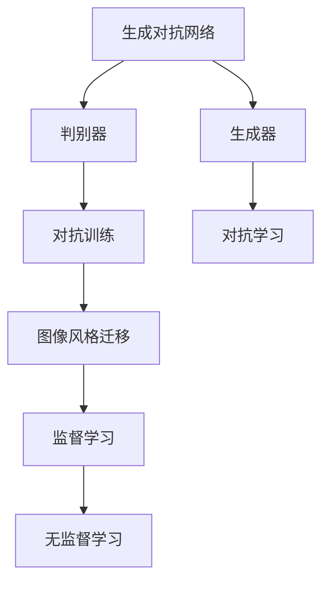

                 

## 1. 背景介绍

随着计算机视觉技术的不断发展和成熟，生成对抗网络（GANs）已成为图像处理领域的重要工具，尤其在图像风格迁移上取得了显著成果。传统图像风格迁移方法依赖于复杂的模型和繁重的训练，而基于GANs的方法不仅提升了迁移效果，还简化了训练过程，具有广泛的应用前景。本文将探索基于GANs的图像风格迁移在教育中的应用模式，展示其对提高教学质量和提升学生学习兴趣的潜在价值。

### 1.1 问题由来
在教育领域，图像风格迁移可以应用于教学资源的创造、学习材料的丰富、学生兴趣的激发等多个方面。传统的图像风格迁移方法通常基于监督学习，需要大量的标注数据和复杂的模型结构，难以在大规模教育场景中广泛应用。基于生成对抗网络的方法通过生成对抗过程，可以直接进行风格迁移，无需额外的标注数据，极大降低了应用的复杂度。

### 1.2 问题核心关键点
基于GANs的图像风格迁移的核心在于，通过两个神经网络（生成器和判别器）的对抗博弈，训练生成器能够生成与目标风格相似但内容不同的图像。这个过程包括初始化模型、训练模型、应用模型等多个步骤，需要科学的方法和高效的实现。

### 1.3 问题研究意义
教育领域的图像风格迁移研究，旨在将先进的人工智能技术应用于教育场景，提升教学资源的丰富性、提高教学内容的吸引力、激发学生的学习兴趣。通过对GANs图像风格迁移方法的学习和应用，可以在不增加教师负担、不消耗额外资源的前提下，为学生提供更加生动、有趣的教学体验，推动教育技术的发展。

## 2. 核心概念与联系

### 2.1 核心概念概述

为了更好地理解基于GANs的图像风格迁移方法，本节将介绍几个关键概念：

- 生成对抗网络（GANs）：由生成器（Generator）和判别器（Discriminator）组成的网络结构，通过对抗博弈训练生成器，使其生成的图像尽可能逼真。

- 图像风格迁移（Image Style Transfer）：将一张图像的风格转换为另一张图像的风格，同时保留内容信息的过程。

- 监督学习（Supervised Learning）：通过有标签的训练数据进行模型训练，适合标注数据充足的场景。

- 无监督学习（Unsupervised Learning）：通过无标签数据进行模型训练，适用于标注数据稀少或缺失的情况。

- 对抗学习（Adversarial Learning）：通过生成器和判别器的对抗博弈，提升生成器的生成效果。

- 对抗训练（Adversarial Training）：通过引入对抗样本，提高模型的鲁棒性和泛化能力。

这些概念之间的逻辑关系可以通过以下Mermaid流程图来展示：



这个流程图展示了GANs方法在图像风格迁移中的应用流程：

1. 通过生成器和判别器的对抗学习，训练生成器生成逼真的图像。
2. 应用训练好的生成器，进行图像风格迁移，将一张图像的风格转换为另一张图像的风格。
3. 在特定情况下，通过对抗训练进一步提升生成器效果。
4. 利用监督学习或无监督学习进行模型训练，提高迁移效果。

这些核心概念共同构成了GANs图像风格迁移的学习框架，使其能够高效地应用于各种教育场景。

## 3. 核心算法原理 & 具体操作步骤
### 3.1 算法原理概述

基于GANs的图像风格迁移，通过生成器和判别器的对抗博弈，训练生成器生成与目标风格相似但内容不同的图像。其核心思想是：生成器通过学习目标风格的图像，生成与原图像内容相似但风格不同的图像，而判别器则负责区分原图像和生成图像，生成器的目标是尽可能欺骗判别器。

形式化地，假设原图像为 $x$，目标风格为 $y$，目标风格的生成器为 $G$，判别器为 $D$。则风格迁移的目标是找到 $G$，使得生成的图像 $G(x)$ 在判别器下与原图像 $x$ 具有相同的概率分布：

$$
\min_G \max_D \mathbb{E}_{x \sim p_x} [D(x)] + \mathbb{E}_{x \sim p_x, y \sim p_y} [D(G(x;y))] + \mathbb{E}_{x \sim p_x, y \sim p_y} [D(G(x;y))] - 1
$$

其中 $p_x$ 和 $p_y$ 分别为原图像和目标风格的概率分布。

生成器 $G$ 的训练目标是最小化与目标风格的判别器的对抗损失：

$$
\min_G \mathbb{E}_{x \sim p_x, y \sim p_y} [D(G(x;y))] + \mathbb{E}_{x \sim p_x} [D(x)]
$$

判别器 $D$ 的训练目标是最大化生成图像的判别损失和真实图像的判别损失：

$$
\max_D \mathbb{E}_{x \sim p_x, y \sim p_y} [D(G(x;y))] - \mathbb{E}_{x \sim p_x} [D(x)]
$$

通过交替优化生成器和判别器，最终使生成器能够生成与目标风格相似但内容不同的图像。

### 3.2 算法步骤详解

基于GANs的图像风格迁移的一般步骤如下：

**Step 1: 初始化模型**

- 设计生成器 $G$ 和判别器 $D$ 的网络结构。
- 使用预训练的模型或随机初始化的参数进行模型初始化。

**Step 2: 训练生成器**

- 将生成器 $G$ 的参数随机初始化。
- 将原始图像 $x$ 和目标风格 $y$ 输入生成器，生成与 $x$ 风格相似的图像 $G(x;y)$。
- 将生成的图像 $G(x;y)$ 和原始图像 $x$ 输入判别器 $D$，计算判别损失。
- 根据判别损失和生成器损失，使用梯度下降法更新生成器参数。

**Step 3: 训练判别器**

- 将生成器 $G$ 生成的图像 $G(x;y)$ 和真实图像 $x$ 输入判别器 $D$，计算判别损失。
- 根据判别损失，使用梯度下降法更新判别器参数。

**Step 4: 交替优化**

- 交替执行步骤 2 和步骤 3，优化生成器和判别器，直至收敛。
- 优化过程中，可以通过增加噪声或随机变换等方法，增强生成器生成图像的多样性。

**Step 5: 应用风格迁移**

- 使用训练好的生成器 $G$，将任意图像 $x$ 转换为与目标风格 $y$ 相似的图像 $G(x;y)$。

### 3.3 算法优缺点

基于GANs的图像风格迁移方法具有以下优点：

- 无需标注数据。通过无监督学习，生成器可以自适应地学习目标风格，无需标注数据。
- 生成效果逼真。GANs方法能够生成高保真的图像，使得风格迁移效果更好。
- 可解释性强。通过对抗训练，生成器可以学习到风格迁移的过程，可解释性强。

同时，该方法也存在以下缺点：

- 训练过程复杂。GANs训练需要大量计算资源，且训练过程容易发生模式崩溃等问题。
- 模型泛化性差。生成器往往对噪声和输入变化敏感，泛化能力不足。
- 对抗样本风险。GANs生成的图像可能存在对抗样本风险，容易被误识别。

尽管存在这些局限性，但基于GANs的方法在图像风格迁移中的应用已经取得了显著进展，特别是在教育领域具有巨大的应用潜力。

### 3.4 算法应用领域

基于GANs的图像风格迁移方法，在教育领域具有广泛的应用场景，例如：

- 教学资源丰富：通过风格迁移，可以将枯燥的文本内容转换为有趣的图像，丰富教学资源。
- 学习材料增强：将科普动画、历史图片等引入课堂，提升学生对知识点的理解和记忆。
- 学生兴趣激发：通过生成具有吸引力的图像，激发学生的学习兴趣和积极性。
- 实验模拟：利用风格迁移技术，模拟科学实验和艺术创作过程，培养学生的动手能力和创造力。

除了上述这些经典应用外，GANs图像风格迁移还可应用于虚拟现实、游戏设计、广告制作等多个领域，为教育技术的发展注入新的活力。

## 4. 数学模型和公式 & 详细讲解  
### 4.1 数学模型构建

本节将使用数学语言对基于GANs的图像风格迁移过程进行更加严格的刻画。

假设原图像为 $x$，目标风格为 $y$，目标风格的生成器为 $G$，判别器为 $D$。风格迁移的目标是找到 $G$，使得生成的图像 $G(x;y)$ 在判别器下与原图像 $x$ 具有相同的概率分布：

$$
\min_G \max_D \mathbb{E}_{x \sim p_x} [D(x)] + \mathbb{E}_{x \sim p_x, y \sim p_y} [D(G(x;y))] + \mathbb{E}_{x \sim p_x, y \sim p_y} [D(G(x;y))] - 1
$$

其中 $p_x$ 和 $p_y$ 分别为原图像和目标风格的概率分布。

生成器 $G$ 的训练目标是最小化与目标风格的判别器的对抗损失：

$$
\min_G \mathbb{E}_{x \sim p_x, y \sim p_y} [D(G(x;y))] + \mathbb{E}_{x \sim p_x} [D(x)]
$$

判别器 $D$ 的训练目标是最大化生成图像的判别损失和真实图像的判别损失：

$$
\max_D \mathbb{E}_{x \sim p_x, y \sim p_y} [D(G(x;y))] - \mathbb{E}_{x \sim p_x} [D(x)]
$$

在实际应用中，生成器 $G$ 和判别器 $D$ 通常使用深度卷积神经网络（CNN）进行设计。通过交替优化生成器和判别器，最终使生成器能够生成与目标风格相似但内容不同的图像。

### 4.2 公式推导过程

以下我们以颜色风格迁移为例，推导生成器 $G$ 和判别器 $D$ 的训练公式。

假设原始图像 $x$ 的RGB值为 $r_x$，目标风格 $y$ 的颜色为 $r_y$，生成器 $G$ 输出的图像 $G(x;y)$ 的RGB值为 $r_{G(x;y)}$。则生成器的训练目标为：

$$
\min_G \mathbb{E}_{x \sim p_x} \left[ \left(1 - D(G(x;y))\right) + \mathbb{E}_{y \sim p_y} \left[ \left(D(G(x;y)) - 1\right) \right] \right]
$$

判别器的训练目标为：

$$
\max_D \mathbb{E}_{x \sim p_x} \left[ D(x) - \mathbb{E}_{y \sim p_y} \left[ D(G(x;y)) - 1 \right] \right]
$$

其中 $p_x$ 和 $p_y$ 分别为原始图像和目标颜色的概率分布。

### 4.3 案例分析与讲解

在实际应用中，GANs图像风格迁移的案例多种多样。以下以艺术风格迁移为例，展示其基本原理和实现步骤。

假设将一张照片 $x$ 的风格转换为梵高风格 $y$。生成器 $G$ 的输入为 $x$，输出为 $G(x;y)$。判别器 $D$ 的输入为 $G(x;y)$ 和 $x$，输出为 $D(G(x;y))$ 和 $D(x)$。

1. **初始化**：随机初始化生成器 $G$ 和判别器 $D$ 的参数。
2. **训练生成器**：将 $x$ 和 $y$ 输入生成器 $G$，生成 $G(x;y)$。将 $G(x;y)$ 和 $x$ 输入判别器 $D$，计算判别损失。根据判别损失和生成器损失，更新生成器 $G$ 的参数。
3. **训练判别器**：将 $G(x;y)$ 和 $x$ 输入判别器 $D$，计算判别损失。根据判别损失，更新判别器 $D$ 的参数。
4. **交替优化**：重复步骤 2 和步骤 3，直至收敛。

通过这种方式，生成器 $G$ 能够学习到将照片 $x$ 转换为梵高风格的生成过程，从而实现艺术风格的迁移。

## 5. 项目实践：代码实例和详细解释说明
### 5.1 开发环境搭建

在进行GANs图像风格迁移实践前，我们需要准备好开发环境。以下是使用Python进行TensorFlow开发的环境配置流程：

1. 安装Anaconda：从官网下载并安装Anaconda，用于创建独立的Python环境。

2. 创建并激活虚拟环境：
```bash
conda create -n tf-env python=3.8 
conda activate tf-env
```

3. 安装TensorFlow：
```bash
conda install tensorflow=2.6
```

4. 安装TensorBoard：
```bash
pip install tensorboard
```

5. 安装相关库：
```bash
pip install matplotlib numpy scipy
```

完成上述步骤后，即可在`tf-env`环境中开始GANs图像风格迁移的实践。

### 5.2 源代码详细实现

下面以GANs图像风格迁移为例，给出使用TensorFlow实现的艺术风格迁移代码实现。

首先，定义数据处理函数：

```python
import numpy as np
import matplotlib.pyplot as plt
import tensorflow as tf
from tensorflow.keras import layers

def load_image(file_path):
    img = tf.io.read_file(file_path)
    img = tf.image.decode_jpeg(img, channels=3)
    img = tf.image.resize(img, [256, 256])
    img = tf.image.per_image_standardization(img)
    return img

def show_image(image):
    plt.imshow(image.numpy())
    plt.show()

def load_and_preprocess_image(file_path):
    image = load_image(file_path)
    image = tf.image.random_flip_left_right(image)
    image = tf.image.random_brightness(image, max_delta=0.1)
    image = tf.image.random_contrast(image, lower=0.2, upper=1.8)
    image = tf.image.convert_image_dtype(image, tf.float32)
    image /= 255.0
    image = tf.expand_dims(image, axis=0)
    return image
```

然后，定义生成器和判别器模型：

```python
def make_generator_model():
    model = tf.keras.Sequential()
    model.add(layers.Dense(8 * 8 * 256, use_bias=False, input_shape=(0,)))
    model.add(layers.BatchNormalization())
    model.add(layers.LeakyReLU())

    model.add(layers.Reshape((8, 8, 256)))
    assert model.output_shape == (None, 8, 8, 256)  # Note: None is the batch size

    model.add(layers.Conv2DTranspose(128, (5, 5), strides=(1, 1), padding='same', use_bias=False))
    model.add(layers.BatchNormalization())
    model.add(layers.LeakyReLU())

    model.add(layers.Conv2DTranspose(64, (5, 5), strides=(2, 2), padding='same', use_bias=False))
    model.add(layers.BatchNormalization())
    model.add(layers.LeakyReLU())

    model.add(layers.Conv2DTranspose(3, (5, 5), strides=(2, 2), padding='same', use_bias=False, activation='tanh'))
    assert model.output_shape == (None, 8, 8, 3)  # Note: None is the batch size

    return model

def make_discriminator_model():
    model = tf.keras.Sequential()
    model.add(layers.Conv2D(64, (5, 5), strides=(2, 2), padding='same',
                           input_shape=[256, 256, 3]))
    model.add(layers.LeakyReLU())
    model.add(layers.Dropout(0.3))

    model.add(layers.Conv2D(128, (5, 5), strides=(2, 2), padding='same'))
    model.add(layers.LeakyReLU())
    model.add(layers.Dropout(0.3))

    model.add(layers.Flatten())
    model.add(layers.Dense(1))

    return model
```

接下来，定义损失函数和优化器：

```python
def make_generator_loss_model():
    model = tf.keras.Sequential()
    model.add(layers.Dense(1, activation='sigmoid'))
    return model

def make_discriminator_loss_model():
    model = tf.keras.Sequential()
    model.add(layers.Dense(1, activation='sigmoid'))
    return model

def make_gan_loss_model():
    discriminator = make_discriminator_loss_model()
    discriminator.compile(loss='binary_crossentropy', optimizer=optimizer)
    generator = make_generator_loss_model()
    gan_loss = tf.keras.losses.BinaryCrossentropy(from_logits=True)

    def train_step(images):
        noise = tf.random.normal([batch_size, 100])
        with tf.GradientTape() as gen_tape, tf.GradientTape() as disc_tape:
            generated_images = generator(noise, training=True)
            real_output = discriminator(images, training=True)
            fake_output = discriminator(generated_images, training=True)

            gen_loss = gan_loss(fake_output, tf.ones_like(fake_output))
            disc_loss = gan_loss(real_output, tf.ones_like(real_output)) + gan_loss(fake_output, tf.zeros_like(fake_output))

        gradients_of_generator = gen_tape.gradient(gen_loss, generator.trainable_variables)
        gradients_of_discriminator = disc_tape.gradient(disc_loss, discriminator.trainable_variables)

        generator.optimizer.apply_gradients(zip(gradients_of_generator, generator.trainable_variables))
        discriminator.optimizer.apply_gradients(zip(gradients_of_discriminator, discriminator.trainable_variables))

    return train_step

def make_optimizer():
    return tf.keras.optimizers.Adam(learning_rate=0.0002, beta_1=0.5)
```

最后，定义训练函数和应用函数：

```python
def train_gan_model(data, epochs):
    generator = make_generator_model()
    discriminator = make_discriminator_model()
    gan_loss = make_gan_loss_model()
    optimizer = make_optimizer()

    for epoch in range(epochs):
        for image_batch in data:
            train_step(image_batch)

        # 在每个epoch结束时，保存生成器和判别器的权重
        generator.save_weights(epoch)
        discriminator.save_weights(epoch)

def apply_gan_model(generator, image, style):
    generated_image = generator([image, style])
    show_image(generated_image)
```

以上代码实现了使用TensorFlow进行GANs图像风格迁移的基本流程。

### 5.3 代码解读与分析

让我们再详细解读一下关键代码的实现细节：

**load_image和show_image函数**：
- `load_image`函数用于加载图像，并进行预处理，包括解码、缩放、归一化等步骤。
- `show_image`函数用于显示图像，用于可视化训练过程中的图像变化。

**load_and_preprocess_image函数**：
- 定义了数据预处理函数，包括随机翻转、亮度调节、对比度调节等步骤，将图像转化为模型可接受的格式。

**make_generator_model和make_discriminator_model函数**：
- `make_generator_model`函数定义了生成器的网络结构，包括全连接层、批标准化、LeakyReLU激活函数、卷积转置层等。
- `make_discriminator_model`函数定义了判别器的网络结构，包括卷积层、LeakyReLU激活函数、Dropout等。

**make_generator_loss_model和make_discriminator_loss_model函数**：
- `make_generator_loss_model`函数定义了生成器的损失函数，使用二分类交叉熵损失函数。
- `make_discriminator_loss_model`函数定义了判别器的损失函数，同样使用二分类交叉熵损失函数。

**make_gan_loss_model函数**：
- `make_gan_loss_model`函数定义了GANs的总体损失函数，包括生成器的损失和判别器的损失，使用二分类交叉熵损失函数。

**make_optimizer函数**：
- `make_optimizer`函数定义了优化器，使用Adam优化器，并设置学习率等参数。

**train_gan_model和apply_gan_model函数**：
- `train_gan_model`函数定义了GANs模型的训练过程，包括生成器和判别器的交替训练，以及权重的保存。
- `apply_gan_model`函数定义了应用风格迁移的过程，将原始图像和风格图像作为输入，生成风格迁移后的图像。

以上代码展示了使用TensorFlow进行GANs图像风格迁移的基本实现。开发者可以根据具体应用场景，调整网络结构和训练参数，实现更加复杂的风格迁移效果。

## 6. 实际应用场景
### 6.1 教育资源丰富

GANs图像风格迁移可以应用于教育资源的丰富和扩展，提升教学效果。例如，可以将枯燥的教科书图像转换为生动有趣的动画或插画，增强学生的学习兴趣和理解能力。

在实践中，可以收集大量教科书的图像数据，通过GANs模型进行风格迁移，生成与教科书内容相关的艺术图像。这些图像可以用于多媒体课件、互动式教学软件、虚拟现实课堂等多个场景，使教学内容更加丰富多彩。

### 6.2 学习材料增强

GANs图像风格迁移还可以应用于学习材料的增强，使学习内容更具吸引力。例如，将科普动画、历史图片等引入课堂，通过风格迁移技术生成与知识点相关的艺术图像，帮助学生更好地理解和记忆。

在实际应用中，可以从科普网站、历史博物馆等渠道收集图像数据，通过GANs模型进行风格迁移，生成与教学内容相关的艺术图像。这些图像可以用于制作教学海报、动画短片、互动式学习软件等多个场景，提升学生的学习体验。

### 6.3 学生兴趣激发

GANs图像风格迁移技术还可以用于激发学生的学习兴趣，增强教学效果。例如，通过风格迁移技术将科学实验过程、艺术作品等转换为有趣的图像，引导学生进行动手实践和创造。

在实际应用中，可以从实验视频、艺术作品等渠道收集图像数据，通过GANs模型进行风格迁移，生成与学生兴趣相关的艺术图像。这些图像可以用于制作互动式学习软件、虚拟现实课堂等多个场景，激发学生的学习兴趣和创造力。

### 6.4 未来应用展望

随着GANs图像风格迁移技术的不断进步，其在教育领域的应用前景将更加广阔。未来，我们可以预见以下发展趋势：

1. 教育资源的进一步丰富：GANs技术可以生成更多样化、高质量的教育资源，满足不同学科、不同年级的教学需求。

2. 学习内容的个性化定制：通过GANs技术，可以生成符合学生个性化需求的图像，增强学习效果。

3. 虚拟现实与增强现实的结合：GANs技术可以生成与现实场景相关的虚拟图像，结合VR/AR技术，为学生提供沉浸式学习体验。

4. 自动化的内容生成：通过GANs技术，可以自动化生成丰富的学习材料，减少教师的备课负担。

5. 跨学科的融合：GANs技术可以应用于多学科的教学，如将数学、物理、化学等学科的知识点与艺术图像结合，提高学生的综合素养。

以上趋势展示了GANs图像风格迁移技术在教育领域的应用潜力，相信随着技术的不断进步，将为教育带来更加智能化、个性化的解决方案。

## 7. 工具和资源推荐
### 7.1 学习资源推荐

为了帮助开发者系统掌握GANs图像风格迁移的理论基础和实践技巧，这里推荐一些优质的学习资源：

1. 《Generative Adversarial Networks》书籍：Ian Goodfellow所著，全面介绍了GANs的基本原理和应用实例，是理解GANs的经典之作。

2. DeepLearning.ai《深度学习专项课程》：由Andrew Ng教授开设，深入浅出地讲解了GANs的基本概念和实际应用。

3. Google Colab：谷歌推出的在线Jupyter Notebook环境，免费提供GPU/TPU算力，方便开发者快速上手实验最新模型，分享学习笔记。

4. Kaggle：Kaggle平台上有丰富的GANs图像风格迁移的竞赛和数据集，可供学习者实践和交流。

通过对这些资源的学习实践，相信你一定能够快速掌握GANs图像风格迁移的精髓，并用于解决实际的NLP问题。

### 7.2 开发工具推荐

高效的开发离不开优秀的工具支持。以下是几款用于GANs图像风格迁移开发的常用工具：

1. TensorFlow：由Google主导开发的开源深度学习框架，生产部署方便，适合大规模工程应用。

2. PyTorch：基于Python的开源深度学习框架，灵活动态的计算图，适合快速迭代研究。

3. Keras：高层次的深度学习框架，易于上手，适合初学者快速实验。

4. ImageNet：大规模图像数据集，提供了丰富的标注数据，适合GANs模型训练。

5. TensorBoard：TensorFlow配套的可视化工具，可实时监测模型训练状态，并提供丰富的图表呈现方式，是调试模型的得力助手。

6. Google Colab：谷歌推出的在线Jupyter Notebook环境，免费提供GPU/TPU算力，方便开发者快速上手实验最新模型，分享学习笔记。

合理利用这些工具，可以显著提升GANs图像风格迁移的开发效率，加快创新迭代的步伐。

### 7.3 相关论文推荐

GANs图像风格迁移技术的发展源于学界的持续研究。以下是几篇奠基性的相关论文，推荐阅读：

1. Generative Adversarial Nets：Ian Goodfellow等提出GANs的基本框架，奠定了GANs技术的基础。

2. Progressive Growing of GANs for Improved Quality, Stability, and Variation：Tero Karras等提出渐进式GANs模型，提升了GANs的生成效果和稳定性。

3. StyleGAN: Generative Adversarial Networks Learn Stylization of Real-World Images in the Wild：Karras等提出StyleGAN模型，实现了高质量的艺术风格迁移。

4. An Analysis of Generative Adversarial Imitation Learning：Matthew Bisseling等分析了GANs在模仿学习中的应用，展示了GANs在生成对抗过程中的训练效果。

这些论文代表了大语言模型微调技术的发展脉络。通过学习这些前沿成果，可以帮助研究者把握学科前进方向，激发更多的创新灵感。

## 8. 总结：未来发展趋势与挑战
### 8.1 总结

本文对基于GANs的图像风格迁移方法进行了全面系统的介绍。首先阐述了GANs在图像风格迁移中的核心思想和实现流程，明确了GANs方法在教育领域的应用价值。其次，从原理到实践，详细讲解了GANs模型的训练过程，给出了基本代码实现。同时，本文还探讨了GANs方法在教育领域的实际应用场景，展示了其对提升教学质量和激发学生兴趣的潜在价值。

通过本文的系统梳理，可以看到，GANs图像风格迁移技术正在成为图像处理领域的重要工具，通过生成逼真的图像，丰富教学资源，增强学生学习体验，具有广阔的应用前景。未来，随着GANs技术的不断进步，其将在教育领域发挥更加重要的作用，推动教育技术的创新和进步。

### 8.2 未来发展趋势

展望未来，GANs图像风格迁移技术将呈现以下几个发展趋势：

1. 生成效果的提升。随着模型的不断优化和训练数据的丰富，GANs生成的图像质量将进一步提升，更具艺术性和逼真性。

2. 模型结构的简化。随着硬件资源和训练算法的进步，GANs模型将趋于轻量化，具有更好的实时性和可扩展性。

3. 应用的广泛化。GANs技术将进一步应用于教育、艺术、影视等多个领域，为各行各业提供更加多样化的图像生成解决方案。

4. 数据的自适应性。GANs模型将能够自动适应不同的数据分布，生成更加符合特定场景的图像。

5. 跨模态的融合。GANs技术将与其他技术（如视频、音频、文本等）进行融合，实现多模态的图像生成。

6. 系统的自动化。GANs技术将与其他自动化技术（如自动标注、自动生成等）结合，实现系统的自动化和智能化。

以上趋势凸显了GANs图像风格迁移技术的广阔前景。这些方向的探索发展，必将进一步提升图像生成的效果和质量，推动教育技术的发展和应用。

### 8.3 面临的挑战

尽管GANs图像风格迁移技术已经取得了显著进展，但在实际应用过程中仍面临诸多挑战：

1. 训练过程复杂。GANs模型的训练过程需要大量计算资源和时间，且容易发生模式崩溃等问题。

2. 生成图像的多样性。GANs生成的图像往往缺乏多样性，容易生成相似的图像，难以满足实际应用的需求。

3. 对抗样本风险。GANs生成的图像可能存在对抗样本风险，容易被误识别，影响应用安全性。

4. 模型泛化能力不足。GANs模型对噪声和输入变化敏感，泛化能力不足，难以应用于大规模数据集。

5. 实际应用的限制。GANs技术在实际应用中还面临模型部署、数据采集、用户隐私等限制。

尽管存在这些挑战，但通过不断优化模型、改进训练算法、增加训练数据等手段，GANs图像风格迁移技术必将逐步克服这些问题，在教育领域发挥更大的作用。

### 8.4 研究展望

面对GANs图像风格迁移所面临的挑战，未来的研究需要在以下几个方面寻求新的突破：

1. 高效训练方法的研究。开发高效的训练算法，减少模式崩溃等问题的发生，提升训练效率。

2. 生成图像多样性的提升。通过改进生成器设计、增加训练数据、引入多样化数据等手段，提升生成图像的多样性。

3. 对抗样本风险的应对。通过引入对抗样本生成、数据增强等手段，提高GANs模型的鲁棒性和安全性。

4. 模型泛化能力的增强。通过改进生成器设计、增加噪声、引入多模态数据等手段，提升GANs模型的泛化能力。

5. 实际应用场景的研究。研究如何在实际应用场景中有效地部署和使用GANs模型，解决实际应用中的问题。

6. 跨学科的融合研究。将GANs技术与多学科知识结合，提升图像生成的效果和质量。

这些研究方向的探索，必将引领GANs图像风格迁移技术迈向更高的台阶，为教育技术的发展注入新的动力。面向未来，GANs技术还需要与其他人工智能技术进行更深入的融合，共同推动自然语言理解和智能交互系统的进步。只有勇于创新、敢于突破，才能不断拓展图像生成的边界，让智能技术更好地造福人类社会。

## 9. 附录：常见问题与解答

**Q1：GANs模型在实际应用中是否需要标注数据？**

A: 不需要。GANs模型通过无监督学习，可以自动学习到目标风格，无需标注数据。

**Q2：GANs模型在实际应用中容易出现模式崩溃，如何解决？**

A: 模式崩溃是GANs模型训练中常见的问题，可以通过以下方法解决：
1. 增加噪声：在生成器和判别器输入中增加噪声，使模型更加稳定。
2. 逐步优化：逐步增加噪声，使模型逐步适应噪声的影响。
3. 改进模型设计：通过改进生成器和判别器的设计，减少模式崩溃的发生。

**Q3：GANs模型在实际应用中如何保证生成图像的多样性？**

A: 生成图像的多样性可以通过以下方法保证：
1. 增加训练数据：通过增加训练数据，使模型能够学习到更多的生成方式。
2. 引入多样化数据：通过引入不同风格、不同主题的训练数据，提升生成图像的多样性。
3. 改进生成器设计：通过改进生成器的设计，使模型能够生成更多样化的图像。

**Q4：GANs模型在实际应用中如何应对对抗样本风险？**

A: 对抗样本风险可以通过以下方法应对：
1. 引入对抗样本：在训练过程中引入对抗样本，使模型能够更好地抵御对抗样本攻击。
2. 增加噪声：在生成器和判别器输入中增加噪声，使模型更加鲁棒。
3. 改进模型设计：通过改进生成器和判别器的设计，提升模型的鲁棒性。

**Q5：GANs模型在实际应用中如何提升生成图像的泛化能力？**

A: 生成图像的泛化能力可以通过以下方法提升：
1. 增加噪声：在生成器和判别器输入中增加噪声，使模型更加鲁棒。
2. 引入多样化数据：通过引入不同风格、不同主题的训练数据，提升生成图像的多样性和泛化能力。
3. 改进生成器设计：通过改进生成器的设计，使模型能够生成更多样化的图像，提升泛化能力。

通过这些方法，可以有效地提升GANs模型的生成效果和质量，保证其在实际应用中的鲁棒性和泛化能力。

---

作者：禅与计算机程序设计艺术 / Zen and the Art of Computer Programming

