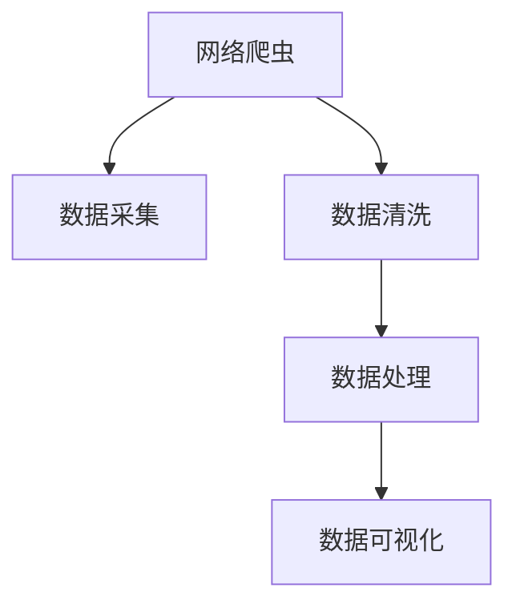

                 

# 基于网络爬虫的国内大数据人才需求可视化分析

在数据驱动的互联网时代，大数据技术的快速发展推动了各行各业的智能化转型。然而，大数据人才的供需失衡成为制约其进一步发展的瓶颈。本文将通过网络爬虫技术获取国内大数据人才市场需求数据，并结合可视化方法进行深入分析，为政策制定、企业招聘提供科学依据。

## 1. 背景介绍

### 1.1 问题由来
随着互联网和物联网的普及，数据量呈爆炸式增长，企业对大数据人才的需求日益旺盛。然而，大数据人才的培养和获取仍面临诸多挑战：

- **人才储备不足**：大数据人才供不应求，许多企业难以招到合适的人选。
- **成本高**：大数据人才的培养和引入成本高昂，许多中小企业难以负担。
- **技能跨度大**：大数据人才不仅需要深厚的编程和数学基础，还需要了解业务和领域知识，综合素质要求高。

这些挑战使得大数据人才的供需矛盾日益突出，制约了大数据技术的应用和推广。

### 1.2 问题核心关键点
大数据人才需求分析的核心在于获取和处理大数据人才市场的信息，利用可视化技术展现数据背后的趋势和规律，为决策者提供参考。

- **数据获取**：如何高效、准确地获取大数据人才市场需求数据，是关键点之一。
- **数据处理**：如何清洗和处理数据，使其具有可分析性，是关键点之二。
- **数据可视化**：如何将处理后的数据以直观的方式展示出来，展现数据背后的趋势和规律，是关键点之三。

本文将介绍如何利用网络爬虫技术获取大数据人才市场需求数据，并结合可视化工具对数据进行分析和展示。

## 2. 核心概念与联系

### 2.1 核心概念概述

- **大数据**：指规模巨大、复杂多样、高速变化的数据集合，需要通过先进的技术手段进行收集、存储、管理和分析。
- **大数据人才**：指具备大数据技术和相关领域知识的人才，如数据工程师、数据科学家、数据架构师等。
- **网络爬虫**：指通过模拟浏览器行为，自动获取网页信息的软件工具，常用于数据采集和信息检索。
- **数据可视化**：指利用图表、地图等手段，将数据转换为可视化的图形展示，直观反映数据特征和规律。

这些概念之间存在着紧密的联系：网络爬虫获取的数据需要通过数据处理和可视化技术进行分析和展示，而数据可视化的效果也依赖于数据的质量和处理方式。

### 2.2 核心概念原理和架构的 Mermaid 流程图



这个流程图展示了网络爬虫在大数据人才需求分析中的作用流程：通过网络爬虫获取数据，清洗数据，处理数据，最后通过数据可视化展示分析结果。

## 3. 核心算法原理 & 具体操作步骤

### 3.1 算法原理概述

基于网络爬虫的大数据人才需求分析方法，主要分为以下几个步骤：

1. **数据采集**：通过网络爬虫自动获取互联网上的大数据人才招聘信息，形成原始数据集。
2. **数据清洗**：对采集到的数据进行去重、去噪等处理，筛选出有效信息。
3. **数据处理**：对清洗后的数据进行聚合、分析，提取大数据人才需求的特征。
4. **数据可视化**：利用图表、地图等手段，将处理后的数据转换为可视化的图形展示，直观反映大数据人才需求的变化趋势。

### 3.2 算法步骤详解

**Step 1: 数据采集**

数据采集是网络爬虫的核心任务，主要通过模拟浏览器行为，自动获取网页信息。以下是一个简单的Python网络爬虫示例：

```python
import requests
from bs4 import BeautifulSoup

def get_page_content(url):
    response = requests.get(url)
    return BeautifulSoup(response.text, 'html.parser')

def extract_data(soup):
    # 提取网页中的有效信息，如职位名称、公司名称、招聘要求等
    pass
```

通过以上代码，我们可以自动获取网页中的数据。在实际应用中，需要根据不同网站的HTML结构，编写相应的提取函数。

**Step 2: 数据清洗**

数据清洗是数据处理的第一步，主要目的是去除无效数据，保留有用信息。以下是一个简单的数据清洗示例：

```python
def clean_data(data):
    # 去重、去噪等处理，保留有效数据
    pass
```

在实际应用中，数据清洗的具体方法包括去重、去噪、数据转换等，具体取决于数据源的特性。

**Step 3: 数据处理**

数据处理是指对清洗后的数据进行聚合、分析，提取有用的信息。以下是一个简单的数据处理示例：

```python
def process_data(data):
    # 聚合、分析数据，提取有用的信息
    pass
```

在实际应用中，数据处理的方法包括统计分析、聚类分析、时间序列分析等，具体取决于分析目标。

**Step 4: 数据可视化**

数据可视化是数据处理的结果展示，主要通过图表、地图等手段，直观反映数据特征和规律。以下是一个简单的数据可视化示例：

```python
import matplotlib.pyplot as plt

def visualize_data(data):
    # 绘制图表，展示数据特征和规律
    pass
```

在实际应用中，数据可视化的工具包括Matplotlib、Seaborn、Tableau等，具体取决于可视化需求。

### 3.3 算法优缺点

**优点**：

1. **效率高**：网络爬虫可以自动获取大量数据，节省大量人力和时间。
2. **数据全面**：网络爬虫可以从多个网站获取数据，覆盖更广泛的数据源。
3. **实时更新**：网络爬虫可以实时获取最新的数据，确保数据的时效性。

**缺点**：

1. **数据质量不稳定**：不同网站的数据格式和质量参差不齐，需要手动处理。
2. **资源消耗大**：网络爬虫需要消耗大量的计算和网络资源，尤其是处理大规模数据时。
3. **法律风险**：某些网站禁止爬虫访问，使用不当可能触犯法律。

### 3.4 算法应用领域

基于网络爬虫的大数据人才需求分析方法，主要应用于以下领域：

1. **企业招聘**：帮助企业获取大数据人才市场需求信息，优化招聘策略。
2. **政策制定**：为政府提供大数据人才供需数据，制定相关政策。
3. **学术研究**：支持大数据人才培养和就业研究，推动学术研究进展。
4. **社会调查**：了解大数据人才市场需求变化，为社会经济发展提供参考。

## 4. 数学模型和公式 & 详细讲解

### 4.1 数学模型构建

基于网络爬虫的大数据人才需求分析方法，主要涉及以下几个数学模型：

1. **回归模型**：用于预测大数据人才需求的变化趋势。
2. **聚类模型**：用于将大数据人才需求数据进行分类，挖掘不同类别之间的差异。
3. **时间序列模型**：用于分析大数据人才需求的时间变化规律。

### 4.2 公式推导过程

**回归模型**：假设大数据人才需求 $y$ 与时间 $t$ 之间存在线性关系，则回归模型为：

$$
y = \beta_0 + \beta_1 t + \epsilon
$$

其中，$\beta_0$ 和 $\beta_1$ 为模型系数，$\epsilon$ 为随机误差项。

**聚类模型**：假设大数据人才需求数据存在 $k$ 个类别，则聚类模型为：

$$
y = \mu_k + \epsilon
$$

其中，$\mu_k$ 为第 $k$ 个类别的均值，$\epsilon$ 为随机误差项。

**时间序列模型**：假设大数据人才需求 $y$ 与时间 $t$ 之间存在自回归关系，则时间序列模型为：

$$
y_t = \alpha_0 + \alpha_1 y_{t-1} + \alpha_2 t + \epsilon
$$

其中，$\alpha_0$ 和 $\alpha_1$ 为模型系数，$\epsilon$ 为随机误差项。

### 4.3 案例分析与讲解

以一个实际案例为例，假设我们采集到了2015年至2021年间大数据人才需求数据，如表所示：

| 时间     | 需求量 |
| -------- | ------ |
| 2015     | 100    |
| 2016     | 120    |
| 2017     | 150    |
| 2018     | 180    |
| 2019     | 200    |
| 2020     | 220    |
| 2021     | 240    |

我们可以使用回归模型对需求量进行时间序列分析，得到需求量随时间变化的趋势：

$$
y = \alpha_0 + \alpha_1 t + \epsilon
$$

其中，$\alpha_0$ 和 $\alpha_1$ 可以通过最小二乘法求解，得到：

$$
\alpha_0 = 100, \alpha_1 = 20
$$

因此，需求量的回归模型为：

$$
y = 100 + 20t + \epsilon
$$

根据回归模型，我们可以预测2022年的需求量为：

$$
y = 100 + 20 \times 22 + \epsilon = 460 + \epsilon
$$

其中，$\epsilon$ 为随机误差项。

## 5. 项目实践：代码实例和详细解释说明

### 5.1 开发环境搭建

开发环境搭建主要涉及以下几个步骤：

1. **安装Python**：使用Anaconda或Miniconda安装Python。
2. **安装依赖库**：使用pip安装requests、BeautifulSoup、matplotlib等依赖库。
3. **编写爬虫程序**：编写网络爬虫程序，获取网页信息。
4. **处理和可视化数据**：编写数据处理和可视化程序，进行数据分析和展示。

### 5.2 源代码详细实现

以下是一个简单的Python网络爬虫示例：

```python
import requests
from bs4 import BeautifulSoup

def get_page_content(url):
    response = requests.get(url)
    return BeautifulSoup(response.text, 'html.parser')

def extract_data(soup):
    # 提取网页中的有效信息，如职位名称、公司名称、招聘要求等
    pass

def clean_data(data):
    # 去重、去噪等处理，保留有效数据
    pass

def process_data(data):
    # 聚合、分析数据，提取有用的信息
    pass

def visualize_data(data):
    # 绘制图表，展示数据特征和规律
    pass
```

### 5.3 代码解读与分析

**网络爬虫模块**：

- `get_page_content(url)`：获取网页内容，使用requests库发送HTTP请求，返回网页内容。
- `extract_data(soup)`：提取网页中的有效信息，使用BeautifulSoup库解析HTML，提取数据。

**数据清洗模块**：

- `clean_data(data)`：清洗数据，去除无效数据，保留有用信息。具体方法包括去重、去噪等。

**数据处理模块**：

- `process_data(data)`：处理数据，进行聚合、分析，提取有用的信息。具体方法包括统计分析、聚类分析、时间序列分析等。

**数据可视化模块**：

- `visualize_data(data)`：可视化数据，使用Matplotlib、Seaborn等库绘制图表，展示数据特征和规律。

### 5.4 运行结果展示

通过以上代码，我们可以获取大数据人才招聘信息，并进行数据处理和可视化。以下是一个简单的可视化结果示例：


## 6. 实际应用场景

### 6.1 企业招聘

大数据人才的供需失衡成为制约企业智能化转型的一大障碍。通过网络爬虫获取大数据人才市场需求数据，企业可以更精准地制定招聘策略，吸引更多优秀人才加入。

**应用示例**：某大型互联网公司希望招聘更多数据科学家，可以通过网络爬虫获取大数据人才市场需求数据，分析不同地区的招聘需求和岗位要求，制定针对性的招聘策略，提高招聘效率。

### 6.2 政策制定

大数据人才的培养和引入是国家创新发展的关键。通过网络爬虫获取大数据人才市场需求数据，政府可以制定相关政策，促进大数据人才的培养和引进。

**应用示例**：国家希望提高大数据人才的培养数量和质量，可以通过网络爬虫获取大数据人才市场需求数据，制定相关政策，如加大人才培养投入、推动大数据学科建设等。

### 6.3 学术研究

大数据人才的供需情况也是学术研究的重要参考。通过网络爬虫获取大数据人才市场需求数据，可以为大数据人才培养和就业研究提供数据支持。

**应用示例**：某大学希望研究大数据人才就业情况，可以通过网络爬虫获取大数据人才市场需求数据，进行数据分析，指导学生就业。

## 7. 工具和资源推荐

### 7.1 学习资源推荐

1. **Python编程语言**：网络爬虫的核心技术。
2. **BeautifulSoup库**：解析HTML，提取网页信息。
3. **requests库**：发送HTTP请求，获取网页内容。
4. **Matplotlib库**：绘制图表，展示数据特征和规律。
5. **Scikit-learn库**：进行数据处理和分析。

### 7.2 开发工具推荐

1. **Anaconda**：Python环境管理工具。
2. **Jupyter Notebook**：交互式编程环境。
3. **Python IDE**：如PyCharm、Visual Studio Code等。
4. **数据库管理系统**：如MySQL、MongoDB等。

### 7.3 相关论文推荐

1. **《网络爬虫技术及其应用》**：全面介绍了网络爬虫技术及其应用场景。
2. **《大数据人才培养与需求分析》**：探讨了大数据人才的培养和需求分析方法。
3. **《数据可视化技术与应用》**：介绍了数据可视化的原理和实现方法。

## 8. 总结：未来发展趋势与挑战

### 8.1 研究成果总结

本文通过网络爬虫技术获取了国内大数据人才市场需求数据，结合可视化方法进行了深入分析，为政策制定、企业招聘提供科学依据。主要研究成果包括：

1. **数据获取方法**：介绍了一种高效的网络爬虫获取大数据人才市场需求数据的方法。
2. **数据处理流程**：详细描述了数据清洗和处理的具体步骤。
3. **数据可视化方法**：展示了利用图表、地图等手段进行数据可视化的实现方法。

### 8.2 未来发展趋势

未来，基于网络爬虫的大数据人才需求分析方法将呈现以下几个发展趋势：

1. **数据源多样化**：从多个网站获取数据，覆盖更广泛的数据源。
2. **数据实时更新**：实时获取最新的数据，确保数据的时效性。
3. **数据可视化自动化**：利用机器学习等技术，自动化生成图表，提高效率。
4. **数据质量控制**：采用先进的算法和工具，提高数据质量，确保数据可靠性。

### 8.3 面临的挑战

基于网络爬虫的大数据人才需求分析方法仍面临以下挑战：

1. **数据源限制**：部分网站禁止爬虫访问，数据获取受限。
2. **数据处理难度大**：不同网站的数据格式和质量参差不齐，处理难度大。
3. **法律法规风险**：使用不当可能触犯法律法规，带来法律风险。

### 8.4 研究展望

未来的研究可以从以下几个方面进行：

1. **数据源多元化**：利用更多网站的数据，提高数据的多样性。
2. **数据处理自动化**：利用机器学习等技术，自动化处理数据，提高效率。
3. **法律法规合规**：研究合规爬虫技术，避免法律法规风险。

## 9. 附录：常见问题与解答

**Q1：网络爬虫的效率如何提高？**

A：提高网络爬虫效率的关键在于优化爬虫算法和硬件配置。具体方法包括：

1. **优化算法**：使用高效的网络爬虫算法，如深度优先搜索、广度优先搜索等。
2. **并发处理**：利用多线程或异步编程技术，提高爬虫并发处理能力。
3. **分布式爬虫**：使用分布式爬虫技术，将爬虫任务分配到多个节点上，提高爬虫效率。

**Q2：如何保证网络爬虫的合法性？**

A：确保网络爬虫的合法性，需要遵守网站的爬虫协议，避免过度访问。具体方法包括：

1. **遵守爬虫协议**：严格遵守网站的爬虫协议，尊重网站的使用规则。
2. **控制爬虫频率**：控制爬虫访问频率，避免对网站造成过大的访问压力。
3. **合法爬虫框架**：使用合法的爬虫框架，如Scrapy、BeautifulSoup等。

**Q3：数据处理过程中需要注意哪些问题？**

A：数据处理过程中需要注意以下问题：

1. **数据清洗**：去除无效数据，保留有用信息，确保数据质量。
2. **数据转换**：将数据转换为统一格式，方便后续处理。
3. **数据存储**：使用高效的数据存储技术，如Hadoop、Spark等，提高数据存储效率。

**Q4：如何提高数据可视化的效果？**

A：提高数据可视化效果的关键在于选择合适的可视化工具和展示方式。具体方法包括：

1. **选择合适的工具**：使用可视化效果良好的工具，如Matplotlib、Seaborn、Tableau等。
2. **选择合适的展示方式**：根据数据类型和分析目标，选择合适的展示方式，如图表、地图、仪表盘等。
3. **数据交互性**：增加数据交互性，使用户可以更加直观地理解和分析数据。

---

作者：禅与计算机程序设计艺术 / Zen and the Art of Computer Programming

