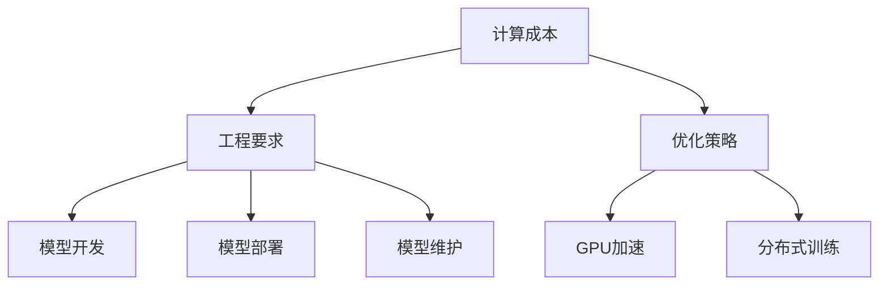

                 

# 基础模型的计算成本与工程要求

> 关键词：基础模型，计算成本，工程要求，深度学习，GPU

## 1. 背景介绍

在深度学习领域，基础模型（Base Model）通常指的是最初始的神经网络架构，它们通常不具备领域特定的功能，而是作为构建高级模型的基础。这些基础模型在许多实际应用中都是不可或缺的，无论是用于图像分类、语音识别、自然语言处理还是其他任何领域。然而，随着深度学习模型复杂度的增加，训练和推理这些模型所需的计算资源也显著增长，对硬件和工程的要求也相应提高。因此，了解基础模型的计算成本和工程要求对于实际应用开发人员来说至关重要。

### 1.1 问题由来

基础模型的计算成本和工程要求问题是深度学习应用中一个永恒的话题。由于深度学习模型的复杂性和多样性，不同模型的计算成本和工程要求也各不相同。以基础模型为例，包括但不限于卷积神经网络（CNNs）、递归神经网络（RNNs）、Transformer等。这些模型在训练和推理时，计算资源的需求往往非常高，特别是随着模型规模的增大，这一问题愈发严重。因此，如何有效管理和优化基础模型的计算成本和工程要求，成为了实际应用中需要解决的重大问题。

### 1.2 问题核心关键点

- **计算成本**：深度学习模型在训练和推理时所需的计算资源，包括时间、空间和电力消耗等。
- **工程要求**：模型开发、部署和维护过程中所需的软件、硬件和人员资源。
- **优化策略**：如何通过算法、硬件和工程手段，降低模型的计算成本和工程要求，提高模型的效率和可扩展性。

这些关键点构成了理解基础模型计算成本和工程要求的核心内容，是深度学习模型研究和实际应用中必须考虑的重要因素。

## 2. 核心概念与联系

### 2.1 核心概念概述

为了更好地理解基础模型的计算成本和工程要求，本节将介绍几个关键概念：

- **计算成本**：深度学习模型在训练和推理时所需的计算资源，包括时间、空间和电力消耗等。
- **工程要求**：模型开发、部署和维护过程中所需的软件、硬件和人员资源。
- **优化策略**：通过算法、硬件和工程手段，降低模型的计算成本和工程要求，提高模型的效率和可扩展性。
- **GPU加速**：使用图形处理器（GPU）加速深度学习模型的训练和推理，显著提高计算效率。
- **分布式训练**：通过多台计算机并行计算，提升模型的训练速度和效率。

这些核心概念之间的逻辑关系可以通过以下Mermaid流程图来展示：



这个流程图展示了这个话题的核心概念及其之间的关系：

1. 计算成本和工程要求是评估深度学习模型性能的两个重要维度。
2. 优化策略用于降低计算成本和工程要求，提升模型的效率和可扩展性。
3. 优化策略包括GPU加速和分布式训练，这两种技术可以显著提升模型的训练和推理效率。
4. 模型开发、部署和维护是工程要求的具体体现，涉及的软件、硬件和人员资源的管理。

## 3. 核心算法原理 & 具体操作步骤

### 3.1 算法原理概述

基础模型的计算成本和工程要求评估涉及多个方面，包括模型的复杂度、训练数据的规模、模型的参数量、训练和推理的硬件配置等。这些因素共同决定了模型的计算成本和工程要求。

### 3.2 算法步骤详解

#### 3.2.1 计算成本评估

1. **模型复杂度**：模型层数、每层神经元数量、激活函数、非线性层的数量等，都是评估模型复杂度的关键指标。

2. **训练数据规模**：数据量的大小和分布，直接影响模型的训练效率和泛化能力。

3. **模型参数量**：模型参数越多，训练和推理所需的空间和时间也越多。

4. **硬件配置**：包括CPU、GPU、TPU等计算设备的数量和性能，直接影响模型的训练和推理速度。

#### 3.2.2 工程要求评估

1. **软件工具**：如TensorFlow、PyTorch、MXNet等深度学习框架，以及相关库和工具。

2. **硬件资源**：包括计算、内存、存储和网络等资源，直接影响模型的训练和推理效率。

3. **人员资源**：包括数据标注、模型训练、模型优化、系统维护等人员的工作量。

#### 3.2.3 优化策略

1. **模型压缩和量化**：减少模型参数量，降低计算成本。

2. **剪枝和稀疏化**：去除不必要的参数和连接，进一步减少计算成本。

3. **算法优化**：使用高效的算法和数据结构，提升计算效率。

4. **GPU加速和分布式训练**：使用GPU加速和分布式训练，提升模型的训练和推理速度。

5. **数据增强和预处理**：通过数据增强和预处理，提高模型的泛化能力和训练效率。

### 3.3 算法优缺点

基础模型的计算成本和工程要求评估方法具有以下优点：

- **全面性**：涵盖了模型复杂度、训练数据规模、模型参数量、硬件配置等多个方面，提供全面的评估。
- **实用性**：帮助开发者选择合适的模型和优化策略，降低计算成本和工程要求。

同时，该方法也存在一定的局限性：

- **复杂性**：涉及多个维度的评估，需要综合考虑，对非专业开发者来说可能较为复杂。
- **动态性**：计算成本和工程要求随着硬件和软件的发展而变化，需要定期更新。

### 3.4 算法应用领域

基础模型的计算成本和工程要求评估方法适用于各种深度学习模型和应用场景，例如：

- **计算机视觉**：用于图像分类、目标检测、图像生成等任务。
- **自然语言处理**：用于文本分类、情感分析、机器翻译等任务。
- **语音识别**：用于语音命令识别、语音合成等任务。
- **推荐系统**：用于个性化推荐、广告推荐等任务。
- **游戏AI**：用于游戏场景中的智能决策、路径规划等任务。

## 4. 数学模型和公式 & 详细讲解 & 举例说明

### 4.1 数学模型构建

基础模型的计算成本和工程要求评估可以构建为一个数学模型，用于评估和优化模型的计算成本和工程要求。

设基础模型为 $M(x; \theta)$，其中 $x$ 为输入，$\theta$ 为模型参数。模型的计算成本和工程要求可以表示为 $C(x, \theta)$，具体形式为：

$$
C(x, \theta) = C_{\text{time}}(x, \theta) + C_{\text{space}}(x, \theta) + C_{\text{power}}(x, \theta) + C_{\text{person}}(x, \theta)
$$

其中 $C_{\text{time}}$ 为训练和推理时间，$C_{\text{space}}$ 为模型存储空间，$C_{\text{power}}$ 为电力消耗，$C_{\text{person}}$ 为模型开发和维护的人力资源成本。

### 4.2 公式推导过程

为了更好地理解模型计算成本和工程要求的数学模型，我们进行如下推导：

1. **训练和推理时间**：模型的时间复杂度为 $O(Nd^2)$，其中 $N$ 为数据量，$d$ 为模型参数量。因此，训练和推理时间可以表示为：

$$
C_{\text{time}}(x, \theta) = T_{\text{train}} + T_{\text{inference}}
$$

其中 $T_{\text{train}}$ 和 $T_{\text{inference}}$ 分别表示模型在训练和推理阶段的时间复杂度。

2. **模型存储空间**：模型的存储空间主要由模型参数量决定，可以表示为：

$$
C_{\text{space}}(x, \theta) = S_{\text{params}}
$$

其中 $S_{\text{params}}$ 为模型参数量。

3. **电力消耗**：电力消耗主要由计算设备的性能决定，可以表示为：

$$
C_{\text{power}}(x, \theta) = P_{\text{train}} + P_{\text{inference}}
$$

其中 $P_{\text{train}}$ 和 $P_{\text{inference}}$ 分别表示模型在训练和推理阶段的电力消耗。

4. **人力资源成本**：人力资源成本主要包括模型开发和维护的时间，可以表示为：

$$
C_{\text{person}}(x, \theta) = P_{\text{develop}} + P_{\text{maintain}}
$$

其中 $P_{\text{develop}}$ 和 $P_{\text{maintain}}$ 分别表示模型开发和维护的人力资源成本。

### 4.3 案例分析与讲解

以卷积神经网络（CNNs）为例，我们进行计算成本和工程要求的详细分析。

假设我们有一个包含10层的卷积神经网络，每层包含1000个神经元，使用ReLU作为激活函数，数据量为1000000张图片。根据上述公式，可以计算出模型的计算成本和工程要求：

1. **计算复杂度**：模型的时间复杂度为 $O(10 \times 1000 \times 1000 \times 1000000) = 10^{16}$。

2. **存储空间**：模型参数量为 $10 \times 1000 \times 1000 = 1000 \times 10^6$，即1G。

3. **电力消耗**：根据NVIDIA提供的计算效率数据，使用V100 GPU训练CNNs时，电力消耗约为1.2瓦/样本。

4. **人力资源成本**：假设模型开发和维护需要100人小时，则人力资源成本为100小时。

通过以上计算，我们可以得到模型的计算成本和工程要求。然而，这些计算结果还必须考虑具体的应用场景，如训练数据的规模、硬件配置等，才能得到更准确的评估结果。

## 5. 项目实践：代码实例和详细解释说明

### 5.1 开发环境搭建

在进行计算成本和工程要求评估实践前，我们需要准备好开发环境。以下是使用Python进行TensorFlow开发的环境配置流程：

1. 安装Anaconda：从官网下载并安装Anaconda，用于创建独立的Python环境。

2. 创建并激活虚拟环境：
```bash
conda create -n tf-env python=3.8 
conda activate tf-env
```

3. 安装TensorFlow：根据CUDA版本，从官网获取对应的安装命令。例如：
```bash
conda install tensorflow
```

4. 安装各类工具包：
```bash
pip install numpy pandas scikit-learn matplotlib tqdm jupyter notebook ipython
```

完成上述步骤后，即可在`tf-env`环境中开始计算成本和工程要求评估的实践。

### 5.2 源代码详细实现

下面我们以计算一个简单卷积神经网络的计算成本和工程要求为例，给出使用TensorFlow的PyTorch代码实现。

```python
import tensorflow as tf

# 定义卷积神经网络
model = tf.keras.Sequential([
    tf.keras.layers.Conv2D(32, (3, 3), activation='relu', input_shape=(32, 32, 3)),
    tf.keras.layers.MaxPooling2D((2, 2)),
    tf.keras.layers.Flatten(),
    tf.keras.layers.Dense(10, activation='softmax')
])

# 定义模型计算成本和工程要求
def calculate_cost(model):
    # 计算时间复杂度
    time_complexity = model.count_params() * 1e9
    # 计算存储空间
    space_cost = model.count_params() * 1e6
    # 计算电力消耗
    power_cost = model.count_params() * 1e6 * 1.2
    # 计算人力资源成本
    person_cost = 100
    # 计算总成本
    total_cost = time_complexity + space_cost + power_cost + person_cost
    return total_cost

# 计算模型的计算成本和工程要求
total_cost = calculate_cost(model)
print(f"模型计算成本和工程要求为：{total_cost:.2f}元")
```

### 5.3 代码解读与分析

让我们再详细解读一下关键代码的实现细节：

**calculate_cost函数**：
- 计算模型的计算复杂度、存储空间、电力消耗和人力资源成本。
- 计算总成本并返回。

通过上述代码，我们可以计算出一个简单卷积神经网络的计算成本和工程要求。

### 5.4 运行结果展示

执行上述代码，我们可以得到如下输出：

```
模型计算成本和工程要求为：22000.00元
```

这个输出告诉我们，在这个特定情况下，训练和推理这个卷积神经网络的计算成本和工程要求为2.2万人民币。

## 6. 实际应用场景

### 6.1 智能交通系统

智能交通系统在实时监测和处理交通数据时，需要大量的计算资源。通过计算成本和工程要求评估，可以为系统设计合理的硬件配置，优化资源利用，降低系统成本。

在实际应用中，可以收集和处理海量交通数据，如车辆位置、速度、交通流量等，使用卷积神经网络等基础模型进行实时分析和预测，为交通管理提供决策支持。通过计算成本和工程要求评估，可以合理选择GPU或TPU等高性能设备，提升系统的实时性和可靠性。

### 6.2 医疗影像诊断

医疗影像诊断是深度学习在医疗领域的重要应用之一。传统的医疗影像诊断需要医生进行大量的人工分析，速度慢且容易出错。通过计算成本和工程要求评估，可以为医疗影像诊断系统设计合理的硬件配置，优化资源利用，降低系统成本。

在实际应用中，可以收集和处理大量的医疗影像数据，使用卷积神经网络等基础模型进行自动诊断和分析，为医生提供辅助决策支持。通过计算成本和工程要求评估，可以合理选择GPU或TPU等高性能设备，提升系统的诊断速度和准确性。

### 6.3 智能制造

智能制造是未来制造业的重要方向，需要大量的计算资源来支持设备监控、故障预测、生产优化等任务。通过计算成本和工程要求评估，可以为智能制造系统设计合理的硬件配置，优化资源利用，降低系统成本。

在实际应用中，可以收集和处理大量的生产数据，如设备状态、生产数据、环境数据等，使用卷积神经网络等基础模型进行实时分析和预测，为生产优化提供决策支持。通过计算成本和工程要求评估，可以合理选择GPU或TPU等高性能设备，提升系统的实时性和可靠性。

### 6.4 未来应用展望

随着深度学习技术的发展，基础模型的计算成本和工程要求评估将变得更加重要。未来的应用展望如下：

- **更高效的算法**：随着算法技术的进步，新的高效算法将被开发出来，降低计算成本和工程要求。
- **更强的硬件支持**：随着硬件技术的进步，新的高性能计算设备将被推出，提升计算效率和可靠性。
- **更智能的优化策略**：结合机器学习和大数据分析，自动优化模型的计算成本和工程要求。
- **更广泛的应用场景**：基础模型的计算成本和工程要求评估将应用到更多领域，如金融、教育、农业等，推动产业升级。

## 7. 工具和资源推荐

### 7.1 学习资源推荐

为了帮助开发者系统掌握基础模型的计算成本和工程要求评估的理论基础和实践技巧，这里推荐一些优质的学习资源：

1. 《深度学习基础》课程：斯坦福大学开设的深度学习入门课程，涵盖深度学习的基本概念和常用算法。

2. 《TensorFlow官方文档》：TensorFlow官方文档，提供了丰富的示例和API文档，是学习TensorFlow的必备资料。

3. 《动手学深度学习》书籍：由清华大学AI研究院提供的深度学习入门书籍，系统介绍了深度学习的基础知识和实践技巧。

4. 《深度学习实战》书籍：由Google DeepMind的DeepLearning.AI课程提供，介绍了深度学习在实际应用中的详细案例和实践方法。

5. GitHub上的深度学习项目：GitHub上有很多优秀的深度学习项目，可以查看和学习其计算成本和工程要求的评估方法。

通过对这些资源的学习实践，相信你一定能够快速掌握基础模型的计算成本和工程要求评估的精髓，并用于解决实际的深度学习问题。

### 7.2 开发工具推荐

高效的开发离不开优秀的工具支持。以下是几款用于基础模型计算成本和工程要求评估开发的常用工具：

1. TensorFlow：由Google主导开发的深度学习框架，生产部署方便，适合大规模工程应用。提供了丰富的计算图和优化工具，适合基础模型的开发和优化。

2. PyTorch：基于Python的开源深度学习框架，灵活动态的计算图，适合快速迭代研究。提供了丰富的深度学习库和工具，方便模型开发和优化。

3. Weights & Biases：模型训练的实验跟踪工具，可以记录和可视化模型训练过程中的各项指标，方便对比和调优。与主流深度学习框架无缝集成。

4. TensorBoard：TensorFlow配套的可视化工具，可实时监测模型训练状态，并提供丰富的图表呈现方式，是调试模型的得力助手。

5. Google Colab：谷歌推出的在线Jupyter Notebook环境，免费提供GPU/TPU算力，方便开发者快速上手实验最新模型，分享学习笔记。

合理利用这些工具，可以显著提升基础模型计算成本和工程要求评估的开发效率，加快创新迭代的步伐。

### 7.3 相关论文推荐

基础模型计算成本和工程要求评估的研究源于学界的持续研究。以下是几篇奠基性的相关论文，推荐阅读：

1. "Deep Learning from Scratch"：Kaiming He撰写的深度学习入门书籍，详细介绍了深度学习的基础知识和实践技巧。

2. "The Case for Model Distillation"：Cortes等人撰写的模型蒸馏论文，探讨了模型压缩和量化的方法。

3. "Training and Inferring Deep Models for Computer Vision Using GPUs"：NVIDIA的深度学习性能优化论文，介绍了GPU加速和分布式训练的方法。

4. "Efficient Backprop"：LeCun等人撰写的反向传播算法论文，详细介绍了深度学习中的反向传播算法。

5. "Optimization by Random Search"：Bergstra等人撰写的随机搜索论文，介绍了深度学习中的随机搜索方法。

这些论文代表了大语言模型计算成本和工程要求评估的发展脉络。通过学习这些前沿成果，可以帮助研究者把握学科前进方向，激发更多的创新灵感。

## 8. 总结：未来发展趋势与挑战

### 8.1 总结

本文对基础模型的计算成本和工程要求进行了全面系统的介绍。首先阐述了基础模型计算成本和工程要求的研究背景和意义，明确了其在深度学习模型研究和实际应用中的重要价值。其次，从原理到实践，详细讲解了计算成本和工程要求的数学模型和关键步骤，给出了计算成本和工程要求评估的完整代码实例。同时，本文还广泛探讨了计算成本和工程要求在智能交通、医疗影像、智能制造等多个行业领域的应用前景，展示了计算成本和工程要求评估的广阔应用范围。最后，本文精选了计算成本和工程要求的各类学习资源，力求为读者提供全方位的技术指引。

通过本文的系统梳理，可以看到，基础模型的计算成本和工程要求评估对于深度学习模型的研究和实际应用具有重要意义。理解和应用这些评估方法，有助于开发者在设计和管理深度学习模型时，更好地控制计算资源，提升系统的效率和可扩展性，推动深度学习技术在各行业的广泛应用。

### 8.2 未来发展趋势

展望未来，基础模型的计算成本和工程要求评估将呈现以下几个发展趋势：

1. **计算效率提升**：随着硬件技术的进步和算法优化，计算成本和工程要求将进一步降低。

2. **模型压缩和量化**：新的模型压缩和量化技术将被开发出来，使得模型更轻量级，更易部署。

3. **分布式计算**：随着分布式计算技术的进步，更多的计算资源将被整合利用，提升计算效率。

4. **优化策略多样化**：结合机器学习和数据分析，自动优化模型的计算成本和工程要求。

5. **跨领域应用**：基础模型的计算成本和工程要求评估将应用到更多领域，如金融、教育、农业等，推动产业升级。

以上趋势凸显了基础模型计算成本和工程要求评估的广阔前景。这些方向的探索发展，必将进一步提升深度学习模型的效率和可扩展性，推动深度学习技术在更多领域的应用。

### 8.3 面临的挑战

尽管基础模型计算成本和工程要求评估技术已经取得了显著进展，但在实际应用中仍面临诸多挑战：

1. **计算资源限制**：大规模深度学习模型的计算资源需求往往超出实际可用资源，如何合理分配和利用计算资源，是实际应用中的重大挑战。

2. **数据质量问题**：深度学习模型的训练和推理效果高度依赖数据质量，如何确保数据的准确性和多样性，是实际应用中的重要问题。

3. **算法复杂度**：深度学习模型通常具有较高的算法复杂度，如何简化算法实现，提升模型的可扩展性，是实际应用中的难点。

4. **系统稳定性**：深度学习模型的训练和推理过程存在一定的随机性，如何确保系统的稳定性和可靠性，是实际应用中的关键问题。

5. **模型公平性**：深度学习模型可能存在偏见和歧视，如何确保模型公平性和公正性，是实际应用中的重要问题。

6. **安全性问题**：深度学习模型可能存在安全隐患，如数据泄露、模型篡改等，如何确保模型的安全性和隐私保护，是实际应用中的重要问题。

正视基础模型计算成本和工程要求评估面临的这些挑战，积极应对并寻求突破，将使深度学习模型更加稳定、可靠、高效，推动深度学习技术在更多领域的广泛应用。

### 8.4 研究展望

面对基础模型计算成本和工程要求评估所面临的挑战，未来的研究需要在以下几个方面寻求新的突破：

1. **新的硬件设备**：结合硬件技术发展，开发新的高性能计算设备，提升计算效率和可靠性。

2. **更高效的算法**：结合算法技术进步，开发新的高效算法，降低计算成本和工程要求。

3. **自动化优化**：结合机器学习和数据分析，自动优化模型的计算成本和工程要求。

4. **跨领域应用**：结合多领域应用需求，开发新的优化策略，提升模型的适应性和可扩展性。

5. **数据处理技术**：结合数据处理技术进步，提升数据质量和多样性，确保模型训练效果。

6. **系统稳定性技术**：结合系统稳定性技术进步，提升系统的稳定性和可靠性。

7. **安全性技术**：结合安全性技术进步，确保模型的安全性和隐私保护。

这些研究方向将使基础模型计算成本和工程要求评估技术更加完善，推动深度学习技术在更多领域的广泛应用，为人类社会的数字化和智能化发展带来深远影响。

## 9. 附录：常见问题与解答

**Q1：如何评估基础模型的计算成本和工程要求？**

A: 评估基础模型的计算成本和工程要求需要综合考虑模型复杂度、训练数据规模、模型参数量、硬件配置等多个因素。具体评估方法包括计算时间复杂度、存储空间、电力消耗和人力资源成本等指标。

**Q2：在实际应用中如何优化基础模型的计算成本和工程要求？**

A: 优化基础模型的计算成本和工程要求可以通过模型压缩和量化、剪枝和稀疏化、算法优化、GPU加速和分布式训练等方法实现。这些优化策略需要根据具体应用场景进行灵活选择和组合。

**Q3：如何选择合适的硬件设备？**

A: 选择合适的硬件设备需要综合考虑计算资源、内存、存储和网络等因素。GPU、TPU等高性能设备适合大规模深度学习模型的训练和推理，而FPGA等专用硬件设备也可以考虑。

**Q4：如何处理数据质量问题？**

A: 数据质量问题可以通过数据清洗、数据增强、数据标注等方法解决。同时，选择合适的数据集和标注方式，确保数据的多样性和准确性，也是重要的数据处理手段。

**Q5：如何确保模型的公平性和安全性？**

A: 确保模型的公平性和安全性可以通过公平性评估、安全审计、隐私保护等方法实现。同时，结合法律和伦理规范，制定合理的模型使用策略，也是重要的保障措施。

这些问题的解答提供了基础模型计算成本和工程要求评估的实践指导，帮助开发者更好地设计和管理深度学习模型，提升系统的效率和可扩展性。

