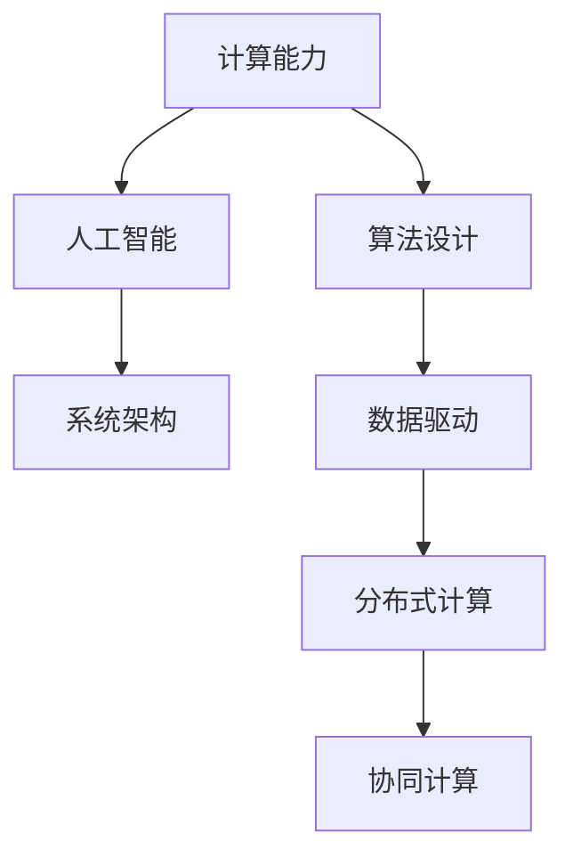

                 

# 塑造数字时代：人类计算的关键作用

> 关键词：计算能力, 人工智能, 算法设计, 系统架构, 数据驱动

## 1. 背景介绍

### 1.1 问题由来

随着信息技术的飞速发展，数字时代正在以前所未有的速度重塑全球经济和社会格局。数据、算法、计算能力已经成为驱动经济增长的核心引擎。与此同时，人类计算的重要性也日益凸显。

在信息技术的早期阶段，计算能力主要集中在大型机、超级计算机等物理设备上。随着个人电脑、移动互联网、云计算等技术的普及，计算能力逐渐分散到每个角落。每个人、每个组织、每个国家都可以通过互联网接入强大的计算资源，进行各种复杂的数据处理和分析。

这一转变不仅极大地促进了科研、商业、社会各方面的创新发展，也提出了新的挑战。如何高效利用分散的计算资源，实现任务协同，提升整体计算能力，成为新时代的重要课题。

### 1.2 问题核心关键点

人类计算的核心在于将庞大分散的计算资源高效整合，实现协同计算。这一过程涉及多个关键点，包括：

- 算法的可扩展性：确保算法可以在分散资源上并行计算，而不会受到单点故障的影响。
- 数据的分布式处理：实现数据的分布式存储和处理，最大化计算效率。
- 协同计算框架：构建高效的协同计算框架，实现资源最优分配和任务最优调度。
- 计算安全性：确保计算过程中的数据和算法的安全，避免信息泄露和攻击。
- 计算公平性：保证计算资源的公平分配，避免资源垄断和信息孤岛。

这些关键点共同构成了人类计算的底层架构，决定了计算能力在各个领域的应用效果。只有在这些方面进行综合优化，才能真正发挥计算能力在数字时代的重要作用。

### 1.3 问题研究意义

研究人类计算的核心问题，对于推动数字时代的发展具有重要意义：

1. 促进科研创新：人类计算能力可以支持大规模的科研计算，加速各类科研项目的发展。
2. 推动商业应用：计算能力可以提供强大的数据分析和预测，推动商业决策和智能营销。
3. 优化社会治理：计算能力可以用于社会数据分析，提升城市管理、公共安全等社会治理能力。
4. 增进国际合作：分散计算资源可以实现跨国协同计算，促进国际科技合作。
5. 提高国家竞争力：强大的计算能力是国家科技实力的重要标志，可以增强国家在全球竞争中的地位。

总之，提升人类计算能力，不仅能提升国家整体科技实力，还能推动经济社会发展，提升人民生活质量，为数字时代的持续进步奠定坚实基础。

## 2. 核心概念与联系

### 2.1 核心概念概述

为了更好地理解人类计算的核心问题，本节将介绍几个密切相关的核心概念：

- 计算能力(Computing Capability)：指机器在单位时间内执行计算任务的能力。可以通过并行计算、分布式计算等技术进行提升。
- 人工智能(Artificial Intelligence)：通过算法和计算能力，让机器具备类似于人类的智能行为。主要包括感知、理解、推理、学习、规划等方面。
- 算法设计(Algorithm Design)：设计高效的算法，以最小化计算资源消耗，最大化问题解决效率。
- 系统架构(System Architecture)：设计高效的计算系统架构，实现资源的最优分配和任务的最优调度。
- 数据驱动(Data-Driven)：以数据为核心驱动，通过数据挖掘和分析，实现决策的科学化和智能化。

这些核心概念之间的逻辑关系可以通过以下Mermaid流程图来展示：



这个流程图展示了一些核心概念及其之间的关系：

1. 计算能力是人工智能和算法设计的物质基础，直接影响系统的性能和效率。
2. 人工智能依赖于算法设计和计算能力，通过算法实现智能行为。
3. 系统架构是算法和计算能力的组织形式，直接影响计算资源的分配和任务调度。
4. 数据驱动是人工智能和算法设计的重要参考，通过数据挖掘和分析提供问题解决的依据。
5. 分布式计算和协同计算是计算能力的重要实现方式，将计算资源分散化，实现任务协同。

这些概念共同构成了人类计算的逻辑框架，决定了计算能力在各个领域的应用效果。通过理解这些核心概念，我们可以更好地把握人类计算的运作原理和优化方向。

## 3. 核心算法原理 & 具体操作步骤
### 3.1 算法原理概述

人类计算的核心在于通过算法和计算能力，实现大规模的分布式协同计算。其核心思想是：将计算任务分解为多个子任务，分配给多个计算节点进行并行计算，最终将计算结果汇总得到整体答案。

形式化地，假设一个计算任务为 $C$，可以通过以下步骤进行计算：

1. 将 $C$ 分解为若干个子任务 $C_1, C_2, ..., C_n$。
2. 为每个子任务 $C_i$ 分配一个计算节点 $N_i$，进行并行计算。
3. 将计算节点 $N_i$ 的计算结果汇总，得到整体计算结果 $R$。

数学上，可以表示为：

$$
R = \sum_{i=1}^{n} R_i
$$

其中 $R_i$ 为计算节点 $N_i$ 的计算结果。

通过并行计算，可以显著提升计算效率，加速大规模计算任务的完成。

### 3.2 算法步骤详解

人类计算的一般步骤包括以下几个关键环节：

**Step 1: 任务分解**

- 将复杂计算任务分解为多个子任务，每个子任务可以独立进行计算。
- 合理分配子任务的计算资源，确保每个任务在分配到的资源下能够高效完成。
- 任务分解的粒度应根据实际需求和资源条件进行调整。

**Step 2: 资源分配**

- 根据每个子任务的计算需求，分配计算资源，包括CPU、内存、存储、网络带宽等。
- 使用算法优化资源分配，确保每个任务在分配到的资源下能够高效完成。
- 资源分配应兼顾任务的优先级、执行时间、资源可用性等因素。

**Step 3: 并行计算**

- 将子任务分配给多个计算节点进行并行计算。
- 使用并行算法实现高效的并行计算，提升计算效率。
- 并行计算应考虑到任务的依赖关系，避免死锁和资源竞争。

**Step 4: 结果汇总**

- 将每个计算节点的计算结果汇总，得到整体计算结果。
- 使用数据汇总算法实现高效的计算结果聚合。
- 结果汇总应考虑到数据格式、数据大小等因素，确保计算结果的准确性。

**Step 5: 系统优化**

- 根据计算任务和资源条件，不断优化计算系统的性能。
- 使用性能分析工具对计算系统进行评估，发现瓶颈和改进点。
- 系统优化应兼顾计算效率和资源消耗，实现最优性能。

以上是人类计算的一般步骤。在实际应用中，还需要针对具体任务和资源特点进行优化设计，如改进任务分解策略、优化资源调度算法、引入多级调度机制等，以进一步提升计算效率。

### 3.3 算法优缺点

人类计算具有以下优点：

1. 计算效率高：通过并行计算，可以显著提升计算效率，加速大规模计算任务的完成。
2. 计算资源灵活：分布式计算可以将计算资源分散化，实现计算资源的灵活分配和利用。
3. 任务协同性好：协同计算可以实现任务并行执行，提升整体计算效率。
4. 适应性强：人类计算系统可以根据任务需求和资源条件进行灵活调整，适应各种复杂计算任务。

但同时也存在一些局限性：

1. 资源管理复杂：分布式计算需要复杂的管理和调度算法，增加系统设计难度。
2. 通信开销大：并行计算需要频繁的通信和数据传输，增加计算时间和带宽消耗。
3. 故障容忍度低：分布式计算中的单点故障可能导致整体计算任务失败，需要复杂的故障容忍机制。
4. 计算资源异构：不同计算节点的硬件和软件环境差异较大，影响计算任务的协同执行。

尽管存在这些局限性，但就目前而言，人类计算仍是实现大规模、复杂计算任务的主要手段。未来相关研究的重点在于如何进一步优化资源管理、降低通信开销、提高故障容忍度等，以提升人类计算的效率和可靠性。

### 3.4 算法应用领域

人类计算的应用领域非常广泛，涵盖了各个学科和行业：

- 科学研究：如气候模拟、天文学计算、基因组学分析等，需要大规模的计算任务和数据处理。
- 商业决策：如市场分析、风险评估、客户行为预测等，需要利用计算能力进行数据挖掘和分析。
- 金融分析：如高频交易、信用评估、欺诈检测等，需要强大的计算能力进行复杂计算。
- 医疗诊断：如医学影像分析、基因组测序、临床试验模拟等，需要高效的计算能力支持大规模数据处理。
- 城市管理：如交通流量预测、智慧城市调度、公共安全监控等，需要利用计算能力进行实时数据分析。

除了这些典型应用外，人类计算还被创新性地应用于更多领域，如能源管理、环境保护、安全监测等，为各个行业带来了深远的变革。随着计算能力的不断提升和算法的不断优化，人类计算将在更多领域得到广泛应用，为人类社会的进步贡献更多力量。

## 4. 数学模型和公式 & 详细讲解  
### 4.1 数学模型构建

人类计算的数学模型主要涉及以下几个关键方面：

- 任务分解：将计算任务 $C$ 分解为若干个子任务 $C_1, C_2, ..., C_n$。
- 资源分配：为每个子任务 $C_i$ 分配计算资源 $R_i$，计算资源包括 CPU、内存、存储、网络带宽等。
- 并行计算：将每个子任务 $C_i$ 分配给计算节点 $N_i$，进行并行计算，得到计算结果 $R_i$。
- 结果汇总：将每个计算节点的计算结果 $R_i$ 汇总，得到整体计算结果 $R$。

数学上，可以表示为：

$$
C = \{C_1, C_2, ..., C_n\}
$$

$$
R_i = C_i(N_i)
$$

$$
R = \sum_{i=1}^{n} R_i
$$

其中 $C_i$ 为子任务 $C_i$ 的计算函数，$N_i$ 为分配给子任务 $C_i$ 的计算节点。

### 4.2 公式推导过程

以下我们以一个简单的并行计算任务为例，推导人类计算的数学模型。

假设计算任务 $C$ 可以分解为两个子任务 $C_1$ 和 $C_2$，每个子任务分别分配给一个计算节点 $N_1$ 和 $N_2$，执行并行计算。设 $C_1(N_1)$ 和 $C_2(N_2)$ 分别为计算节点 $N_1$ 和 $N_2$ 的计算结果。

根据上述公式，整体计算结果 $R$ 可以表示为：

$$
R = C_1(N_1) + C_2(N_2)
$$

假设每个子任务计算时间为 $t_i$，每个子任务分配的计算资源为 $r_i$，则整体计算时间 $T$ 可以表示为：

$$
T = \max(t_1, t_2)
$$

其中 $t_1$ 和 $t_2$ 分别为计算节点 $N_1$ 和 $N_2$ 的计算时间。

通过优化任务分解、资源分配和并行计算策略，可以进一步提升整体计算效率，缩短计算时间。

### 4.3 案例分析与讲解

假设有一个气象预测任务，需要计算未来一周每天的气象数据。该任务可以分解为七个子任务，每个子任务计算每天的气象数据。每个子任务需要占用一个计算节点，进行并行计算。

- 任务分解：将一周七天分成七个任务，每天一个任务。
- 资源分配：每个任务分配一个计算节点，计算节点有足够的计算资源支持。
- 并行计算：每个任务在分配到的计算节点上进行计算，得到每天的气象数据。
- 结果汇总：将每个计算节点的计算结果汇总，得到一周每天的气象数据。

具体实现步骤如下：

1. 将气象预测任务 $C$ 分解为七天每天的气象预测任务 $C_1, C_2, ..., C_7$。
2. 为每个气象预测任务 $C_i$ 分配一个计算节点 $N_i$，进行并行计算。
3. 将每个计算节点 $N_i$ 的气象预测结果 $R_i$ 汇总，得到一周每天的气象数据 $R$。

## 5. 项目实践：代码实例和详细解释说明
### 5.1 开发环境搭建

在进行人类计算的开发实践前，我们需要准备好开发环境。以下是使用Python进行PyTorch开发的环境配置流程：

1. 安装Anaconda：从官网下载并安装Anaconda，用于创建独立的Python环境。

2. 创建并激活虚拟环境：
```bash
conda create -n pytorch-env python=3.8 
conda activate pytorch-env
```

3. 安装PyTorch：根据CUDA版本，从官网获取对应的安装命令。例如：
```bash
conda install pytorch torchvision torchaudio cudatoolkit=11.1 -c pytorch -c conda-forge
```

4. 安装各类工具包：
```bash
pip install numpy pandas scikit-learn matplotlib tqdm jupyter notebook ipython
```

完成上述步骤后，即可在`pytorch-env`环境中开始开发实践。

### 5.2 源代码详细实现

这里我们以一个简单的并行计算任务为例，给出使用PyTorch进行并行计算的代码实现。

首先，定义一个并行计算函数：

```python
from torch.distributed import get_rank, init_process_group, Barrier, gather, all_gather, reduce_scatter

def parallel_compute(gpu_ids):
    world_size = len(gpu_ids)
    gpu_rank = get_rank()
    gpu_size = len(gpu_ids)
    torch.cuda.set_device(gpu_ids[gpu_rank])

    # 初始化分布式计算环境
    torch.distributed.init_process_group(backend='nccl', init_method=f'tcp://{gpus[0].client_name}:{gpus[0].port}')
    world_size = torch.distributed.get_world_size()

    # 定义并行计算任务
    def compute_task(x):
        # 计算函数
        result = x * 2
        return result

    # 将任务分解为多个子任务，每个子任务在分配到的计算节点上进行计算
    data = [i for i in range(world_size)]
    results = [None] * world_size

    # 将数据分配给各个计算节点
    torch.distributed.scatter(data, 0, results)

    # 计算并汇总结果
    for i in range(world_size):
        if i == gpu_rank:
            results[i] = compute_task(data[i])
        else:
            torch.distributed.barrier()

    # 汇总结果
    final_result = 0
    for i in range(world_size):
        if i == gpu_rank:
            final_result += results[i]

    return final_result

# 测试并行计算
if __name__ == '__main__':
    gpus = [0, 1, 2, 3]
    result = parallel_compute(gpus)
    print(f"Total result: {result}")
```

然后，启动多个进程进行并行计算：

```bash
python parallel_computing.py --gpus 0,1,2,3
```

以上代码实现了简单的并行计算功能，通过定义并行计算函数，将计算任务分解为多个子任务，每个子任务在分配到的计算节点上进行计算，最终将计算结果汇总得到整体结果。

### 5.3 代码解读与分析

让我们再详细解读一下关键代码的实现细节：

**parallel_compute函数**：
- 首先获取计算节点的ID和数量，设置当前计算节点的位置。
- 初始化分布式计算环境，定义并行计算任务。
- 将计算任务分解为多个子任务，分配给各个计算节点。
- 每个计算节点计算子任务，并使用 barrier 等待所有计算节点完成。
- 汇总计算结果，返回整体结果。

**gpus变量**：
- 定义多个计算节点的ID，方便进行并行计算。

**测试并行计算**：
- 使用 gpus 变量启动多个进程，进行并行计算。
- 通过调用 parallel_compute 函数计算结果，并输出。

可以看到，PyTorch的分布式计算能力非常强大，可以轻松实现并行计算任务。开发者可以将更多精力放在计算任务的分解、资源分配、并行计算等高层次逻辑上，而不必过多关注底层的实现细节。

当然，工业级的系统实现还需考虑更多因素，如消息传递机制、同步策略、负载均衡等，但核心的并行计算思想基本与此类似。

## 6. 实际应用场景
### 6.1 智慧城市治理

智慧城市治理是当前人类计算的重要应用场景之一。通过分布式计算能力，可以实现对城市海量数据的实时处理和分析，提升城市管理的智能化水平。

具体而言，可以收集城市中的各类传感器数据、监控数据、交通数据等，通过分布式计算进行数据处理和分析，实时监测城市运行状态，及时发现和处理各种问题。例如：

- 交通流量预测：通过分布式计算，实时分析交通流量数据，预测未来流量变化，优化交通信号灯控制，缓解交通拥堵。
- 公共安全监控：通过分布式计算，实时分析视频监控数据，发现异常行为，及时报警，提升公共安全水平。
- 环境监测：通过分布式计算，实时分析空气质量数据、水质数据等，监测环境变化，及时预警，保护城市环境。

通过分布式计算技术，智慧城市可以全面提升城市管理的智能化水平，实现高效、实时、可靠的城市运行。

### 6.2 科学研究

科学研究是人类计算的重要应用领域之一。随着科学研究的复杂性和规模不断扩大，大规模计算任务成为不可或缺的组成部分。

具体而言，可以收集各类科研数据，通过分布式计算进行数据处理和分析，加速科学研究进程。例如：

- 气候模拟：通过分布式计算，实时分析气象数据、地理数据等，模拟未来气候变化，支持气候科学研究。
- 基因组学分析：通过分布式计算，实时分析基因序列数据、生物数据等，加速基因组学研究，支持生物医药发展。
- 天文学计算：通过分布式计算，实时分析天文数据、观测数据等，模拟天体运动，支持天文科学研究。

通过分布式计算技术，科学研究可以高效处理海量数据，加速科学研究进程，推动科学进步。

### 6.3 金融分析

金融分析是人类计算的另一个重要应用领域。通过分布式计算，可以实现对海量金融数据的实时处理和分析，支持金融决策和风险管理。

具体而言，可以收集各类金融数据，通过分布式计算进行数据处理和分析，实时监测市场动态，支持金融决策。例如：

- 高频交易：通过分布式计算，实时分析市场数据、交易数据等，快速响应市场变化，优化交易策略。
- 信用评估：通过分布式计算，实时分析信用数据、交易数据等，评估用户信用，优化信用管理。
- 欺诈检测：通过分布式计算，实时分析交易数据、行为数据等，检测异常交易，防止欺诈行为。

通过分布式计算技术，金融分析可以实现高效、实时、可靠的金融决策和风险管理，提升金融服务质量。

### 6.4 未来应用展望

随着人类计算技术的不断发展，未来在多个领域将迎来新的应用突破：

1. 工业制造：通过分布式计算，可以实现对生产数据的实时监测和分析，优化生产流程，提升生产效率。
2. 农业生产：通过分布式计算，可以实现对农业数据的实时监测和分析，优化种植方案，提升农业生产水平。
3. 能源管理：通过分布式计算，可以实现对能源数据的实时监测和分析，优化能源配置，提升能源利用效率。
4. 环境保护：通过分布式计算，可以实现对环境数据的实时监测和分析，优化环境治理，保护生态环境。
5. 公共卫生：通过分布式计算，可以实现对公共卫生数据的实时监测和分析，优化公共卫生管理，提升公共卫生水平。

这些领域的应用前景广阔，人类计算技术将在更多领域得到广泛应用，为人类社会的进步贡献更多力量。

## 7. 工具和资源推荐
### 7.1 学习资源推荐

为了帮助开发者系统掌握人类计算的核心技术，这里推荐一些优质的学习资源：

1. 《分布式计算与并行算法》系列博文：由大模型技术专家撰写，深入浅出地介绍了分布式计算和并行算法的基本原理和经典算法。

2. 《深度学习与分布式计算》课程：Coursera开设的深度学习与分布式计算课程，涵盖了分布式计算的基本概念和经典算法，适合初学者入门。

3. 《分布式系统理论与实践》书籍：Rendel Trieu 著，全面介绍了分布式系统设计和实现的基本理论和技术，适合进阶学习。

4. 《分布式计算实用教程》书籍：Samtimezone 著，介绍了分布式计算的基本概念、实用工具和经典案例，适合工程实践。

5. 《高性能分布式计算》书籍：Wang Ming 著，介绍了高性能分布式计算的基本原理和经典算法，适合技术深度研究。

通过对这些资源的学习实践，相信你一定能够快速掌握人类计算的核心技术，并用于解决实际的计算问题。

### 7.2 开发工具推荐

高效的开发离不开优秀的工具支持。以下是几款用于人类计算开发的常用工具：

1. PyTorch：基于Python的开源深度学习框架，灵活动态的计算图，适合快速迭代研究。
2. TensorFlow：由Google主导开发的开源深度学习框架，生产部署方便，适合大规模工程应用。
3. MPI（Message Passing Interface）：支持多台计算机并行计算的通信协议，适合分布式计算开发。
4. OpenMPI：开源的MPI实现，支持多台计算机的分布式计算，适合高性能计算应用。
5. Hadoop：分布式计算框架，支持大规模数据处理和分析，适合大规模数据集计算。
6. Spark：基于内存计算的分布式计算框架，支持实时数据处理和分析，适合大数据计算。

合理利用这些工具，可以显著提升人类计算任务的开发效率，加快创新迭代的步伐。

### 7.3 相关论文推荐

人类计算的研究源于学界的持续研究。以下是几篇奠基性的相关论文，推荐阅读：

1. "MapReduce: Simplified Data Processing on Large Clusters"：Brendan O'Callahan等，介绍了MapReduce算法的核心思想和实现方式，奠定了分布式计算的基础。

2. "Paxos Made Simple"：Leslie Lamport等，介绍了Paxos算法的基本原理和实现方式，奠定了分布式共识算法的基础。

3. "Gossip-Based Distributed Computing"：Typhoon Labs等，介绍了Gossip算法的核心思想和实现方式，奠定了分布式消息传递算法的基础。

4. "Cloud Computing: Concepts, Technology, Architecture, and Market Evolution"：Moshe Zadka等，全面介绍了云计算的基本概念和技术架构，适合了解分布式计算的基础知识。

5. "The Hadoop Distributed File System"：Doug Cutting等，介绍了Hadoop分布式文件系统的核心原理和实现方式，适合了解大规模数据处理的基础知识。

这些论文代表了大计算模型的发展脉络。通过学习这些前沿成果，可以帮助研究者把握学科前进方向，激发更多的创新灵感。

## 8. 总结：未来发展趋势与挑战

### 8.1 总结

本文对人类计算的核心问题进行了全面系统的介绍。首先阐述了人类计算的背景和意义，明确了计算能力在数字时代的重要性。其次，从原理到实践，详细讲解了人类计算的数学模型和核心算法，给出了代码实例。同时，本文还广泛探讨了人类计算在智慧城市治理、科学研究、金融分析等多个领域的应用前景，展示了人类计算的广泛应用。此外，本文精选了人类计算的学习资源、开发工具和相关论文，力求为读者提供全方位的技术指引。

通过本文的系统梳理，可以看到，人类计算在数字时代的重要性日益凸显，在科研、商业、社会治理等各个领域得到了广泛应用。随着计算能力的不断提升和算法的不断优化，人类计算必将在更多领域得到广泛应用，为人类社会的进步贡献更多力量。

### 8.2 未来发展趋势

展望未来，人类计算技术将呈现以下几个发展趋势：

1. 计算资源整合：未来的分布式计算系统将进一步整合各类计算资源，实现资源的最优分配和利用。
2. 分布式算法优化：未来的分布式算法将更加高效，支持更复杂的计算任务，提升计算效率。
3. 计算能力增强：未来的计算系统将采用更多的先进技术，如GPU、TPU、量子计算等，提升计算能力。
4. 协同计算普及：未来的计算系统将实现更广泛、更深入的协同计算，支持更复杂的应用场景。
5. 数据处理能力提升：未来的计算系统将具备更强的数据处理能力，支持更大规模、更复杂的数据计算。

以上趋势凸显了人类计算技术的前景和潜力，未来将在更多领域得到广泛应用，推动社会进步。

### 8.3 面临的挑战

尽管人类计算技术已经取得了不少进展，但在迈向更加智能化、普适化应用的过程中，仍面临诸多挑战：

1. 资源管理复杂：分布式计算需要复杂的管理和调度算法，增加系统设计难度。
2. 通信开销大：并行计算需要频繁的通信和数据传输，增加计算时间和带宽消耗。
3. 故障容忍度低：分布式计算中的单点故障可能导致整体计算任务失败，需要复杂的故障容忍机制。
4. 计算资源异构：不同计算节点的硬件和软件环境差异较大，影响计算任务的协同执行。
5. 计算安全：分布式计算中的数据和算法的安全，避免信息泄露和攻击。
6. 计算公平：计算资源的公平分配，避免资源垄断和信息孤岛。

这些挑战需要学界和产业界共同努力，不断优化系统设计，提升技术能力，才能真正发挥人类计算的威力。

### 8.4 研究展望

未来的研究需要在以下几个方向进行突破：

1. 无监督和半监督计算：摆脱对大规模标注数据的依赖，利用自监督学习、主动学习等无监督和半监督范式，最大限度利用非结构化数据，实现更加灵活高效的计算。
2. 参数高效计算：开发更加参数高效的计算方法，在固定大部分计算资源的情况下，只更新极少量的任务相关参数。
3. 多级调度机制：引入多级调度机制，实现更复杂的计算任务调度，提升计算效率。
4. 分布式协同计算：研究更加高效的分布式协同计算方法，支持更复杂、更广泛的计算任务。
5. 数据驱动计算：利用大规模数据进行训练和优化，提升计算系统的智能性。

这些研究方向将推动人类计算技术迈向新的高度，为各个领域提供更加高效、智能的计算服务。

## 9. 附录：常见问题与解答

**Q1：什么是人类计算？**

A: 人类计算是一种分布式计算范式，通过将计算任务分解为多个子任务，分配给多个计算节点进行并行计算，最终将计算结果汇总得到整体答案。

**Q2：如何选择合适的并行计算算法？**

A: 并行计算算法的选择需要考虑任务的规模、复杂度、计算资源等因素。通常根据任务的特征和计算资源的特点，选择合适的并行算法，如MapReduce、Spark、Gossip等。

**Q3：分布式计算中如何避免单点故障？**

A: 分布式计算中，单点故障是常见的风险之一。为了避免单点故障，可以采用冗余计算、故障容忍机制、监控告警等手段，确保系统的可靠性。

**Q4：分布式计算中如何提高通信效率？**

A: 分布式计算中的通信开销是影响计算效率的重要因素。可以通过优化通信协议、压缩数据传输、使用消息传递优化等手段，减少通信开销，提升计算效率。

**Q5：分布式计算中如何保证数据安全？**

A: 分布式计算中的数据安全是关键问题。可以通过数据加密、访问控制、安全传输等手段，确保数据的安全性和隐私性。

这些问题的回答，展示了人类计算技术的核心原理和应用场景，希望能对你深入理解人类计算技术提供帮助。

---

作者：禅与计算机程序设计艺术 / Zen and the Art of Computer Programming

