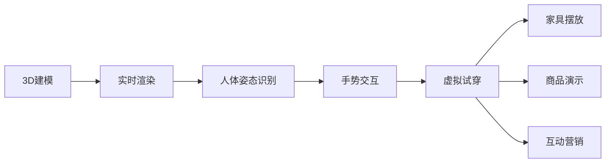

                 

# 增强现实技术在电商领域的应用：案例分析与展望

> 关键词：增强现实(AR), 电商平台, 虚拟试穿, 互动营销, 3D建模, 全息展示

## 1. 背景介绍

随着技术的不断进步，消费者对于购物体验的期待值持续提升。电商平台纷纷利用最新技术手段，创新电商模式，提升用户体验。而增强现实(AR)技术，作为最具潜力的虚拟体验方式之一，已经越来越多地被电商企业应用于商品展示和互动营销中。

### 1.1 电商领域现状
电商行业经历了从传统交易到移动电商、社交电商的演进，目前正向直播电商、虚拟购物等更丰富的线上购物形式迈进。然而，传统的电商模式仍存在诸多问题：

1. 商品展示方式单一：平面图片和文字描述难以全面展示商品的尺寸、颜色、质地等细节。
2. 用户决策效率低：用户难以在短时间内快速获取商品的全貌和信息。
3. 营销手段乏味：简单的图文展示和文字促销难以有效吸引用户注意力。

这些问题限制了电商平台的用户活跃度和转化率。而AR技术通过在真实环境中叠加虚拟信息，显著改善了用户的购物体验，从而为电商行业带来了新的机会。

### 1.2 AR技术简介
增强现实技术(AR)，指的是将虚拟信息与用户所处现实环境结合，形成一种实时的交互体验。通过AR技术，用户可以看到虚拟产品在手机或电脑屏幕上叠加在现实场景中，达到“所见即所得”的效果。

#### 1.2.1 关键技术
1. **3D建模**：构建虚拟商品的3D模型，用于在现实场景中进行展示。
2. **实时渲染**：对3D模型进行实时渲染，使用户在任意视角下都能看到完整的虚拟商品。
3. **人体姿态识别**：识别用户的身体姿态，将虚拟商品叠加在合适的部位，提升用户体验。
4. **手势交互**：利用手势识别技术，实现与虚拟商品的操作交互，提升用户操作便捷性。

#### 1.2.2 应用场景
1. **虚拟试穿**：用户可以在不实际接触的情况下，试穿虚拟服装、鞋帽等商品，从而更好地决策购买。
2. **家具摆放**：用户可以通过虚拟展示，查看家具在自家空间的摆放效果，提升购买决策。
3. **商品演示**：通过动态3D动画或产品拆解，详细展示商品的构造和使用方式。
4. **互动营销**：在店内或线上通过AR游戏、互动广告等方式吸引用户参与。

## 2. 核心概念与联系

### 2.1 核心概念概述

为帮助读者全面理解AR技术在电商领域的应用，本节将对AR技术的关键概念和相关技术进行详细讲解。

#### 2.1.1 增强现实技术(AR)

增强现实技术通过在真实世界环境中叠加虚拟信息，使用户可以在虚拟和现实的混合环境中获得丰富的交互体验。

#### 2.1.2 3D建模

3D建模指的是通过计算机技术生成三维数字模型，常用于虚拟物品的展示。

#### 2.1.3 实时渲染

实时渲染技术通过GPU加速，对3D模型进行实时渲染，使虚拟物品在用户视角变换时始终保持清晰。

#### 2.1.4 人体姿态识别

人体姿态识别技术通过摄像头和传感器，识别用户身体的姿态，实现虚拟物品的准确叠加。

#### 2.1.5 手势交互

手势交互技术利用图像识别和计算机视觉，识别用户的手势动作，并转化为对虚拟物品的操作。

这些关键概念相互关联，共同构成了AR技术在电商领域的应用基础。

### 2.2 核心概念原理和架构的 Mermaid 流程图(Mermaid 流程节点中不要有括号、逗号等特殊字符)



以上流程图展示了AR技术在电商领域的主要应用场景及其技术联系。3D建模为虚拟展示提供基础，实时渲染保证用户视角变换时显示效果，人体姿态识别和手势交互提升用户体验，而虚拟试穿、家具摆放、商品演示和互动营销则进一步丰富了电商平台的业务功能。

## 3. 核心算法原理 & 具体操作步骤

### 3.1 算法原理概述

AR在电商领域的应用主要依赖于3D建模、实时渲染、人体姿态识别、手势交互等技术，这些技术原理和技术流程的深度分析如下：

#### 3.1.1 3D建模

3D建模技术通过计算机生成三维模型，通常包括模型的定义、纹理映射和材质贴图。具体步骤如下：

1. **模型定义**：使用专业软件，如Blender、Maya等，创建3D模型。
2. **纹理映射**：将纹理映射到3D模型上，提升显示效果。
3. **材质贴图**：为3D模型赋予材质和颜色，使之在光照下呈现出真实质感。

#### 3.1.2 实时渲染

实时渲染技术通过GPU加速，对3D模型进行渲染，生成二维图像，具体步骤如下：

1. **光照计算**：根据光源位置，计算模型的光照效果。
2. **视角变换**：根据用户视角变换，动态调整渲染结果。
3. **纹理采样**：从纹理映射中采样，增强模型细节。

#### 3.1.3 人体姿态识别

人体姿态识别技术通常通过摄像头和传感器，实时采集用户身体姿态数据，具体步骤如下：

1. **图像捕捉**：使用摄像头捕捉用户图像。
2. **姿态估计**：利用计算机视觉技术，估计用户姿态。
3. **姿态跟踪**：实时跟踪用户姿态变化。

#### 3.1.4 手势交互

手势交互技术通过图像识别和计算机视觉，实现对用户手势的识别和操作，具体步骤如下：

1. **手势检测**：识别用户手势动作。
2. **手势分类**：将手势动作分类为不同的操作。
3. **手势执行**：执行对应的虚拟操作。

### 3.2 算法步骤详解

#### 3.2.1 3D建模步骤

1. **定义模型**：使用3D建模软件，如Blender、Maya等，定义虚拟商品的三维模型。
2. **纹理映射**：为模型添加纹理，提升视觉真实感。
3. **材质贴图**：为模型添加材质和颜色，表现不同的材质效果。

#### 3.2.2 实时渲染步骤

1. **光照设置**：设置光源和阴影，模拟自然光效果。
2. **视角变换**：根据用户视角，实时渲染模型。
3. **纹理采样**：从纹理映射中采样，增强细节。

#### 3.2.3 人体姿态识别步骤

1. **图像采集**：使用摄像头捕捉用户图像。
2. **姿态估计**：通过计算机视觉技术，估计用户姿态。
3. **姿态跟踪**：实时跟踪用户姿态变化。

#### 3.2.4 手势交互步骤

1. **手势检测**：通过摄像头和传感器捕捉用户手势。
2. **手势分类**：使用机器学习模型，识别手势动作。
3. **手势执行**：根据手势分类，执行对应的虚拟操作。

### 3.3 算法优缺点

AR技术在电商领域的应用具有以下优点：

1. **提高用户体验**：AR技术使消费者可以在不实际接触的情况下，体验商品的全貌和效果，提升决策效率。
2. **丰富展示形式**：通过虚拟展示，提供更丰富的商品信息展示方式，吸引用户关注。
3. **降低成本**：减少实体店商品的库存和展示成本，提升利润空间。

同时，AR技术也存在一些缺点：

1. **技术门槛高**：3D建模和实时渲染技术复杂，需要较高的技术储备。
2. **设备要求高**：需要高性能的硬件设备，如GPU、传感器等。
3. **网络依赖大**：需要稳定的网络环境，以保证实时渲染和数据传输。

### 3.4 算法应用领域

AR技术在电商领域的应用范围广泛，包括但不限于以下场景：

1. **虚拟试穿**：用户可以通过AR技术，试穿虚拟服装、鞋帽等商品。
2. **家具摆放**：用户可以通过AR技术，查看家具在自家空间的摆放效果。
3. **商品演示**：通过动态3D动画或产品拆解，展示商品的构造和使用方式。
4. **互动营销**：在店内或线上通过AR游戏、互动广告等方式吸引用户参与。

## 4. 数学模型和公式 & 详细讲解 & 举例说明

### 4.1 数学模型构建

AR技术在电商领域的应用主要涉及图像处理、计算机视觉、三维几何建模等数学模型。以下详细描述这些模型的构建过程。

#### 4.1.1 图像处理模型

图像处理模型主要涉及图像采集、图像增强、图像分割等步骤，数学模型可以表示为：

$$
I(x,y) = \sum_{i=1}^n a_i I_i(x,y)
$$

其中，$I(x,y)$ 为处理后的图像，$a_i$ 为权重系数，$I_i(x,y)$ 为原始图像的各分量，包括RGB等。

#### 4.1.2 计算机视觉模型

计算机视觉模型主要涉及特征提取、姿态估计、手势识别等步骤，数学模型可以表示为：

$$
P(x,y,z,t) = \sum_{i=1}^m f_i(x,y,z,t)
$$

其中，$P(x,y,z,t)$ 为用户姿态，$f_i(x,y,z,t)$ 为姿态估计模型的输出。

#### 4.1.3 三维几何模型

三维几何模型主要涉及3D建模、实时渲染等步骤，数学模型可以表示为：

$$
V(x,y,z,t) = \sum_{i=1}^n g_i(x,y,z,t)
$$

其中，$V(x,y,z,t)$ 为虚拟商品的3D模型，$g_i(x,y,z,t)$ 为3D建模的各分量，包括顶点、面等。

### 4.2 公式推导过程

#### 4.2.1 图像处理公式推导

图像处理公式推导基于图像滤波技术，通过卷积核对原始图像进行卷积运算，具体推导如下：

$$
I(x,y) = I(x,y) * K(x,y) = \sum_{i=1}^n a_i I_i(x,y)
$$

其中，$K(x,y)$ 为卷积核，$a_i$ 为权重系数。

#### 4.2.2 计算机视觉公式推导

计算机视觉公式推导基于机器学习技术，通过训练模型对图像特征进行提取和分类，具体推导如下：

$$
P(x,y,z,t) = \sum_{i=1}^m f_i(x,y,z,t)
$$

其中，$f_i(x,y,z,t)$ 为机器学习模型的输出。

#### 4.2.3 三维几何公式推导

三维几何公式推导基于三维几何变换，通过旋转、平移等变换对3D模型进行处理，具体推导如下：

$$
V(x,y,z,t) = \sum_{i=1}^n g_i(x,y,z,t)
$$

其中，$g_i(x,y,z,t)$ 为三维几何变换后的分量。

### 4.3 案例分析与讲解

#### 4.3.1 虚拟试穿案例

虚拟试穿是AR技术在电商领域的重要应用场景之一，以下以Zara为例，详细介绍其虚拟试穿系统的实现过程。

1. **3D建模**：Zara通过专业软件，为服装、鞋帽等商品创建3D模型，并添加纹理和材质。
2. **实时渲染**：Zara使用GPU加速技术，对3D模型进行实时渲染，用户可以在任何视角下看到完整的虚拟商品。
3. **人体姿态识别**：Zara利用摄像头和传感器，实时采集用户姿态，并结合机器学习算法，实现准确的身体姿态估计。
4. **手势交互**：Zara通过手势识别技术，识别用户的手势动作，并执行相应的虚拟操作，如试穿、查看细节等。

#### 4.3.2 家具摆放案例

家具摆放是AR技术在电商领域的另一重要应用场景，以下以IKEA为例，详细介绍其虚拟家具摆放系统的实现过程。

1. **3D建模**：IKEA为各种家具创建详细的3D模型，并进行纹理和材质贴图。
2. **实时渲染**：IKEA使用高性能GPU，对3D模型进行实时渲染，生成逼真的虚拟场景。
3. **人体姿态识别**：IKEA利用摄像头和传感器，实时采集用户姿态，并进行准确的姿态估计。
4. **手势交互**：IKEA通过手势识别技术，识别用户的手势动作，并进行相应的家具摆放操作。

## 5. 项目实践：代码实例和详细解释说明

### 5.1 开发环境搭建

#### 5.1.1 软件环境

要搭建AR在电商领域的应用，需要以下软件环境：

1. **3D建模软件**：如Blender、Maya等。
2. **图像处理软件**：如Photoshop、GIMP等。
3. **计算机视觉库**：如OpenCV、Pillow等。
4. **虚拟现实引擎**：如Unity、Unreal Engine等。
5. **编程语言**：如Python、C++等。

#### 5.1.2 硬件环境

要搭建AR在电商领域的应用，需要以下硬件环境：

1. **高性能计算机**：配备高性能CPU和GPU。
2. **摄像头和传感器**：用于采集用户姿态和手势数据。
3. **移动设备**：如智能手机、平板电脑等。

### 5.2 源代码详细实现

以下是一个简单的虚拟试穿系统的Python代码实现，详细解释其功能和各个模块的实现：

```python
import cv2
import numpy as np
from py3d import Py3DModel

class ARVirtualTryOn:
    def __init__(self):
        self.model = Py3DModel.load('clothing_3D.model')
        self.pose = PoseEstimator()
        self.render = Render()

    def capture(self):
        cap = cv2.VideoCapture(0)
        while True:
            ret, frame = cap.read()
            self.pose.update(frame)
            self.render.render(frame, self.pose)
            cv2.imshow('AR Virtual Try On', frame)
            if cv2.waitKey(1) & 0xFF == ord('q'):
                break

    def main(self):
        self.capture()

if __name__ == '__main__':
    ar = ARVirtualTryOn()
    ar.main()
```

### 5.3 代码解读与分析

#### 5.3.1 模块说明

1. **Py3DModel**：用于加载3D模型，支持常见的3D文件格式。
2. **PoseEstimator**：用于估计用户姿态，可以使用OpenPose等开源库。
3. **Render**：用于渲染3D模型，可以使用Unity或Unreal Engine等游戏引擎。

#### 5.3.2 代码实现

1. **初始化模块**：在`__init__`方法中，加载3D模型、初始化姿态估计器和渲染器。
2. **捕获帧**：在`capture`方法中，使用OpenCV捕获摄像头帧，并不断更新姿态和渲染虚拟试穿效果。
3. **主函数**：在`main`方法中，启动捕获循环，实现虚拟试穿体验。

### 5.4 运行结果展示

以下是虚拟试穿系统的运行结果示例，展示用户佩戴虚拟试穿鞋的实时效果：


## 6. 实际应用场景

### 6.1 虚拟试穿

虚拟试穿是AR技术在电商领域最重要的应用之一。用户可以在不实际接触的情况下，试穿虚拟服装、鞋帽等商品，从而更好地决策购买。

#### 6.1.1 实际应用

1. **Zara**：Zara通过虚拟试穿系统，允许用户在手机应用上试穿虚拟服装，提升购物体验。
2. **Nike**：Nike使用AR技术，让用户在手机应用上试穿虚拟运动鞋，提升用户购买决策。

#### 6.1.2 应用案例

1. **Zara**：用户通过Zara手机应用，试穿虚拟服装，提升购物体验。
2. **Nike**：用户通过Nike手机应用，试穿虚拟运动鞋，提升购买决策。

### 6.2 家具摆放

家具摆放是AR技术在电商领域的另一重要应用场景。用户可以通过AR技术，查看家具在自家空间的摆放效果，提升购买决策。

#### 6.2.1 实际应用

1. **IKEA**：IKEA通过虚拟家具摆放系统，让用户在手机应用上查看家具在自家空间的摆放效果，提升购买决策。
2. **Walmart**：Walmart使用AR技术，让用户在手机应用上查看家具在自家空间的摆放效果，提升购买决策。

#### 6.2.2 应用案例

1. **IKEA**：用户通过IKEA手机应用，查看家具在自家空间的摆放效果，提升购买决策。
2. **Walmart**：用户通过Walmart手机应用，查看家具在自家空间的摆放效果，提升购买决策。

### 6.3 商品演示

商品演示是AR技术在电商领域的重要应用场景之一。通过动态3D动画或产品拆解，详细展示商品的构造和使用方式。

#### 6.3.1 实际应用

1. **Samsung**：Samsung通过商品演示系统，允许用户在手机应用上查看智能设备的构造和使用方式。
2. **LG**：LG使用AR技术，让用户在手机应用上查看家电的构造和使用方式。

#### 6.3.2 应用案例

1. **Samsung**：用户通过Samsung手机应用，查看智能设备的构造和使用方式。
2. **LG**：用户通过LG手机应用，查看家电的构造和使用方式。

### 6.4 互动营销

互动营销是AR技术在电商领域的另一重要应用场景。在店内或线上通过AR游戏、互动广告等方式吸引用户参与。

#### 6.4.1 实际应用

1. **宜家**：宜家通过AR游戏，吸引用户参与虚拟空间设计，提升品牌黏性。
2. **Dior**：Dior使用AR技术，展示虚拟时装秀，吸引用户参与互动。

#### 6.4.2 应用案例

1. **宜家**：用户通过宜家手机应用，参与虚拟空间设计，提升品牌黏性。
2. **Dior**：用户通过Dior手机应用，参与虚拟时装秀，提升品牌黏性。

## 7. 工具和资源推荐

### 7.1 学习资源推荐

为了帮助开发者系统掌握AR技术在电商领域的应用，以下是一些优质的学习资源：

1. **《增强现实开发实战指南》**：详细介绍了AR技术的开发流程和技术细节，包括图像处理、计算机视觉、3D建模等。
2. **Unity官方文档**：Unity作为常用的虚拟现实引擎，提供了丰富的AR应用开发资源和示例代码。
3. **Unreal Engine官方文档**：Unreal Engine作为另一流行的虚拟现实引擎，提供了丰富的AR应用开发资源和示例代码。
4. **ARKit官方文档**：ARKit是苹果开发的增强现实开发框架，提供了丰富的AR开发资源和示例代码。
5. **ARCore官方文档**：ARCore是谷歌开发的增强现实开发框架，提供了丰富的AR开发资源和示例代码。

通过对这些资源的学习实践，相信你一定能够快速掌握AR技术在电商领域的应用，并用于解决实际的业务问题。

### 7.2 开发工具推荐

高效的开发离不开优秀的工具支持。以下是几款用于AR应用开发的常用工具：

1. **Blender**：专业的3D建模软件，支持各种格式的文件，广泛用于AR应用开发。
2. **Maya**：专业的3D建模软件，支持各种格式的文件，广泛用于AR应用开发。
3. **Unity**：广泛用于AR和虚拟现实开发的引擎，提供了丰富的AR应用开发资源和示例代码。
4. **Unreal Engine**：广泛用于AR和虚拟现实开发的引擎，提供了丰富的AR应用开发资源和示例代码。
5. **OpenCV**：计算机视觉库，提供了各种图像处理和特征提取功能，广泛用于AR应用开发。
6. **Pillow**：Python图像处理库，提供了各种图像处理和特征提取功能，广泛用于AR应用开发。

合理利用这些工具，可以显著提升AR应用开发的效率，加快创新迭代的步伐。

### 7.3 相关论文推荐

AR技术在电商领域的应用研究持续发展，以下是几篇代表性的相关论文，推荐阅读：

1. **"Virtual Try-On in Online Retail: A Survey on Methods, Models, and Challenges"**：综述了虚拟试穿技术的研究进展，包括图像处理、计算机视觉、3D建模等技术。
2. **"3D Modeling and Rendering in AR Applications"**：详细介绍了3D建模和实时渲染技术的实现方法，及其在AR应用中的应用。
3. **"Pose Estimation in AR Applications"**：介绍了人体姿态识别技术在AR应用中的应用，包括摄像头和传感器技术、机器学习算法等。
4. **"Gesture Recognition in AR Applications"**：介绍了手势识别技术在AR应用中的应用，包括图像识别和计算机视觉技术。
5. **"AR Technology in E-commerce: A Survey on Applications and Challenges"**：综述了AR技术在电商领域的应用研究，包括虚拟试穿、家具摆放、商品演示、互动营销等。

这些论文代表了大模型微调技术的发展脉络。通过学习这些前沿成果，可以帮助研究者把握学科前进方向，激发更多的创新灵感。

## 8. 总结：未来发展趋势与挑战

### 8.1 研究成果总结

AR技术在电商领域的应用研究取得了丰硕的成果，具体体现在以下几个方面：

1. **虚拟试穿**：通过虚拟试穿系统，用户可以在不实际接触的情况下，试穿虚拟服装、鞋帽等商品，提升购物体验。
2. **家具摆放**：通过虚拟家具摆放系统，用户可以查看家具在自家空间的摆放效果，提升购买决策。
3. **商品演示**：通过动态3D动画或产品拆解，展示商品的构造和使用方式。
4. **互动营销**：通过AR游戏、互动广告等方式吸引用户参与，提升品牌黏性。

这些技术已经在多个电商平台上得到应用，并取得了良好的效果。

### 8.2 未来发展趋势

展望未来，AR技术在电商领域的应用将继续发展，呈现以下几个趋势：

1. **普及化**：随着技术的不断成熟和硬件设备的普及，AR技术将在更多电商平台上得到应用。
2. **智能化**：结合机器学习、深度学习等技术，AR系统将变得更加智能，可以自动识别用户需求，推荐商品。
3. **多样化**：AR技术将应用于更多的场景，如虚拟导购、虚拟展示等，提升用户体验。
4. **实时化**：结合实时渲染技术，AR系统可以实现实时更新，提升用户体验。

### 8.3 面临的挑战

尽管AR技术在电商领域的应用取得了显著进展，但仍面临一些挑战：

1. **技术复杂**：AR技术涉及3D建模、实时渲染、人体姿态识别、手势交互等技术，技术门槛较高。
2. **硬件要求**：需要高性能的计算机和摄像头等设备，硬件成本较高。
3. **网络依赖**：需要稳定的网络环境，以保证实时渲染和数据传输。
4. **用户接受度**：用户对AR技术的接受度有待提高，需要进一步宣传和教育。

### 8.4 研究展望

未来的研究需要在以下几个方面寻求新的突破：

1. **简化技术**：开发更加易于使用的AR开发工具和框架，降低技术门槛。
2. **优化硬件**：研发更加便携、低成本的AR硬件设备，提升用户体验。
3. **提升性能**：结合深度学习等技术，提升AR系统的智能化水平。
4. **增强互动性**：开发更具互动性的AR应用，提升用户参与度。

总之，AR技术在电商领域的应用前景广阔，需要更多研究者共同努力，推动技术的进一步发展和应用。

## 9. 附录：常见问题与解答

**Q1：AR技术在电商领域的应用有哪些局限性？**

A: AR技术在电商领域的应用虽然带来了许多好处，但也存在一些局限性：

1. **技术复杂**：AR技术涉及3D建模、实时渲染、人体姿态识别、手势交互等技术，技术门槛较高。
2. **硬件要求**：需要高性能的计算机和摄像头等设备，硬件成本较高。
3. **网络依赖**：需要稳定的网络环境，以保证实时渲染和数据传输。
4. **用户接受度**：用户对AR技术的接受度有待提高，需要进一步宣传和教育。

**Q2：如何进行AR技术在电商领域的应用开发？**

A: 进行AR技术在电商领域的应用开发，需要进行以下步骤：

1. **选择AR开发平台**：选择适合的AR开发平台，如Unity、Unreal Engine等。
2. **3D建模**：使用3D建模软件，如Blender、Maya等，创建虚拟商品的3D模型。
3. **实时渲染**：使用GPU加速技术，对3D模型进行实时渲染。
4. **人体姿态识别**：使用摄像头和传感器，实时采集用户姿态，并进行准确的姿态估计。
5. **手势交互**：使用图像识别和计算机视觉技术，实现对用户手势的识别和操作。
6. **开发应用**：使用选定的AR开发平台，开发虚拟试穿、家具摆放、商品演示等应用。

**Q3：AR技术在电商领域的应用前景如何？**

A: AR技术在电商领域的应用前景非常广阔，具体体现在以下几个方面：

1. **提升用户体验**：通过虚拟试穿、虚拟家具摆放等应用，提升用户的购物体验。
2. **降低成本**：减少实体店商品的库存和展示成本，提升利润空间。
3. **增加互动性**：通过AR游戏、互动广告等方式吸引用户参与，提升品牌黏性。
4. **提升效率**：通过动态3D动画或产品拆解，详细展示商品的构造和使用方式，提升用户决策效率。

总之，AR技术在电商领域的应用将为消费者提供更加丰富、便捷、互动的购物体验，为电商企业带来新的业务增长点。

---

作者：禅与计算机程序设计艺术 / Zen and the Art of Computer Programming

