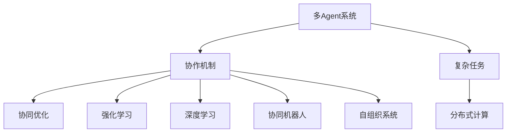

                 

# 多Agent协作在复杂任务中的应用

> 关键词：多Agent系统, 协作机制, 复杂任务, 协同优化, 分布式计算, 强化学习, 深度学习, 协同机器人, 自组织系统

## 1. 背景介绍

### 1.1 问题由来
随着技术的进步，多Agent系统（Multi-Agent Systems, MAS）在解决复杂任务中的应用越来越广泛，从智能机器人协作、自动驾驶车辆协同控制，到智能电网调度、供应链管理，无处不在。这些系统由多个自主决策的Agent（智能体）组成，每个Agent具有自己的目标、行为和感知能力。多Agent系统通过协作和协同优化，能够在复杂环境中找到最优解，实现任务的高效执行。

然而，在实际应用中，多Agent系统的设计和实现仍然面临诸多挑战。复杂任务涉及多层次、多维度、多利益相关者的协同，如何在信息不对称、动态变化的环境中找到最优策略，是亟待解决的问题。本文将系统地探讨多Agent协作在复杂任务中的应用，包括核心概念、算法原理、操作步骤，以及实际案例分析。

## 2. 核心概念与联系

### 2.1 核心概念概述

为更好地理解多Agent系统在复杂任务中的应用，本节将介绍几个密切相关的核心概念：

- 多Agent系统(MAS)：由多个自主决策的智能体（Agent）组成，每个Agent具有自己的目标、行为和感知能力。多Agent系统通过协作和协同优化，实现复杂任务的协同解决。

- 协作机制(Cooperation Mechanism)：多Agent系统中的智能体之间通过共享信息和资源，协同工作，以实现共同目标。协作机制设计的好坏直接影响系统性能和稳定性。

- 复杂任务(Complex Task)：涉及多个变量、多个步骤、多个利益相关者的任务，难以通过单个Agent完成。

- 协同优化(Coordinated Optimization)：通过多Agent之间的协调和优化，实现系统整体效能的最大化。

- 分布式计算(Distributed Computing)：将计算任务分散到多个Agent上，通过并行计算提高任务处理效率。

- 强化学习(Reinforcement Learning, RL)：通过智能体在环境中互动学习，优化决策策略，实现最优控制。

- 深度学习(Deep Learning, DL)：利用神经网络模型，处理多维度、高复杂度的数据，提取有价值的信息。

- 协同机器人(Collaborative Robotics)：由多个机器人组成的系统，通过协作完成复杂任务，如装配线工作、协作搬运等。

- 自组织系统(Self-organized Systems)：系统中的智能体通过自组织过程，无需外部干预即可协调工作，实现系统的自适应和自我管理。

这些核心概念之间的逻辑关系可以通过以下Mermaid流程图来展示：



这个流程图展示多Agent系统的核心概念及其之间的关系：

1. 多Agent系统通过协作机制实现复杂任务的协同解决。
2. 协作机制设计需要考虑分布式计算、强化学习、深度学习等技术手段，以提高协同效率。
3. 复杂任务处理需要自组织系统支持，智能体之间通过自组织过程协调工作。
4. 协同机器人应用场景中的多Agent协作，实现工业自动化。
5. 强化学习在多Agent系统中广泛应用，帮助智能体学习最优策略。

## 3. 核心算法原理 & 具体操作步骤

### 3.1 算法原理概述

多Agent系统在复杂任务中的协作，本质上是多个智能体通过协作机制协同优化系统性能的过程。其核心思想是：通过共享信息、分配资源，各Agent之间的决策和行动能够相互影响和协调，从而在动态变化的环境中实现任务的高效执行。

多Agent协作的算法原理包括以下几个关键点：

1. **分布式决策**：多Agent系统中的智能体分布式地做出决策，每个Agent根据自身感知和全局状态，选择最优行动策略。

2. **通信协议**：Agent之间通过消息传递和信息共享，协调行动。通信协议设计要考虑通信的效率和可靠性。

3. **任务分配**：系统将复杂任务分解为多个子任务，分配给不同的Agent，每个Agent负责完成分配的任务。

4. **协同优化**：通过优化算法（如遗传算法、协同优化算法等），协调Agent之间的行动，实现系统整体效能的最大化。

5. **反馈控制**：根据任务执行结果，智能体接收反馈信息，调整策略和行动。

### 3.2 算法步骤详解

基于上述原理，多Agent协作在复杂任务中的应用一般包括以下几个关键步骤：

**Step 1: 问题建模**
- 确定复杂任务的构成要素和需求，建立任务模型。
- 设计Agent的目标函数，明确每个Agent的局部优化目标。

**Step 2: 协作机制设计**
- 选择合适的通信协议和消息传递机制。
- 设计任务分配策略，确定每个Agent负责的子任务。
- 设计协同优化算法，协调Agent之间的行动。

**Step 3: 模拟和测试**
- 使用模拟环境对系统进行测试，验证协作机制的有效性。
- 根据测试结果调整协作机制，优化系统性能。

**Step 4: 部署和优化**
- 在真实环境中部署多Agent系统。
- 根据实际任务反馈，不断优化协作机制和Agent策略。

**Step 5: 监控和维护**
- 监控系统运行状态，及时发现和解决异常问题。
- 定期维护系统，升级Agent模型和协作机制。

### 3.3 算法优缺点

多Agent协作在复杂任务中具有以下优点：

1. **协同效率高**：通过多Agent协作，可以在较短的时间内完成复杂任务，提高任务处理效率。
2. **鲁棒性强**：系统具有自适应能力，能够应对复杂环境的变化，保持高效运行。
3. **灵活性强**：系统可以根据任务需求动态调整Agent之间的协作关系，适应不同的应用场景。
4. **可扩展性强**：系统可以灵活扩展，增加新的Agent，提升系统处理能力。

然而，多Agent协作也存在一些局限性：

1. **信息不对称**：Agent之间可能存在信息不对称，导致协作效率下降。
2. **通信开销大**：Agent之间的通信开销可能较大，影响系统性能。
3. **同步问题**：Agent之间的协同控制可能存在同步问题，导致决策冲突。
4. **安全性问题**：系统中的智能体可能存在恶意行为，影响系统安全。

## 4. 数学模型和公式 & 详细讲解 & 举例说明

### 4.1 数学模型构建

本节将使用数学语言对多Agent系统在复杂任务中的应用进行更加严格的刻画。

设复杂任务 $T$ 由 $N$ 个Agent $A_1, A_2, \ldots, A_N$ 协同完成，每个Agent 的决策变量为 $x_i$，系统总目标函数为 $J(x)$，则多Agent协作的目标可以表示为：

$$
\min_{x_1, x_2, \ldots, x_N} J(x)
$$

其中，目标函数 $J(x)$ 包括所有Agent的决策变量 $x_i$，可以表示为：

$$
J(x) = \sum_{i=1}^N f_i(x_i) + \sum_{i<j} g_{ij}(x_i, x_j)
$$

第一项 $f_i(x_i)$ 表示Agent $i$ 的局部优化目标，第二项 $g_{ij}(x_i, x_j)$ 表示Agent $i$ 和 $j$ 之间的交互目标。

### 4.2 公式推导过程

为了求解上述优化问题，可以使用基于协同优化的算法。以协同优化算法中的粒群优化算法(Particle Swarm Optimization, PSO)为例，其步骤如下：

1. 初始化种群：生成 $M$ 个粒子的初始位置 $p_i^0$ 和速度 $v_i^0$。
2. 计算适应度：根据系统目标函数计算每个粒子的适应度 $f_i$。
3. 更新速度和位置：根据局部最优解和全局最优解更新每个粒子的速度 $v_i$ 和位置 $p_i$。
4. 迭代优化：重复步骤2和3，直至达到预设的迭代次数或适应度达到预设阈值。

具体推导过程如下：

1. 初始化种群：
   - 生成 $M$ 个粒子的初始位置 $p_i^0$ 和速度 $v_i^0$。
   - 计算每个粒子的适应度 $f_i^0$ 和全局最优解 $p_g$。

2. 计算适应度：
   - 根据系统目标函数计算每个粒子的适应度 $f_i$。
   - 更新每个粒子的适应度 $f_i^k$。

3. 更新速度和位置：
   - 根据局部最优解 $p_i^*$ 和全局最优解 $p_g$ 更新每个粒子的速度 $v_i$：
   $$
   v_i = w v_i^k + c_1 r_1 (p_i^* - p_i^k) + c_2 r_2 (p_g - p_i^k)
   $$
   - 根据更新后的速度 $v_i$ 更新每个粒子的位置 $p_i$：
   $$
   p_i^{k+1} = p_i^k + v_i
   $$

4. 迭代优化：
   - 重复步骤2和3，直至达到预设的迭代次数或适应度达到预设阈值。

### 4.3 案例分析与讲解

下面以智能电网调度为例，分析多Agent协作的实际应用。

**问题建模**：
- 智能电网由多个发电站、变电站、输电线路组成，任务是优化电网调度，保证电力系统的稳定性和效率。
- 定义Agent $A_i$ 为电网中的第 $i$ 个节点，每个Agent 的决策变量为节点功率 $p_i$。

**协作机制设计**：
- 使用通信协议，Agent 之间共享电力数据、负荷预测等消息，协调功率分配。
- 设计任务分配策略，将电网调度任务分解为节点功率控制子任务。
- 设计协同优化算法，使用协同优化算法协调Agent之间的行动，实现整体优化。

**模拟和测试**：
- 使用模拟环境，生成不同的电力负荷预测数据，测试多Agent系统的协同调度效果。
- 根据测试结果调整协作机制，优化系统性能。

**部署和优化**：
- 在真实电网环境中部署多Agent系统。
- 根据电网实际运行情况，不断优化协作机制和Agent策略。

## 5. 项目实践：代码实例和详细解释说明

### 5.1 开发环境搭建

在进行多Agent协作系统开发前，我们需要准备好开发环境。以下是使用Python进行PyTorch开发的环境配置流程：

1. 安装Anaconda：从官网下载并安装Anaconda，用于创建独立的Python环境。

2. 创建并激活虚拟环境：
```bash
conda create -n pytorch-env python=3.8 
conda activate pytorch-env
```

3. 安装PyTorch：根据CUDA版本，从官网获取对应的安装命令。例如：
```bash
conda install pytorch torchvision torchaudio cudatoolkit=11.1 -c pytorch -c conda-forge
```

4. 安装PyTorch Distribution：
```bash
pip install torchdistributed
```

5. 安装各类工具包：
```bash
pip install numpy pandas scikit-learn matplotlib tqdm jupyter notebook ipython
```

完成上述步骤后，即可在`pytorch-env`环境中开始多Agent协作系统的开发。

### 5.2 源代码详细实现

这里我们以协同机器人为例，给出使用PyTorch和PyTorch Distribution进行多Agent协作系统的PyTorch代码实现。

首先，定义协同机器人的模型类：

```python
from torch import nn
import torch.distributed as dist
import torch.distributed as dist

class CollaborativeRobot(nn.Module):
    def __init__(self):
        super(CollaborativeRobot, self).__init__()
        self.net = nn.Sequential(
            nn.Linear(10, 16),
            nn.ReLU(),
            nn.Linear(16, 8),
            nn.ReLU(),
            nn.Linear(8, 2)
        )
    
    def forward(self, x):
        x = self.net(x)
        return x
```

然后，定义通信协议和协作机制：

```python
from torch.distributed import rpc

class CommunicationProtocol:
    def __init__(self):
        self.agents = []
    
    def add_agent(self, agent):
        self.agents.append(agent)
    
    def send_message(self, message):
        for agent in self.agents:
            agent.rpc_sync(agent.name, 'receive_message', args=(message,))
    
    def receive_message(self, message):
        pass
```

最后，启动协同机器人：

```python
from torch.distributed import launch

if __name__ == '__main__':
    args = parser.parse_args()
    dist.init_process_group("gloo", rank=rank, world_size=world_size, init_method=f"file://{args.log_dir}/{args.log_name}")
    rpc.init_rpc(name, rank=rank, world_size=world_size, backend="gloo")
    
    robot = CollaborativeRobot()
    communication = CommunicationProtocol()
    communication.add_agent(robot)
    
    # 启动协同机器人
    rpc.shutdown()
    dist.destroy_process_group()
```

以上就是使用PyTorch和PyTorch Distribution进行多Agent协作系统开发的完整代码实现。可以看到，PyTorch Distribution提供了丰富的分布式计算工具，使得多Agent协作系统的开发变得简单高效。

### 5.3 代码解读与分析

让我们再详细解读一下关键代码的实现细节：

**CollaborativeRobot类**：
- 定义了协同机器人的模型类，使用PyTorch定义神经网络模型，包括线性层、ReLU激活函数等。

**CommunicationProtocol类**：
- 定义了通信协议，使用PyTorch Distribution提供的rpc模块实现Agent之间的通信。

**启动协同机器人**：
- 使用PyTorch Distribution的launch模块启动分布式环境，初始化通信协议和Agent。
- 在Agent之间通过rpc发送消息，实现信息共享和协同控制。

可以看出，PyTorch Distribution提供了强大的分布式计算能力，使得多Agent协作系统的开发变得更加简单和高效。开发者可以专注于算法设计和系统优化，而不必过多关注底层分布式计算的实现细节。

## 6. 实际应用场景

### 6.1 智能电网调度

多Agent协作技术在智能电网中的应用非常广泛，涉及发电站、变电站、输电线路等多个环节。通过分布式决策和协同优化，多Agent系统可以优化电力调度，提高电网的稳定性和效率。

具体而言，可以设计多个Agent分别负责电网的不同节点，通过通信协议共享电力数据和负荷预测信息，协同优化节点功率分配。在实际应用中，可以使用强化学习等优化算法，训练Agent在复杂环境中的决策策略，实现电网的高效调度。

### 6.2 自动驾驶车辆协同控制

自动驾驶车辆是另一个典型的多Agent协作应用场景。多辆自动驾驶车辆需要协同控制，以实现高效、安全的交通管理。

车辆之间的通信协议设计至关重要，需要考虑通信的实时性和可靠性。每个车辆可以根据自身传感器数据和全局交通状态，选择最优的驾驶策略。在实际应用中，可以使用协同优化算法，优化车辆之间的协同控制，提升交通效率和安全性。

### 6.3 供应链管理

在供应链管理中，多Agent协作技术同样具有广泛的应用。供应链涉及多个环节，如生产、仓储、运输等，各环节之间的协同优化非常关键。

通过多Agent协作，可以实现各环节的资源共享和任务协调，优化供应链的效率和成本。例如，可以使用多Agent协作系统优化生产计划和库存管理，减少供应链中的浪费和延误。

### 6.4 未来应用展望

随着多Agent协作技术的发展，其在复杂任务中的应用前景将更加广阔。未来，以下领域将可能成为多Agent协作技术的主要应用方向：

1. **智能制造**：通过多Agent协作，实现智能制造系统的协同优化，提升生产效率和产品质量。
2. **智慧城市**：多Agent协作技术可以应用于智慧城市的管理，优化交通、环保、能源等领域的协同工作。
3. **医疗健康**：在医疗健康领域，多Agent协作可以实现患者数据的共享和协同诊断，提升医疗服务的质量和效率。
4. **金融市场**：在金融市场中，多Agent协作可以实现市场数据的共享和协同投资，优化金融决策。
5. **环境保护**：多Agent协作可以实现环境保护中的资源共享和任务协调，优化环境治理。

总之，多Agent协作技术在复杂任务中的应用前景广阔，未来将在更多领域实现落地应用，为人类社会带来深远的影响。

## 7. 工具和资源推荐

### 7.1 学习资源推荐

为了帮助开发者系统掌握多Agent协作技术的理论基础和实践技巧，这里推荐一些优质的学习资源：

1. 《多Agent系统理论与应用》系列博文：由多Agent系统专家撰写，深入浅出地介绍了多Agent系统的理论基础、协作机制和实际应用。

2. CS231n《深度学习》课程：斯坦福大学开设的深度学习明星课程，涵盖多Agent系统相关的优化算法和协同控制。

3. 《多Agent系统实践指南》书籍：详细介绍了多Agent系统在各个领域的实际应用，包括协作机制设计和系统优化。

4. GitHub上的多Agent系统开源项目：如BeeColony、MultiAgent、SimPy等，提供了丰富的多Agent系统实现样例。

5. 论文《Multi-Agent Reinforcement Learning: Independent Agents with Limited Communications》：探讨了多Agent系统在分布式环境中的协同优化问题。

通过对这些资源的学习实践，相信你一定能够快速掌握多Agent协作技术的精髓，并用于解决实际的复杂任务问题。

### 7.2 开发工具推荐

高效的开发离不开优秀的工具支持。以下是几款用于多Agent协作系统开发的常用工具：

1. PyTorch：基于Python的开源深度学习框架，灵活动态的计算图，适合快速迭代研究。大部分多Agent系统都有PyTorch版本的实现。

2. TensorFlow：由Google主导开发的开源深度学习框架，生产部署方便，适合大规模工程应用。同样有丰富的多Agent系统资源。

3. PyTorch Distribution：HuggingFace开发的分布式计算工具，提供了丰富的分布式计算功能，支持多Agent协作系统的开发。

4. TensorBoard：TensorFlow配套的可视化工具，可实时监测多Agent系统的运行状态，并提供丰富的图表呈现方式，是调试系统的得力助手。

5. Weights & Biases：模型训练的实验跟踪工具，可以记录和可视化多Agent系统的训练过程中的各项指标，方便对比和调优。

6. Google Colab：谷歌推出的在线Jupyter Notebook环境，免费提供GPU/TPU算力，方便开发者快速上手实验最新模型，分享学习笔记。

合理利用这些工具，可以显著提升多Agent协作系统的开发效率，加快创新迭代的步伐。

### 7.3 相关论文推荐

多Agent协作技术的发展源于学界的持续研究。以下是几篇奠基性的相关论文，推荐阅读：

1. 《Multi-agent reinforcement learning for resource management in cloud computing》：探讨了多Agent协作在云资源管理中的应用。

2. 《A Survey on Multi-Agent System and Their Applications》：综述了多Agent系统在各个领域的应用，包括协作机制设计和系统优化。

3. 《Decentralized Multi-Agent Control》：介绍了多Agent系统的协同控制算法，如分散优化算法和协同优化算法。

4. 《Multi-Agent System: An Overview of Recent Developments and Trends》：综述了多Agent系统的发展趋势，包括分布式计算、强化学习、协同优化等。

这些论文代表了大语言模型微调技术的发展脉络。通过学习这些前沿成果，可以帮助研究者把握学科前进方向，激发更多的创新灵感。

## 8. 总结：未来发展趋势与挑战

### 8.1 总结

本文对多Agent协作技术在复杂任务中的应用进行了全面系统的介绍。首先阐述了多Agent系统在复杂任务中的设计思想和优势，明确了协作机制、分布式计算、强化学习等核心技术手段的协同作用。其次，从原理到实践，详细讲解了多Agent协作的系统设计、算法实现和实际应用，给出了多Agent协作系统的代码实现。同时，本文还广泛探讨了多Agent协作技术在智能电网、自动驾驶、供应链等多个领域的应用前景，展示了其巨大的应用潜力。此外，本文精选了多Agent协作技术的各类学习资源，力求为读者提供全方位的技术指引。

通过本文的系统梳理，可以看到，多Agent协作技术正在成为复杂任务解决的重要范式，极大地拓展了任务处理的范围，提高了系统性能和可扩展性。未来，伴随技术的不断进步，多Agent协作技术将进一步演化，为更广泛的复杂任务应用提供更强大的支持。

### 8.2 未来发展趋势

展望未来，多Agent协作技术将呈现以下几个发展趋势：

1. **分布式计算的普及**：随着分布式计算技术的不断进步，多Agent系统将能够更高效地处理大规模、高复杂度的任务。分布式计算和多Agent协作将更紧密地结合，实现系统的协同优化。

2. **强化学习的应用深化**：强化学习在多Agent协作中的应用将进一步深化，Agent之间的决策策略将更加智能和适应性强。基于强化学习的优化算法将得到广泛应用。

3. **深度学习与多Agent协作的融合**：深度学习在数据处理和特征提取方面的优势将与多Agent协作技术结合，提升系统的决策能力和协同效率。

4. **自适应与自组织能力的增强**：未来的多Agent系统将具备更强的自适应和自组织能力，能够更灵活地应对动态变化的环境和任务需求。

5. **协同机器人的普及**：随着协作机器人技术的发展，多Agent协作系统将得到更广泛的应用，实现工业自动化和智能化。

6. **混合智能体的应用**：未来的多Agent系统将采用混合智能体（如人类-机器混合智能体），提升系统的智能水平和可解释性。

以上趋势凸显了多Agent协作技术的广阔前景。这些方向的探索发展，必将进一步提升多Agent系统的性能和应用范围，为复杂任务的处理带来新的突破。

### 8.3 面临的挑战

尽管多Agent协作技术已经取得了瞩目成就，但在迈向更加智能化、普适化应用的过程中，它仍面临着诸多挑战：

1. **信息不对称问题**：Agent之间可能存在信息不对称，导致协作效率下降。如何设计有效的通信协议和数据共享机制，是亟待解决的问题。

2. **协同优化复杂度高**：多Agent协作系统的优化问题通常具有高复杂度，难以通过传统的优化算法解决。如何设计高效的协同优化算法，是未来的研究方向。

3. **系统稳定性问题**：多Agent协作系统中的各Agent之间可能存在决策冲突和同步问题，导致系统不稳定。如何提高系统的稳定性和鲁棒性，将是重要的研究课题。

4. **安全性问题**：系统中的Agent可能存在恶意行为，影响系统安全。如何设计安全的通信协议和异常检测机制，保障系统的安全性，还需要更多理论和实践的积累。

5. **可解释性问题**：多Agent协作系统的决策过程复杂，难以解释其内部工作机制和决策逻辑。如何提高系统的可解释性，将是亟待攻克的难题。

6. **计算资源消耗大**：多Agent协作系统的计算资源消耗较大，可能面临硬件瓶颈。如何优化系统性能，减少资源消耗，是重要的优化方向。

正视多Agent协作面临的这些挑战，积极应对并寻求突破，将是多Agent协作技术走向成熟的必由之路。相信随着学界和产业界的共同努力，这些挑战终将一一被克服，多Agent协作技术必将在构建人机协同的智能时代中扮演越来越重要的角色。

### 8.4 研究展望

面对多Agent协作技术所面临的种种挑战，未来的研究需要在以下几个方面寻求新的突破：

1. **协同优化算法的研究**：开发更加高效、适应性强的协同优化算法，解决高复杂度的优化问题。

2. **通信协议和数据共享机制的优化**：设计更高效、可靠的通信协议和数据共享机制，提升系统协作效率。

3. **异常检测和故障诊断**：研究多Agent协作系统中的异常检测和故障诊断技术，提高系统的稳定性和鲁棒性。

4. **混合智能体的设计**：结合人类智能和机器智能，设计混合智能体，提升系统的决策能力和可解释性。

5. **计算资源优化**：优化多Agent协作系统的计算资源消耗，提高系统的计算效率和资源利用率。

6. **安全性保障**：研究多Agent协作系统的安全性保障技术，设计安全的通信协议和异常检测机制。

这些研究方向的探索，必将引领多Agent协作技术迈向更高的台阶，为构建安全、可靠、可解释、可控的智能系统铺平道路。面向未来，多Agent协作技术还需要与其他人工智能技术进行更深入的融合，如知识表示、因果推理、强化学习等，多路径协同发力，共同推动多Agent协作系统的进步。只有勇于创新、敢于突破，才能不断拓展多Agent协作的边界，让智能技术更好地造福人类社会。

## 9. 附录：常见问题与解答

**Q1：多Agent系统中的Agent是如何进行协作的？**

A: 多Agent系统中的Agent通过共享信息和资源，协同工作，以实现共同目标。协作机制设计的好坏直接影响系统性能和稳定性。Agent之间通过通信协议共享信息，如状态、决策、动作等，并通过协同优化算法协调行动。

**Q2：多Agent系统中的通信协议有哪些？**

A: 多Agent系统中的通信协议设计要考虑通信的效率和可靠性。常见的通信协议包括：

1. **集中式通信**：所有的Agent通过一个中心节点进行通信。
2. **分布式通信**：Agent之间直接进行通信，不需要中心节点。
3. **基于消息传递的通信**：Agent之间通过消息传递进行通信，如gRPC、RESTful API等。
4. **基于事件驱动的通信**：Agent之间通过事件驱动进行通信，如ReactiveX、Akka等。

**Q3：多Agent系统中的任务分配策略有哪些？**

A: 多Agent系统中的任务分配策略设计要考虑任务的复杂度和Agent的能力。常见的任务分配策略包括：

1. **静态任务分配**：任务在Agent之间固定分配，如任务均衡分配、随机分配等。
2. **动态任务分配**：任务在Agent之间动态分配，根据任务需求和Agent能力动态调整。
3. **层次任务分配**：任务分配形成层次结构，如基于任务的层次分配、基于角色的层次分配等。

**Q4：多Agent系统中的协同优化算法有哪些？**

A: 多Agent系统中的协同优化算法用于协调Agent之间的行动，实现系统整体效能的最大化。常见的协同优化算法包括：

1. **遗传算法**：基于自然选择的优化算法，适用于复杂的非线性优化问题。
2. **协同优化算法**：通过优化各Agent的行动策略，实现系统整体优化，如PSO、ABO等。
3. **协同决策算法**：用于协调Agent之间的决策，如模糊逻辑、神经网络等。

**Q5：多Agent系统在复杂任务中的应用前景如何？**

A: 多Agent系统在复杂任务中的应用前景广阔，未来将在更多领域实现落地应用，为人类社会带来深远的影响。未来，多Agent协作技术将进一步演化，为更广泛的复杂任务应用提供更强大的支持。

总之，多Agent协作技术正在成为复杂任务解决的重要范式，极大地拓展了任务处理的范围，提高了系统性能和可扩展性。未来，伴随技术的不断进步，多Agent协作技术将进一步演化，为复杂任务的处理带来新的突破。

---

作者：禅与计算机程序设计艺术 / Zen and the Art of Computer Programming

