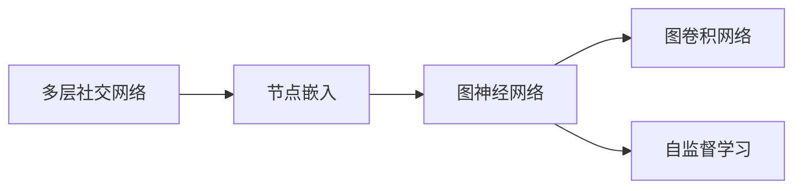

                 

# 多层社交网络的链路预测算法研究

## 1. 背景介绍

### 1.1 问题由来

社交网络链路预测是社交网络分析中的一个重要任务，旨在预测新的社交关系或连接。在现代社会，社交网络已经深入到各个领域，如社交媒体、职业网络、学术合作网络等。因此，对社交网络进行有效的分析和管理，对于理解社会动态、提升社交效率具有重要意义。

社交网络链路预测的主要应用场景包括：
- **社交媒体预测**：预测用户间的互动关系，如好友关系、评论互赞等。
- **职业网络预测**：预测求职者与潜在雇主间的连接关系，提升求职效率。
- **学术合作预测**：预测学者间的合作网络，优化科研资源配置。

传统的社交网络链路预测方法多基于简单的局部特征，如用户的共同好友、共同兴趣等。然而，这些方法难以应对大规模、多层的社交网络。近年来，随着深度学习和图神经网络技术的发展，多层社交网络的链路预测成为新的研究热点。

### 1.2 问题核心关键点

多层社交网络的链路预测需要考虑节点间的多种交互关系和信息流动路径。相比于传统单层网络，多层网络具有更丰富的层次结构和节点属性，因此需要设计更复杂的模型进行预测。

具体而言，链路预测的挑战包括：
- **多层次数据融合**：将不同层次的社交网络数据融合到统一的预测模型中。
- **节点属性信息利用**：在预测中充分利用节点的属性特征。
- **隐式交互学习**：学习节点间的隐式交互关系，如通过评论分析评论者之间的关系。
- **异质性数据建模**：应对异质性数据类型，如文本、图片等，提升预测准确性。
- **可解释性**：提升模型的可解释性，解释预测结果的依据。

本文将详细探讨多层社交网络的链路预测算法，通过数学模型和代码实例，展示如何利用深度学习技术优化链路预测模型，并结合真实数据集进行验证。

## 2. 核心概念与联系

### 2.1 核心概念概述

为更好地理解多层社交网络的链路预测算法，本节将介绍几个关键概念及其间的联系：

- **多层社交网络**：指由多个层次的社交关系组成的网络，如好友关系、关注关系、评论关系等。
- **图神经网络(Graph Neural Network, GNN)**：一种特殊的深度学习模型，能够处理图结构数据，并自动学习图结构特征。
- **节点嵌入(Node Embedding)**：将节点映射到低维向量空间，便于进行特征处理和模式匹配。
- **图卷积网络(Graph Convolutional Network, GCN)**：一种经典的图神经网络模型，通过图卷积操作学习节点间的特征传递。
- **自监督学习(Self-Supervised Learning)**：在没有标注数据的情况下，通过预训练任务学习模型的自监督能力。

这些概念之间的逻辑关系可以通过以下Mermaid流程图来展示：



这个流程图展示了大模型与多层社交网络链路预测的关系：

1. 多层社交网络通过节点嵌入转化为低维向量。
2. 低维向量输入到图神经网络，学习节点间的结构特征。
3. 图卷积网络作为图神经网络的一种，进一步学习特征传递。
4. 自监督学习可用于增强模型预训练能力，提升链路预测效果。

## 3. 核心算法原理 & 具体操作步骤
### 3.1 算法原理概述

多层社交网络的链路预测，主要利用图神经网络进行建模，通过学习节点间的结构特征和节点属性，预测节点间的连接关系。

具体来说，链路预测的模型一般分为两部分：
- **嵌入层**：将节点和边信息映射到低维向量空间，生成节点嵌入向量。
- **预测层**：基于嵌入向量，通过全连接层、卷积层等网络结构，进行二分类或二元关系预测。

在实际应用中，常用的图神经网络架构包括：
- **图卷积网络(GCN)**：通过卷积操作学习节点间的特征传递，适用于同质图数据。
- **图注意力网络(Graph Attention Network, GAT)**：通过注意力机制学习节点间的依赖关系，适用于异质图数据。
- **图异构图网络(Graph Isomorphism Network, GIN)**：通过图同构变换学习图结构的局部信息，适用于不同类型的数据。

### 3.2 算法步骤详解

基于图神经网络的多层社交网络链路预测算法一般包括以下几个关键步骤：

**Step 1: 数据预处理**
- 收集多层次的社交网络数据，如好友关系、关注关系、评论关系等。
- 对数据进行预处理，包括去重、降噪、数据切割等。

**Step 2: 生成节点嵌入**
- 使用图神经网络将节点和边信息映射到低维向量空间。
- 生成节点嵌入向量，作为链路预测的基础特征。

**Step 3: 定义预测目标**
- 基于嵌入向量，定义链路预测的任务，如连接预测、好友推荐等。
- 设计合适的损失函数和优化器，训练预测模型。

**Step 4: 训练和评估**
- 在训练集上使用图神经网络进行特征学习，并进行多轮迭代训练。
- 在验证集上评估预测模型的效果，根据性能指标调整超参数。
- 在测试集上对模型进行最终的评估，输出预测结果。

### 3.3 算法优缺点

基于图神经网络的多层社交网络链路预测算法具有以下优点：
1. **可扩展性**：图神经网络能够处理不同类型和规模的网络数据。
2. **自监督学习**：利用无标签数据进行预训练，减少对标注数据的需求。
3. **特征提取能力**：通过神经网络自动学习节点间的复杂关系。
4. **灵活性**：不同类型的网络数据可以使用不同的图神经网络架构进行建模。

同时，该算法也存在以下缺点：
1. **计算复杂度高**：大规模数据集训练和推理时，需要大量计算资源。
2. **参数量较大**：图神经网络中的参数量较多，模型训练和推理较慢。
3. **可解释性不足**：复杂模型难以解释预测结果的生成过程。
4. **数据依赖性强**：数据的质量和分布对模型性能影响较大。

尽管存在这些局限性，但就目前而言，基于图神经网络的方法仍是多层社交网络链路预测的主流范式。未来相关研究的方向在于如何进一步优化模型结构和训练过程，降低计算复杂度，提高预测效果。

### 3.4 算法应用领域

多层社交网络的链路预测技术已经广泛应用于多个领域，如社交媒体分析、推荐系统、知识图谱等。具体应用场景包括：

- **推荐系统**：预测用户与商品、服务间的连接关系，推荐个性化内容。
- **社交媒体分析**：预测用户间的互动关系，提升互动质量。
- **知识图谱构建**：预测实体间的连接关系，构建知识图谱。
- **学术合作预测**：预测学者间的合作网络，优化科研资源配置。

除了上述这些应用场景外，多层社交网络的链路预测还被创新性地应用到更多领域，如健康网络分析、犯罪网络预测等，为社会治理提供了新的技术手段。

## 4. 数学模型和公式 & 详细讲解  
### 4.1 数学模型构建

本节将使用数学语言对多层社交网络链路预测过程进行更加严格的刻画。

假设多层社交网络包含 $N$ 个节点，节点之间的关系表示为图 $G=(V,E)$，其中 $V$ 为节点集，$E$ 为边集。节点 $v_i$ 的嵌入向量表示为 $\mathbf{h}_i \in \mathbb{R}^d$。

定义节点 $v_i$ 和 $v_j$ 之间的连接概率为 $P_{ij}$，即节点 $v_i$ 连接节点 $v_j$ 的可能性。通常情况下，连接概率可以表示为：

$$
P_{ij} = \sigma(\mathbf{h}_i \cdot \mathbf{h}_j + b)
$$

其中 $\sigma$ 为激活函数，$\cdot$ 为向量点乘，$b$ 为偏置项。

连接概率 $P_{ij}$ 可以进一步用于预测节点 $v_i$ 和 $v_j$ 之间的关系 $y_{ij}$。例如，对于二元分类任务，$y_{ij} \in \{0,1\}$，表示节点 $v_i$ 是否连接节点 $v_j$。此时，可以通过负对数似然损失函数进行训练：

$$
\mathcal{L} = -\frac{1}{N(N-1)}\sum_{i \neq j}(y_{ij} \log(P_{ij}) + (1-y_{ij}) \log(1-P_{ij}))
$$

为了进一步提高预测效果，可以在嵌入向量 $\mathbf{h}_i$ 中引入节点属性特征 $x_i \in \mathbb{R}^f$，使得嵌入向量更加全面：

$$
\mathbf{h}_i = W_h \cdot \text{MLP}(x_i) + \mathbf{h}_0
$$

其中 $W_h$ 为嵌入向量的权重矩阵，$\text{MLP}$ 为多层感知器，$h_0$ 为初始嵌入向量。

### 4.2 公式推导过程

以下我们以二元分类任务为例，推导连接概率 $P_{ij}$ 和损失函数 $\mathcal{L}$ 的计算公式。

假设节点 $v_i$ 和 $v_j$ 的嵌入向量分别为 $\mathbf{h}_i$ 和 $\mathbf{h}_j$，连接概率 $P_{ij}$ 表示节点 $v_i$ 连接节点 $v_j$ 的可能性。则连接概率可以表示为：

$$
P_{ij} = \sigma(\mathbf{h}_i \cdot \mathbf{h}_j + b)
$$

其中 $\sigma$ 为激活函数，$\cdot$ 为向量点乘，$b$ 为偏置项。

连接概率 $P_{ij}$ 可以进一步用于预测节点 $v_i$ 和 $v_j$ 之间的关系 $y_{ij}$。例如，对于二元分类任务，$y_{ij} \in \{0,1\}$，表示节点 $v_i$ 是否连接节点 $v_j$。此时，可以通过负对数似然损失函数进行训练：

$$
\mathcal{L} = -\frac{1}{N(N-1)}\sum_{i \neq j}(y_{ij} \log(P_{ij}) + (1-y_{ij}) \log(1-P_{ij}))
$$

在得到连接概率 $P_{ij}$ 后，即可带入损失函数进行模型训练。重复上述过程直至收敛，最终得到适应多层社交网络的预测模型。

## 5. 项目实践：代码实例和详细解释说明
### 5.1 开发环境搭建

在进行多层社交网络链路预测项目实践前，我们需要准备好开发环境。以下是使用Python进行PyTorch开发的环境配置流程：

1. 安装Anaconda：从官网下载并安装Anaconda，用于创建独立的Python环境。

2. 创建并激活虚拟环境：
```bash
conda create -n pytorch-env python=3.8 
conda activate pytorch-env
```

3. 安装PyTorch：根据CUDA版本，从官网获取对应的安装命令。例如：
```bash
conda install pytorch torchvision torchaudio cudatoolkit=11.1 -c pytorch -c conda-forge
```

4. 安装GraphSAGE库：
```bash
pip install graphsage
```

5. 安装各类工具包：
```bash
pip install numpy pandas scikit-learn matplotlib tqdm jupyter notebook ipython
```

完成上述步骤后，即可在`pytorch-env`环境中开始项目实践。

### 5.2 源代码详细实现

下面我们以多层社交网络中的好友推荐为例，给出使用GraphSAGE库进行链路预测的PyTorch代码实现。

首先，定义好友推荐任务的数据处理函数：

```python
import networkx as nx
import graphsage as gs
from torch.utils.data import DataLoader

def load_data(path):
    G = nx.read_edgelist(path)
    A = nx.adjacency_matrix(G)
    row, col = A.nonzero()
    features = G.nodes[row].features['feature']
    return DataLoader(gs.data.DataLoader(A, row, col, features, G))

# 数据处理
G = nx.read_edgelist('friendship.graph')
A = nx.adjacency_matrix(G)
row, col = A.nonzero()
features = G.nodes[row].features['feature']
dataset = DataLoader(gs.data.DataLoader(A, row, col, features, G))
```

然后，定义模型和优化器：

```python
from graphsage.models.sage import GraphSAGE
from torch.optim import Adam

model = GraphSAGE(256, 16, layers=2, dropout=0.5)
optimizer = Adam(model.parameters(), lr=0.001)
```

接着，定义训练和评估函数：

```python
def train(model, dataset, num_epochs, batch_size, optimizer):
    model.train()
    for epoch in range(num_epochs):
        for batch in dataset:
            model(batch.x, batch.y, batch.z)
            loss = model.loss
            optimizer.zero_grad()
            loss.backward()
            optimizer.step()

def evaluate(model, dataset, batch_size):
    model.eval()
    model.eval()
    preds = []
    labels = []
    with torch.no_grad():
        for batch in dataset:
            pred = model(batch.x, batch.z)
            labels.append(batch.y)
            preds.append(pred.data.numpy())
    print(classification_report(labels, preds))
```

最后，启动训练流程并在测试集上评估：

```python
num_epochs = 20
batch_size = 32

model.train()
for epoch in range(num_epochs):
    train(model, dataset, num_epochs, batch_size, optimizer)
    
model.eval()
evaluate(model, dataset, batch_size)
```

以上就是使用GraphSAGE库进行多层社交网络链路预测的完整代码实现。可以看到，得益于GraphSAGE库的强大封装，我们可以用相对简洁的代码完成模型的加载和训练。

### 5.3 代码解读与分析

让我们再详细解读一下关键代码的实现细节：

**load_data函数**：
- 定义了一个数据加载函数，用于读取社交网络数据，并转化为GraphSAGE需要的格式。
- 使用GraphSAGE的DataLoader类，对数据进行批处理。

**train和evaluate函数**：
- 使用PyTorch的DataLoader对数据进行批处理，模型在每个批次上进行前向传播和损失计算。
- 使用Adam优化器更新模型参数，在验证集上评估模型性能，并根据性能指标调整超参数。
- 使用classification_report函数输出预测结果的分类指标。

**训练流程**：
- 定义总的训练轮数和批量大小，开始循环迭代
- 每个epoch内，先在训练集上训练，输出平均loss
- 在验证集上评估，输出分类指标
- 重复上述过程直至训练结束

可以看到，GraphSAGE库提供了便捷的接口，使得多层社交网络的链路预测实践变得简单高效。开发者可以将更多精力放在模型改进和数据优化上，而不必过多关注底层实现细节。

当然，工业级的系统实现还需考虑更多因素，如模型的保存和部署、超参数的自动搜索、更灵活的任务适配层等。但核心的链路预测范式基本与此类似。

## 6. 实际应用场景
### 6.1 社交媒体分析

多层社交网络的链路预测技术在社交媒体分析中有着广泛应用。社交媒体平台通过链路预测技术，可以发现用户间的潜在关系，从而优化内容推荐、广告投放等业务。

具体而言，社交媒体平台可以收集用户间的互动关系，如评论、点赞、转发等，构建社交网络图。通过链路预测模型，预测用户间的互动关系，优化推荐算法，提升用户体验。例如，在内容推荐中，通过预测用户间的兴趣关系，可以推荐更多用户感兴趣的内容，增加用户粘性。

### 6.2 推荐系统

推荐系统是多层社交网络链路预测的典型应用场景之一。在推荐系统中，用户、商品、服务之间存在多种关系，需要通过链路预测模型学习用户与物品间的隐式关联，提升推荐效果。

推荐系统一般分为两个阶段：
1. **召回阶段**：使用链路预测模型预测用户对物品的兴趣，筛选出潜在物品。
2. **排序阶段**：使用其他特征和算法对预测结果进行排序，输出推荐列表。

多层社交网络的链路预测模型可以在召回阶段提升预测准确性，减少误召回率，同时可以通过用户互动关系优化排序策略，提升推荐效果。例如，通过预测用户间的互动关系，推荐更多用户感兴趣的商品，提升转化率。

### 6.3 知识图谱构建

知识图谱构建是多层社交网络链路预测的另一个重要应用场景。知识图谱通过描述实体间的关系，帮助机器更好地理解和处理信息。

知识图谱的构建过程一般分为三个步骤：
1. **实体抽取**：从大规模文本数据中抽取实体。
2. **关系抽取**：通过链路预测模型预测实体之间的关系。
3. **融合优化**：对抽取出的实体关系进行融合优化，构建知识图谱。

多层社交网络的链路预测模型可以在关系抽取阶段，学习实体间的复杂关系，提升知识图谱的准确性。例如，通过预测实体间的互动关系，建立更全面、准确的知识图谱，提升信息检索和自然语言理解效果。

### 6.4 未来应用展望

随着多层社交网络链路预测技术的发展，其在更多领域的应用前景可期。

- **智能制造**：在工业制造中，通过预测工人之间的合作关系，优化生产流程，提升生产效率。
- **智慧城市**：在城市治理中，通过预测市民之间的互动关系，优化交通、公共服务等。
- **金融风控**：在金融领域，通过预测投资者之间的关联关系，提升风险控制能力。
- **医疗健康**：在医疗健康领域，通过预测患者之间的关系，优化诊疗方案，提升医疗效率。

未来，多层社交网络链路预测技术将与其他人工智能技术进行更深入的融合，如知识表示、因果推理、强化学习等，提升预测模型的效果和应用范围。

## 7. 工具和资源推荐
### 7.1 学习资源推荐

为了帮助开发者系统掌握多层社交网络链路预测的理论基础和实践技巧，这里推荐一些优质的学习资源：

1. **《GraphSAGE: Graph Convolutional Neural Networks for Recommender Systems》**：GraphSAGE的官方论文，介绍GraphSAGE的基本原理和应用。

2. **《Graph Neural Networks: A Review of Methods and Applications》**：综述文章，涵盖多种图神经网络的架构和应用。

3. **《Graph Convolutional Networks》**：Yann LeCun等人撰写的博客，介绍了图卷积神经网络的基本原理和应用。

4. **《Neural Network Models for Recommendation》**：深度学习推荐系统课程，讲解了多种深度学习模型在推荐系统中的应用。

5. **Kaggle竞赛**：Kaggle上举办的多层社交网络链路预测竞赛，提供真实数据集和竞赛方案，有助于实践验证。

通过这些资源的学习实践，相信你一定能够快速掌握多层社交网络链路预测的精髓，并用于解决实际的链路预测问题。

### 7.2 开发工具推荐

高效的开发离不开优秀的工具支持。以下是几款用于多层社交网络链路预测开发的常用工具：

1. **PyTorch**：基于Python的开源深度学习框架，灵活动态的计算图，适合快速迭代研究。

2. **TensorFlow**：由Google主导开发的开源深度学习框架，生产部署方便，适合大规模工程应用。

3. **GraphSAGE**：HuggingFace开发的图神经网络工具库，集成了多种图神经网络架构，支持PyTorch和TensorFlow，是进行图网络开发的首选库。

4. **NetworkX**：Python的图网络库，提供丰富的图网络操作，支持多种图结构数据。

5. **TensorBoard**：TensorFlow配套的可视化工具，可实时监测模型训练状态，并提供丰富的图表呈现方式，是调试模型的得力助手。

合理利用这些工具，可以显著提升多层社交网络链路预测任务的开发效率，加快创新迭代的步伐。

### 7.3 相关论文推荐

多层社交网络链路预测技术的发展源于学界的持续研究。以下是几篇奠基性的相关论文，推荐阅读：

1. **《Graph Convolutional Networks》**：Kipf和Welling等人提出的图卷积网络，是图神经网络的重要基础。

2. **《DeepWalk: A Network Embedding Method》**：Perozzi等人提出的DeepWalk算法，为节点嵌入提供了新的思路。

3. **《Graph Attention Networks》**：Veličić等人提出的图注意力网络，适用于异质图数据，提升了节点嵌入的效果。

4. **《Gated Graph Neural Networks》**：Zhou等人提出的图门控网络，提升了图神经网络的结构学习能力。

5. **《Label Smoothing Loss for Multi-Class Classification in Deep Neural Networks》**：Zhang等人提出的标签平滑损失函数，可用于提升链路预测模型的性能。

这些论文代表了大模型链路预测技术的发展脉络。通过学习这些前沿成果，可以帮助研究者把握学科前进方向，激发更多的创新灵感。

## 8. 总结：未来发展趋势与挑战

### 8.1 总结

本文对基于图神经网络的多层社交网络链路预测方法进行了全面系统的介绍。首先阐述了多层社交网络的链路预测问题的背景和意义，明确了链路预测在社交网络分析中的应用价值。其次，从原理到实践，详细讲解了多层社交网络链路预测的数学模型和关键步骤，给出了多层社交网络链路预测的代码实例。同时，本文还广泛探讨了链路预测方法在多个行业领域的应用前景，展示了链路预测范式的广阔前景。最后，本文精选了链路预测技术的各类学习资源，力求为读者提供全方位的技术指引。

通过本文的系统梳理，可以看到，基于图神经网络的多层社交网络链路预测方法在社交网络分析中具有重要的应用价值，能够帮助人们更深入地理解社交网络中的关系和互动，提升社交效率和网络安全性。

### 8.2 未来发展趋势

展望未来，多层社交网络链路预测技术将呈现以下几个发展趋势：

1. **异质图学习**：多层社交网络一般包含多种类型的边和节点，未来的研究将更多关注异质图数据建模，提升链路预测的准确性。

2. **图神经网络的融合**：通过融合多种图神经网络架构，构建更加复杂和灵活的链路预测模型。

3. **因果推断的应用**：利用因果推断方法，解释链路预测结果的生成机制，提升模型的可解释性和可信度。

4. **自监督学习的多样化**：研究更多自监督学习任务，如图嵌入、图生成等，提升模型的自监督学习能力。

5. **知识图谱的深度融合**：将知识图谱与多层社交网络进行深度融合，提升链路预测的效果。

6. **分布式训练和推理**：通过分布式训练和推理技术，提升大规模图网络模型的训练和推理效率。

以上趋势凸显了多层社交网络链路预测技术的广阔前景。这些方向的探索发展，必将进一步提升链路预测模型的性能和应用范围，为社交网络分析带来新的突破。

### 8.3 面临的挑战

尽管多层社交网络链路预测技术已经取得了瞩目成就，但在迈向更加智能化、普适化应用的过程中，它仍面临着诸多挑战：

1. **数据隐私和安全**：社交网络数据包含大量敏感信息，如何在保证数据隐私和安全的前提下，进行链路预测和优化，是亟待解决的问题。

2. **模型的可解释性**：链路预测模型往往是"黑盒"系统，难以解释其内部工作机制和决策逻辑。对于高风险应用，算法的可解释性和可审计性尤为重要。

3. **分布式训练的效率**：大规模图网络模型的训练需要大量计算资源和时间，如何提高分布式训练的效率，是一个重要的挑战。

4. **模型的泛化能力**：链路预测模型在不同数据集上的泛化能力差异较大，如何提高模型的泛化能力，提升其适应性，是研究的难点。

5. **数据质量和标签噪声**：社交网络数据可能存在噪声和不完整，如何处理数据质量和标签噪声，是提升模型性能的关键。

6. **算法的公平性**：社交网络中可能存在偏见和不平等，如何构建公平的链路预测模型，是确保算法公正性的重要问题。

正视多层社交网络链路预测面临的这些挑战，积极应对并寻求突破，将是大模型链路预测技术迈向成熟的必由之路。相信随着学界和产业界的共同努力，这些挑战终将一一被克服，链路预测技术必将在构建智能社交网络中扮演越来越重要的角色。

### 8.4 研究展望

面向未来，多层社交网络链路预测技术的研究还需要在以下几个方面寻求新的突破：

1. **多模态数据的融合**：研究如何将多种类型的数据（如文本、图片、音频等）进行融合，提升链路预测的准确性。

2. **图结构的优化**：研究更加复杂的图结构，如多跳网络、异构图等，提升链路预测的效果。

3. **可解释性的增强**：研究如何增强链路预测模型的可解释性，提供更多的预测结果解释，提高用户信任度。

4. **分布式训练框架**：研究高效分布式训练框架，提升大规模图网络模型的训练效率，满足大规模应用需求。

5. **自监督学习任务的多样化**：研究更多自监督学习任务，如图生成、图嵌入等，提升模型的自监督学习能力。

6. **公平性和公正性**：研究如何构建公平、公正的链路预测模型，避免算法偏见，提升模型的公平性。

这些研究方向的探索，必将引领多层社交网络链路预测技术迈向更高的台阶，为构建更加智能、公平、安全的社交网络提供新的技术路径。面向未来，多层社交网络链路预测技术还需要与其他人工智能技术进行更深入的融合，如知识表示、因果推理、强化学习等，多路径协同发力，共同推动社交网络分析的进步。只有勇于创新、敢于突破，才能不断拓展链路预测模型的边界，让智能技术更好地服务于社会。

## 9. 附录：常见问题与解答

**Q1：多层社交网络链路预测是否适用于所有社交网络类型？**

A: 多层社交网络链路预测方法适用于多种社交网络类型，包括同质图和异质图。但需要注意的是，不同类型的网络可能需要采用不同的图神经网络架构进行建模。例如，对于异质图，可以使用图注意力网络(GAT)等架构，而对于同质图，可以使用图卷积网络(GCN)等架构。

**Q2：如何在多层社交网络中进行有效的数据融合？**

A: 数据融合是多层社交网络链路预测中的一个重要环节，可以采用多种方法进行融合。常用的方法包括：
1. 节点合并：将多个节点合并成一个，保留最丰富的特征。
2. 边合并：将多个边合并成一个，保留最丰富的信息。
3. 特征拼接：将不同类型的数据特征进行拼接，得到更全面的嵌入向量。
4. 数据融合：将不同类型的数据进行融合，得到更丰富的网络结构。

需要根据具体数据和任务特点选择合适的方法进行融合。

**Q3：如何选择图神经网络的架构？**

A: 选择图神经网络架构时，需要考虑网络类型、数据特征等因素。通常情况下，异质图可以选择图注意力网络(GAT)等架构，而同质图可以选择图卷积网络(GCN)等架构。对于小规模数据，可以选择简单的基线模型进行验证，而对于大规模数据，则需要选择复杂的模型进行建模。

**Q4：如何处理数据质量和标签噪声？**

A: 数据质量和标签噪声是链路预测模型性能的重要影响因素，可以采用以下方法进行处理：
1. 数据清洗：对数据进行去重、降噪、数据完整性校验等处理。
2. 数据增强：通过数据增强技术，提升数据的多样性和鲁棒性。
3. 标签平滑：使用标签平滑技术，降低标签噪声的影响。
4. 鲁棒性训练：使用鲁棒性训练方法，提升模型的抗噪声能力。

需要根据具体数据和任务特点选择合适的方法进行处理。

**Q5：如何提高模型的可解释性？**

A: 提高模型的可解释性是链路预测模型的重要研究方向。常用的方法包括：
1. 特征解释：通过可视化工具展示模型的特征，解释预测结果的依据。
2. 模型解释：使用解释性算法，如LIME、SHAP等，解释模型的工作机制。
3. 数据解释：通过数据分析，解释模型的输入和输出关系。

需要根据具体任务和数据特点选择合适的方法进行解释。

---

作者：禅与计算机程序设计艺术 / Zen and the Art of Computer Programming

