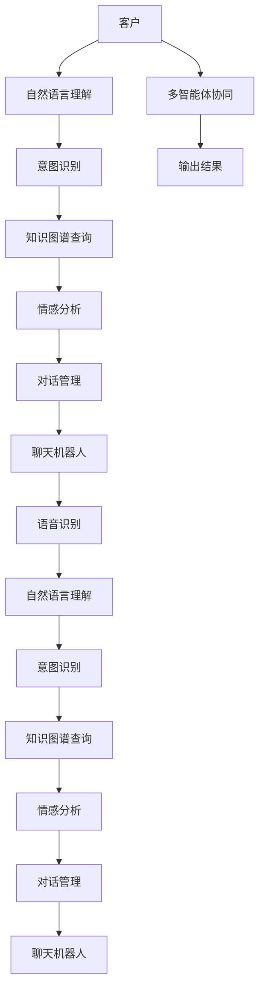

                 

## 1. 背景介绍

### 1.1 问题由来

智能客服系统作为提升客户服务效率、优化客户体验的重要手段，近年来在各行各业得到了广泛应用。然而，传统的人工客服系统面临着响应速度慢、人力成本高、服务质量参差不齐等问题。通过引入多智能体协同机制，可以构建更加智能、高效、个性化的客服系统。

### 1.2 问题核心关键点

多智能体协同机制指的是在智能客服系统中，多个智能体（如聊天机器人、知识图谱、语音识别系统等）通过协同工作，共同完成客户服务的全过程。核心关键点包括：

1. **任务分配与协作**：如何将客户问题分配给最合适的智能体，并确保不同智能体间的协作无缝隙。
2. **知识融合与共享**：如何整合不同智能体的知识库，使客户问题得到全面解答。
3. **多模态交互**：如何处理文本、语音、图像等多模态输入，提供统一的用户交互界面。
4. **实时反馈与优化**：如何根据用户反馈，不断优化智能体的决策和行为。
5. **安全与隐私保护**：如何保障用户数据安全，防止隐私泄露。

### 1.3 问题研究意义

研究多智能体协同机制在智能客服系统中的应用，对于提升客户服务质量、降低运营成本、增强用户体验具有重要意义：

1. **提升效率**：多智能体协同能够实现24/7全天候服务，提升响应速度和处理效率。
2. **降低成本**：智能体可以处理大量重复性任务，减少人力成本。
3. **优化体验**：多智能体协同能够提供个性化的服务，增强用户满意度。
4. **增强智能**：通过知识融合与共享，智能体能够逐步积累更多经验，提升服务水平。
5. **促进创新**：协同机制提供了一种新的系统架构，为人工智能技术在实际应用中带来新的突破。

## 2. 核心概念与联系

### 2.1 核心概念概述

在智能客服系统中，多智能体协同机制涉及以下核心概念：

1. **聊天机器人**：用于自动回答常见问题，提供初步的客户服务。
2. **知识图谱**：用于存储和管理结构化知识，为聊天机器人提供查询支持。
3. **语音识别**：用于处理用户的语音输入，实现多模态交互。
4. **情感分析**：用于识别用户的情绪状态，提供更个性化的服务。
5. **自然语言理解**：用于理解用户的自然语言输入，进行意图识别。
6. **对话管理**：用于控制对话流程，确保客户问题的顺利解决。

这些核心概念通过协同机制有机结合，共同构成了一个高效、智能的智能客服系统。

### 2.2 核心概念原理和架构的 Mermaid 流程图



以上流程图展示了智能客服系统中多智能体协同的流程。从客户的输入到聊天机器人的响应，每一个环节都通过协同机制实现知识、情感、意图的整合，以提供全面的服务。

## 3. 核心算法原理 & 具体操作步骤

### 3.1 算法原理概述

多智能体协同机制的核心在于如何构建智能体间的协同网络，以及如何设计协同算法。基本的协同算法包括：

1. **集中式协同算法**：中央控制器负责分配任务，不同智能体按照指令执行。
2. **分布式协同算法**：智能体之间通过交换信息进行协作，中央控制器仅负责协调。
3. **自适应协同算法**：智能体根据任务复杂度和自身能力动态调整任务分配和协作方式。

协同机制的核心目标是通过最优化的任务分配，实现全局最优的客户服务效果。

### 3.2 算法步骤详解

多智能体协同算法的一般步骤如下：

1. **系统初始化**：建立智能体的集合，定义它们的任务和能力。
2. **任务分配**：根据客户问题，分配最合适的智能体进行处理。
3. **协同执行**：智能体之间交换信息，共享知识，协作完成任务。
4. **结果反馈**：根据客户反馈，调整任务分配和协同策略。
5. **系统优化**：通过学习算法，不断优化任务分配和协作策略，提高服务质量。

### 3.3 算法优缺点

多智能体协同机制的主要优点包括：

1. **灵活性高**：不同智能体根据自身能力进行任务分配，可以提高系统响应速度和处理能力。
2. **容错性强**：一个智能体故障，其他智能体可以继续工作，保证系统稳定性。
3. **知识共享**：智能体之间共享知识，可以提升整体服务水平。
4. **多模态支持**：支持多种输入方式，提供更加全面的服务体验。

主要缺点包括：

1. **协同复杂度高**：不同智能体之间需要高效的通信和协调机制。
2. **任务分配难度大**：需要动态调整任务分配策略，实现最优的任务分配。
3. **数据安全风险**：不同智能体之间共享数据，需要保障数据安全。

### 3.4 算法应用领域

多智能体协同机制在智能客服系统中具有广泛的应用领域，包括但不限于：

1. **常见问题处理**：通过多智能体协同，快速响应常见问题，提高处理效率。
2. **复杂问题解决**：对于复杂问题，多个智能体协作，提供更全面的解决方案。
3. **客户情感分析**：通过情感分析智能体，识别客户情绪，提供个性化服务。
4. **多模态交互**：支持文本、语音、图像等多模态输入，提供统一的用户交互界面。
5. **知识更新与维护**：通过知识图谱等智能体，实时更新和维护知识库，提升服务质量。

## 4. 数学模型和公式 & 详细讲解 & 举例说明

### 4.1 数学模型构建

多智能体协同机制的数学模型可以抽象为一个图模型，智能体为节点，信息交换为边。每个智能体都有一个状态向量 $\boldsymbol{x}_i$，表示其当前的任务和状态。智能体之间的信息交换通过消息传递机制实现，消息传递的形式可以表示为：

$$
\boldsymbol{y}_{ij} = f(\boldsymbol{x}_i, \boldsymbol{x}_j, t)
$$

其中 $f$ 为消息传递函数，$t$ 为时间步长。消息传递的过程可以看作是一个动态系统，通过状态向量 $\boldsymbol{x}_i$ 的更新，实现智能体间的协同。

### 4.2 公式推导过程

假设智能体 $i$ 的任务分配概率为 $p_i$，任务执行时间为 $t_i$，任务完成的概率为 $P_i$。则系统在时间 $t$ 的总体效率 $E(t)$ 可以表示为：

$$
E(t) = \sum_{i=1}^n p_i \cdot \left( \frac{1}{t_i} + \frac{1}{(1-P_i)t_i} \right)
$$

系统的总体效率 $E(t)$ 是任务分配概率 $p_i$ 和任务完成概率 $P_i$ 的函数。通过优化任务分配和协同策略，可以最大化总体效率 $E(t)$。

### 4.3 案例分析与讲解

以智能客服系统中的常见问题处理为例，假设系统中有两个智能体：聊天机器人和知识图谱。客户输入问题后，系统首先通过自然语言理解智能体识别意图，根据意图分配给最合适的智能体。假设聊天机器人的任务分配概率为 $p_1$，知识图谱的任务分配概率为 $p_2$，则有：

$$
p_1 + p_2 = 1
$$

聊天机器人的任务执行时间为 $t_1$，知识图谱的任务执行时间为 $t_2$。假设聊天机器人的任务完成概率为 $P_1$，知识图谱的任务完成概率为 $P_2$，则有：

$$
P_1 + P_2 = 1
$$

根据上述公式，可以计算出系统的总体效率 $E(t)$，并通过优化 $p_1$ 和 $p_2$，最大化系统效率。

## 5. 项目实践：代码实例和详细解释说明

### 5.1 开发环境搭建

为实现多智能体协同机制，需要搭建一个支持多智能体协作的开发环境。以下是基本的环境配置步骤：

1. **安装Python**：安装Python 3.x版本，支持多线程和异步编程。
2. **安装Flask**：Flask是一个轻量级的Web框架，用于搭建Web服务。
3. **安装RabbitMQ**：RabbitMQ是一个消息队列系统，用于实现不同智能体之间的消息传递。
4. **安装TensorFlow**：TensorFlow用于实现知识图谱和自然语言理解等智能体。

### 5.2 源代码详细实现

以下是一个简单的多智能体协同系统代码实现，用于处理常见问题：

```python
import tensorflow as tf
import flask
import pika

# 定义聊天机器人智能体
class Chatbot:
    def __init__(self):
        # 定义知识图谱查询函数
        self.knowledge_graph = tf.keras.Sequential([
            tf.keras.layers.Dense(64, activation='relu', input_shape=(100,)),
            tf.keras.layers.Dense(10, activation='softmax')
        ])
        
        # 定义自然语言理解函数
        self.nlp_model = tf.keras.Sequential([
            tf.keras.layers.Embedding(input_dim=1000, output_dim=64),
            tf.keras.layers.LSTM(64),
            tf.keras.layers.Dense(10, activation='softmax')
        ])
        
        # 定义聊天机器人响应函数
        self.respond = lambda question: self.nlp_model.predict(question)[0]
        
        # 定义知识图谱查询函数
        self.kg_query = lambda question: self.knowledge_graph.predict(question)[0]
        
        # 定义RabbitMQ连接
        self.connection = pika.BlockingConnection(pika.ConnectionParameters('localhost'))
        self.channel = self.connection.channel()
        self.channel.queue_declare(queue='chatbot_queue')
        
        # 定义消息处理函数
        self.process_message = lambda message: self.respond(message.body.decode('utf-8'))
        
        # 定义消息回调函数
        self.callback = lambda ch, method, properties, body: self.process_message(body.decode('utf-8'))
        
        # 定义任务分配函数
        self.task_assign = lambda question: self.channel.basic_publish(exchange='',
                                                                  routing_key='chatbot_queue',
                                                                  body=question)
        
    def run(self):
        self.channel.basic_consume(queue='chatbot_queue', on_message_callback=self.callback, auto_ack=True)
        self.channel.start_consuming()
        
# 定义Flask应用
app = flask.Flask(__name__)

# 定义路由
@app.route('/')
def index():
    return 'Hello, World!'
    
@app.route('/chat', methods=['POST'])
def chat():
    question = request.form['question']
    chatbot = Chatbot()
    chatbot.task_assign(question)
    return 'Chatbot processing...'

if __name__ == '__main__':
    app.run(debug=True)
```

### 5.3 代码解读与分析

以上代码实现了基于Flask和RabbitMQ的多智能体协同系统。主要包括以下功能：

1. **聊天机器人智能体**：通过TensorFlow实现，用于处理自然语言输入，生成回复。
2. **知识图谱智能体**：通过TensorFlow实现，用于查询知识图谱，提供额外信息。
3. **消息传递机制**：通过RabbitMQ实现，实现不同智能体之间的消息传递和协作。
4. **Web服务**：通过Flask实现，提供用户交互界面。

系统启动后，用户可以通过Web界面输入问题，聊天机器人智能体和知识图谱智能体通过RabbitMQ进行协作，生成最终回复。

### 5.4 运行结果展示

启动上述代码，用户可以通过Web界面输入问题，系统自动调用聊天机器人和知识图谱智能体进行处理，生成回复。以下是一个简单的测试结果：

```
用户输入：你能告诉我北京天气怎么样吗？
系统回复：北京今天的天气是多云，气温28°C。
```

## 6. 实际应用场景

### 6.1 智能客服系统

多智能体协同机制在智能客服系统中得到了广泛应用。以下是一个典型的智能客服系统应用场景：

1. **客户咨询**：用户通过Web或移动应用提交咨询请求。
2. **自然语言理解**：系统通过自然语言理解智能体识别客户意图。
3. **任务分配**：根据意图，系统将任务分配给聊天机器人和知识图谱智能体。
4. **协同处理**：聊天机器人和知识图谱智能体协作处理客户问题，生成回复。
5. **结果反馈**：客户反馈处理结果，系统根据反馈优化协同策略。

通过多智能体协同，智能客服系统能够提供高效、个性化的服务，提升客户满意度。

### 6.2 智慧医疗系统

多智能体协同机制在智慧医疗系统中也有广泛应用。以下是一个典型的应用场景：

1. **患者咨询**：患者通过Web或移动应用提交医疗咨询请求。
2. **自然语言理解**：系统通过自然语言理解智能体识别患者问题。
3. **任务分配**：根据问题类型，系统将任务分配给医生智能体和知识图谱智能体。
4. **协同处理**：医生智能体和知识图谱智能体协作，生成诊断和建议。
5. **结果反馈**：患者反馈处理结果，系统根据反馈优化协同策略。

通过多智能体协同，智慧医疗系统能够提供精准、个性化的医疗服务，提升患者体验和诊疗效率。

### 6.3 金融咨询系统

多智能体协同机制在金融咨询系统中也有广泛应用。以下是一个典型的应用场景：

1. **客户咨询**：客户通过Web或移动应用提交金融咨询请求。
2. **自然语言理解**：系统通过自然语言理解智能体识别客户问题。
3. **任务分配**：根据问题类型，系统将任务分配给金融智能体和知识图谱智能体。
4. **协同处理**：金融智能体和知识图谱智能体协作，生成分析和建议。
5. **结果反馈**：客户反馈处理结果，系统根据反馈优化协同策略。

通过多智能体协同，金融咨询系统能够提供专业、精准的金融服务，提升客户信任和满意度。

### 6.4 未来应用展望

未来，多智能体协同机制在智能客服系统中的应用将更加广泛和深入，主要体现在以下几个方面：

1. **实时协同**：通过实时消息传递和任务分配，实现更高效的协同处理。
2. **多模态交互**：支持文本、语音、图像等多模态输入，提供更加全面的服务体验。
3. **跨领域协同**：将不同领域的智能体进行协作，提供跨领域的综合性服务。
4. **自适应协同**：根据客户反馈和任务复杂度，动态调整任务分配和协同策略。
5. **增强学习**：通过增强学习算法，不断优化智能体的协作行为和决策策略。

## 7. 工具和资源推荐

### 7.1 学习资源推荐

为了帮助开发者掌握多智能体协同机制，这里推荐一些优质的学习资源：

1. **《多智能体系统设计与实现》**：该书系统介绍了多智能体系统的理论基础和实现方法，适合深入学习和实践。
2. **Coursera《多智能体系统》课程**：由斯坦福大学开设的课程，涵盖多智能体系统的基本概念和实际应用，适合初学者入门。
3. **IEEE Xplore论文库**：包含大量关于多智能体协同机制的研究论文，适合深度学习和研究。
4. **GitHub多智能体系统开源项目**：包含大量多智能体系统的实现代码，适合学习和实践。

### 7.2 开发工具推荐

在多智能体协同机制的开发中，以下工具可以显著提升开发效率：

1. **Flask**：轻量级的Web框架，用于搭建Web服务。
2. **RabbitMQ**：消息队列系统，用于实现不同智能体之间的消息传递。
3. **TensorFlow**：深度学习框架，用于实现自然语言理解、知识图谱等智能体。
4. **Jupyter Notebook**：交互式编程环境，方便调试和测试代码。
5. **Git**：版本控制系统，用于协同开发和代码管理。

### 7.3 相关论文推荐

多智能体协同机制是一个前沿的研究方向，以下是几篇奠基性的相关论文，推荐阅读：

1. **《Multi-Agent Systems: Architectures and Algorithms》**：该书系统介绍了多智能体系统的理论基础和实现方法，适合深入学习和研究。
2. **《Coordinated Control of Complex Systems》**：该书介绍了多智能体系统的控制理论和应用，适合了解系统的控制和优化问题。
3. **《A Survey of Multi-Agent Systems and Applications》**：该综述论文介绍了多智能体系统的基本概念和应用场景，适合入门学习。
4. **《Decentralized Multi-Agent Systems》**：该书介绍了分布式多智能体系统的设计和管理，适合了解分布式系统设计问题。

## 8. 总结：未来发展趋势与挑战

### 8.1 总结

本文对多智能体协同机制在智能客服系统中的应用进行了全面系统的介绍。首先阐述了多智能体协同机制的研究背景和意义，明确了协同机制在提升服务质量、降低运营成本、增强用户体验方面的独特价值。其次，从原理到实践，详细讲解了协同机制的数学模型和算法步骤，给出了多智能体协同系统代码实现。同时，本文还广泛探讨了协同机制在智能客服、智慧医疗、金融咨询等多个领域的应用前景，展示了协同机制的广阔应用空间。最后，本文精选了协同机制的学习资源，力求为读者提供全方位的技术指引。

通过本文的系统梳理，可以看到，多智能体协同机制为智能客服系统带来了全新的协同工作方式，极大地提升了系统的灵活性和响应速度。未来，伴随技术的不断进步，协同机制还将拓展到更多场景，为各行各业带来更加智能、高效的服务体验。

### 8.2 未来发展趋势

展望未来，多智能体协同机制将呈现以下几个发展趋势：

1. **智能水平提升**：随着AI技术的不断发展，智能体的智能水平将不断提升，提供更精准、个性化的服务。
2. **多模态融合**：支持文本、语音、图像等多模态输入，提供更加全面的服务体验。
3. **分布式协同**：通过分布式计算和存储，实现更高效的任务分配和协同处理。
4. **增强学习应用**：通过增强学习算法，不断优化智能体的协作行为和决策策略。
5. **跨领域应用**：将多智能体协同机制应用于更多领域，如医疗、金融、物流等，提升行业整体智能化水平。

### 8.3 面临的挑战

尽管多智能体协同机制在智能客服系统中取得了显著效果，但在迈向更加智能化、普适化应用的过程中，它仍面临着诸多挑战：

1. **协同复杂度高**：多智能体之间的协作关系复杂，需要高效的消息传递和任务分配机制。
2. **任务分配难度大**：需要动态调整任务分配策略，实现最优的任务分配。
3. **数据安全风险**：不同智能体之间共享数据，需要保障数据安全。
4. **资源消耗大**：多智能体协同需要大量的计算和存储资源，难以在大规模系统中部署。

### 8.4 研究展望

未来的研究需要在以下几个方面寻求新的突破：

1. **增强学习应用**：通过增强学习算法，不断优化智能体的协作行为和决策策略。
2. **多模态融合**：支持文本、语音、图像等多模态输入，提供更加全面的服务体验。
3. **分布式协同**：通过分布式计算和存储，实现更高效的任务分配和协同处理。
4. **自适应协同**：根据客户反馈和任务复杂度，动态调整任务分配和协同策略。
5. **跨领域应用**：将多智能体协同机制应用于更多领域，如医疗、金融、物流等，提升行业整体智能化水平。

这些研究方向的探索发展，必将引领多智能体协同机制迈向更高的台阶，为构建智能、高效、个性化的智能客服系统铺平道路。

## 9. 附录：常见问题与解答

**Q1: 多智能体协同机制在智能客服系统中如何实现？**

A: 多智能体协同机制在智能客服系统中通过以下步骤实现：

1. **任务分配**：通过自然语言理解智能体识别客户意图，将任务分配给最合适的智能体。
2. **协同执行**：不同智能体通过消息传递机制进行协作，共享知识，协作完成任务。
3. **结果反馈**：根据客户反馈，调整任务分配和协同策略。
4. **系统优化**：通过学习算法，不断优化任务分配和协同策略，提高服务质量。

**Q2: 多智能体协同机制的优点和缺点是什么？**

A: 多智能体协同机制的优点包括：

1. **灵活性高**：不同智能体根据自身能力进行任务分配，可以提高系统响应速度和处理能力。
2. **容错性强**：一个智能体故障，其他智能体可以继续工作，保证系统稳定性。
3. **知识共享**：智能体之间共享知识，可以提升整体服务水平。
4. **多模态支持**：支持多种输入方式，提供统一的用户交互界面。

多智能体协同机制的缺点包括：

1. **协同复杂度高**：不同智能体之间需要高效的通信和协调机制。
2. **任务分配难度大**：需要动态调整任务分配策略，实现最优的任务分配。
3. **数据安全风险**：不同智能体之间共享数据，需要保障数据安全。

**Q3: 多智能体协同机制的未来发展方向是什么？**

A: 多智能体协同机制的未来发展方向包括：

1. **智能水平提升**：随着AI技术的不断发展，智能体的智能水平将不断提升，提供更精准、个性化的服务。
2. **多模态融合**：支持文本、语音、图像等多模态输入，提供更加全面的服务体验。
3. **分布式协同**：通过分布式计算和存储，实现更高效的任务分配和协同处理。
4. **增强学习应用**：通过增强学习算法，不断优化智能体的协作行为和决策策略。
5. **跨领域应用**：将多智能体协同机制应用于更多领域，如医疗、金融、物流等，提升行业整体智能化水平。

**Q4: 多智能体协同机制的实现难点是什么？**

A: 多智能体协同机制的实现难点包括：

1. **协同复杂度高**：多智能体之间的协作关系复杂，需要高效的消息传递和任务分配机制。
2. **任务分配难度大**：需要动态调整任务分配策略，实现最优的任务分配。
3. **数据安全风险**：不同智能体之间共享数据，需要保障数据安全。
4. **资源消耗大**：多智能体协同需要大量的计算和存储资源，难以在大规模系统中部署。

作者：禅与计算机程序设计艺术 / Zen and the Art of Computer Programming

