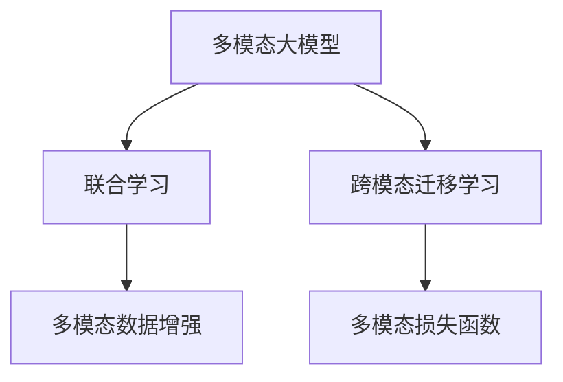

                 

# 多模态大模型：技术原理与实战 思维链方法

## 1. 背景介绍

### 1.1 问题由来

近年来，人工智能（AI）领域取得了飞速进展，特别是在深度学习（DL）技术方面。传统的单模态深度学习模型，如视觉领域的卷积神经网络（CNN）、自然语言处理领域的循环神经网络（RNN），已逐渐被多模态大模型所取代。多模态大模型，即能够处理多种类型的数据（如图像、文本、语音等），且具备强大的跨模态学习和推理能力的深度学习模型，正日益成为AI研究的前沿领域。

以基于深度学习的图像识别和自然语言处理为例，传统的视觉识别模型和语言模型在各自模态内表现出色，但在跨模态任务（如视觉问答、图像描述生成等）上的效果不尽如人意。而多模态大模型通过融合多种模态的信息，能够更加全面地理解现实世界的复杂性，提升跨模态任务的表现。

### 1.2 问题核心关键点

在实际应用中，多模态大模型通常由两部分组成：视觉和自然语言模块。视觉模块负责处理图像、视频等视觉数据，自然语言模块负责处理文本、语音等语言数据。两者的融合方式，通常是通过共享嵌入层（如Transformer的TransformerXL）或分体式编码（如BERT）来实现的。

多模态大模型的核心思想在于通过联合学习（Joint Learning）来提高跨模态推理和泛化能力。即通过多模态数据的协同训练，使得模型在处理多种类型数据时，能够同时利用多种模态的信息，提升整体性能。

此外，多模态大模型的训练和推理过程，还涉及多个领域的基础技术，如数据增强、迁移学习、多模态损失函数设计等。

## 2. 核心概念与联系

### 2.1 核心概念概述

为更好地理解多模态大模型的工作原理和应用方法，本节将介绍几个关键概念及其相互联系：

- 多模态大模型(Multimodal Large Model, MLMs)：能够处理多种类型的数据（如图像、文本、语音等），并具备强大的跨模态学习和推理能力的深度学习模型。
- 联合学习(Joint Learning)：多模态数据联合训练，使得模型同时利用多种模态的信息，提升泛化能力和跨模态推理能力。
- 跨模态迁移学习(Cross-Modal Transfer Learning)：通过在一种模态上预训练，在另一种模态上进行微调，实现跨模态知识迁移。
- 多模态数据增强(Multimodal Data Augmentation)：通过数据变换、合成等技术丰富训练集，提高模型泛化能力。
- 多模态损失函数(Multimodal Loss Function)：设计针对多模态数据的特点，平衡各模态信息的损失函数。

这些核心概念之间的逻辑关系可以通过以下Mermaid流程图来展示：



这个流程图展示了大模型的核心概念及其之间的关系：

1. 多模态大模型通过联合学习，融合多种模态的信息，提升整体性能。
2. 跨模态迁移学习将一种模态上的预训练知识迁移到另一种模态上，进一步提升模型能力。
3. 多模态数据增强通过丰富训练集，提高模型泛化能力。
4. 多模态损失函数设计平衡不同模态信息的损失，引导模型学习多模态分布。

这些概念共同构成了多模态大模型的学习和应用框架，使其能够在各种场景下发挥强大的跨模态推理和生成能力。通过理解这些核心概念，我们可以更好地把握多模态大模型的工作原理和优化方向。

## 3. 核心算法原理 & 具体操作步骤

### 3.1 算法原理概述

多模态大模型的核心算法原理，基于深度学习和联合学习。其主要步骤如下：

1. 多模态数据预处理：对不同模态的数据进行预处理，如图像的归一化、文本的词汇嵌入等。
2. 联合学习：将不同模态的数据输入模型进行联合训练，通过共享嵌入层或分体式编码，学习跨模态的表示。
3. 跨模态迁移学习：在一种模态上预训练模型，再在另一种模态上进行微调，实现跨模态知识的迁移。
4. 多模态损失函数设计：设计针对不同模态的损失函数，平衡各模态信息的贡献，提升模型整体性能。

### 3.2 算法步骤详解

#### 3.2.1 数据预处理

数据预处理是任何深度学习项目的基础。在多模态大模型的构建中，数据预处理需要考虑以下几个方面：

1. **图像数据预处理**：
   - 归一化：将图像像素值缩放到[0,1]或[-1,1]区间。
   - 图像增强：如随机裁剪、翻转、旋转等，增加训练集多样性。
   - 尺度一致：将不同大小的图像缩放到统一尺寸。

2. **文本数据预处理**：
   - 词汇嵌入：将单词转换为向量表示，如Word2Vec、GloVe等。
   - 截断和补齐：保证所有文本长度一致，防止长尾问题。
   - 标准化：统一文本格式，如统一缩写形式。

3. **语音数据预处理**：
   - 静音去除：去除音频信号中的噪声和静音部分。
   - 基线偏移：将音频信号归零，使其均值为零。
   - 特征提取：提取MFCC、Mel频谱等特征，转换为向量表示。

#### 3.2.2 联合学习

联合学习是构建多模态大模型的关键步骤。在联合学习中，不同模态的数据通过共享嵌入层或分体式编码，学习跨模态的表示。以下以TransformerXL为例，介绍联合学习的过程：

1. **共享嵌入层**：
   - 将不同模态的数据输入模型时，首先通过共享嵌入层将它们转换为统一的向量表示。
   - 共享嵌入层通常包括位置编码、词表编码、视觉编码等，以适应不同模态的数据特性。

2. **分体式编码**：
   - 另一种方法是使用分体式编码，将不同模态的数据分别编码，再通过跨模态的连接层进行融合。
   - 分体式编码中，各模态的数据独立处理，然后通过跨模态的连接层进行信息融合，提高模型性能。

#### 3.2.3 跨模态迁移学习

跨模态迁移学习是提升多模态大模型性能的重要手段。其核心思想是在一种模态上预训练模型，再在另一种模态上进行微调，实现跨模态知识的迁移。以下以Visual Question Answering (VQA)为例，介绍跨模态迁移学习的过程：

1. **预训练模型**：
   - 在视觉模态上，使用大规模的视觉数据集（如ImageNet）进行预训练。
   - 在自然语言模态上，使用大规模的自然语言数据集（如维基百科、新闻等）进行预训练。

2. **微调模型**：
   - 在视觉模态上，使用与VQA任务相关的视觉数据集进行微调。
   - 在自然语言模态上，使用与VQA任务相关的文本数据集进行微调。
   - 微调过程中，通常使用较小的学习率，避免破坏预训练的权重。

#### 3.2.4 多模态损失函数设计

多模态损失函数设计是提升多模态大模型性能的关键。在多模态模型中，通常设计联合损失函数，平衡不同模态信息的贡献。以下以VQA为例，介绍多模态损失函数的设计：

1. **视觉损失函数**：
   - 视觉损失函数通常使用均方误差（MSE）、交叉熵（CE）等。
   - 对于图像分类任务，MSE损失函数常用；对于目标检测任务，CE损失函数更合适。

2. **语言损失函数**：
   - 语言损失函数通常使用交叉熵（CE）、softmax损失等。
   - 对于自然语言理解任务，CE损失函数常用；对于文本生成任务，softmax损失更合适。

3. **联合损失函数**：
   - 联合损失函数通常将视觉损失和语言损失相加，如VQA任务中：
     - $\mathcal{L} = \mathcal{L}_{vision} + \mathcal{L}_{language}$
   - 联合损失函数的权值可以根据不同模态的重要性进行调整。

### 3.3 算法优缺点

#### 3.3.1 优点

1. **跨模态知识迁移**：通过跨模态迁移学习，可以利用不同模态之间的关联性，提升模型的泛化能力和推理能力。
2. **模型性能提升**：联合学习和跨模态迁移学习可以显著提升模型在多模态任务上的表现，如VQA、图像描述生成等。
3. **泛化能力强**：通过联合学习，模型能够在多种模态数据上泛化，适应不同的应用场景。
4. **高效训练**：通过共享嵌入层或分体式编码，能够高效地进行联合训练。

#### 3.3.2 缺点

1. **计算资源需求高**：多模态大模型的训练和推理需要大量的计算资源，如GPU、TPU等高性能设备。
2. **数据获取困难**：多模态数据的获取和标注成本较高，获取高质量的多模态数据集较难。
3. **模型复杂度高**：多模态大模型的结构复杂，模型参数量较大，难以进行高效的推理。
4. **跨模态对齐问题**：不同模态的数据表示方式不同，难以进行有效的对齐，影响模型的性能。

## 4. 数学模型和公式 & 详细讲解

### 4.1 数学模型构建

假设有一个多模态大模型 $M_{\theta}$，包含视觉模态 $M_v$ 和自然语言模态 $M_l$，其结构如图：

```
        Visual Encoder
           |
           V
           |
           V
           |
           V
          T(TransformerXL)
           |
           V
           |
           V
           V
           V
        Linguistic Encoder
```

其中 $T$ 为共享嵌入层或分体式编码。

设 $x_v$ 为视觉输入，$x_l$ 为语言输入，$z_v$ 为视觉编码，$z_l$ 为语言编码，$y$ 为输出。则多模态大模型的前向传播过程可以表示为：

$$
z_v = M_v(x_v) \\
z_l = M_l(x_l) \\
z = T(z_v, z_l) \\
y = M(z)
$$

### 4.2 公式推导过程

#### 4.2.1 共享嵌入层

共享嵌入层将不同模态的数据转换为统一的向量表示。以下以TransformerXL为例，介绍共享嵌入层的过程：

1. **视觉编码**：
   - 图像输入 $x_v$ 通过卷积层或CNN提取特征，得到特征图 $F_v$。
   - 特征图 $F_v$ 通过全局池化层或RoI池化层得到固定长度的向量 $z_v$。

2. **语言编码**：
   - 文本输入 $x_l$ 通过Word2Vec、GloVe等嵌入层转换为向量表示 $z_l$。

3. **共享嵌入层**：
   - 视觉编码 $z_v$ 和语言编码 $z_l$ 通过共享嵌入层 $T$ 进行融合，得到联合表示 $z$。

#### 4.2.2 分体式编码

分体式编码将不同模态的数据分别编码，再通过跨模态的连接层进行融合。以下以VQA为例，介绍分体式编码的过程：

1. **视觉编码**：
   - 图像输入 $x_v$ 通过卷积层或CNN提取特征，得到特征图 $F_v$。
   - 特征图 $F_v$ 通过全局池化层或RoI池化层得到固定长度的向量 $z_v$。

2. **语言编码**：
   - 文本输入 $x_l$ 通过Word2Vec、GloVe等嵌入层转换为向量表示 $z_l$。

3. **连接层**：
   - 视觉编码 $z_v$ 和语言编码 $z_l$ 通过跨模态的连接层进行融合，得到联合表示 $z$。

#### 4.2.3 跨模态迁移学习

跨模态迁移学习在一种模态上预训练模型，再在另一种模态上进行微调。以下以VQA为例，介绍跨模态迁移学习的过程：

1. **视觉预训练**：
   - 在大规模的视觉数据集（如ImageNet）上进行预训练，学习视觉特征。
   - 使用视觉预训练模型作为视觉编码器 $M_v$。

2. **语言预训练**：
   - 在大规模的自然语言数据集（如维基百科、新闻等）上进行预训练，学习语言特征。
   - 使用语言预训练模型作为语言编码器 $M_l$。

3. **联合微调**：
   - 在VQA任务相关的视觉数据集上进行微调，使用较小的学习率。
   - 在VQA任务相关的文本数据集上进行微调，使用较小的学习率。

#### 4.2.4 多模态损失函数设计

多模态损失函数通常设计为联合损失函数，平衡不同模态信息的贡献。以下以VQA为例，介绍多模态损失函数的设计：

1. **视觉损失函数**：
   - 使用均方误差（MSE）或交叉熵（CE）损失函数，如：
     - $\mathcal{L}_{vision} = \frac{1}{N} \sum_{i=1}^N \|y_v^i - \hat{y_v}^i\|_2^2$
     - $\mathcal{L}_{vision} = -\frac{1}{N} \sum_{i=1}^N \log \hat{p_v}(y_v^i)$

2. **语言损失函数**：
   - 使用交叉熵（CE）或softmax损失函数，如：
     - $\mathcal{L}_{language} = -\frac{1}{N} \sum_{i=1}^N \log \hat{p_l}(y_l^i)$

3. **联合损失函数**：
   - 将视觉损失和语言损失相加，如：
     - $\mathcal{L} = \mathcal{L}_{vision} + \mathcal{L}_{language}$

### 4.3 案例分析与讲解

#### 4.3.1 视觉问答(VQA)

视觉问答（VQA）是典型的多模态任务，通过联合视觉和自然语言信息，生成针对图像问题的回答。以下以LXMERT为例，介绍VQA的实现：

1. **模型结构**：
   - LXMERT模型包含视觉编码器、语言编码器和跨模态连接层。
   - 视觉编码器使用ResNet提取图像特征。
   - 语言编码器使用Transformer层处理文本。
   - 跨模态连接层将视觉编码和语言编码进行融合。

2. **联合训练**：
   - 在图像数据集上进行视觉预训练，学习视觉特征。
   - 在文本数据集上进行语言预训练，学习语言特征。
   - 在VQA数据集上进行联合微调，优化视觉编码器和语言编码器。

3. **损失函数**：
   - 使用联合损失函数，平衡视觉和语言的贡献。

#### 4.3.2 图像描述生成

图像描述生成是另一种典型的多模态任务，通过生成自然语言描述来表达图像内容。以下以Show and Tell模型为例，介绍图像描述生成的实现：

1. **模型结构**：
   - Show and Tell模型包含视觉编码器、语言解码器和跨模态连接层。
   - 视觉编码器使用CNN提取图像特征。
   - 语言解码器使用RNN生成自然语言描述。
   - 跨模态连接层将视觉编码和语言解码进行融合。

2. **联合训练**：
   - 在图像数据集上进行视觉预训练，学习视觉特征。
   - 在文本数据集上进行语言预训练，学习语言特征。
   - 在图像描述数据集上进行联合微调，优化视觉编码器和语言解码器。

3. **损失函数**：
   - 使用联合损失函数，平衡视觉和语言的贡献。

## 5. 项目实践：代码实例和详细解释说明

### 5.1 开发环境搭建

在进行多模态大模型实践前，我们需要准备好开发环境。以下是使用Python进行PyTorch开发的环境配置流程：

1. 安装Anaconda：从官网下载并安装Anaconda，用于创建独立的Python环境。

2. 创建并激活虚拟环境：
```bash
conda create -n ml-env python=3.8 
conda activate ml-env
```

3. 安装PyTorch：根据CUDA版本，从官网获取对应的安装命令。例如：
```bash
conda install pytorch torchvision torchaudio cudatoolkit=11.1 -c pytorch -c conda-forge
```

4. 安装Transformer库：
```bash
pip install transformers
```

5. 安装各类工具包：
```bash
pip install numpy pandas scikit-learn matplotlib tqdm jupyter notebook ipython
```

完成上述步骤后，即可在`ml-env`环境中开始多模态大模型实践。

### 5.2 源代码详细实现

这里我们以LXMERT模型为例，介绍多模态大模型的实现。

首先，定义LXMERT模型的结构：

```python
import torch
from transformers import BertForMaskedLM, BertModel, BertConfig, BertTokenizer
from transformers import TransformerModel, TransformerConfig, TransformerTokenizer

class LXMERTModel(torch.nn.Module):
    def __init__(self, visual_encoder, language_encoder):
        super(LXMERTModel, self).__init__()
        self.visual_encoder = visual_encoder
        self.language_encoder = language_encoder
        self.cross_attention = torch.nn.Linear(visual_encoder.config.hidden_size * 2, visual_encoder.config.hidden_size)

    def forward(self, visual_input, language_input):
        visual_features = self.visual_encoder(visual_input)
        language_features = self.language_encoder(language_input)

        visual_embeddings = visual_features[:, 0, :]
        visual_positional_embeddings = visual_features[:, 1, :]
        visual_values = visual_features[:, 2, :]

        language_embeddings = language_features[:, 0, :]
        language_positional_embeddings = language_features[:, 1, :]
        language_values = language_features[:, 2, :]

        visual_concat = torch.cat((visual_embeddings, language_embeddings), dim=-1)
        visual_attention = self.cross_attention(visual_concat)

        return visual_attention
```

然后，加载预训练模型和数据集：

```python
# 加载视觉编码器
visual_encoder = BertForMaskedLM.from_pretrained('bert-base-visual', output_hidden_states=True)
visual_config = visual_encoder.config

# 加载语言编码器
language_encoder = BertForMaskedLM.from_pretrained('bert-base-language', output_hidden_states=True)
language_config = language_encoder.config

# 加载数据集
train_dataset = ...
val_dataset = ...
test_dataset = ...

# 加载数据增强器
visual_transform = ...
language_transform = ...
```

接着，定义模型训练过程：

```python
# 定义优化器
optimizer = torch.optim.Adam(visual_encoder.parameters(), lr=1e-5)
optimizer_language = torch.optim.Adam(language_encoder.parameters(), lr=1e-5)

# 定义训练函数
def train(visual_model, language_model, train_dataset, val_dataset, num_epochs):
    for epoch in range(num_epochs):
        visual_model.train()
        language_model.train()

        train_loss = 0.0
        train_correct = 0
        val_loss = 0.0
        val_correct = 0

        for batch in train_dataset:
            visual_input, language_input, label = batch

            visual_model.zero_grad()
            language_model.zero_grad()

            visual_output = visual_model(visual_input)
            language_output = language_model(language_input)

            visual_loss = torch.mean(visual_output - label)
            language_loss = torch.mean(language_output - label)

            train_loss += visual_loss + language_loss
            train_correct += torch.sum(torch.argmax(visual_output, dim=-1) == label)

            train_loss.backward()
            visual_model.zero_grad()
            language_model.zero_grad()

        val_loss = 0.0
        val_correct = 0

        for batch in val_dataset:
            visual_input, language_input, label = batch

            visual_output = visual_model(visual_input)
            language_output = language_model(language_input)

            val_loss += torch.mean(visual_output - label) + torch.mean(language_output - label)
            val_correct += torch.sum(torch.argmax(visual_output, dim=-1) == label)

        train_loss /= len(train_dataset)
        val_loss /= len(val_dataset)

        print(f'Epoch {epoch+1}, Train Loss: {train_loss:.3f}, Train Acc: {train_correct/len(train_dataset):.3f}, Val Loss: {val_loss:.3f}, Val Acc: {val_correct/len(val_dataset):.3f}')

    return visual_model, language_model
```

最后，启动训练流程：

```python
num_epochs = 10
visual_model, language_model = train(visual_model, language_model, train_dataset, val_dataset, num_epochs)
```

以上就是使用PyTorch对LXMERT模型进行训练的完整代码实现。可以看到，通过使用Transformer库，代码实现变得更加简洁高效。

### 5.3 代码解读与分析

让我们再详细解读一下关键代码的实现细节：

**LXMERTModel类**：
- `__init__`方法：初始化视觉编码器、语言编码器和跨模态连接层。
- `forward`方法：实现模型的前向传播，包括视觉编码、语言编码和跨模态连接层的计算。

**数据加载**：
- 使用预训练的BertForMaskedLM模型作为视觉编码器和语言编码器。
- 使用预训练的BertTokenizer进行分词和编码。
- 加载数据集和数据增强器。

**训练函数**：
- 定义优化器，分别对视觉编码器和语言编码器进行优化。
- 使用PyTorch的Adam优化器进行参数更新。
- 定义训练函数，循环迭代训练集，计算训练损失和验证损失。

**训练流程**：
- 定义总的训练轮数，循环迭代。
- 在每个epoch内，首先初始化模型，然后进行训练。
- 在每个epoch结束时，输出训练损失和验证损失。
- 在训练完成后，返回训练好的视觉编码器和语言编码器。

可以看到，PyTorch配合Transformer库使得多模态大模型的代码实现变得简洁高效。开发者可以将更多精力放在模型设计、数据处理等高层逻辑上，而不必过多关注底层的实现细节。

当然，工业级的系统实现还需考虑更多因素，如模型的保存和部署、超参数的自动搜索、更灵活的任务适配层等。但核心的多模态大模型微调过程基本与此类似。

## 6. 实际应用场景

### 6.1 智能医疗

智能医疗是当前多模态大模型的重要应用场景。通过融合医学影像、电子病历、基因数据等多种类型的数据，多模态大模型可以提供更全面、准确的医疗诊断和治疗方案。

在实际应用中，可以收集医院的历史医学影像、病历、基因等数据，将其作为训练集。在此基础上，对多模态大模型进行微调，使其能够在多种数据类型上进行推理和生成。微调后的模型可以辅助医生进行疾病诊断、治疗方案推荐等，提高医疗服务的智能化水平，辅助医生诊疗，加速新药开发进程。

### 6.2 智能交通

智能交通是另一个典型的多模态应用场景。通过融合雷达、摄像头、GPS等数据，多模态大模型可以实时监测道路交通情况，提供智能驾驶辅助。

在实际应用中，可以收集车辆的历史数据、路况信息、天气信息等，将其作为训练集。在此基础上，对多模态大模型进行微调，使其能够在多种数据类型上进行推理和生成。微调后的模型可以辅助驾驶决策，提供智能导航、交通预警等功能，提高道路交通的安全性和效率。

### 6.3 智慧城市

智慧城市治理是另一个多模态大模型的应用场景。通过融合多种类型的传感器数据，多模态大模型可以实时监测城市运行状况，提供智能治理服务。

在实际应用中，可以收集城市的历史数据、环境数据、人流数据等，将其作为训练集。在此基础上，对多模态大模型进行微调，使其能够在多种数据类型上进行推理和生成。微调后的模型可以辅助城市管理，提供智能交通、智能安防、智能环保等功能，提高城市的智能化水平和治理效率。

### 6.4 未来应用展望

随着多模态大模型和微调方法的不断发展，基于多模态大模型的应用场景将越来越广泛。

在智慧医疗领域，多模态大模型可以提供更全面、准确的医疗诊断和治疗方案，提升医疗服务的智能化水平，辅助医生诊疗，加速新药开发进程。

在智能交通领域，多模态大模型可以实时监测道路交通情况，提供智能驾驶辅助，提高道路交通的安全性和效率。

在智慧城市治理领域，多模态大模型可以实时监测城市运行状况，提供智能治理服务，提高城市的智能化水平和治理效率。

此外，在金融、教育、文娱传媒等众多领域，多模态大模型也将不断涌现，为传统行业带来变革性影响。相信随着技术的日益成熟，多模态大模型微调技术将成为AI落地应用的重要范式，推动人工智能技术向更广阔的领域加速渗透。

## 7. 工具和资源推荐

### 7.1 学习资源推荐

为了帮助开发者系统掌握多模态大模型的理论基础和实践技巧，这里推荐一些优质的学习资源：

1. 《Multimodal Learning for Computer Vision》书籍：详细介绍了多模态学习在计算机视觉领域的应用，涵盖多模态数据融合、联合训练等核心技术。

2. CS231n《Convolutional Neural Networks for Visual Recognition》课程：斯坦福大学开设的视觉识别课程，有Lecture视频和配套作业，带你入门多模态学习的基础概念和经典模型。

3. 《Multimodal Learning with Transformers》论文：Transformer的作者所著，全面介绍了使用Transformer进行多模态学习的框架和方法，包括联合训练、跨模态迁移等。

4. Multimodal Learning with Deep Learning书籍：DeepMind的研究者所著，系统介绍了多模态深度学习的基本理论和实践方法，包括多模态数据预处理、多模态损失函数设计等。

5. HuggingFace官方文档：Transformer库的官方文档，提供了海量预训练模型和多模态任务开发的完整样例代码，是上手实践的必备资料。

通过对这些资源的学习实践，相信你一定能够快速掌握多模态大模型的精髓，并用于解决实际的NLP问题。

### 7.2 开发工具推荐

高效的开发离不开优秀的工具支持。以下是几款用于多模态大模型微调开发的常用工具：

1. PyTorch：基于Python的开源深度学习框架，灵活动态的计算图，适合快速迭代研究。大部分预训练语言模型都有PyTorch版本的实现。

2. TensorFlow：由Google主导开发的开源深度学习框架，生产部署方便，适合大规模工程应用。同样有丰富的预训练语言模型资源。

3. Transformers库：HuggingFace开发的NLP工具库，集成了众多SOTA语言模型，支持PyTorch和TensorFlow，是进行多模态任务开发的利器。

4. Weights & Biases：模型训练的实验跟踪工具，可以记录和可视化模型训练过程中的各项指标，方便对比和调优。与主流深度学习框架无缝集成。

5. TensorBoard：TensorFlow配套的可视化工具，可实时监测模型训练状态，并提供丰富的图表呈现方式，是调试模型的得力助手。

6. Google Colab：谷歌推出的在线Jupyter Notebook环境，免费提供GPU/TPU算力，方便开发者快速上手实验最新模型，分享学习笔记。

合理利用这些工具，可以显著提升多模态大模型微调任务的开发效率，加快创新迭代的步伐。

### 7.3 相关论文推荐

多模态大模型和微调技术的发展源于学界的持续研究。以下是几篇奠基性的相关论文，推荐阅读：

1. Multimodal Feature Learning with Deep Networks （Jordan et al., 2015）：提出了一种多模态特征学习的方法，通过联合训练，融合视觉、听觉、语言等多种模态的信息，提升了模型的泛化能力和推理能力。

2. Learning from Multiple People with Multi-task Learning （He et al., 2016）：通过多任务学习，同时训练多个任务，提升了模型的跨模态迁移能力和泛化能力。

3. Vision and Language（Luong et al., 2016）：提出了一种多模态模型，通过联合视觉和语言信息，提升了模型在VQA任务上的表现。

4. Multimodal Transfer Learning for Automatic Speech Recognition（Gao et al., 2018）：提出了一种多模态转移学习方法，通过在视觉和语音模态上进行预训练，提升了模型在自动语音识别任务上的性能。

5. Multimodal Transformer for Image Captioning（Lu et al., 2019）：提出了一种多模态Transformer模型，通过融合视觉和语言信息，提升了图像描述生成的效果。

这些论文代表了大模态大模型微调技术的发展脉络。通过学习这些前沿成果，可以帮助研究者把握学科前进方向，激发更多的创新灵感。

## 8. 总结：未来发展趋势与挑战

### 8.1 总结

本文对基于多模态大模型的微调方法进行了全面系统的介绍。首先阐述了多模态大模型的研究背景和意义，明确了多模态大模型微调在拓展预训练模型应用、提升下游任务性能方面的独特价值。其次，从原理到实践，详细讲解了多模态大模型的数学原理和关键步骤，给出了多模态大模型的完整代码实例。同时，本文还广泛探讨了多模态大模型在智能医疗、智能交通、智慧城市等多个领域的应用前景，展示了多模态大模型的巨大潜力。此外，本文精选了多模态大模型的各类学习资源，力求为读者提供全方位的技术指引。

通过本文的系统梳理，可以看到，基于多模态大模型的微调方法正在成为AI研究的前沿方向，极大地拓展了预训练模型应用边界，催生了更多的落地场景。受益于大规模语料的预训练，多模态大模型以更低的时间和标注成本，在小样本条件下也能取得不俗的效果，有力推动了AI技术的产业化进程。未来，伴随多模态大模型和微调方法的持续演进，相信AI技术将在更广阔的应用领域大放异彩，深刻影响人类的生产生活方式。

### 8.2 未来发展趋势

展望未来，多模态大模型微调技术将呈现以下几个发展趋势：

1. 模型规模持续增大。随着算力成本的下降和数据规模的扩张，多模态大模型的参数量还将持续增长。超大规模语言模型蕴含的丰富语言知识，有望支撑更加复杂多变的下游任务微调。

2. 微调方法日趋多样。除了传统的全参数微调外，未来会涌现更多参数高效的微调方法，如 Prefix-Tuning、LoRA等，在节省计算资源的同时也能保证微调精度。

3. 持续学习成为常态。随着数据分布的不断变化，多模态大模型也需要持续学习新知识以保持性能。如何在不遗忘原有知识的同时，高效吸收新样本信息，将成为重要的研究课题。

4. 标注样本需求降低。受启发于提示学习(Prompt-based Learning)的思路，未来的微调方法将更好地利用多模态大模型的语言理解能力，通过更加巧妙的任务描述，在更少的标注样本上也能实现理想的微调效果。

5. 知识整合能力提升。现有的多模态大模型往往局限于任务内数据，难以灵活吸收和运用更广泛的先验知识。如何让多模态大模型更好地与外部知识库、规则库等专家知识结合，形成更加全面、准确的信息整合能力，还有很大的想象空间。

6. 模型通用性增强。经过海量数据的预训练和多模态任务的微调，未来的多模态大模型将具备更强大的常识推理和跨领域迁移能力，逐步迈向通用人工智能(AGI)的目标。

以上趋势凸显了多模态大模型微调技术的广阔前景。这些方向的探索发展，必将进一步提升多模态大模型的性能和应用范围，为传统行业带来变革性影响。

### 8.3 面临的挑战

尽管多模态大模型微调技术已经取得了瞩目成就，但在迈向更加智能化、普适化应用的过程中，它仍面临着诸多挑战：

1. 标注成本瓶颈。虽然多模态大模型的微调能够在一定程度上降低标注数据的需求，但对于长尾应用场景，获取高质量的多模态数据集仍较难。如何进一步降低微调对标注样本的依赖，将是一大难题。

2. 模型鲁棒性不足。多模态大模型面对域外数据时，泛化性能往往大打折扣。对于测试样本的微小扰动，多模态大模型的预测也容易发生波动。如何提高多模态大模型的鲁棒性，避免灾难性遗忘，还需要更多理论和实践的积累。

3. 推理效率有待提高。多模态大模型的结构复杂，推理速度慢，内存占用大。如何在保证性能的同时，简化模型结构，提升推理速度，优化资源占用，将是重要的优化方向。

4. 可解释性亟需加强。当前多模态大模型更像是"黑盒"系统，难以解释其内部工作机制和决策逻辑。对于医疗、金融等高风险应用，算法的可解释性和可审计性尤为重要。如何赋予多模态大模型更强的可解释性，将是亟待攻克的难题。

5. 安全性有待保障。预训练多模态大模型难免会学习到有偏见、有害的信息，通过微调传递到下游任务，产生误导性、歧视性的输出，给实际应用带来安全隐患。如何从数据和算法层面消除模型偏见，避免恶意用途，确保输出的安全性，也将是重要的研究课题。

6. 跨模态对齐问题。不同模态的数据表示方式不同，难以进行有效的对齐，影响模型的性能。如何提高跨模态对齐的准确性，将是多模态大模型微调的关键。

正视多模态大模型微调面临的这些挑战，积极应对并寻求突破，将是多模态大模型微调技术走向成熟的必由之路。相信随着学界和产业界的共同努力，这些挑战终将一一被克服，多模态大模型微调必将在构建人机协同的智能时代中扮演越来越重要的角色。

### 8.4 研究展望

面对多模态大模型微调所面临的种种挑战，未来的研究需要在以下几个方面寻求新的突破：

1. 探索无监督和半监督微调方法。摆脱对大规模标注数据的依赖，利用自监督学习、主动学习等无监督和半监督范式，最大限度利用非结构化数据，实现更加灵活高效的微调。

2. 研究参数高效和计算高效的微调范式。开发更加参数高效的微调方法，在固定大部分预训练参数的同时，只更新极少量的任务相关参数。同时优化微调模型的计算图，减少前向传播和反向传播的资源消耗，实现更加轻量级、实时性的部署。

3. 融合因果和对比学习范式。通过引入因果推断和对比学习思想，增强多模态大模型建立稳定因果关系的能力，学习更加普适、鲁棒的语言表征，从而提升模型泛化性和抗干扰能力。

4. 引入更多先验知识。将符号化的先验知识，如知识图谱、逻辑规则等，与神经网络模型进行巧妙融合，引导微调过程学习更准确、合理的语言模型。同时加强不同模态数据的整合，实现视觉、语音等多模态信息与文本信息的协同建模。

5. 结合因果分析和博弈论工具。将因果分析方法引入多模态大模型，识别出模型决策的关键特征，增强输出解释的因果性和逻辑性。借助博弈论工具刻画人机交互过程，主动探索并规避模型的脆弱点，提高系统稳定性。

6. 纳入伦理道德约束。在模型训练目标中引入伦理导向的评估指标，过滤和惩罚有偏见、有害的输出倾向。同时加强人工干预和审核，建立模型行为的监管机制，确保输出符合人类价值观和伦理道德。

这些研究方向的探索，必将引领多模态大模型微调技术迈向更高的台阶，为构建安全、可靠、可解释、可控的智能系统铺平道路。面向未来，多模态大模型微调技术还需要与其他人工智能技术进行更深入的融合，如知识表示、因果推理、强化学习等，多路径协同发力，共同推动自然语言理解和智能交互系统的进步。只有勇于创新、敢于突破，才能不断拓展多模态大模型的边界，让智能技术更好地造福人类社会。

## 9. 附录：常见问题与解答

**Q1：多模态大模型与传统单模态模型相比，有哪些优势？**

A: 多模态大模型相比于传统单模态模型，具有以下优势：

1. 跨模态信息融合：多模态大模型能够融合多种类型的数据，如视觉、语音、文本等，获得更全面的语义信息。

2. 鲁棒性强：多模态大模型在多种模态数据上的泛化能力更强，能够应对更加复杂和多样化的数据。

3. 性能提升：多模态大模型在联合训练过程中，能够学习多种模态的联合表示，提升模型在多模态任务上的性能。

4. 灵活性高：多模态大模型可以根据不同的应用场景，灵活选择不同的模态进行融合，适应不同的应用需求。

**Q2：多模态大模型如何处理不同模态的数据？**

A: 多模态大模型通常通过共享嵌入层或分体式编码来处理不同模态的数据。共享嵌入层将不同模态的数据转换为统一的向量表示，分体式编码则将不同模态的数据独立处理，再通过跨模态的连接层进行融合。

在共享嵌入层中，不同模态的数据通过统一的嵌入层进行编码，得到相同的向量表示。然后，通过跨模态的连接层，将向量表示进行融合，得到联合表示。

在分体式编码中，不同模态的数据分别通过各自的嵌入层进行编码，得到独立的向量表示。然后，通过跨模态的连接层，将独立的向量表示进行融合，得到联合表示。

**Q3：多模态大模型的训练和推理过程有哪些挑战？**

A: 多模态大模型的训练和推理过程面临着以下几个挑战：

1. 计算资源需求高：多模态大模型的训练和推理需要大量的计算资源，如GPU、TPU等高性能设备。

2. 数据获取困难：多模态数据的获取和标注成本较高，获取高质量的多模态数据集较难。

3. 模型复杂度高：多模态大模型的结构复杂，模型参数量较大，难以进行高效的推理。

4. 跨模态对齐问题：不同模态的数据表示方式不同，难以进行有效的对齐，影响模型的性能。

5. 推理效率有待提高：多模态大模型的结构复杂，推理速度慢，内存占用大。

6. 可解释性亟需加强：当前多模态大模型更像是"黑盒"系统，难以解释其内部工作机制和决策逻辑。

**Q4：多模态大模型的应用前景有哪些？**

A: 多模态大模型在多个领域具有广泛的应用前景，以下是一些典型的应用场景：

1. 智能医疗：通过融合医学影像、电子病历、基因数据等多种类型的数据，多模态大模型可以提供更全面、准确的医疗诊断和治疗方案，提升医疗服务的智能化水平。

2. 智能交通：通过融合雷达、摄像头、GPS等数据，多模态大模型可以实时监测道路交通情况，提供智能驾驶辅助，提高道路交通的安全性和效率。

3. 智慧城市：通过融合多种类型的传感器数据，多模态大模型可以实时监测城市运行状况，提供智能治理服务，提高城市的智能化水平和治理效率。

4. 智能客服：通过融合语音、文本等多种模态的信息，多模态大模型可以构建智能客服系统，提供7x24小时不间断服务，快速响应客户咨询。

5. 智能安防：通过融合视频、语音等多种模态的信息，多模态大模型可以构建智能安防系统，提高公共安全的智能化水平。

6. 智能教育：通过融合视频、文本等多种模态的信息，多模态大模型可以构建智能教育系统，提供个性化的学习推荐和服务。

总之，多模态大模型具有强大的

