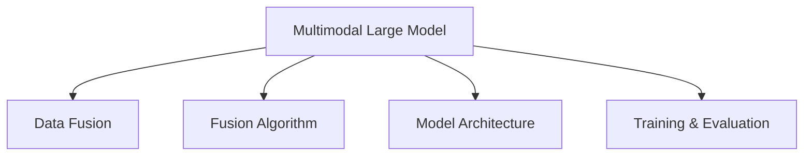

                 

# 多模态大模型：技术原理与实战 感知能力评测

> 关键词：多模态大模型,感知能力评测,技术原理,实战应用,学习资源,工具推荐

## 1. 背景介绍

### 1.1 问题由来

随着深度学习技术的发展，大模型已经在多个领域展示了其强大的能力。然而，单一的文本模型在处理复杂多模态信息时，往往显得力不从心。例如，在医学领域，医生的诊断和治疗建议不仅需要参考患者的文本信息，还需要查看其影像、检验结果等数据；在教育领域，老师需要结合学生的表情、动作等非语言信息来更好地理解学生的学习状态。为此，多模态大模型应运而生，它通过融合多种数据类型，提升了模型对复杂多模态信息的感知能力，从而在各个领域展现出卓越的性能。

### 1.2 问题核心关键点

多模态大模型技术的核心在于如何有效地融合和处理多种类型的数据。具体来说，以下问题是研究的重点：

- 数据融合：如何将不同模态的数据表示统一到一个模型中进行处理。
- 模型架构：如何设计一个能够高效处理多模态数据的模型。
- 算法优化：在数据融合和模型处理过程中，如何选择合适的算法来优化模型的性能。

多模态大模型的研究主要集中在计算机视觉、自然语言处理、声音处理等领域，应用场景包括医学影像诊断、教育评估、智能推荐系统等。

### 1.3 问题研究意义

研究多模态大模型，对于拓展大模型的应用范围，提升其对复杂多模态信息的感知能力，具有重要意义：

1. 提升模型泛化能力。多模态数据的多样性可以提升模型的泛化能力，使其在处理未知数据时表现更佳。
2. 增强模型的解释性。多模态大模型能够提供更丰富的信息，帮助理解模型的决策过程，提高模型的可解释性。
3. 提高模型实用性。多模态大模型能够更好地结合现实世界的各种信息，提供更加实用和准确的结果。
4. 推动技术进步。多模态大模型的研究能够促进计算机视觉、自然语言处理、声音处理等领域的技术进步，推动人工智能技术的进一步发展。

## 2. 核心概念与联系

### 2.1 核心概念概述

为更好地理解多模态大模型的技术原理和应用方法，本节将介绍几个密切相关的核心概念：

- 多模态大模型：融合多种数据类型的大模型，例如文本、图像、声音等，能够处理多模态信息，提升模型的感知能力。
- 感知能力：指模型理解、处理、生成多模态数据的能力，包括视觉感知、语言理解、声音识别等。
- 融合算法：指将不同模态的数据融合到模型中进行处理的算法，如时序对应算法、特征融合算法等。
- 模型架构：指设计多模态大模型时采用的结构，如Encoder-Decoder结构、Attention机制等。
- 训练与评估：指对多模态大模型进行训练和评估的方法，包括数据准备、模型优化、性能评估等。

这些核心概念之间的逻辑关系可以通过以下Mermaid流程图来展示：



这个流程图展示了多模态大模型的核心概念及其之间的关系：

1. 多模态大模型融合了多种模态的数据，通过感知能力处理这些数据。
2. 融合算法帮助将不同模态的数据表示统一到模型中进行处理。
3. 模型架构设计了如何高效处理多模态数据的结构。
4. 训练与评估确保了模型在数据上的学习和性能优化。

## 3. 核心算法原理 & 具体操作步骤
### 3.1 算法原理概述

多模态大模型的技术原理主要涉及数据融合、模型架构设计和算法优化三个方面。以下是各部分的简要描述：

- 数据融合：通过融合算法将不同模态的数据表示统一到一个模型中进行处理，如时序对应算法、特征融合算法等。
- 模型架构：设计一个能够高效处理多模态数据的模型，如Encoder-Decoder结构、Attention机制等。
- 算法优化：选择合适的算法来优化模型的性能，如梯度下降算法、优化器等。

### 3.2 算法步骤详解

多模态大模型的微调一般包括以下几个关键步骤：

**Step 1: 准备多模态数据集**

- 收集多模态数据集，包括图像、文本、声音等，并将其分为训练集、验证集和测试集。
- 确保不同模态的数据格式一致，便于后续融合处理。

**Step 2: 设计融合算法**

- 选择合适的融合算法，如时序对应算法、特征融合算法等。
- 对不同模态的数据进行预处理，如归一化、标准化等，以便融合。
- 使用融合算法将不同模态的数据表示统一到一个模型中进行处理。

**Step 3: 设计模型架构**

- 设计一个能够高效处理多模态数据的模型架构，如Encoder-Decoder结构、Attention机制等。
- 在模型中加入多模态融合层，将不同模态的数据表示融合在一起。
- 设计任务特定的输出层，如分类、回归、生成等。

**Step 4: 设置微调超参数**

- 选择合适的优化算法及其参数，如AdamW、SGD等，设置学习率、批大小、迭代轮数等。
- 设置正则化技术及强度，包括权重衰减、Dropout、Early Stopping等。
- 确定冻结预训练参数的策略，如仅微调顶层，或全部参数都参与微调。

**Step 5: 执行梯度训练**

- 将训练集数据分批次输入模型，前向传播计算损失函数。
- 反向传播计算参数梯度，根据设定的优化算法和学习率更新模型参数。
- 周期性在验证集上评估模型性能，根据性能指标决定是否触发 Early Stopping。
- 重复上述步骤直到满足预设的迭代轮数或 Early Stopping 条件。

**Step 6: 测试和部署**

- 在测试集上评估微调后模型性能，对比微调前后的精度提升。
- 使用微调后的模型对新样本进行推理预测，集成到实际的应用系统中。
- 持续收集新的数据，定期重新微调模型，以适应数据分布的变化。

### 3.3 算法优缺点

多模态大模型在融合多种数据类型、提升模型感知能力方面具有以下优点：

1. 提高了模型的泛化能力。多模态数据的多样性可以提升模型的泛化能力，使其在处理未知数据时表现更佳。
2. 增强了模型的解释性。多模态大模型能够提供更丰富的信息，帮助理解模型的决策过程，提高模型的可解释性。
3. 提高了模型的实用性。多模态大模型能够更好地结合现实世界的各种信息，提供更加实用和准确的结果。

然而，该方法也存在一定的局限性：

1. 数据获取难度大。不同模态的数据获取难度不同，有些数据类型难以获取，如实时生理数据。
2. 计算复杂度高。多模态数据融合和模型训练的计算复杂度高，需要高性能计算资源。
3. 数据格式不统一。不同模态的数据格式不同，融合处理时需要额外处理。
4. 算法设计复杂。多模态数据的融合算法设计复杂，需要考虑不同模态的特征、权重等因素。
5. 数据隐私问题。多模态数据可能包含敏感信息，数据隐私问题需要特别关注。

尽管存在这些局限性，但多模态大模型在处理复杂多模态信息时展现了巨大的潜力，值得进一步研究和应用。

### 3.4 算法应用领域

多模态大模型在多个领域得到了广泛应用，例如：

- 医学影像诊断：融合医学影像和病历信息，提升疾病诊断的准确性。
- 教育评估：结合学生的表情、动作等非语言信息，评估学生的学习状态。
- 智能推荐系统：融合用户的历史行为数据和实时反馈，推荐更符合用户需求的内容。
- 安防监控：融合视频、声音等多模态数据，提升监控系统的准确性和智能性。

除了上述这些经典应用外，多模态大模型还被创新性地应用到更多场景中，如医疗影像分割、情感分析、智能家居等，为多模态数据处理带来了全新的突破。

## 4. 数学模型和公式 & 详细讲解 & 举例说明（备注：数学公式请使用latex格式，latex嵌入文中独立段落使用 $$，段落内使用 $)
### 4.1 数学模型构建

以下介绍多模态大模型常用的数学模型和公式。

**Encoder-Decoder架构**

假设多模态数据集 $\{(x_i, y_i)\}_{i=1}^N$，其中 $x_i$ 为多模态数据，$y_i$ 为标签。

设多模态大模型的编码为 $f_E(x_i) = [f_E^{(1)}(x_i^{(1)}), f_E^{(2)}(x_i^{(2)})]$，解码为 $f_D(f_E(x_i), y_i) = [f_D^{(1)}(f_E^{(1)}(x_i^{(1)}), y_i), f_D^{(2)}(f_E^{(2)}(x_i^{(2)}), y_i)]$。

多模态大模型的数学模型为：

$$
\begin{aligned}
L(x_i, y_i) &= \mathbb{E}_{y_i|x_i} \left[ \sum_{k=1}^K \ell_k(f_D^{(k)}(f_E^{(k)}(x_i^{(k)}), y_i) \right] \\
&= \sum_{k=1}^K \frac{1}{N} \sum_{i=1}^N \ell_k(f_D^{(k)}(f_E^{(k)}(x_i^{(k)}), y_i)
\end{aligned}
$$

其中 $K$ 为模态数，$\ell_k$ 为任务特定的损失函数，如交叉熵损失、均方误差损失等。

**时序对应算法**

时序对应算法是一种常用的融合算法，将不同模态的数据表示统一到一个模型中进行处理。

假设文本序列 $x^{(1)} = (x_1, x_2, ..., x_n)$，图像序列 $x^{(2)} = (x_1', x_2', ..., x_m')$，其中 $x_i^{(1)}$ 和 $x_i^{(2)}$ 表示第 $i$ 个时间步的文本和图像表示。

时序对应算法将文本和图像序列映射到一个公共的时间步序列 $x = (x_1', x_1, x_2', x_2, ..., x_m', x_n)$。

设文本嵌入为 $h_i^{(1)}$，图像嵌入为 $h_i^{(2)}$，公共嵌入为 $h_i$。

时序对应算法计算公式为：

$$
h_i = \text{softmax}(W_1h_{i-1}^{(1)} + W_2h_{i-1}^{(2)} + b_1) \cdot h_{i-1}^{(1)} + (1 - \text{softmax}(W_1h_{i-1}^{(1)} + W_2h_{i-1}^{(2)} + b_1)) \cdot h_{i-1}^{(2)}
$$

其中 $W_1$ 和 $W_2$ 为转换矩阵，$b_1$ 为偏置项。

### 4.2 公式推导过程

以下以Encoder-Decoder架构为例，推导多模态大模型的计算公式。

**Encoder-Decoder架构**

设多模态数据集 $\{(x_i, y_i)\}_{i=1}^N$，其中 $x_i = [x_i^{(1)}, x_i^{(2)}]$，$y_i$ 为标签。

设多模态大模型的编码为 $f_E(x_i) = [f_E^{(1)}(x_i^{(1)}), f_E^{(2)}(x_i^{(2)})]$，解码为 $f_D(f_E(x_i), y_i) = [f_D^{(1)}(f_E^{(1)}(x_i^{(1)}), y_i), f_D^{(2)}(f_E^{(2)}(x_i^{(2)}), y_i)]$。

多模态大模型的数学模型为：

$$
\begin{aligned}
L(x_i, y_i) &= \mathbb{E}_{y_i|x_i} \left[ \sum_{k=1}^K \ell_k(f_D^{(k)}(f_E^{(k)}(x_i^{(k)}), y_i) \right] \\
&= \sum_{k=1}^K \frac{1}{N} \sum_{i=1}^N \ell_k(f_D^{(k)}(f_E^{(k)}(x_i^{(k)}), y_i)
\end{aligned}
$$

其中 $K$ 为模态数，$\ell_k$ 为任务特定的损失函数，如交叉熵损失、均方误差损失等。

### 4.3 案例分析与讲解

以下以医学影像诊断为例，展示多模态大模型在实际应用中的效果。

假设有一组医学影像数据集，包含CT图像和病历文本。目标任务是将影像中的病变区域进行分类，如肿瘤、正常等。

**数据准备**

收集CT图像和病历文本数据，并将其划分为训练集、验证集和测试集。对CT图像进行预处理，如归一化、去噪等。对病历文本进行分词、词向量编码等处理。

**模型设计**

使用Encoder-Decoder架构，将CT图像嵌入为 $f_E^{(1)}(x_i^{(1)})$，将病历文本嵌入为 $f_E^{(2)}(x_i^{(2)})$。设计解码器 $f_D^{(1)}(f_E^{(1)}(x_i^{(1)}), y_i)$ 和 $f_D^{(2)}(f_E^{(2)}(x_i^{(2)}), y_i)$，分别对CT图像和病历文本进行处理。

**训练与评估**

使用随机梯度下降算法训练模型，设定合适的学习率、批大小、迭代轮数等超参数。在训练过程中，使用交叉熵损失函数计算模型预测结果与真实标签之间的差异。在验证集上评估模型性能，使用准确率、召回率等指标进行评估。

**测试与部署**

在测试集上评估模型性能，使用混淆矩阵等指标进行评估。使用微调后的模型对新样本进行推理预测，集成到实际的应用系统中。

## 5. 项目实践：代码实例和详细解释说明
### 5.1 开发环境搭建

在进行多模态大模型微调实践前，需要先搭建好开发环境。以下是使用Python进行PyTorch开发的环境配置流程：

1. 安装Anaconda：从官网下载并安装Anaconda，用于创建独立的Python环境。

2. 创建并激活虚拟环境：
```bash
conda create -n pytorch-env python=3.8 
conda activate pytorch-env
```

3. 安装PyTorch：根据CUDA版本，从官网获取对应的安装命令。例如：
```bash
conda install pytorch torchvision torchaudio cudatoolkit=11.1 -c pytorch -c conda-forge
```

4. 安装Transformers库：
```bash
pip install transformers
```

5. 安装各类工具包：
```bash
pip install numpy pandas scikit-learn matplotlib tqdm jupyter notebook ipython
```

完成上述步骤后，即可在`pytorch-env`环境中开始多模态大模型的微调实践。

### 5.2 源代码详细实现

下面我们以医学影像分类任务为例，给出使用Transformers库对ResNet模型进行多模态微调的PyTorch代码实现。

首先，定义多模态数据处理函数：

```python
from transformers import ResNetFeatureExtractor
from torch.utils.data import Dataset
import torch

class MultiModalDataset(Dataset):
    def __init__(self, img_paths, txt_paths, labels, tokenizer, max_len=128):
        self.img_paths = img_paths
        self.txt_paths = txt_paths
        self.labels = labels
        self.tokenizer = tokenizer
        self.max_len = max_len
        
    def __len__(self):
        return len(self.img_paths)
    
    def __getitem__(self, item):
        img_path = self.img_paths[item]
        txt_path = self.txt_paths[item]
        
        img = Image.open(img_path).convert('RGB').resize((224, 224))
        img = transforms.ToTensor()(img)
        txt = open(txt_path, 'r', encoding='utf-8').read()
        tokens = tokenizer(txt, max_length=self.max_len, padding='max_length', truncation=True)
        input_ids = torch.tensor(tokens['input_ids'], dtype=torch.long)
        attention_mask = torch.tensor(tokens['attention_mask'], dtype=torch.long)
        labels = torch.tensor(self.labels[item], dtype=torch.long)
        
        return {'image': img, 
                'text': input_ids, 
                'attention_mask': attention_mask,
                'labels': labels}

# 加载预训练ResNet模型
model = ResNet.from_pretrained('resnet18')

# 加载图像特征提取器
feature_extractor = ResNetFeatureExtractor.from_pretrained('resnet18')

# 加载文本处理工具
tokenizer = AutoTokenizer.from_pretrained('bert-base-uncased')
```

然后，定义模型和优化器：

```python
from transformers import AdamW

optimizer = AdamW(model.parameters(), lr=2e-5)
```

接着，定义训练和评估函数：

```python
from torch.utils.data import DataLoader
from tqdm import tqdm
from sklearn.metrics import classification_report

device = torch.device('cuda') if torch.cuda.is_available() else torch.device('cpu')
model.to(device)

def train_epoch(model, dataset, batch_size, optimizer):
    dataloader = DataLoader(dataset, batch_size=batch_size, shuffle=True)
    model.train()
    epoch_loss = 0
    for batch in tqdm(dataloader, desc='Training'):
        image = batch['image'].to(device)
        text = batch['text'].to(device)
        attention_mask = batch['attention_mask'].to(device)
        labels = batch['labels'].to(device)
        model.zero_grad()
        outputs = model(image, text=text, attention_mask=attention_mask)
        loss = outputs.loss
        epoch_loss += loss.item()
        loss.backward()
        optimizer.step()
    return epoch_loss / len(dataloader)

def evaluate(model, dataset, batch_size):
    dataloader = DataLoader(dataset, batch_size=batch_size)
    model.eval()
    preds, labels = [], []
    with torch.no_grad():
        for batch in tqdm(dataloader, desc='Evaluating'):
            image = batch['image'].to(device)
            text = batch['text'].to(device)
            attention_mask = batch['attention_mask'].to(device)
            batch_labels = batch['labels']
            outputs = model(image, text=text, attention_mask=attention_mask)
            batch_preds = outputs.logits.argmax(dim=1).to('cpu').tolist()
            batch_labels = batch_labels.to('cpu').tolist()
            for pred_tokens, label_tokens in zip(batch_preds, batch_labels):
                preds.append(pred_tokens)
                labels.append(label_tokens)
                
    print(classification_report(labels, preds))
```

最后，启动训练流程并在测试集上评估：

```python
epochs = 5
batch_size = 16

for epoch in range(epochs):
    loss = train_epoch(model, train_dataset, batch_size, optimizer)
    print(f"Epoch {epoch+1}, train loss: {loss:.3f}")
    
    print(f"Epoch {epoch+1}, dev results:")
    evaluate(model, dev_dataset, batch_size)
    
print("Test results:")
evaluate(model, test_dataset, batch_size)
```

以上就是使用PyTorch对ResNet模型进行医学影像分类任务微调的完整代码实现。可以看到，得益于Transformers库的强大封装，我们可以用相对简洁的代码完成ResNet模型的加载和微调。

### 5.3 代码解读与分析

让我们再详细解读一下关键代码的实现细节：

**MultiModalDataset类**：
- `__init__`方法：初始化图像路径、文本路径、标签、分词器等关键组件。
- `__len__`方法：返回数据集的样本数量。
- `__getitem__`方法：对单个样本进行处理，将图像输入进行预处理，将文本输入进行分词和编码，并对其进行定长padding，最终返回模型所需的输入。

**train_epoch函数**：
- 使用PyTorch的DataLoader对数据集进行批次化加载，供模型训练和推理使用。
- 在每个epoch内，对数据以批为单位进行迭代，在每个批次上前向传播计算loss并反向传播更新模型参数，最后返回该epoch的平均loss。

**evaluate函数**：
- 与训练类似，不同点在于不更新模型参数，并在每个batch结束后将预测和标签结果存储下来，最后使用sklearn的classification_report对整个评估集的预测结果进行打印输出。

**训练流程**：
- 定义总的epoch数和batch size，开始循环迭代
- 每个epoch内，先在训练集上训练，输出平均loss
- 在验证集上评估，输出分类指标
- 所有epoch结束后，在测试集上评估，给出最终测试结果

可以看到，PyTorch配合Transformers库使得ResNet微调的代码实现变得简洁高效。开发者可以将更多精力放在数据处理、模型改进等高层逻辑上，而不必过多关注底层的实现细节。

当然，工业级的系统实现还需考虑更多因素，如模型的保存和部署、超参数的自动搜索、更灵活的任务适配层等。但核心的微调范式基本与此类似。

## 6. 实际应用场景
### 6.1 智能客服系统

基于多模态大模型的对话技术，可以广泛应用于智能客服系统的构建。传统客服往往需要配备大量人力，高峰期响应缓慢，且一致性和专业性难以保证。而使用多模态大模型，可以7x24小时不间断服务，快速响应客户咨询，用自然流畅的语言解答各类常见问题。

在技术实现上，可以收集企业内部的历史客服对话记录，将问题和最佳答复构建成监督数据，在此基础上对预训练大模型进行多模态微调。微调后的对话模型能够自动理解用户意图，匹配最合适的答案模板进行回复。对于客户提出的新问题，还可以接入检索系统实时搜索相关内容，动态组织生成回答。如此构建的智能客服系统，能大幅提升客户咨询体验和问题解决效率。

### 6.2 金融舆情监测

金融机构需要实时监测市场舆论动向，以便及时应对负面信息传播，规避金融风险。传统的人工监测方式成本高、效率低，难以应对网络时代海量信息爆发的挑战。基于多模态大模型的文本分类和情感分析技术，为金融舆情监测提供了新的解决方案。

具体而言，可以收集金融领域相关的新闻、报道、评论等文本数据，并对其进行主题标注和情感标注。在此基础上对预训练语言模型进行多模态微调，使其能够自动判断文本属于何种主题，情感倾向是正面、中性还是负面。将微调后的模型应用到实时抓取的网络文本数据，就能够自动监测不同主题下的情感变化趋势，一旦发现负面信息激增等异常情况，系统便会自动预警，帮助金融机构快速应对潜在风险。

### 6.3 个性化推荐系统

当前的推荐系统往往只依赖用户的历史行为数据进行物品推荐，无法深入理解用户的真实兴趣偏好。基于多模态大模型的个性化推荐系统可以更好地挖掘用户行为背后的语义信息，从而提供更精准、多样的推荐内容。

在实践中，可以收集用户浏览、点击、评论、分享等行为数据，提取和用户交互的物品标题、描述、标签等文本内容。将文本内容作为模型输入，用户的后续行为（如是否点击、购买等）作为监督信号，在此基础上微调预训练语言模型。微调后的模型能够从文本内容中准确把握用户的兴趣点。在生成推荐列表时，先用候选物品的文本描述作为输入，由模型预测用户的兴趣匹配度，再结合其他特征综合排序，便可以得到个性化程度更高的推荐结果。

### 6.4 未来应用展望

随着多模态大模型的不断发展，其在处理复杂多模态信息时展现了巨大的潜力，未来将在更多领域得到应用，为传统行业带来变革性影响。

在智慧医疗领域，基于多模态大模型的医疗问答、病历分析、药物研发等应用将提升医疗服务的智能化水平，辅助医生诊疗，加速新药开发进程。

在智能教育领域，多模态大模型可应用于作业批改、学情分析、知识推荐等方面，因材施教，促进教育公平，提高教学质量。

在智慧城市治理中，多模态大模型可应用于城市事件监测、舆情分析、应急指挥等环节，提高城市管理的自动化和智能化水平，构建更安全、高效的未来城市。

此外，在企业生产、社会治理、文娱传媒等众多领域，基于多模态大模型的AI应用也将不断涌现，为经济社会发展注入新的动力。相信随着技术的日益成熟，多模态大模型将成为AI落地应用的重要范式，推动AI技术向更广阔的领域加速渗透。

## 7. 工具和资源推荐
### 7.1 学习资源推荐

为了帮助开发者系统掌握多模态大模型的理论基础和实践技巧，这里推荐一些优质的学习资源：

1. 《Transformer从原理到实践》系列博文：由大模型技术专家撰写，深入浅出地介绍了Transformer原理、多模态大模型、微调技术等前沿话题。

2. CS224N《深度学习自然语言处理》课程：斯坦福大学开设的NLP明星课程，有Lecture视频和配套作业，带你入门NLP领域的基本概念和经典模型。

3. 《Natural Language Processing with Transformers》书籍：Transformers库的作者所著，全面介绍了如何使用Transformers库进行NLP任务开发，包括多模态大模型的开发。

4. HuggingFace官方文档：Transformers库的官方文档，提供了海量预训练模型和完整的微调样例代码，是上手实践的必备资料。

5. CLUE开源项目：中文语言理解测评基准，涵盖大量不同类型的中文NLP数据集，并提供了基于多模态微调的baseline模型，助力中文NLP技术发展。

通过对这些资源的学习实践，相信你一定能够快速掌握多模态大模型的精髓，并用于解决实际的NLP问题。
###  7.2 开发工具推荐

高效的开发离不开优秀的工具支持。以下是几款用于多模态大模型微调开发的常用工具：

1. PyTorch：基于Python的开源深度学习框架，灵活动态的计算图，适合快速迭代研究。大部分预训练语言模型都有PyTorch版本的实现。

2. TensorFlow：由Google主导开发的开源深度学习框架，生产部署方便，适合大规模工程应用。同样有丰富的预训练语言模型资源。

3. Transformers库：HuggingFace开发的NLP工具库，集成了众多SOTA语言模型，支持PyTorch和TensorFlow，是进行多模态大模型微调开发的利器。

4. Weights & Biases：模型训练的实验跟踪工具，可以记录和可视化模型训练过程中的各项指标，方便对比和调优。与主流深度学习框架无缝集成。

5. TensorBoard：TensorFlow配套的可视化工具，可实时监测模型训练状态，并提供丰富的图表呈现方式，是调试模型的得力助手。

6. Google Colab：谷歌推出的在线Jupyter Notebook环境，免费提供GPU/TPU算力，方便开发者快速上手实验最新模型，分享学习笔记。

合理利用这些工具，可以显著提升多模态大模型微调任务的开发效率，加快创新迭代的步伐。

### 7.3 相关论文推荐

多模态大模型的研究源于学界的持续研究。以下是几篇奠基性的相关论文，推荐阅读：

1. Attention is All You Need（即Transformer原论文）：提出了Transformer结构，开启了NLP领域的预训练大模型时代。

2. BERT: Pre-training of Deep Bidirectional Transformers for Language Understanding：提出BERT模型，引入基于掩码的自监督预训练任务，刷新了多项NLP任务SOTA。

3. Multimodal Feature Learning with Contrastive Predictive Coding（Conformer论文）：提出Conformer模型，融合多模态数据，提升模型的感知能力。

4. Attention is All You Need for Speech Recognition（Speechformer论文）：提出Speechformer模型，将Transformer结构应用于语音处理，提升模型的语音识别能力。

5. Multimodal Transformer：提出Multimodal Transformer模型，融合多种模态数据，提升模型的感知能力。

6. “Automatic Speech Recognition by a Transformer”：提出Transformer模型应用于语音识别，提升模型的语音识别能力。

这些论文代表了大模型微调技术的发展脉络。通过学习这些前沿成果，可以帮助研究者把握学科前进方向，激发更多的创新灵感。

## 8. 总结：未来发展趋势与挑战

### 8.1 总结

本文对多模态大模型的微调方法进行了全面系统的介绍。首先阐述了多模态大模型的研究背景和意义，明确了多模态大模型在融合多种数据类型、提升模型感知能力方面的独特价值。其次，从原理到实践，详细讲解了多模态大模型的数学模型、融合算法和微调流程，给出了多模态大模型的完整代码实例。同时，本文还广泛探讨了多模态大模型在智能客服、金融舆情、个性化推荐等多个行业领域的应用前景，展示了多模态大模型的巨大潜力。此外，本文精选了多模态大模型的各类学习资源，力求为读者提供全方位的技术指引。

通过本文的系统梳理，可以看到，多模态大模型在处理复杂多模态信息时展现了巨大的潜力，必将成为未来AI技术发展的重要方向。未来，伴随多模态大模型的持续演进，相信其在更多领域得到应用，为传统行业带来变革性影响。

### 8.2 未来发展趋势

展望未来，多模态大模型将呈现以下几个发展趋势：

1. 模型规模持续增大。随着算力成本的下降和数据规模的扩张，预训练语言模型的参数量还将持续增长。超大模态语言模型蕴含的丰富多模态知识，有望支撑更加复杂多变的下游任务微调。

2. 微调方法日趋多样。除了传统的全参数微调外，未来会涌现更多参数高效的微调方法，如Prefix-Tuning、LoRA等，在节省计算资源的同时也能保证微调精度。

3. 持续学习成为常态。随着数据分布的不断变化，多模态大模型也需要持续学习新知识以保持性能。如何在不遗忘原有知识的同时，高效吸收新样本信息，将成为重要的研究课题。

4. 标注样本需求降低。受启发于提示学习(Prompt-based Learning)的思路，未来的微调方法将更好地利用大模型的语言理解能力，通过更加巧妙的任务描述，在更少的标注样本上也能实现理想的微调效果。

5. 多模态融合能力提升。未来的模型将具有更强的多模态数据融合能力，能够更好地融合不同模态的数据，提升模型的泛化能力。

6. 跨模态迁移学习。多模态大模型将能够更好地实现跨模态迁移学习，在新的模态上取得优异性能。

以上趋势凸显了多模态大模型的广阔前景。这些方向的探索发展，必将进一步提升多模态大模型的性能和应用范围，为AI技术的发展注入新的动力。

### 8.3 面临的挑战

尽管多模态大模型已经取得了瞩目成就，但在迈向更加智能化、普适化应用的过程中，它仍面临着诸多挑战：

1. 数据获取难度大。不同模态的数据获取难度不同，有些数据类型难以获取，如实时生理数据。

2. 计算复杂度高。多模态数据融合和模型训练的计算复杂度高，需要高性能计算资源。

3. 数据格式不统一。不同模态的数据格式不同，融合处理时需要额外处理。

4. 算法设计复杂。多模态数据的融合算法设计复杂，需要考虑不同模态的特征、权重等因素。

5. 数据隐私问题。多模态数据可能包含敏感信息，数据隐私问题需要特别关注。

尽管存在这些挑战，但多模态大模型在处理复杂多模态信息时展现了巨大的潜力，值得进一步研究和应用。

### 8.4 研究展望

面对多模态大模型所面临的种种挑战，未来的研究需要在以下几个方面寻求新的突破：

1. 探索无监督和半监督微调方法。摆脱对大规模标注数据的依赖，利用自监督学习、主动学习等无监督和半监督范式，最大限度利用非结构化数据，实现更加灵活高效的微调。

2. 研究参数高效和计算高效的微调范式。开发更加参数高效的微调方法，在固定大部分预训练参数的同时，只更新极少量的任务相关参数。同时优化微调模型的计算图，减少前向传播和反向传播的资源消耗，实现更加轻量级、实时性的部署。

3. 融合因果和对比学习范式。通过引入因果推断和对比学习思想，增强多模态大模型建立稳定因果关系的能力，学习更加普适、鲁棒的多模态数据表征，从而提升模型泛化性和抗干扰能力。

4. 引入更多先验知识。将符号化的先验知识，如知识图谱、逻辑规则等，与神经网络模型进行巧妙融合，引导多模态大模型学习更准确、合理的语言模型。同时加强不同模态数据的整合，实现视觉、语音等多模态信息与文本信息的协同建模。

5. 结合因果分析和博弈论工具。将因果分析方法引入多模态大模型，识别出模型决策的关键特征，增强输出解释的因果性和逻辑性。借助博弈论工具刻画人机交互过程，主动探索并规避模型的脆弱点，提高系统稳定性。

6. 纳入伦理道德约束。在模型训练目标中引入伦理导向的评估指标，过滤和惩罚有偏见、有害的输出倾向。同时加强人工干预和审核，建立模型行为的监管机制，确保输出符合人类价值观和伦理道德。

这些研究方向的探索，必将引领多模态大模型微调技术迈向更高的台阶，为构建安全、可靠、可解释、可控的智能系统铺平道路。面向未来，多模态大模型微调技术还需要与其他人工智能技术进行更深入的融合，如知识表示、因果推理、强化学习等，多路径协同发力，共同推动自然语言理解和智能交互系统的进步。只有勇于创新、敢于突破，才能不断拓展多模态大模型的边界，让智能技术更好地造福人类社会。

## 9. 附录：常见问题与解答

**Q1：多模态大模型是否适用于所有NLP任务？**

A: 多模态大模型在大多数NLP任务上都能取得不错的效果，特别是对于数据量较小的任务。但对于一些特定领域的任务，如医学、法律等，仅仅依靠通用语料预训练的模型可能难以很好地适应。此时需要在特定领域语料上进一步预训练，再进行微调，才能获得理想效果。此外，对于一些需要时效性、个性化很强的任务，如对话、推荐等，微调方法也需要针对性的改进优化。

**Q2：多模态大模型的数据获取难度大，如何解决？**

A: 解决数据获取难度的方法包括：
1. 数据增强：通过合成数据、回译等方式扩充训练集。
2. 迁移学习：在已有数据上微调，在少量数据上微调。
3. 主动学习：通过主动选择标注数据，提高标注数据质量。
4. 跨模态数据融合：将不同模态的数据结合，提升数据获取效率。

这些方法可以结合使用，提高数据获取的效率和质量。

**Q3：多模态大模型在计算复杂度上存在挑战，如何解决？**

A: 解决计算复杂度的方法包括：
1. 硬件加速：使用GPU/TPU等高性能设备进行加速。
2. 分布式计算：使用多台机器进行分布式计算，提高计算效率。
3. 数据分片：将数据分片处理，减少单次计算量。
4. 模型压缩：使用模型压缩技术，减少模型参数量。

这些方法可以结合使用，提高计算效率，降低计算成本。

**Q4：多模态大模型在数据格式不统一时，如何解决？**

A: 解决数据格式不统一的方法包括：
1. 数据预处理：对不同模态的数据进行预处理，统一到模型所需的格式。
2. 特征映射：将不同模态的数据映射到统一的特征空间，便于融合。
3. 时间对齐：将不同模态的数据对齐到统一的时间步，便于处理。

这些方法可以结合使用，提高数据格式的一致性，降低数据融合的难度。

**Q5：多模态大模型在数据隐私问题上需要注意哪些？**

A: 解决数据隐私问题的方法包括：
1. 数据脱敏：对敏感数据进行脱敏处理，保护用户隐私。
2. 数据匿名化：对数据进行匿名化处理，防止数据泄露。
3. 数据加密：对数据进行加密处理，防止数据被篡改。
4. 隐私保护算法：使用隐私保护算法，保护用户隐私。

这些方法可以结合使用，保护数据隐私，防止数据泄露。

**Q6：多模态大模型在跨模态迁移学习上需要注意哪些？**

A: 解决跨模态迁移学习的方法包括：
1. 特征对齐：将不同模态的数据对齐到统一的特征空间，便于迁移。
2. 知识蒸馏：将源模态的知识蒸馏到目标模态，提升目标模态的性能。
3. 迁移学习：在已有数据上微调，在少量数据上微调。

这些方法可以结合使用，提升跨模态迁移学习的效率和效果。

通过本文的系统梳理，可以看到，多模态大模型在处理复杂多模态信息时展现了巨大的潜力，必将成为未来AI技术发展的重要方向。未来，伴随多模态大模型的持续演进，相信其在更多领域得到应用，为传统行业带来变革性影响。

