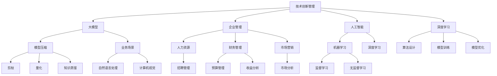
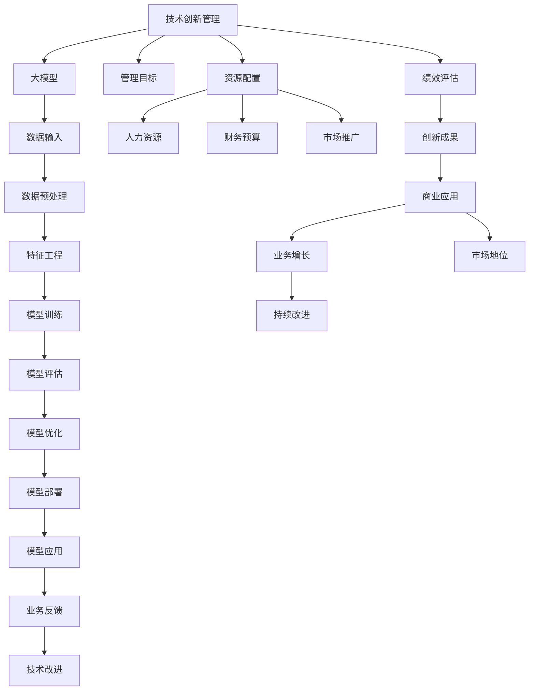

                 

# 大模型企业的技术创新管理

> 关键词：
- 技术创新管理
- 大模型
- 企业管理
- 人工智能(AI)
- 深度学习
- 模型压缩
- 业务场景
- 企业战略

## 1. 背景介绍

随着人工智能(AI)技术的迅猛发展，大模型企业（如谷歌、微软、亚马逊等）在技术创新管理方面面临着越来越复杂和多元化的挑战。如何在大模型应用中实现技术创新的有效管理，保持企业核心竞争力和市场领先地位，成为当下热门的研究话题。本文旨在探讨大模型企业的技术创新管理策略，为行业从业者提供一些有价值的参考。

### 1.1 问题由来

在人工智能时代，大模型企业面临的创新管理问题尤为突出。这些企业需要平衡技术研发和商业化应用的复杂关系，同时应对来自内外部的多样性挑战。外部环境快速变化，市场需求和竞争愈发激烈；内部则需要优化资源配置，提高研发效率，确保技术创新能够转化为现实生产力。大模型企业的技术创新管理，需要兼顾战略高度、业务深度和技术细节，实现多方面的协同与整合。

### 1.2 问题核心关键点

大模型企业的技术创新管理涉及多个关键点，包括但不限于：
- 模型选择与优化：基于不同业务场景选择合适的模型，并通过模型压缩、加速等技术优化模型性能。
- 数据管理与处理：保证数据的质量与安全性，合理规划数据收集、处理与存储策略。
- 组织架构与文化：构建灵活的组织架构和创新文化，促进跨部门协作与知识共享。
- 合作与外部资源利用：通过合作与技术开放，借助外部力量提升自身技术实力与市场影响力。
- 技术评估与反馈：建立技术评估机制，定期收集反馈信息，不断优化技术创新过程。

理解这些关键点，有助于更系统、全面地推进大模型企业的技术创新管理。

## 2. 核心概念与联系

### 2.1 核心概念概述

为了清晰地阐述大模型企业的技术创新管理，我们首先需要了解几个核心概念及其联系：

- **技术创新管理**：指通过系统化的方法对技术创新的全生命周期进行管理和优化，确保技术成果有效转化为商业价值。
- **大模型**：如BERT、GPT等，是经过大规模数据预训练的大型深度学习模型，能够进行复杂的自然语言处理任务。
- **企业管理**：包括人力资源管理、财务管理、市场营销等多个维度，是大模型技术创新管理的重要组成部分。
- **人工智能(AI)**：利用机器学习、深度学习等技术实现自动化、智能化的业务流程。
- **深度学习**：一种基于多层神经网络的学习方法，大模型技术创新管理的核心技术支撑。
- **模型压缩**：通过剪枝、量化、知识蒸馏等技术，减小模型尺寸，提升计算效率。
- **业务场景**：如自然语言处理、计算机视觉等具体应用领域，是技术创新管理的重要落地点。
- **企业战略**：指企业在竞争中制定并实施的整体规划和决策，指导技术创新管理的方向与节奏。

这些概念之间相互联系，共同构成了大模型企业的技术创新管理框架，如图：



### 2.2 核心概念原理和架构的 Mermaid 流程图



上述流程展示了从技术创新到商业应用的全过程，体现了技术管理与业务发展的有机结合。

## 3. 核心算法原理 & 具体操作步骤

### 3.1 算法原理概述

大模型企业的技术创新管理，离不开算法原理的支撑。核心算法原理主要涉及数据处理、模型训练、优化和应用四个环节。

1. **数据处理**：清洗、标注和整理数据，确保数据的质量和多样性。
2. **模型训练**：选择合适的模型架构和算法，利用大模型进行训练。
3. **模型优化**：通过剪枝、量化、蒸馏等技术手段，提升模型的性能和效率。
4. **模型应用**：将训练好的模型部署到实际业务场景中，进行功能实现和优化。

### 3.2 算法步骤详解

技术创新管理的核心算法步骤通常包括以下几个环节：

1. **需求分析**：明确业务目标和需求，确定技术创新的方向和目标。
2. **数据收集与预处理**：收集相关数据，并进行清洗、标注和整理。
3. **模型选择与训练**：根据业务场景选择合适的模型，进行训练和优化。
4. **模型部署与应用**：将模型部署到实际应用场景中，进行业务功能实现和优化。
5. **效果评估与反馈**：评估模型效果，收集反馈信息，指导后续技术改进。

### 3.3 算法优缺点

大模型企业的技术创新管理算法具有以下优缺点：

#### 优点：

- **高效性**：通过算法优化，可以大幅提升模型性能和计算效率，降低资源投入。
- **灵活性**：算法可以灵活调整，适应不同业务场景的需求。
- **可扩展性**：算法框架支持多模型和多任务，可以轻松扩展到更多应用场景。

#### 缺点：

- **高复杂度**：算法步骤和参数配置复杂，需要较高的技术门槛。
- **模型鲁棒性**：大模型容易受到输入数据的影响，模型鲁棒性有待提高。
- **计算资源需求高**：模型训练和优化需要大量计算资源，成本较高。

### 3.4 算法应用领域

大模型企业的技术创新管理算法广泛应用于多个领域：

- **自然语言处理(NLP)**：如文本分类、情感分析、机器翻译等。
- **计算机视觉(CV)**：如图像识别、目标检测、视频分析等。
- **智能推荐系统**：如电商推荐、内容推荐等。
- **智能客服**：如自动问答、自动回复等。
- **智能医疗**：如影像分析、诊断支持等。
- **智能制造**：如设备监控、故障预测等。

## 4. 数学模型和公式 & 详细讲解 & 举例说明

### 4.1 数学模型构建

数学模型构建是技术创新管理算法的基础，涉及数据输入、模型训练、模型优化和效果评估等多个环节。以深度学习模型为例，数学模型构建主要包括以下步骤：

1. **输入层**：将原始数据转换为模型可以处理的数值形式。
2. **隐藏层**：通过神经网络进行特征提取和计算。
3. **输出层**：根据输出层的形式确定模型预测结果。

### 4.2 公式推导过程

假设我们有一个简单的线性回归模型：

$$
y = wx + b
$$

其中 $x$ 是输入数据，$y$ 是输出结果，$w$ 是权重，$b$ 是偏置。模型训练的目标是最小化损失函数：

$$
L = \frac{1}{2N} \sum_{i=1}^N (y_i - wx_i - b)^2
$$

使用梯度下降算法更新权重和偏置：

$$
w_{t+1} = w_t - \alpha \frac{\partial L}{\partial w}
$$
$$
b_{t+1} = b_t - \alpha \frac{\partial L}{\partial b}
$$

其中 $\alpha$ 是学习率。

### 4.3 案例分析与讲解

以图像分类为例，使用卷积神经网络(CNN)进行模型训练。CNN模型的输入层是图像数据，经过多层卷积、池化和全连接层，最终输出分类结果。

使用Keras框架，代码示例如下：

```python
from keras.models import Sequential
from keras.layers import Conv2D, MaxPooling2D, Flatten, Dense

model = Sequential()
model.add(Conv2D(32, (3,3), activation='relu', input_shape=(28,28,1)))
model.add(MaxPooling2D((2,2)))
model.add(Flatten())
model.add(Dense(10, activation='softmax'))

model.compile(optimizer='adam', loss='categorical_crossentropy', metrics=['accuracy'])
model.fit(X_train, y_train, epochs=10, batch_size=32, validation_data=(X_test, y_test))
```

## 5. 项目实践：代码实例和详细解释说明

### 5.1 开发环境搭建

开发环境搭建是技术创新管理项目的基础。以下是使用Python进行TensorFlow开发的环境配置流程：

1. 安装Anaconda：从官网下载并安装Anaconda，用于创建独立的Python环境。

2. 创建并激活虚拟环境：
```bash
conda create -n tensorflow-env python=3.8 
conda activate tensorflow-env
```

3. 安装TensorFlow：根据CUDA版本，从官网获取对应的安装命令。例如：
```bash
conda install tensorflow -c tf -c conda-forge
```

4. 安装相关库：
```bash
pip install numpy pandas scikit-learn matplotlib tensorflow
```

完成上述步骤后，即可在`tensorflow-env`环境中开始项目开发。

### 5.2 源代码详细实现

下面以图像分类任务为例，给出使用TensorFlow进行CNN模型训练的PyTorch代码实现。

```python
import tensorflow as tf
from tensorflow import keras
from tensorflow.keras import layers

# 加载数据集
(x_train, y_train), (x_test, y_test) = keras.datasets.mnist.load_data()
x_train = x_train.reshape(-1, 28, 28, 1) / 255.0
x_test = x_test.reshape(-1, 28, 28, 1) / 255.0

# 构建模型
model = keras.Sequential([
    layers.Conv2D(32, 3, activation='relu'),
    layers.MaxPooling2D(),
    layers.Flatten(),
    layers.Dense(10, activation='softmax')
])

# 编译模型
model.compile(optimizer='adam', loss='sparse_categorical_crossentropy', metrics=['accuracy'])

# 训练模型
model.fit(x_train, y_train, epochs=10, batch_size=32, validation_data=(x_test, y_test))
```

### 5.3 代码解读与分析

让我们再详细解读一下关键代码的实现细节：

**数据加载**：使用Keras内置的数据集加载函数，加载MNIST手写数字数据集，并进行数据预处理。

**模型构建**：使用Sequential模型，定义卷积层、池化层、全连接层，构建CNN模型。

**模型编译**：选择合适的优化器和损失函数，编译模型。

**模型训练**：使用fit函数训练模型，指定训练轮数和批大小，在验证集上验证模型性能。

### 5.4 运行结果展示

以下是训练过程中模型损失和准确率的曲线图：

```python
import matplotlib.pyplot as plt

plt.plot(history.history['loss'], label='Train')
plt.plot(history.history['val_loss'], label='Test')
plt.xlabel('Epoch')
plt.ylabel('Loss')
plt.legend()
plt.show()

plt.plot(history.history['accuracy'], label='Train')
plt.plot(history.history['val_accuracy'], label='Test')
plt.xlabel('Epoch')
plt.ylabel('Accuracy')
plt.legend()
plt.show()
```

## 6. 实际应用场景

### 6.1 智能客服系统

基于深度学习模型进行自然语言处理，可以构建智能客服系统。通过模型微调，智能客服系统可以理解客户意图，提供个性化服务，提升客户满意度。

### 6.2 金融舆情监测

金融领域面临复杂多变的市场环境，利用深度学习模型进行舆情监测，可以及时发现市场动向，规避金融风险。

### 6.3 个性化推荐系统

个性化推荐系统能够根据用户行为数据，推荐相关商品或内容，提升用户体验。通过模型微调，推荐系统可以更准确地预测用户偏好。

### 6.4 未来应用展望

未来，大模型企业在技术创新管理方面，将进一步探索模型压缩、模型蒸馏、联邦学习等新技术，提升模型性能和效率。同时，也将更注重跨领域应用和跨部门协作，促进技术的全面落地。

## 7. 工具和资源推荐

### 7.1 学习资源推荐

为了帮助开发者系统掌握大模型企业的技术创新管理，这里推荐一些优质的学习资源：

1. 《深度学习入门与实践》系列博文：由深度学习专家撰写，深入浅出地介绍了深度学习原理和实践技巧。

2. CS231n《深度学习中的卷积神经网络》课程：斯坦福大学开设的计算机视觉明星课程，有Lecture视频和配套作业，带你入门计算机视觉领域的基本概念和经典模型。

3. 《深度学习在自然语言处理中的应用》书籍：详细介绍了深度学习在NLP领域的应用，包括模型训练、优化和应用。

4. Google TensorFlow官方文档：提供了完整的TensorFlow使用指南和样例代码，是深度学习开发的必备资料。

5. OpenAI GPT-3官方文档：详细介绍了GPT-3模型及其在各种NLP任务中的应用，有助于理解大模型技术的应用。

通过对这些资源的学习实践，相信你一定能够快速掌握大模型企业的技术创新管理精髓，并用于解决实际的AI问题。

### 7.2 开发工具推荐

高效的开发离不开优秀的工具支持。以下是几款用于大模型企业技术创新管理的常用工具：

1. Jupyter Notebook：用于快速迭代实验，记录和分享实验结果。

2. PyTorch：基于Python的开源深度学习框架，灵活动态的计算图，适合快速迭代研究。

3. TensorFlow：由Google主导开发的开源深度学习框架，生产部署方便，适合大规模工程应用。

4. Keras：基于TensorFlow的高层API，简化模型构建和训练过程，适合快速原型开发。

5. Weights & Biases：模型训练的实验跟踪工具，可以记录和可视化模型训练过程中的各项指标，方便对比和调优。

6. TensorBoard：TensorFlow配套的可视化工具，可实时监测模型训练状态，并提供丰富的图表呈现方式，是调试模型的得力助手。

合理利用这些工具，可以显著提升大模型企业技术创新管理的开发效率，加快创新迭代的步伐。

### 7.3 相关论文推荐

大模型企业技术创新管理的研究源于学界的持续研究。以下是几篇奠基性的相关论文，推荐阅读：

1. Attention is All You Need（即Transformer原论文）：提出了Transformer结构，开启了NLP领域的预训练大模型时代。

2. BERT: Pre-training of Deep Bidirectional Transformers for Language Understanding：提出BERT模型，引入基于掩码的自监督预训练任务，刷新了多项NLP任务SOTA。

3. Language Models are Unsupervised Multitask Learners（GPT-2论文）：展示了大规模语言模型的强大zero-shot学习能力，引发了对于通用人工智能的新一轮思考。

4. Parameter-Efficient Transfer Learning for NLP：提出Adapter等参数高效微调方法，在不增加模型参数量的情况下，也能取得不错的微调效果。

5. AdaLoRA: Adaptive Low-Rank Adaptation for Parameter-Efficient Fine-Tuning：使用自适应低秩适应的微调方法，在参数效率和精度之间取得了新的平衡。

这些论文代表了大模型企业技术创新管理的发展脉络。通过学习这些前沿成果，可以帮助研究者把握学科前进方向，激发更多的创新灵感。

## 8. 总结：未来发展趋势与挑战

### 8.1 研究成果总结

本文对大模型企业的技术创新管理进行了全面系统的介绍。首先阐述了技术创新管理的背景和意义，明确了模型选择与优化、数据管理与处理、组织架构与文化、合作与外部资源利用、技术评估与反馈等多个关键点的重要性。其次，从原理到实践，详细讲解了技术创新管理的数学模型和操作步骤，给出了技术创新管理项目开发的完整代码实例。同时，本文还广泛探讨了技术创新管理方法在多个行业领域的应用前景，展示了技术创新管理范式的巨大潜力。最后，本文精选了技术创新管理的各类学习资源，力求为读者提供全方位的技术指引。

通过本文的系统梳理，可以看到，大模型企业在技术创新管理中需要综合考虑数据、模型、算法、业务等多个维度的因素，实现技术的全面落地。只有从战略高度出发，不断优化资源配置，提高研发效率，才能真正发挥大模型企业的技术优势，推动企业的持续发展。

### 8.2 未来发展趋势

展望未来，大模型企业的技术创新管理将呈现以下几个发展趋势：

1. **模型压缩与加速**：随着计算资源成本的降低，大模型企业将更加注重模型压缩和加速技术，提升模型的实际应用性能。

2. **多模态融合**：利用图像、音频、文本等多模态数据进行深度学习模型训练，提升模型的跨领域应用能力。

3. **联邦学习**：通过分布式计算和数据共享，提高模型训练效率，保护数据隐私。

4. **模型公平性与伦理**：关注模型训练和应用的公平性与伦理问题，确保技术应用的透明度和可解释性。

5. **跨部门协作**：构建灵活的组织架构和创新文化，促进跨部门协作与知识共享，提升技术创新管理的效率。

6. **业务驱动与市场化**：将技术创新管理与业务发展紧密结合，确保技术成果能够转化为实际商业价值。

以上趋势凸显了大模型企业技术创新管理的广阔前景。这些方向的探索发展，必将进一步提升企业的技术实力和市场竞争力，引领AI技术的不断进步。

### 8.3 面临的挑战

尽管大模型企业在技术创新管理方面取得了一定的成绩，但在迈向更加智能化、普适化应用的过程中，仍面临诸多挑战：

1. **数据稀缺性**：大模型训练和优化需要大量高质量标注数据，而获取这些数据成本较高，过程复杂。

2. **模型鲁棒性**：模型在不同数据集和场景上的表现差异较大，鲁棒性有待提升。

3. **计算资源需求高**：模型训练和优化需要大量计算资源，资源需求高。

4. **算法复杂性**：技术创新管理算法步骤复杂，参数配置复杂，需要较高的技术门槛。

5. **应用落地难**：技术创新管理需要与业务紧密结合，技术应用落地过程复杂。

6. **技术伦理问题**：技术应用过程中可能存在隐私、公平性等伦理问题，需要综合考虑。

7. **技术生态不完善**：技术创新管理需要多层次、多领域的技术支持，目前生态还不完善。

正视这些挑战，积极应对并寻求突破，将是大模型企业在技术创新管理中迈向成熟的重要保障。相信通过不断探索和实践，这些挑战终将逐步被克服，大模型企业的技术创新管理必将在构建人机协同的智能时代中扮演越来越重要的角色。

### 8.4 研究展望

未来，大模型企业的技术创新管理需要在以下几个方面进行深入研究：

1. **模型压缩与量化技术**：通过剪枝、量化、蒸馏等技术手段，减小模型尺寸，提升计算效率。

2. **联邦学习与分布式计算**：探索分布式计算和联邦学习，提升模型训练效率，保护数据隐私。

3. **跨领域模型迁移**：研究跨领域模型迁移技术，提高模型在多个业务场景中的应用能力。

4. **多模态融合**：利用图像、音频、文本等多模态数据进行深度学习模型训练，提升模型的跨领域应用能力。

5. **可解释性与公平性**：研究模型可解释性和公平性技术，确保技术应用的透明度和公平性。

6. **跨部门协作与知识共享**：构建灵活的组织架构和创新文化，促进跨部门协作与知识共享，提升技术创新管理的效率。

7. **业务驱动与市场化**：将技术创新管理与业务发展紧密结合，确保技术成果能够转化为实际商业价值。

这些研究方向的探索，必将引领大模型企业在技术创新管理方面迈向更高的台阶，为构建安全、可靠、可解释、可控的智能系统铺平道路。面向未来，大模型企业在技术创新管理方面还需要与其他AI技术进行更深入的融合，如知识表示、因果推理、强化学习等，多路径协同发力，共同推动人工智能技术不断进步。

## 9. 附录：常见问题与解答

**Q1：大模型企业的技术创新管理是否适用于所有类型的企业？**

A: 大模型企业的技术创新管理适用于需要依赖深度学习、AI技术进行业务优化的企业，但并不适用于所有类型的企业。不同类型企业的技术创新管理侧重点和实施路径有所不同，需要结合企业具体情况进行定制化设计。

**Q2：技术创新管理中如何选择适合的模型？**

A: 选择合适的模型需要考虑业务需求、数据特征和计算资源等因素。通常，企业可以根据业务场景需求，选择适合的深度学习模型架构，并进行必要的模型压缩和加速。例如，对于图像识别任务，可以选择CNN模型；对于自然语言处理任务，可以选择RNN、Transformer等模型。

**Q3：技术创新管理中如何处理数据稀缺性问题？**

A: 数据稀缺性是大模型企业面临的重要挑战。可以通过数据增强、迁移学习、自监督学习等技术手段，有效解决数据稀缺性问题。例如，使用数据增强技术，对已有数据进行改写、扩充和增强；使用迁移学习技术，利用其他领域的数据进行预训练，提升模型泛化能力；使用自监督学习技术，利用无标注数据进行模型训练，降低对标注数据的依赖。

**Q4：技术创新管理中如何优化资源配置？**

A: 优化资源配置是大模型企业管理的重要任务。可以通过任务并行、模型并行、分布式计算等技术手段，提升计算效率。例如，使用任务并行技术，将计算任务分解为多个子任务，并行计算；使用模型并行技术，将大模型分解为多个子模型，并行计算；使用分布式计算技术，利用多台计算设备，提高计算效率。

**Q5：技术创新管理中如何确保模型的公平性与伦理性？**

A: 确保模型的公平性与伦理性是大模型企业管理的重要目标。可以通过公平性评估、透明性评估、解释性技术等手段，确保模型的公平性和伦理性。例如，使用公平性评估指标，评估模型在不同数据集和人群上的表现是否公平；使用透明性评估指标，评估模型的决策过程是否透明；使用解释性技术，如可解释性模型、模型可视化等，帮助理解模型的决策过程，确保模型的公平性和伦理性。

以上是对大模型企业技术创新管理问题的系统探讨。通过本文的梳理，希望能为从事大模型技术的企业提供一些有价值的参考和指导。希望大模型企业在技术创新管理方面能够不断探索和创新，推动技术的全面落地，实现业务的持续发展和增长。

---

作者：禅与计算机程序设计艺术 / Zen and the Art of Computer Programming

