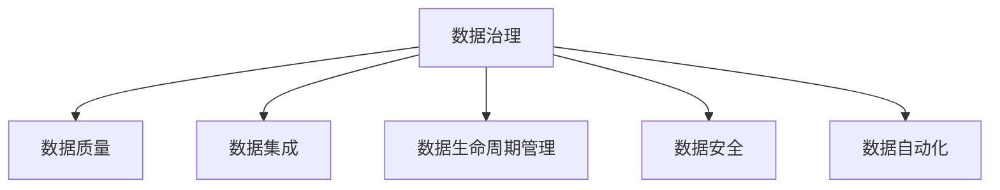

                 

# 大模型企业的数据治理最佳实践

> 关键词：数据治理, 数据质量, 数据集成, 数据生命周期管理, 数据安全, 数据隐私, 数据自动化

## 1. 背景介绍

### 1.1 问题由来
随着人工智能技术的迅猛发展，尤其是大模型（如GPT、BERT等）的普及应用，企业对于数据的需求和依赖愈发强烈。大模型作为深度学习的核心，依赖高质量、大规模的数据进行预训练和微调，从而提升其性能和泛化能力。因此，数据治理成为大模型企业必须面对的关键挑战之一。

### 1.2 问题核心关键点
数据治理的核心在于通过科学的方法和工具，确保数据的质量、可用性和安全性，以支撑大模型的高效训练和微调。具体而言，包括以下几个关键点：
- **数据质量**：确保数据的一致性、完整性、准确性、及时性等，是大模型训练的基础。
- **数据集成**：将不同来源、格式的数据进行整合，形成一致、统一的数据视图。
- **数据生命周期管理**：对数据从产生、存储、使用到销毁的全生命周期进行管理，确保数据的完整性和可追溯性。
- **数据安全**：保障数据的隐私和安全，防止数据泄露和滥用。
- **数据自动化**：通过技术手段实现数据的自动收集、清洗、处理和分析，提高数据治理效率。

数据治理是大模型企业成功的关键因素之一，有效的数据治理不仅能够提升模型的训练和微调效果，还能保障企业的数据安全和隐私，构建可持续发展的数据生态系统。

### 1.3 问题研究意义
研究大模型企业的数据治理方法，对于构建数据驱动的人工智能企业、提升企业智能化水平、促进数据资源的高效利用、保障数据安全与隐私等方面具有重要意义：

1. **提升模型训练效果**：高质量、完整的数据是模型训练的基石，通过有效的数据治理，可以确保模型训练数据的一致性和高质量，从而提升模型的泛化能力和性能。
2. **保障数据安全与隐私**：大模型涉及大量敏感数据，良好的数据治理能够确保数据的匿名化和加密处理，防止数据泄露和滥用，保障用户隐私。
3. **提高数据治理效率**：通过自动化的数据治理工具和方法，能够大幅提高数据处理的效率，减少人工干预，降低成本。
4. **促进数据资源共享**：良好的数据治理能够使数据在不同部门、不同应用场景之间共享，促进企业内部的知识共享和创新。
5. **构建可持续发展的数据生态**：通过科学的数据治理方法，企业可以构建稳定、可持续的数据生态，为未来的智能化发展奠定基础。

数据治理是大模型企业发展的必经之路，只有科学地管理数据，才能充分利用数据资源，发挥大模型的最大潜力，为企业带来持续的竞争优势。

## 2. 核心概念与联系

### 2.1 核心概念概述

为更好地理解大模型企业的数据治理实践，本节将介绍几个关键概念：

- **数据治理**：通过一系列方法和工具，确保数据的质量、完整性、可用性和安全性，从而实现数据的有效管理和利用。
- **数据质量**：描述数据的正确性、一致性、完整性、准确性、及时性等特性，是大模型训练的基础。
- **数据集成**：将来自不同来源、格式的数据整合，形成一致、统一的数据视图，是大模型应用的前提。
- **数据生命周期管理**：对数据的产生、存储、使用、销毁等生命周期阶段进行管理，确保数据的完整性和可追溯性。
- **数据安全**：保障数据的隐私和安全，防止数据泄露和滥用，是大模型应用的重要保障。
- **数据自动化**：通过技术手段实现数据的自动收集、清洗、处理和分析，提高数据治理效率。

这些概念之间的逻辑关系可以通过以下Mermaid流程图来展示：



这个流程图展示了大模型企业数据治理的核心概念及其之间的关系：

1. **数据治理**：是数据管理的基础，包括数据质量、集成、生命周期管理、安全等多个方面。
2. **数据质量**：是数据治理的重要组成部分，确保数据的一致性、完整性、准确性等。
3. **数据集成**：将不同来源的数据进行整合，形成一致的数据视图。
4. **数据生命周期管理**：对数据从产生到销毁的全生命周期进行管理，确保数据的完整性和可追溯性。
5. **数据安全**：保障数据的隐私和安全，防止数据泄露和滥用。
6. **数据自动化**：通过技术手段实现数据的自动收集、清洗、处理和分析，提高数据治理效率。

这些概念共同构成了大模型企业数据治理的框架，为大模型训练和微调提供了坚实的基础。

## 3. 核心算法原理 & 具体操作步骤
### 3.1 算法原理概述

大模型企业的数据治理，本质上是构建一套科学的方法和工具体系，确保数据的完整性、准确性和安全性，从而支撑大模型的高效训练和微调。其核心思想是通过一系列的算法和技术手段，对数据进行高质量的管理和利用。

### 3.2 算法步骤详解

大模型企业的数据治理通常包括以下几个关键步骤：

**Step 1: 数据质量评估**
- 使用数据质量评估工具，对原始数据进行检查，识别数据中的错误、遗漏、重复等问题。
- 通过统计分析、规则校验等方式，评估数据的完整性、准确性、一致性等特性。

**Step 2: 数据清洗和预处理**
- 根据评估结果，对数据进行清洗和预处理，如删除重复数据、修正错误数据、填补遗漏数据等。
- 对于不完整的数据，使用插值、平均值填充等方法进行补充。
- 对数据进行标准化处理，确保数据格式的一致性。

**Step 3: 数据集成**
- 将不同来源的数据进行整合，使用数据集成工具和技术，如ETL（Extract, Transform, Load）流程，形成一致、统一的数据视图。
- 处理数据之间的冲突和歧义，确保数据的一致性和完整性。

**Step 4: 数据生命周期管理**
- 对数据从产生到销毁的全生命周期进行管理，包括数据的收集、存储、处理、使用、备份、销毁等环节。
- 使用数据仓库、数据湖等技术，构建数据存储和管理系统。
- 设置数据访问控制和安全策略，确保数据的安全性和隐私性。

**Step 5: 数据自动化**
- 通过自动化工具和算法，实现数据的自动收集、清洗、处理和分析。
- 使用机器学习算法对数据进行分类、聚类、特征提取等操作，提高数据处理的效率和准确性。

### 3.3 算法优缺点

大模型企业的数据治理方法具有以下优点：
1. **提升数据质量**：通过科学的数据治理方法，能够确保数据的完整性、准确性和一致性，提升模型的训练效果。
2. **提高数据处理效率**：使用自动化工具和技术，能够大幅提高数据处理的效率，减少人工干预，降低成本。
3. **保障数据安全**：通过严格的数据访问控制和安全策略，保障数据的隐私和安全，防止数据泄露和滥用。
4. **支持数据共享和创新**：良好的数据治理能够使数据在不同部门、不同应用场景之间共享，促进企业内部的知识共享和创新。

同时，该方法也存在一定的局限性：
1. **依赖人工干预**：尽管自动化工具能够大幅提高效率，但部分环节仍需人工干预，如数据质量评估、清洗等。
2. **成本较高**：建立和维护一套完善的数据治理体系需要投入大量资源。
3. **技术复杂**：数据治理涉及多个环节和多种技术，技术实现较为复杂。
4. **数据一致性挑战**：不同来源、格式的数据进行整合时，可能存在数据冲突和歧义，影响数据的一致性。

尽管存在这些局限性，但就目前而言，科学的数据治理方法是大模型企业成功的关键，有助于提升模型训练和微调的效果，保障数据的安全性和隐私性，促进企业内部的知识共享和创新。

### 3.4 算法应用领域

数据治理方法在大模型企业中得到了广泛应用，具体包括但不限于以下几个领域：

- **金融领域**：使用数据治理方法对客户数据、交易数据进行高质量管理和分析，提升金融风控和智能客服的能力。
- **医疗领域**：对电子病历、患者数据进行治理，确保数据的完整性和安全性，支撑医疗决策和智能诊断。
- **零售领域**：对客户数据、交易数据进行治理，提升客户分析和智能推荐的能力。
- **制造领域**：对生产数据、设备数据进行治理，提升生产调度和设备维护的能力。
- **公共服务领域**：对公共数据进行治理，提升公共决策和智能服务的水平。

除了这些经典领域，数据治理方法还在更多新兴领域得到应用，如智慧城市、智能交通、智能制造等，为各行各业带来数据驱动的创新和变革。

## 4. 数学模型和公式 & 详细讲解  
### 4.1 数学模型构建

数据治理的数学模型构建主要涉及以下几个方面：

- **数据质量评估模型**：使用统计学方法评估数据的完整性、准确性、一致性等特性。
- **数据清洗和预处理模型**：使用机器学习算法对数据进行分类、聚类、特征提取等操作，提升数据处理的效率和准确性。
- **数据集成模型**：使用ETL流程和数据仓库技术，整合不同来源的数据，形成一致、统一的数据视图。
- **数据生命周期管理模型**：使用数据仓库、数据湖等技术，构建数据存储和管理系统。
- **数据自动化模型**：使用自动化工具和算法，实现数据的自动收集、清洗、处理和分析。

以下以数据质量评估模型为例，进行详细讲解。

假设有一个数据集 $D=\{(x_i,y_i)\}_{i=1}^N$，其中 $x_i$ 为原始数据，$y_i$ 为期望结果。定义数据质量评估函数 $Q(D)$，用于评估数据的完整性、准确性和一致性等特性。则数据质量评估模型可以表示为：

$$
Q(D) = \frac{1}{N} \sum_{i=1}^N q(x_i,y_i)
$$

其中 $q(x_i,y_i)$ 为第 $i$ 个样本的数据质量评分函数。

### 4.2 公式推导过程

假设数据质量评分函数 $q(x_i,y_i)$ 可以分为完整性评分 $q_{\text{complete}}(x_i,y_i)$、准确性评分 $q_{\text{accurate}}(x_i,y_i)$ 和一致性评分 $q_{\text{consistent}}(x_i,y_i)$ 三部分，则有：

$$
q(x_i,y_i) = q_{\text{complete}}(x_i,y_i) + q_{\text{accurate}}(x_i,y_i) + q_{\text{consistent}}(x_i,y_i)
$$

具体评分函数的设计可以根据不同的数据特性和应用场景进行调整，如：

- **完整性评分**：评估数据的缺失情况，可以使用缺失值计数或缺失比例等指标。
- **准确性评分**：评估数据的准确性，可以使用标准差、中位数等统计量。
- **一致性评分**：评估数据的一致性，可以使用相关系数、散点图等方法。

在得到数据质量评估模型后，即可使用该模型对原始数据进行评估，识别出数据中的问题，并进行相应的处理。

### 4.3 案例分析与讲解

**案例1: 金融领域的数据治理**

金融领域对数据质量和隐私性要求极高。使用数据治理方法，可以有效提升金融风险评估和智能客服的能力。具体而言，可以采用以下步骤：

1. **数据收集**：从不同的数据源（如客户交易记录、社交媒体数据等）收集数据。
2. **数据清洗**：对收集到的数据进行清洗，去除重复、错误和遗漏数据，确保数据的完整性和准确性。
3. **数据集成**：将不同来源的数据进行整合，形成一致的数据视图。
4. **数据存储和管理**：使用数据仓库、数据湖等技术，构建数据存储和管理系统。
5. **数据安全**：设置严格的数据访问控制和安全策略，保障数据的隐私和安全。
6. **数据使用**：使用治理后的数据，支撑金融风险评估、智能客服等应用。

**案例2: 医疗领域的数据治理**

医疗领域对数据的准确性和一致性要求极高，数据治理方法可以有效提升医疗决策和智能诊断的能力。具体而言，可以采用以下步骤：

1. **数据收集**：从电子病历、医疗设备等来源收集数据。
2. **数据清洗**：对收集到的数据进行清洗，去除重复、错误和遗漏数据，确保数据的完整性和准确性。
3. **数据集成**：将不同来源的数据进行整合，形成一致的数据视图。
4. **数据存储和管理**：使用数据仓库、数据湖等技术，构建数据存储和管理系统。
5. **数据安全**：设置严格的数据访问控制和安全策略，保障数据的隐私和安全。
6. **数据使用**：使用治理后的数据，支撑医疗决策、智能诊断等应用。

## 5. 项目实践：代码实例和详细解释说明
### 5.1 开发环境搭建

在进行数据治理实践前，我们需要准备好开发环境。以下是使用Python进行PyTorch开发的环境配置流程：

1. 安装Anaconda：从官网下载并安装Anaconda，用于创建独立的Python环境。

2. 创建并激活虚拟环境：
```bash
conda create -n pytorch-env python=3.8 
conda activate pytorch-env
```

3. 安装PyTorch：根据CUDA版本，从官网获取对应的安装命令。例如：
```bash
conda install pytorch torchvision torchaudio cudatoolkit=11.1 -c pytorch -c conda-forge
```

4. 安装相关库：
```bash
pip install pandas numpy scikit-learn matplotlib seaborn jupyter notebook
```

5. 配置环境变量：
```bash
export PYTHONPATH=$PYTHONPATH:/path/to/your/project
```

完成上述步骤后，即可在`pytorch-env`环境中开始数据治理实践。

### 5.2 源代码详细实现

下面以数据清洗为例，给出使用Python进行数据处理的代码实现。

首先，定义数据清洗函数：

```python
import pandas as pd
import numpy as np

def clean_data(data):
    # 去除重复数据
    data = data.drop_duplicates()
    # 处理缺失值
    data = data.fillna(method='ffill')
    # 删除异常值
    data = data[data['value'] < 100]
    return data
```

然后，读取原始数据集，并进行清洗：

```python
# 读取原始数据集
df = pd.read_csv('raw_data.csv')

# 对数据进行清洗
df_cleaned = clean_data(df)
```

最后，输出清洗后的数据集：

```python
# 输出清洗后的数据集
print(df_cleaned.head())
```

以上就是使用Python进行数据清洗的代码实现。可以看到，通过定义简单、清晰的函数，我们能够高效地对数据进行清洗和处理，保证数据质量。

### 5.3 代码解读与分析

让我们再详细解读一下关键代码的实现细节：

**clean_data函数**：
- `drop_duplicates`方法：去除数据中的重复行，确保数据的一致性。
- `fillna`方法：使用前向填充（forward fill）方式处理缺失值，确保数据的完整性。
- `data['value'] < 100`条件：删除异常值，确保数据的准确性。

**读取原始数据集**：
- `pd.read_csv`函数：使用pandas库读取原始数据集，支持多种数据格式。

**输出清洗后的数据集**：
- `head`方法：输出数据集的前几行，用于查看清洗效果。

以上代码实现了数据清洗的基本功能，具体实现可以根据实际需求进行扩展。例如，可以添加更多数据清洗方法，如正则表达式匹配、字符串替换等。

## 6. 实际应用场景
### 6.1 金融领域的数据治理

金融领域对数据质量和隐私性要求极高。使用数据治理方法，可以有效提升金融风险评估和智能客服的能力。具体而言，可以采用以下步骤：

1. **数据收集**：从不同的数据源（如客户交易记录、社交媒体数据等）收集数据。
2. **数据清洗**：对收集到的数据进行清洗，去除重复、错误和遗漏数据，确保数据的完整性和准确性。
3. **数据集成**：将不同来源的数据进行整合，形成一致的数据视图。
4. **数据存储和管理**：使用数据仓库、数据湖等技术，构建数据存储和管理系统。
5. **数据安全**：设置严格的数据访问控制和安全策略，保障数据的隐私和安全。
6. **数据使用**：使用治理后的数据，支撑金融风险评估、智能客服等应用。

### 6.2 医疗领域的数据治理

医疗领域对数据的准确性和一致性要求极高，数据治理方法可以有效提升医疗决策和智能诊断的能力。具体而言，可以采用以下步骤：

1. **数据收集**：从电子病历、医疗设备等来源收集数据。
2. **数据清洗**：对收集到的数据进行清洗，去除重复、错误和遗漏数据，确保数据的完整性和准确性。
3. **数据集成**：将不同来源的数据进行整合，形成一致的数据视图。
4. **数据存储和管理**：使用数据仓库、数据湖等技术，构建数据存储和管理系统。
5. **数据安全**：设置严格的数据访问控制和安全策略，保障数据的隐私和安全。
6. **数据使用**：使用治理后的数据，支撑医疗决策、智能诊断等应用。

### 6.3 零售领域的数据治理

零售领域对客户数据和交易数据的准确性和一致性要求较高，数据治理方法可以有效提升客户分析和智能推荐的能力。具体而言，可以采用以下步骤：

1. **数据收集**：从客户交易记录、社交媒体数据等来源收集数据。
2. **数据清洗**：对收集到的数据进行清洗，去除重复、错误和遗漏数据，确保数据的完整性和准确性。
3. **数据集成**：将不同来源的数据进行整合，形成一致的数据视图。
4. **数据存储和管理**：使用数据仓库、数据湖等技术，构建数据存储和管理系统。
5. **数据安全**：设置严格的数据访问控制和安全策略，保障数据的隐私和安全。
6. **数据使用**：使用治理后的数据，支撑客户分析和智能推荐等应用。

### 6.4 未来应用展望

随着数据治理方法的不断成熟，未来将在更多领域得到广泛应用，为各行各业带来数据驱动的创新和变革。

在智慧城市领域，数据治理方法可以有效提升城市管理智能化水平，通过整合城市各类数据，实现交通优化、环境监测、公共服务智能化等应用。

在智能制造领域，数据治理方法可以有效提升生产调度和设备维护的能力，通过整合设备数据、生产数据等，实现智能制造的全面升级。

在公共服务领域，数据治理方法可以有效提升公共决策和智能服务的水平，通过整合各类公共数据，实现智慧城市、智慧交通等应用。

未来，随着数据治理技术的不断进步，数据驱动的创新将成为各行各业的重要驱动力，数据治理也将成为企业竞争力的重要组成部分。

## 7. 工具和资源推荐
### 7.1 学习资源推荐

为了帮助开发者系统掌握数据治理的理论基础和实践技巧，这里推荐一些优质的学习资源：

1. 《数据治理：从理论到实践》系列博文：由数据治理专家撰写，深入浅出地介绍了数据治理的基本概念、方法和工具。

2. 《数据治理实用指南》书籍：介绍了数据治理的多个方面，包括数据质量评估、数据清洗、数据集成、数据安全等，适合初学者和从业者学习。

3. 《数据治理最佳实践》视频课程：涵盖数据治理的多个环节和多种技术，通过视频和案例讲解，帮助学习者掌握数据治理的实际应用。

4. 《数据治理技术与应用》在线课程：通过在线课程的方式，系统讲解数据治理的理论和实践，提供大量的实际案例和代码示例。

5. 《数据治理挑战与解决方案》研讨会：邀请行业专家分享数据治理的挑战和解决方案，提供前沿技术和新趋势的深度讨论。

通过对这些资源的学习实践，相信你一定能够快速掌握数据治理的精髓，并用于解决实际的数据治理问题。

### 7.2 开发工具推荐

高效的开发离不开优秀的工具支持。以下是几款用于数据治理开发的常用工具：

1. Python：使用Python进行数据处理和分析，支持丰富的数据处理库，如pandas、numpy、scikit-learn等。

2. R：使用R进行数据处理和分析，支持丰富的统计分析和数据可视化库，如ggplot2、dplyr等。

3. SQL：使用SQL进行数据管理和查询，支持大规模数据的存储和分析，适合处理结构化数据。

4. Apache Spark：使用Apache Spark进行大数据处理和分析，支持分布式计算和高效的数据处理，适合处理海量数据。

5. Apache Hadoop：使用Apache Hadoop进行大数据存储和管理，支持大规模数据的分布式存储和处理，适合处理海量数据。

合理利用这些工具，可以显著提升数据治理任务的开发效率，加快创新迭代的步伐。

### 7.3 相关论文推荐

数据治理方法的不断发展源于学界的持续研究。以下是几篇奠基性的相关论文，推荐阅读：

1. Data Governance Framework: A Practical Guide for Businesses（数据治理框架：企业实用指南）：介绍数据治理的基本框架和实践方法，适合企业管理者学习。

2. Data Quality and Data Governance（数据质量和数据治理）：深入分析数据治理的多个方面，包括数据质量评估、数据清洗、数据集成等，适合数据治理从业者学习。

3. Data Governance in Practice（数据治理实践）：通过实际案例，介绍数据治理在企业中的应用，适合数据治理从业者学习。

4. The Role of Data Governance in Enterprise Information Management（数据治理在企业信息管理中的作用）：探讨数据治理在企业信息管理中的重要性，适合企业管理者学习。

这些论文代表了大模型企业数据治理技术的发展脉络。通过学习这些前沿成果，可以帮助研究者把握学科前进方向，激发更多的创新灵感。

## 8. 总结：未来发展趋势与挑战
### 8.1 总结

本文对大模型企业的数据治理方法进行了全面系统的介绍。首先阐述了数据治理的核心概念和实践背景，明确了数据治理在提升模型训练效果、保障数据安全与隐私等方面的重要意义。其次，从原理到实践，详细讲解了数据治理的数学模型和关键步骤，给出了数据治理任务开发的完整代码实例。同时，本文还广泛探讨了数据治理方法在金融、医疗、零售等多个行业领域的应用前景，展示了数据治理范式的巨大潜力。此外，本文精选了数据治理技术的各类学习资源，力求为读者提供全方位的技术指引。

通过本文的系统梳理，可以看到，科学的数据治理方法是大模型企业成功的关键因素之一，能够提升模型的训练和微调效果，保障数据的安全性和隐私性，构建可持续发展的数据生态系统。未来，随着数据治理技术的不断进步，数据驱动的创新将成为各行各业的重要驱动力，数据治理也将成为企业竞争力的重要组成部分。

### 8.2 未来发展趋势

展望未来，数据治理技术将呈现以下几个发展趋势：

1. **自动化和智能化**：使用人工智能技术进行数据质量评估、数据清洗等任务，提高数据治理的自动化和智能化水平。
2. **实时性和动态性**：通过实时数据采集和动态数据处理，实现数据的实时治理和动态更新。
3. **跨领域和多模态**：整合跨领域和多模态数据，提升数据的综合利用和价值挖掘能力。
4. **联邦学习**：通过联邦学习技术，在不共享原始数据的前提下，实现数据的联合治理和分析。
5. **数据治理平台**：构建统一的数据治理平台，实现数据的集中管理和自动化治理，提升数据治理效率。

以上趋势凸显了数据治理技术的广阔前景。这些方向的探索发展，必将进一步提升数据治理的效率和效果，为大数据时代的数据驱动创新提供新的动力。

### 8.3 面临的挑战

尽管数据治理技术已经取得了显著进展，但在迈向更加智能化、普适化应用的过程中，仍面临诸多挑战：

1. **数据质量保障**：尽管自动化技术能够提升数据治理效率，但部分环节仍需人工干预，数据质量保障仍需人工介入。
2. **数据安全和隐私**：数据治理需兼顾数据的安全性和隐私性，防止数据泄露和滥用。
3. **技术复杂性**：数据治理涉及多个环节和多种技术，技术实现较为复杂。
4. **跨部门协作**：数据治理需要跨部门协作，不同部门的数据格式、质量要求等可能存在差异，难以统一治理。
5. **技术更新快**：数据治理技术快速发展，需要不断更新技术栈和方法论，保持技术领先。

尽管存在这些挑战，但通过科学的方法和技术手段，数据治理方法能够有效地提升数据治理的效率和效果，保障数据的完整性和安全性，支撑大模型的高效训练和微调。

### 8.4 研究展望

面对数据治理所面临的种种挑战，未来的研究需要在以下几个方面寻求新的突破：

1. **引入人工智能技术**：使用人工智能技术进行数据质量评估、数据清洗等任务，提高数据治理的自动化和智能化水平。
2. **增强数据治理平台**：构建统一的数据治理平台，实现数据的集中管理和自动化治理，提升数据治理效率。
3. **推动跨领域数据治理**：整合跨领域和多模态数据，提升数据的综合利用和价值挖掘能力。
4. **研究联邦学习**：通过联邦学习技术，在不共享原始数据的前提下，实现数据的联合治理和分析。
5. **优化数据治理方法**：引入因果推断、强化学习等前沿技术，优化数据治理方法，提高数据治理效果。

这些研究方向的探索，必将引领数据治理技术迈向更高的台阶，为大数据时代的数据驱动创新提供新的动力。面向未来，数据治理技术还需要与其他人工智能技术进行更深入的融合，如知识表示、因果推理、强化学习等，多路径协同发力，共同推动数据治理技术的进步。

## 9. 附录：常见问题与解答

**Q1：如何构建数据治理平台？**

A: 构建数据治理平台需要以下步骤：

1. **需求分析**：明确数据治理的需求和目标，确定治理的范围和内容。
2. **平台设计**：设计平台的基本架构和技术栈，选择合适的工具和技术。
3. **数据接入和管理**：整合不同来源的数据，实现数据的集中管理和存储。
4. **数据质量管理**：使用数据质量评估工具和算法，对数据进行评估和清洗。
5. **数据安全和隐私**：设置严格的数据访问控制和安全策略，保障数据的隐私和安全。
6. **数据使用和分析**：通过API接口，实现数据的自动化处理和分析，支持各种应用场景。

具体实现时，可以使用开源工具和技术，如Apache Kafka、Apache Hadoop、Apache Spark等，搭建数据治理平台。

**Q2：如何保障数据安全和隐私？**

A: 保障数据安全和隐私是数据治理的重要环节，具体方法包括：

1. **数据加密**：使用加密技术对数据进行加密存储和传输，防止数据泄露。
2. **访问控制**：设置严格的数据访问控制策略，确保只有授权人员才能访问数据。
3. **匿名化处理**：对数据进行匿名化处理，防止数据识别出个人身份。
4. **数据脱敏**：对敏感数据进行脱敏处理，防止数据被滥用。
5. **安全审计**：记录和审计数据访问和使用情况，确保数据的安全性。

合理应用这些方法，可以显著提高数据治理的安全性和隐私性，保障数据的完整性和可用性。

**Q3：如何提升数据治理效率？**

A: 提升数据治理效率可以从以下几个方面入手：

1. **自动化工具**：使用自动化工具和算法，实现数据的自动收集、清洗、处理和分析，减少人工干预。
2. **分布式计算**：使用分布式计算技术，提高数据处理的效率，支持大规模数据的治理。
3. **实时处理**：通过实时数据采集和处理，实现数据的实时治理和动态更新。
4. **多任务并行**：使用多任务并行技术，同时处理多个数据治理任务，提高治理效率。
5. **数据标准化**：对数据进行标准化处理，确保数据的一致性和可比性，提高治理效率。

合理利用这些方法，可以显著提升数据治理的效率和效果，减少人工干预，降低治理成本。

---

作者：禅与计算机程序设计艺术 / Zen and the Art of Computer Programming

