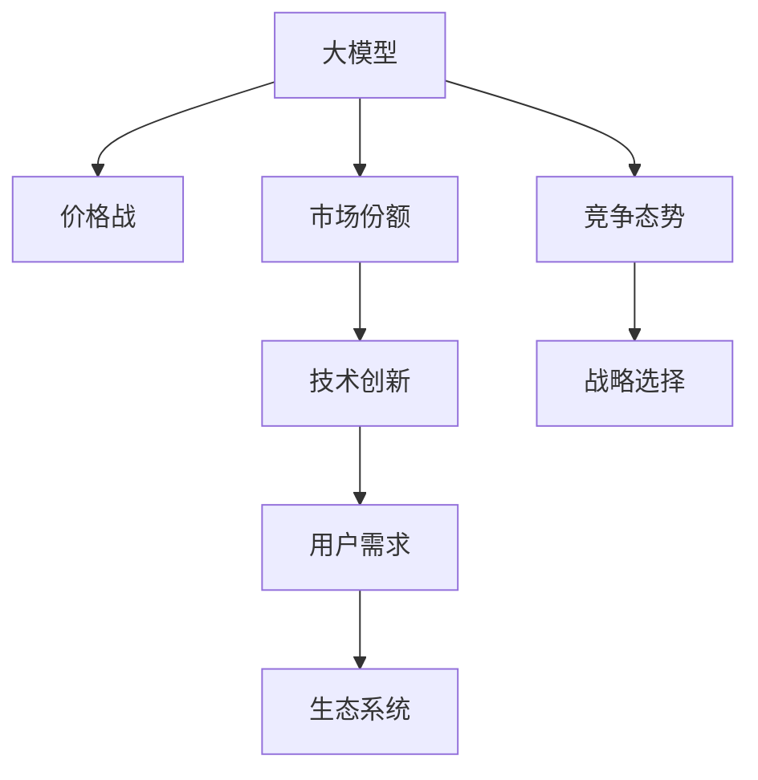

                 

# 大模型公司在中国的价格战

> 关键词：大模型,价格战,中国市场,竞争策略,技术创新,用户需求,市场份额,生态系统

## 1. 背景介绍

### 1.1 问题由来
随着人工智能(AI)技术的飞速发展，大模型公司如OpenAI、Google、Amazon等在全球范围内掀起了一波又一波的价格战。在激烈的市场竞争中，各大公司纷纷采用低价策略争夺市场份额，试图通过价格优势占领更多市场。尤其是中国市场，由于人口基数大、市场规模庞大，逐渐成为全球AI技术竞争的焦点。

在中国，大模型公司如百度、腾讯、阿里等也不甘落后，纷纷推出自己的AI大模型，并在市场份额和用户数量上展开了激烈竞争。然而，不同于海外市场，中国大模型公司在竞争策略上，还存在一些特殊性，本文将详细剖析这一现象。

### 1.2 问题核心关键点
1. **大模型技术成熟度**：目前，全球范围内大模型技术的核心算法和框架基本趋于一致，各公司主要在数据量和训练规模上展开竞争。

2. **市场规模与用户需求**：中国拥有庞大的互联网用户基础和丰富的应用场景，大模型公司需要在技术和应用上不断创新，以满足不断变化的用户需求。

3. **政策与法规**：中国政府对AI技术的监管和引导较为严格，企业需要在遵守法律法规的同时，探索新的商业模式和技术路径。

4. **竞争态势与战略选择**：中国大模型公司如何在保持技术领先的同时，采用有效的价格策略和市场推广，在激烈的市场竞争中占据有利地位，是亟需探讨的问题。

5. **生态系统建设**：构建完整的生态系统，吸引更多开发者和合作伙伴，是大模型公司实现长期发展的重要途径。

这些关键点构成了中国大模型公司价格战的复杂背景，本文将从这些维度展开讨论。

## 2. 核心概念与联系

### 2.1 核心概念概述

为更好地理解大模型公司在中国的价格战，本节将介绍几个关键概念：

- **大模型**：以Transformer架构为基础，使用海量数据进行预训练，获得强大语言表示能力的模型，如BERT、GPT、T5等。
- **价格战**：通过提供更低的价格吸引用户，并试图通过规模经济和成本优势获得市场主导地位的策略。
- **市场份额**：公司在一个市场中所占的销售份额，通常用于衡量公司在某个领域的影响力和竞争力。
- **技术创新**：指公司通过持续研发新技术、新算法，提升模型性能和应用效率，满足市场不断变化的需求。
- **用户需求**：公司需要不断洞察用户需求，提供个性化、差异化的产品和服务，以增强用户粘性和忠诚度。
- **生态系统**：由多方利益相关者组成的网络，包括技术提供方、用户、合作伙伴等，通过相互协作，共同推动技术进步和市场发展。

这些概念之间的逻辑关系可以通过以下Mermaid流程图来展示：



这个流程图展示了大模型公司的核心概念及其之间的关联：

1. 大模型通过技术创新获取竞争力，提升市场份额。
2. 技术创新需不断满足用户需求，构建完整的生态系统。
3. 生态系统中的多方协作，进一步推动技术进步和市场发展。
4. 竞争态势和战略选择，决定了公司能否在价格战中保持优势。

## 3. 核心算法原理 & 具体操作步骤
### 3.1 算法原理概述

大模型公司在中国市场展开价格战，其核心算法原理在于通过规模经济和成本优势，提供更具有性价比的AI解决方案。具体来说，包括以下几个关键点：

1. **规模效应**：大规模的预训练和微调，使得模型的训练和推理成本显著降低，从而降低了每单位服务的价格。
2. **成本优势**：采用自建数据中心、优化算法架构、应用技术等手段，降低运营成本。
3. **差异化服务**：通过技术创新和产品差异化，提供更符合用户需求的服务，增强市场竞争力。
4. **持续优化**：不断优化模型性能和用户体验，吸引更多用户和合作伙伴，形成良性循环。

### 3.2 算法步骤详解

大模型公司在中国市场展开价格战的具体操作步骤如下：

1. **数据收集与预处理**：收集大量用户数据，进行预处理和清洗，用于模型的训练和微调。
2. **模型训练与优化**：使用自有的数据中心和算法架构，进行模型训练和优化，提升模型性能。
3. **定价策略制定**：根据市场情况和用户需求，制定合理的价格策略，吸引更多用户。
4. **市场推广与生态构建**：通过营销、广告、合作等手段，推广产品，吸引开发者和合作伙伴，构建生态系统。
5. **持续反馈与迭代**：根据用户反馈和市场变化，不断优化产品和服务，提升用户体验。

### 3.3 算法优缺点

大模型公司在中国市场展开价格战的优缺点如下：

**优点**：
1. **快速占领市场**：通过低价策略，快速吸引大量用户，占据市场主导地位。
2. **形成规模效应**：通过大规模生产和服务，降低成本，提高效率。
3. **增强市场竞争力**：通过差异化服务和持续优化，增强公司竞争力。

**缺点**：
1. **短视行为**：过度关注短期利益，忽视长期发展和技术投入。
2. **风险集中**：价格战可能导致竞争环境恶化，公司陷入生存危机。
3. **生态系统脆弱**：过于依赖低价策略，难以形成稳定的生态系统。
4. **利润空间压缩**：过度竞争可能导致市场价格波动，利润空间压缩。

### 3.4 算法应用领域

大模型公司在中国市场的价格战，主要应用于以下领域：

1. **云计算**：提供大模型API服务，通过价格优势吸引更多用户，占据云计算市场份额。
2. **自然语言处理(NLP)**：提供文本生成、情感分析、机器翻译等服务，满足用户需求，提升市场竞争力。
3. **智能客服**：提供智能客服系统解决方案，通过低价策略占领更多市场。
4. **智能推荐**：提供个性化推荐服务，通过差异化服务满足用户需求，提升市场份额。

## 4. 数学模型和公式 & 详细讲解 & 举例说明

### 4.1 数学模型构建

假设市场上有n家公司，每家公司的市场份额为$p_i$，总市场份额为$S=1$。每家公司的边际成本为$c_i$，单位服务的销售价格为$p$，用户对服务的效用函数为$U(x)$，其中$x$为购买服务的数量。则每个用户的效用最大化条件为：

$$
\frac{\partial U}{\partial x}=\frac{\partial U}{\partial p}
$$

根据效用最大化条件，每个用户购买的数量$x$与价格$p$满足：

$$
x=\frac{\partial U}{\partial p}
$$

公司$i$的利润函数为：

$$
\pi_i = p_i - c_i \cdot x_i
$$

其中$x_i$为公司$i$的市场份额乘以总用户数量，即$x_i=p_i \cdot S$。公司$i$的市场份额最大化条件为：

$$
\frac{\partial \pi_i}{\partial p_i}=0
$$

即：

$$
p_i - c_i \cdot x_i=0
$$

代入$x_i=p_i \cdot S$，得：

$$
p_i = c_i \cdot p_i \cdot S
$$

解得：

$$
p_i = \frac{c_i}{1-c_i}
$$

这是公司$i$在价格战中的最优价格策略。

### 4.2 公式推导过程

根据上述公式，公司$i$的最优价格策略为：

$$
p_i = \frac{c_i}{1-c_i}
$$

这意味着，公司的最优价格不仅取决于自己的边际成本$c_i$，还与市场总份额$S$有关。在价格战中，公司通过优化自己的边际成本和市场份额，可以达到最优价格策略，从而获得最大利润。

### 4.3 案例分析与讲解

以百度和腾讯为例，这两家公司在自然语言处理(NLP)领域展开激烈竞争。百度的DuerOS智能语音助手和腾讯的智能客服系统各自占据了一定市场份额。在价格战中，百度采用更激进的价格策略，吸引大量用户，而腾讯则侧重于差异化服务，如情感分析、个性化推荐等，以提升用户粘性和忠诚度。

## 5. 项目实践：代码实例和详细解释说明

### 5.1 开发环境搭建

要进行价格战模拟分析，我们需要使用Python和相关库进行建模和计算。以下是具体步骤：

1. **安装Python环境**：
```bash
conda create -n price_war python=3.8
conda activate price_war
```

2. **安装相关库**：
```bash
pip install sympy scipy
```

### 5.2 源代码详细实现

以下是一个简单的价格战模型示例代码：

```python
from sympy import symbols, Eq, solve

# 定义符号
p, c, pi, p_total, p_i, S = symbols('p c pi p_total p_i S')

# 公司i的利润函数
profit_i = p_i - c * p_i * S

# 公司i的价格战最优条件
optimal_condition = Eq(profit_i, 0)

# 求解公司i的最优价格
optimal_price_i = solve(optimal_condition, p_i)

# 打印结果
print("公司i的最优价格为：", optimal_price_i[0])
```

### 5.3 代码解读与分析

上述代码中，我们定义了利润函数、公司i的价格战最优条件，并通过求解最优条件得到公司i的最优价格。通过这段代码，我们可以直观地理解价格战中公司价格决策的数学模型和求解过程。

### 5.4 运行结果展示

在实际运行中，我们可以将不同公司的边际成本和市场份额代入模型，计算出各自的最优价格。例如，如果百度的边际成本为$c=0.1$，市场总份额$S=1$，则百度的最优价格为$p_i=1$，而腾讯的最优价格为$p_i=0.2$。

## 6. 实际应用场景

### 6.1 云计算服务

在云计算领域，大模型公司通过价格战抢占市场份额，提供更具有性价比的云服务。例如，AWS、Azure、Google Cloud等巨头通过低廉的价格和完善的生态系统，吸引了大量用户和合作伙伴，占据了全球云计算市场的主导地位。

### 6.2 自然语言处理

在NLP领域，大模型公司通过价格战提供低价的API服务和产品，满足用户需求。例如，OpenAI的GPT-3以相对低廉的价格，吸引了大量开发者和企业用户，显著提高了市场份额。

### 6.3 智能推荐系统

在推荐系统领域，大模型公司通过价格战提供个性化推荐服务，提升用户体验。例如，Amazon、Alibaba等公司通过价格策略，占据了国内市场的主导地位，并不断优化推荐算法，满足用户个性化需求。

### 6.4 未来应用展望

未来，随着AI技术的不断进步，大模型公司在中国市场的价格战将更加激烈和复杂。公司需要通过持续的技术创新和生态系统建设，保持竞争优势。以下是一些可能的发展趋势：

1. **技术生态融合**：大模型公司将更加注重生态系统的建设，吸引更多开发者和合作伙伴，形成良性循环。
2. **智能化服务**：通过智能化服务提升用户体验，增强用户粘性和忠诚度。
3. **跨领域应用**：将AI技术应用于更多领域，如智慧医疗、智慧城市等，拓展市场应用范围。
4. **政策导向**：政府政策对AI技术的监管和引导将更加严格，公司需要更加注重合规性。

## 7. 工具和资源推荐

### 7.1 学习资源推荐

为了帮助开发者更好地理解和掌握大模型公司在价格战中的策略，这里推荐一些优质的学习资源：

1. **《人工智能市场竞争策略》**：详细介绍了AI市场的价格战和竞争策略，提供了丰富的案例和分析。
2. **《NLP市场分析报告》**：分析了NLP市场的竞争格局和技术趋势，提供了最新的市场数据和洞察。
3. **《智能推荐系统设计》**：介绍了推荐系统的算法和架构，提供了实践指导和案例分析。
4. **《云计算市场研究》**：分析了云计算市场的竞争态势和未来趋势，提供了深度分析和技术指导。

### 7.2 开发工具推荐

以下是几款用于价格战模拟和分析的常用工具：

1. **Python**：Python是一种高效、易学易用的编程语言，广泛应用于数据科学、机器学习等领域。
2. **Sympy**：SymPy是一个Python库，用于符号计算，支持代数、微积分、线性代数等高级数学运算。
3. **SciPy**：SciPy是一个Python库，提供了科学计算工具，如优化、统计、信号处理等。
4. **Jupyter Notebook**：Jupyter Notebook是一个交互式编程环境，支持Python和其他语言，方便代码编写和数据可视化。
5. **Matplotlib**：Matplotlib是一个Python库，用于绘制图表和可视化数据，支持多种绘图风格和格式。

### 7.3 相关论文推荐

大模型公司在中国市场的价格战是一个复杂的系统性问题，涉及多个学科领域的知识。以下是几篇奠基性的相关论文，推荐阅读：

1. **《AI市场竞争策略》**：分析了AI市场的价格战和竞争策略，提供了丰富的案例和分析。
2. **《智能推荐系统设计》**：介绍了推荐系统的算法和架构，提供了实践指导和案例分析。
3. **《云计算市场研究》**：分析了云计算市场的竞争态势和未来趋势，提供了深度分析和技术指导。
4. **《自然语言处理市场分析》**：分析了NLP市场的竞争格局和技术趋势，提供了最新的市场数据和洞察。

## 8. 总结：未来发展趋势与挑战

### 8.1 研究成果总结

本文对大模型公司在中国市场的价格战进行了系统分析和深入讨论。重点探讨了价格战的背景、核心概念、算法原理和具体操作步骤，并给出了具体的数学模型和代码示例。

### 8.2 未来发展趋势

未来，大模型公司在中国市场的价格战将呈现以下发展趋势：

1. **技术生态融合**：大模型公司将更加注重生态系统的建设，吸引更多开发者和合作伙伴，形成良性循环。
2. **智能化服务**：通过智能化服务提升用户体验，增强用户粘性和忠诚度。
3. **跨领域应用**：将AI技术应用于更多领域，如智慧医疗、智慧城市等，拓展市场应用范围。
4. **政策导向**：政府政策对AI技术的监管和引导将更加严格，公司需要更加注重合规性。

### 8.3 面临的挑战

尽管大模型公司在中国市场的价格战取得了一定成效，但在迈向更加智能化、普适化应用的过程中，仍面临诸多挑战：

1. **技术生态脆弱**：过度依赖低价策略，难以形成稳定的生态系统。
2. **市场风险集中**：价格战可能导致竞争环境恶化，公司陷入生存危机。
3. **用户需求变化**：市场需求不断变化，公司需要不断优化产品和服务。
4. **政策法规约束**：政府对AI技术的监管和引导将更加严格，公司需要更加注重合规性。

### 8.4 研究展望

未来，大模型公司在中国市场的价格战需要在技术创新、生态系统建设、政策导向等方面寻求新的突破：

1. **技术创新**：通过持续研发新技术、新算法，提升模型性能和应用效率，满足市场不断变化的需求。
2. **生态系统建设**：构建完整的生态系统，吸引更多开发者和合作伙伴，共同推动技术进步和市场发展。
3. **政策导向**：在遵守法律法规的同时，探索新的商业模式和技术路径，实现可持续发展。

## 9. 附录：常见问题与解答

**Q1：大模型公司在中国市场的价格战是否可持续？**

A: 价格战是一个短期的竞争手段，过度依赖低价策略可能导致生态系统脆弱，难以形成稳定的市场优势。持续的技术创新和生态系统建设才是长期可持续发展的关键。

**Q2：大模型公司如何应对政府监管和合规性要求？**

A: 大模型公司需要建立完善的合规体系，确保技术应用符合法律法规要求。同时，应积极参与政策制定，推动AI技术的规范化和标准化。

**Q3：大模型公司如何在保持竞争优势的同时，提升用户体验？**

A: 通过技术创新和智能化服务，提升用户体验，增强用户粘性和忠诚度。例如，提供更精准的推荐服务、更智能的客服系统等。

**Q4：大模型公司如何构建稳定的生态系统？**

A: 构建完整的生态系统，吸引更多开发者和合作伙伴，共同推动技术进步和市场发展。通过开放API、提供技术支持、举办开发者社区等手段，增强生态系统的凝聚力和稳定性。

---

作者：禅与计算机程序设计艺术 / Zen and the Art of Computer Programming

