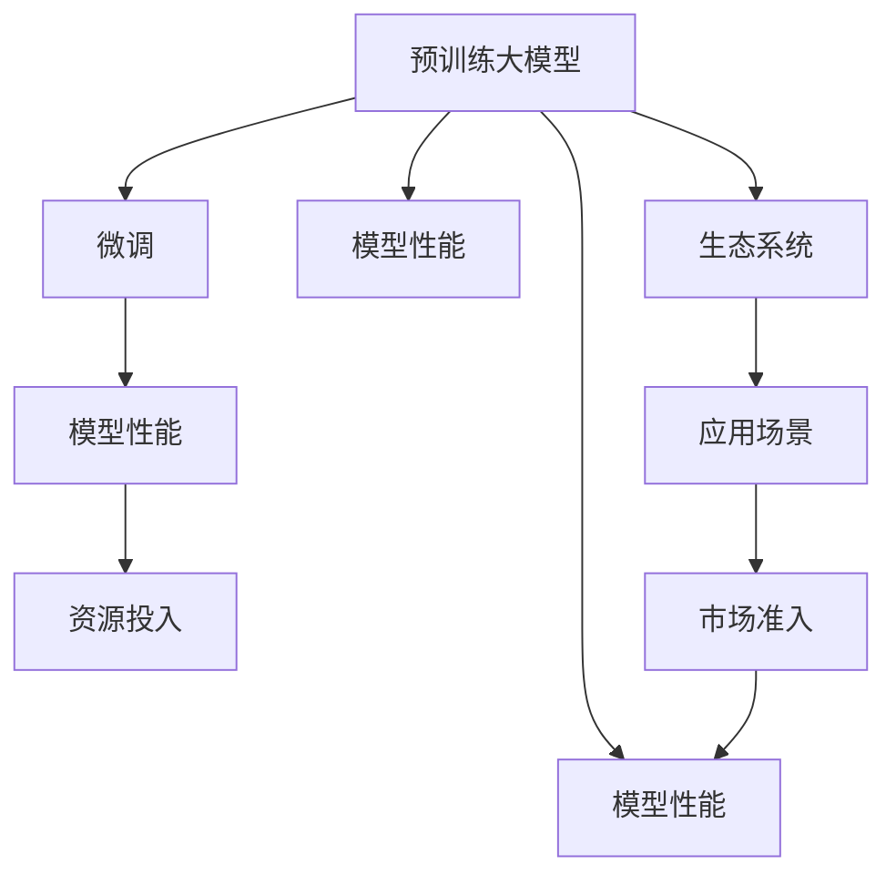
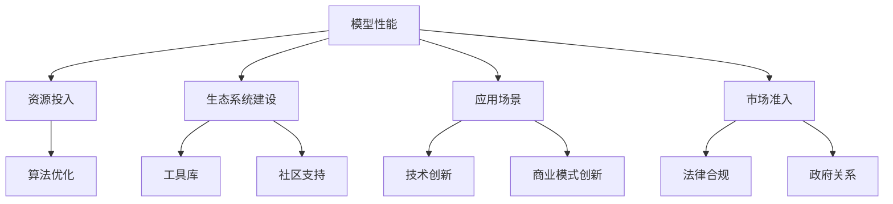

                 

# 大模型公司在中国的价格战

## 1. 背景介绍

### 1.1 问题由来
近年来，随着人工智能技术的快速发展，大模型公司之间的竞争日益激烈。特别是在中国，以谷歌、微软、百度、腾讯、阿里巴巴等为代表的技术巨头，纷纷推出了各自的预训练大模型，如Google的BERT、微软的T5、百度的PaddlePaddle等，以及阿里、腾讯等公司推出的各种大模型。

这些公司通过大规模预训练和微调技术，试图在自然语言处理(NLP)、计算机视觉(CV)、语音识别(SR)等领域抢占市场份额。然而，这种竞争也导致了资源投入的激增、技术标准的混乱以及市场准入的复杂化。

### 1.2 问题核心关键点
大模型公司之间的竞争主要集中在以下几个方面：
1. 模型的性能：谁能够提供更高效、更准确的大模型，谁就能获得更多用户和客户。
2. 资源投入：资源密集型的预训练和微调过程，需要巨额的算力、存储和资金支持。
3. 生态系统建设：围绕大模型的应用场景和工具链，建立起完整的生态系统。
4. 应用场景：如何将大模型应用于实际业务，创造更多价值。
5. 市场准入：由于技术垄断和数据壁垒，市场准入门槛较高，竞争者难以进入。

这些关键点构成了大模型公司在中国进行价格战的主要背景，以下将从模型的性能、资源投入、生态系统建设、应用场景以及市场准入等方面深入探讨。

## 2. 核心概念与联系

### 2.1 核心概念概述

为更好地理解大模型公司之间的价格战，需要了解以下核心概念：

- 预训练大模型：以自回归或自编码模型为代表的，在大规模无标签文本数据上进行训练的模型，如BERT、GPT-2、T5等。
- 微调：在大规模预训练模型的基础上，针对特定任务进行有监督的学习，以提升模型在该任务上的性能。
- 模型性能：指模型在特定任务上的精度、速度、鲁棒性等综合评价指标。
- 资源投入：指在模型训练、推理、部署和维护过程中所投入的算力、存储、人力、资金等资源。
- 生态系统：围绕大模型的应用场景、工具链、社区支持、培训等形成的综合环境。
- 应用场景：将大模型应用于实际业务，解决具体问题，如NLP的问答、翻译、摘要等。
- 市场准入：指进入特定市场所需的资格、条件、监管等。

这些概念之间通过以下关系相连：

1. 预训练大模型是微调的基础，通过在大规模无标签数据上预训练，模型学习到通用的语言表示。
2. 微调是对预训练模型进行特定任务的优化，提升模型在目标任务上的性能。
3. 模型性能是衡量大模型竞争力的核心指标。
4. 资源投入直接影响模型的性能，预训练和微调过程资源密集。
5. 生态系统是模型应用的保障，良好的生态系统带来更多用户和客户。
6. 应用场景是模型落地应用的重要驱动力，多样化的应用场景带来更多的市场机会。
7. 市场准入是进入市场的条件，高准入门槛增加了新竞争者的难度。

这些核心概念和大模型公司之间的价格战息息相关，以下将通过一个Mermaid流程图展示它们之间的联系：



## 3. 核心算法原理 & 具体操作步骤
### 3.1 算法原理概述

大模型公司之间的价格战，本质上是在模型性能、资源投入、生态系统建设、应用场景以及市场准入等方面展开的竞争。以下是各方的主要竞争策略：

1. **模型性能**：通过改进预训练方法和微调算法，提升模型在特定任务上的表现。
2. **资源投入**：通过优化计算资源配置和算法，降低模型训练和推理成本。
3. **生态系统建设**：通过提供丰富多样的工具、框架、模型库以及社区支持，构建完善的大模型生态系统。
4. **应用场景**：通过技术创新和商业模式创新，将大模型应用于实际业务，创造更多的价值。
5. **市场准入**：通过合法的市场进入手段和合规的运营方式，获得政府和用户的信任。

这些竞争策略通过以下流程图展示：



### 3.2 算法步骤详解

大模型公司之间的价格战可以分为以下几个主要步骤：

1. **模型开发与优化**：收集数据进行预训练，并针对特定任务进行微调，优化模型性能。
2. **资源配置与优化**：通过硬件优化、算法优化、分布式计算等手段，降低模型训练和推理成本。
3. **生态系统构建**：开发和发布工具库、框架、模型库，建立社区支持系统，吸引开发者和用户。
4. **市场推广与进入**：通过技术营销、品牌建设、合作伙伴关系等方式，推广大模型，获得市场准入。

### 3.3 算法优缺点

大模型公司之间的价格战具有以下优点：
1. 推动技术进步：竞争使得各方不断改进技术，提升模型性能。
2. 降低成本：通过优化算法和资源配置，降低模型训练和推理成本。
3. 促进创新：竞争激发了各方的创新热情，推动了新的技术和应用场景的出现。
4. 加速落地应用：通过市场推广和技术营销，加速大模型的应用落地。

但同时，价格战也存在以下缺点：
1. 资源浪费：过度竞争可能导致资源浪费，如重复开发相似的技术和模型。
2. 市场垄断：强者愈强，小公司难以进入市场。
3. 法律风险：不正当竞争可能面临法律风险。
4. 伦理问题：大模型可能存在偏见和歧视，导致伦理问题。
5. 数据隐私：大模型的训练和应用涉及大量敏感数据，可能带来隐私和安全问题。

### 3.4 算法应用领域

大模型公司之间的价格战涉及多个应用领域，以下是一些主要领域：

- 自然语言处理(NLP)：包括问答、机器翻译、文本摘要、命名实体识别、情感分析等。
- 计算机视觉(CV)：包括图像分类、物体检测、图像分割、人脸识别等。
- 语音识别(SR)：包括语音识别、说话人识别、情感识别等。
- 推荐系统：基于用户行为和兴趣，推荐商品、内容、服务等。
- 金融科技：应用于金融风控、量化投资、客户服务等方面。
- 智能制造：应用于质量检测、生产优化、供应链管理等方面。
- 医疗健康：应用于医学影像分析、基因组分析、电子病历处理等方面。

## 4. 数学模型和公式 & 详细讲解 & 举例说明

### 4.1 数学模型构建

假设有一个预训练模型 $M_\theta$，其中 $\theta$ 为模型参数。大模型公司之间的价格战可以看作是一个多目标优化问题，目标是最大化模型在各个应用场景上的性能，同时最小化资源投入。

设 $P_i$ 为第 $i$ 个应用场景的性能指标，$C_i$ 为该场景的资源投入，则目标函数为：

$$
\max \sum_i P_i - \sum_i C_i
$$

在实际应用中，目标函数可能非常复杂，涉及多个维度和因素。

### 4.2 公式推导过程

以一个简单的二分类任务为例，假设模型 $M_\theta$ 在输入 $x$ 上的输出为 $\hat{y}=M_\theta(x) \in [0,1]$，真实标签 $y \in \{0,1\}$。使用二分类交叉熵作为损失函数：

$$
\ell(M_\theta(x),y) = -[y\log \hat{y} + (1-y)\log (1-\hat{y})]
$$

将上述公式推广到多目标优化问题，假设 $P_i$ 和 $C_i$ 已知，则目标函数的梯度为：

$$
\nabla_\theta \sum_i (P_i - C_i) = \nabla_\theta \sum_i P_i - \nabla_\theta \sum_i C_i
$$

### 4.3 案例分析与讲解

假设有一个大模型公司A和B，A公司在NLP领域投入巨大，开发了高性能的BERT模型，但资源投入较高。B公司则在CV领域投入更多，推出了T5模型，但在NLP领域表现一般。

A公司可以通过以下方式与B公司竞争：
1. 在NLP领域进行优化，提升BERT的性能。
2. 在CV领域进行优化，提升T5的性能。
3. 构建完善的生态系统，吸引更多的开发者和用户。
4. 通过市场推广，获得更多市场份额。

## 5. 项目实践：代码实例和详细解释说明

### 5.1 开发环境搭建

以下是使用PyTorch进行BERT微调的项目实践步骤：

1. 安装Anaconda：从官网下载并安装Anaconda，用于创建独立的Python环境。
2. 创建并激活虚拟环境：
```bash
conda create -n pytorch-env python=3.8 
conda activate pytorch-env
```
3. 安装PyTorch：根据CUDA版本，从官网获取对应的安装命令。例如：
```bash
conda install pytorch torchvision torchaudio cudatoolkit=11.1 -c pytorch -c conda-forge
```
4. 安装Transformers库：
```bash
pip install transformers
```
5. 安装各类工具包：
```bash
pip install numpy pandas scikit-learn matplotlib tqdm jupyter notebook ipython
```

完成上述步骤后，即可在`pytorch-env`环境中开始项目实践。

### 5.2 源代码详细实现

以下是使用PyTorch对BERT进行微调的代码实现：

```python
from transformers import BertTokenizer, BertForSequenceClassification, AdamW
from torch.utils.data import Dataset, DataLoader
from sklearn.metrics import accuracy_score

class CustomDataset(Dataset):
    def __init__(self, texts, labels, tokenizer):
        self.texts = texts
        self.labels = labels
        self.tokenizer = tokenizer
        
    def __len__(self):
        return len(self.texts)
    
    def __getitem__(self, item):
        text = self.texts[item]
        label = self.labels[item]
        
        encoding = self.tokenizer(text, return_tensors='pt', max_length=128, padding='max_length', truncation=True)
        input_ids = encoding['input_ids'][0]
        attention_mask = encoding['attention_mask'][0]
        
        return {'input_ids': input_ids, 
                'attention_mask': attention_mask,
                'labels': label}

# 初始化BERT模型和优化器
model = BertForSequenceClassification.from_pretrained('bert-base-cased', num_labels=2)
optimizer = AdamW(model.parameters(), lr=2e-5)

# 准备数据集
tokenizer = BertTokenizer.from_pretrained('bert-base-cased')
train_dataset = CustomDataset(train_texts, train_labels, tokenizer)
dev_dataset = CustomDataset(dev_texts, dev_labels, tokenizer)
test_dataset = CustomDataset(test_texts, test_labels, tokenizer)

# 训练过程
device = torch.device('cuda') if torch.cuda.is_available() else torch.device('cpu')
model.to(device)

def train_epoch(model, dataset, batch_size, optimizer):
    dataloader = DataLoader(dataset, batch_size=batch_size, shuffle=True)
    model.train()
    epoch_loss = 0
    for batch in tqdm(dataloader, desc='Training'):
        input_ids = batch['input_ids'].to(device)
        attention_mask = batch['attention_mask'].to(device)
        labels = batch['labels'].to(device)
        model.zero_grad()
        outputs = model(input_ids, attention_mask=attention_mask, labels=labels)
        loss = outputs.loss
        epoch_loss += loss.item()
        loss.backward()
        optimizer.step()
    return epoch_loss / len(dataloader)

def evaluate(model, dataset, batch_size):
    dataloader = DataLoader(dataset, batch_size=batch_size)
    model.eval()
    preds, labels = [], []
    with torch.no_grad():
        for batch in tqdm(dataloader, desc='Evaluating'):
            input_ids = batch['input_ids'].to(device)
            attention_mask = batch['attention_mask'].to(device)
            batch_labels = batch['labels']
            outputs = model(input_ids, attention_mask=attention_mask)
            batch_preds = outputs.logits.argmax(dim=1).to('cpu').tolist()
            batch_labels = batch_labels.to('cpu').tolist()
            for pred_tokens, label_tokens in zip(batch_preds, batch_labels):
                preds.append(pred_tokens[:len(label_tokens)])
                labels.append(label_tokens)
                
    return accuracy_score(labels, preds)

# 训练流程
epochs = 5
batch_size = 16

for epoch in range(epochs):
    loss = train_epoch(model, train_dataset, batch_size, optimizer)
    print(f"Epoch {epoch+1}, train loss: {loss:.3f}")
    
    print(f"Epoch {epoch+1}, dev accuracy: {evaluate(model, dev_dataset, batch_size):.3f}")
    
print("Test accuracy:", evaluate(model, test_dataset, batch_size))
```

以上就是使用PyTorch对BERT进行微调的项目实践代码。

### 5.3 代码解读与分析

以下是关键代码的实现细节：

**CustomDataset类**：
- `__init__`方法：初始化文本、标签和分词器。
- `__len__`方法：返回数据集的样本数量。
- `__getitem__`方法：对单个样本进行处理，将文本输入编码为token ids，将标签编码为数字，并对其进行定长padding。

**模型和优化器**：
- `BertForSequenceClassification`：用于二分类任务。
- `AdamW`：优化器，用于更新模型参数。

**训练和评估函数**：
- `train_epoch`函数：对数据以批为单位进行迭代，在每个批次上前向传播计算损失并反向传播更新模型参数。
- `evaluate`函数：在测试集上评估模型性能，计算准确率。

**训练流程**：
- 定义总的epoch数和batch size，开始循环迭代。
- 每个epoch内，先在训练集上训练，输出平均loss。
- 在验证集上评估，输出准确率。
- 所有epoch结束后，在测试集上评估，给出最终测试结果。

## 6. 实际应用场景

### 6.1 智能客服系统

基于大模型微调的对话技术，可以广泛应用于智能客服系统的构建。传统客服往往需要配备大量人力，高峰期响应缓慢，且一致性和专业性难以保证。而使用微调后的对话模型，可以7x24小时不间断服务，快速响应客户咨询，用自然流畅的语言解答各类常见问题。

在技术实现上，可以收集企业内部的历史客服对话记录，将问题和最佳答复构建成监督数据，在此基础上对预训练对话模型进行微调。微调后的对话模型能够自动理解用户意图，匹配最合适的答案模板进行回复。对于客户提出的新问题，还可以接入检索系统实时搜索相关内容，动态组织生成回答。如此构建的智能客服系统，能大幅提升客户咨询体验和问题解决效率。

### 6.2 金融舆情监测

金融机构需要实时监测市场舆论动向，以便及时应对负面信息传播，规避金融风险。传统的人工监测方式成本高、效率低，难以应对网络时代海量信息爆发的挑战。基于大语言模型微调的文本分类和情感分析技术，为金融舆情监测提供了新的解决方案。

具体而言，可以收集金融领域相关的新闻、报道、评论等文本数据，并对其进行主题标注和情感标注。在此基础上对预训练语言模型进行微调，使其能够自动判断文本属于何种主题，情感倾向是正面、中性还是负面。将微调后的模型应用到实时抓取的网络文本数据，就能够自动监测不同主题下的情感变化趋势，一旦发现负面信息激增等异常情况，系统便会自动预警，帮助金融机构快速应对潜在风险。

### 6.3 个性化推荐系统

当前的推荐系统往往只依赖用户的历史行为数据进行物品推荐，无法深入理解用户的真实兴趣偏好。基于大语言模型微调技术，个性化推荐系统可以更好地挖掘用户行为背后的语义信息，从而提供更精准、多样的推荐内容。

在实践中，可以收集用户浏览、点击、评论、分享等行为数据，提取和用户交互的物品标题、描述、标签等文本内容。将文本内容作为模型输入，用户的后续行为（如是否点击、购买等）作为监督信号，在此基础上微调预训练语言模型。微调后的模型能够从文本内容中准确把握用户的兴趣点。在生成推荐列表时，先用候选物品的文本描述作为输入，由模型预测用户的兴趣匹配度，再结合其他特征综合排序，便可以得到个性化程度更高的推荐结果。

### 6.4 未来应用展望

随着大语言模型和微调方法的不断发展，基于微调范式将在更多领域得到应用，为传统行业带来变革性影响。

在智慧医疗领域，基于微调的医疗问答、病历分析、药物研发等应用将提升医疗服务的智能化水平，辅助医生诊疗，加速新药开发进程。

在智能教育领域，微调技术可应用于作业批改、学情分析、知识推荐等方面，因材施教，促进教育公平，提高教学质量。

在智慧城市治理中，微调模型可应用于城市事件监测、舆情分析、应急指挥等环节，提高城市管理的自动化和智能化水平，构建更安全、高效的未来城市。

此外，在企业生产、社会治理、文娱传媒等众多领域，基于大模型微调的人工智能应用也将不断涌现，为经济社会发展注入新的动力。相信随着预训练语言模型和微调方法的持续演进，微调方法将成为人工智能落地应用的重要范式，推动人工智能技术在垂直行业的规模化落地。

## 7. 工具和资源推荐

### 7.1 学习资源推荐

为了帮助开发者系统掌握大模型微调的理论基础和实践技巧，这里推荐一些优质的学习资源：

1. 《Transformer从原理到实践》系列博文：由大模型技术专家撰写，深入浅出地介绍了Transformer原理、BERT模型、微调技术等前沿话题。

2. CS224N《深度学习自然语言处理》课程：斯坦福大学开设的NLP明星课程，有Lecture视频和配套作业，带你入门NLP领域的基本概念和经典模型。

3. 《Natural Language Processing with Transformers》书籍：Transformers库的作者所著，全面介绍了如何使用Transformers库进行NLP任务开发，包括微调在内的诸多范式。

4. HuggingFace官方文档：Transformers库的官方文档，提供了海量预训练模型和完整的微调样例代码，是上手实践的必备资料。

5. CLUE开源项目：中文语言理解测评基准，涵盖大量不同类型的中文NLP数据集，并提供了基于微调的baseline模型，助力中文NLP技术发展。

通过对这些资源的学习实践，相信你一定能够快速掌握大模型微调的精髓，并用于解决实际的NLP问题。

### 7.2 开发工具推荐

高效的开发离不开优秀的工具支持。以下是几款用于大模型微调开发的常用工具：

1. PyTorch：基于Python的开源深度学习框架，灵活动态的计算图，适合快速迭代研究。大部分预训练语言模型都有PyTorch版本的实现。

2. TensorFlow：由Google主导开发的开源深度学习框架，生产部署方便，适合大规模工程应用。同样有丰富的预训练语言模型资源。

3. Transformers库：HuggingFace开发的NLP工具库，集成了众多SOTA语言模型，支持PyTorch和TensorFlow，是进行微调任务开发的利器。

4. Weights & Biases：模型训练的实验跟踪工具，可以记录和可视化模型训练过程中的各项指标，方便对比和调优。与主流深度学习框架无缝集成。

5. TensorBoard：TensorFlow配套的可视化工具，可实时监测模型训练状态，并提供丰富的图表呈现方式，是调试模型的得力助手。

6. Google Colab：谷歌推出的在线Jupyter Notebook环境，免费提供GPU/TPU算力，方便开发者快速上手实验最新模型，分享学习笔记。

合理利用这些工具，可以显著提升大模型微调任务的开发效率，加快创新迭代的步伐。

### 7.3 相关论文推荐

大语言模型和微调技术的发展源于学界的持续研究。以下是几篇奠基性的相关论文，推荐阅读：

1. Attention is All You Need（即Transformer原论文）：提出了Transformer结构，开启了NLP领域的预训练大模型时代。

2. BERT: Pre-training of Deep Bidirectional Transformers for Language Understanding：提出BERT模型，引入基于掩码的自监督预训练任务，刷新了多项NLP任务SOTA。

3. Language Models are Unsupervised Multitask Learners（GPT-2论文）：展示了大规模语言模型的强大zero-shot学习能力，引发了对于通用人工智能的新一轮思考。

4. Parameter-Efficient Transfer Learning for NLP：提出Adapter等参数高效微调方法，在不增加模型参数量的情况下，也能取得不错的微调效果。

5. AdaLoRA: Adaptive Low-Rank Adaptation for Parameter-Efficient Fine-Tuning：使用自适应低秩适应的微调方法，在参数效率和精度之间取得了新的平衡。

6. Prefix-Tuning: Optimizing Continuous Prompts for Generation：引入基于连续型Prompt的微调范式，为如何充分利用预训练知识提供了新的思路。

这些论文代表了大语言模型微调技术的发展脉络。通过学习这些前沿成果，可以帮助研究者把握学科前进方向，激发更多的创新灵感。

## 8. 总结：未来发展趋势与挑战

### 8.1 总结

本文对基于大语言模型的微调范式进行了全面系统的介绍。首先阐述了大语言模型和微调技术的研究背景和意义，明确了微调在拓展预训练模型应用、提升下游任务性能方面的独特价值。其次，从原理到实践，详细讲解了微调的数学原理和关键步骤，给出了微调任务开发的完整代码实例。同时，本文还广泛探讨了微调方法在智能客服、金融舆情、个性化推荐等多个行业领域的应用前景，展示了微调范式的巨大潜力。此外，本文精选了微调技术的各类学习资源，力求为读者提供全方位的技术指引。

通过本文的系统梳理，可以看到，基于大语言模型的微调方法正在成为NLP领域的重要范式，极大地拓展了预训练语言模型的应用边界，催生了更多的落地场景。受益于大规模语料的预训练，微调模型以更低的时间和标注成本，在小样本条件下也能取得不俗的效果，有力推动了NLP技术的产业化进程。未来，伴随预训练语言模型和微调方法的持续演进，微调方法将成为人工智能落地应用的重要范式，推动人工智能技术在垂直行业的规模化落地。

### 8.2 未来发展趋势

展望未来，大语言模型微调技术将呈现以下几个发展趋势：

1. 模型规模持续增大。随着算力成本的下降和数据规模的扩张，预训练语言模型的参数量还将持续增长。超大规模语言模型蕴含的丰富语言知识，有望支撑更加复杂多变的下游任务微调。

2. 微调方法日趋多样。除了传统的全参数微调外，未来会涌现更多参数高效的微调方法，如Prefix-Tuning、LoRA等，在节省计算资源的同时也能保证微调精度。

3. 持续学习成为常态。随着数据分布的不断变化，微调模型也需要持续学习新知识以保持性能。如何在不遗忘原有知识的同时，高效吸收新样本信息，将成为重要的研究课题。

4. 标注样本需求降低。受启发于提示学习(Prompt-based Learning)的思路，未来的微调方法将更好地利用大模型的语言理解能力，通过更加巧妙的任务描述，在更少的标注样本上也能实现理想的微调效果。

5. 多模态微调崛起。当前的微调主要聚焦于纯文本数据，未来会进一步拓展到图像、视频、语音等多模态数据微调。多模态信息的融合，将显著提升语言模型对现实世界的理解和建模能力。

6. 模型通用性增强。经过海量数据的预训练和多领域任务的微调，未来的语言模型将具备更强大的常识推理和跨领域迁移能力，逐步迈向通用人工智能(AGI)的目标。

以上趋势凸显了大语言模型微调技术的广阔前景。这些方向的探索发展，必将进一步提升NLP系统的性能和应用范围，为人类认知智能的进化带来深远影响。

### 8.3 面临的挑战

尽管大语言模型微调技术已经取得了瞩目成就，但在迈向更加智能化、普适化应用的过程中，它仍面临着诸多挑战：

1. 标注成本瓶颈。虽然微调大大降低了标注数据的需求，但对于长尾应用场景，难以获得充足的高质量标注数据，成为制约微调性能的瓶颈。如何进一步降低微调对标注样本的依赖，将是一大难题。

2. 模型鲁棒性不足。当前微调模型面对域外数据时，泛化性能往往大打折扣。对于测试样本的微小扰动，微调模型的预测也容易发生波动。如何提高微调模型的鲁棒性，避免灾难性遗忘，还需要更多理论和实践的积累。

3. 推理效率有待提高。大规模语言模型虽然精度高，但在实际部署时往往面临推理速度慢、内存占用大等效率问题。如何在保证性能的同时，简化模型结构，提升推理速度，优化资源占用，将是重要的优化方向。

4. 可解释性亟需加强。当前微调模型更像是"黑盒"系统，难以解释其内部工作机制和决策逻辑。对于医疗、金融等高风险应用，算法的可解释性和可审计性尤为重要。如何赋予微调模型更强的可解释性，将是亟待攻克的难题。

5. 安全性有待保障。预训练语言模型难免会学习到有偏见、有害的信息，通过微调传递到下游任务，产生误导性、歧视性的输出，给实际应用带来安全隐患。如何从数据和算法层面消除模型偏见，避免恶意用途，确保输出的安全性，也将是重要的研究课题。

6. 知识整合能力不足。现有的微调模型往往局限于任务内数据，难以灵活吸收和运用更广泛的先验知识。如何让微调过程更好地与外部知识库、规则库等专家知识结合，形成更加全面、准确的信息整合能力，还有很大的想象空间。

正视微调面临的这些挑战，积极应对并寻求突破，将是大语言模型微调走向成熟的必由之路。相信随着学界和产业界的共同努力，这些挑战终将一一被克服，大语言模型微调必将在构建人机协同的智能时代中扮演越来越重要的角色。

### 8.4 研究展望

面对大语言模型微调所面临的种种挑战，未来的研究需要在以下几个方面寻求新的突破：

1. 探索无监督和半监督微调方法。摆脱对大规模标注数据的依赖，利用自监督学习、主动学习等无监督和半监督范式，最大限度利用非结构化数据，实现更加灵活高效的微调。

2. 研究参数高效和计算高效的微调范式。开发更加参数高效的微调方法，在固定大部分预训练参数的同时，只更新极少量的任务相关参数。同时优化微调模型的计算图，减少前向传播和反向传播的资源消耗，实现更加轻量级、实时性的部署。

3. 融合因果和对比学习范式。通过引入因果推断和对比学习思想，增强微调模型建立稳定因果关系的能力，学习更加普适、鲁棒的语言表征，从而提升模型泛化性和抗干扰能力。

4. 引入更多先验知识。将符号化的先验知识，如知识图谱、逻辑规则等，与神经网络模型进行巧妙融合，引导微调过程学习更准确、合理的语言模型。同时加强不同模态数据的整合，实现视觉、语音等多模态信息与文本信息的协同建模。

5. 结合因果分析和博弈论工具。将因果分析方法引入微调模型，识别出模型决策的关键特征，增强输出解释的因果性和逻辑性。借助博弈论工具刻画人机交互过程，主动探索并规避模型的脆弱点，提高系统稳定性。

6. 纳入伦理道德约束。在模型训练目标中引入伦理导向的评估指标，过滤和惩罚有偏见、有害的输出倾向。同时加强人工干预和审核，建立模型行为的监管机制，确保输出符合人类价值观和伦理道德。

这些研究方向的探索，必将引领大语言模型微调技术迈向更高的台阶，为构建安全、可靠、可解释、可控的智能系统铺平道路。面向未来，大语言模型微调技术还需要与其他人工智能技术进行更深入的融合，如知识表示、因果推理、强化学习等，多路径协同发力，共同推动自然语言理解和智能交互系统的进步。只有勇于创新、敢于突破，才能不断拓展语言模型的边界，让智能技术更好地造福人类社会。

## 9. 附录：常见问题与解答

**Q1：大模型公司之间的价格战是否会导致资源浪费？**

A: 大模型公司之间的价格战可能导致资源浪费，如重复开发相似的技术和模型。为了避免这种情况，各方可以通过合作与共享，建立技术联盟，共同推动行业技术进步。同时，政府和行业协会也应该出台相关政策，规范市场行为，避免恶性竞争。

**Q2：如何应对大模型公司之间的价格战？**

A: 大模型公司之间的价格战需要通过技术创新和市场策略相结合的方式应对。一方面，通过优化算法和提升模型性能，降低成本；另一方面，通过营销和品牌建设，提升市场份额。同时，也可以关注长期战略，如生态系统的建设、用户体验的提升等，以获得持续竞争优势。

**Q3：如何提高大模型的鲁棒性？**

A: 提高大模型的鲁棒性可以从以下几个方面入手：
1. 数据增强：通过回译、近义替换等方式扩充训练集，增加模型泛化能力。
2. 对抗训练：引入对抗样本，提高模型对噪声和扰动的鲁棒性。
3. 正则化：使用L2正则、Dropout等技术，防止模型过拟合。
4. 参数共享：通过模型参数共享，提升模型的泛化能力。
5. 多模型集成：训练多个微调模型，取平均输出，抑制过拟合。

**Q4：如何提高大模型的可解释性？**

A: 提高大模型的可解释性可以从以下几个方面入手：
1. 使用可解释模型：如线性模型、规则模型等，提升模型可解释性。
2. 引入可视化技术：如Attention权重、梯度图等，可视化模型的决策过程。
3. 引入符号化知识：将符号化的先验知识与模型结合，提升模型输出解释的逻辑性和因果性。
4. 结合因果分析：通过因果分析方法，识别模型决策的关键特征，增强输出解释的因果性。
5. 引入人工干预：在关键决策环节引入人工审核和干预，提升输出可解释性。

**Q5：如何提高大模型的推理效率？**

A: 提高大模型的推理效率可以从以下几个方面入手：
1. 模型裁剪：去除不必要的层和参数，减小模型尺寸，加快推理速度。
2. 量化加速：将浮点模型转为定点模型，压缩存储空间，提高计算效率。
3. 服务化封装：将模型封装为标准化服务接口，便于集成调用。
4. 弹性伸缩：根据请求流量动态调整资源配置，平衡服务质量和成本。
5. 硬件优化：使用更高效的硬件设备，如TPU、GPU等，提升推理速度。

合理利用这些方法，可以显著提升大模型的推理效率，实现更高效的应用部署。

**Q6：如何构建完善的大模型生态系统？**

A: 构建完善的大模型生态系统需要从以下几个方面入手：
1. 提供丰富的工具和框架：开发和发布工具库、框架、模型库，方便开发者使用。
2. 建立社区支持系统：建立社区平台，提供技术支持、培训和资源共享。
3. 推广和营销：通过技术营销、品牌建设等方式，推广大模型，吸引更多用户和开发者。
4. 合作伙伴关系：与上下游产业链建立合作关系，推动技术落地应用。
5. 用户培训和支持：提供用户培训和支持服务，帮助用户快速上手使用。

构建完善的大模型生态系统，需要各方的共同努力，只有提供高质量的工具和资源，才能真正实现大模型的应用落地和广泛使用。

综上所述，大模型公司之间的价格战，涉及模型性能、资源投入、生态系统建设、应用场景以及市场准入等多个方面。通过技术创新和市场策略相结合的方式，各方可以在激烈竞争中脱颖而出，推动大模型技术的持续进步和应用落地。

---

作者：禅与计算机程序设计艺术 / Zen and the Art of Computer Programming

