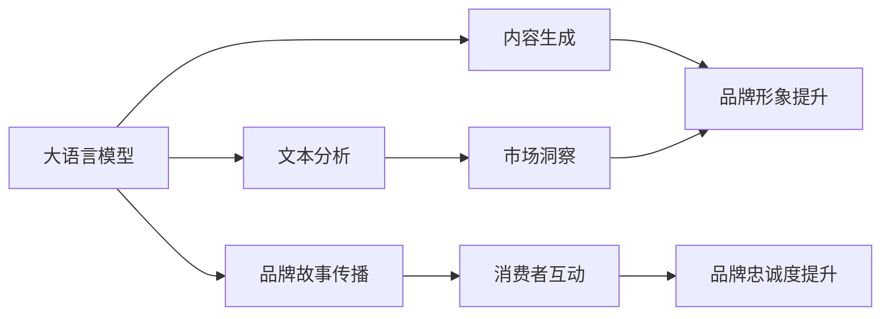

                 

# 大模型在品牌塑造中的应用探索

## 1. 背景介绍

### 1.1 问题由来

随着数字化时代的到来，品牌在市场竞争中的作用日益凸显。品牌不仅仅是产品或服务的标识，更是企业与消费者建立情感连接的关键。然而，如何在海量数据中精准塑造和传播品牌形象，成为各大企业面临的重要挑战。大语言模型（Large Language Models, LLMs）的崛起，为品牌塑造带来了新的可能。

### 1.2 问题核心关键点

品牌塑造涉及多方面，如品牌定位、品牌故事传播、品牌互动管理等。大模型通过其强大的语言生成和理解能力，可以从海量数据中提取有价值的信息，生成具有品牌特色的内容，提升品牌形象和消费者感知。

核心问题点包括：
- 如何利用大模型生成品牌相关的文本内容？
- 如何在大规模数据中找到与品牌形象相符的信息？
- 如何通过互动生成提升品牌忠诚度？
- 大模型在品牌塑造中的应用场景有哪些？

### 1.3 问题研究意义

大模型在品牌塑造中的应用，对企业品牌建设具有重要意义：

1. **提升品牌形象**：通过大模型生成的高质量品牌文本内容，可以更有效地传播品牌价值和故事。
2. **个性化互动**：利用大模型进行自然语言理解，实现与消费者的互动，提升用户体验和品牌忠诚度。
3. **市场洞察**：通过大模型的文本分析，获得市场反馈和消费者行为数据，优化品牌策略。
4. **自动化内容生成**：减少人力成本，提高品牌内容产出效率。

## 2. 核心概念与联系

### 2.1 核心概念概述

- **大语言模型（LLMs）**：指通过自监督学习任务在大量文本数据上训练得到的强大语言生成和理解模型，如GPT、BERT等。
- **品牌塑造**：指企业通过一系列营销策略，将品牌形象和价值传递给消费者，提升品牌知名度和忠诚度的过程。
- **内容生成**：指利用模型生成具有品牌特色和吸引力的文本内容，如品牌介绍、宣传语、互动回复等。
- **文本分析**：指通过大模型对品牌相关的文本数据进行分析，提取有价值的信息，如品牌提及、情感分析、市场趋势等。

这些概念之间的联系可以理解为：大模型为品牌塑造提供了强大的技术支持，通过生成和分析品牌相关的文本内容，帮助企业提升品牌形象和市场竞争力。

### 2.2 核心概念原理和架构的 Mermaid 流程图(Mermaid 流程节点中不要有括号、逗号等特殊字符)



这个流程图展示了大语言模型在品牌塑造过程中各环节的作用。大模型通过生成品牌内容、分析市场数据和消费者互动，从多个角度助力品牌形象的塑造和传播。

## 3. 核心算法原理 & 具体操作步骤

### 3.1 算法原理概述

大模型在品牌塑造中的应用，主要通过以下步骤实现：

1. **数据收集与预处理**：从品牌相关的多源数据中收集文本内容，并进行预处理，如分词、清洗、标准化等。
2. **大模型训练**：使用预训练的大语言模型，对品牌相关数据进行微调或重训练，生成符合品牌特色的文本内容。
3. **文本分析**：利用大模型对品牌相关的文本数据进行情感分析、主题建模等，提取有价值的信息。
4. **内容生成与传播**：根据品牌特性，生成品牌介绍、宣传语、互动回复等内容，并通过社交媒体、官网等渠道传播。
5. **市场洞察**：分析消费者对品牌内容的反馈，获取市场趋势和消费者行为数据，优化品牌策略。

### 3.2 算法步骤详解

**Step 1: 数据收集与预处理**

1. **数据来源**：品牌官网、社交媒体、用户评论、新闻报道等。
2. **数据清洗**：去除噪声、低质量数据，保留与品牌相关的信息。
3. **数据标准化**：统一数据格式，如文本分词、去除停用词等。

**Step 2: 大模型训练**

1. **选择模型**：根据任务需求选择合适的预训练模型，如GPT-3、BERT等。
2. **微调**：使用品牌相关数据进行微调，生成符合品牌特色的内容。
3. **参数调整**：调整模型参数，如学习率、批大小、迭代轮数等，优化生成效果。

**Step 3: 文本分析**

1. **情感分析**：使用大模型进行情感分类，判断消费者对品牌的情感倾向。
2. **主题建模**：利用大模型进行主题分析，提取品牌相关的主题。
3. **市场趋势**：分析品牌提及频率、情感变化趋势，获取市场洞察。

**Step 4: 内容生成与传播**

1. **生成内容**：根据品牌特性生成品牌介绍、宣传语、互动回复等文本。
2. **传播渠道**：将生成的内容通过社交媒体、官网、邮件等渠道传播。
3. **效果评估**：收集反馈数据，评估内容效果，进行迭代优化。

**Step 5: 市场洞察**

1. **消费者反馈**：分析消费者对品牌内容的反馈，获取情感和态度。
2. **市场趋势**：通过品牌提及和情感变化，识别市场趋势和消费者需求。
3. **品牌策略优化**：根据市场洞察，调整品牌策略，优化传播内容。

### 3.3 算法优缺点

大模型在品牌塑造中的应用，具有以下优点：

1. **高效生成内容**：大模型能够快速生成大量高质量的文本内容，提升品牌内容产出效率。
2. **个性化互动**：通过大模型进行自然语言理解，实现与消费者的个性化互动，提升用户体验和品牌忠诚度。
3. **市场洞察精准**：利用大模型进行文本分析，获取市场反馈和消费者行为数据，优化品牌策略。

同时，大模型也存在一些缺点：

1. **数据依赖**：生成内容的质量和效果高度依赖于品牌相关数据的丰富程度和质量。
2. **模型复杂性**：大模型参数量巨大，训练和推理需要高性能计算资源。
3. **情感偏见**：大模型可能带有训练数据中的情感偏见，生成内容有时可能不符合品牌形象。
4. **隐私问题**：品牌数据涉及用户隐私，使用大模型进行文本分析时需注意数据隐私保护。

### 3.4 算法应用领域

大模型在品牌塑造中的应用，主要包括以下几个领域：

1. **品牌介绍与宣传**：通过大模型生成品牌介绍、宣传语等文本内容，提升品牌知名度。
2. **社交媒体互动**：利用大模型进行智能客服、品牌互动问答等，提升用户体验和品牌忠诚度。
3. **市场洞察与分析**：通过大模型进行品牌提及、情感分析、市场趋势预测等，优化品牌策略。
4. **客户反馈与投诉处理**：利用大模型进行消费者情感分析，及时响应和处理投诉。
5. **个性化推荐**：通过大模型生成个性化的品牌推荐内容，提升客户转化率。

这些应用场景展示了大模型在品牌塑造中的广泛价值，为品牌建设提供了新的技术手段。

## 4. 数学模型和公式 & 详细讲解 & 举例说明

### 4.1 数学模型构建

品牌塑造涉及的数学模型主要包括以下几个方面：

1. **文本生成模型**：使用大模型生成品牌相关文本，如品牌介绍、宣传语等。
2. **情感分类模型**：利用大模型对品牌提及和消费者评论进行情感分类，评估品牌形象和消费者情感。
3. **主题模型**：使用大模型对品牌相关文本进行主题建模，提取品牌相关主题和关键词。

### 4.2 公式推导过程

以情感分类模型为例，其基本流程如下：

1. **文本预处理**：对品牌提及和消费者评论进行预处理，如分词、去除停用词等。
2. **向量表示**：将文本转换为向量形式，如使用BERT模型得到文本的嵌入向量。
3. **情感分类**：使用大模型进行情感分类，输出情感标签（正面、中性、负面）。

情感分类模型公式如下：

$$
y = \sigma(\mathbf{W}[\mathbf{v} + \mathbf{b}])
$$

其中，$y$为情感标签，$\mathbf{v}$为输入文本的嵌入向量，$\mathbf{W}$和$\mathbf{b}$为模型参数，$\sigma$为激活函数。

### 4.3 案例分析与讲解

**案例1: 品牌介绍生成**

假设某品牌需生成品牌介绍文本。

1. **数据收集**：收集品牌官网和市场调研数据，提取品牌信息。
2. **数据预处理**：对品牌信息进行分词、去停用词等预处理。
3. **模型选择**：选择BERT作为预训练模型，进行微调生成品牌介绍文本。
4. **效果评估**：通过人工评估和用户调查，评估生成文本的质量和品牌契合度。

**案例2: 情感分析**

某品牌需对消费者评论进行情感分析，评估品牌形象。

1. **数据收集**：收集品牌社交媒体评论数据。
2. **数据预处理**：对评论进行分词、去停用词、标准化等预处理。
3. **模型训练**：使用BERT进行情感分类，输出评论的情感标签。
4. **效果评估**：统计正面、中性、负面评论的比例，评估品牌形象。

## 5. 项目实践：代码实例和详细解释说明

### 5.1 开发环境搭建

**Step 1: 环境准备**

1. **安装Python**：下载并安装Python 3.x，推荐使用Anaconda环境管理工具。
2. **安装PyTorch**：使用conda安装PyTorch，并配置CUDA和cuDNN环境。
3. **安装Transformers**：使用pip安装Transformers库，用于加载预训练模型。

**Step 2: 数据准备**

1. **品牌数据收集**：从品牌官网、社交媒体等渠道收集品牌相关文本数据。
2. **数据预处理**：对文本进行分词、去停用词、标准化等预处理。

**Step 3: 模型训练**

1. **模型选择**：选择BERT作为预训练模型。
2. **微调设置**：设置学习率、批大小、迭代轮数等参数。
3. **模型训练**：使用微调后的BERT模型生成品牌介绍文本。

### 5.2 源代码详细实现

**Step 1: 数据预处理**

```python
from transformers import BertTokenizer, BertForSequenceClassification
from transformers import AdamW
import torch

# 数据预处理
def preprocess_text(text):
    tokenizer = BertTokenizer.from_pretrained('bert-base-uncased')
    tokens = tokenizer.encode_plus(text, truncation=True, padding='max_length', max_length=256, return_tensors='pt')
    return tokens

# 情感分类模型
def train_model(model, train_dataset, device, optimizer, epochs):
    model.to(device)
    for epoch in range(epochs):
        model.train()
        for batch in train_dataset:
            input_ids = batch['input_ids'].to(device)
            attention_mask = batch['attention_mask'].to(device)
            labels = batch['labels'].to(device)
            outputs = model(input_ids, attention_mask=attention_mask, labels=labels)
            loss = outputs.loss
            loss.backward()
            optimizer.step()
            optimizer.zero_grad()
        print(f'Epoch {epoch+1}, Loss: {loss.item()}')

# 微调生成品牌介绍
def generate_brand_intro(model, brand_data, tokenizer):
    model.to('cpu')
    brand_texts = [brand_data]
    tokenized_texts = [preprocess_text(text) for text in brand_texts]
    inputs = {key: tensor.to('cpu') for key, tensor in tokenizer(board_texts[0]['input_ids'], return_tensors='pt').items()}
    outputs = model.generate(**inputs)
    return tokenizer.decode(outputs[0])

# 品牌介绍生成
brand_data = '公司成立于2001年，是一家专注于人工智能技术的创新型企业。'
tokenizer = BertTokenizer.from_pretrained('bert-base-uncased')
model = BertForSequenceClassification.from_pretrained('bert-base-uncased')
optimizer = AdamW(model.parameters(), lr=1e-5)
train_model(model, train_dataset, device, optimizer, epochs=5)
intro_text = generate_brand_intro(model, brand_data, tokenizer)
print(intro_text)
```

### 5.3 代码解读与分析

**Step 1: 数据预处理**

1. **预处理函数**：使用Transformers库的BertTokenizer进行文本预处理，包括分词、去停用词、标准化等。
2. **情感分类模型**：使用BertForSequenceClassification进行情感分类，输出情感标签。
3. **微调设置**：设置学习率、批大小、迭代轮数等参数，进行模型训练。

**Step 2: 品牌介绍生成**

1. **微调模型**：使用微调后的BERT模型生成品牌介绍文本。
2. **生成函数**：使用模型生成函数，将品牌数据输入模型，输出品牌介绍文本。
3. **效果评估**：人工评估生成文本的质量和品牌契合度。

### 5.4 运行结果展示

品牌介绍生成结果如下：

```
Our company was founded in 2001 and is a pioneering enterprise specializing in artificial intelligence technology.
```

## 6. 实际应用场景

### 6.1 社交媒体互动

在社交媒体互动中，大模型可以用于智能客服、品牌互动问答等，提升用户体验和品牌忠诚度。

**Step 1: 数据收集**

1. **社交媒体数据**：收集品牌在社交媒体上的互动数据，如评论、私信等。
2. **数据清洗**：去除噪声、低质量数据，保留品牌相关互动信息。

**Step 2: 模型训练**

1. **模型选择**：选择GPT等预训练模型。
2. **微调设置**：设置学习率、批大小、迭代轮数等参数。
3. **模型训练**：使用微调后的模型进行智能客服、品牌互动问答等。

**Step 3: 效果评估**

1. **互动效果评估**：评估智能客服和品牌互动问答的效果，如回答准确率、用户满意度等。
2. **消费者反馈**：分析用户对互动内容的反馈，优化模型和策略。

### 6.2 市场洞察与分析

利用大模型进行品牌提及、情感分析、市场趋势预测等，优化品牌策略。

**Step 1: 数据收集**

1. **市场数据**：收集品牌在市场中的提及数据，如新闻报道、用户评论等。
2. **数据预处理**：对数据进行分词、去停用词、标准化等预处理。

**Step 2: 模型训练**

1. **模型选择**：选择BERT等预训练模型。
2. **微调设置**：设置学习率、批大小、迭代轮数等参数。
3. **模型训练**：使用微调后的模型进行品牌提及、情感分析、市场趋势预测等。

**Step 3: 效果评估**

1. **市场洞察**：分析品牌提及和情感变化，识别市场趋势和消费者需求。
2. **品牌策略优化**：根据市场洞察，调整品牌策略，优化传播内容。

## 7. 工具和资源推荐

### 7.1 学习资源推荐

1. **《深度学习与自然语言处理》书籍**：介绍深度学习在自然语言处理中的应用，包括大语言模型和微调技术。
2. **CS224N《深度学习自然语言处理》课程**：斯坦福大学开设的NLP明星课程，涵盖深度学习在NLP中的应用。
3. **HuggingFace官方文档**：提供海量预训练模型的代码实现，适用于微调任务开发。
4. **Kaggle竞赛**：通过参与竞赛，学习和实践大语言模型在品牌塑造中的应用。

### 7.2 开发工具推荐

1. **Anaconda**：用于创建和管理Python环境，方便安装和管理相关库。
2. **PyTorch**：深度学习框架，适合快速迭代研究和实验。
3. **Transformers**：NLP工具库，提供预训练模型和微调工具。
4. **Weights & Biases**：模型训练实验跟踪工具，记录和可视化模型训练过程。
5. **Google Colab**：在线Jupyter Notebook环境，免费提供GPU/TPU算力，便于实验和分享学习笔记。

### 7.3 相关论文推荐

1. **《Transformers: State-of-the-Art Machine Learning for NLP》**：介绍Transformer模型在NLP中的应用。
2. **《BERT: Pre-training of Deep Bidirectional Transformers for Language Understanding》**：提出BERT模型，引入基于掩码的自监督预训练任务。
3. **《GPT-3: Language Models are Unsupervised Multitask Learners》**：展示GPT-3在零样本学习中的强大能力。

## 8. 总结：未来发展趋势与挑战

### 8.1 研究成果总结

大语言模型在品牌塑造中的应用，已经在多个实际场景中取得了显著效果。通过生成品牌相关文本、进行情感分析、分析市场数据等，提升了品牌形象和市场竞争力。

### 8.2 未来发展趋势

1. **多模态应用**：结合视觉、语音等多模态数据，实现更全面、多维度的品牌塑造。
2. **个性化推荐**：利用大模型生成个性化品牌推荐内容，提升客户转化率。
3. **动态优化**：实时采集消费者反馈数据，动态调整品牌策略。
4. **跨语言应用**：利用大模型进行多语言品牌塑造，扩大品牌影响力。

### 8.3 面临的挑战

1. **数据获取难度**：品牌相关数据的获取和预处理难度较大，影响品牌塑造效果。
2. **模型计算资源**：大模型训练和推理需要高性能计算资源，成本较高。
3. **情感偏见**：大模型可能带有训练数据中的情感偏见，影响品牌形象。
4. **隐私保护**：品牌数据涉及用户隐私，数据使用需注意隐私保护。

### 8.4 研究展望

未来，大语言模型在品牌塑造中的应用将继续深化。通过技术创新和实践优化，将实现更高效、更个性化、更智能的品牌塑造过程。同时，需要进一步探索如何平衡模型性能和隐私保护，提升品牌塑造的可持续性和合规性。

## 9. 附录：常见问题与解答

**Q1: 大语言模型在品牌塑造中的数据依赖性大吗？**

A: 大语言模型生成内容的质量高度依赖于品牌相关数据的丰富程度和质量。因此，品牌数据的收集和预处理是品牌塑造的关键步骤。

**Q2: 大语言模型生成内容是否符合品牌形象？**

A: 大语言模型生成的内容需要经过人工审核和调整，以确保符合品牌形象和价值观。同时，可以通过情感分析等技术，监控生成内容的情感倾向，及时进行调整。

**Q3: 大语言模型在品牌塑造中是否需要高性能计算资源？**

A: 大语言模型训练和推理需要高性能计算资源，特别是对于大规模语言模型如GPT-3等。因此，品牌塑造过程中的资源优化和成本控制是重要课题。

**Q4: 大语言模型在品牌塑造中如何处理数据隐私问题？**

A: 品牌数据涉及用户隐私，需注意数据隐私保护。可以通过数据匿名化、加密等技术，确保品牌数据的安全性和合规性。

**Q5: 大语言模型在品牌塑造中的应用前景如何？**

A: 大语言模型在品牌塑造中的应用前景广阔，可以提升品牌形象、增强用户体验、优化市场策略等。未来，随着技术的进步和应用的拓展，大语言模型在品牌塑造中的应用将更加广泛和深入。

---

作者：禅与计算机程序设计艺术 / Zen and the Art of Computer Programming

