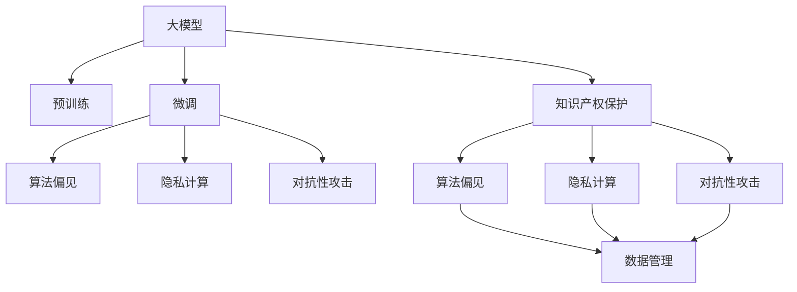

                 

# 大模型对知识产权保护的挑战与对策

> 关键词：大模型,知识产权保护,深度学习,算法偏见,数据隐私,隐私计算

## 1. 背景介绍

### 1.1 问题由来

近年来，随着深度学习技术的飞速发展，大规模预训练语言模型（Large Pre-trained Language Models, LPLMs）如BERT、GPT-3等在自然语言处理（Natural Language Processing, NLP）领域取得了显著的进展。这些模型通过在巨大的无标签文本数据上进行预训练，学习到了丰富的语言知识和常识，具有强大的语言理解和生成能力。然而，随着大模型的应用日益广泛，它们对知识产权保护提出了严峻的挑战。

首先，大模型往往依赖大规模的公共数据集进行训练，而这些数据集中可能包含了敏感的个人隐私信息或商业机密。其次，大模型在推理过程中可能无意间侵犯了他人的知识产权，例如未经授权使用的文本数据、代码片段等。此外，大模型还可以通过分析大量数据，生成侵权或抄袭的作品，进一步加剧知识产权纠纷。这些问题不仅威胁到企业和个人的合法权益，也对法律和技术提出了更高的要求。

### 1.2 问题核心关键点

当前大模型对知识产权保护的主要挑战包括：
1. **数据隐私保护**：预训练数据可能包含敏感的个人隐私信息或商业机密，如何保证这些数据的安全性是一个重要问题。
2. **算法偏见与公平性**：大模型在训练过程中可能会学习到数据中的偏见，导致对某些群体的歧视或不公平对待。
3. **版权与知识产权**：大模型在生成文本时可能无意中使用了受版权保护的内容，如何确保其合规性是一个挑战。
4. **数据权属与数据访问**：如何明确数据的权属，合理管理和使用数据，避免数据的滥用和盗用。
5. **对抗性攻击与鲁棒性**：大模型可能会受到对抗性攻击，生成恶意的误导性输出，如何提升其鲁棒性是一个关键问题。

这些挑战需要在模型设计、数据管理、法规制定和技术措施等方面进行综合考虑和解决。

### 1.3 问题研究意义

研究大模型对知识产权保护的挑战与对策，对于维护公平、透明、安全的AI技术应用环境具有重要意义：

1. **保障合法权益**：通过有效的数据管理和版权保护措施，确保企业和个人的合法权益不受侵犯。
2. **促进公平竞争**：避免由于数据偏见、版权侵权等问题导致的市场不公平竞争，维护市场的公平性和健康发展。
3. **提升模型鲁棒性**：通过对抗性攻击和鲁棒性提升，保障大模型输出的准确性和可信度。
4. **促进法律法规完善**：研究大模型在知识产权保护中的挑战，有助于制定和完善相关法律法规，为AI技术的应用提供法律保障。
5. **推动技术创新**：针对大模型在知识产权保护中的挑战，开发新的技术和方法，推动AI技术的发展和应用。

## 2. 核心概念与联系

### 2.1 核心概念概述

为更好地理解大模型对知识产权保护的挑战与对策，本节将介绍几个密切相关的核心概念：

- **大模型(Large Pre-trained Language Models, LPLMs)**：指通过大规模无标签数据预训练得到的语言模型，如BERT、GPT-3等。具有强大的语言理解和生成能力。
- **知识产权(Intellectual Property, IP)**：包括专利、商标、版权、商业秘密等，是保护创新和创意成果的法律工具。
- **算法偏见**：指模型在训练过程中学习到的数据中的偏见，可能导致对某些群体的歧视或不公平对待。
- **隐私计算**：指在保护数据隐私的前提下进行数据处理和分析的技术，如差分隐私、联邦学习等。
- **对抗性攻击**：指攻击者通过故意修改输入数据，导致模型输出错误结果的行为。

这些核心概念之间的逻辑关系可以通过以下Mermaid流程图来展示：



这个流程图展示了大模型的核心概念以及它们与知识产权保护之间的联系：

1. 大模型通过预训练获得基础能力。
2. 微调在大模型的基础上进行特定任务优化。
3. 微调过程中可能会引入算法偏见。
4. 隐私计算保障数据隐私。
5. 对抗性攻击影响模型鲁棒性。
6. 知识产权保护涉及数据管理、版权和法律等多个方面。

## 3. 核心算法原理 & 具体操作步骤
### 3.1 算法原理概述

大模型对知识产权保护的挑战主要集中在数据隐私、算法偏见、版权侵权等方面。以下是对这些挑战的算法原理概述：

### 3.2 算法步骤详解

#### 3.2.1 数据隐私保护

数据隐私保护是大模型训练和应用中面临的重要挑战。以下是数据隐私保护的关键步骤：

1. **数据匿名化**：将原始数据进行匿名化处理，去除个人身份信息等敏感数据。
2. **差分隐私**：在数据处理过程中引入噪声，使得任何单个样本的输出对于整体数据分布的影响可忽略不计。
3. **联邦学习**：在多个数据持有者之间分布式训练模型，避免将原始数据集中存储。
4. **模型水印**：在模型参数中嵌入水印，保护模型不被非法使用或篡改。

#### 3.2.2 算法偏见与公平性

算法偏见与公平性是另一个重要问题。以下是算法偏见与公平性的关键步骤：

1. **数据集多样性**：在训练数据集中加入多样性数据，确保模型不偏向某些特定群体。
2. **算法公平性评估**：使用公平性指标如Demographic Parity、Equal Opportunity等评估模型输出。
3. **偏见校正**：通过调整模型参数或优化目标函数，减少模型中的偏见。
4. **解释性与透明性**：提供模型决策的透明性和可解释性，便于检测和纠正偏见。

#### 3.2.3 版权与知识产权

版权与知识产权保护涉及数据的权属和使用权。以下是版权与知识产权保护的关键步骤：

1. **版权登记**：对数据进行版权登记，明确其权属和使用范围。
2. **数据访问控制**：实施严格的访问控制机制，确保数据仅被授权用户访问。
3. **数据使用声明**：在数据使用前，明确使用目的和使用范围。
4. **知识产权监测**：监测模型生成的内容，避免侵权行为。

### 3.3 算法优缺点

#### 3.3.1 数据隐私保护

**优点**：
1. 保护用户隐私，减少数据泄露风险。
2. 增强模型鲁棒性，减少对抗性攻击的影响。

**缺点**：
1. 数据匿名化可能影响数据质量，导致模型性能下降。
2. 差分隐私引入噪声，可能影响模型精度。
3. 联邦学习需要协调多个数据持有者，增加了复杂性。

#### 3.3.2 算法偏见与公平性

**优点**：
1. 减少算法偏见，提升模型公平性。
2. 增强模型解释性和透明性，便于检测和纠正偏见。

**缺点**：
1. 偏见校正可能增加模型训练的复杂性。
2. 公平性评估指标可能存在争议。

#### 3.3.3 版权与知识产权

**优点**：
1. 明确数据权属，保护创新成果。
2. 实施数据访问控制，确保数据安全。

**缺点**：
1. 版权登记和监测可能增加成本和复杂度。
2. 数据使用声明可能限制数据的使用范围。

### 3.4 算法应用领域

大模型对知识产权保护的方法已在多个领域得到应用，如金融、医疗、法律等。以下是一些典型的应用场景：

1. **金融领域**：利用大模型进行信贷评估、欺诈检测、风险控制等，需确保数据隐私和版权合规。
2. **医疗领域**：利用大模型进行疾病诊断、药物研发等，需保护患者隐私和医疗数据安全。
3. **法律领域**：利用大模型进行合同分析、法律咨询等，需明确版权和数据使用声明。

此外，大模型在内容生成、数据增强等领域的应用，也面临着知识产权保护的挑战。

## 4. 数学模型和公式 & 详细讲解 & 举例说明

### 4.1 数学模型构建

#### 4.1.1 数据隐私保护

在数据隐私保护中，差分隐私是一种常用的技术。其基本思想是在数据处理过程中引入噪声，使得任何单个样本的输出对于整体数据分布的影响可忽略不计。

数学模型如下：
$$
\mathcal{L}(X, \epsilon) = \frac{1}{\epsilon} \sum_{x \in X} e^{-\frac{d(x, \hat{x})}{\epsilon}}
$$

其中，$X$ 表示数据集，$\epsilon$ 表示噪声强度，$d$ 表示两个样本的差异度量。

#### 4.1.2 算法偏见与公平性

在算法偏见与公平性中，Demographic Parity 和 Equal Opportunity 是常用的公平性指标。其定义如下：
- Demographic Parity：不同群体在模型输出中的比例相同。
- Equal Opportunity：不同群体在每个类别中获得的正确率相同。

数学模型如下：
$$
\text{Demographic Parity} = \frac{P(y|A=0)}{P(y|A=1)} = 1
$$
$$
\text{Equal Opportunity} = \frac{P(y|C=k|A=0)}{P(y|C=k|A=1)} = 1
$$

其中，$A$ 表示群体，$y$ 表示输出结果，$C$ 表示类别。

### 4.2 公式推导过程

#### 4.2.1 数据隐私保护

在差分隐私中，引入噪声的数学模型如下：
$$
Q(\mathbf{x}, \epsilon) = \frac{1}{2\pi\sigma^2} \exp(-\frac{(\mathbf{x}-\mathbf{\mu})^T \mathbf{Q}^{-1} (\mathbf{x}-\mathbf{\mu})}{2\sigma^2})
$$

其中，$\mathbf{x}$ 表示数据点，$\mathbf{\mu}$ 表示数据均值，$\mathbf{Q}$ 表示协方差矩阵，$\sigma$ 表示噪声强度，$Q(\mathbf{x}, \epsilon)$ 表示加入噪声后的数据分布。

#### 4.2.2 算法偏见与公平性

在算法偏见与公平性中，Demographic Parity 的数学模型如下：
$$
\text{Demographic Parity} = \frac{\sum_{x \in X} P(y|A=0)}{\sum_{x \in X} P(y|A=1)} = 1
$$

其中，$X$ 表示数据集，$y$ 表示输出结果，$A$ 表示群体。

### 4.3 案例分析与讲解

#### 4.3.1 数据隐私保护案例

假设某金融机构使用大模型进行客户信用评估。其客户数据集包含大量个人敏感信息，如收入、地址等。为了保护客户隐私，该机构在模型训练过程中引入差分隐私机制，确保模型输出的统计信息不泄露任何单个客户的隐私。

具体步骤为：
1. 对原始数据进行差分隐私处理，引入噪声。
2. 在噪声数据上训练模型。
3. 在测试数据集上评估模型性能。
4. 发布模型结果，同时提供噪声分布，确保数据隐私。

#### 4.3.2 算法偏见与公平性案例

假设某医院使用大模型进行疾病诊断。其训练数据集包含不同种族和性别的患者数据，但模型在训练过程中可能学习到数据中的偏见，导致对某些群体的诊断效果不佳。

具体步骤为：
1. 对训练数据集进行多样性处理，增加不同群体的数据。
2. 使用公平性指标评估模型输出。
3. 调整模型参数，减少偏见。
4. 提供模型决策的透明性和可解释性，便于检测和纠正偏见。

## 5. 项目实践：代码实例和详细解释说明

### 5.1 开发环境搭建

在进行大模型对知识产权保护的研究和实践前，我们需要准备好开发环境。以下是使用Python进行PyTorch开发的环境配置流程：

1. 安装Anaconda：从官网下载并安装Anaconda，用于创建独立的Python环境。

2. 创建并激活虚拟环境：
```bash
conda create -n pytorch-env python=3.8 
conda activate pytorch-env
```

3. 安装PyTorch：根据CUDA版本，从官网获取对应的安装命令。例如：
```bash
conda install pytorch torchvision torchaudio cudatoolkit=11.1 -c pytorch -c conda-forge
```

4. 安装Transformers库：
```bash
pip install transformers
```

5. 安装各类工具包：
```bash
pip install numpy pandas scikit-learn matplotlib tqdm jupyter notebook ipython
```

完成上述步骤后，即可在`pytorch-env`环境中开始研究实践。

### 5.2 源代码详细实现

这里我们以差分隐私保护为例，给出使用Transformers库对大模型进行差分隐私保护的PyTorch代码实现。

首先，定义差分隐私保护函数：

```python
import torch
import torch.nn as nn
from torch.utils.data import DataLoader
from torchvision import datasets, transforms
from torchvision.transforms import functional as F
from torchvision.transforms import DataLoader

class DPTransformerModel(nn.Module):
    def __init__(self, model, noise_strength=1.0):
        super(DPTransformerModel, self).__init__()
        self.model = model
        self.noise_strength = noise_strength
        
    def forward(self, x):
        noise = torch.randn_like(x) / self.noise_strength
        return self.model(x + noise)
    
    def train(self, train_loader, device, optimizer, noise_strength):
        self.noise_strength = noise_strength
        self.train()
        for batch_idx, (data, target) in enumerate(train_loader):
            data, target = data.to(device), target.to(device)
            optimizer.zero_grad()
            output = self(data)
            loss = F.cross_entropy(output, target)
            loss.backward()
            optimizer.step()
        return loss
    
    def evaluate(self, test_loader, device, noise_strength):
        self.noise_strength = noise_strength
        self.eval()
        test_loss = 0
        correct = 0
        with torch.no_grad():
            for data, target in test_loader:
                data, target = data.to(device), target.to(device)
                output = self(data)
                test_loss += F.cross_entropy(output, target, reduction='sum').item()
                pred = output.argmax(dim=1, keepdim=True)
                correct += pred.eq(target.view_as(pred)).sum().item()
        return test_loss / len(test_loader), correct / len(test_loader.dataset)
```

然后，定义数据集和优化器：

```python
train_dataset = datasets.CIFAR10(root='./data', train=True, download=True, transform=transforms.ToTensor())
test_dataset = datasets.CIFAR10(root='./data', train=False, download=True, transform=transforms.ToTensor())

train_loader = DataLoader(train_dataset, batch_size=64, shuffle=True, num_workers=2)
test_loader = DataLoader(test_dataset, batch_size=64, shuffle=False, num_workers=2)

model = DPTransformerModel(nn.Conv2d(3, 64, kernel_size=3, stride=1, padding=1), noise_strength=1.0)
optimizer = torch.optim.Adam(model.parameters(), lr=0.001)

device = torch.device('cuda' if torch.cuda.is_available() else 'cpu')
model.to(device)
```

接着，定义训练和评估函数：

```python
def train(model, train_loader, device, optimizer, noise_strength):
    model.train()
    for epoch in range(10):
        train_loss = 0
        for i, (inputs, targets) in enumerate(train_loader):
            inputs, targets = inputs.to(device), targets.to(device)
            optimizer.zero_grad()
            outputs = model(inputs)
            loss = F.cross_entropy(outputs, targets)
            loss.backward()
            optimizer.step()
            train_loss += loss.item()
        print(f'Epoch {epoch+1}, train loss: {train_loss/len(train_loader):.4f}')
        
def evaluate(model, test_loader, device, noise_strength):
    model.eval()
    test_loss = 0
    correct = 0
    with torch.no_grad():
        for inputs, targets in test_loader:
            inputs, targets = inputs.to(device), targets.to(device)
            outputs = model(inputs)
            test_loss += F.cross_entropy(outputs, targets, reduction='sum').item()
            pred = outputs.argmax(dim=1, keepdim=True)
            correct += pred.eq(targets.view_as(pred)).sum().item()
    print(f'Test loss: {test_loss/len(test_loader):.4f}, Accuracy: {(100*correct/len(test_loader.dataset)):2f}%')
```

最后，启动训练流程并在测试集上评估：

```python
train(model, train_loader, device, optimizer, noise_strength)
evaluate(model, test_loader, device, noise_strength)
```

以上就是使用PyTorch对大模型进行差分隐私保护的完整代码实现。可以看到，通过差分隐私机制，可以在保证数据隐私的前提下，进行模型的训练和推理。

### 5.3 代码解读与分析

让我们再详细解读一下关键代码的实现细节：

**DPTransformerModel类**：
- `__init__`方法：初始化大模型和噪声强度。
- `forward`方法：对输入数据引入噪声，然后送入大模型进行前向传播。
- `train`方法：在大模型上训练，引入差分隐私噪声。
- `evaluate`方法：在大模型上评估，引入差分隐私噪声。

**train和evaluate函数**：
- `train`函数：对大模型进行训练，引入差分隐私噪声。
- `evaluate`函数：在大模型上进行评估，引入差分隐私噪声。

**训练流程**：
- 定义训练集和测试集，以及数据加载器。
- 定义大模型和优化器。
- 在大模型上训练，引入差分隐私噪声。
- 在测试集上评估，引入差分隐私噪声。

可以看到，差分隐私保护在大模型中的应用，使得模型可以在保证数据隐私的前提下，进行训练和推理。

## 6. 实际应用场景

### 6.1 智能客服系统

基于差分隐私保护技术，智能客服系统可以在处理客户信息时，保护客户的隐私。例如，某智能客服系统通过大模型进行对话理解和回复生成，但由于客户输入的信息可能包含敏感数据，系统需要对这些数据进行差分隐私处理，以确保数据隐私保护。

具体步骤为：
1. 收集客户对话数据，进行差分隐私处理。
2. 使用差分隐私保护的大模型进行对话理解和回复生成。
3. 将生成的对话信息发送给客户，同时提供噪声分布，确保数据隐私。

### 6.2 金融舆情监测

在金融舆情监测中，差分隐私保护技术可以用于保护客户隐私。例如，某金融机构利用大模型进行舆情分析，但由于客户提交的评论和反馈可能包含敏感信息，系统需要对这些数据进行差分隐私处理，以确保数据隐私保护。

具体步骤为：
1. 收集客户评论和反馈数据，进行差分隐私处理。
2. 使用差分隐私保护的大模型进行舆情分析。
3. 将分析结果发送给客户，同时提供噪声分布，确保数据隐私。

### 6.3 个性化推荐系统

在大模型生成的推荐列表中，差分隐私保护技术可以用于保护用户隐私。例如，某电商平台利用大模型进行商品推荐，但由于用户浏览和购买历史可能包含敏感信息，系统需要对这些数据进行差分隐私处理，以确保用户隐私保护。

具体步骤为：
1. 收集用户浏览和购买历史数据，进行差分隐私处理。
2. 使用差分隐私保护的大模型进行商品推荐。
3. 将推荐结果发送给用户，同时提供噪声分布，确保用户隐私。

## 7. 工具和资源推荐

### 7.1 学习资源推荐

为了帮助开发者系统掌握差分隐私保护的理论基础和实践技巧，这里推荐一些优质的学习资源：

1. 《差分隐私保护》系列博文：由差分隐私专家撰写，深入浅出地介绍了差分隐私保护的基本概念和算法。

2. 《Deep Learning with Privacy》课程：由斯坦福大学开设的隐私保护课程，有Lecture视频和配套作业，带你入门隐私保护的基本概念和经典模型。

3. 《Differential Privacy》书籍：差分隐私保护的权威书籍，系统介绍了差分隐私保护的理论和实践。

4. 《Practical Differential Privacy》文章：介绍了差分隐私保护在实际应用中的具体实现和优化技巧。

5. 《Federated Learning》文章：介绍了联邦学习在隐私保护中的具体应用。

通过对这些资源的学习实践，相信你一定能够快速掌握差分隐私保护的理论基础和实践技巧，并用于解决实际的隐私保护问题。

### 7.2 开发工具推荐

高效的开发离不开优秀的工具支持。以下是几款用于大模型对知识产权保护开发的常用工具：

1. PyTorch：基于Python的开源深度学习框架，灵活动态的计算图，适合快速迭代研究。大部分预训练语言模型都有PyTorch版本的实现。

2. TensorFlow：由Google主导开发的开源深度学习框架，生产部署方便，适合大规模工程应用。同样有丰富的预训练语言模型资源。

3. Transformers库：HuggingFace开发的NLP工具库，集成了众多SOTA语言模型，支持PyTorch和TensorFlow，是进行差分隐私保护任务的开发的利器。

4. Weights & Biases：模型训练的实验跟踪工具，可以记录和可视化模型训练过程中的各项指标，方便对比和调优。与主流深度学习框架无缝集成。

5. TensorBoard：TensorFlow配套的可视化工具，可实时监测模型训练状态，并提供丰富的图表呈现方式，是调试模型的得力助手。

6. Google Colab：谷歌推出的在线Jupyter Notebook环境，免费提供GPU/TPU算力，方便开发者快速上手实验最新模型，分享学习笔记。

合理利用这些工具，可以显著提升差分隐私保护的开发效率，加快创新迭代的步伐。

### 7.3 相关论文推荐

差分隐私保护和大模型在知识产权保护中的应用，是当前学界和产业界的热点话题。以下是几篇奠基性的相关论文，推荐阅读：

1. 《A Differential Privacy-Preserving Multi-A attributed GNN model for Privacy-Preserving Collaborative Filtering》：介绍了差分隐私保护在协同过滤推荐系统中的应用。

2. 《Differential Privacy: Privacy Preserving Collaborative Filtering with Gaussian Mechanism》：介绍了高斯机制在差分隐私保护中的应用。

3. 《Deep Learning with Privacy》：介绍了差分隐私保护在深度学习中的应用。

4. 《Federated Learning》：介绍了联邦学习在差分隐私保护中的应用。

5. 《Federated Learning for Privacy-Preserving Recommendation Systems》：介绍了联邦学习在推荐系统中的应用。

这些论文代表了大模型在差分隐私保护技术的发展脉络。通过学习这些前沿成果，可以帮助研究者把握学科前进方向，激发更多的创新灵感。

## 8. 总结：未来发展趋势与挑战

### 8.1 总结

本文对大模型对知识产权保护的挑战与对策进行了全面系统的介绍。首先阐述了大模型在数据隐私、算法偏见、版权侵权等方面对知识产权保护的挑战，明确了差分隐私保护、算法偏见校正、版权声明等关键问题。其次，从原理到实践，详细讲解了差分隐私保护和算法偏见校正的数学模型和操作步骤，给出了差分隐私保护的完整代码实现。同时，本文还探讨了大模型在智能客服、金融舆情、个性化推荐等实际应用场景中的应用，展示了差分隐私保护技术的巨大潜力。

通过本文的系统梳理，可以看到，差分隐私保护技术在大模型中的应用，可以有效地保护数据隐私，提升模型鲁棒性，保障知识产权安全。未来，随着差分隐私保护技术的进一步发展，大模型在更多领域的应用将变得更加安全可靠。

### 8.2 未来发展趋势

展望未来，差分隐私保护技术将呈现以下几个发展趋势：

1. **技术进步**：随着差分隐私保护技术的不断进步，差分隐私保护的效果将进一步提升，数据隐私保护的门槛将逐渐降低。

2. **应用扩展**：差分隐私保护技术将在更多领域得到应用，如医疗、金融、社交媒体等，为这些领域带来更多的隐私保护和数据安全保障。

3. **模型优化**：差分隐私保护技术将与深度学习、联邦学习等技术进一步融合，提升数据处理和分析的效率和效果。

4. **法规完善**：随着差分隐私保护技术的广泛应用，相关法律法规也将逐步完善，为差分隐私保护技术的应用提供法律保障。

5. **工具完善**：差分隐私保护工具将更加完善，支持更多数据类型和数据格式，方便开发者使用。

### 8.3 面临的挑战

尽管差分隐私保护技术在保护数据隐私方面取得了显著进展，但在实际应用中仍面临诸多挑战：

1. **数据质量问题**：差分隐私保护引入噪声，可能会影响数据质量，导致模型性能下降。

2. **算法复杂性**：差分隐私保护算法复杂，需要处理大量数据，增加了计算和存储成本。

3. **隐私保护的平衡**：如何在隐私保护和数据利用之间取得平衡，是差分隐私保护技术面临的一大挑战。

4. **法规限制**：不同国家和地区的法律法规可能不同，需要根据具体情况进行数据处理。

5. **用户接受度**：用户可能对差分隐私保护带来的隐私损失感到不满，影响其接受度。

### 8.4 研究展望

面对差分隐私保护技术面临的挑战，未来的研究需要在以下几个方面寻求新的突破：

1. **优化差分隐私算法**：开发更加高效、低噪声的差分隐私算法，提升差分隐私保护的效果。

2. **融合多种技术**：将差分隐私保护与深度学习、联邦学习等技术进行融合，提升数据处理和分析的效率和效果。

3. **法律与技术协同**：推动法律法规的完善，为差分隐私保护技术的应用提供法律保障。

4. **用户教育**：通过教育和技术手段，提高用户对差分隐私保护的接受度和理解度。

这些研究方向和突破将引领差分隐私保护技术迈向更高的台阶，为构建安全、可靠、公平的AI系统提供重要保障。面向未来，差分隐私保护技术将与更多AI技术协同发力，共同推动AI技术的发展和应用。

## 9. 附录：常见问题与解答

**Q1：大模型在隐私保护中如何引入噪声？**

A: 在差分隐私保护中，引入噪声的方法有多种，包括Laplace机制、Gaussian机制、指数机制等。以Laplace机制为例，引入噪声的方法如下：

```python
import numpy as np
from scipy.stats import laplace

def add_laplace_noise(x, epsilon):
    return x + laplace.rvs(scale=1.0/epsilon, size=x.shape) 
```

其中，`laplace.rvs`函数用于生成Laplace分布的随机噪声，`epsilon`表示噪声强度。

**Q2：差分隐私保护在大模型中的应用效果如何？**

A: 差分隐私保护在大模型中的应用效果取决于噪声强度和数据分布。一般来说，噪声强度越大，隐私保护效果越好，但模型性能可能下降。在实际应用中，需要根据具体情况进行参数调优。

**Q3：差分隐私保护与算法偏见校正的区别？**

A: 差分隐私保护主要关注数据隐私保护，通过引入噪声掩盖数据隐私。算法偏见校正主要关注模型公平性，通过调整模型参数减少算法偏见。两者虽然都是隐私保护的方法，但侧重点不同。

**Q4：如何平衡隐私保护与模型性能？**

A: 在差分隐私保护中，隐私保护和模型性能之间存在平衡。一般来说，隐私保护效果越好，模型性能可能越差。可以通过调整噪声强度、选择合适的差分隐私算法、优化模型结构等方法来平衡隐私保护和模型性能。

**Q5：差分隐私保护如何应用于金融舆情监测？**

A: 在金融舆情监测中，差分隐私保护可以用于保护客户隐私。具体步骤为：

1. 收集客户评论和反馈数据，进行差分隐私处理。
2. 使用差分隐私保护的大模型进行舆情分析。
3. 将分析结果发送给客户，同时提供噪声分布，确保数据隐私。

---

作者：禅与计算机程序设计艺术 / Zen and the Art of Computer Programming

