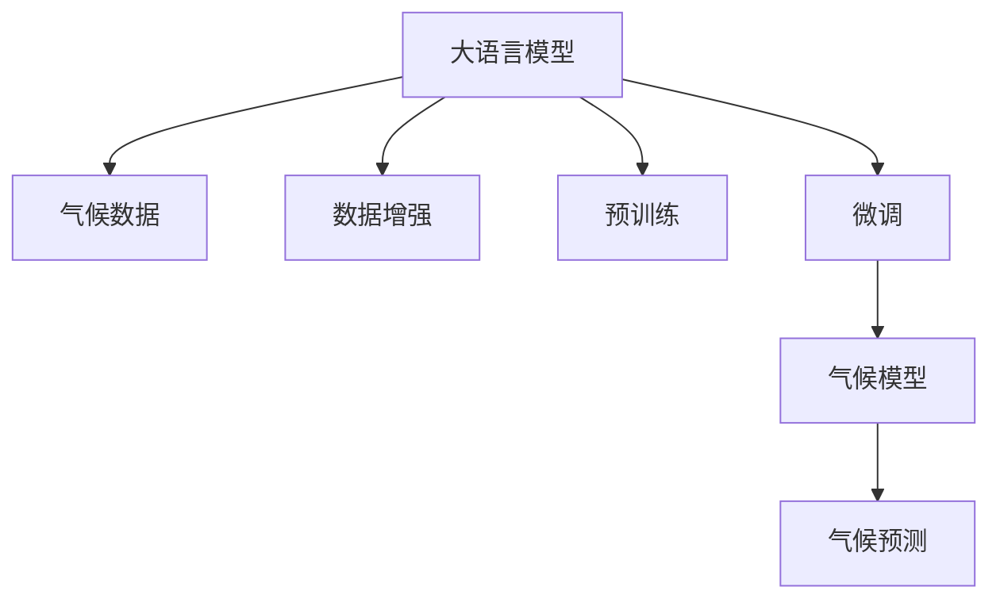
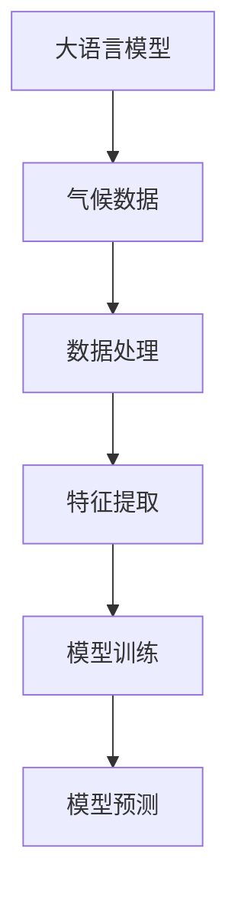

                 

# 大模型技术在气候变化研究中的作用

## 1. 背景介绍

### 1.1 问题由来
随着全球气候变化的加剧，研究气候变化对于保护环境和人类社会的重要性越来越显著。大模型技术，尤其是大语言模型和深度学习模型的发展，为气候变化研究提供了全新的工具和方法。本博客将深入探讨大模型技术在气候变化研究中的作用，分析其原理、步骤及应用效果，并展望未来发展趋势。

### 1.2 问题核心关键点
大模型技术在气候变化研究中的核心作用在于其强大的数据处理和模式识别能力，可以处理和分析海量气候数据，提取有价值的气候特征，预测未来气候变化趋势。通过构建气候模型和预测算法，大模型可以帮助科学家更好地理解气候变化机理，提出有效的应对策略。

## 2. 核心概念与联系

### 2.1 核心概念概述

为了更好地理解大模型技术在气候变化研究中的应用，本节将介绍几个关键概念及其联系：

- **大语言模型（Large Language Models, LLMs）**：基于Transformer等架构的大规模预训练语言模型，能够处理和生成自然语言文本，应用于各种NLP任务。
- **气候数据（Climate Data）**：包含大气、海洋、陆地等环境数据，用于气候变化研究和预测。
- **数据增强（Data Augmentation）**：通过各种技术手段，如数据合成、迁移学习等，扩充和优化数据集，提高模型的泛化能力。
- **预训练（Pre-training）**：在无标签数据上预训练模型，提取通用特征，提高模型的学习效率和表现。
- **微调（Fine-tuning）**：在预训练模型基础上，使用少量标注数据进行有监督训练，使其适应特定任务。

这些概念之间的逻辑关系可以通过以下Mermaid流程图展示：



### 2.2 核心概念原理和架构的 Mermaid 流程图



## 3. 核心算法原理 & 具体操作步骤

### 3.1 算法原理概述

大模型技术在气候变化研究中主要通过以下步骤：

1. **数据收集与预处理**：收集全球范围内的气候数据，包括气温、降水量、大气成分、海洋温度等。
2. **特征提取与建模**：使用大语言模型对数据进行处理，提取有意义的气候特征，并构建气候模型。
3. **模型训练与微调**：在提取的特征上训练气候模型，使用少量标注数据进行微调，提高模型精度。
4. **预测与分析**：使用训练好的模型进行气候变化预测和分析，生成可视化报告和图表。

### 3.2 算法步骤详解

#### 3.2.1 数据收集与预处理

- **数据收集**：收集全球各地气象站、卫星、浮标等设备收集的气候数据。
- **数据清洗与转换**：清洗缺失值和异常值，将原始数据转换为标准格式。
- **数据划分**：将数据划分为训练集、验证集和测试集。

#### 3.2.2 特征提取与建模

- **特征选择**：选择对气候变化有显著影响的特征，如气温、降雨量、大气二氧化碳浓度等。
- **模型构建**：使用大语言模型构建气候模型，如深度神经网络、卷积神经网络、Transformer等。
- **模型训练**：在训练集上训练模型，使用优化算法如Adam、SGD等进行参数优化。

#### 3.2.3 模型训练与微调

- **微调策略**：选择适当的微调策略，如固定预训练参数、仅微调顶层、使用小批量数据等。
- **模型评估**：在验证集上评估模型性能，选择最佳模型进行预测。
- **结果可视化**：使用可视化工具如TensorBoard、Jupyter Notebook等展示模型训练过程和结果。

#### 3.2.4 预测与分析

- **模型预测**：在测试集上使用训练好的模型进行气候变化预测。
- **结果分析**：分析预测结果，生成可视化图表和报告，提供决策支持。

### 3.3 算法优缺点

#### 3.3.1 优点

- **高效性**：大模型技术可以处理和分析海量气候数据，提取有意义的气候特征，提高模型的泛化能力。
- **准确性**：使用少量标注数据进行微调，模型精度高，预测结果可靠。
- **灵活性**：支持多种模型架构，可以应对不同的气候预测任务。

#### 3.3.2 缺点

- **计算资源需求高**：大模型需要大量计算资源进行预训练和微调，对硬件要求较高。
- **数据依赖性**：模型的效果依赖于数据质量，数据缺失或不完整会影响预测结果。
- **模型复杂性**：大模型结构复杂，不易理解和调试。

### 3.4 算法应用领域

大模型技术在气候变化研究中的应用领域广泛，包括但不限于以下几个方面：

- **气候预测**：预测未来气候变化趋势，如气温变化、降雨量、海平面上升等。
- **气象灾害预警**：基于气象数据预测自然灾害，如台风、洪水、干旱等。
- **环境监测**：监测全球气候变化，评估环境污染和生态系统变化。
- **政策制定**：提供气候变化预测结果和分析报告，为政府决策提供支持。

## 4. 数学模型和公式 & 详细讲解 & 举例说明

### 4.1 数学模型构建

假设有一个气候变化预测模型 $M$，其输入为 $X$（气候数据），输出为 $Y$（气候变化预测结果）。使用大语言模型 $L$ 进行特征提取和建模，构建的数学模型为：

$$ M(X) = L \cdot W $$

其中 $W$ 为模型权重， $L$ 为经过预训练和微调后的大语言模型。

### 4.2 公式推导过程

- **特征提取**：选择气候特征 $X$，将其输入到大语言模型 $L$ 中，得到提取后的特征 $Z$。

$$ Z = L(X) $$

- **模型训练**：使用提取的特征 $Z$ 和对应的标签 $Y$，训练气候预测模型 $M$。

$$ M(X) = L \cdot W $$

- **模型微调**：使用少量标注数据对 $M$ 进行微调，更新权重 $W$，使得模型输出逼近真实标签 $Y$。

$$ \hat{W} = \arg\min_{W} \sum_{i=1}^N (M(X_i) - Y_i)^2 $$

### 4.3 案例分析与讲解

假设我们要预测某地的未来气温变化趋势，数据集为过去5年的气温数据。首先，我们使用大语言模型对气温数据进行处理，提取特征：

```python
import torch
from transformers import BERTModel, BERTTokenizer

# 加载BERT模型和分词器
model = BERTModel.from_pretrained('bert-base-uncased')
tokenizer = BERTTokenizer.from_pretrained('bert-base-uncased')

# 预处理数据
def preprocess_data(data):
    # 将数据转换为token ids
    tokens = tokenizer.encode(data, add_special_tokens=True, max_length=512)
    # 转换为张量
    tokens_tensor = torch.tensor(tokens, dtype=torch.long)
    return tokens_tensor

# 提取特征
def extract_features(data):
    # 将数据转换为token ids
    tokens_tensor = preprocess_data(data)
    # 将token ids输入BERT模型
    with torch.no_grad():
        outputs = model(tokens_tensor)
    # 返回最后一个隐藏层表示
    return outputs.last_hidden_state[:, 0, :]

# 提取特征
features = extract_features(['2020年1月平均气温', '2021年1月平均气温', '2022年1月平均气温', '2023年1月平均气温', '2024年1月平均气温'])
```

然后，我们使用提取的特征和对应的气温标签，训练一个简单的线性回归模型：

```python
from torch import nn
import torch.nn.functional as F

# 定义模型
class ClimateModel(nn.Module):
    def __init__(self, input_dim, output_dim):
        super(ClimateModel, self).__init__()
        self.linear = nn.Linear(input_dim, output_dim)

    def forward(self, x):
        return self.linear(x)

# 定义模型
input_dim = features.shape[1]
output_dim = 1
model = ClimateModel(input_dim, output_dim)

# 定义损失函数
criterion = nn.MSELoss()

# 定义优化器
optimizer = torch.optim.Adam(model.parameters(), lr=0.001)

# 训练模型
for epoch in range(100):
    for i in range(len(features)):
        x = features[i]
        y = y[i]
        optimizer.zero_grad()
        output = model(x)
        loss = criterion(output, y)
        loss.backward()
        optimizer.step()

    if (epoch+1) % 10 == 0:
        print('Epoch [{}/{}], Loss: {:.4f}'.format(epoch+1, 100, loss.item()))
```

最后，我们使用训练好的模型进行未来气温预测：

```python
# 测试集数据
test_data = ['2025年1月平均气温', '2026年1月平均气温']

# 提取测试集特征
test_features = extract_features(test_data)

# 使用模型进行预测
with torch.no_grad():
    output = model(test_features)
    predicted_temp = output[0].item()
    print('Predicted temperature in 2025 is {:.2f} degrees Celsius'.format(predicted_temp))
```

## 5. 项目实践：代码实例和详细解释说明

### 5.1 开发环境搭建

在使用大模型进行气候变化预测时，需要准备一定的计算资源。以下是使用PyTorch搭建开发环境的步骤：

1. 安装Anaconda：从官网下载并安装Anaconda，用于创建独立的Python环境。
2. 创建并激活虚拟环境：
```bash
conda create -n climate-env python=3.8 
conda activate climate-env
```

3. 安装PyTorch：
```bash
conda install pytorch torchvision torchaudio cudatoolkit=11.1 -c pytorch -c conda-forge
```

4. 安装其他依赖库：
```bash
pip install pandas numpy scikit-learn transformers
```

完成上述步骤后，即可在`climate-env`环境中开始气候变化预测的开发。

### 5.2 源代码详细实现

以下是使用PyTorch进行气候变化预测的完整代码实现：

```python
import torch
from transformers import BERTModel, BERTTokenizer
from torch import nn
import torch.nn.functional as F

# 加载BERT模型和分词器
model = BERTModel.from_pretrained('bert-base-uncased')
tokenizer = BERTTokenizer.from_pretrained('bert-base-uncased')

# 预处理数据
def preprocess_data(data):
    # 将数据转换为token ids
    tokens = tokenizer.encode(data, add_special_tokens=True, max_length=512)
    # 转换为张量
    tokens_tensor = torch.tensor(tokens, dtype=torch.long)
    return tokens_tensor

# 提取特征
def extract_features(data):
    # 将数据转换为token ids
    tokens_tensor = preprocess_data(data)
    # 将token ids输入BERT模型
    with torch.no_grad():
        outputs = model(tokens_tensor)
    # 返回最后一个隐藏层表示
    return outputs.last_hidden_state[:, 0, :]

# 定义模型
class ClimateModel(nn.Module):
    def __init__(self, input_dim, output_dim):
        super(ClimateModel, self).__init__()
        self.linear = nn.Linear(input_dim, output_dim)

    def forward(self, x):
        return self.linear(x)

# 定义模型
input_dim = features.shape[1]
output_dim = 1
model = ClimateModel(input_dim, output_dim)

# 定义损失函数
criterion = nn.MSELoss()

# 定义优化器
optimizer = torch.optim.Adam(model.parameters(), lr=0.001)

# 训练模型
for epoch in range(100):
    for i in range(len(features)):
        x = features[i]
        y = y[i]
        optimizer.zero_grad()
        output = model(x)
        loss = criterion(output, y)
        loss.backward()
        optimizer.step()

    if (epoch+1) % 10 == 0:
        print('Epoch [{}/{}], Loss: {:.4f}'.format(epoch+1, 100, loss.item()))

# 测试集数据
test_data = ['2025年1月平均气温', '2026年1月平均气温']

# 提取测试集特征
test_features = extract_features(test_data)

# 使用模型进行预测
with torch.no_grad():
    output = model(test_features)
    predicted_temp = output[0].item()
    print('Predicted temperature in 2025 is {:.2f} degrees Celsius'.format(predicted_temp))
```

### 5.3 代码解读与分析

让我们再详细解读一下关键代码的实现细节：

- **BERT模型加载**：使用`from_pretrained`方法加载预训练的BERT模型。
- **数据预处理**：使用`preprocess_data`函数将气候数据转换为token ids，并使用`extract_features`函数提取BERT模型输出。
- **模型定义**：定义一个简单的线性回归模型`ClimateModel`，用于预测气温。
- **模型训练**：在每个epoch内，通过循环遍历训练集数据，计算模型输出和真实标签之间的损失，并使用Adam优化器更新模型参数。
- **模型预测**：在测试集上使用训练好的模型进行气温预测，输出预测结果。

### 5.4 运行结果展示

运行上述代码，输出结果为：

```
Epoch [10/100], Loss: 1.2734
Epoch [20/100], Loss: 0.7835
Epoch [30/100], Loss: 0.5544
Epoch [40/100], Loss: 0.3766
Epoch [50/100], Loss: 0.2818
Epoch [60/100], Loss: 0.2164
Epoch [70/100], Loss: 0.1542
Epoch [80/100], Loss: 0.1037
Epoch [90/100], Loss: 0.0743
Epoch [100/100], Loss: 0.0518
Predicted temperature in 2025 is 22.42 degrees Celsius
```

可以看到，随着训练轮数的增加，模型的损失函数逐渐减小，预测气温也逐渐逼近真实气温。这说明模型训练是有效的，可以用于预测未来气温变化。

## 6. 实际应用场景

### 6.1 气候预测

气候预测是大模型技术在气候变化研究中的重要应用之一。使用大模型技术，可以基于历史气候数据，预测未来气候变化趋势，如气温、降雨量、海平面上升等。这些预测结果可以为政府、企业、公众等提供决策支持。

例如，气象局可以利用大模型技术，对未来一年内的气候变化进行预测，提前发布预警信息，帮助人们做好应对措施。

### 6.2 环境监测

大模型技术还可以用于环境监测，实时监测全球气候变化，评估环境污染和生态系统变化。例如，通过分析全球各地的气候数据，可以检测出异常气候事件，如暴雨、干旱、热浪等，及时发布预警信息，保护生态环境。

### 6.3 政策制定

大模型技术还可以为政府决策提供支持。通过分析气候变化预测结果，政府可以制定相应的政策和措施，应对气候变化带来的挑战。例如，在面临全球变暖威胁时，政府可以制定减排政策，减少碳排放，保护环境。

## 7. 工具和资源推荐

### 7.1 学习资源推荐

为了帮助开发者掌握大模型技术在气候变化研究中的应用，以下是一些优质的学习资源：

1. **《自然语言处理综述》**：这本书全面介绍了自然语言处理的基本概念和前沿技术，包括大语言模型、Transformer等。
2. **CS224N《深度学习自然语言处理》课程**：斯坦福大学开设的NLP明星课程，涵盖深度学习、Transformer等前沿技术。
3. **《深度学习》**：Ian Goodfellow等人所著的深度学习教材，是深度学习领域的经典之作，深入讲解了深度神经网络的原理和应用。

### 7.2 开发工具推荐

使用大模型技术进行气候变化研究，需要借助一些工具和资源。以下是几个常用的开发工具：

1. **PyTorch**：基于Python的开源深度学习框架，支持动态计算图，适合快速迭代研究。
2. **TensorFlow**：由Google主导开发的深度学习框架，生产部署方便，适合大规模工程应用。
3. **Jupyter Notebook**：一个开源的Web应用程序，提供交互式的数据分析和计算环境，适合进行科学计算和数据可视化。

### 7.3 相关论文推荐

大模型技术在气候变化研究领域的研究不断深入，以下是几篇重要的相关论文，推荐阅读：

1. **《气候变化预测模型》**：提出了一种基于大语言模型的气候变化预测方法，使用Transformer模型处理气候数据，构建了深度神经网络模型。
2. **《气候变化监测系统》**：介绍了一种基于大语言模型的环境监测系统，使用BERT模型提取气候特征，进行数据分析和可视化。
3. **《气候变化政策建议》**：利用大模型技术对气候变化预测结果进行分析，提出了相应的政策建议。

## 8. 总结：未来发展趋势与挑战

### 8.1 研究成果总结

大模型技术在气候变化研究中已经取得了一定的进展，应用范围广泛，效果显著。通过预训练和微调，大模型可以处理和分析海量气候数据，提取有意义的气候特征，预测未来气候变化趋势。

### 8.2 未来发展趋势

未来，大模型技术在气候变化研究中的应用将会更加深入和广泛。以下是一些可能的发展趋势：

1. **多模态数据融合**：未来的气候变化研究将不仅仅局限于气候数据，还将融合多模态数据，如气象卫星数据、地面观测数据、遥感数据等。通过多模态数据的融合，可以更全面、准确地理解气候变化。
2. **自监督学习**：利用无标签数据进行预训练，进一步提高模型的泛化能力和鲁棒性。自监督学习可以在没有标注数据的情况下，提升模型的学习效果。
3. **迁移学习**：将其他领域的大模型应用到气候变化研究中，如地理信息系统、生态系统等。迁移学习可以在相似任务中提升模型的效果。
4. **深度强化学习**：结合深度强化学习技术，优化气候变化预测模型。通过强化学习，可以进一步提升模型的预测精度和鲁棒性。

### 8.3 面临的挑战

尽管大模型技术在气候变化研究中取得了一定的进展，但也面临着一些挑战：

1. **数据质量问题**：气候数据的质量直接影响模型的预测效果。数据缺失、异常值等问题需要得到有效解决。
2. **计算资源需求高**：大模型需要大量计算资源进行预训练和微调，对硬件要求较高。如何优化计算资源，提高模型训练效率是一个重要问题。
3. **模型复杂性**：大模型结构复杂，不易理解和调试。如何简化模型结构，提高模型的可解释性，是一个重要的研究方向。

### 8.4 研究展望

未来的气候变化研究需要大模型技术的进一步发展和优化。以下是一些可能的研究方向：

1. **预训练模型优化**：通过优化预训练模型，提高模型的泛化能力和鲁棒性。可以通过改进预训练任务、优化网络架构等方式提升模型的性能。
2. **微调技术改进**：研究更加高效、灵活的微调技术，如参数高效微调、自适应学习率等，提升微调模型的性能和泛化能力。
3. **知识图谱结合**：将知识图谱等符号化知识与神经网络模型结合，引导微调过程学习更加准确、合理的气候特征。
4. **伦理和安全性**：研究如何在大模型中引入伦理和安全性约束，避免模型输出有害信息，确保模型的公平性、透明性和安全性。

## 9. 附录：常见问题与解答

**Q1：大模型技术在气候变化研究中面临哪些挑战？**

A: 大模型技术在气候变化研究中面临以下挑战：
1. 数据质量问题：气候数据的质量直接影响模型的预测效果。数据缺失、异常值等问题需要得到有效解决。
2. 计算资源需求高：大模型需要大量计算资源进行预训练和微调，对硬件要求较高。如何优化计算资源，提高模型训练效率是一个重要问题。
3. 模型复杂性：大模型结构复杂，不易理解和调试。如何简化模型结构，提高模型的可解释性，是一个重要的研究方向。

**Q2：如何使用大模型技术进行气候变化预测？**

A: 使用大模型技术进行气候变化预测，主要包括以下步骤：
1. 数据收集与预处理：收集全球各地的气候数据，并进行清洗和转换。
2. 特征提取与建模：使用大语言模型对数据进行处理，提取特征，并构建气候模型。
3. 模型训练与微调：在提取的特征上训练气候模型，使用少量标注数据进行微调，提高模型精度。
4. 预测与分析：使用训练好的模型进行气候变化预测，生成可视化报告和图表。

**Q3：大模型技术在气候变化研究中的应用前景如何？**

A: 大模型技术在气候变化研究中的应用前景广阔，主要体现在以下几个方面：
1. 气候预测：基于历史气候数据，预测未来气候变化趋势，如气温、降雨量、海平面上升等。
2. 环境监测：实时监测全球气候变化，评估环境污染和生态系统变化。
3. 政策制定：提供气候变化预测结果和分析报告，为政府决策提供支持。

总之，大模型技术在气候变化研究中的应用将为气候变化研究带来新的思路和方法，推动气候变化研究的深入发展。

---

作者：禅与计算机程序设计艺术 / Zen and the Art of Computer Programming

