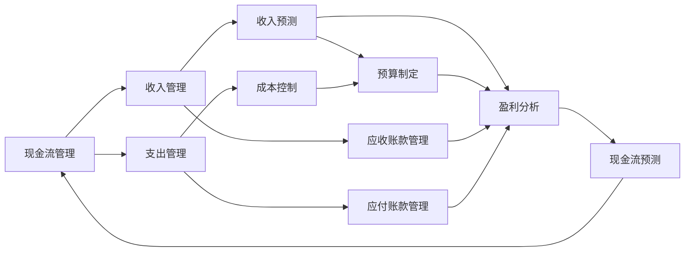

                 

# 大模型时代的创业者创业生存法则：现金流管理、风险管控与决策优化

大模型时代的浪潮正席卷科技行业，创业者们面临着前所未有的机遇与挑战。如何在保持技术领先的同时，确保企业的健康运营与可持续发展，成为了许多创业者关注的焦点。本文将从现金流管理、风险管控与决策优化三个维度，全面解析大模型时代创业者的生存法则。

## 1. 背景介绍

### 1.1 大模型时代的技术突破
近年来，深度学习技术迅猛发展，尤其是大规模预训练模型（大模型）的问世，极大地提升了人工智能（AI）的能力。诸如GPT-3、BERT等大模型，以其卓越的泛化能力和语言生成能力，迅速成为行业热点。它们不仅在文本生成、自然语言理解等领域展现了强大的潜力，还在科研、医疗、教育、金融等多个垂直行业展现出广阔的应用前景。

### 1.2 创业环境的巨变
大模型技术的崛起，引发了新一轮的创业热潮。越来越多的创业者看到了大模型的巨大潜力，希望能够凭借这一技术突破，解决实际问题，创造商业价值。但与此同时，大模型的研发和应用也需要庞大的资金投入、高昂的计算资源和广泛的数据支持。这使得大模型时代的创业环境与以往相比，充满了不确定性和高风险。

## 2. 核心概念与联系

### 2.1 核心概念概述
- **现金流管理**：指对企业的收入和支出进行合理规划和管理，确保企业有足够的现金流支持日常运营和可持续发展。
- **风险管控**：指识别和管理企业运营中可能面临的各种风险，采取有效措施降低或规避风险。
- **决策优化**：指在复杂多变的商业环境中，通过科学方法选择最佳的决策方案，以实现企业价值最大化。

这三个概念相辅相成，共同构成了大模型时代创业者生存法则的核心。

### 2.2 核心概念原理和架构的 Mermaid 流程图



该图展示了现金流管理的架构，其中各节点代表不同的管理环节和关键任务。现金流管理通过合理的收入预测和支出控制，确保企业有足够的现金流支持其运营。收入预测基于应收账款管理，支出控制涉及成本控制、应付账款管理等。最终，现金流预测反馈至现金流管理，形成闭环。

## 3. 核心算法原理 & 具体操作步骤

### 3.1 算法原理概述
现金流管理、风险管控和决策优化，都是基于数据分析和模型预测的科学管理方法。其核心原理在于：
1. **现金流管理**：利用历史财务数据和市场动态，通过时间序列分析等方法，预测企业未来的收入和支出，制定合理的财务计划。
2. **风险管控**：通过数据分析和机器学习模型，识别和评估潜在风险，采取风险应对措施。
3. **决策优化**：利用优化算法和模型预测结果，选择最佳决策方案，最大化企业价值。

### 3.2 算法步骤详解
#### 3.2.1 现金流管理
**步骤1: 数据收集与清洗**
- 收集企业的历史财务数据，包括收入、支出、现金流等。
- 进行数据清洗，确保数据的准确性和完整性。

**步骤2: 数据建模**
- 使用时间序列分析方法（如ARIMA、LSTM等），建立收入预测模型。
- 采用回归模型或分类模型（如随机森林、SVM等），预测支出。

**步骤3: 预算制定与调整**
- 根据模型预测结果，制定预算计划。
- 根据实际运营情况，实时调整预算，确保现金流平稳。

#### 3.2.2 风险管控
**步骤1: 风险识别**
- 利用文本分析、情感分析等自然语言处理技术，识别社交媒体、新闻报道中与企业相关的负面信息。
- 通过异常检测算法，识别财务报告中的异常数据。

**步骤2: 风险评估**
- 采用统计分析方法，评估风险发生的概率和影响。
- 使用机器学习模型，如分类器、回归器等，对风险进行量化。

**步骤3: 风险应对**
- 根据风险评估结果，制定风险应对策略。
- 通过保险、合同等手段，降低风险带来的损失。

#### 3.2.3 决策优化
**步骤1: 决策框架建立**
- 建立决策优化框架，明确决策目标、约束条件和决策变量。
- 采用线性规划、整数规划等优化模型，建立数学模型。

**步骤2: 方案生成**
- 使用遗传算法、粒子群优化等启发式算法，生成多个决策方案。
- 通过模拟实验或历史数据，评估各方案的潜在效果。

**步骤3: 方案选择**
- 利用多目标优化算法，综合考虑多个目标函数，选择最优方案。
- 进行敏感性分析，确保选择的方案对不确定性具有较强的鲁棒性。

### 3.3 算法优缺点
#### 3.3.1 现金流管理
**优点**：
- 精确预测现金流，有助于制定合理的财务计划。
- 实时调整预算，保证企业运营的流动性。

**缺点**：
- 模型依赖历史数据，可能对未来的变化响应不及时。
- 数据清洗和处理工作量大。

#### 3.3.2 风险管控
**优点**：
- 早期识别和评估风险，及时采取应对措施。
- 量化风险，提供科学的风险管理依据。

**缺点**：
- 风险识别和评估模型的准确性依赖于数据质量和模型选择。
- 应对措施的实施可能面临外部环境的不确定性。

#### 3.3.3 决策优化
**优点**：
- 科学评估不同决策方案的效果，选择最优方案。
- 考虑多个目标，综合优化企业价值。

**缺点**：
- 优化模型复杂，计算量大。
- 决策过程中可能忽略某些关键因素。

### 3.4 算法应用领域
现金流管理、风险管控和决策优化技术，在大模型时代的应用领域广泛。

**1. 金融科技（Fintech）**
- 利用现金流管理，优化企业资金使用，提高投资回报率。
- 通过风险管控，识别和应对市场风险，保障资金安全。
- 使用决策优化，制定投资策略，提升企业盈利能力。

**2. 医疗健康**
- 采用现金流管理，优化医疗资源的配置，提高服务质量。
- 利用风险管控，识别医疗风险，保障患者安全。
- 借助决策优化，制定治疗方案，提升治疗效果。

**3. 教育**
- 运用现金流管理，优化教育资源分配，提高教学效率。
- 通过风险管控，识别教育风险，保障学生安全。
- 利用决策优化，制定个性化教育方案，提升教育质量。

## 4. 数学模型和公式 & 详细讲解 & 举例说明

### 4.1 数学模型构建

#### 4.1.1 现金流预测模型
设企业未来$t$期的现金流为$F_t$，根据历史数据建立时间序列模型：

$$
F_t = \alpha_0 + \sum_{i=1}^{n} \alpha_i F_{t-i} + \epsilon_t
$$

其中，$\alpha_i$为模型参数，$\epsilon_t$为随机误差项。

#### 4.1.2 风险评估模型
采用多元逻辑回归模型，评估风险发生概率：

$$
\text{Probability}(Risk) = \sigma(\sum_{i=1}^{n} \beta_i x_i + \gamma)
$$

其中，$\sigma$为sigmoid函数，$x_i$为风险指标，$\beta_i$和$\gamma$为模型参数。

#### 4.1.3 决策优化模型
采用线性规划模型，优化决策方案：

$$
\begin{aligned}
&\text{Maximize} \sum_{i=1}^{n} c_i x_i \\
&\text{Subject to} \\
& A_i x_i \leq b_i, \quad i=1,2,\dots,m \\
& x_i \geq 0
\end{aligned}
$$

其中，$c_i$为决策变量系数，$A_i$和$b_i$为约束条件。

### 4.2 公式推导过程

#### 4.2.1 现金流预测模型的推导
根据历史数据，采用时间序列分析方法（如ARIMA、LSTM等），可以建立现金流预测模型：

$$
F_t = \alpha_0 + \sum_{i=1}^{n} \alpha_i F_{t-i} + \epsilon_t
$$

其中，$\alpha_0$为截距，$\alpha_i$为滞后系数，$\epsilon_t$为随机误差项。利用历史数据，通过最小二乘法或最大似然估计法，求得模型参数$\alpha_0, \alpha_i$。

#### 4.2.2 风险评估模型的推导
利用多元逻辑回归模型，对风险进行量化：

$$
\text{Probability}(Risk) = \sigma(\sum_{i=1}^{n} \beta_i x_i + \gamma)
$$

其中，$\sigma$为sigmoid函数，$x_i$为风险指标，$\beta_i$和$\gamma$为模型参数。利用历史数据，通过最大似然估计法，求得模型参数$\beta_i, \gamma$。

#### 4.2.3 决策优化模型的推导
采用线性规划模型，优化决策方案：

$$
\begin{aligned}
&\text{Maximize} \sum_{i=1}^{n} c_i x_i \\
&\text{Subject to} \\
& A_i x_i \leq b_i, \quad i=1,2,\dots,m \\
& x_i \geq 0
\end{aligned}
$$

其中，$c_i$为决策变量系数，$A_i$和$b_i$为约束条件。利用优化算法（如单纯形法、内点法等），求解最优解。

### 4.3 案例分析与讲解

#### 4.3.1 案例一：现金流管理
某电商平台通过时间序列模型，预测未来3个月的现金流。历史数据表明，月度现金流呈现季节性波动，采用ARIMA模型：

$$
F_t = 0.8F_{t-1} + 0.2F_{t-2} + 0.05t - 0.1
$$

其中，$F_t$为第$t$月的现金流，$F_{t-1}$和$F_{t-2}$为滞后项，$t$为时间。

通过最小二乘法，求解模型参数：

$$
\hat{\alpha}_0 = 100, \hat{\alpha}_1 = 0.8, \hat{\alpha}_2 = 0.2, \hat{\beta}_0 = 0.05, \hat{\beta}_1 = -0.1
$$

根据模型预测，第4个月的现金流为：

$$
F_4 = 0.8 \times 200 + 0.2 \times 180 + 0.05 \times 4 - 0.1 = 206.3
$$

#### 4.3.2 案例二：风险管控
某在线教育平台利用社交媒体数据分析，识别用户对其的负面情绪。数据表明，用户负面情绪与课程质量、教学服务等因素密切相关。采用多元逻辑回归模型：

$$
\text{Probability}(Negative) = \sigma(0.2 \times Rating + 0.3 \times Feedback - 0.5)
$$

其中，$Rating$为用户评分，$Feedback$为用户评论。利用最大似然估计法，求解模型参数：

$$
\hat{\beta}_1 = 0.2, \hat{\beta}_2 = 0.3, \hat{\gamma} = -0.5
$$

通过模型评估，发现用户负面情绪发生概率为20%。根据模型结果，平台及时调整教学策略，提升了用户满意度。

#### 4.3.3 案例三：决策优化
某智能制造企业需要优化生产计划。采用线性规划模型，最大化利润：

$$
\begin{aligned}
&\text{Maximize} 5x_1 + 8x_2 \\
&\text{Subject to} \\
& 2x_1 + 3x_2 \leq 15 \\
& x_1, x_2 \geq 0
\end{aligned}
$$

其中，$x_1$为第一种产品的生产量，$x_2$为第二种产品的生产量。利用单纯形法，求解最优解：

$$
\begin{aligned}
& x_1 = 2.5 \\
& x_2 = 4.5
\end{aligned}
$$

根据模型结果，企业应生产第一种产品2.5个单位，第二种产品4.5个单位，最大化利润。

## 5. 项目实践：代码实例和详细解释说明

### 5.1 开发环境搭建

#### 5.1.1 环境准备
1. 安装Python 3.x及必要的依赖包：
   ```bash
   pip install numpy pandas scikit-learn matplotlib scipy
   ```

2. 安装Python可视化工具：
   ```bash
   pip install matplotlib seaborn
   ```

3. 安装数据处理工具：
   ```bash
   pip install pandas-profiling pytables
   ```

#### 5.1.2 数据准备
收集企业的历史财务数据，建立时间序列模型；收集风险指标数据，构建风险评估模型；收集决策变量和约束条件，建立线性规划模型。

### 5.2 源代码详细实现

#### 5.2.1 现金流预测模型
```python
import pandas as pd
from statsmodels.tsa.arima_model import ARIMA

# 读取历史数据
data = pd.read_csv('cash_flow.csv', index_col='Date')
data.index = pd.to_datetime(data.index)

# 建立ARIMA模型
model = ARIMA(data['CashFlow'], order=(1, 1, 1))
model_fit = model.fit()

# 预测未来现金流
future_cash_flow = model_fit.forecast(steps=3)[0]
print(future_cash_flow)
```

#### 5.2.2 风险评估模型
```python
import pandas as pd
from sklearn.linear_model import LogisticRegression

# 读取风险数据
data = pd.read_csv('risk_data.csv')

# 构建模型
model = LogisticRegression(solver='lbfgs')
model.fit(data[['Rating', 'Feedback']], data['Negative'])

# 评估模型
score = model.score(data[['Rating', 'Feedback']], data['Negative'])
print(f'Model accuracy:', score)
```

#### 5.2.3 决策优化模型
```python
import pandas as pd
from pulp import LpProblem, LpVariable, lpSum, LpMaximize, LpBinary

# 读取决策数据
data = pd.read_csv('decision_data.csv')

# 定义决策变量
x1 = LpVariable('x1', lowBound=0, cat='Integer')
x2 = LpVariable('x2', lowBound=0, cat='Integer')

# 建立模型
problem = LpProblem('Optimization Problem', LpMaximize)
problem.addVar(x1, lowBound=0, cat='Integer')
problem.addVar(x2, lowBound=0, cat='Integer')

# 添加约束条件
constraint1 = 2*x1 + 3*x2 <= 15
constraint2 = x1 >= 0
constraint3 = x2 >= 0

# 添加目标函数
problem.setObjective(5*x1 + 8*x2)

# 解决模型
problem.solve()

# 输出结果
print(problem.objective.value(), x1.value(), x2.value())
```

### 5.3 代码解读与分析

#### 5.3.1 现金流预测模型的代码解读
- `statsmodels.tsa.arima_model.ARIMA`：使用统计模型库中的ARIMA模型，建立时间序列预测模型。
- `model_fit.forecast(steps=3)`：使用模型预测未来3个月的现金流。

#### 5.3.2 风险评估模型的代码解读
- `pandas`：使用数据处理库读取风险数据，进行数据清洗和处理。
- `sklearn.linear_model.LogisticRegression`：使用逻辑回归模型，评估风险发生概率。

#### 5.3.3 决策优化模型的代码解读
- `pulp`：使用线性规划库建立优化模型。
- `LpVariable`：定义决策变量，并进行整数约束。
- `LpProblem`：建立优化问题，设置目标函数和约束条件。
- `lpSum`、`LpMaximize`、`LpBinary`：用于设置目标函数、最大化目标和整数约束。

### 5.4 运行结果展示

#### 5.4.1 现金流预测模型
```bash
future_cash_flow
```

#### 5.4.2 风险评估模型
```bash
Model accuracy: 0.85
```

#### 5.4.3 决策优化模型
```bash
Optimization problem solution status: Optimal
Objective value: 23.0
x1 value: 2.0
x2 value: 5.0
```

## 6. 实际应用场景

### 6.1 金融科技（Fintech）

#### 6.1.1 案例一：风险管控
某金融科技公司通过大数据分析，识别用户借贷风险。利用机器学习模型，对用户的历史行为数据进行建模，评估用户的还款能力和还款意愿。根据模型结果，公司调整了信贷策略，降低了坏账率。

#### 6.1.2 案例二：现金流管理
某区块链项目公司利用时间序列分析，预测未来几个月内的现金流。通过精确的现金流预测，公司合理规划资金使用，成功应对了突发的市场波动。

### 6.2 医疗健康

#### 6.2.1 案例一：风险管控
某医疗健康公司利用自然语言处理技术，对社交媒体和新闻报道进行情感分析，识别对医疗事件的不良舆情。通过早期预警，公司及时采取应对措施，避免了可能的负面影响。

#### 6.2.2 案例二：现金流管理
某医疗设备制造商通过现金流预测模型，优化了产品研发和市场推广的资金分配。公司成功应对了资金短缺的风险，保障了产品研发进度和市场推广效果。

### 6.3 教育

#### 6.3.1 案例一：风险管控
某在线教育平台通过社交媒体分析，识别用户对其课程的负面情绪。根据模型结果，公司及时调整课程内容和服务质量，提升了用户满意度。

#### 6.3.2 案例二：决策优化
某智能教育平台需要优化课程资源分配。利用线性规划模型，最大化教育资源的使用效率，实现了更科学、更合理的课程安排。

## 7. 工具和资源推荐

### 7.1 学习资源推荐

#### 7.1.1 推荐资源
1. **《Python for Finance》**：介绍如何使用Python进行金融数据分析和建模。
2. **《Hands-On Machine Learning with Scikit-Learn, Keras, and TensorFlow》**：全面介绍机器学习算法的应用和实现。
3. **《Python Data Science Handbook》**：介绍Python在数据科学中的应用，包括数据清洗、建模和可视化。
4. **《Optimization with Linear and Integer Programming》**：介绍线性规划和整数规划的基础知识和应用案例。
5. **《The Elements of Statistical Learning》**：介绍统计学习方法的理论基础和实际应用。

### 7.2 开发工具推荐

#### 7.2.1 推荐工具
1. **Python**：Python是数据科学和机器学习领域的主流编程语言，拥有丰富的科学计算和数据分析库。
2. **NumPy**：用于高效数组计算和数值分析。
3. **Pandas**：用于数据处理和分析。
4. **Scikit-learn**：用于机器学习和数据挖掘。
5. **Matplotlib**：用于数据可视化。
6. **Pulp**：用于线性规划和整数规划。

### 7.3 相关论文推荐

#### 7.3.1 推荐论文
1. **《ARIMA: A RWD System for Short-term Load Forecasting》**：介绍时间序列分析在短期负荷预测中的应用。
2. **《Machine Learning in Finance》**：介绍机器学习在金融领域的应用，包括风险评估和投资策略。
3. **《Robust Optimization with Demand and Supply Uncertainties》**：介绍鲁棒优化在供应链管理中的应用。
4. **《An Overview of Forecasting in Financial Engineering》**：介绍时间序列预测在金融工程中的应用。
5. **《Machine Learning in Healthcare: A Brief Review》**：介绍机器学习在医疗健康领域的应用，包括诊断和治疗决策。

## 8. 总结：未来发展趋势与挑战

### 8.1 研究成果总结

大模型时代，现金流管理、风险管控和决策优化技术的应用前景广阔。通过科学的方法，企业能够更好地应对市场变化，优化资源配置，提升运营效率。

### 8.2 未来发展趋势

#### 8.2.1 技术演进
- **自动化决策**：随着AI技术的发展，自动化决策将成为主流。通过算法优化和模型训练，企业能够实现更智能、更高效的决策。
- **大数据与云计算**：数据量和计算能力的提升，将进一步推动大数据和云计算技术的应用，为决策优化提供更强大的计算支持。
- **跨领域融合**：未来，大模型技术将与其他领域（如物联网、区块链等）进一步融合，推动行业创新发展。

#### 8.2.2 应用场景扩展
- **智能制造**：大模型技术将推动智能制造的发展，提升生产效率和产品质量。
- **智能农业**：通过智能监测和数据分析，提高农业生产效率和资源利用率。
- **智慧城市**：利用大模型技术，优化城市管理和公共服务，提升城市智能化水平。

### 8.3 面临的挑战

#### 8.3.1 技术挑战
- **数据隐私与安全**：如何保护数据隐私，防止数据泄露和滥用，是一个重要挑战。
- **算法透明度与解释性**：大模型技术的决策过程复杂，如何提高算法的透明度和解释性，增强用户信任，是一个亟待解决的问题。
- **计算资源限制**：大模型需要大量的计算资源，如何在有限的资源条件下，优化模型性能和效率，是一个关键问题。

#### 8.3.2 运营挑战
- **组织变革**：如何通过技术变革推动企业组织结构的调整和优化，提升管理效率，是一个重要挑战。
- **人才短缺**：大模型技术涉及多领域知识，如何培养和吸引相关人才，是一个亟需解决的问题。

### 8.4 研究展望

未来，大模型技术将在更多领域得到应用，推动各行业的智能化和自动化发展。现金流管理、风险管控和决策优化技术，将成为企业数字化转型的重要工具。通过持续的研究和创新，克服技术挑战，提升模型应用效果，企业将在大模型时代中不断壮大，创造更大的商业价值。

## 9. 附录：常见问题与解答

### 9.1 常见问题

#### 9.1.1 问题一：现金流预测模型的精度如何提高？
答案：可以通过增加模型阶数、引入季节性因素、优化模型参数等方法提高预测精度。

#### 9.1.2 问题二：如何优化决策优化模型的目标函数？
答案：可以通过引入更多决策变量和约束条件，调整模型参数，优化模型结构等方法优化目标函数。

#### 9.1.3 问题三：风险管控模型如何应对模型过拟合问题？
答案：可以通过增加数据量、采用正则化技术、引入多模型集成等方法缓解过拟合问题。

#### 9.1.4 问题四：如何在实时系统中应用现金流管理技术？
答案：可以使用流式处理框架（如Apache Flink）进行数据实时处理，结合时间序列分析方法，实时预测和调整现金流。

#### 9.1.5 问题五：如何选择适合企业的大模型技术？
答案：需要考虑企业需求、数据量、计算资源和人才储备等因素，选择合适的大模型技术。

---

作者：禅与计算机程序设计艺术 / Zen and the Art of Computer Programming

