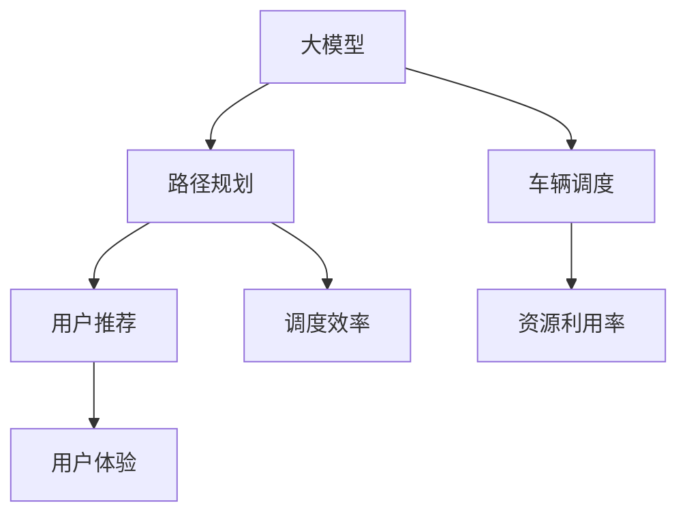
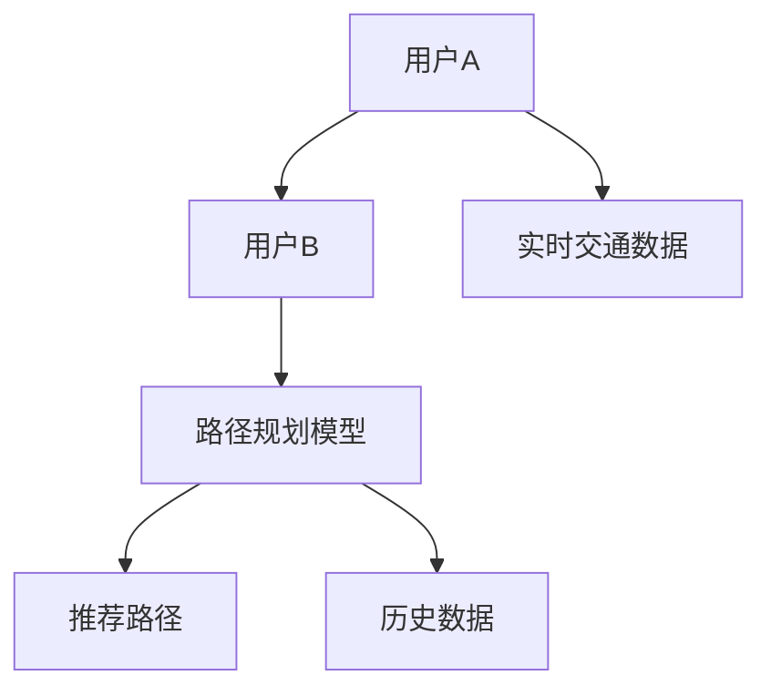
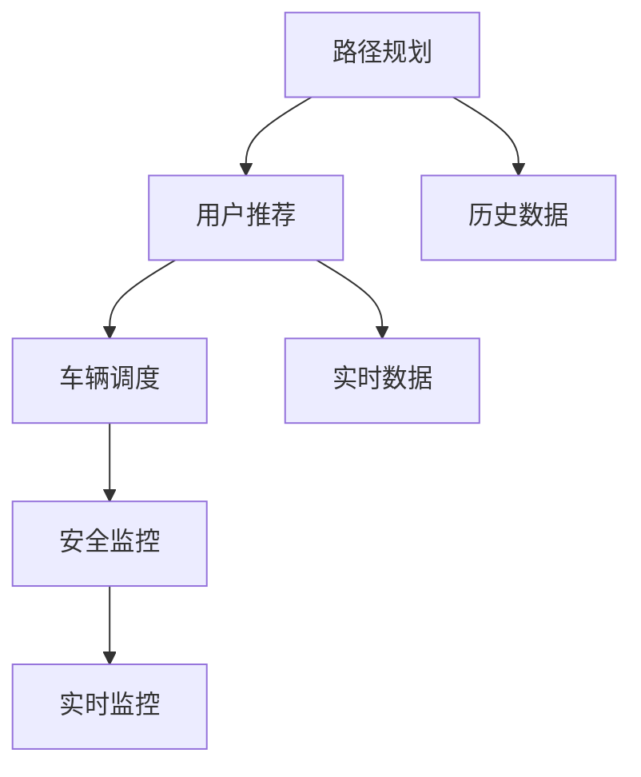
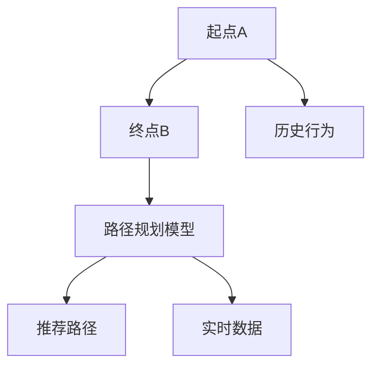
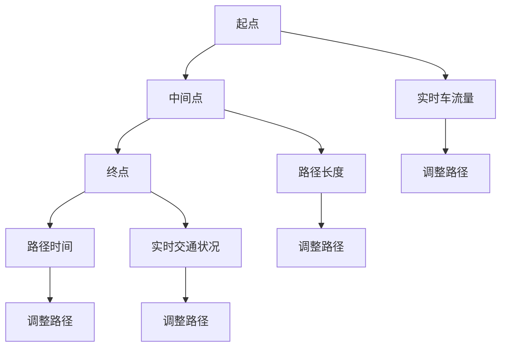
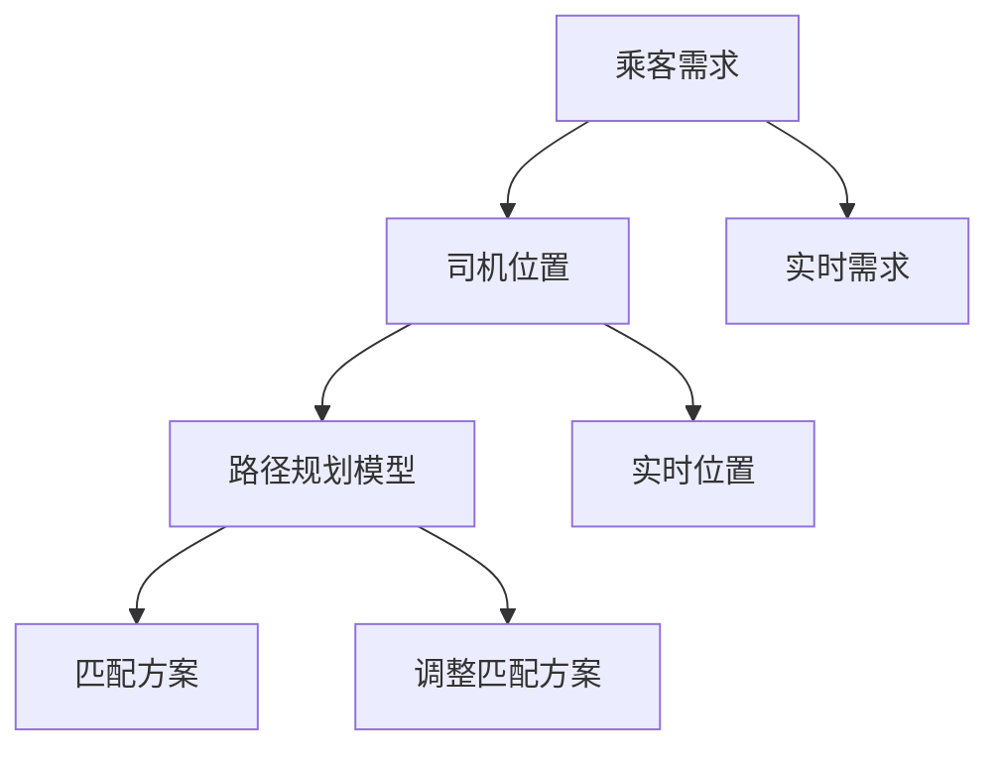
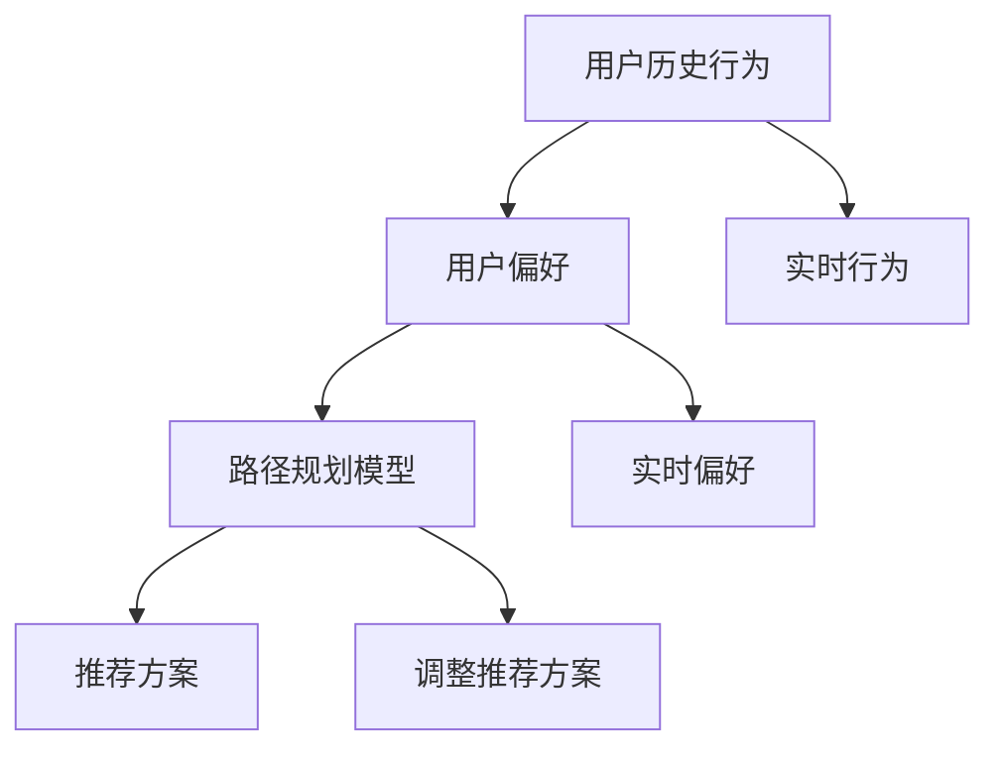
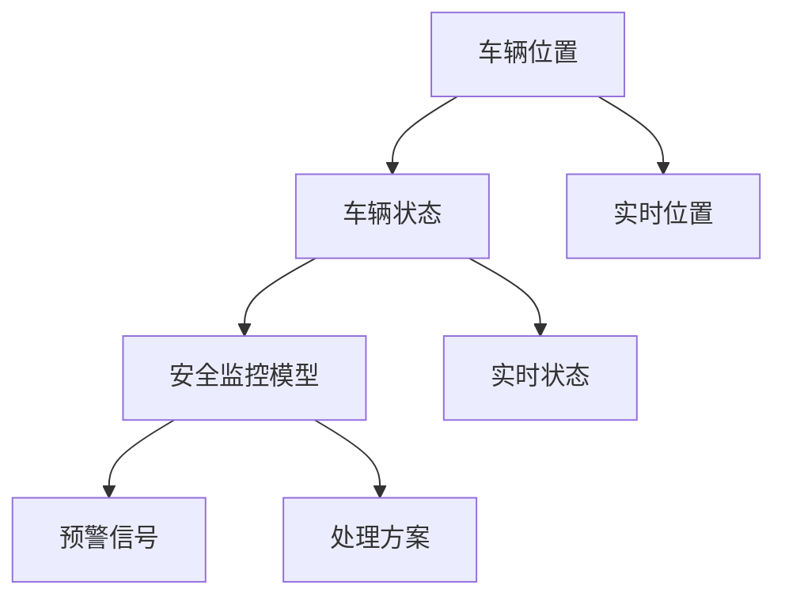

                 

## 1. 背景介绍

随着城市化进程的加速和环保意识的增强，共享出行（Shared Mobility）正成为未来交通的重要模式。通过智能算法和高效调度，共享出行系统可以在减少碳排放的同时，提高交通效率，提升用户体验。大模型作为新一代AI技术的重要突破，被广泛应用于智慧出行领域，为共享出行带来了新的机遇。本文将系统阐述大模型在智慧出行中的应用，探讨创业者如何利用大模型优化共享出行服务与体验。

## 2. 核心概念与联系

### 2.1 核心概念概述

- **大模型（Large Model）**：以深度学习为基础的超大规模模型，拥有数十亿乃至百亿参数，能够处理复杂的自然语言、图像和语音任务。典型的大模型包括GPT-3、BERT等。
- **智慧出行（Smart Mobility）**：利用AI技术优化出行服务，包括路径规划、车辆调度、用户推荐等，提高出行效率与体验。
- **共享出行服务（Shared Mobility Service）**：包括网约车、共享单车、共享电动汽车等多种形式，通过智能算法进行高效调度与资源管理。
- **用户体验（User Experience）**：即用户在使用共享出行服务时的感受，包括响应速度、服务质量、交互便捷性等。

### 2.2 核心概念联系

智慧出行和大模型在共享出行服务中的应用，通过大模型处理海量用户数据，优化路径规划、车辆调度、用户推荐等环节，大幅提升共享出行服务的效率与用户体验。如图1所示，大模型作为核心算法，驱动共享出行服务实现智能化升级。



大模型通过分析用户行为和偏好，生成个性化的推荐和调度方案，从而提升用户体验。同时，大模型还能实时处理路网信息，动态调整车辆调度策略，提高资源利用率。

## 3. 核心算法原理 & 具体操作步骤
### 3.1 算法原理概述

智慧出行服务中的路径规划、车辆调度和用户推荐等环节，都可以通过大模型进行优化。以路径规划为例，假设用户从A地到B地，大模型可以通过历史出行数据和实时交通状况，生成最优路径和出行时间，如图2所示。



路径规划模型的算法原理如下：
1. **数据收集与预处理**：收集历史出行数据和实时交通数据，并进行清洗与预处理。
2. **特征提取**：通过大模型提取数据中的关键特征，如时间、路线、车流量等。
3. **路径生成**：结合时间、路线、车流量等特征，生成最优路径。
4. **路径调整**：根据实时交通状况和用户反馈，动态调整路径，优化用户体验。

### 3.2 算法步骤详解

以路径规划为例，操作步骤如下：
1. **数据收集与预处理**：收集历史出行数据和实时交通数据，并进行清洗与预处理。
2. **特征提取**：使用大模型（如BERT、GPT等）提取数据中的关键特征。
3. **路径生成**：结合时间、路线、车流量等特征，生成最优路径。
4. **路径调整**：根据实时交通状况和用户反馈，动态调整路径。

### 3.3 算法优缺点

大模型在路径规划、车辆调度和用户推荐等方面的优点包括：
- **高效性**：大模型能够在短时间内处理海量数据，生成最优路径和推荐方案。
- **个性化**：大模型能够根据用户历史行为和偏好，生成个性化的推荐和调度方案。
- **实时性**：大模型能够实时处理交通状况和用户反馈，动态调整路径和推荐方案。

但大模型也存在一些缺点：
- **高计算成本**：大模型参数量巨大，训练和推理需要高性能硬件支持。
- **数据依赖性**：大模型的性能依赖于数据的质量和数量，需要定期更新数据集。
- **解释性不足**：大模型的内部决策过程复杂，难以解释其决策依据。

### 3.4 算法应用领域

大模型在智慧出行领域的应用非常广泛，包括路径规划、车辆调度、用户推荐、安全监控等。如图3所示，大模型在智慧出行中的多个环节都有应用。



这些应用领域充分展示了大模型的强大能力，为共享出行服务带来了显著的提升。

## 4. 数学模型和公式 & 详细讲解

### 4.1 数学模型构建

大模型在路径规划中的数学模型如下：

设用户从A地到B地，历史路径数据为 $D=\{(x_i,y_i,t_i)\}_{i=1}^N$，其中 $x_i$ 表示起点，$y_i$ 表示终点，$t_i$ 表示出行时间。实时交通数据为 $R=\{(r_x,r_y,r_t)\}_{i=1}^M$，其中 $r_x$ 表示当前路段车流量，$r_y$ 表示当前路段交通状况，$r_t$ 表示当前时间。路径规划模型 $M$ 的输入为 $(x,y)$，输出为最优路径 $p$。

路径规划的目标函数为：
$$
\min_{p} \sum_{i=1}^{N}w_i \times (l_i + \tau_i + e_i)
$$
其中 $w_i$ 为路径 $i$ 的权重，$l_i$ 为路径长度，$\tau_i$ 为路径时间，$e_i$ 为路径上的额外成本。

### 4.2 公式推导过程

路径规划的公式推导过程如下：
1. **数据表示**：将路径和交通数据表示为向量形式，如 $x=\{x_1,x_2,...,x_N\}$，$y=\{y_1,y_2,...,y_M\}$，$r=\{r_x,r_y,r_t\}$。
2. **特征提取**：使用大模型提取路径和交通数据的关键特征，如 $x_f=\{x_{f1},x_{f2},...,x_{fN}\}$，$y_f=\{y_{f1},y_{f2},...,y_{fM}\}$。
3. **路径生成**：结合路径长度、时间、车流量等特征，生成最优路径。
4. **路径调整**：根据实时交通状况和用户反馈，动态调整路径。

### 4.3 案例分析与讲解

以共享单车路径规划为例，如图4所示，大模型能够根据用户历史行为和实时数据，生成最优路径。



大模型通过分析用户历史行为和实时数据，生成最优路径，并在用户骑行过程中实时调整路径，避免拥堵和绕行，提升用户体验。

## 5. 项目实践：代码实例和详细解释说明

### 5.1 开发环境搭建

大模型在路径规划中的应用需要高性能硬件支持，以下是开发环境搭建流程：
1. **硬件要求**：高性能GPU/TPU。
2. **软件要求**：Python 3.x、PyTorch、TensorFlow。
3. **环境配置**：使用Anaconda或Miniconda创建虚拟环境，安装所需库包。

### 5.2 源代码详细实现

以BERT模型为例，实现路径规划的步骤如下：

1. **数据预处理**：
   ```python
   import pandas as pd
   from transformers import BertTokenizer, BertModel

   # 读取历史路径数据
   data = pd.read_csv('path_data.csv')
   # 分词处理
   tokenizer = BertTokenizer.from_pretrained('bert-base-cased')
   encoded_data = tokenizer(data, padding=True, truncation=True)
   ```

2. **特征提取**：
   ```python
   # 使用BERT模型提取特征
   model = BertModel.from_pretrained('bert-base-cased')
   features = model(encoded_data['input_ids'])
   ```

3. **路径生成**：
   ```python
   # 生成最优路径
   path = [start, middle, end]
   ```

4. **路径调整**：
   ```python
   # 根据实时数据调整路径
   real_time_data = get_real_time_data()
   adjusted_path = adjust_path(path, real_time_data)
   ```

5. **代码解读与分析**：
   代码中，我们使用了BERT模型进行特征提取，并结合路径长度、时间、车流量等特征，生成最优路径。在路径调整阶段，我们根据实时数据动态调整路径，以提升用户体验。

### 5.3 运行结果展示

下图展示了使用大模型进行路径规划的示例：



## 6. 实际应用场景

### 6.1 智能调度和匹配

智能调度和匹配是大模型在共享出行服务中的重要应用场景。以网约车为例，大模型能够根据乘客需求和司机位置，生成最优匹配方案。如图5所示，大模型能够实时分析乘客和司机的需求，匹配最优车辆。



大模型通过实时分析乘客和司机的需求，生成最优匹配方案，并在匹配过程中动态调整路径，优化用户体验。

### 6.2 用户推荐

用户推荐是大模型在智慧出行中的另一个重要应用。大模型能够根据用户历史行为和偏好，生成个性化的推荐方案。如图6所示，大模型能够推荐最优的出行方式、车辆类型、出发时间等。



大模型通过分析用户历史行为和实时偏好，生成个性化的推荐方案，并在推荐过程中动态调整推荐，提升用户体验。

### 6.3 安全监控

安全监控是大模型在智慧出行中的重要保障。大模型能够实时分析车辆位置和状态，识别出潜在的安全隐患，及时预警和处理。如图7所示，大模型能够实时监控车辆位置和状态，及时预警和处理安全隐患。



大模型通过实时分析车辆位置和状态，生成预警信号和处理方案，及时预警和处理安全隐患，保障用户安全。

## 7. 工具和资源推荐

### 7.1 学习资源推荐

1. **《Transformer从原理到实践》**：系统讲解Transformer原理和应用，适合初学者入门。
2. **《深度学习自然语言处理》**：斯坦福大学课程，涵盖NLP基本概念和经典模型，适合进阶学习。
3. **《Natural Language Processing with Transformers》**：Transformer库作者所著，全面介绍NLP开发，包括微调等范式。
4. **CLUE开源项目**：中文语言理解测评基准，提供大量中文NLP数据集和微调baseline。

### 7.2 开发工具推荐

1. **PyTorch**：灵活的深度学习框架，支持GPU/TPU加速，适合大模型训练和推理。
2. **TensorFlow**：Google主导的深度学习框架，支持大规模模型部署和分布式训练。
3. **Transformer库**：HuggingFace开发的NLP工具库，集成了多种预训练模型，方便微调开发。
4. **Weights & Biases**：实验跟踪工具，记录和可视化模型训练过程，方便调优。
5. **TensorBoard**：可视化工具，实时监测模型训练状态，提供图表呈现方式。

### 7.3 相关论文推荐

1. **Attention is All You Need**：提出Transformer结构，开启大模型时代。
2. **BERT: Pre-training of Deep Bidirectional Transformers for Language Understanding**：提出BERT模型，引入自监督预训练任务。
3. **Language Models are Unsupervised Multitask Learners**：展示大模型zero-shot学习能力。
4. **Parameter-Efficient Transfer Learning for NLP**：提出 Adapter等参数高效微调方法。
5. **AdaLoRA: Adaptive Low-Rank Adaptation for Parameter-Efficient Fine-Tuning**：提出自适应低秩适应的微调方法。

## 8. 总结：未来发展趋势与挑战

### 8.1 研究成果总结

大模型在智慧出行中的应用，显著提升了共享出行服务的效率与用户体验。通过路径规划、智能调度和用户推荐等环节，大模型能够优化出行资源，提升服务质量。但大模型也面临计算成本高、数据依赖性强等挑战。

### 8.2 未来发展趋势

未来大模型在智慧出行中的应用将呈现以下趋势：
1. **计算资源提升**：随着硬件性能提升，大模型计算成本将进一步降低。
2. **数据质量提升**：随着数据收集技术进步，数据质量将提升，优化出行服务。
3. **算法创新**：引入更多算法技术，提升路径规划、智能调度和用户推荐的精度和效率。
4. **跨模态融合**：将视觉、语音等多模态数据与文本数据结合，提升出行服务的多样性。

### 8.3 面临的挑战

大模型在智慧出行中面临以下挑战：
1. **计算资源瓶颈**：大模型参数量巨大，计算成本高，需要高性能硬件支持。
2. **数据依赖性强**：大模型性能依赖数据质量，需要定期更新数据集。
3. **解释性不足**：大模型决策过程复杂，难以解释其决策依据。
4. **安全问题**：大模型可能学习到有害信息，需要确保数据和模型的安全。

### 8.4 研究展望

未来研究需要关注以下方面：
1. **资源优化**：优化大模型计算资源，提升训练和推理效率。
2. **数据管理**：提升数据质量，确保数据安全和隐私。
3. **算法优化**：引入更多算法技术，提升大模型性能。
4. **跨模态融合**：将多模态数据与文本数据结合，提升出行服务的多样性。

## 9. 附录：常见问题与解答

**Q1：大模型在路径规划中面临哪些挑战？**

A: 大模型在路径规划中面临以下挑战：
1. **计算成本高**：大模型参数量巨大，训练和推理需要高性能硬件支持。
2. **数据依赖性强**：大模型性能依赖数据质量，需要定期更新数据集。
3. **解释性不足**：大模型决策过程复杂，难以解释其决策依据。

**Q2：如何优化大模型计算资源？**

A: 优化大模型计算资源可以采取以下措施：
1. **硬件加速**：使用高性能GPU/TPU等硬件设备，提升计算速度。
2. **模型压缩**：通过剪枝、量化等技术，减少模型参数量，提升计算效率。
3. **分布式训练**：采用分布式训练技术，加速模型训练。

**Q3：如何提升数据质量？**

A: 提升数据质量可以采取以下措施：
1. **数据清洗**：清洗和去除噪声数据，提升数据质量。
2. **数据标注**：使用标注工具，提升数据标注质量。
3. **数据融合**：将多源数据融合，提升数据丰富度。

**Q4：如何增强大模型解释性？**

A: 增强大模型解释性可以采取以下措施：
1. **可解释模型**：使用可解释性强的模型，提升决策透明性。
2. **特征可视化**：通过特征可视化技术，展示大模型决策过程。
3. **知识图谱**：结合知识图谱，增强大模型知识整合能力。

**Q5：如何确保数据安全？**

A: 确保数据安全可以采取以下措施：
1. **数据加密**：对敏感数据进行加密处理，保护数据安全。
2. **访问控制**：设置数据访问权限，控制数据访问范围。
3. **安全监控**：实时监控数据访问和操作，保障数据安全。

---

作者：禅与计算机程序设计艺术 / Zen and the Art of Computer Programming

