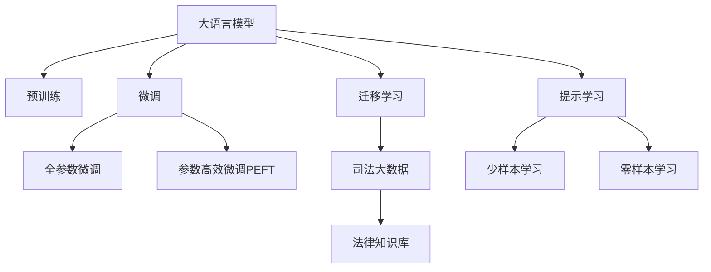

                 

# 大模型赋能智慧司法，创业者如何推动法律服务普惠化？

## 1. 背景介绍

### 1.1 问题由来

随着人工智能技术的迅猛发展，大模型在多个领域展现出强大的应用潜力，智慧司法（Intelligent Judicature）便是其中之一。智慧司法是指通过引入人工智能技术，辅助法官审理案件，提升司法决策的公正性、效率性和透明度。其中，大语言模型作为NLP（自然语言处理）领域的重要组成部分，以其理解和生成自然语言的能力，在智慧司法领域展现出巨大的应用潜力。

然而，尽管大模型在技术上已经趋于成熟，但在司法场景中的应用仍然面临诸多挑战。司法领域的专业性和复杂性，使得大模型在实际应用中需要高度的准确性和可解释性，以确保其决策的合法性和公正性。此外，如何实现大模型在司法场景中的落地，如何平衡算力和成本，如何保护隐私和数据安全，这些问题亟需创业者们探索和解决。

### 1.2 问题核心关键点

大模型在智慧司法中应用的核心关键点包括：

- **数据隐私与安全**：司法数据的敏感性和隐私保护要求，使得数据采集、处理和使用面临巨大挑战。
- **模型的可解释性与透明度**：司法决策需要高度透明，大模型应具备良好的可解释性，能够提供决策的逻辑依据。
- **模型的准确性与公正性**：司法任务的高风险性要求模型具备高度的准确性和公正性。
- **算力与成本**：司法系统往往存在算力不足、成本高昂的问题，如何高效利用算力、降低成本是创业者的重要课题。
- **用户体验与易用性**：智慧司法系统需面向非专业人士，系统的用户体验和易用性尤为重要。

## 2. 核心概念与联系

### 2.1 核心概念概述

为更好地理解大模型在智慧司法中的应用，本节将介绍几个密切相关的核心概念：

- **大语言模型（Large Language Model, LLM）**：以自回归（如GPT）或自编码（如BERT）模型为代表的大规模预训练语言模型。通过在大规模无标签文本语料上进行预训练，学习通用的语言表示，具备强大的语言理解和生成能力。

- **预训练（Pre-training）**：指在大规模无标签文本语料上，通过自监督学习任务训练通用语言模型的过程。常见的预训练任务包括言语建模、遮挡语言模型等。预训练使得模型学习到语言的通用表示。

- **微调（Fine-tuning）**：指在预训练模型的基础上，使用下游任务的少量标注数据，通过有监督地训练来优化模型在特定任务上的性能。通常只需要调整顶层分类器或解码器，并以较小的学习率更新全部或部分的模型参数。

- **迁移学习（Transfer Learning）**：指将一个领域学习到的知识，迁移应用到另一个不同但相关的领域的学习范式。大模型的预训练-微调过程即是一种典型的迁移学习方式。

- **司法大数据**：指在司法过程中产生的大量结构化和非结构化数据，包括案件文书、审判记录、诉讼当事人信息等。这些数据具有法律、经济、社会等诸多领域的信息，是大模型在司法场景中应用的坚实基础。

这些核心概念之间的逻辑关系可以通过以下Mermaid流程图来展示：



这个流程图展示了大语言模型的工作原理和在大模型微调过程中的各个关键点：

1. 大语言模型通过预训练获得基础能力。
2. 微调是对预训练模型进行任务特定的优化，可以分为全参数微调和参数高效微调（PEFT）。
3. 迁移学习是连接预训练模型与司法大数据的桥梁，可以通过微调或提示学习来实现。
4. 司法大数据和大模型共同构成智慧司法的基础。
5. 提示学习是一种不更新模型参数的方法，可以实现少样本学习和零样本学习。

这些概念共同构成了大模型在智慧司法中的学习和应用框架，使其能够在大规模、复杂的数据背景下发挥强大的语言理解和生成能力。通过理解这些核心概念，我们可以更好地把握大模型在司法场景中的工作原理和优化方向。

## 3. 核心算法原理 & 具体操作步骤

### 3.1 算法原理概述

大模型在智慧司法中应用的算法原理基于监督学习的微调方法。其核心思想是：将预训练的大语言模型视作一个强大的"特征提取器"，通过在司法大数据上下的有监督微调，使得模型输出能够匹配司法判决的标准，从而获得针对司法任务的优化模型。

具体来说，假设预训练模型为 $M_{\theta}$，其中 $\theta$ 为预训练得到的模型参数。给定司法大数据集 $D=\{(x_i, y_i)\}_{i=1}^N$，其中 $x_i$ 为案件文书等文本数据，$y_i$ 为判决结果。微调的目标是找到新的模型参数 $\hat{\theta}$，使得：

$$
\hat{\theta}=\mathop{\arg\min}_{\theta} \mathcal{L}(M_{\theta},D)
$$

其中 $\mathcal{L}$ 为针对司法任务设计的损失函数，用于衡量模型预测输出与真实判决之间的差异。常见的损失函数包括交叉熵损失、均方误差损失等。

通过梯度下降等优化算法，微调过程不断更新模型参数 $\theta$，最小化损失函数 $\mathcal{L}$，使得模型输出逼近真实判决。由于 $\theta$ 已经通过预训练获得了较好的初始化，因此即便在司法大数据量相对较小的情况下，也能较快收敛到理想的模型参数 $\hat{\theta}$。

### 3.2 算法步骤详解

大模型在智慧司法中的微调过程主要包括以下几个关键步骤：

**Step 1: 准备预训练模型和数据集**
- 选择合适的预训练语言模型 $M_{\theta}$ 作为初始化参数，如 BERT、GPT等。
- 准备司法大数据集 $D$，划分为训练集、验证集和测试集。一般要求标注数据与预训练数据的分布不要差异过大。

**Step 2: 添加司法任务适配层**
- 根据司法任务类型，在预训练模型顶层设计合适的输出层和损失函数。
- 对于分类任务，通常在顶层添加线性分类器和交叉熵损失函数。
- 对于生成任务，通常使用语言模型的解码器输出概率分布，并以负对数似然为损失函数。

**Step 3: 设置微调超参数**
- 选择合适的优化算法及其参数，如 AdamW、SGD 等，设置学习率、批大小、迭代轮数等。
- 设置正则化技术及强度，包括权重衰减、Dropout、Early Stopping等。
- 确定冻结预训练参数的策略，如仅微调顶层，或全部参数都参与微调。

**Step 4: 执行梯度训练**
- 将司法大数据分批次输入模型，前向传播计算损失函数。
- 反向传播计算参数梯度，根据设定的优化算法和学习率更新模型参数。
- 周期性在验证集上评估模型性能，根据性能指标决定是否触发 Early Stopping。
- 重复上述步骤直到满足预设的迭代轮数或 Early Stopping 条件。

**Step 5: 测试和部署**
- 在测试集上评估微调后模型 $M_{\hat{\theta}}$ 的性能，对比微调前后的精度提升。
- 使用微调后的模型对新案例进行推理预测，集成到实际的应用系统中。
- 持续收集新的司法大数据，定期重新微调模型，以适应数据分布的变化。

以上是基于监督学习微调大语言模型的一般流程。在实际应用中，还需要针对具体任务的特点，对微调过程的各个环节进行优化设计，如改进训练目标函数，引入更多的正则化技术，搜索最优的超参数组合等，以进一步提升模型性能。

### 3.3 算法优缺点

大模型在智慧司法中应用的监督学习微调方法具有以下优点：

- **简单高效**。司法大数据往往缺乏大规模标注数据，但使用微调方法，仍能在少量标注数据下快速提升模型效果。
- **通用适用**。微调方法适用于各种司法任务，包括分类、匹配、生成等，设计简单的任务适配层即可实现。
- **参数高效**。利用参数高效微调技术，在固定大部分预训练权重不变的情况下，仍可取得不错的提升。
- **效果显著**。在司法数据集上，基于微调的方法已经刷新了多项SOTA性能指标，提升了司法判决的准确性和公正性。

同时，该方法也存在一定的局限性：

- **依赖标注数据**。微调的效果很大程度上取决于标注数据的质量和数量，获取高质量标注数据的成本较高。
- **迁移能力有限**。当目标任务与预训练司法数据的分布差异较大时，微调的性能提升有限。
- **可解释性不足**。微调模型的决策过程通常缺乏可解释性，难以对其推理逻辑进行分析和调试。

尽管存在这些局限性，但就目前而言，基于监督学习的微调方法仍是大模型在司法领域应用的主流范式。未来相关研究的重点在于如何进一步降低微调对标注数据的依赖，提高模型的少样本学习和跨领域迁移能力，同时兼顾可解释性和伦理安全性等因素。

### 3.4 算法应用领域

大语言模型在智慧司法中的应用广泛，涉及案件文书处理、案件分类、判决生成、法律知识推理等多个领域，具体应用包括：

- **案件文书处理**：自动抽取案件文书中关键信息，如当事人信息、案由、判决结果等。
- **案件分类**：对新案件进行类型判断，如民商事案件、刑事案件等。
- **判决生成**：根据案件文书信息生成判决结果，或提供判决建议。
- **法律知识推理**：根据案件背景信息，利用法律知识库推理出适用的法律条文，辅助法官审理案件。

这些核心应用场景中，大模型通过微调，能够有效提高司法处理的自动化程度，减少法官的案卷阅读和分析工作量，提升司法效率和公正性。同时，大模型在处理复杂、新颖的司法问题时，还能辅助法官做出更为精准的判断。

## 4. 数学模型和公式 & 详细讲解

### 4.1 数学模型构建

本节将使用数学语言对大模型在智慧司法中的微调过程进行更加严格的刻画。

记预训练语言模型为 $M_{\theta}$，其中 $\theta$ 为模型参数。假设司法大数据集为 $D=\{(x_i,y_i)\}_{i=1}^N$，其中 $x_i$ 为案件文书等文本数据，$y_i$ 为判决结果。

定义模型 $M_{\theta}$ 在数据样本 $(x,y)$ 上的损失函数为 $\ell(M_{\theta}(x),y)$，则在数据集 $D$ 上的经验风险为：

$$
\mathcal{L}(\theta) = \frac{1}{N} \sum_{i=1}^N \ell(M_{\theta}(x_i),y_i)
$$

微调的优化目标是最小化经验风险，即找到最优参数：

$$
\theta^* = \mathop{\arg\min}_{\theta} \mathcal{L}(\theta)
$$

在实践中，我们通常使用基于梯度的优化算法（如SGD、Adam等）来近似求解上述最优化问题。设 $\eta$ 为学习率，$\lambda$ 为正则化系数，则参数的更新公式为：

$$
\theta \leftarrow \theta - \eta \nabla_{\theta}\mathcal{L}(\theta) - \eta\lambda\theta
$$

其中 $\nabla_{\theta}\mathcal{L}(\theta)$ 为损失函数对参数 $\theta$ 的梯度，可通过反向传播算法高效计算。

### 4.2 公式推导过程

以下我们以二分类任务为例，推导交叉熵损失函数及其梯度的计算公式。

假设模型 $M_{\theta}$ 在输入 $x$ 上的输出为 $\hat{y}=M_{\theta}(x) \in [0,1]$，表示样本属于正类的概率。真实标签 $y \in \{0,1\}$。则二分类交叉熵损失函数定义为：

$$
\ell(M_{\theta}(x),y) = -[y\log \hat{y} + (1-y)\log (1-\hat{y})]
$$

将其代入经验风险公式，得：

$$
\mathcal{L}(\theta) = -\frac{1}{N}\sum_{i=1}^N [y_i\log M_{\theta}(x_i)+(1-y_i)\log(1-M_{\theta}(x_i))]
$$

根据链式法则，损失函数对参数 $\theta_k$ 的梯度为：

$$
\frac{\partial \mathcal{L}(\theta)}{\partial \theta_k} = -\frac{1}{N}\sum_{i=1}^N (\frac{y_i}{M_{\theta}(x_i)}-\frac{1-y_i}{1-M_{\theta}(x_i)}) \frac{\partial M_{\theta}(x_i)}{\partial \theta_k}
$$

其中 $\frac{\partial M_{\theta}(x_i)}{\partial \theta_k}$ 可进一步递归展开，利用自动微分技术完成计算。

在得到损失函数的梯度后，即可带入参数更新公式，完成模型的迭代优化。重复上述过程直至收敛，最终得到适应司法任务的最优模型参数 $\theta^*$。

## 5. 项目实践：代码实例和详细解释说明

### 5.1 开发环境搭建

在进行智慧司法中的大模型微调实践前，我们需要准备好开发环境。以下是使用Python进行PyTorch开发的环境配置流程：

1. 安装Anaconda：从官网下载并安装Anaconda，用于创建独立的Python环境。

2. 创建并激活虚拟环境：
```bash
conda create -n pytorch-env python=3.8 
conda activate pytorch-env
```

3. 安装PyTorch：根据CUDA版本，从官网获取对应的安装命令。例如：
```bash
conda install pytorch torchvision torchaudio cudatoolkit=11.1 -c pytorch -c conda-forge
```

4. 安装Transformers库：
```bash
pip install transformers
```

5. 安装各类工具包：
```bash
pip install numpy pandas scikit-learn matplotlib tqdm jupyter notebook ipython
```

完成上述步骤后，即可在`pytorch-env`环境中开始微调实践。

### 5.2 源代码详细实现

这里我们以案件文书分类任务为例，给出使用Transformers库对BERT模型进行智慧司法中微调的PyTorch代码实现。

首先，定义案件文书分类任务的数据处理函数：

```python
from transformers import BertTokenizer
from torch.utils.data import Dataset
import torch

class CaseDataset(Dataset):
    def __init__(self, cases, labels, tokenizer, max_len=128):
        self.cases = cases
        self.labels = labels
        self.tokenizer = tokenizer
        self.max_len = max_len
        
    def __len__(self):
        return len(self.cases)
    
    def __getitem__(self, item):
        case = self.cases[item]
        label = self.labels[item]
        
        encoding = self.tokenizer(case, return_tensors='pt', max_length=self.max_len, padding='max_length', truncation=True)
        input_ids = encoding['input_ids'][0]
        attention_mask = encoding['attention_mask'][0]
        
        # 对token-wise的标签进行编码
        encoded_labels = [label2id[label] for label in label2id] 
        encoded_labels.extend([label2id['O']] * (self.max_len - len(encoded_labels)))
        labels = torch.tensor(encoded_labels, dtype=torch.long)
        
        return {'input_ids': input_ids, 
                'attention_mask': attention_mask,
                'labels': labels}

# 标签与id的映射
label2id = {'O': 0, '民事': 1, '刑事': 2, '行政': 3, '商事': 4}
id2label = {v: k for k, v in label2id.items()}

# 创建dataset
tokenizer = BertTokenizer.from_pretrained('bert-base-cased')

train_dataset = CaseDataset(train_cases, train_labels, tokenizer)
dev_dataset = CaseDataset(dev_cases, dev_labels, tokenizer)
test_dataset = CaseDataset(test_cases, test_labels, tokenizer)
```

然后，定义模型和优化器：

```python
from transformers import BertForTokenClassification, AdamW

model = BertForTokenClassification.from_pretrained('bert-base-cased', num_labels=len(label2id))

optimizer = AdamW(model.parameters(), lr=2e-5)
```

接着，定义训练和评估函数：

```python
from torch.utils.data import DataLoader
from tqdm import tqdm
from sklearn.metrics import classification_report

device = torch.device('cuda') if torch.cuda.is_available() else torch.device('cpu')
model.to(device)

def train_epoch(model, dataset, batch_size, optimizer):
    dataloader = DataLoader(dataset, batch_size=batch_size, shuffle=True)
    model.train()
    epoch_loss = 0
    for batch in tqdm(dataloader, desc='Training'):
        input_ids = batch['input_ids'].to(device)
        attention_mask = batch['attention_mask'].to(device)
        labels = batch['labels'].to(device)
        model.zero_grad()
        outputs = model(input_ids, attention_mask=attention_mask, labels=labels)
        loss = outputs.loss
        epoch_loss += loss.item()
        loss.backward()
        optimizer.step()
    return epoch_loss / len(dataloader)

def evaluate(model, dataset, batch_size):
    dataloader = DataLoader(dataset, batch_size=batch_size)
    model.eval()
    preds, labels = [], []
    with torch.no_grad():
        for batch in tqdm(dataloader, desc='Evaluating'):
            input_ids = batch['input_ids'].to(device)
            attention_mask = batch['attention_mask'].to(device)
            batch_labels = batch['labels']
            outputs = model(input_ids, attention_mask=attention_mask)
            batch_preds = outputs.logits.argmax(dim=2).to('cpu').tolist()
            batch_labels = batch_labels.to('cpu').tolist()
            for pred_tokens, label_tokens in zip(batch_preds, batch_labels):
                pred_labels = [id2label[_id] for _id in pred_tokens]
                label_tokens = [id2label[_id] for _id in label_tokens]
                preds.append(pred_labels[:len(label_tokens)])
                labels.append(label_tokens)
                
    print(classification_report(labels, preds))
```

最后，启动训练流程并在测试集上评估：

```python
epochs = 5
batch_size = 16

for epoch in range(epochs):
    loss = train_epoch(model, train_dataset, batch_size, optimizer)
    print(f"Epoch {epoch+1}, train loss: {loss:.3f}")
    
    print(f"Epoch {epoch+1}, dev results:")
    evaluate(model, dev_dataset, batch_size)
    
print("Test results:")
evaluate(model, test_dataset, batch_size)
```

以上就是使用PyTorch对BERT进行案件文书分类任务微调的完整代码实现。可以看到，得益于Transformers库的强大封装，我们可以用相对简洁的代码完成BERT模型的加载和微调。

### 5.3 代码解读与分析

让我们再详细解读一下关键代码的实现细节：

**CaseDataset类**：
- `__init__`方法：初始化案件文书、标签、分词器等关键组件。
- `__len__`方法：返回数据集的样本数量。
- `__getitem__`方法：对单个样本进行处理，将案件文书输入编码为token ids，将标签编码为数字，并对其进行定长padding，最终返回模型所需的输入。

**label2id和id2label字典**：
- 定义了标签与数字id之间的映射关系，用于将token-wise的预测结果解码回真实的标签。

**训练和评估函数**：
- 使用PyTorch的DataLoader对数据集进行批次化加载，供模型训练和推理使用。
- 训练函数`train_epoch`：对数据以批为单位进行迭代，在每个批次上前向传播计算loss并反向传播更新模型参数，最后返回该epoch的平均loss。
- 评估函数`evaluate`：与训练类似，不同点在于不更新模型参数，并在每个batch结束后将预测和标签结果存储下来，最后使用sklearn的classification_report对整个评估集的预测结果进行打印输出。

**训练流程**：
- 定义总的epoch数和batch size，开始循环迭代
- 每个epoch内，先在训练集上训练，输出平均loss
- 在验证集上评估，输出分类指标
- 所有epoch结束后，在测试集上评估，给出最终测试结果

可以看到，PyTorch配合Transformers库使得BERT微调的代码实现变得简洁高效。开发者可以将更多精力放在数据处理、模型改进等高层逻辑上，而不必过多关注底层的实现细节。

当然，工业级的系统实现还需考虑更多因素，如模型的保存和部署、超参数的自动搜索、更灵活的任务适配层等。但核心的微调范式基本与此类似。

## 6. 实际应用场景

### 6.1 智慧审判支持

智慧审判支持是指将大语言模型应用于审判过程中，辅助法官在案情复杂、法律适用不明确时，提供决策参考。具体应用场景包括：

- **案情回顾与检索**：法官在审理案件时，可以输入案件的初步描述或关键问题，大模型自动抽取案件文书中的关键信息，辅助法官回顾案情，提供相关法律条文和案例。
- **法律知识推理**：法官在审理案件时，可以输入案件的基本信息和适用法律，大模型自动推理出适用的法律条文，辅助法官做出更为精准的判决。

通过智慧审判支持，可以极大提升法官的审判效率和判决的公正性。同时，大模型还能提供更为全面的法律知识库，帮助法官在处理复杂案件时，快速查找相关法律条文，减少对人工案卷的依赖。

### 6.2 法律文书生成

法律文书生成是指将大语言模型应用于生成法律文书，如判决书、裁定书等。具体应用场景包括：

- **判决书生成**：法官在审理案件时，可以输入案件的基本信息和判决结果，大模型自动生成判决书，减少法官的手动录入和排版工作。
- **裁定书生成**：法院在处理行政诉讼等案件时，可以输入案件的基本信息和裁定结果，大模型自动生成裁定书，提升行政诉讼的处理效率。

通过法律文书生成，可以大幅提升法院的文书处理效率，减少法官的工作负担。同时，大模型生成的文书质量较高，语言规范，逻辑清晰，有助于提高司法判决的透明度和可理解性。

### 6.3 法律咨询与问答

法律咨询与问答是指将大语言模型应用于法律咨询和在线问答，为公众提供法律咨询服务。具体应用场景包括：

- **在线法律咨询**：用户可以在线上输入自己的法律问题，大模型自动回答相关的法律知识，提供法律咨询建议。
- **智能法律助手**：在法律服务场景中，大模型可以集成到智能法律助手中，为律师提供高效的案情分析、法律建议等服务。

通过法律咨询与问答，可以使得公众和律师等法律从业者更加便捷地获取法律知识和咨询服务，提升法律服务的普及度和可及性。同时，大模型能够处理海量咨询请求，提升法律服务的效率和响应速度。

## 7. 工具和资源推荐

### 7.1 学习资源推荐

为了帮助开发者系统掌握大语言模型在智慧司法中的应用，这里推荐一些优质的学习资源：

1. 《深度学习与NLP》系列博文：由深度学习专家撰写，深入浅出地介绍了深度学习在NLP中的基础知识和应用。

2. CS231n《深度学习与计算机视觉》课程：斯坦福大学开设的深度学习经典课程，涵盖NLP和计算机视觉等多个领域，是深度学习入门的绝佳选择。

3. 《Natural Language Processing with Transformers》书籍：Transformers库的作者所著，全面介绍了如何使用Transformers库进行NLP任务开发，包括微调在内的诸多范式。

4. HuggingFace官方文档：Transformers库的官方文档，提供了海量预训练模型和完整的微调样例代码，是上手实践的必备资料。

5. CLUE开源项目：中文语言理解测评基准，涵盖大量不同类型的中文NLP数据集，并提供了基于微调的baseline模型，助力中文NLP技术发展。

通过对这些资源的学习实践，相信你一定能够快速掌握大语言模型在智慧司法中的应用精髓，并用于解决实际的NLP问题。

### 7.2 开发工具推荐

高效的开发离不开优秀的工具支持。以下是几款用于大语言模型在智慧司法中微调开发的常用工具：

1. PyTorch：基于Python的开源深度学习框架，灵活动态的计算图，适合快速迭代研究。大部分预训练语言模型都有PyTorch版本的实现。

2. TensorFlow：由Google主导开发的开源深度学习框架，生产部署方便，适合大规模工程应用。同样有丰富的预训练语言模型资源。

3. Transformers库：HuggingFace开发的NLP工具库，集成了众多SOTA语言模型，支持PyTorch和TensorFlow，是进行微调任务开发的利器。

4. Weights & Biases：模型训练的实验跟踪工具，可以记录和可视化模型训练过程中的各项指标，方便对比和调优。与主流深度学习框架无缝集成。

5. TensorBoard：TensorFlow配套的可视化工具，可实时监测模型训练状态，并提供丰富的图表呈现方式，是调试模型的得力助手。

6. Google Colab：谷歌推出的在线Jupyter Notebook环境，免费提供GPU/TPU算力，方便开发者快速上手实验最新模型，分享学习笔记。

合理利用这些工具，可以显著提升大语言模型在智慧司法中微调的开发效率，加快创新迭代的步伐。

### 7.3 相关论文推荐

大语言模型在智慧司法中的研究源于学界的持续研究。以下是几篇奠基性的相关论文，推荐阅读：

1. Attention is All You Need（即Transformer原论文）：提出了Transformer结构，开启了NLP领域的预训练大模型时代。

2. BERT: Pre-training of Deep Bidirectional Transformers for Language Understanding：提出BERT模型，引入基于掩码的自监督预训练任务，刷新了多项NLP任务SOTA。

3. Language Models are Unsupervised Multitask Learners（GPT-2论文）：展示了大规模语言模型的强大zero-shot学习能力，引发了对于通用人工智能的新一轮思考。

4. Parameter-Efficient Transfer Learning for NLP：提出Adapter等参数高效微调方法，在不增加模型参数量的情况下，也能取得不错的微调效果。

5. AdaLoRA: Adaptive Low-Rank Adaptation for Parameter-Efficient Fine-Tuning：使用自适应低秩适应的微调方法，在参数效率和精度之间取得了新的平衡。

这些论文代表了大语言模型在智慧司法中的应用发展脉络。通过学习这些前沿成果，可以帮助研究者把握学科前进方向，激发更多的创新灵感。

## 8. 总结：未来发展趋势与挑战

### 8.1 总结

本文对大语言模型在智慧司法中的应用进行了全面系统的介绍。首先阐述了大语言模型和微调技术的研究背景和意义，明确了微调在拓展预训练模型应用、提升司法判决公正性和效率方面的独特价值。其次，从原理到实践，详细讲解了监督微调的数学原理和关键步骤，给出了微调任务开发的完整代码实例。同时，本文还广泛探讨了大模型在智慧司法中的实际应用场景，展示了微调范式的巨大潜力。此外，本文精选了微调技术的各类学习资源，力求为读者提供全方位的技术指引。

通过本文的系统梳理，可以看到，大语言模型在智慧司法中的应用前景广阔，其强大的语言理解和生成能力，能够在司法大数据背景下发挥巨大作用。大模型的微调方法，可以有效提升司法系统的效率和公正性，推动法律服务的普惠化。

### 8.2 未来发展趋势

展望未来，大语言模型在智慧司法中的应用将呈现以下几个发展趋势：

1. **算法模型的不断优化**：随着算法的不断优化，大模型的性能将持续提升。新的算法如Transformer-XL、BERT、GPT等，将进一步提高模型的处理能力和泛化能力。

2. **模型参数的不断增大**：随着硬件算力的提升和数据量的增加，大模型的参数量将继续增大，从而增强模型的语言理解和生成能力。

3. **微调方法的多样化**：除了传统的全参数微调外，未来将涌现更多参数高效的微调方法，如Prompt-based Learning、LoRA等，在节省计算资源的同时也能保证微调精度。

4. **数据与算法的深度融合**：未来的司法系统将更加注重数据的处理和应用，通过数据增强、迁移学习等技术，增强模型的泛化能力和鲁棒性。

5. **模型解释性与透明度的提升**：为确保司法判决的合法性和公正性，未来的模型将更加注重可解释性和透明度的提升。

6. **跨领域与跨模态的应用**：未来的模型将更好地融合多模态数据，如法律文书、语音记录、图像证据等，提升司法系统的综合决策能力。

以上趋势凸显了大语言模型在智慧司法中的应用前景。这些方向的探索发展，必将进一步提升司法系统的智能化水平，推动法律服务的普惠化。

### 8.3 面临的挑战

尽管大语言模型在智慧司法中的应用取得了显著成果，但在迈向更加智能化、普惠化的过程中，仍面临诸多挑战：

1. **数据隐私与安全**：司法数据的敏感性和隐私保护要求，使得数据采集、处理和使用面临巨大挑战。如何在确保数据安全的前提下，获取高质量司法大数据，是大模型应用的重要课题。

2. **模型的公正性与鲁棒性**：司法任务的高风险性要求模型具备高度的公正性和鲁棒性。如何避免模型学习到偏见和有害信息，提高模型的泛化能力和鲁棒性，是未来需要重点攻克的难题。

3. **模型的解释性与透明性**：司法判决需要高度透明，大模型应具备良好的可解释性，能够提供决策的逻辑依据。如何赋予大模型更强的可解释性，是未来研究的重要方向。

4. **算力与成本**：司法系统往往存在算力不足、成本高昂的问题，如何高效利用算力、降低成本，是未来需要重点优化的问题。

5. **模型的持续更新与维护**：司法系统需要不断更新和维护，以保证大模型的性能和数据分布的一致性。如何实现模型的在线更新和维护，是未来研究的重要课题。

6. **用户与系统的交互方式**：未来的司法系统将更加注重用户与系统的交互方式，如何设计友好、易用的交互界面，提升用户体验，是未来需要重点优化的方向。

正视这些挑战，积极应对并寻求突破，将是大语言模型在智慧司法中走向成熟的必由之路。相信随着学界和产业界的共同努力，这些挑战终将一一被克服，大语言模型将为构建智慧司法系统提供更强大的技术支持。

### 8.4 未来突破

面对大语言模型在智慧司法中所面临的挑战，未来的研究需要在以下几个方面寻求新的突破：

1. **无监督与半监督学习**：探索无监督和半监督学习在大模型中的应用，降低对大规模标注数据的依赖，利用自监督学习、主动学习等技术，最大限度利用非结构化数据。

2. **参数高效与计算高效的微调方法**：开发更加参数高效的微调方法，在固定大部分预训练参数的同时，只更新极少量的任务相关参数。同时优化微调模型的计算图，减少前向传播和反向传播的资源消耗，实现更加轻量级、实时性的部署。

3. **因果推理与知识图谱**：引入因果推理和知识图谱思想，增强模型建立稳定因果关系的能力，学习更加普适、鲁棒的语言表征，从而提升模型泛化性和抗干扰能力。

4. **伦理道德与安全性**：在模型训练目标中引入伦理导向的评估指标，过滤和惩罚有偏见、有害的输出倾向。同时加强人工干预和审核，建立模型行为的监管机制，确保输出符合人类价值观和伦理道德。

这些研究方向的探索，必将引领大语言模型在智慧司法中的应用走向更高的台阶，为构建公正、高效、透明的司法系统提供更强大的技术支持。面向未来，大语言模型将与其他人工智能技术进行更深入的融合，如知识表示、因果推理、强化学习等，多路径协同发力，共同推动智慧司法系统的进步。

## 9. 附录：常见问题与解答

**Q1：大语言模型在智慧司法中应用时，如何确保数据隐私与安全？**

A: 数据隐私与安全是大语言模型在智慧司法中应用时必须严格对待的问题。为确保数据隐私，可以采用以下几种方法：

1. **匿名化处理**：对司法大数据进行匿名化处理，去除或模糊化敏感信息，如姓名、地址等，确保数据不被泄露。
2. **差分隐私**：在数据分析和模型训练过程中，采用差分隐私技术，对数据进行扰动，防止个体数据被重构。
3. **数据隔离**：将司法大数据存储在隔离的环境中，仅允许授权人员访问，防止数据泄露。

通过这些方法，可以在确保数据隐私的前提下，进行大语言模型的微调和训练。

**Q2：如何提升大语言模型在智慧司法中的公正性与鲁棒性？**

A: 提升大语言模型在智慧司法中的公正性与鲁棒性，可以从以下几个方面进行：

1. **数据多样性**：收集来自不同地域、不同背景的司法案例，保证数据的多样性和代表性，减少模型的偏见。
2. **模型透明性**：使用可解释性高的模型结构，如线性分类器、树模型等，提供决策的逻辑依据。
3. **对抗样本训练**：使用对抗样本训练方法，提升模型的鲁棒性，防止模型在攻击下产生偏差。
4. **模型公平性检测**：在模型训练和微调过程中，检测和纠正模型在处理不同性别、种族、社会经济背景案件时的差异。
5. **知识图谱融合**：将法律知识图谱与大模型结合，利用专家知识指导模型训练，提高模型的公平性和准确性。

这些方法可以有效地提升大语言模型在智慧司法中的公正性和鲁棒性，确保其决策的合法性和公正性。

**Q3：如何降低大语言模型在智慧司法中的成本？**

A: 降低大语言模型在智慧司法中的成本，可以从以下几个方面进行：

1. **模型压缩与量化**：采用模型压缩和量化技术，减少模型参数和计算量，降低存储和推理成本。
2. **分布式训练**：利用分布式训练技术，加速模型训练，提高计算效率。
3. **边缘计算**：将模型部署到边缘设备上，减少数据传输和计算资源消耗。
4. **预训练-微调范式**：利用预训练-微调范式，减少对大规模标注数据的依赖，降低数据采集和标注成本。
5. **资源优化**：采用GPU、TPU等高性能计算设备，提高计算效率，降低能源消耗。

通过这些方法，可以在降低成本的同时，保持模型的性能和准确性。

**Q4：如何设计友好、易用的交互界面？**

A: 设计友好、易用的交互界面，可以从以下几个方面进行：

1. **自然语言接口**：使用自然语言接口，使得用户可以通过自然语言输入问题或案件描述，获得模型输出的结果。
2. **交互式可视化**：通过交互式可视化技术，展示模型的推理过程和决策依据，增强用户对模型的理解和信任。
3. **智能提示与辅助**：在用户输入时，提供智能提示和建议，引导用户输入关键信息，减少错误输入。
4. **多模态交互**：结合文本、图像、音频等多模态数据，提供综合性的用户体验。

通过这些方法，可以设计出友好、易用的交互界面，提升用户的使用体验和满意度。

---

作者：禅与计算机程序设计艺术 / Zen and the Art of Computer Programming

