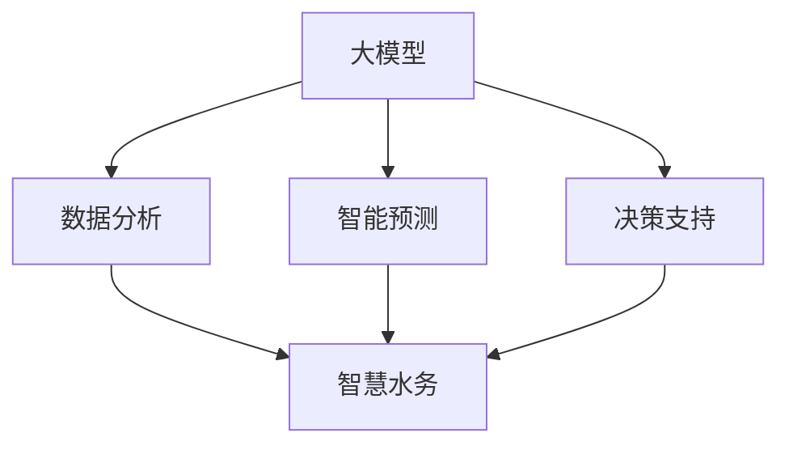

                 

## 1. 背景介绍

水资源是人类社会赖以生存和发展的基石，随着人口增长和经济发展，对水资源的需求日益增加，水资源的可持续利用已成为全球面临的重大挑战。智慧水务利用先进的信息技术和大数据分析，通过水资源信息的采集、处理、分析与监测，实现水资源的有效管理和利用，促进水资源的可持续利用。大模型在智慧水务中的应用，通过智能化、精准化的管理手段，显著提升了水资源利用效率，推动了水资源可持续利用的发展。

### 1.1 水资源管理面临的问题

传统的基于经验的水资源管理方法在面对不断变化的水资源状况时显得力不从心。水资源管理面临诸多挑战：

- **资源短缺**：人口增长和工业化进程加速，导致水资源供需失衡。
- **水质污染**：城市化进程中，水体污染严重，水质难以得到有效控制。
- **管理分散**：各地区水资源管理缺乏统一协调，存在资源浪费和利用效率低下的问题。
- **决策支持不足**：缺乏有效的大数据分析支持，水资源决策缺乏科学依据。

这些问题的存在，迫切需要借助先进的信息技术和大数据分析手段，提升水资源管理的智能化和精准化水平。大模型以其强大的数据处理和分析能力，为智慧水务的应用提供了可能。

### 1.2 智慧水务的概念及发展

智慧水务通过利用物联网、云计算、大数据、人工智能等技术，实现对水资源的全方位、实时监控、精准分析和高效管理。智慧水务能够整合各环节水资源数据，构建水资源全链条管理系统，提升水资源利用效率和管理水平。大模型在智慧水务中的应用，主要体现在对海量水资源数据的深度学习和智能分析，以及基于数据的决策支持和智能预测。

## 2. 核心概念与联系

### 2.1 核心概念概述

为了更好地理解大模型在智慧水务中的应用，下面将介绍几个关键概念及其相互联系：

- **大模型**：指基于深度学习框架构建的超大规模神经网络模型，通过在大规模数据集上进行训练，获得广泛的规律和知识。大模型通常具有自适应、泛化能力强的特点。
- **智慧水务**：指通过智慧技术和数据分析，实现对水资源的全方位管理，提高水资源的利用效率和管理水平。智慧水务结合了物联网、云计算、大数据和人工智能技术，推动水资源的可持续利用。
- **数据分析**：指对水资源数据进行采集、处理、分析和可视化，提取有价值的信息，为智慧水务决策提供数据支持。
- **智能预测**：基于大数据分析和机器学习模型，对水资源状况进行预测和预警，提前采取措施应对潜在风险。
- **决策支持**：利用大模型对水资源数据进行深度学习和分析，提供科学决策依据，优化水资源管理策略。

### 2.2 核心概念联系

这些概念之间的联系可以通过以下Mermaid流程图来展示：



这个流程图展示了大模型在智慧水务中的作用：

1. **大模型**：作为智慧水务的核心技术，提供了强大的数据处理和分析能力。
2. **数据分析**：大模型对水资源数据进行深度学习，提取出有价值的信息，为智慧水务提供数据支撑。
3. **智能预测**：基于数据分析结果，大模型对水资源状况进行预测和预警，实现对水资源状况的精准掌握。
4. **决策支持**：利用深度学习和分析结果，大模型为水资源管理提供科学决策依据，优化管理策略。

## 3. 核心算法原理 & 具体操作步骤

### 3.1 算法原理概述

大模型在智慧水务中的应用，主要基于以下几个算法原理：

- **深度学习算法**：利用深度神经网络对水资源数据进行深度学习和分析，提取出有价值的信息和规律。
- **时序分析算法**：对水资源的时序数据进行分析和预测，实现对水资源状况的动态监控和预警。
- **强化学习算法**：通过与环境互动，优化水资源管理策略，提升水资源利用效率。
- **多模态融合算法**：将水资源的多模态数据（如文本、图像、声音）进行融合分析，提升数据处理的全面性和准确性。

### 3.2 算法步骤详解

大模型在智慧水务中的应用步骤可以分为以下几个关键环节：

1. **数据采集与预处理**：通过物联网设备和水表等基础设施，采集水资源的相关数据。然后对数据进行清洗、归一化等预处理操作，确保数据质量。

2. **特征工程**：对预处理后的数据进行特征提取，构建可用于深度学习模型训练的数据集。特征工程包括选择、提取、组合特征等操作，是模型训练效果的重要保障。

3. **模型训练**：利用大模型对特征数据进行深度学习和训练，生成预测模型。模型训练需要选择合适的损失函数、优化算法和超参数，确保模型能够准确预测水资源状况。

4. **智能预测与预警**：基于训练好的模型，对水资源数据进行智能预测和预警。根据预测结果，及时调整水资源管理策略，预防潜在风险。

5. **决策支持与优化**：利用预测结果和历史数据，生成决策支持报告，辅助水资源管理决策。通过强化学习等算法，不断优化水资源管理策略，提升水资源利用效率。

### 3.3 算法优缺点

大模型在智慧水务中的应用，具有以下优点：

- **精度高**：深度学习模型的自适应能力强，对复杂的水资源数据具有较高的预测精度。
- **泛化能力强**：大模型能够从海量数据中学习到广泛的知识和规律，对新数据的泛化能力较强。
- **实时性强**：利用云计算和分布式计算技术，大模型能够在实时数据上快速进行分析和预测，提高水资源管理的响应速度。

同时，大模型在智慧水务中也有一些局限性：

- **数据依赖**：模型的训练效果依赖于高质量的数据，数据采集和预处理的质量直接影响模型效果。
- **计算资源需求高**：大模型通常需要大量的计算资源进行训练和推理，对硬件资源要求较高。
- **可解释性差**：深度学习模型通常被视为“黑箱”，难以解释模型的内部决策过程，增加了水资源管理的复杂性。

### 3.4 算法应用领域

大模型在智慧水务中的应用领域非常广泛，具体包括：

- **水质监测**：利用大模型对水体化学、物理参数进行监测，及时发现水质问题，预防污染事件。
- **水量管理**：通过分析历史用水数据和实时用水量，预测未来用水趋势，优化用水计划。
- **管道漏损检测**：利用大模型对管道压力、流量等数据进行分析，及时发现管道漏损情况，减少水资源浪费。
- **洪水预警**：基于历史水文数据和大模型预测结果，实现对洪水等灾害的预警，提前采取防范措施。
- **智能化泵站控制**：利用大模型优化泵站运行策略，提高供水系统的效率，降低能源消耗。

## 4. 数学模型和公式 & 详细讲解 & 举例说明

### 4.1 数学模型构建

大模型在智慧水务中的应用，主要依赖于以下数学模型：

- **回归模型**：用于对水资源的量化指标（如水量、水质等）进行预测，模型输出为连续值。
- **分类模型**：用于对水资源的分类问题（如水质状态、洪水灾害等）进行预测，模型输出为离散类别。
- **序列模型**：用于对水资源的时序数据进行分析和预测，模型输出为时间序列数据。

### 4.2 公式推导过程

以回归模型为例，假设水资源的连续变量为 $X$，回归模型的预测结果为 $Y$，则回归模型的公式可以表示为：

$$
Y = f(X; \theta)
$$

其中，$f$ 为回归函数，$\theta$ 为模型参数，通过最小化均方误差等损失函数，求解最优参数 $\theta$：

$$
\theta = \arg\min_{\theta} \frac{1}{N} \sum_{i=1}^{N} (Y_i - f(X_i; \theta))^2
$$

使用梯度下降等优化算法，更新模型参数，求解最小值。回归模型可以通过多层次神经网络实现，提高预测精度。

### 4.3 案例分析与讲解

以下以水质监测为例，介绍如何使用大模型进行水质分析：

假设某河流的水质参数有化学需氧量（COD）、生化需氧量（BOD）、溶解氧（DO）等，采集到 $N$ 个样本，每个样本包含 $M$ 个特征 $X$，对应的水质评价标签 $Y$ 为 0（优）、1（良）、2（差）等类别。构建分类模型，用于预测水质的等级：

$$
\hat{Y} = \text{softmax}(\text{MLP}(X; \theta))
$$

其中，$\text{MLP}$ 为多层感知器，$\theta$ 为模型参数，$\text{softmax}$ 函数将模型输出转化为概率分布。模型训练时，使用交叉熵损失函数：

$$
\mathcal{L} = -\frac{1}{N} \sum_{i=1}^{N} \sum_{j=1}^{M} y_{ij} \log \hat{y}_{ij}
$$

模型在训练过程中不断更新参数 $\theta$，最小化损失函数，最终得到最优模型。利用训练好的模型，对新采集的水质数据进行预测，得到水质评价结果。

## 5. 项目实践：代码实例和详细解释说明

### 5.1 开发环境搭建

为了进行大模型在智慧水务中的应用实践，需要搭建以下开发环境：

1. **Python环境**：安装Python 3.8及以上版本，使用Anaconda进行环境管理。
2. **深度学习框架**：安装TensorFlow或PyTorch等深度学习框架，用于构建和训练深度学习模型。
3. **数据采集工具**：安装物联网设备（如水表）和数据采集软件，用于数据采集和预处理。
4. **云计算平台**：使用AWS、阿里云等云平台，搭建分布式计算环境，支持模型训练和推理。

### 5.2 源代码详细实现

以下是一个使用TensorFlow进行水质监测的代码实现：

```python
import tensorflow as tf
from tensorflow.keras import layers

# 定义模型结构
model = tf.keras.Sequential([
    layers.Dense(64, activation='relu', input_shape=(3,)),
    layers.Dense(64, activation='relu'),
    layers.Dense(3, activation='softmax')
])

# 定义损失函数
loss_fn = tf.keras.losses.CategoricalCrossentropy()

# 训练模型
model.compile(optimizer='adam', loss=loss_fn)
model.fit(x_train, y_train, epochs=10, validation_data=(x_val, y_val))

# 预测新数据
predictions = model.predict(x_test)
```

### 5.3 代码解读与分析

- **模型定义**：使用TensorFlow的Sequential模型，定义多层感知器（MLP）结构。
- **损失函数**：使用CategoricalCrossentropy损失函数，适用于多分类问题。
- **模型训练**：通过compile方法定义优化器和损失函数，使用fit方法进行模型训练，在训练过程中不断更新模型参数，最小化损失函数。
- **模型预测**：使用predict方法对新采集的数据进行预测，生成水质评价结果。

### 5.4 运行结果展示

训练完成后，可以使用测试集对模型进行评估，生成预测结果：

```python
import numpy as np

# 计算预测准确率
y_pred = np.argmax(predictions, axis=1)
accuracy = np.mean(y_pred == y_test)
print(f'预测准确率: {accuracy:.2f}')
```

## 6. 实际应用场景

### 6.1 智慧水务管理

智慧水务管理通过利用大模型，实现对水资源的智能化和精准化管理，提升水资源的利用效率和管理水平。以下是大模型在智慧水务管理中的应用场景：

- **水资源监测与分析**：利用大模型对水资源数据进行分析和预测，实现对水资源状况的动态监控和预警。
- **用水量管理**：通过分析历史用水数据和实时用水量，预测未来用水趋势，优化用水计划。
- **供水系统优化**：利用大模型优化供水系统的运行策略，提高供水效率，降低能源消耗。
- **管道漏损检测**：利用大模型对管道压力、流量等数据进行分析，及时发现管道漏损情况，减少水资源浪费。
- **水质监测与预警**：利用大模型对水体化学、物理参数进行监测，及时发现水质问题，预防污染事件。

### 6.2 水资源节约与优化

大模型在智慧水务中的应用，还涉及到水资源的节约与优化。以下是一些实际应用场景：

- **节水方案优化**：利用大模型对用水数据进行分析，优化用水方案，降低水资源消耗。
- **污水处理优化**：利用大模型对污水处理过程进行优化，提高污水处理效率，减少资源浪费。
- **智能灌溉系统**：利用大模型对土壤湿度和气候数据进行分析，优化灌溉方案，提高灌溉效率，减少水资源浪费。
- **工业用水优化**：利用大模型对工业用水数据进行分析，优化用水方案，降低水资源消耗。

### 6.3 未来应用展望

未来，大模型在智慧水务中的应用将更加广泛和深入。以下是一些未来应用展望：

- **智能化决策支持系统**：构建基于大模型的智慧水务决策支持系统，提供科学决策依据，优化水资源管理策略。
- **实时数据分析与预警**：利用大模型实现对水资源数据的实时分析和预警，提升水资源管理的响应速度和效率。
- **多模态融合与智能分析**：将水资源的多模态数据（如文本、图像、声音）进行融合分析，提升数据处理的全面性和准确性。
- **跨领域应用**：将智慧水务与其他领域（如智慧农业、智慧城市等）进行跨领域融合，实现水资源与其他资源的协同管理。

## 7. 工具和资源推荐

### 7.1 学习资源推荐

为了帮助开发者系统掌握大模型在智慧水务中的应用，这里推荐一些优质的学习资源：

1. **《TensorFlow官方文档》**：包含TensorFlow深度学习框架的详细介绍，提供了丰富的样例代码和文档，适合入门学习和实践。
2. **《PyTorch官方文档》**：包含PyTorch深度学习框架的详细介绍，提供了丰富的样例代码和文档，适合深度学习开发。
3. **《智慧水务技术与应用》**：介绍智慧水务技术和应用的书籍，涵盖水资源监测、管理、优化等多个方面。
4. **《大模型在水务中的应用》**：介绍大模型在水务中的应用案例和实践，适合了解最新技术趋势和应用场景。
5. **《智慧水务技术前沿》**：包含智慧水务技术的最新进展和研究成果，适合跟踪前沿技术和研究动态。

通过对这些资源的学习实践，相信你一定能够快速掌握大模型在智慧水务中的应用，并用于解决实际的水资源管理问题。

### 7.2 开发工具推荐

高效的开发离不开优秀的工具支持。以下是几款用于大模型在智慧水务开发的工具：

1. **TensorFlow**：由Google主导开发的开源深度学习框架，生产部署方便，适合大规模工程应用。
2. **PyTorch**：基于Python的开源深度学习框架，灵活动态的计算图，适合快速迭代研究。
3. **Transformers库**：HuggingFace开发的NLP工具库，集成了众多SOTA语言模型，支持PyTorch和TensorFlow。
4. **AWS SageMaker**：亚马逊提供的云端深度学习平台，支持模型训练和部署，适合大规模数据处理和应用。
5. **Jupyter Notebook**：交互式的编程环境，支持Python等语言，适合数据处理和模型训练。

合理利用这些工具，可以显著提升大模型在智慧水务开发的效率，加快创新迭代的步伐。

### 7.3 相关论文推荐

大模型在智慧水务中的应用源于学界的持续研究。以下是几篇奠基性的相关论文，推荐阅读：

1. **《Deep Learning for Water Resource Management》**：介绍深度学习在水资源管理中的应用，包括数据预处理、模型构建和优化等。
2. **《A Survey on Deep Learning for Water Management》**：综述深度学习在水资源管理中的最新进展和研究成果，适合全面了解深度学习在智慧水务中的应用。
3. **《IJCAI 2021: Deep Learning for Smart Water Systems》**：介绍深度学习在智慧水务系统中的应用案例和实践，适合了解实际应用场景。
4. **《WCCI 2020: Water Resource Management with Deep Learning》**：综述深度学习在智慧水务管理中的应用，适合了解最新研究动态和应用趋势。

这些论文代表了大模型在智慧水务领域的研究方向和进展，通过学习这些前沿成果，可以帮助研究者把握学科前进方向，激发更多的创新灵感。

## 8. 总结：未来发展趋势与挑战

### 8.1 研究成果总结

大模型在智慧水务中的应用，已经取得了显著的成果，主要体现在以下几个方面：

- **数据处理能力**：大模型具备强大的数据处理能力，能够对海量水资源数据进行深度分析和预测，提升了水资源管理的智能化和精准化水平。
- **决策支持**：大模型为水资源管理提供了科学决策依据，优化了水资源管理策略，提升了水资源利用效率。
- **实时监测与预警**：大模型能够实现对水资源数据的实时分析和预警，提升了水资源管理的响应速度和效率。
- **跨领域应用**：大模型在智慧水务中的应用，还涉及跨领域数据融合与智能分析，提升了水资源与其他资源的协同管理能力。

### 8.2 未来发展趋势

展望未来，大模型在智慧水务中的应用将呈现以下几个发展趋势：

- **模型规模增大**：随着算力成本的下降和数据规模的扩张，大模型的参数量还将持续增长，模型的泛化能力和预测精度将进一步提升。
- **多模态融合**：将水资源的多模态数据（如文本、图像、声音）进行融合分析，提升数据处理的全面性和准确性。
- **实时性增强**：利用云计算和分布式计算技术，实现大模型的实时数据分析和预测，提升水资源管理的响应速度。
- **智能化决策**：构建基于大模型的智慧水务决策支持系统，提供科学决策依据，优化水资源管理策略。
- **跨领域融合**：将智慧水务与其他领域（如智慧农业、智慧城市等）进行跨领域融合，实现水资源与其他资源的协同管理。

### 8.3 面临的挑战

尽管大模型在智慧水务中的应用已经取得了显著的成果，但在迈向更加智能化、普适化应用的过程中，仍然面临诸多挑战：

- **数据质量**：水资源数据的采集和预处理质量直接影响模型效果，需要确保数据的准确性和完整性。
- **模型复杂度**：大模型的复杂度较高，对硬件资源要求较高，需要优化模型结构和算法，提升计算效率。
- **可解释性**：深度学习模型通常被视为“黑箱”，难以解释模型的内部决策过程，增加了水资源管理的复杂性。
- **跨领域融合**：将智慧水务与其他领域进行跨领域融合，需要解决数据异构性、模型兼容性等问题。

### 8.4 研究展望

面对智慧水务中大模型应用面临的挑战，未来的研究需要在以下几个方面寻求新的突破：

- **数据质量提升**：通过物联网设备和水表等基础设施，采集高质量的水资源数据，确保数据的准确性和完整性。
- **模型优化与简化**：通过优化模型结构和算法，提升计算效率和可解释性，降低对硬件资源的需求。
- **跨领域融合技术**：解决跨领域数据融合与模型兼容性问题，提升智慧水务系统的协同管理能力。
- **决策支持系统**：构建基于大模型的智慧水务决策支持系统，提供科学决策依据，优化水资源管理策略。

这些研究方向的探索，必将引领大模型在智慧水务领域的应用走向新的高度，为水资源的可持续利用提供强大的技术支撑。面向未来，大模型需要与其他人工智能技术进行更深入的融合，如知识表示、因果推理、强化学习等，共同推动水资源的智能化和精准化管理，实现水资源的可持续利用。

## 9. 附录：常见问题与解答

**Q1：大模型在智慧水务中的作用是什么？**

A: 大模型在智慧水务中的应用，主要体现在对海量水资源数据的深度学习和智能分析，以及基于数据的决策支持和智能预测。大模型能够从海量数据中学习到广泛的知识和规律，提供科学决策依据，优化水资源管理策略，实现对水资源状况的动态监控和预警。

**Q2：如何选择合适的模型和算法？**

A: 选择模型和算法需要考虑多个因素，包括数据特征、问题类型、计算资源等。对于水资源监测和分析，回归模型和分类模型较为常用；对于实时数据分析和预测，序列模型和强化学习算法更为合适。选择合适的模型和算法，需要根据具体应用场景进行综合评估和选择。

**Q3：大模型在智慧水务中的应用存在哪些挑战？**

A: 大模型在智慧水务中的应用面临以下挑战：
- 数据质量：水资源数据的采集和预处理质量直接影响模型效果，需要确保数据的准确性和完整性。
- 模型复杂度：大模型的复杂度较高，对硬件资源要求较高，需要优化模型结构和算法，提升计算效率。
- 可解释性：深度学习模型通常被视为“黑箱”，难以解释模型的内部决策过程，增加了水资源管理的复杂性。
- 跨领域融合：将智慧水务与其他领域进行跨领域融合，需要解决数据异构性、模型兼容性等问题。

**Q4：如何提升大模型在智慧水务中的性能？**

A: 提升大模型在智慧水务中的性能，可以从以下几个方面进行优化：
- 数据质量：确保采集的水资源数据准确性和完整性，提高数据预处理质量。
- 模型优化：通过优化模型结构和算法，提升计算效率和可解释性，降低对硬件资源的需求。
- 跨领域融合：解决跨领域数据融合与模型兼容性问题，提升智慧水务系统的协同管理能力。
- 决策支持：构建基于大模型的智慧水务决策支持系统，提供科学决策依据，优化水资源管理策略。

**Q5：大模型在智慧水务中的应用前景如何？**

A: 大模型在智慧水务中的应用前景广阔，未来将更加深入和广泛。主要体现在以下几个方面：
- 数据处理能力：大模型具备强大的数据处理能力，能够对海量水资源数据进行深度分析和预测，提升了水资源管理的智能化和精准化水平。
- 决策支持：大模型为水资源管理提供了科学决策依据，优化了水资源管理策略，提升了水资源利用效率。
- 实时监测与预警：大模型能够实现对水资源数据的实时分析和预警，提升了水资源管理的响应速度和效率。
- 跨领域融合：将智慧水务与其他领域进行跨领域融合，实现水资源与其他资源的协同管理。

---

作者：禅与计算机程序设计艺术 / Zen and the Art of Computer Programming

