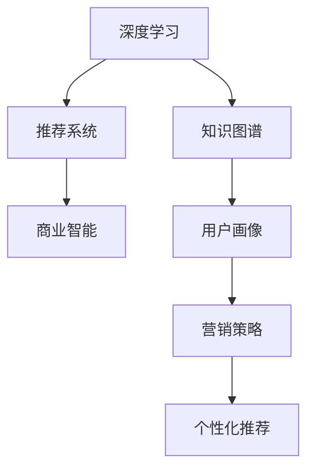
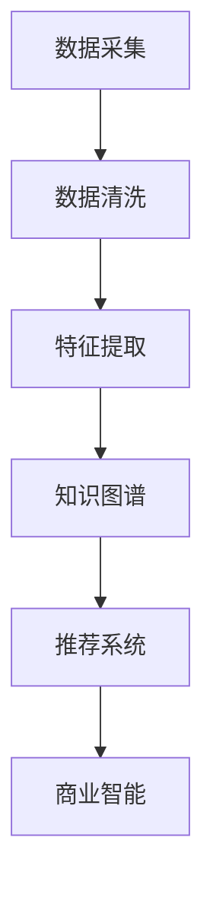

                 

# 大模型：智能时代的商业新模式

> 关键词：大模型,商业智能,商业创新,人工智能,深度学习,知识图谱,推荐系统,自动驾驶,智慧医疗

## 1. 背景介绍

### 1.1 问题由来

随着人工智能技术的迅猛发展，尤其是深度学习和大规模预训练语言模型的突破，大数据和AI技术开始深度融合，形成了一种新的商业模式，即**大模型商业化**。

传统上，商业智能(Business Intelligence, BI)依赖于人类分析、报表生成和数据分析。而随着大数据和人工智能的兴起，大模型商业化模式应运而生，使用机器学习和自然语言处理技术，通过自动化的数据挖掘和分析，为企业提供决策支持、客户服务和运营优化等服务。

这种新模式极大地提高了商业决策的效率和准确性，同时也开辟了新的商业机会，推动了产业升级和转型。本文将系统地介绍大模型商业化的背景、核心概念、原理与技术，并展望其未来发展趋势和面临的挑战。

## 2. 核心概念与联系

### 2.1 核心概念概述

大模型商业化基于大模型的核心技术，包括**深度学习**、**知识图谱**、**推荐系统**等。这些技术通过自动化、智能化的手段，提供高效、精准的商业分析与决策支持。

- **深度学习**：通过深度神经网络模型，自动挖掘数据中的隐含知识和模式，提供高效的特征提取和预测能力。
- **知识图谱**：一种结构化的语义网络表示，将实体、关系和属性等信息结构化地组织起来，便于机器理解和推理。
- **推荐系统**：通过分析用户行为和兴趣，提供个性化的产品推荐，提升用户体验和满意度。

以上概念共同构成了大模型商业化的技术基础。如图1所示，深度学习、知识图谱和推荐系统之间存在紧密的联系和协作，共同支撑起大模型的商业化应用。



### 2.2 核心概念原理和架构的 Mermaid 流程图

大模型商业化的核心流程可以抽象为如下架构：

1. **数据采集与清洗**：从多源异构的数据源采集数据，并进行数据清洗和预处理。
2. **特征提取与建模**：使用深度学习模型自动提取数据中的高维特征，并建立合适的模型。
3. **知识图谱构建**：通过自然语言处理技术，构建知识图谱，将非结构化数据转化为结构化的语义表示。
4. **推荐系统设计**：设计推荐算法，利用知识图谱和用户行为数据，提供个性化推荐。
5. **商业智能应用**：将推荐结果和分析结果整合到商业智能系统中，辅助企业决策。



## 3. 核心算法原理 & 具体操作步骤

### 3.1 算法原理概述

大模型商业化算法原理主要包括**深度学习算法**、**知识图谱构建算法**和**推荐系统算法**。其中，深度学习算法和推荐系统算法是大模型商业化的核心。

- **深度学习算法**：主要通过神经网络模型自动提取特征和进行预测，广泛应用于文本处理、图像识别、语音识别等领域。
- **知识图谱构建算法**：将非结构化数据转化为结构化的语义表示，便于机器理解和推理。
- **推荐系统算法**：通过分析用户行为和兴趣，提供个性化的产品推荐，提升用户体验和满意度。

### 3.2 算法步骤详解

大模型商业化主要包括以下几个步骤：

1. **数据采集与预处理**：从多源异构的数据源采集数据，并进行数据清洗和预处理。
2. **深度学习建模**：使用深度学习模型自动提取数据中的高维特征，并建立合适的模型。
3. **知识图谱构建**：通过自然语言处理技术，构建知识图谱，将非结构化数据转化为结构化的语义表示。
4. **推荐系统设计**：设计推荐算法，利用知识图谱和用户行为数据，提供个性化推荐。
5. **商业智能应用**：将推荐结果和分析结果整合到商业智能系统中，辅助企业决策。

### 3.3 算法优缺点

大模型商业化算法具有以下优点：

1. **效率高**：自动化处理数据和模型，极大提升了数据挖掘和分析的效率。
2. **精度高**：深度学习模型和高维特征提取，提供了精准的预测和分析能力。
3. **灵活性强**：推荐系统和知识图谱，能够灵活适应不同领域的业务需求。

但同时也存在一些缺点：

1. **数据依赖**：对高质量数据的依赖较高，数据缺失和错误会影响模型效果。
2. **模型复杂**：深度学习模型和知识图谱构建算法复杂度高，需要较强的技术能力和资源支持。
3. **隐私风险**：涉及用户隐私数据的处理，需要严格的隐私保护措施。

### 3.4 算法应用领域

大模型商业化在多个领域得到了广泛应用，例如：

- **零售电商**：通过推荐系统和深度学习算法，提供个性化商品推荐，提升用户体验和销售转化率。
- **金融服务**：使用深度学习模型和知识图谱，进行信用评分、风险评估、客户画像等业务。
- **医疗健康**：利用深度学习和知识图谱，进行疾病预测、诊疗建议、健康管理等业务。
- **自动驾驶**：通过知识图谱和深度学习，进行环境感知、路径规划和决策支持。
- **智慧城市**：使用深度学习和推荐系统，进行交通管理、能源优化、城市安防等业务。

## 4. 数学模型和公式 & 详细讲解 & 举例说明

### 4.1 数学模型构建

大模型商业化的数学模型主要包括以下几个方面：

- **深度学习模型**：常见的深度学习模型包括卷积神经网络、循环神经网络、Transformer等。
- **知识图谱模型**：常用的知识图谱模型包括RDF、OWL、GNN等。
- **推荐系统模型**：常用的推荐系统模型包括协同过滤、基于内容的推荐、混合推荐等。

### 4.2 公式推导过程

以深度学习模型为例，其基本公式可以表示为：

$$
y = \mathcal{F}(x; \theta)
$$

其中，$x$ 为输入数据，$\theta$ 为模型参数，$\mathcal{F}$ 为模型函数。以简单的单层神经网络为例，其推导过程如下：

$$
\begin{aligned}
y &= \sigma(\mathbf{W}x + b) \\
&= \sigma(\sum_{i=1}^n w_i x_i + b)
\end{aligned}
$$

其中，$\sigma$ 为激活函数，$\mathbf{W}$ 为权重矩阵，$b$ 为偏置项，$x$ 为输入向量，$w_i$ 为权重，$x_i$ 为输入特征。

### 4.3 案例分析与讲解

以零售电商中的个性化推荐为例，深度学习模型可以用于提取用户行为数据中的高维特征，并建立用户画像。

假设用户行为数据为 $x$，深度学习模型为 $\mathcal{F}$，推荐系统算法为 $\mathcal{R}$，用户画像为 $y$，则推荐过程可以表示为：

$$
y = \mathcal{R}(\mathcal{F}(x; \theta))
$$

其中，$\theta$ 为深度学习模型的参数，$\mathcal{R}$ 为推荐系统算法。

## 5. 项目实践：代码实例和详细解释说明

### 5.1 开发环境搭建

开发环境搭建主要包括以下步骤：

1. 安装Python和相关依赖包。
2. 安装深度学习框架，如TensorFlow、PyTorch等。
3. 安装推荐系统库，如Scikit-learn、Tensorflow-Addons等。
4. 安装知识图谱库，如Neo4j、GATE等。

### 5.2 源代码详细实现

以推荐系统为例，下面展示基于TensorFlow实现协同过滤推荐系统的代码：

```python
import tensorflow as tf
from tensorflow.keras.layers import Input, Embedding, Dot, Activation, Concatenate

# 输入层
user_input = Input(shape=(user_dim,))
item_input = Input(shape=(item_dim,))

# 用户和物品嵌入层
user_embedding = Embedding(user_dim, embed_dim)(user_input)
item_embedding = Embedding(item_dim, embed_dim)(item_input)

# 点积层
dot_product = Dot(axes=2)([user_embedding, item_embedding])

# 激活层
activation = Activation('relu')(dot_product)

# 输出层
output = Activation('softmax')(activation)

# 定义模型
model = tf.keras.Model(inputs=[user_input, item_input], outputs=output)

# 编译模型
model.compile(optimizer='adam', loss='categorical_crossentropy')
```

### 5.3 代码解读与分析

以上代码展示了如何使用TensorFlow实现协同过滤推荐系统。其主要步骤如下：

1. 定义输入层，包括用户行为数据和物品属性数据。
2. 使用Embedding层将输入数据转换为高维向量。
3. 通过点积层计算用户和物品的相似度。
4. 使用激活层激活输出。
5. 定义输出层，使用softmax函数计算推荐结果。
6. 编译模型，选择优化器和损失函数。

## 6. 实际应用场景

### 6.1 零售电商

在零售电商领域，大模型商业化能够提供精准的个性化推荐，提高用户满意度和销售转化率。例如，淘宝、京东等电商平台使用深度学习模型和推荐系统，根据用户的历史行为和兴趣，自动推荐最相关的商品，提升用户体验和销售额。

### 6.2 金融服务

金融服务领域中，大模型商业化能够进行信用评分、风险评估和客户画像等业务。例如，银行使用知识图谱和深度学习模型，分析客户的交易行为和信用记录，评估其信用等级，提供个性化的金融产品推荐。

### 6.3 医疗健康

医疗健康领域中，大模型商业化能够进行疾病预测、诊疗建议和健康管理等业务。例如，医疗机构使用深度学习和知识图谱，分析患者的病历和检查结果，预测其可能患上的疾病，提供个性化的诊疗建议。

### 6.4 自动驾驶

自动驾驶领域中，大模型商业化能够进行环境感知、路径规划和决策支持。例如，特斯拉使用知识图谱和深度学习模型，分析道路和交通情况，进行自动驾驶决策，提升驾驶安全和效率。

## 7. 工具和资源推荐

### 7.1 学习资源推荐

1. **《深度学习》**：Ian Goodfellow等人编写的深度学习经典教材，系统介绍了深度学习的基本概念和算法。
2. **《推荐系统》**：Wikipedia推荐的推荐系统相关书籍，包括协同过滤、基于内容的推荐等算法。
3. **《知识图谱理论与实践》**：知识图谱领域的经典教材，介绍了知识图谱的构建、查询和应用。
4. **Coursera深度学习课程**：由Coursera提供的深度学习课程，涵盖深度学习的基本原理和应用。
5. **Kaggle推荐系统竞赛**：Kaggle组织的推荐系统竞赛，提供实战练习机会，提升推荐系统设计能力。

### 7.2 开发工具推荐

1. **TensorFlow**：由Google主导开发的深度学习框架，提供丰富的深度学习模型和工具。
2. **PyTorch**：由Facebook开发的深度学习框架，具有灵活的动态计算图。
3. **Scikit-learn**：Python数据科学库，提供多种机器学习算法和工具。
4. **Neo4j**：流行的知识图谱数据库，支持复杂的图查询和分析。
5. **GATE**：自然语言处理和知识工程工具，支持多种语料和算法。

### 7.3 相关论文推荐

1. **《神经网络与深度学习》**：Michael Nielsen编写的神经网络经典教材，系统介绍了神经网络和深度学习的基本原理。
2. **《推荐系统基础》**：Daniel J. Hofmann等编写的推荐系统经典教材，介绍了推荐系统的算法和应用。
3. **《知识图谱构建与查询》**：Wikipedia推荐的知识图谱相关论文，涵盖了知识图谱的构建、查询和应用。
4. **《深度学习在零售电商中的应用》**：关于深度学习在零售电商中应用的论文，介绍了深度学习模型的选择和调优。
5. **《金融领域的应用》**：关于深度学习在金融领域应用的研究论文，介绍了金融领域中深度学习模型的应用和效果。

## 8. 总结：未来发展趋势与挑战

### 8.1 研究成果总结

大模型商业化在多个领域取得了显著成效，通过深度学习、知识图谱和推荐系统，提供精准的商业分析与决策支持。大模型的商业化不仅提升了数据挖掘和分析的效率，还提供了个性化的服务和决策支持，推动了企业数字化转型和创新发展。

### 8.2 未来发展趋势

未来大模型商业化将呈现以下几个发展趋势：

1. **更加智能化的分析**：通过深度学习和知识图谱，提供更加智能化的分析和决策支持。例如，智能客服、智能推荐等。
2. **更加个性化的服务**：通过推荐系统和深度学习，提供更加个性化的服务和用户体验。例如，个性化推荐、智能推荐等。
3. **更加高效的操作**：通过自动化和智能化，提高运营效率和成本效益。例如，自动驾驶、智能仓储等。
4. **更加普适化的应用**：通过跨领域的应用和整合，推动大模型商业化在更多领域的普及和应用。例如，智慧城市、智慧医疗等。

### 8.3 面临的挑战

大模型商业化在发展过程中也面临着一些挑战：

1. **数据质量和多样性**：数据质量和多样性直接影响到模型效果，需要高质量的数据采集和处理。
2. **模型复杂性和可解释性**：大模型的复杂性高，难以解释其内部工作机制和决策逻辑。
3. **隐私保护和安全**：涉及用户隐私数据的处理，需要严格的隐私保护和安全措施。
4. **计算资源和成本**：大模型需要大量的计算资源和存储资源，需要高效的优化和压缩技术。
5. **算法鲁棒性和泛化性**：大模型需要具备良好的鲁棒性和泛化能力，应对数据分布的变化和干扰。

### 8.4 研究展望

未来大模型商业化需要在以下几个方面进行深入研究和探索：

1. **数据治理和隐私保护**：提升数据治理能力，保障数据安全和隐私保护。
2. **模型压缩和优化**：提升模型压缩和优化技术，降低计算资源和成本。
3. **算法鲁棒性和泛化性**：提升模型鲁棒性和泛化能力，应对数据分布的变化和干扰。
4. **可解释性和决策支持**：提升模型的可解释性和决策支持能力，提供透明和可靠的商业决策。
5. **跨领域的应用和整合**：推动大模型在跨领域的应用和整合，推动大模型商业化的普及和应用。

## 9. 附录：常见问题与解答

**Q1: 大模型商业化如何应用于零售电商？**

A: 大模型商业化在零售电商中主要应用于个性化推荐和智能客服。通过深度学习模型和推荐系统，分析用户的历史行为和兴趣，提供个性化的商品推荐和购物体验。

**Q2: 大模型商业化面临的主要挑战有哪些？**

A: 大模型商业化面临的主要挑战包括数据质量和多样性、模型复杂性和可解释性、隐私保护和安全、计算资源和成本、算法鲁棒性和泛化性。

**Q3: 大模型商业化在未来的发展趋势是什么？**

A: 大模型商业化未来的发展趋势包括更加智能化的分析、更加个性化的服务、更加高效的操作、更加普适化的应用。

---

作者：禅与计算机程序设计艺术 / Zen and the Art of Computer Programming

