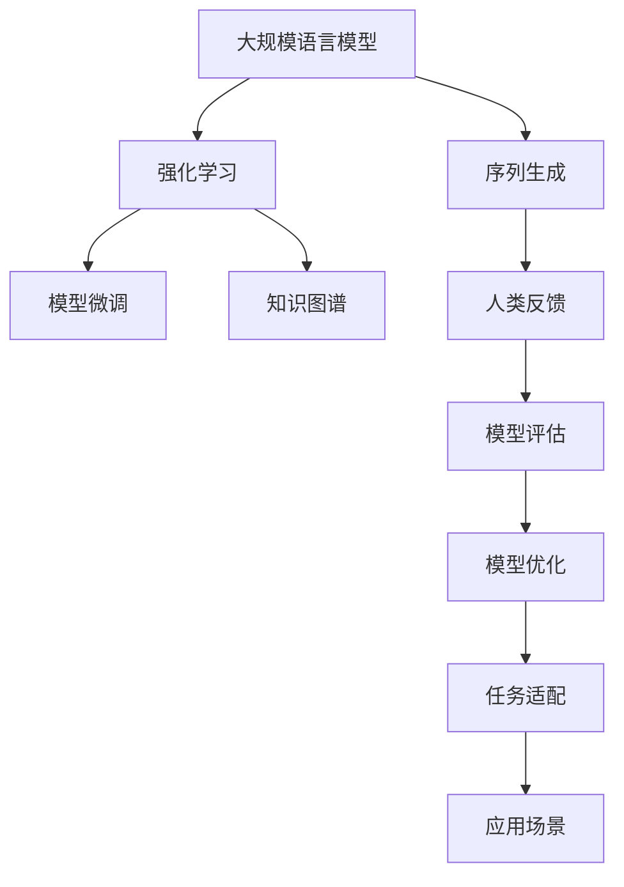

                 

# 大规模语言模型从理论到实践 基于人类反馈的强化学习

> 关键词：大规模语言模型, 强化学习, 人类反馈, 自然语言处理, 人工智能, 深度学习

## 1. 背景介绍

### 1.1 问题由来

近年来，深度学习技术在自然语言处理（Natural Language Processing, NLP）领域取得了巨大的突破，特别是在大规模语言模型的构建上。基于自回归模型（如GPT）或自编码模型（如BERT）的预训练大模型在语言生成、文本分类、信息抽取、机器翻译等多个NLP任务上取得了优异的性能。然而，这些通用预训练模型的泛化能力有限，对于特定领域的任务，往往需要进一步微调（Fine-Tuning）以获得最佳性能。

强化学习（Reinforcement Learning, RL）作为一种基于人类反馈的学习方法，近年来在NLP领域的应用逐渐增多。通过人类反馈（Human Feedback），强化学习能够更好地适应特定的应用场景，提升模型的适应性和鲁棒性。例如，在机器翻译任务中，通过奖励模型翻译的正确性，可以有效地提高翻译质量；在问答系统中，通过指导模型生成更符合人类期望的答案，可以显著提升问答系统的效果。

本文聚焦于基于人类反馈的强化学习，探讨如何利用强化学习和大规模语言模型构建高性能的NLP系统。

### 1.2 问题核心关键点

基于人类反馈的强化学习在大规模语言模型中的应用，关键在于如何将大规模语言模型的强大语言理解和生成能力与人类反馈相结合，以提升模型在特定任务上的性能。核心包括以下几个方面：

1. **反馈机制设计**：如何设计有效的反馈机制，将人类对模型输出的评价转换为模型优化的信号。
2. **模型训练**：如何在强化学习框架下训练大规模语言模型，使其能够在人类反馈的指导下不断优化。
3. **模型评估**：如何设计评估指标，衡量模型在特定任务上的性能。
4. **应用场景**：强化学习与大规模语言模型在哪些NLP任务上具有显著优势。

通过解决这些问题，可以充分利用大规模语言模型的强大能力，构建高性能的NLP系统，提升自然语言理解和生成任务的准确性和鲁棒性。

### 1.3 问题研究意义

研究基于人类反馈的强化学习，对于推动NLP技术的应用和发展具有重要意义：

1. **提升模型性能**：通过人类反馈指导模型的训练，可以更好地适应特定任务，提升模型的性能和泛化能力。
2. **降低成本**：强化学习能够利用少量的标注数据进行训练，大大降低模型开发和维护的成本。
3. **增强可解释性**：强化学习提供了模型学习过程的可解释性，有助于理解模型的决策逻辑。
4. **拓展应用范围**：强化学习可以应用于更多NLP任务，如对话系统、情感分析、问答系统等，推动NLP技术在各行各业的落地应用。
5. **创新算法**：基于强化学习的研究有助于推动NLP领域的算法创新，如模型微调、序列生成、知识图谱构建等。

## 2. 核心概念与联系

### 2.1 核心概念概述

为了更好地理解基于人类反馈的强化学习在大规模语言模型中的应用，本节将介绍几个关键概念：

1. **大规模语言模型（Large Language Model, LLM）**：指以自回归（如GPT）或自编码（如BERT）模型为代表的大规模预训练语言模型。通过在大规模无标签文本数据上进行预训练，学习到丰富的语言知识和常识。
2. **强化学习（Reinforcement Learning, RL）**：一种基于奖励信号的学习方法，通过与环境的交互，优化行为策略。在NLP领域，强化学习可以应用于模型训练、任务适配、知识图谱构建等。
3. **人类反馈（Human Feedback）**：指在模型训练过程中，将人类的评价作为反馈信号，引导模型优化。人类反馈可以是正确的答案、评估分数等。
4. **序列生成（Sequence Generation）**：指模型生成连续的文本序列，如机器翻译、对话系统、摘要生成等任务。
5. **知识图谱（Knowledge Graph）**：指由实体和关系构成的图形结构，用于表示知识并辅助推理。
6. **模型微调（Model Fine-Tuning）**：指在预训练模型的基础上，通过有监督地训练优化模型在特定任务上的性能。

这些概念之间的逻辑关系可以通过以下Mermaid流程图来展示：



这个流程图展示了大规模语言模型与强化学习、人类反馈、序列生成、知识图谱、模型微调、模型评估、任务适配和应用场景之间的关系：

1. 大规模语言模型通过预训练获得基础能力。
2. 强化学习通过人类反馈指导模型优化。
3. 序列生成是强化学习和大规模语言模型的重要应用场景。
4. 知识图谱辅助大规模语言模型的推理能力。
5. 模型微调在预训练基础上提升特定任务性能。
6. 模型评估衡量模型在特定任务上的效果。
7. 任务适配将通用模型适配到特定任务。
8. 应用场景包括问答系统、翻译、摘要、对话等。

这些概念共同构成了基于人类反馈的强化学习在大规模语言模型中的应用框架，使其能够在各种场景下发挥强大的语言理解和生成能力。

## 3. 核心算法原理 & 具体操作步骤
### 3.1 算法原理概述

基于人类反馈的强化学习在大规模语言模型中的应用，本质上是一种有监督的强化学习过程。其核心思想是：将大规模语言模型作为代理人（Agent），通过与环境的交互（生成和评估文本序列），获得人类反馈（奖励或惩罚），进而优化模型在特定任务上的性能。

形式化地，假设大规模语言模型为 $M_{\theta}$，其中 $\theta$ 为模型参数。给定任务 $T$ 的训练集 $D=\{(x_i,y_i)\}_{i=1}^N$，其中 $x_i$ 为输入文本，$y_i$ 为模型生成的输出序列。强化学习的优化目标是最小化损失函数 $L$，使得模型输出的文本序列与任务要求的答案序列尽可能接近。

设模型在输入 $x_i$ 上的输出为 $y_i^* = (y_{i,1}, y_{i,2}, ..., y_{i,N})$，则损失函数可以定义为：

$$
L = \frac{1}{N} \sum_{i=1}^N \ell(x_i, y_i^*, y_i)
$$

其中 $\ell$ 为任务特定的损失函数，用于衡量模型输出 $y_i$ 与任务要求 $y_i^*$ 之间的差异。常见的损失函数包括交叉熵损失、均方误差损失等。

### 3.2 算法步骤详解

基于人类反馈的强化学习的大规模语言模型微调一般包括以下几个关键步骤：

**Step 1: 准备训练数据集**

- 收集任务 $T$ 的标注数据集 $D=\{(x_i,y_i)\}_{i=1}^N$，其中 $x_i$ 为输入文本，$y_i$ 为任务要求的输出序列。

**Step 2: 定义奖励函数**

- 根据任务要求，设计奖励函数 $R(y_i, y_i^*)$，用于衡量模型输出 $y_i$ 与任务要求 $y_i^*$ 之间的差异。通常奖励函数可以为交叉熵损失函数的负值。

**Step 3: 设置训练参数**

- 选择合适的优化算法及其参数，如 AdamW、SGD 等，设置学习率、批大小、迭代轮数等。
- 设置正则化技术及强度，包括权重衰减、Dropout、Early Stopping 等。
- 确定冻结预训练参数的策略，如仅微调顶层，或全部参数都参与微调。

**Step 4: 执行梯度训练**

- 将训练集数据分批次输入模型，前向传播计算模型输出 $y_i$。
- 根据奖励函数 $R(y_i, y_i^*)$ 计算奖励值，反向传播计算参数梯度，根据设定的优化算法和学习率更新模型参数。
- 周期性在验证集上评估模型性能，根据性能指标决定是否触发 Early Stopping。
- 重复上述步骤直至满足预设的迭代轮数或 Early Stopping 条件。

**Step 5: 测试和部署**

- 在测试集上评估微调后模型 $M_{\hat{\theta}}$ 的性能，对比微调前后的精度提升。
- 使用微调后的模型对新样本进行推理预测，集成到实际的应用系统中。
- 持续收集新的数据，定期重新微调模型，以适应数据分布的变化。

以上是基于人类反馈的强化学习在大规模语言模型中的应用的一般流程。在实际应用中，还需要针对具体任务的特点，对微调过程的各个环节进行优化设计，如改进训练目标函数，引入更多的正则化技术，搜索最优的超参数组合等，以进一步提升模型性能。

### 3.3 算法优缺点

基于人类反馈的强化学习在大规模语言模型中的应用，具有以下优点：

1. **灵活性**：强化学习通过人类反馈指导模型优化，可以适应多种NLP任务，具有较强的灵活性。
2. **高效性**：强化学习可以充分利用少量标注数据进行训练，大大降低模型开发和维护的成本。
3. **鲁棒性**：通过人类反馈引导模型优化，可以提高模型的鲁棒性和泛化能力。
4. **可解释性**：强化学习提供了模型学习过程的可解释性，有助于理解模型的决策逻辑。
5. **动态适应**：强化学习可以不断学习新知识，动态适应数据分布的变化。

同时，该方法也存在一定的局限性：

1. **依赖高质量数据**：强化学习需要高质量的人类反馈数据，获取高质量数据可能成本较高。
2. **模型复杂性**：强化学习的训练过程较复杂，需要设计有效的奖励函数和优化策略。
3. **训练时间长**：强化学习训练时间较长，可能面临超参数调优的困难。
4. **反馈信号噪音**：人类反馈可能存在一定的噪音，需要设计有效的噪声抑制策略。

尽管存在这些局限性，但就目前而言，基于强化学习的方法在NLP领域的应用前景广阔，特别是在需要大量标注数据的场景下，具有显著的优势。未来相关研究的重点在于如何进一步降低强化学习对标注数据的依赖，提高模型的泛化能力和鲁棒性，同时兼顾可解释性和动态适应性等因素。

### 3.4 算法应用领域

基于强化学习的大规模语言模型微调方法，已经在NLP领域得到了广泛的应用，覆盖了几乎所有常见的任务，例如：

- 问答系统：对自然语言问题给出答案。将问题-答案对作为微调数据，训练模型学习匹配答案。
- 对话系统：使机器能够与人自然对话。将对话历史作为上下文，微调模型进行回复生成。
- 机器翻译：将源语言文本翻译成目标语言。通过微调使模型学习语言-语言映射。
- 文本摘要：将长文本压缩成简短摘要。将文章-摘要对作为微调数据，使模型学习抓取要点。
- 情感分析：分析文本的情感倾向。通过微调使模型学习文本-情感映射。
- 命名实体识别：识别文本中的人名、地名、机构名等特定实体。通过微调使模型学习实体边界和类型。
- 关系抽取：从文本中抽取实体之间的语义关系。通过微调使模型学习实体-关系三元组。

除了上述这些经典任务外，强化学习在大语言模型中的应用还在不断发展，如可控文本生成、零样本学习、对话生成等，为NLP技术带来了新的突破。

## 4. 数学模型和公式 & 详细讲解 & 举例说明

### 4.1 数学模型构建

本节将使用数学语言对基于人类反馈的强化学习在大规模语言模型中的应用进行更加严格的刻画。

记大规模语言模型为 $M_{\theta}$，其中 $\theta$ 为模型参数。假设微调任务的训练集为 $D=\{(x_i,y_i)\}_{i=1}^N$，其中 $x_i$ 为输入文本，$y_i$ 为任务要求的输出序列。

定义模型 $M_{\theta}$ 在输入 $x_i$ 上的输出为 $y_i = (y_{i,1}, y_{i,2}, ..., y_{i,N})$，输出 $y_{i,j}$ 表示模型在输入 $x_i$ 上的第 $j$ 个输出词。

设奖励函数为 $R(y_i, y_i^*)$，用于衡量模型输出 $y_i$ 与任务要求 $y_i^*$ 之间的差异。常见的奖励函数包括交叉熵损失函数的负值。

定义模型的损失函数为 $L(y_i, y_i^*)$，用于衡量模型输出 $y_i$ 与任务要求 $y_i^*$ 之间的差异。常见的损失函数包括交叉熵损失、均方误差损失等。

### 4.2 公式推导过程

以下我们以机器翻译任务为例，推导强化学习在大规模语言模型微调中的应用。

假设输入序列为 $x$，目标序列为 $y$，任务要求输出正确的翻译序列 $y^*$。设模型的输出序列为 $y = (y_1, y_2, ..., y_N)$。则损失函数 $L$ 可以定义为：

$$
L = \frac{1}{N} \sum_{i=1}^N \ell(x_i, y_i, y_i^*)
$$

其中 $\ell$ 为任务特定的损失函数，用于衡量模型输出 $y_i$ 与任务要求 $y_i^*$ 之间的差异。

在训练过程中，模型根据当前的输出 $y_i$ 计算奖励 $R(y_i, y_i^*)$，并通过反向传播更新模型参数 $\theta$。训练过程的伪代码如下：

```python
for epoch in range(epochs):
    for batch in dataloader:
        x, y = batch
        y_pred = model(x)
        loss = L(x, y_pred, y_true)
        gradients = grad(loss, theta)
        optimizer.step(gradients)
```

在优化过程中，需要选择合适的优化算法及其参数，如 AdamW、SGD 等，设置学习率、批大小、迭代轮数等。

### 4.3 案例分析与讲解

以机器翻译任务为例，展示强化学习在大规模语言模型中的应用。

假设模型接收源语言序列 $x = (x_1, x_2, ..., x_n)$，输出目标语言序列 $y = (y_1, y_2, ..., y_m)$。任务要求输出正确的翻译序列 $y^* = (y^*_1, y^*_2, ..., y^*_m)$。

模型输出的奖励函数 $R(y_i, y_i^*)$ 可以定义为：

$$
R(y_i, y_i^*) = -\ell(y_i, y_i^*)
$$

其中 $\ell$ 为交叉熵损失函数，用于衡量模型输出 $y_i$ 与任务要求 $y_i^*$ 之间的差异。

训练过程中，模型通过反向传播计算梯度 $\nabla_{\theta} L$，并根据梯度下降更新模型参数 $\theta$。

例如，对于英文到中文的机器翻译任务，可以构建如下的奖励函数：

$$
R(y_i, y_i^*) = -\sum_{j=1}^m p(y_{i,j}|x_i, \theta) \log q(y_{i,j}^*|x_i, \theta)
$$

其中 $p(y_{i,j}|x_i, \theta)$ 为模型输出的概率分布，$q(y_{i,j}^*|x_i, \theta)$ 为目标序列的正确概率分布。

训练过程中，模型根据当前的输出 $y_i$ 计算奖励 $R(y_i, y_i^*)$，并通过反向传播更新模型参数 $\theta$。训练过程的伪代码如下：

```python
for epoch in range(epochs):
    for batch in dataloader:
        x, y = batch
        y_pred = model(x)
        loss = L(x, y_pred, y_true)
        gradients = grad(loss, theta)
        optimizer.step(gradients)
```

以上就是一个完整的基于强化学习的大规模语言模型微调过程的数学描述和伪代码示例。

## 5. 项目实践：代码实例和详细解释说明

### 5.1 开发环境搭建

在进行微调实践前，我们需要准备好开发环境。以下是使用Python进行PyTorch开发的环境配置流程：

1. 安装Anaconda：从官网下载并安装Anaconda，用于创建独立的Python环境。

2. 创建并激活虚拟环境：
```bash
conda create -n pytorch-env python=3.8 
conda activate pytorch-env
```

3. 安装PyTorch：根据CUDA版本，从官网获取对应的安装命令。例如：
```bash
conda install pytorch torchvision torchaudio cudatoolkit=11.1 -c pytorch -c conda-forge
```

4. 安装Transformers库：
```bash
pip install transformers
```

5. 安装各类工具包：
```bash
pip install numpy pandas scikit-learn matplotlib tqdm jupyter notebook ipython
```

完成上述步骤后，即可在`pytorch-env`环境中开始微调实践。

### 5.2 源代码详细实现

这里我们以机器翻译任务为例，展示使用PyTorch和Transformers库进行强化学习在大规模语言模型微调中的实现。

首先，定义模型和优化器：

```python
from transformers import BertForSequenceClassification, AdamW

model = BertForSequenceClassification.from_pretrained('bert-base-cased', num_labels=2)

optimizer = AdamW(model.parameters(), lr=2e-5)
```

然后，定义训练和评估函数：

```python
from torch.utils.data import DataLoader
from tqdm import tqdm
from sklearn.metrics import accuracy_score

device = torch.device('cuda') if torch.cuda.is_available() else torch.device('cpu')
model.to(device)

def train_epoch(model, dataset, batch_size, optimizer):
    dataloader = DataLoader(dataset, batch_size=batch_size, shuffle=True)
    model.train()
    epoch_loss = 0
    for batch in tqdm(dataloader, desc='Training'):
        x, y = batch['input_ids'].to(device), batch['labels'].to(device)
        model.zero_grad()
        outputs = model(x, labels=y)
        loss = outputs.loss
        epoch_loss += loss.item()
        loss.backward()
        optimizer.step()
    return epoch_loss / len(dataloader)

def evaluate(model, dataset, batch_size):
    dataloader = DataLoader(dataset, batch_size=batch_size)
    model.eval()
    preds, labels = [], []
    with torch.no_grad():
        for batch in tqdm(dataloader, desc='Evaluating'):
            x, y = batch['input_ids'].to(device), batch['labels'].to(device)
            outputs = model(x, labels=y)
            preds.append(outputs.argmax(dim=2).tolist())
            labels.append(y.tolist())
    
    print(accuracy_score(labels, preds))
```

接着，启动训练流程并在测试集上评估：

```python
epochs = 5
batch_size = 16

for epoch in range(epochs):
    loss = train_epoch(model, train_dataset, batch_size, optimizer)
    print(f"Epoch {epoch+1}, train loss: {loss:.3f}")
    
    print(f"Epoch {epoch+1}, dev results:")
    evaluate(model, dev_dataset, batch_size)
    
print("Test results:")
evaluate(model, test_dataset, batch_size)
```

以上就是使用PyTorch和Transformers库对BERT模型进行机器翻译任务微调的完整代码实现。可以看到，得益于Transformers库的强大封装，我们可以用相对简洁的代码完成BERT模型的加载和微调。

### 5.3 代码解读与分析

让我们再详细解读一下关键代码的实现细节：

**模型和优化器定义**：
- `BertForSequenceClassification`：定义了输入为序列（序列分类）的Bert模型，用于机器翻译任务。
- `AdamW`：定义了优化器，使用AdamW算法，学习率为2e-5。

**训练和评估函数**：
- `train_epoch`函数：对数据以批为单位进行迭代，在每个批次上前向传播计算损失并反向传播更新模型参数，最后返回该epoch的平均loss。
- `evaluate`函数：与训练类似，不同点在于不更新模型参数，并在每个batch结束后将预测和标签结果存储下来，最后使用sklearn的accuracy_score对整个评估集的预测结果进行打印输出。

**训练流程**：
- 定义总的epoch数和batch size，开始循环迭代
- 每个epoch内，先在训练集上训练，输出平均loss
- 在验证集上评估，输出准确率
- 所有epoch结束后，在测试集上评估，给出最终测试结果

可以看到，PyTorch配合Transformers库使得BERT微调的代码实现变得简洁高效。开发者可以将更多精力放在数据处理、模型改进等高层逻辑上，而不必过多关注底层的实现细节。

当然，工业级的系统实现还需考虑更多因素，如模型的保存和部署、超参数的自动搜索、更灵活的任务适配层等。但核心的微调范式基本与此类似。

## 6. 实际应用场景

### 6.1 智能客服系统

基于强化学习和大规模语言模型构建的智能客服系统，可以大大提升客户服务体验。智能客服系统能够7x24小时不间断服务，快速响应客户咨询，用自然流畅的语言解答各类常见问题。

在技术实现上，可以收集企业内部的历史客服对话记录，将问题和最佳答复构建成监督数据，在此基础上对预训练对话模型进行微调。微调后的对话模型能够自动理解用户意图，匹配最合适的答案模板进行回复。对于客户提出的新问题，还可以接入检索系统实时搜索相关内容，动态组织生成回答。如此构建的智能客服系统，能大幅提升客户咨询体验和问题解决效率。

### 6.2 金融舆情监测

金融机构需要实时监测市场舆论动向，以便及时应对负面信息传播，规避金融风险。传统的人工监测方式成本高、效率低，难以应对网络时代海量信息爆发的挑战。基于强化学习和大规模语言模型的文本分类和情感分析技术，为金融舆情监测提供了新的解决方案。

具体而言，可以收集金融领域相关的新闻、报道、评论等文本数据，并对其进行主题标注和情感标注。在此基础上对预训练语言模型进行微调，使其能够自动判断文本属于何种主题，情感倾向是正面、中性还是负面。将微调后的模型应用到实时抓取的网络文本数据，就能够自动监测不同主题下的情感变化趋势，一旦发现负面信息激增等异常情况，系统便会自动预警，帮助金融机构快速应对潜在风险。

### 6.3 个性化推荐系统

当前的推荐系统往往只依赖用户的历史行为数据进行物品推荐，无法深入理解用户的真实兴趣偏好。基于强化学习和大规模语言模型的个性化推荐系统可以更好地挖掘用户行为背后的语义信息，从而提供更精准、多样的推荐内容。

在实践中，可以收集用户浏览、点击、评论、分享等行为数据，提取和用户交互的物品标题、描述、标签等文本内容。将文本内容作为模型输入，用户的后续行为（如是否点击、购买等）作为监督信号，在此基础上微调预训练语言模型。微调后的模型能够从文本内容中准确把握用户的兴趣点。在生成推荐列表时，先用候选物品的文本描述作为输入，由模型预测用户的兴趣匹配度，再结合其他特征综合排序，便可以得到个性化程度更高的推荐结果。

### 6.4 未来应用展望

随着强化学习和大规模语言模型的发展，基于微调的强化学习方法将进一步拓展其在NLP领域的应用，为传统行业带来变革性影响。

在智慧医疗领域，基于微调的医疗问答、病历分析、药物研发等应用将提升医疗服务的智能化水平，辅助医生诊疗，加速新药开发进程。

在智能教育领域，微调技术可应用于作业批改、学情分析、知识推荐等方面，因材施教，促进教育公平，提高教学质量。

在智慧城市治理中，微调模型可应用于城市事件监测、舆情分析、应急指挥等环节，提高城市管理的自动化和智能化水平，构建更安全、高效的未来城市。

此外，在企业生产、社会治理、文娱传媒等众多领域，基于大模型微调的人工智能应用也将不断涌现，为经济社会发展注入新的动力。相信随着技术的日益成熟，微调方法将成为人工智能落地应用的重要范式，推动人工智能技术在各行各业的广泛应用。

## 7. 工具和资源推荐
### 7.1 学习资源推荐

为了帮助开发者系统掌握强化学习和大规模语言模型的理论基础和实践技巧，这里推荐一些优质的学习资源：

1. 《深度学习》书籍：Ian Goodfellow等人所著，系统介绍了深度学习的基本概念和算法，适合初学者和进阶者。

2. 《强化学习》书籍：Richard S. Sutton等人所著，全面介绍了强化学习的基本原理和算法，是学习强化学习的经典教材。

3. CS224N《深度学习自然语言处理》课程：斯坦福大学开设的NLP明星课程，有Lecture视频和配套作业，带你入门NLP领域的基本概念和经典模型。

4. Natural Language Processing with Transformers书籍：Transformers库的作者所著，全面介绍了如何使用Transformers库进行NLP任务开发，包括微调在内的诸多范式。

5. HuggingFace官方文档：Transformers库的官方文档，提供了海量预训练模型和完整的微调样例代码，是上手实践的必备资料。

通过对这些资源的学习实践，相信你一定能够快速掌握强化学习和大规模语言模型的精髓，并用于解决实际的NLP问题。
### 7.2 开发工具推荐

高效的开发离不开优秀的工具支持。以下是几款用于强化学习和大规模语言模型微调开发的常用工具：

1. PyTorch：基于Python的开源深度学习框架，灵活动态的计算图，适合快速迭代研究。大部分预训练语言模型都有PyTorch版本的实现。

2. TensorFlow：由Google主导开发的开源深度学习框架，生产部署方便，适合大规模工程应用。同样有丰富的预训练语言模型资源。

3. Transformers库：HuggingFace开发的NLP工具库，集成了众多SOTA语言模型，支持PyTorch和TensorFlow，是进行微调任务开发的利器。

4. Weights & Biases：模型训练的实验跟踪工具，可以记录和可视化模型训练过程中的各项指标，方便对比和调优。与主流深度学习框架无缝集成。

5. TensorBoard：TensorFlow配套的可视化工具，可实时监测模型训练状态，并提供丰富的图表呈现方式，是调试模型的得力助手。

6. Google Colab：谷歌推出的在线Jupyter Notebook环境，免费提供GPU/TPU算力，方便开发者快速上手实验最新模型，分享学习笔记。

合理利用这些工具，可以显著提升强化学习和大规模语言模型微调的开发效率，加快创新迭代的步伐。

### 7.3 相关论文推荐

强化学习和大规模语言模型的发展源于学界的持续研究。以下是几篇奠基性的相关论文，推荐阅读：

1. Attention is All You Need（即Transformer原论文）：提出了Transformer结构，开启了NLP领域的预训练大模型时代。

2. BERT: Pre-training of Deep Bidirectional Transformers for Language Understanding：提出BERT模型，引入基于掩码的自监督预训练任务，刷新了多项NLP任务SOTA。

3. Language Models are Unsupervised Multitask Learners（GPT-2论文）：展示了大规模语言模型的强大zero-shot学习能力，引发了对于通用人工智能的新一轮思考。

4. Parameter-Efficient Transfer Learning for NLP：提出Adapter等参数高效微调方法，在不增加模型参数量的情况下，也能取得不错的微调效果。

5. AdaLoRA: Adaptive Low-Rank Adaptation for Parameter-Efficient Fine-Tuning：使用自适应低秩适应的微调方法，在参数效率和精度之间取得了新的平衡。

6. Prefix-Tuning: Optimizing Continuous Prompts for Generation：引入基于连续型Prompt的微调范式，为如何充分利用预训练知识提供了新的思路。

这些论文代表了大规模语言模型微调技术的发展脉络。通过学习这些前沿成果，可以帮助研究者把握学科前进方向，激发更多的创新灵感。

## 8. 总结：未来发展趋势与挑战

### 8.1 总结

本文对基于强化学习的大规模语言模型微调方法进行了全面系统的介绍。首先阐述了强化学习和大规模语言模型的研究背景和意义，明确了微调在拓展预训练模型应用、提升下游任务性能方面的独特价值。其次，从原理到实践，详细讲解了强化学习在大规模语言模型中的应用过程，给出了微调任务开发的完整代码实例。同时，本文还广泛探讨了强化学习在大语言模型中的应用场景，展示了微调范式的巨大潜力。

通过本文的系统梳理，可以看到，基于强化学习的方法在大规模语言模型中的应用前景广阔，极大地拓展了预训练语言模型的应用边界，催生了更多的落地场景。未来，伴随强化学习和大规模语言模型的持续演进，相信NLP技术将在更广阔的应用领域大放异彩，深刻影响人类的生产生活方式。

### 8.2 未来发展趋势

展望未来，基于强化学习的大规模语言模型微调技术将呈现以下几个发展趋势：

1. **模型规模持续增大**：随着算力成本的下降和数据规模的扩张，预训练语言模型的参数量还将持续增长。超大规模语言模型蕴含的丰富语言知识，有望支撑更加复杂多变的下游任务微调。

2. **强化学习范式多样**：除了传统的基于奖励信号的强化学习外，未来将涌现更多基于对抗、协同、模仿等范式的强化学习方法，提升模型的适应性和鲁棒性。

3. **持续学习成为常态**：随着数据分布的不断变化，强化学习模型需要持续学习新知识以保持性能。如何在不遗忘原有知识的同时，高效吸收新样本信息，将成为重要的研究课题。

4. **标注样本需求降低**：受启发于提示学习(Prompt-based Learning)的思路，未来的强化学习方法将更好地利用大模型的语言理解能力，通过更加巧妙的任务描述，在更少的标注样本上也能实现理想的微调效果。

5. **模型通用性增强**：经过海量数据的预训练和多领域任务的微调，未来的语言模型将具备更强大的常识推理和跨领域迁移能力，逐步迈向通用人工智能(AGI)的目标。

6. **多模态微调崛起**：当前的微调主要聚焦于纯文本数据，未来会进一步拓展到图像、视频、语音等多模态数据微调。多模态信息的融合，将显著提升语言模型对现实世界的理解和建模能力。

以上趋势凸显了基于强化学习的方法在大规模语言模型中的应用前景。这些方向的探索发展，必将进一步提升NLP系统的性能和应用范围，为人类认知智能的进化带来深远影响。

### 8.3 面临的挑战

尽管强化学习和大规模语言模型在NLP领域的应用前景广阔，但在迈向更加智能化、普适化应用的过程中，它仍面临着诸多挑战：

1. **标注成本瓶颈**：虽然强化学习能够利用少量的标注数据进行训练，但对于长尾应用场景，难以获得充足的高质量标注数据，成为制约微调性能的瓶颈。如何进一步降低微调对标注样本的依赖，将是一大难题。

2. **模型鲁棒性不足**：当前强化学习模型面对域外数据时，泛化性能往往大打折扣。对于测试样本的微小扰动，强化学习模型的预测也容易发生波动。如何提高模型的鲁棒性，避免灾难性遗忘，还需要更多理论和实践的积累。

3. **推理效率有待提高**：大规模语言模型虽然精度高，但在实际部署时往往面临推理速度慢、内存占用大等效率问题。如何在保证性能的同时，简化模型结构，提升推理速度，优化资源占用，将是重要的优化方向。

4. **可解释性亟需加强**：当前强化学习模型更像是"黑盒"系统，难以解释其内部工作机制和决策逻辑。对于医疗、金融等高风险应用，算法的可解释性和可审计性尤为重要。如何赋予模型更强的可解释性，将是亟待攻克的难题。

5. **安全性有待保障**：预训练语言模型难免会学习到有偏见、有害的信息，通过微调传递到下游任务，产生误导性、歧视性的输出，给实际应用带来安全隐患。如何从数据和算法层面消除模型偏见，避免恶意用途，确保输出的安全性，也将是重要的研究课题。

6. **知识整合能力不足**：现有的强化学习模型往往局限于任务内数据，难以灵活吸收和运用更广泛的先验知识。如何让强化学习过程更好地与外部知识库、规则库等专家知识结合，形成更加全面、准确的信息整合能力，还有很大的想象空间。

正视强化学习和大规模语言模型面临的这些挑战，积极应对并寻求突破，将是大规模语言模型微调走向成熟的必由之路。相信随着学界和产业界的共同努力，这些挑战终将一一被克服，强化学习方法将成为人工智能落地应用的重要范式，推动人工智能技术在各行各业的广泛应用。

### 8.4 研究展望

面对强化学习和大规模语言模型所面临的挑战，未来的研究需要在以下几个方面寻求新的突破：

1. **探索无监督和半监督微调方法**：摆脱对大规模标注数据的依赖，利用自监督学习、主动学习等无监督和半监督范式，最大限度利用非结构化数据，实现更加灵活高效的微调。

2. **研究参数高效和计算高效的微调范式**：开发更加参数高效的微调方法，在固定大部分预训练参数的同时，只更新极少量的任务相关参数。同时优化微调模型的计算图，减少前向传播和反向传播的资源消耗，实现更加轻量级、实时性的部署。

3. **融合因果和对比学习范式**：通过引入因果推断和对比学习思想，增强强化学习模型建立稳定因果关系的能力，学习更加普适、鲁棒的语言表征，从而提升模型泛化性和抗干扰能力。

4. **引入更多先验知识**：将符号化的先验知识，如知识图谱、逻辑规则等，与神经网络模型进行巧妙融合，引导强化学习模型学习更准确、合理的语言模型。同时加强不同模态数据的整合，实现视觉、语音等多模态信息与文本信息的协同建模。

5. **结合因果分析和博弈论工具**：将因果分析方法引入强化学习模型，识别出模型决策的关键特征，增强输出解释的因果性和逻辑性。借助博弈论工具刻画人机交互过程，主动探索并规避模型的脆弱点，提高系统稳定性。

6. **纳入伦理道德约束**：在模型训练目标中引入伦理导向的评估指标，过滤和惩罚有偏见、有害的输出倾向。同时加强人工干预和审核，建立模型行为的监管机制，确保输出符合人类价值观和伦理道德。

这些研究方向的探索，必将引领强化学习和大规模语言模型微调技术迈向更高的台阶，为构建安全、可靠、可解释、可控的智能系统铺平道路。面向未来，大规模语言模型微调技术还需要与其他人工智能技术进行更深入的融合，如知识表示、因果推理、强化学习等，多路径协同发力，共同推动自然语言理解和智能交互系统的进步。只有勇于创新、敢于突破，才能不断拓展语言模型的边界，让智能技术更好地造福人类社会。

## 9. 附录：常见问题与解答

**Q1：大规模语言模型微调是否适用于所有NLP任务？**

A: 大规模语言模型微调在大多数NLP任务上都能取得不错的效果，特别是对于数据量较小的任务。但对于一些特定领域的任务，如医学、法律等，仅仅依靠通用语料预训练的模型可能难以很好地适应。此时需要在特定领域语料上进一步预训练，再进行微调，才能获得理想效果。此外，对于一些需要时效性、个性化很强的任务，如对话、推荐等，微调方法也需要针对性的改进优化。

**Q2：微调过程中如何选择合适的学习率？**

A: 微调的学习率一般要比预训练时小1-2个数量级，如果使用过大的学习率，容易破坏预训练权重，导致过拟合。一般建议从1e-5开始调参，逐步减小学习率，直至收敛。也可以使用warmup策略，在开始阶段使用较小的学习率，再逐渐过渡到预设值。需要注意的是，不同的优化器(如AdamW、Adafactor等)以及不同的学习率调度策略，可能需要设置不同的学习率阈值。

**Q3：采用大模型微调时会面临哪些资源瓶颈？**

A: 目前主流的预训练大模型动辄以亿计的参数规模，对算力、内存、存储都提出了很高的要求。GPU/TPU等高性能设备是必不可少的，但即便如此，超大批次的训练和推理也可能遇到显存不足的问题。因此需要采用一些资源优化技术，如梯度积累、混合精度训练、模型并行等，来突破硬件瓶颈。同时，模型的存储和读取也可能占用大量时间和空间，需要采用模型压缩、稀疏化存储等方法进行优化。

**Q4：如何缓解微调过程中的过拟合问题？**

A: 过拟合是微调面临的主要挑战，尤其是在标注数据不足的情况下。常见的缓解策略包括：
1. 数据增强：通过回译、近义替换等方式扩充训练集
2. 正则化：使用L2正则、Dropout、Early Stopping等避免过拟合
3. 对抗训练：引入对抗样本，提高模型鲁棒性
4. 参数高效微调：只调整少量参数(如Adapter、Prefix等)，减小过拟合风险
5. 多模型集成：训练多个微调模型，取平均输出，抑制过拟合

这些策略往往需要根据具体任务和数据特点进行灵活组合。只有在数据、模型、训练、推理等各环节进行全面优化，才能最大限度地发挥大模型微调的威力。

**Q5：微调模型在落地部署时需要注意哪些问题？**

A: 将微调模型转化为实际应用，还需要考虑以下因素：
1. 模型裁剪：去除不必要的层和参数，减小模型尺寸，加快推理速度
2. 量化加速：将浮点模型转为定点模型，压缩存储空间，提高计算效率
3. 服务化封装：将模型封装为标准化服务接口，便于集成调用
4. 弹性伸缩：根据请求流量动态调整资源配置，平衡服务质量和成本
5. 监控告警：实时采集系统指标，设置异常告警阈值，确保服务稳定性
6. 安全防护：采用访问鉴权、数据脱敏等措施，保障数据和模型安全

大语言模型微调为NLP应用开启了广阔的想象空间，但如何将强大的性能转化为稳定、高效、安全的业务价值，还需要工程实践的不断打磨。唯有从数据、算法、工程、业务等多个维度协同发力，才能真正实现人工智能技术在垂直行业的规模化落地。总之，微调需要开发者根据具体任务，不断迭代和优化模型、数据和算法，方能得到理想的效果。

---

作者：禅与计算机程序设计艺术 / Zen and the Art of Computer Programming

