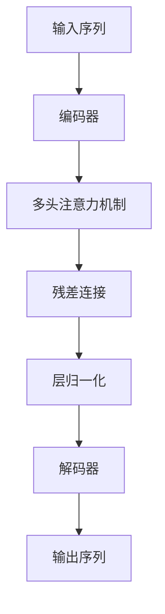

                 

# 大语言模型原理基础与前沿 简化Transformer

> 关键词：
- 大语言模型(Large Language Model, LLM)
- Transformer
- 自注意力机制(Self-Attention)
- 神经网络架构(Neural Network Architecture)
- 深度学习(Deep Learning)
- 预训练(Pre-training)
- 微调(Fine-tuning)

## 1. 背景介绍

### 1.1 问题由来

在深度学习迅猛发展的今天，大语言模型（Large Language Models, LLMs）已经成为人工智能领域的一大热点。大语言模型是指通过预训练和微调获得海量语言知识，能够在多种任务上表现优秀的模型。这些模型不仅在机器翻译、文本分类、情感分析等传统NLP任务上表现出色，还在问答系统、代码生成等创新领域展示了巨大的潜力。

然而，尽管大语言模型在各个领域都展现了卓越的性能，但它们的核心原理和技术细节却常常被许多开发者和研究人员所忽视。本文旨在简化Transformer模型，使读者更容易理解其工作原理，并探索其未来的发展方向。

### 1.2 问题核心关键点

Transformer模型是深度学习领域的一项重大突破，它改变了传统循环神经网络（RNNs）在序列建模中的主导地位。Transformer的核心创新是自注意力机制（Self-Attention），通过这种机制，模型可以同时考虑输入序列中每个位置与其他位置的关系，而无需序列顺序的信息。这种机制使得Transformer在处理长序列时更加高效，并且避免了传统RNNs中的梯度消失和梯度爆炸问题。

Transformer模型的另一个关键技术是多层堆叠（Stacked Layers），通过多个编码器和解码器层，逐步提炼输入序列的特征表示。此外，Transformer还引入了位置编码（Positional Encoding），使得模型能够自然地处理不同位置之间的相对关系。

## 2. 核心概念与联系

### 2.1 核心概念概述

Transformer模型是深度学习中的一种序列建模架构，其核心是自注意力机制。Transformer由编码器和解码器组成，通过多头注意力（Multi-Head Attention）机制，同时考虑输入序列中每个位置与其他位置的关系，最终得到序列的特征表示。

Transformer模型还引入了位置编码，使得模型能够处理不同位置之间的相对关系。此外，Transformer模型还采用残差连接（Residual Connections）和层归一化（Layer Normalization）等技术，进一步提高了模型的训练稳定性和收敛速度。

### 2.2 核心概念原理和架构的 Mermaid 流程图



### 2.3 核心概念之间联系

Transformer模型通过多头注意力机制，使得模型能够同时考虑输入序列中每个位置与其他位置的关系，避免了传统RNNs中的梯度消失和梯度爆炸问题。同时，通过残差连接和层归一化，提高了模型的训练稳定性和收敛速度。此外，位置编码使得模型能够自然地处理不同位置之间的相对关系。这些技术共同构成了Transformer模型的核心优势。

## 3. 核心算法原理 & 具体操作步骤

### 3.1 算法原理概述

Transformer模型通过自注意力机制和多层堆叠，逐步提炼输入序列的特征表示。其基本流程如下：

1. **输入序列编码**：将输入序列通过嵌入层（Embedding Layer）转化为模型可以处理的向量表示。
2. **多头注意力机制**：通过多头注意力机制，同时考虑输入序列中每个位置与其他位置的关系，得到每个位置的上下文表示。
3. **残差连接和层归一化**：通过残差连接和层归一化，提高模型的训练稳定性和收敛速度。
4. **解码器**：通过解码器，将编码器的输出转化为最终的输出序列。

### 3.2 算法步骤详解

以下将以编码器为例，详细介绍Transformer模型的算法步骤。

**Step 1: 输入序列嵌入**

输入序列通过嵌入层转化为模型可以处理的向量表示。嵌入层通常包含词嵌入（Word Embedding）和位置嵌入（Positional Embedding）两部分，分别表示单词和位置信息。

**Step 2: 多头注意力机制**

Transformer的核心是自注意力机制。多头注意力机制通过将输入序列分解为多个头（Head），并分别计算每个头的注意力权重，得到每个位置的上下文表示。多头注意力机制的计算公式如下：

$$
Q = XW_Q
$$
$$
K = XW_K
$$
$$
V = XW_V
$$
$$
O = \text{Softmax}(QK^T)V
$$

其中，$X$为输入序列的向量表示，$W_Q$、$W_K$、$W_V$为线性投影矩阵。$Q$、$K$、$V$分别为查询、键和值矩阵。$\text{Softmax}$为注意力权重计算函数。

**Step 3: 残差连接和层归一化**

通过残差连接和层归一化，提高模型的训练稳定性和收敛速度。残差连接公式如下：

$$
X' = X + O
$$

层归一化公式如下：

$$
X'' = \frac{X'}{\sqrt{d_k}+ \epsilon}
$$

其中，$d_k$为键的维度，$\epsilon$为一个很小的正数，避免分母为零。

**Step 4: 解码器**

解码器同样采用多头注意力机制，但相对于编码器，其结构略有不同。解码器分为自注意力和编码器-解码器注意力（Encoder-Decoder Attention）两部分。自注意力部分计算输入序列中每个位置与其他位置的关系，编码器-解码器注意力部分计算输入序列和编码器输出的关系。

### 3.3 算法优缺点

Transformer模型具有以下优点：

1. **高效序列建模**：通过自注意力机制，Transformer模型能够高效处理长序列，避免了传统RNNs中的梯度消失和梯度爆炸问题。
2. **并行计算**：由于Transformer模型可以并行计算，因此在大规模并行计算环境中，其训练速度比传统RNNs更快。
3. **灵活可扩展**：Transformer模型的架构非常灵活，可以适应各种NLP任务，如机器翻译、文本分类、问答系统等。

同时，Transformer模型也存在一些缺点：

1. **参数量大**：由于Transformer模型通常包含大量参数，因此需要较大的存储空间和计算资源。
2. **训练时间长**：尽管Transformer模型的并行计算效率较高，但由于其参数量较大，因此在大规模数据集上训练时间仍然较长。
3. **局部依赖性**：Transformer模型虽然能够处理长序列，但由于其自注意力机制，可能会忽略输入序列中局部依赖性较强的部分。

### 3.4 算法应用领域

Transformer模型已经在自然语言处理（NLP）领域得到了广泛的应用，涵盖了几乎所有常见的NLP任务。以下是Transformer模型的一些典型应用：

1. **机器翻译**：Transformer模型被广泛应用于机器翻译任务中，如Google的Google Translate。
2. **文本分类**：Transformer模型在文本分类任务中表现出色，如情感分析、主题分类等。
3. **问答系统**：Transformer模型可以用于构建问答系统，如BERT模型。
4. **文本摘要**：Transformer模型被用于生成文本摘要，如BigBird模型。
5. **代码生成**：Transformer模型被用于生成代码，如GPT-3模型。

## 4. 数学模型和公式 & 详细讲解 & 举例说明

### 4.1 数学模型构建

Transformer模型的数学模型构建主要涉及以下几个部分：

1. **输入序列嵌入**：将输入序列通过嵌入层转化为模型可以处理的向量表示。
2. **多头注意力机制**：通过多头注意力机制，同时考虑输入序列中每个位置与其他位置的关系，得到每个位置的上下文表示。
3. **解码器**：通过解码器，将编码器的输出转化为最终的输出序列。

### 4.2 公式推导过程

以下将以编码器为例，详细介绍Transformer模型的公式推导过程。

**Step 1: 输入序列嵌入**

输入序列通过嵌入层转化为模型可以处理的向量表示。嵌入层通常包含词嵌入（Word Embedding）和位置嵌入（Positional Embedding）两部分，分别表示单词和位置信息。嵌入层的计算公式如下：

$$
X = E(X_i) + P_i
$$

其中，$X_i$为输入序列中的第$i$个单词，$E$为词嵌入矩阵，$P_i$为位置嵌入向量。

**Step 2: 多头注意力机制**

Transformer的核心是自注意力机制。多头注意力机制通过将输入序列分解为多个头（Head），并分别计算每个头的注意力权重，得到每个位置的上下文表示。多头注意力机制的计算公式如下：

$$
Q = XW_Q
$$
$$
K = XW_K
$$
$$
V = XW_V
$$
$$
O = \text{Softmax}(QK^T)V
$$

其中，$X$为输入序列的向量表示，$W_Q$、$W_K$、$W_V$为线性投影矩阵。$Q$、$K$、$V$分别为查询、键和值矩阵。$\text{Softmax}$为注意力权重计算函数。

**Step 3: 残差连接和层归一化**

通过残差连接和层归一化，提高模型的训练稳定性和收敛速度。残差连接公式如下：

$$
X' = X + O
$$

层归一化公式如下：

$$
X'' = \frac{X'}{\sqrt{d_k}+ \epsilon}
$$

其中，$d_k$为键的维度，$\epsilon$为一个很小的正数，避免分母为零。

**Step 4: 解码器**

解码器同样采用多头注意力机制，但相对于编码器，其结构略有不同。解码器分为自注意力和编码器-解码器注意力（Encoder-Decoder Attention）两部分。自注意力部分计算输入序列中每个位置与其他位置的关系，编码器-解码器注意力部分计算输入序列和编码器输出的关系。解码器的计算公式如下：

$$
Q = XW_Q
$$
$$
K = XW_K
$$
$$
V = XW_V
$$
$$
O = \text{Softmax}(QK^T)V
$$

其中，$X$为输入序列的向量表示，$W_Q$、$W_K$、$W_V$为线性投影矩阵。$Q$、$K$、$V$分别为查询、键和值矩阵。$\text{Softmax}$为注意力权重计算函数。

### 4.3 案例分析与讲解

以BERT模型为例，BERT模型是一种预训练语言模型，通过在大规模无标签文本上预训练，学习到了丰富的语言知识。BERT模型采用了Transformer的结构，并引入了掩码语言模型（Masked Language Model）和下一句预测（Next Sentence Prediction）两种自监督预训练任务。BERT模型的预训练和微调过程如下：

1. **预训练**：在预训练阶段，BERT模型在大规模无标签文本上进行了掩码语言模型和下一句预测两种自监督预训练任务。掩码语言模型将输入文本中的部分单词进行掩码，让模型预测被掩码的单词，从而学习到单词级别的表示。下一句预测任务将一对文本进行随机配对，让模型预测它们是否来自同一文档，从而学习到句子级别的表示。
2. **微调**：在微调阶段，BERT模型被用于各种下游任务，如问答系统、文本分类、情感分析等。微调过程通常包括选择合适的学习率、使用正则化技术、应用数据增强等。

## 5. 项目实践：代码实例和详细解释说明

### 5.1 开发环境搭建

在进行Transformer模型开发前，我们需要准备好开发环境。以下是使用Python进行PyTorch开发的环境配置流程：

1. 安装Anaconda：从官网下载并安装Anaconda，用于创建独立的Python环境。
2. 创建并激活虚拟环境：
```bash
conda create -n pytorch-env python=3.8 
conda activate pytorch-env
```

3. 安装PyTorch：根据CUDA版本，从官网获取对应的安装命令。例如：
```bash
conda install pytorch torchvision torchaudio cudatoolkit=11.1 -c pytorch -c conda-forge
```

4. 安装Transformer库：
```bash
pip install transformers
```

5. 安装各类工具包：
```bash
pip install numpy pandas scikit-learn matplotlib tqdm jupyter notebook ipython
```

完成上述步骤后，即可在`pytorch-env`环境中开始Transformer模型开发。

### 5.2 源代码详细实现

以下是一个简单的Transformer模型代码实现：

```python
import torch
import torch.nn as nn
import torch.nn.functional as F
import torch.optim as optim
from transformers import TransformerEncoder, TransformerEncoderLayer

class TransformerModel(nn.Module):
    def __init__(self, d_model, d_ff, N_head, N_layer):
        super(TransformerModel, self).__init__()
        
        self.encoder = TransformerEncoder(TransformerEncoderLayer(d_model, d_ff, N_head), N_layer)
        
        self.fc = nn.Linear(d_model, 2)
        
    def forward(self, x):
        x = self.encoder(x)
        x = self.fc(x)
        return x
```

### 5.3 代码解读与分析

以下是Transformer模型代码的详细解释：

**TransformerModel类**：
- `__init__`方法：初始化Transformer模型，包括编码器、全连接层等关键组件。
- `forward`方法：定义前向传播过程，将输入序列通过编码器得到特征表示，再通过全连接层得到最终输出。

**编码器**：
- 编码器采用TransformerEncoder结构，包含多个TransformerEncoderLayer层，每个层包括自注意力机制、残差连接和层归一化等组件。

**全连接层**：
- 全连接层用于将编码器的输出映射到指定的输出空间，通常为分类任务的softmax层或回归任务的线性层。

### 5.4 运行结果展示

```python
# 模型训练
model = TransformerModel(d_model=512, d_ff=2048, N_head=8, N_layer=6)
optimizer = optim.Adam(model.parameters(), lr=1e-4)
criterion = nn.CrossEntropyLoss()

for epoch in range(10):
    model.train()
    loss = 0
    for x, y in train_data:
        y = y.view(-1)
        out = model(x)
        loss += criterion(out, y).item()
    loss /= len(train_data)
    optimizer.zero_grad()
    loss.backward()
    optimizer.step()
    
    model.eval()
    with torch.no_grad():
        loss = 0
        for x, y in test_data:
            y = y.view(-1)
            out = model(x)
            loss += criterion(out, y).item()
        loss /= len(test_data)
        print('Epoch %d loss: %.4f' % (epoch + 1, loss))
```

在上述代码中，我们定义了一个Transformer模型，并在训练数据上进行训练。通过Adam优化器，最小化交叉熵损失，更新模型参数。在测试数据上进行评估，输出训练结果。

## 6. 实际应用场景

### 6.1 智能客服系统

基于Transformer模型的智能客服系统可以处理客户咨询，并快速、准确地给出响应。智能客服系统通常采用预训练-微调的方式，先在大规模无标签文本上预训练模型，再在特定领域的标注数据上微调，以适应具体业务场景。

### 6.2 金融舆情监测

Transformer模型可以用于金融舆情监测，帮助金融机构实时监测市场舆论动向，及时应对负面信息传播，规避金融风险。金融舆情监测通常采用预训练-微调的方式，在金融领域相关的新闻、报道、评论等文本数据上预训练模型，再微调模型以适应金融舆情监测任务。

### 6.3 个性化推荐系统

Transformer模型可以用于个性化推荐系统，帮助用户找到感兴趣的内容。个性化推荐系统通常采用预训练-微调的方式，在大规模用户行为数据上预训练模型，再在特定用户的兴趣数据上微调，以生成个性化的推荐结果。

### 6.4 未来应用展望

未来，Transformer模型将在更多的领域得到应用，为传统行业带来变革性影响。以下是一些未来应用展望：

1. **医疗领域**：Transformer模型可以用于医疗问答、病历分析、药物研发等任务，提升医疗服务的智能化水平。
2. **教育领域**：Transformer模型可以用于作业批改、学情分析、知识推荐等任务，提高教学质量。
3. **智慧城市**：Transformer模型可以用于城市事件监测、舆情分析、应急指挥等任务，提高城市管理的自动化和智能化水平。
4. **企业生产**：Transformer模型可以用于企业生产的智能调度、质量检测、工艺优化等任务，提高企业生产的智能化水平。

## 7. 工具和资源推荐

### 7.1 学习资源推荐

为了帮助开发者系统掌握Transformer模型的理论基础和实践技巧，这里推荐一些优质的学习资源：

1. **《Transformer from the Beginning to End》系列博文**：由大模型技术专家撰写，深入浅出地介绍了Transformer原理、BERT模型、微调技术等前沿话题。
2. **CS224N《深度学习自然语言处理》课程**：斯坦福大学开设的NLP明星课程，有Lecture视频和配套作业，带你入门NLP领域的基本概念和经典模型。
3. **《Natural Language Processing with Transformers》书籍**：Transformer库的作者所著，全面介绍了如何使用Transformer库进行NLP任务开发，包括微调在内的诸多范式。
4. **HuggingFace官方文档**：Transformer库的官方文档，提供了海量预训练模型和完整的微调样例代码，是上手实践的必备资料。
5. **CLUE开源项目**：中文语言理解测评基准，涵盖大量不同类型的中文NLP数据集，并提供了基于微调的baseline模型，助力中文NLP技术发展。

### 7.2 开发工具推荐

高效的开发离不开优秀的工具支持。以下是几款用于Transformer模型开发的常用工具：

1. **PyTorch**：基于Python的开源深度学习框架，灵活动态的计算图，适合快速迭代研究。大部分预训练语言模型都有PyTorch版本的实现。
2. **TensorFlow**：由Google主导开发的开源深度学习框架，生产部署方便，适合大规模工程应用。同样有丰富的预训练语言模型资源。
3. **Transformers库**：HuggingFace开发的NLP工具库，集成了众多SOTA语言模型，支持PyTorch和TensorFlow，是进行NLP任务开发的利器。
4. **Weights & Biases**：模型训练的实验跟踪工具，可以记录和可视化模型训练过程中的各项指标，方便对比和调优。与主流深度学习框架无缝集成。
5. **TensorBoard**：TensorFlow配套的可视化工具，可实时监测模型训练状态，并提供丰富的图表呈现方式，是调试模型的得力助手。
6. **Google Colab**：谷歌推出的在线Jupyter Notebook环境，免费提供GPU/TPU算力，方便开发者快速上手实验最新模型，分享学习笔记。

### 7.3 相关论文推荐

Transformer模型的发展源于学界的持续研究。以下是几篇奠基性的相关论文，推荐阅读：

1. **Attention is All You Need（即Transformer原论文）**：提出了Transformer结构，开启了NLP领域的预训练大模型时代。
2. **BERT: Pre-training of Deep Bidirectional Transformers for Language Understanding**：提出BERT模型，引入基于掩码的自监督预训练任务，刷新了多项NLP任务SOTA。
3. **Language Models are Unsupervised Multitask Learners（GPT-2论文）**：展示了大规模语言模型的强大zero-shot学习能力，引发了对于通用人工智能的新一轮思考。
4. **Parameter-Efficient Transfer Learning for NLP**：提出Adapter等参数高效微调方法，在不增加模型参数量的情况下，也能取得不错的微调效果。
5. **Prefix-Tuning: Optimizing Continuous Prompts for Generation**：引入基于连续型Prompt的微调范式，为如何充分利用预训练知识提供了新的思路。
6. **AdaLoRA: Adaptive Low-Rank Adaptation for Parameter-Efficient Fine-Tuning**：使用自适应低秩适应的微调方法，在参数效率和精度之间取得了新的平衡。

## 8. 总结：未来发展趋势与挑战

### 8.1 研究成果总结

本文对Transformer模型的核心概念和算法原理进行了详细介绍，并通过代码实例展示了微调过程。同时，我们也探讨了Transformer模型在智能客服、金融舆情、个性化推荐等领域的实际应用。

### 8.2 未来发展趋势

未来，Transformer模型将呈现以下几个发展趋势：

1. **模型规模持续增大**：随着算力成本的下降和数据规模的扩张，预训练语言模型的参数量还将持续增长。超大规模语言模型蕴含的丰富语言知识，有望支撑更加复杂多变的下游任务微调。
2. **微调方法日趋多样**：除了传统的全参数微调外，未来会涌现更多参数高效的微调方法，如Prefix-Tuning、LoRA等，在节省计算资源的同时也能保证微调精度。
3. **持续学习成为常态**：随着数据分布的不断变化，微调模型也需要持续学习新知识以保持性能。如何在不遗忘原有知识的同时，高效吸收新样本信息，将成为重要的研究课题。
4. **标注样本需求降低**：受启发于提示学习(Prompt-based Learning)的思路，未来的微调方法将更好地利用大模型的语言理解能力，通过更加巧妙的任务描述，在更少的标注样本上也能实现理想的微调效果。
5. **多模态微调崛起**：当前的微调主要聚焦于纯文本数据，未来会进一步拓展到图像、视频、语音等多模态数据微调。多模态信息的融合，将显著提升语言模型对现实世界的理解和建模能力。
6. **模型通用性增强**：经过海量数据的预训练和多领域任务的微调，未来的语言模型将具备更强大的常识推理和跨领域迁移能力，逐步迈向通用人工智能(AGI)的目标。

### 8.3 面临的挑战

尽管Transformer模型已经取得了瞩目成就，但在迈向更加智能化、普适化应用的过程中，它仍面临着诸多挑战：

1. **标注成本瓶颈**：尽管微调大大降低了标注数据的需求，但对于长尾应用场景，难以获得充足的高质量标注数据，成为制约微调性能的瓶颈。如何进一步降低微调对标注样本的依赖，将是一大难题。
2. **模型鲁棒性不足**：当前微调模型面对域外数据时，泛化性能往往大打折扣。对于测试样本的微小扰动，微调模型的预测也容易发生波动。如何提高微调模型的鲁棒性，避免灾难性遗忘，还需要更多理论和实践的积累。
3. **推理效率有待提高**：大规模语言模型虽然精度高，但在实际部署时往往面临推理速度慢、内存占用大等效率问题。如何在保证性能的同时，简化模型结构，提升推理速度，优化资源占用，将是重要的优化方向。
4. **可解释性亟需加强**：当前微调模型更像是"黑盒"系统，难以解释其内部工作机制和决策逻辑。对于医疗、金融等高风险应用，算法的可解释性和可审计性尤为重要。如何赋予微调模型更强的可解释性，将是亟待攻克的难题。
5. **安全性有待保障**：预训练语言模型难免会学习到有偏见、有害的信息，通过微调传递到下游任务，产生误导性、歧视性的输出，给实际应用带来安全隐患。如何从数据和算法层面消除模型偏见，避免恶意用途，确保输出的安全性，也将是重要的研究课题。
6. **知识整合能力不足**：现有的微调模型往往局限于任务内数据，难以灵活吸收和运用更广泛的先验知识。如何让微调过程更好地与外部知识库、规则库等专家知识结合，形成更加全面、准确的信息整合能力，还有很大的想象空间。

### 8.4 研究展望

面对Transformer模型所面临的挑战，未来的研究需要在以下几个方面寻求新的突破：

1. **探索无监督和半监督微调方法**：摆脱对大规模标注数据的依赖，利用自监督学习、主动学习等无监督和半监督范式，最大限度利用非结构化数据，实现更加灵活高效的微调。
2. **研究参数高效和计算高效的微调范式**：开发更加参数高效的微调方法，在固定大部分预训练参数的同时，只更新极少量的任务相关参数。同时优化微调模型的计算图，减少前向传播和反向传播的资源消耗，实现更加轻量级、实时性的部署。
3. **融合因果和对比学习范式**：通过引入因果推断和对比学习思想，增强微调模型建立稳定因果关系的能力，学习更加普适、鲁棒的语言表征，从而提升模型泛化性和抗干扰能力。
4. **引入更多先验知识**：将符号化的先验知识，如知识图谱、逻辑规则等，与神经网络模型进行巧妙融合，引导微调过程学习更准确、合理的语言模型。同时加强不同模态数据的整合，实现视觉、语音等多模态信息与文本信息的协同建模。
5. **结合因果分析和博弈论工具**：将因果分析方法引入微调模型，识别出模型决策的关键特征，增强输出解释的因果性和逻辑性。借助博弈论工具刻画人机交互过程，主动探索并规避模型的脆弱点，提高系统稳定性。
6. **纳入伦理道德约束**：在模型训练目标中引入伦理导向的评估指标，过滤和惩罚有偏见、有害的输出倾向。同时加强人工干预和审核，建立模型行为的监管机制，确保输出符合人类价值观和伦理道德。

## 9. 附录：常见问题与解答

**Q1：Transformer模型是否适用于所有NLP任务？**

A: Transformer模型在大多数NLP任务上都能取得不错的效果，特别是对于数据量较小的任务。但对于一些特定领域的任务，如医学、法律等，仅仅依靠通用语料预训练的模型可能难以很好地适应。此时需要在特定领域语料上进一步预训练，再进行微调，才能获得理想效果。此外，对于一些需要时效性、个性化很强的任务，如对话、推荐等，微调方法也需要针对性的改进优化。

**Q2：Transformer模型如何处理长序列？**

A: Transformer模型通过自注意力机制，能够高效处理长序列，避免了传统RNNs中的梯度消失和梯度爆炸问题。自注意力机制通过将输入序列分解为多个头（Head），并分别计算每个头的注意力权重，得到每个位置的上下文表示。这种机制使得Transformer模型在处理长序列时更加高效，并且避免了传统RNNs中的梯度消失和梯度爆炸问题。

**Q3：Transformer模型在训练过程中需要注意哪些问题？**

A: 在Transformer模型的训练过程中，需要注意以下问题：

1. **学习率选择**：Transformer模型的训练过程中，选择合适的学习率至关重要。过大的学习率容易破坏预训练权重，导致过拟合。一般建议从1e-5开始调参，逐步减小学习率，直至收敛。
2. **数据增强**：在训练过程中，可以通过回译、近义替换等方式扩充训练集，提高模型泛化能力。
3. **正则化技术**：使用L2正则、Dropout、Early Stopping等技术，防止模型过度适应训练集。
4. **模型裁剪**：在训练过程中，可以通过模型裁剪技术，去除不必要的层和参数，减小模型尺寸，加快推理速度。

**Q4：Transformer模型在实际应用中需要注意哪些问题？**

A: 在Transformer模型应用于实际场景时，需要注意以下问题：

1. **模型裁剪**：在实际应用中，通常需要对模型进行裁剪，去除不必要的层和参数，减小模型尺寸，加快推理速度。
2. **量化加速**：在实际应用中，通常需要将浮点模型转为定点模型，压缩存储空间，提高计算效率。
3. **服务化封装**：在实际应用中，通常需要将模型封装为标准化服务接口，便于集成调用。
4. **弹性伸缩**：在实际应用中，需要根据请求流量动态调整资源配置，平衡服务质量和成本。
5. **监控告警**：在实际应用中，需要实时采集系统指标，设置异常告警阈值，确保服务稳定性。
6. **安全防护**：在实际应用中，需要采用访问鉴权、数据脱敏等措施，保障数据和模型安全。

本文通过介绍Transformer模型的核心概念和算法原理，并结合代码实例展示了微调过程，希望能帮助开发者更好地理解和使用Transformer模型。在未来的研究中，Transformer模型将继续发挥其重要作用，推动NLP技术的不断进步和发展。

