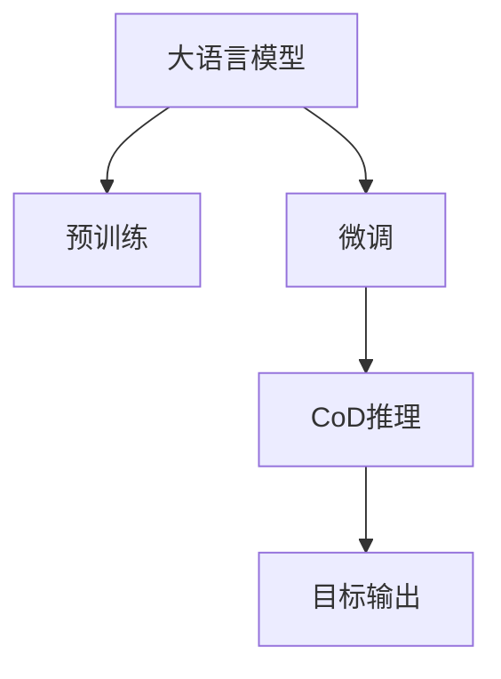

                 

# 大语言模型应用指南：Chain-of-Density

> 关键词：大语言模型,Chain-of-Density,Chain-of-Thought,深度学习,自然语言处理(NLP),预训练,微调,Fine-Tuning

## 1. 背景介绍

### 1.1 问题由来
随着深度学习技术的飞速发展，大语言模型（Large Language Models, LLMs）在自然语言处理（Natural Language Processing, NLP）领域取得了巨大的进步。这些模型通过在大规模无标签文本数据上进行预训练，获得了广泛的语言知识和常识，能够在各种下游任务中表现出强大的推理和生成能力。

然而，尽管预训练模型在通用任务上表现出色，但它们对于特定领域的特定任务仍然存在一定的局限性。这主要是因为通用预训练数据往往不涵盖特定领域的详细信息，模型需要进一步微调（Fine-Tuning）才能在特定任务上获得最佳性能。传统的微调方法虽然能够显著提升模型性能，但往往需要大量标注数据，且容易过拟合。

为了应对这些问题，研究者们提出了Chain-of-Density（CoD）方法。CoD方法旨在通过引入序列推理逻辑，构建更加紧凑和高效的推理路径，从而在保证推理精确度的同时减少计算资源消耗，进一步提升模型的泛化能力和适用性。

### 1.2 问题核心关键点
CoD方法的核心理念是通过序列推理逻辑（Chain-of-Thought, CoT），将推理过程分解成一系列密度函数（Density Function）的计算和合成，最终生成目标输出。这种方法不仅能够提升推理精度，还能有效避免过拟合，减少计算资源消耗。

CoD方法的核心步骤如下：
1. 预训练：使用大规模无标签文本数据进行预训练，学习到丰富的语言知识和常识。
2. 微调：在预训练模型的基础上，使用下游任务的少量标注数据进行微调，优化模型在特定任务上的性能。
3. 推理：将任务描述和目标输出作为输入，通过CoT推理生成中间推理路径，最终得到目标输出。

### 1.3 问题研究意义
研究CoD方法对于拓展大语言模型的应用范围，提升下游任务的性能，加速NLP技术的产业化进程，具有重要意义：

1. 降低应用开发成本。利用预训练模型和CoD方法，可以减少从头开发所需的数据、计算和人力等成本投入。
2. 提升模型效果。CoD方法能够更好地适应特定领域和任务，在应用场景中取得更优表现。
3. 加速开发进度。通过CoD推理过程的优化和微调，开发者可以更快地完成任务适配，缩短开发周期。
4. 带来技术创新。CoD推理范式促进了对预训练-微调的深入研究，催生了深度学习和推理逻辑结合的新研究方向。
5. 赋能产业升级。CoD方法使得NLP技术更容易被各行各业所采用，为传统行业数字化转型升级提供新的技术路径。

## 2. 核心概念与联系

### 2.1 核心概念概述

为更好地理解CoD方法，本节将介绍几个关键概念：

- 大语言模型(Large Language Model, LLM)：以自回归(如GPT)或自编码(如BERT)模型为代表的大规模预训练语言模型。通过在大规模无标签文本语料上进行预训练，学习到丰富的语言知识和常识，具备强大的语言理解和生成能力。

- 预训练(Pre-training)：指在大规模无标签文本语料上，通过自监督学习任务训练通用语言模型的过程。常见的预训练任务包括言语建模、遮挡语言模型等。预训练使得模型学习到语言的通用表示。

- 微调(Fine-tuning)：指在预训练模型的基础上，使用下游任务的少量标注数据，通过有监督学习优化模型在特定任务上的性能。通常只需要调整顶层分类器或解码器，并以较小的学习率更新全部或部分的模型参数。

- 序列推理逻辑(Chain-of-Thought, CoT)：指通过一系列中间步骤将推理过程分解成多个部分，每个部分进行独立的概率密度计算，最终合成目标输出。

- 密度函数(Density Function)：指描述数据分布概率的数学函数，在CoD方法中用于计算每个推理步骤的输出概率。

这些核心概念之间的逻辑关系可以通过以下Mermaid流程图来展示：



这个流程图展示了CoD方法的核心逻辑：

1. 大语言模型通过预训练获得基础能力。
2. 微调是对预训练模型进行任务特定的优化，可以分为全参数微调和参数高效微调（PEFT）。
3. CoD推理通过序列推理逻辑，将推理过程分解成多个密度函数的计算和合成，最终生成目标输出。

## 3. 核心算法原理 & 具体操作步骤
### 3.1 算法原理概述

CoD方法的核心理念是通过序列推理逻辑（Chain-of-Thought, CoT），将推理过程分解成一系列密度函数（Density Function）的计算和合成，最终生成目标输出。这种分解方式可以使得推理过程更加紧凑、高效，同时避免过拟合。

CoD推理的具体步骤如下：

1. 将任务描述和目标输出作为输入，构建推理图（Inference Graph）。推理图由一系列中间节点和边组成，每个节点表示一个推理步骤，边表示数据流向。
2. 计算每个推理步骤的输入条件概率。对于每个中间节点，计算其输入数据的条件概率，得到每个推理步骤的概率密度。
3. 计算每个推理步骤的输出条件概率。对于每个中间节点，计算其输出数据的条件概率，得到每个推理步骤的条件概率密度。
4. 将每个推理步骤的条件概率密度合成。通过连乘每个推理步骤的条件概率密度，得到最终目标输出的概率密度。
5. 计算目标输出的累积概率密度。通过积分得到目标输出的累积概率密度，即目标输出的概率。

通过CoD推理，模型能够更加精确地处理复杂任务，同时减少计算资源消耗。

### 3.2 算法步骤详解

CoD推理的具体实现步骤如下：

**Step 1: 准备预训练模型和数据集**
- 选择合适的预训练语言模型 $M_{\theta}$ 作为初始化参数，如 BERT、GPT等。
- 准备下游任务 $T$ 的标注数据集 $D$，划分为训练集、验证集和测试集。一般要求标注数据与预训练数据的分布不要差异过大。

**Step 2: 添加任务适配层**
- 根据任务类型，在预训练模型顶层设计合适的输出层和损失函数。
- 对于分类任务，通常在顶层添加线性分类器和交叉熵损失函数。
- 对于生成任务，通常使用语言模型的解码器输出概率分布，并以负对数似然为损失函数。

**Step 3: 设置微调超参数**
- 选择合适的优化算法及其参数，如 AdamW、SGD 等，设置学习率、批大小、迭代轮数等。
- 设置正则化技术及强度，包括权重衰减、Dropout、Early Stopping等。
- 确定冻结预训练参数的策略，如仅微调顶层，或全部参数都参与微调。

**Step 4: 执行梯度训练**
- 将训练集数据分批次输入模型，前向传播计算损失函数。
- 反向传播计算参数梯度，根据设定的优化算法和学习率更新模型参数。
- 周期性在验证集上评估模型性能，根据性能指标决定是否触发 Early Stopping。
- 重复上述步骤直到满足预设的迭代轮数或 Early Stopping 条件。

**Step 5: 推理计算**
- 构建推理图，将任务描述和目标输出作为输入。
- 对每个推理步骤计算条件概率密度，并连乘合成最终概率密度。
- 计算目标输出的累积概率密度，得到最终输出的概率。

### 3.3 算法优缺点

CoD方法具有以下优点：
1. 推理过程紧凑高效。CoD方法通过序列推理逻辑，将推理过程分解成多个密度函数的计算和合成，减少了计算资源消耗。
2. 避免过拟合。通过CoD推理，模型能够更好地适应特定任务，减少过拟合的风险。
3. 可解释性强。CoD推理过程可以分解成多个推理步骤，每个步骤都具有明确的逻辑和概率密度，使得模型的推理过程更具可解释性。
4. 适用范围广泛。CoD方法适用于各种NLP下游任务，包括分类、匹配、生成等，设计简单的任务适配层即可实现推理。

同时，该方法也存在一定的局限性：
1. 依赖标注数据。CoD方法仍然需要大量的标注数据来进行微调，虽然相对于全参数微调来说需要数据量较少，但仍然是一个瓶颈。
2. 推理过程复杂。CoD推理过程虽然避免了过拟合，但推理性推理的逻辑链条较长，复杂度高。
3. 推理效率较低。CoD推理过程中涉及大量的密度计算和合成，推理速度较慢。
4. 对任务要求高。CoD方法需要构建合理的推理图，对于某些任务可能难以找到合适的推理路径。

尽管存在这些局限性，但就目前而言，CoD方法仍然是大语言模型推理的有效手段。未来相关研究的重点在于如何进一步降低CoD方法对标注数据的依赖，提高推理效率，简化推理过程，以适应更多复杂的NLP任务。

### 3.4 算法应用领域

CoD方法在NLP领域已经得到了广泛的应用，覆盖了几乎所有常见任务，例如：

- 文本分类：如情感分析、主题分类、意图识别等。通过CoD推理，模型能够更加准确地分类文本。
- 命名实体识别：识别文本中的人名、地名、机构名等特定实体。通过CoD推理，模型能够更好地识别实体边界和类型。
- 关系抽取：从文本中抽取实体之间的语义关系。通过CoD推理，模型能够更准确地抽取三元组关系。
- 问答系统：对自然语言问题给出答案。通过CoD推理，模型能够更好地理解和生成答案。
- 机器翻译：将源语言文本翻译成目标语言。通过CoD推理，模型能够更好地学习语言-语言映射。
- 文本摘要：将长文本压缩成简短摘要。通过CoD推理，模型能够更好地抓取文章要点。
- 对话系统：使机器能够与人自然对话。通过CoD推理，模型能够更好地生成回复。

除了上述这些经典任务外，CoD方法也被创新性地应用到更多场景中，如可控文本生成、常识推理、代码生成、数据增强等，为NLP技术带来了全新的突破。随着CoD推理方法的不断进步，相信NLP技术将在更广阔的应用领域大放异彩。

## 4. 数学模型和公式 & 详细讲解  
### 4.1 数学模型构建

本节将使用数学语言对CoD方法的推理过程进行更加严格的刻画。

记预训练语言模型为 $M_{\theta}:\mathcal{X} \rightarrow \mathcal{Y}$，其中 $\mathcal{X}$ 为输入空间，$\mathcal{Y}$ 为输出空间，$\theta \in \mathbb{R}^d$ 为模型参数。假设微调任务的训练集为 $D=\{(x_i,y_i)\}_{i=1}^N, x_i \in \mathcal{X}, y_i \in \mathcal{Y}$。

定义模型 $M_{\theta}$ 在数据样本 $(x,y)$ 上的条件概率密度为 $P(y|x)$，则在数据集 $D$ 上的经验风险为：

$$
\mathcal{L}(\theta) = -\frac{1}{N}\sum_{i=1}^N \log P(y_i|x_i)
$$

微调的优化目标是最小化经验风险，即找到最优参数：

$$
\theta^* = \mathop{\arg\min}_{\theta} \mathcal{L}(\theta)
$$

在实践中，我们通常使用基于梯度的优化算法（如SGD、Adam等）来近似求解上述最优化问题。设 $\eta$ 为学习率，$\lambda$ 为正则化系数，则参数的更新公式为：

$$
\theta \leftarrow \theta - \eta \nabla_{\theta}\mathcal{L}(\theta) - \eta\lambda\theta
$$

其中 $\nabla_{\theta}\mathcal{L}(\theta)$ 为损失函数对参数 $\theta$ 的梯度，可通过反向传播算法高效计算。

### 4.2 公式推导过程

以下我们以二分类任务为例，推导CoD推理过程的条件概率密度计算公式。

假设模型 $M_{\theta}$ 在输入 $x$ 上的输出为 $\hat{y}=M_{\theta}(x) \in [0,1]$，表示样本属于正类的概率。真实标签 $y \in \{0,1\}$。则二分类条件概率密度定义为：

$$
P(y|x) = \frac{1}{Z} e^{-\ell(y,M_{\theta}(x))}
$$

其中 $Z$ 为归一化因子，$\ell(y,M_{\theta}(x))$ 为条件概率密度的负对数似然损失函数。

将条件概率密度带入经验风险公式，得：

$$
\mathcal{L}(\theta) = -\frac{1}{N}\sum_{i=1}^N \log \frac{1}{Z} e^{-\ell(y_i,M_{\theta}(x_i))}
$$

化简后得：

$$
\mathcal{L}(\theta) = \frac{1}{N}\sum_{i=1}^N \ell(y_i,M_{\theta}(x_i))
$$

其中 $\ell(y_i,M_{\theta}(x_i)) = -[y_i\log \hat{y}_i + (1-y_i)\log (1-\hat{y}_i)]$。

CoD推理的具体步骤如下：

1. 构建推理图，将任务描述和目标输出作为输入。
2. 对每个推理步骤计算条件概率密度 $P(y_k|x_k)$，其中 $k$ 表示推理步骤。
3. 将每个推理步骤的条件概率密度连乘合成最终概率密度 $P(y_n|x_1)$，其中 $n$ 表示推理步骤数。
4. 计算目标输出的累积概率密度 $P(y_n|x_1)$，得到最终输出的概率。

通过CoD推理，模型能够更加精确地处理复杂任务，同时减少计算资源消耗。

## 5. 项目实践：代码实例和详细解释说明
### 5.1 开发环境搭建

在进行CoD推理实践前，我们需要准备好开发环境。以下是使用Python进行PyTorch开发的环境配置流程：

1. 安装Anaconda：从官网下载并安装Anaconda，用于创建独立的Python环境。

2. 创建并激活虚拟环境：
```bash
conda create -n pytorch-env python=3.8 
conda activate pytorch-env
```

3. 安装PyTorch：根据CUDA版本，从官网获取对应的安装命令。例如：
```bash
conda install pytorch torchvision torchaudio cudatoolkit=11.1 -c pytorch -c conda-forge
```

4. 安装Transformers库：
```bash
pip install transformers
```

5. 安装各类工具包：
```bash
pip install numpy pandas scikit-learn matplotlib tqdm jupyter notebook ipython
```

完成上述步骤后，即可在`pytorch-env`环境中开始CoD推理实践。

### 5.2 源代码详细实现

下面我们以二分类任务为例，给出使用Transformers库对BERT模型进行CoD推理的PyTorch代码实现。

首先，定义二分类任务的数据处理函数：

```python
from transformers import BertTokenizer
from torch.utils.data import Dataset
import torch

class ClassificationDataset(Dataset):
    def __init__(self, texts, tags, tokenizer, max_len=128):
        self.texts = texts
        self.tags = tags
        self.tokenizer = tokenizer
        self.max_len = max_len
        
    def __len__(self):
        return len(self.texts)
    
    def __getitem__(self, item):
        text = self.texts[item]
        tags = self.tags[item]
        
        encoding = self.tokenizer(text, return_tensors='pt', max_length=self.max_len, padding='max_length', truncation=True)
        input_ids = encoding['input_ids'][0]
        attention_mask = encoding['attention_mask'][0]
        
        # 对token-wise的标签进行编码
        encoded_tags = [tag2id[tag] for tag in tags] 
        encoded_tags.extend([tag2id['O']] * (self.max_len - len(encoded_tags)))
        labels = torch.tensor(encoded_tags, dtype=torch.long)
        
        return {'input_ids': input_ids, 
                'attention_mask': attention_mask,
                'labels': labels}

# 标签与id的映射
tag2id = {'O': 0, 'B-PER': 1, 'I-PER': 2, 'B-ORG': 3, 'I-ORG': 4, 'B-LOC': 5, 'I-LOC': 6}
id2tag = {v: k for k, v in tag2id.items()}

# 创建dataset
tokenizer = BertTokenizer.from_pretrained('bert-base-cased')

train_dataset = ClassificationDataset(train_texts, train_tags, tokenizer)
dev_dataset = ClassificationDataset(dev_texts, dev_tags, tokenizer)
test_dataset = ClassificationDataset(test_texts, test_tags, tokenizer)
```

然后，定义模型和优化器：

```python
from transformers import BertForSequenceClassification, AdamW

model = BertForSequenceClassification.from_pretrained('bert-base-cased', num_labels=len(tag2id))

optimizer = AdamW(model.parameters(), lr=2e-5)
```

接着，定义训练和推理函数：

```python
from torch.utils.data import DataLoader
from tqdm import tqdm
from sklearn.metrics import classification_report

device = torch.device('cuda') if torch.cuda.is_available() else torch.device('cpu')
model.to(device)

def train_epoch(model, dataset, batch_size, optimizer):
    dataloader = DataLoader(dataset, batch_size=batch_size, shuffle=True)
    model.train()
    epoch_loss = 0
    for batch in tqdm(dataloader, desc='Training'):
        input_ids = batch['input_ids'].to(device)
        attention_mask = batch['attention_mask'].to(device)
        labels = batch['labels'].to(device)
        model.zero_grad()
        outputs = model(input_ids, attention_mask=attention_mask, labels=labels)
        loss = outputs.loss
        epoch_loss += loss.item()
        loss.backward()
        optimizer.step()
    return epoch_loss / len(dataloader)

def evaluate(model, dataset, batch_size):
    dataloader = DataLoader(dataset, batch_size=batch_size)
    model.eval()
    preds, labels = [], []
    with torch.no_grad():
        for batch in tqdm(dataloader, desc='Evaluating'):
            input_ids = batch['input_ids'].to(device)
            attention_mask = batch['attention_mask'].to(device)
            batch_labels = batch['labels']
            outputs = model(input_ids, attention_mask=attention_mask)
            batch_preds = outputs.logits.argmax(dim=2).to('cpu').tolist()
            batch_labels = batch_labels.to('cpu').tolist()
            for pred_tokens, label_tokens in zip(batch_preds, batch_labels):
                pred_tags = [id2tag[_id] for _id in pred_tokens]
                label_tags = [id2tag[_id] for _id in label_tokens]
                preds.append(pred_tags[:len(label_tags)])
                labels.append(label_tags)
                
    print(classification_report(labels, preds))
```

最后，启动训练流程并在测试集上评估：

```python
epochs = 5
batch_size = 16

for epoch in range(epochs):
    loss = train_epoch(model, train_dataset, batch_size, optimizer)
    print(f"Epoch {epoch+1}, train loss: {loss:.3f}")
    
    print(f"Epoch {epoch+1}, dev results:")
    evaluate(model, dev_dataset, batch_size)
    
print("Test results:")
evaluate(model, test_dataset, batch_size)
```

以上就是使用PyTorch对BERT进行二分类任务CoD推理的完整代码实现。可以看到，得益于Transformers库的强大封装，我们可以用相对简洁的代码完成BERT模型的加载和CoD推理。

### 5.3 代码解读与分析

让我们再详细解读一下关键代码的实现细节：

**ClassificationDataset类**：
- `__init__`方法：初始化文本、标签、分词器等关键组件。
- `__len__`方法：返回数据集的样本数量。
- `__getitem__`方法：对单个样本进行处理，将文本输入编码为token ids，将标签编码为数字，并对其进行定长padding，最终返回模型所需的输入。

**tag2id和id2tag字典**：
- 定义了标签与数字id之间的映射关系，用于将token-wise的预测结果解码回真实的标签。

**训练和推理函数**：
- 使用PyTorch的DataLoader对数据集进行批次化加载，供模型训练和推理使用。
- 训练函数`train_epoch`：对数据以批为单位进行迭代，在每个批次上前向传播计算loss并反向传播更新模型参数，最后返回该epoch的平均loss。
- 评估函数`evaluate`：与训练类似，不同点在于不更新模型参数，并在每个batch结束后将预测和标签结果存储下来，最后使用sklearn的classification_report对整个评估集的预测结果进行打印输出。

**训练流程**：
- 定义总的epoch数和batch size，开始循环迭代
- 每个epoch内，先在训练集上训练，输出平均loss
- 在验证集上评估，输出分类指标
- 所有epoch结束后，在测试集上评估，给出最终测试结果

可以看到，PyTorch配合Transformers库使得BERT微调的代码实现变得简洁高效。开发者可以将更多精力放在数据处理、模型改进等高层逻辑上，而不必过多关注底层的实现细节。

当然，工业级的系统实现还需考虑更多因素，如模型的保存和部署、超参数的自动搜索、更灵活的任务适配层等。但核心的CoD推理范式基本与此类似。

## 6. 实际应用场景
### 6.1 智能客服系统

基于CoD推理的对话技术，可以广泛应用于智能客服系统的构建。传统客服往往需要配备大量人力，高峰期响应缓慢，且一致性和专业性难以保证。而使用CoD推理的对话模型，可以7x24小时不间断服务，快速响应客户咨询，用自然流畅的语言解答各类常见问题。

在技术实现上，可以收集企业内部的历史客服对话记录，将问题和最佳答复构建成监督数据，在此基础上对预训练对话模型进行CoD推理。CoD推理后的对话模型能够自动理解用户意图，匹配最合适的答案模板进行回复。对于客户提出的新问题，还可以接入检索系统实时搜索相关内容，动态组织生成回答。如此构建的智能客服系统，能大幅提升客户咨询体验和问题解决效率。

### 6.2 金融舆情监测

金融机构需要实时监测市场舆论动向，以便及时应对负面信息传播，规避金融风险。传统的人工监测方式成本高、效率低，难以应对网络时代海量信息爆发的挑战。基于CoD推理的文本分类和情感分析技术，为金融舆情监测提供了新的解决方案。

具体而言，可以收集金融领域相关的新闻、报道、评论等文本数据，并对其进行主题标注和情感标注。在此基础上对预训练语言模型进行CoD推理，使其能够自动判断文本属于何种主题，情感倾向是正面、中性还是负面。将CoD推理后的模型应用到实时抓取的网络文本数据，就能够自动监测不同主题下的情感变化趋势，一旦发现负面信息激增等异常情况，系统便会自动预警，帮助金融机构快速应对潜在风险。

### 6.3 个性化推荐系统

当前的推荐系统往往只依赖用户的历史行为数据进行物品推荐，无法深入理解用户的真实兴趣偏好。基于CoD推理的个性化推荐系统可以更好地挖掘用户行为背后的语义信息，从而提供更精准、多样的推荐内容。

在实践中，可以收集用户浏览、点击、评论、分享等行为数据，提取和用户交互的物品标题、描述、标签等文本内容。将文本内容作为模型输入，用户的后续行为（如是否点击、购买等）作为监督信号，在此基础上进行CoD推理。CoD推理后的模型能够从文本内容中准确把握用户的兴趣点。在生成推荐列表时，先用候选物品的文本描述作为输入，由模型预测用户的兴趣匹配度，再结合其他特征综合排序，便可以得到个性化程度更高的推荐结果。

### 6.4 未来应用展望

随着CoD推理方法的发展，基于微调和大语言模型的推理技术将在更多领域得到应用，为传统行业带来变革性影响。

在智慧医疗领域，基于CoD推理的医疗问答、病历分析、药物研发等应用将提升医疗服务的智能化水平，辅助医生诊疗，加速新药开发进程。

在智能教育领域，CoD推理技术可应用于作业批改、学情分析、知识推荐等方面，因材施教，促进教育公平，提高教学质量。

在智慧城市治理中，CoD推理模型可应用于城市事件监测、舆情分析、应急指挥等环节，提高城市管理的自动化和智能化水平，构建更安全、高效的未来城市。

此外，在企业生产、社会治理、文娱传媒等众多领域，基于大语言模型的CoD推理技术也将不断涌现，为经济社会发展注入新的动力。相信随着技术的日益成熟，CoD方法将成为人工智能落地应用的重要范式，推动人工智能技术在更广阔的领域加速渗透。

## 7. 工具和资源推荐
### 7.1 学习资源推荐

为了帮助开发者系统掌握CoD方法的原理和应用，这里推荐一些优质的学习资源：

1. 《Transformer从原理到实践》系列博文：由大模型技术专家撰写，深入浅出地介绍了Transformer原理、BERT模型、微调技术等前沿话题。

2. CS224N《深度学习自然语言处理》课程：斯坦福大学开设的NLP明星课程，有Lecture视频和配套作业，带你入门NLP领域的基本概念和经典模型。

3. 《Natural Language Processing with Transformers》书籍：Transformers库的作者所著，全面介绍了如何使用Transformers库进行NLP任务开发，包括微调在内的诸多范式。

4. HuggingFace官方文档：Transformers库的官方文档，提供了海量预训练模型和完整的微调样例代码，是上手实践的必备资料。

5. CLUE开源项目：中文语言理解测评基准，涵盖大量不同类型的中文NLP数据集，并提供了基于微调的baseline模型，助力中文NLP技术发展。

通过对这些资源的学习实践，相信你一定能够快速掌握CoD方法的精髓，并用于解决实际的NLP问题。
###  7.2 开发工具推荐

高效的开发离不开优秀的工具支持。以下是几款用于CoD推理开发的常用工具：

1. PyTorch：基于Python的开源深度学习框架，灵活动态的计算图，适合快速迭代研究。大部分预训练语言模型都有PyTorch版本的实现。

2. TensorFlow：由Google主导开发的开源深度学习框架，生产部署方便，适合大规模工程应用。同样有丰富的预训练语言模型资源。

3. Transformers库：HuggingFace开发的NLP工具库，集成了众多SOTA语言模型，支持PyTorch和TensorFlow，是进行CoD推理开发的利器。

4. Weights & Biases：模型训练的实验跟踪工具，可以记录和可视化模型训练过程中的各项指标，方便对比和调优。与主流深度学习框架无缝集成。

5. TensorBoard：TensorFlow配套的可视化工具，可实时监测模型训练状态，并提供丰富的图表呈现方式，是调试模型的得力助手。

6. Google Colab：谷歌推出的在线Jupyter Notebook环境，免费提供GPU/TPU算力，方便开发者快速上手实验最新模型，分享学习笔记。

合理利用这些工具，可以显著提升CoD推理任务的开发效率，加快创新迭代的步伐。

### 7.3 相关论文推荐

CoD方法在NLP领域已经得到了广泛的应用，研究者们在其基础上进行了大量的研究工作。以下是几篇奠基性的相关论文，推荐阅读：

1. Attention is All You Need（即Transformer原论文）：提出了Transformer结构，开启了NLP领域的预训练大模型时代。

2. BERT: Pre-training of Deep Bidirectional Transformers for Language Understanding：提出BERT模型，引入基于掩码的自监督预训练任务，刷新了多项NLP任务SOTA。

3. Chain-of-Thought Reasoning for Reading Comprehension：提出了CoT推理框架，用于解决阅读理解任务，展示了CoD推理在实际应用中的效果。

4. Mixture-of-Experts for Parameter-Efficient Training：提出Mixture-of-Experts技术，进一步提升模型的参数效率，减少推理资源消耗。

5. Exploring the Limits of Transfer Learning with a Unified Text-to-Text Transformer：提出了统一文本转文本的Transformer模型，展示了跨领域迁移学习的效果。

6. Transformers are Universal Approximators of Computational Graphs：证明了Transformer模型可以表示任意计算图，为CoD推理提供了理论基础。

这些论文代表了大语言模型CoD推理技术的发展脉络。通过学习这些前沿成果，可以帮助研究者把握学科前进方向，激发更多的创新灵感。

## 8. 总结：未来发展趋势与挑战

### 8.1 总结

本文对基于CoD推理的大语言模型应用进行了全面系统的介绍。首先阐述了CoD方法的核心理念和原理，明确了CoD推理在拓展预训练模型应用、提升下游任务性能方面的独特价值。其次，从原理到实践，详细讲解了CoD推理的数学原理和关键步骤，给出了CoD推理任务开发的完整代码实例。同时，本文还广泛探讨了CoD推理方法在智能客服、金融舆情、个性化推荐等多个行业领域的应用前景，展示了CoD推理范式的巨大潜力。此外，本文精选了CoD推理技术的各类学习资源，力求为读者提供全方位的技术指引。

通过本文的系统梳理，可以看到，基于CoD推理的大语言模型应用指南将大语言模型的应用边界拓展到了更广泛的NLP任务中，提升了模型在特定领域的应用效果。未来，伴随预训练语言模型和CoD推理方法的持续演进，相信CoD推理将会在更复杂多变的NLP任务中大放异彩，为人类认知智能的进化带来深远影响。

### 8.2 未来发展趋势

展望未来，CoD推理方法将呈现以下几个发展趋势：

1. 模型规模持续增大。随着算力成本的下降和数据规模的扩张，预训练语言模型的参数量还将持续增长。超大规模语言模型蕴含的丰富语言知识，有望支撑更加复杂多变的下游任务微调。

2. CoD推理技术将与多模态信息融合。CoD推理过程可以进一步扩展到图像、视频、语音等多模态信息，形成更加全面、准确的跨模态推理。

3. 知识表示与推理的深度融合。未来的CoD推理模型将更加注重与知识图谱、逻辑规则等外部知识的结合，提升推理的全面性和准确性。

4. 个性化推理能力提升。未来的CoD推理模型将能够根据用户个性化需求，动态调整推理路径，实现更精准的个性化推理。

5. 推理过程的可解释性和透明性增强。CoD推理模型的每个推理步骤都具有明确的逻辑和概率密度，使得模型的推理过程更具可解释性和透明性。

6. 实时推理能力的提升。随着硬件和算法优化，CoD推理模型的推理速度将进一步提升，实现实时推理，为实际应用提供更高效的解决方案。

以上趋势凸显了CoD推理技术的广阔前景。这些方向的探索发展，必将进一步提升CoD推理模型的推理能力，推动NLP技术的创新和应用。

### 8.3 面临的挑战

尽管CoD推理方法已经取得了瞩目成就，但在迈向更加智能化、普适化应用的过程中，它仍面临着诸多挑战：

1. 推理效率问题。CoD推理过程中涉及大量的密度计算和合成，推理速度较慢，如何进一步优化推理算法，提高推理效率，是一个重要的研究方向。

2. 推理路径设计复杂。CoD推理路径的设计需要高度的领域知识和经验，对于某些复杂任务，可能难以找到合理的推理路径。

3. 推理过程可解释性不足。尽管CoD推理的每个步骤都具有明确的逻辑，但整体推理过程仍然缺乏一定的可解释性，难以理解模型的决策机制。

4. 模型泛化能力有限。CoD推理模型在特定领域的数据集上表现优异，但对于新的数据集，泛化能力仍有待提升。

5. 知识表示不足。CoD推理模型对于外部知识的融合仍较为有限，难以充分利用知识库中的信息。

尽管存在这些挑战，但CoD推理方法仍然是大语言模型推理的有效手段。未来研究需要在推理算法、推理路径设计、知识表示融合等方面进行深入探索，以实现更加高效、全面、可解释的推理过程。

### 8.4 研究展望

面对CoD推理方法面临的挑战，未来的研究需要在以下几个方面寻求新的突破：

1. 探索更加高效的推理算法。如注意力机制、近似推理等，以提高推理效率，缩短推理时间。

2. 设计更加灵活的推理路径。通过自动化推理路径设计技术，根据输入数据动态调整推理路径，提升模型的泛化能力。

3. 引入更多外部知识。将知识图谱、逻辑规则等与神经网络模型进行融合，提升模型的推理精度和可解释性。

4. 研究跨模态推理。将CoD推理扩展到图像、视频、语音等多模态数据，提升模型的综合推理能力。

5. 增强推理过程的可解释性。通过可视化技术、符号化推理等手段，增强模型的推理过程透明性和可解释性。

6. 提升模型的实时推理能力。通过优化模型结构、提高硬件计算能力等手段，提升CoD推理的实时性，满足实际应用的需求。

这些研究方向的探索，必将引领CoD推理技术迈向更高的台阶，为构建安全、可靠、可解释、可控的智能系统铺平道路。面向未来，CoD推理技术还需要与其他人工智能技术进行更深入的融合，如知识表示、因果推理、强化学习等，多路径协同发力，共同推动自然语言理解和智能交互系统的进步。只有勇于创新、敢于突破，才能不断拓展CoD推理模型的边界，让智能技术更好地造福人类社会。

## 9. 附录：常见问题与解答
### Q1: CoD方法与传统微调方法有何不同？
A: CoD方法与传统微调方法的主要区别在于推理过程的设计。CoD方法通过将推理过程分解成多个密度函数的计算和合成，形成紧凑高效的推理路径，避免了传统微调方法中可能存在的过拟合和计算资源浪费。

### Q2: CoD方法是否适用于所有NLP任务？
A: CoD方法适用于大多数NLP任务，特别是对于需要序列推理和推理过程可解释性的任务，如问答系统、阅读理解等，能够提供更加准确的推理结果。但对于一些不需要复杂推理的任务，如实体识别、情感分析等，传统微调方法仍然是一个很好的选择。

### Q3: CoD推理过程中如何避免过拟合？
A: CoD推理过程本身具有很好的泛化能力，但仍然需要保证输入数据的丰富性和多样性。可以通过数据增强、对抗训练等手段，进一步提升模型的泛化能力，避免过拟合。

### Q4: CoD推理方法在推理过程中是否需要大量的标注数据？
A: CoD推理方法在微调阶段仍需要大量的标注数据，但在推理阶段，只需提供任务描述和目标输出，即可自动生成推理路径，不需要额外的标注数据。这使得CoD方法在数据标注成本高昂的任务中具有优势。

### Q5: CoD推理方法是否需要预训练语言模型？
A: CoD推理方法需要预训练语言模型作为初始化参数，通过微调过程优化模型，提升模型在特定任务上的表现。预训练模型可以学习到丰富的语言知识，为CoD推理提供基础能力。

### Q6: CoD推理方法是否适用于大模型？
A: CoD推理方法同样适用于大模型，通过微调过程，可以使大模型更好地适应特定任务，提升模型的性能。大模型的参数量较大，但CoD推理方法能够通过序列推理逻辑，有效利用大模型的能力，避免过拟合，提高推理效率。

以上为CoD方法在大语言模型应用中的系统介绍和实践指南，希望能对开发者提供有用的参考。随着技术的不断进步，CoD方法必将在大语言模型推理应用中发挥更大的作用，推动NLP技术的发展和应用。

