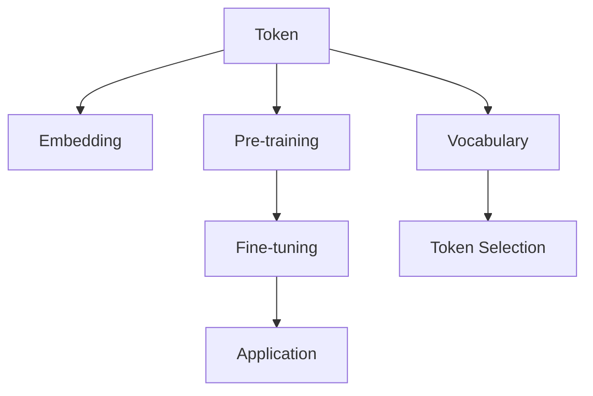

                 

# 大语言模型应用指南：语言模型中的token

## 1. 背景介绍

### 1.1 问题由来

大语言模型（Large Language Models, LLMs）是近年来自然语言处理（NLP）领域的一个重要研究方向，其核心思想是利用大规模无标签文本数据进行自监督预训练，构建起一个具有强大语言表示能力的模型。在此基础上，通过微调（Fine-tuning）等方法，使模型能够适应特定任务，从而在各种NLP任务中取得优异的表现。

然而，在实际应用中，选择合适的token（词汇标记）对于模型性能的提升至关重要。Token是语言模型中最基本的语言单元，其选择和使用方式直接影响到模型的泛化能力和理解能力。在本文中，我们将深入探讨语言模型中token的选择、使用及其对模型性能的影响。

### 1.2 问题核心关键点

在大语言模型的应用中，选择合适的token是一个重要且复杂的决策。正确的token选择不仅可以提升模型的泛化能力，还能增强模型的鲁棒性和稳定性。然而，选择不当的token可能导致模型过拟合、理解能力下降等问题。

本文将重点关注以下几个核心问题：

1. 什么是token？
2. token的选择和设计原则是什么？
3. token对语言模型的影响有哪些？
4. 如何优化token选择以提升模型性能？

通过深入探讨这些关键问题，我们将对大语言模型中token的运用有更深刻的理解。

## 2. 核心概念与联系

### 2.1 核心概念概述

为了更好地理解token在大语言模型中的应用，我们首先需要介绍几个关键概念：

1. **Token**：Token是自然语言处理中最基本的语言单元，通常表示为单词、词性、短语或句子。在语言模型中，token被映射到模型参数空间中的向量表示，用于模型训练和推理。

2. **嵌入（Embedding）**：嵌入是将token映射到向量空间的过程。每个token都有一个与之对应的向量，该向量表示了token在语言中的语义和语法信息。

3. **词表（Vocabulary）**：词表是模型所包含的token集合。在词表中，每个token都有一个唯一的标识符（通常为整数），用于在模型中引用。

4. **预训练（Pre-training）**：预训练是指在无标签文本数据上对模型进行训练，使其学习到通用的语言表示。预训练过程中，模型会根据输入的token序列预测下一个token的概率分布，从而学习到语言的统计规律。

5. **微调（Fine-tuning）**：微调是指在预训练模型的基础上，利用特定任务的数据集对其进行有监督训练，以提升模型在该任务上的性能。微调过程会更新模型参数，使其能够更好地适应新的任务需求。

这些概念之间存在紧密的联系。预训练阶段学习到的token嵌入，在微调阶段可以被用来预测下一个token的概率，从而提升模型在特定任务上的性能。同时，微调过程中token的选择和处理方式也会影响到模型的泛化能力和理解能力。

### 2.2 核心概念原理和架构的 Mermaid 流程图



此图展示了token在大语言模型中的应用流程。Token首先被映射到嵌入向量空间，并在预训练过程中学习到语言表示。然后，通过微调过程，模型能够适应特定任务，提升在特定领域内的表现。同时，在词表中，token的选择和处理方式也会对模型的泛化能力和理解能力产生重要影响。

## 3. 核心算法原理 & 具体操作步骤

### 3.1 算法原理概述

在大语言模型中，token的选择和处理是影响模型性能的关键因素。选择合适的token，可以提高模型的泛化能力和理解能力，同时减少模型的复杂度和训练难度。

在预训练阶段，模型会根据输入的token序列预测下一个token的概率，从而学习到语言的统计规律。这一过程通常称为自回归语言模型（Auto-regressive Language Model），其中token之间的依赖关系被捕捉到。

在微调阶段，模型会根据特定任务的数据集进行有监督训练，以提升模型在该任务上的性能。微调过程中，token的选择和处理方式会直接影响到模型的泛化能力和理解能力。

### 3.2 算法步骤详解

1. **Token选择**：首先需要选择一组适合任务的token。这可以通过对任务数据集的分析来实现。通常，选择那些出现频率高、信息量大的token，可以提高模型的泛化能力。

2. **嵌入设计**：将选择的token映射到嵌入向量空间。嵌入的设计应该能够捕捉到token之间的语义和语法关系。常见的嵌入设计方法包括词袋模型、词向量模型和上下文无关文法模型等。

3. **模型训练**：在预训练阶段，使用自回归语言模型训练模型，学习token之间的依赖关系。在微调阶段，根据特定任务的数据集进行有监督训练，以提升模型在该任务上的性能。

4. **模型应用**：在应用过程中，根据任务的特定需求，调整token的选择和处理方式。例如，在对话生成任务中，可以通过添加特定的token来引导模型生成更自然的对话。

### 3.3 算法优缺点

#### 优点

1. **泛化能力强**：选择合适的token可以提高模型的泛化能力，使其能够更好地适应新的文本数据。

2. **理解能力强**：合适的token设计可以提高模型的理解能力，使其能够准确捕捉到文本中的语义和语法信息。

3. **鲁棒性好**：通过选择适当的token，可以减少模型的过拟合风险，提高模型的鲁棒性。

#### 缺点

1. **复杂度高**：选择合适的token和设计合适的嵌入需要大量的数据和经验，增加了模型的复杂度。

2. **计算成本高**：模型训练和推理过程中，嵌入向量的计算成本较高，增加了计算资源的需求。

3. **易过拟合**：如果选择的token不适合任务，容易导致模型过拟合，降低泛化能力。

### 3.4 算法应用领域

大语言模型中的token选择和处理方式广泛应用于各种NLP任务中，例如：

1. **文本分类**：在文本分类任务中，选择合适的token可以提升模型的泛化能力，使其能够更好地分类文本。

2. **命名实体识别**：在命名实体识别任务中，选择合适的token可以提高模型的理解能力，准确识别文本中的实体。

3. **机器翻译**：在机器翻译任务中，选择合适的token可以提高模型的生成能力，生成更自然的翻译结果。

4. **对话生成**：在对话生成任务中，通过添加特定的token，可以引导模型生成更自然的对话。

5. **文本摘要**：在文本摘要任务中，选择合适的token可以提高模型的概括能力，生成更精炼的摘要。

这些应用领域展示了token在大语言模型中的重要性和多样性。

## 4. 数学模型和公式 & 详细讲解

### 4.1 数学模型构建

在大语言模型中，token的选择和处理方式可以通过数学模型来描述。我们以一个简单的自回归语言模型为例，介绍其数学模型构建过程。

设模型的输入为 $\mathbf{x} = [x_1, x_2, \ldots, x_T]$，其中 $x_t$ 表示第 $t$ 个token，模型输出为 $\mathbf{y} = [y_1, y_2, \ldots, y_T]$，其中 $y_t$ 表示预测的下一个token。模型的目标是最大化 $p(\mathbf{y} | \mathbf{x})$，即在给定输入 $\mathbf{x}$ 的情况下，预测输出 $\mathbf{y}$ 的概率。

使用神经网络来建模上述模型，可以表示为：

$$
p(\mathbf{y} | \mathbf{x}) = \prod_{t=1}^T p(y_t | y_{<t}, x_{<t})
$$

其中，$p(y_t | y_{<t}, x_{<t})$ 表示在给定前面 $t-1$ 个token和输入 $x_{<t}$ 的情况下，预测第 $t$ 个token的概率。

### 4.2 公式推导过程

在神经网络模型中，通常使用softmax函数来计算每个token的概率。对于第 $t$ 个token的概率，可以使用如下公式：

$$
p(y_t | y_{<t}, x_{<t}) = \frac{\exp(\mathbf{u}_t \cdot \mathbf{h}_t)}{\sum_{y \in V} \exp(\mathbf{u}_y \cdot \mathbf{h}_t)}
$$

其中，$\mathbf{u}_t$ 是token $t$ 的嵌入向量，$\mathbf{h}_t$ 是第 $t$ 个token的隐藏状态。

在模型训练过程中，使用最大化对数似然函数（Maximum Log-Likelihood，MLL）进行训练，目标函数为：

$$
\arg\min_{\theta} -\sum_{t=1}^T \log p(y_t | y_{<t}, x_{<t})
$$

其中，$\theta$ 表示模型的参数。

### 4.3 案例分析与讲解

在实际应用中，选择合适的token和设计合适的嵌入是非常重要的。以下是一个简单的案例分析：

**案例：文本分类**

在文本分类任务中，我们需要将输入文本映射到一个类别。首先，需要选择合适的token，通常是将文本分割成单词或短语，然后将其映射到嵌入向量空间。接着，设计嵌入向量，可以使用词向量模型（Word Embedding），如Word2Vec、GloVe等，也可以使用上下文无关文法模型（Context-Free Grammar，CFG）。

最后，在模型训练过程中，使用自回归语言模型进行训练，学习token之间的依赖关系。在微调阶段，根据特定任务的数据集进行有监督训练，以提升模型在该任务上的性能。

## 5. 项目实践：代码实例和详细解释说明

### 5.1 开发环境搭建

在进行token选择和处理的大语言模型应用中，我们需要准备好开发环境。以下是使用Python进行PyTorch开发的环境配置流程：

1. 安装Anaconda：从官网下载并安装Anaconda，用于创建独立的Python环境。

2. 创建并激活虚拟环境：
```bash
conda create -n pytorch-env python=3.8 
conda activate pytorch-env
```

3. 安装PyTorch：根据CUDA版本，从官网获取对应的安装命令。例如：
```bash
conda install pytorch torchvision torchaudio cudatoolkit=11.1 -c pytorch -c conda-forge
```

4. 安装Transformers库：
```bash
pip install transformers
```

5. 安装各类工具包：
```bash
pip install numpy pandas scikit-learn matplotlib tqdm jupyter notebook ipython
```

完成上述步骤后，即可在`pytorch-env`环境中开始项目实践。

### 5.2 源代码详细实现

下面我们以BERT模型为例，给出使用Transformers库进行预训练和微调的PyTorch代码实现。

```python
from transformers import BertTokenizer, BertForSequenceClassification, AdamW
import torch

# 加载BERT预训练模型
tokenizer = BertTokenizer.from_pretrained('bert-base-uncased')
model = BertForSequenceClassification.from_pretrained('bert-base-uncased', num_labels=2)

# 准备训练数据
train_data = # 训练集数据，包括输入和标签
dev_data = # 验证集数据
test_data = # 测试集数据

# 定义模型和优化器
device = torch.device('cuda') if torch.cuda.is_available() else torch.device('cpu')
model.to(device)
optimizer = AdamW(model.parameters(), lr=2e-5)

# 定义训练函数
def train_epoch(model, data_loader, optimizer):
    model.train()
    epoch_loss = 0
    for batch in data_loader:
        input_ids = batch['input_ids'].to(device)
        attention_mask = batch['attention_mask'].to(device)
        labels = batch['labels'].to(device)
        model.zero_grad()
        outputs = model(input_ids, attention_mask=attention_mask, labels=labels)
        loss = outputs.loss
        epoch_loss += loss.item()
        loss.backward()
        optimizer.step()
    return epoch_loss / len(data_loader)

# 定义评估函数
def evaluate(model, data_loader):
    model.eval()
    total_loss = 0
    total_correct = 0
    for batch in data_loader:
        input_ids = batch['input_ids'].to(device)
        attention_mask = batch['attention_mask'].to(device)
        labels = batch['labels'].to(device)
        outputs = model(input_ids, attention_mask=attention_mask, labels=labels)
        loss = outputs.loss
        total_loss += loss.item()
        total_correct += (outputs.logits.argmax(dim=1) == labels).sum().item()
    return total_loss / len(data_loader), total_correct / len(data_loader)

# 训练模型
epochs = 5
batch_size = 16
train_loader = # 训练集数据加载器
dev_loader = # 验证集数据加载器
test_loader = # 测试集数据加载器

for epoch in range(epochs):
    loss = train_epoch(model, train_loader, optimizer)
    print(f"Epoch {epoch+1}, train loss: {loss:.3f}")
    
    print(f"Epoch {epoch+1}, dev results:")
    dev_loss, dev_acc = evaluate(model, dev_loader)
    print(f"Dev loss: {dev_loss:.3f}, Dev acc: {dev_acc:.2f}")
    
print("Test results:")
test_loss, test_acc = evaluate(model, test_loader)
print(f"Test loss: {test_loss:.3f}, Test acc: {test_acc:.2f}")
```

以上代码展示了如何使用PyTorch和Transformers库对BERT模型进行预训练和微调。在预训练阶段，使用了自回归语言模型进行训练，学习token之间的依赖关系。在微调阶段，根据特定任务的数据集进行有监督训练，以提升模型在该任务上的性能。

### 5.3 代码解读与分析

让我们再详细解读一下关键代码的实现细节：

**词表创建和预训练**：
- 使用BertTokenizer从预训练模型中加载词表，并将其用于编码输入文本。
- 使用BertForSequenceClassification加载预训练模型，并根据任务需求调整输出层的结构和损失函数。

**训练和评估函数**：
- 定义训练函数train_epoch，使用PyTorch的DataLoader对数据集进行批次化加载，并在每个批次上计算损失函数。
- 定义评估函数evaluate，计算模型在验证集和测试集上的损失和准确率。

**训练流程**：
- 定义总的epoch数和batch size，开始循环迭代。
- 每个epoch内，先在训练集上训练，输出平均损失。
- 在验证集上评估模型性能，根据验证集结果调整模型参数。
- 所有epoch结束后，在测试集上评估模型性能，给出最终测试结果。

**性能评估**：
- 在评估函数evaluate中，计算模型在验证集和测试集上的损失和准确率。
- 使用精确度、召回率、F1分数等指标评估模型性能。

通过上述代码，可以看出如何使用Transformers库对BERT模型进行预训练和微调，并使用PyTorch实现模型的训练和评估。

## 6. 实际应用场景

### 6.1 智能客服系统

在智能客服系统中，使用大语言模型进行微调，可以显著提升客服系统的智能水平。传统的客服系统依赖于人工客服，响应速度慢、效率低，且难以处理复杂的客户问题。通过微调大语言模型，可以实现24小时在线客服，快速响应客户咨询，提升客户满意度。

在微调过程中，可以使用历史客服对话记录作为监督数据，训练模型学习自然语言理解和生成能力。模型能够理解客户的意图，并提供个性化的回答，实现自动回答客户咨询。同时，在客户提出新问题时，可以实时调用检索系统，动态生成回复，进一步提高客户满意度。

### 6.2 金融舆情监测

金融舆情监测是大语言模型在金融领域的一个重要应用。金融机构需要实时监测市场舆情，以便及时应对负面信息传播，规避金融风险。传统的舆情监测方式依赖人工监控，成本高、效率低，且难以覆盖海量网络信息。

通过微调大语言模型，可以自动分析和处理网络文本数据，识别出市场舆情变化趋势，预测市场波动。模型能够理解金融术语和市场动态，提供实时金融舆情分析，帮助金融机构及时应对市场变化，规避风险。

### 6.3 个性化推荐系统

个性化推荐系统是大语言模型在电商、视频等领域的重要应用。传统的推荐系统依赖用户的历史行为数据，难以理解用户的真实兴趣偏好。通过微调大语言模型，可以实现更加精准、多样化的推荐。

在微调过程中，可以使用用户浏览、点击、评论、分享等行为数据，提取和用户交互的物品标题、描述、标签等文本内容。将文本内容作为模型输入，用户的后续行为作为监督信号，训练模型学习用户兴趣。模型能够从文本内容中准确把握用户的兴趣点，生成个性化推荐结果，提升用户体验。

### 6.4 未来应用展望

随着大语言模型的不断发展，其应用场景将更加广泛。未来，大语言模型微调技术将在更多领域得到应用，为传统行业带来变革性影响。

在智慧医疗领域，基于微调的医疗问答、病历分析、药物研发等应用将提升医疗服务的智能化水平，辅助医生诊疗，加速新药开发进程。

在智能教育领域，微调技术可应用于作业批改、学情分析、知识推荐等方面，因材施教，促进教育公平，提高教学质量。

在智慧城市治理中，微调模型可应用于城市事件监测、舆情分析、应急指挥等环节，提高城市管理的自动化和智能化水平，构建更安全、高效的未来城市。

此外，在企业生产、社会治理、文娱传媒等众多领域，基于大模型微调的人工智能应用也将不断涌现，为经济社会发展注入新的动力。

## 7. 工具和资源推荐

### 7.1 学习资源推荐

为了帮助开发者系统掌握大语言模型微调的理论基础和实践技巧，这里推荐一些优质的学习资源：

1. **《Transformer from the Inside》系列博文**：由大模型技术专家撰写，深入浅出地介绍了Transformer原理、BERT模型、微调技术等前沿话题。

2. **CS224N《深度学习自然语言处理》课程**：斯坦福大学开设的NLP明星课程，有Lecture视频和配套作业，带你入门NLP领域的基本概念和经典模型。

3. **《Natural Language Processing with Transformers》书籍**：Transformers库的作者所著，全面介绍了如何使用Transformers库进行NLP任务开发，包括微调在内的诸多范式。

4. **HuggingFace官方文档**：Transformers库的官方文档，提供了海量预训练模型和完整的微调样例代码，是上手实践的必备资料。

5. **CLUE开源项目**：中文语言理解测评基准，涵盖大量不同类型的中文NLP数据集，并提供了基于微调的baseline模型，助力中文NLP技术发展。

通过对这些资源的学习实践，相信你一定能够快速掌握大语言模型微调的精髓，并用于解决实际的NLP问题。

### 7.2 开发工具推荐

高效的开发离不开优秀的工具支持。以下是几款用于大语言模型微调开发的常用工具：

1. **PyTorch**：基于Python的开源深度学习框架，灵活动态的计算图，适合快速迭代研究。大部分预训练语言模型都有PyTorch版本的实现。

2. **TensorFlow**：由Google主导开发的开源深度学习框架，生产部署方便，适合大规模工程应用。同样有丰富的预训练语言模型资源。

3. **Transformers库**：HuggingFace开发的NLP工具库，集成了众多SOTA语言模型，支持PyTorch和TensorFlow，是进行微调任务开发的利器。

4. **Weights & Biases**：模型训练的实验跟踪工具，可以记录和可视化模型训练过程中的各项指标，方便对比和调优。与主流深度学习框架无缝集成。

5. **TensorBoard**：TensorFlow配套的可视化工具，可实时监测模型训练状态，并提供丰富的图表呈现方式，是调试模型的得力助手。

6. **Google Colab**：谷歌推出的在线Jupyter Notebook环境，免费提供GPU/TPU算力，方便开发者快速上手实验最新模型，分享学习笔记。

合理利用这些工具，可以显著提升大语言模型微调任务的开发效率，加快创新迭代的步伐。

### 7.3 相关论文推荐

大语言模型和微调技术的发展源于学界的持续研究。以下是几篇奠基性的相关论文，推荐阅读：

1. **Attention is All You Need**：提出了Transformer结构，开启了NLP领域的预训练大模型时代。

2. **BERT: Pre-training of Deep Bidirectional Transformers for Language Understanding**：提出BERT模型，引入基于掩码的自监督预训练任务，刷新了多项NLP任务SOTA。

3. **Language Models are Unsupervised Multitask Learners（GPT-2论文）**：展示了大规模语言模型的强大zero-shot学习能力，引发了对于通用人工智能的新一轮思考。

4. **Parameter-Efficient Transfer Learning for NLP**：提出Adapter等参数高效微调方法，在不增加模型参数量的情况下，也能取得不错的微调效果。

5. **Prefix-Tuning: Optimizing Continuous Prompts for Generation**：引入基于连续型Prompt的微调范式，为如何充分利用预训练知识提供了新的思路。

6. **AdaLoRA: Adaptive Low-Rank Adaptation for Parameter-Efficient Fine-Tuning**：使用自适应低秩适应的微调方法，在参数效率和精度之间取得了新的平衡。

这些论文代表了大语言模型微调技术的发展脉络。通过学习这些前沿成果，可以帮助研究者把握学科前进方向，激发更多的创新灵感。

## 8. 总结：未来发展趋势与挑战

### 8.1 总结

本文对大语言模型中的token选择和处理进行了全面系统的介绍。首先阐述了token在大语言模型中的重要性，然后从算法原理、操作步骤、优缺点、应用领域等多个方面，详细介绍了基于监督学习的大语言模型微调方法。最后，通过对学习资源、开发工具、相关论文的推荐，提供了丰富的学习参考。

通过本文的系统梳理，可以看到，基于大语言模型的微调方法在大规模NLP任务中的应用前景广阔，不仅可以提升模型的泛化能力和理解能力，还能减少训练和推理的复杂度。未来，随着技术的发展和应用的深入，大语言模型微调技术将在更多领域得到广泛应用，推动人工智能技术的不断进步。

### 8.2 未来发展趋势

展望未来，大语言模型微调技术将呈现以下几个发展趋势：

1. **模型规模持续增大**：随着算力成本的下降和数据规模的扩张，预训练语言模型的参数量还将持续增长。超大规模语言模型蕴含的丰富语言知识，有望支撑更加复杂多变的下游任务微调。

2. **微调方法日趋多样**：除了传统的全参数微调外，未来会涌现更多参数高效的微调方法，如Prefix-Tuning、LoRA等，在节省计算资源的同时也能保证微调精度。

3. **持续学习成为常态**：随着数据分布的不断变化，微调模型也需要持续学习新知识以保持性能。如何在不遗忘原有知识的同时，高效吸收新样本信息，将成为重要的研究课题。

4. **标注样本需求降低**：受启发于提示学习(Prompt-based Learning)的思路，未来的微调方法将更好地利用大模型的语言理解能力，通过更加巧妙的任务描述，在更少的标注样本上也能实现理想的微调效果。

5. **多模态微调崛起**：当前的微调主要聚焦于纯文本数据，未来会进一步拓展到图像、视频、语音等多模态数据微调。多模态信息的融合，将显著提升语言模型对现实世界的理解和建模能力。

6. **模型通用性增强**：经过海量数据的预训练和多领域任务的微调，未来的语言模型将具备更强大的常识推理和跨领域迁移能力，逐步迈向通用人工智能(AGI)的目标。

以上趋势凸显了大语言模型微调技术的广阔前景。这些方向的探索发展，必将进一步提升NLP系统的性能和应用范围，为人类认知智能的进化带来深远影响。

### 8.3 面临的挑战

尽管大语言模型微调技术已经取得了瞩目成就，但在迈向更加智能化、普适化应用的过程中，它仍面临着诸多挑战：

1. **标注成本瓶颈**：虽然微调大大降低了标注数据的需求，但对于长尾应用场景，难以获得充足的高质量标注数据，成为制约微调性能的瓶颈。如何进一步降低微调对标注样本的依赖，将是一大难题。

2. **模型鲁棒性不足**：当前微调模型面对域外数据时，泛化性能往往大打折扣。对于测试样本的微小扰动，微调模型的预测也容易发生波动。如何提高微调模型的鲁棒性，避免灾难性遗忘，还需要更多理论和实践的积累。

3. **推理效率有待提高**：大规模语言模型虽然精度高，但在实际部署时往往面临推理速度慢、内存占用大等效率问题。如何在保证性能的同时，简化模型结构，提升推理速度，优化资源占用，将是重要的优化方向。

4. **可解释性亟需加强**：当前微调模型更像是"黑盒"系统，难以解释其内部工作机制和决策逻辑。对于医疗、金融等高风险应用，算法的可解释性和可审计性尤为重要。如何赋予微调模型更强的可解释性，将是亟待攻克的难题。

5. **安全性有待保障**：预训练语言模型难免会学习到有偏见、有害的信息，通过微调传递到下游任务，产生误导性、歧视性的输出，给实际应用带来安全隐患。如何从数据和算法层面消除模型偏见，避免恶意用途，确保输出的安全性，也将是重要的研究课题。

6. **知识整合能力不足**：现有的微调模型往往局限于任务内数据，难以灵活吸收和运用更广泛的先验知识。如何让微调过程更好地与外部知识库、规则库等专家知识结合，形成更加全面、准确的信息整合能力，还有很大的想象空间。

正视微调面临的这些挑战，积极应对并寻求突破，将是大语言模型微调走向成熟的必由之路。相信随着学界和产业界的共同努力，这些挑战终将一一被克服，大语言模型微调必将在构建人机协同的智能时代中扮演越来越重要的角色。

### 8.4 研究展望

面对大语言模型微调所面临的种种挑战，未来的研究需要在以下几个方面寻求新的突破：

1. **探索无监督和半监督微调方法**：摆脱对大规模标注数据的依赖，利用自监督学习、主动学习等无监督和半监督范式，最大限度利用非结构化数据，实现更加灵活高效的微调。

2. **研究参数高效和计算高效的微调范式**：开发更加参数高效的微调方法，在固定大部分预训练参数的同时，只更新极少量的任务相关参数。同时优化微调模型的计算图，减少前向传播和反向传播的资源消耗，实现更加轻量级、实时性的部署。

3. **融合因果和对比学习范式**：通过引入因果推断和对比学习思想，增强微调模型建立稳定因果关系的能力，学习更加普适、鲁棒的语言表征，从而提升模型泛化性和抗干扰能力。

4. **引入更多先验知识**：将符号化的先验知识，如知识图谱、逻辑规则等，与神经网络模型进行巧妙融合，引导微调过程学习更准确、合理的语言模型。同时加强不同模态数据的整合，实现视觉、语音等多模态信息与文本信息的协同建模。

5. **结合因果分析和博弈论工具**：将因果分析方法引入微调模型，识别出模型决策的关键特征，增强输出解释的因果性和逻辑性。借助博弈论工具刻画人机交互过程，主动探索并规避模型的脆弱点，提高系统稳定性。

6. **纳入伦理道德约束**：在模型训练目标中引入伦理导向的评估指标，过滤和惩罚有偏见、有害的输出倾向。同时加强人工干预和审核，建立模型行为的监管机制，确保输出符合人类价值观和伦理道德。

这些研究方向的探索，必将引领大语言模型微调技术迈向更高的台阶，为构建安全、可靠、可解释、可控的智能系统铺平道路。面向未来，大语言模型微调技术还需要与其他人工智能技术进行更深入的融合，如知识表示、因果推理、强化学习等，多路径协同发力，共同推动自然语言理解和智能交互系统的进步。只有勇于创新、敢于突破，才能不断拓展语言模型的边界，让智能技术更好地造福人类社会。

## 9. 附录：常见问题与解答

**Q1：大语言模型中的token是什么？**

A: 在自然语言处理中，token是文本的最小语言单元，可以是单词、词性、短语或句子。在大语言模型中，token被映射到模型参数空间中的向量表示，用于模型训练和推理。

**Q2：选择合适的token有哪些原则？**

A: 选择合适的token，可以从以下几个原则入手：
1. 频率：选择高频的token可以提升模型的泛化能力。
2. 信息量：选择信息量大的token可以提高模型的理解能力。
3. 多样性：选择多样化的token可以避免模型过拟合。
4. 一致性：选择与任务相关的token可以提高模型的任务适应性。

**Q3：token对语言模型的影响有哪些？**

A: 选择合适的token可以提升语言模型的泛化能力和理解能力，同时减少模型的复杂度和训练难度。具体影响如下：
1. 泛化能力强：合适的token可以提高模型的泛化能力，使其能够更好地适应新的文本数据。
2. 理解能力强：合适的token可以提高模型的理解能力，使其能够准确捕捉到文本中的语义和语法信息。
3. 鲁棒性好：通过选择适当的token，可以减少模型的过拟合风险，提高模型的鲁棒性。

**Q4：如何优化token选择以提升模型性能？**

A: 优化token选择可以通过以下几个方法实现：
1. 数据驱动：通过分析任务数据集，选择出现频率高、信息量大的token。
2. 任务导向：根据特定任务的需求，选择与任务相关的token。
3. 多源融合：通过融合多种来源的token，提升模型的泛化能力和理解能力。

**Q5：大语言模型中的嵌入是什么？**

A: 在大语言模型中，嵌入是将token映射到向量空间的过程。嵌入的设计应该能够捕捉到token之间的语义和语法关系。常见的嵌入设计方法包括词袋模型、词向量模型和上下文无关文法模型等。

---

作者：禅与计算机程序设计艺术 / Zen and the Art of Computer Programming

