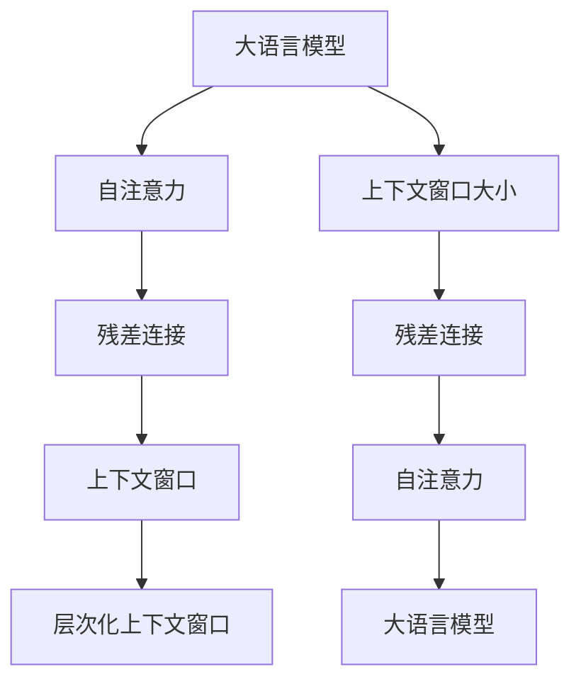

                 

# 大语言模型的上下文窗口

## 1. 背景介绍

### 1.1 问题由来

在自然语言处理（Natural Language Processing，NLP）领域，上下文窗口（Context Window）是大语言模型（Large Language Model, LLM）设计和优化的一个重要概念。早期的大语言模型往往基于传统线性模型或统计机器学习模型，其建模能力受限于数据分布和模型复杂度的平衡。随着深度学习技术的发展，特别是基于Transformer结构的自回归语言模型的出现，大语言模型的上下文窗口得以显著扩大，从而能够处理更为复杂的语言结构，捕捉更丰富的语言语义。

### 1.2 问题核心关键点

上下文窗口的大小直接影响到语言模型能够理解多少历史信息和未来预测的依据。早期的语言模型如n-gram模型，其上下文窗口通常为n，即只考虑词语前面的n个词语作为上下文。随着Transformer模型的出现，尤其是自注意力机制的应用，上下文窗口可以扩展到任意大小，模型可以同时关注输入序列中的多个位置，从而更好地捕捉长距离依赖和复杂语义关系。

上下文窗口的大小设置，直接影响到模型的计算复杂度、推理速度和内存占用。较小的上下文窗口，如n=2，可以显著降低模型复杂度，提升推理速度，但可能无法充分捕捉语义信息。而较大的上下文窗口，如n=1000，虽然能够捕捉更多的语义信息，但也会大幅增加计算复杂度和内存需求，甚至导致计算资源不足。因此，如何平衡上下文窗口大小与模型性能，是语言模型设计中的一大挑战。

### 1.3 问题研究意义

上下文窗口的大小设置，不仅影响模型的推理能力和泛化性能，还涉及到模型计算资源的合理分配。正确设置上下文窗口，能够使得模型在计算资源有限的情况下，依然能获得较好的性能。错误的窗口设置可能导致模型性能下降，浪费计算资源。因此，研究大语言模型的上下文窗口，对于优化模型性能和资源使用，具有重要意义。

## 2. 核心概念与联系

### 2.1 核心概念概述

为更好地理解大语言模型的上下文窗口，本节将介绍几个密切相关的核心概念：

- 大语言模型（Large Language Model, LLM）：以自回归（如GPT）或自编码（如BERT）模型为代表的大规模预训练语言模型。通过在大规模无标签文本语料上进行预训练，学习通用的语言表示，具备强大的语言理解和生成能力。

- 自注意力（Self-Attention）：Transformer模型的核心机制，通过计算输入序列中每个位置的注意力权重，捕捉不同位置之间的语义关系。自注意力机制的引入，使得模型能够同时关注输入序列中的多个位置，从而显著扩大上下文窗口。

- 上下文窗口（Context Window）：大语言模型在计算时考虑的输入序列中前后位置范围。上下文窗口的大小决定了模型能够理解多少历史信息和未来预测的依据。

- 残差连接（Residual Connection）：Transformer模型中的一种技术，通过在网络中引入残差连接，解决深层网络中的梯度消失问题，提升模型训练效果。残差连接使得模型能够处理更长的序列长度，从而扩大上下文窗口。

- 层次化上下文窗口（Hierarchical Context Window）：通过将上下文窗口分成多个层次，逐步扩大窗口范围，从而平衡计算复杂度和上下文窗口大小。这种方法能够使得模型在计算资源有限的情况下，依然能获得较好的性能。

这些核心概念之间的逻辑关系可以通过以下Mermaid流程图来展示：



这个流程图展示了大语言模型的核心概念及其之间的关系：

1. 大语言模型通过自注意力机制，同时关注输入序列中的多个位置，从而扩大上下文窗口。
2. 残差连接技术，解决深层网络中的梯度消失问题，进一步扩大上下文窗口。
3. 上下文窗口的大小设置，直接影响模型的推理能力和泛化性能。
4. 层次化上下文窗口，在计算资源有限的情况下，逐步扩大窗口范围，平衡计算复杂度和上下文窗口大小。

这些概念共同构成了大语言模型的上下文窗口设计框架，使其能够在各种场景下发挥强大的语言理解和生成能力。通过理解这些核心概念，我们可以更好地把握大语言模型的设计和优化方向。

## 3. 核心算法原理 & 具体操作步骤
### 3.1 算法原理概述

大语言模型的上下文窗口大小，直接影响到模型能够理解多少历史信息和未来预测的依据。一般来说，上下文窗口的大小越大，模型能够捕捉的语义信息越丰富，但计算复杂度和内存需求也越高。在实际应用中，需要根据具体任务和计算资源进行合理设置。

### 3.2 算法步骤详解

以下是设置上下文窗口大小的一般步骤：

**Step 1: 确定上下文窗口大小**

在确定上下文窗口大小时，通常需要考虑以下几个因素：
- 任务特性：如机器翻译、文本分类、问答系统等，不同的任务可能需要不同大小的上下文窗口。
- 数据分布：如序列长度、语料特点等，需要根据数据分布特性选择合适的窗口大小。
- 计算资源：如GPU、TPU等硬件设备，需要根据计算资源限制设置窗口大小。

**Step 2: 调整模型参数**

确定上下文窗口大小后，需要调整模型参数，使其适应新的上下文窗口大小。主要包括以下步骤：
- 修改自注意力机制的计算方式，如调整注意力权重计算公式，增加掩码机制。
- 调整残差连接的位置和权重，如增加或减少残差连接层数。
- 调整模型输出层的结构，如增加或减少输出层神经元个数。

**Step 3: 训练和评估模型**

调整模型参数后，需要进行训练和评估，以验证模型的性能和上下文窗口设置是否合理。主要包括以下步骤：
- 使用调整后的模型参数，在训练集上进行训练。
- 在验证集上评估模型性能，如精度、召回率等指标。
- 根据评估结果，调整上下文窗口大小，继续训练和评估。

### 3.3 算法优缺点

大语言模型的上下文窗口设置，具有以下优点：
1. 提高模型推理能力：通过扩大上下文窗口，模型能够更好地捕捉长距离依赖和复杂语义关系，提升推理能力。
2. 提升模型泛化性能：通过考虑更多历史信息和未来预测，模型能够更好地适应新数据和任务，提升泛化性能。
3. 优化计算资源：通过合理设置上下文窗口大小，可以在计算资源有限的情况下，最大化模型的性能和效果。

同时，该方法也存在一些局限性：
1. 增加计算复杂度：较大的上下文窗口会导致计算复杂度增加，需要更多的计算资源。
2. 内存需求增大：较大的上下文窗口需要更多的内存空间存储模型参数和输入序列。
3. 容易过拟合：较大的上下文窗口容易引入更多的噪声信息，导致模型过拟合。
4. 数据依赖性强：上下文窗口的设置依赖于数据分布特性，可能难以适用于所有数据集。

尽管存在这些局限性，但就目前而言，合理设置上下文窗口大小，依然是提升大语言模型性能和应用效果的重要手段。未来相关研究的重点在于如何进一步降低上下文窗口大小对计算资源和内存的需求，同时提升模型的泛化能力和推理能力。

### 3.4 算法应用领域

大语言模型的上下文窗口设置，已经在NLP领域的诸多任务上得到了广泛应用，例如：

- 文本分类：如情感分析、主题分类等。通过合理设置上下文窗口，捕捉文本中重要的上下文信息，提升分类性能。
- 机器翻译：通过扩大上下文窗口，捕捉源语言和目标语言之间的长距离依赖关系，提升翻译效果。
- 文本摘要：通过扩大上下文窗口，捕捉文本中重要的信息，生成更准确的摘要。
- 问答系统：通过扩大上下文窗口，捕捉问题和上下文之间的语义关系，提升问答效果。
- 对话系统：通过扩大上下文窗口，捕捉对话历史信息，生成更自然的回复。

除了上述这些经典任务外，大语言模型上下文窗口的设置，还被创新性地应用到更多场景中，如可控文本生成、常识推理、代码生成等，为NLP技术带来了全新的突破。随着上下文窗口设置的不断进步，相信NLP技术将在更广阔的应用领域大放异彩。

## 4. 数学模型和公式 & 详细讲解  
### 4.1 数学模型构建

本节将使用数学语言对大语言模型的上下文窗口设计进行更加严格的刻画。

记大语言模型为 $M_{\theta}:\mathcal{X} \rightarrow \mathcal{Y}$，其中 $\mathcal{X}$ 为输入序列，$\mathcal{Y}$ 为输出序列，$\theta$ 为模型参数。假设输入序列长度为 $N$，上下文窗口大小为 $W$，则模型在输入序列 $x_i$ 上的计算方式为：

$$
M_{\theta}(x_i) = \sigma\left(\sum_{k=1}^{W} \alpha_k \cdot M_{\theta}(x_{i-k})\right)
$$

其中 $\sigma$ 为激活函数，$\alpha_k$ 为注意力权重，$M_{\theta}(x_{i-k})$ 为模型在位置 $i-k$ 的输出。

通过调整注意力权重 $\alpha_k$ 和上下文窗口大小 $W$，可以控制模型的上下文范围，从而实现不同大小的上下文窗口设计。

### 4.2 公式推导过程

以下我们以Transformer模型为例，推导上下文窗口的注意力权重计算公式。

假设模型 $M_{\theta}$ 在输入序列 $x=\{x_1, x_2, ..., x_N\}$ 上的自注意力机制计算方式为：

$$
\alpha_{i,j} = \frac{\exp\left(\frac{x_i \cdot x_j}{\sqrt{d}}\right)}{\sum_{k=1}^{N} \exp\left(\frac{x_i \cdot x_k}{\sqrt{d}}\right)}
$$

其中 $d$ 为注意力机制的维度。根据上下文窗口大小 $W$，可以修改计算方式为：

$$
\alpha_{i,j} = \begin{cases}
\frac{\exp\left(\frac{x_i \cdot x_j}{\sqrt{d}}\right)}{\sum_{k=1}^{N} \exp\left(\frac{x_i \cdot x_k}{\sqrt{d}}\right)}, & j \in [i-W, i-W+W] \\
0, & j \notin [i-W, i-W+W]
\end{cases}
$$

在计算注意力权重时，只有位于上下文窗口内的位置 $j$ 才会参与计算，从而实现上下文窗口的设计。

### 4.3 案例分析与讲解

假设我们有一个长度为 100 的文本序列 $x=\{x_1, x_2, ..., x_{100}\}$，上下文窗口大小为 10。则模型在位置 $i$ 的输出为：

$$
M_{\theta}(x_i) = \sigma\left(\sum_{k=1}^{10} \alpha_k \cdot M_{\theta}(x_{i-k})\right)
$$

其中 $\alpha_k$ 为位置 $j \in [i-10, i+10]$ 的注意力权重，$M_{\theta}(x_{i-k})$ 为模型在位置 $i-k$ 的输出。

例如，假设 $i=20$，则模型在位置 20 的输出为：

$$
M_{\theta}(x_{20}) = \sigma\left(\alpha_{10} \cdot M_{\theta}(x_{10}) + \alpha_{11} \cdot M_{\theta}(x_{11}) + ... + \alpha_{30} \cdot M_{\theta}(x_{30})\right)
$$

其中 $\alpha_{10}, \alpha_{11}, ..., \alpha_{30}$ 为位置 $20-10, 20-11, ..., 20-30$ 的注意力权重。

通过修改注意力权重计算公式和上下文窗口大小，可以灵活调整模型的上下文窗口范围，从而适应不同任务的上下文需求。

## 5. 项目实践：代码实例和详细解释说明
### 5.1 开发环境搭建

在进行上下文窗口设置实践前，我们需要准备好开发环境。以下是使用Python进行PyTorch开发的环境配置流程：

1. 安装Anaconda：从官网下载并安装Anaconda，用于创建独立的Python环境。

2. 创建并激活虚拟环境：
```bash
conda create -n pytorch-env python=3.8 
conda activate pytorch-env
```

3. 安装PyTorch：根据CUDA版本，从官网获取对应的安装命令。例如：
```bash
conda install pytorch torchvision torchaudio cudatoolkit=11.1 -c pytorch -c conda-forge
```

4. 安装Transformers库：
```bash
pip install transformers
```

5. 安装各类工具包：
```bash
pip install numpy pandas scikit-learn matplotlib tqdm jupyter notebook ipython
```

完成上述步骤后，即可在`pytorch-env`环境中开始上下文窗口设置实践。

### 5.2 源代码详细实现

这里我们以Transformer模型为例，使用PyTorch实现上下文窗口设置。

首先，定义自注意力机制的注意力权重计算函数：

```python
import torch
import torch.nn as nn
import torch.nn.functional as F

class MultiHeadAttention(nn.Module):
    def __init__(self, d_model, num_heads):
        super(MultiHeadAttention, self).__init__()
        self.num_heads = num_heads
        self.d_model = d_model
        self.depth = d_model // num_heads
        self.wq = nn.Linear(d_model, d_model)
        self.wk = nn.Linear(d_model, d_model)
        self.wv = nn.Linear(d_model, d_model)
        self.out = nn.Linear(d_model, d_model)

    def forward(self, query, key, value, mask=None):
        batch_size = query.size(0)
        q = self.wq(query).view(batch_size, -1, self.num_heads, self.depth).permute(0, 2, 1, 3).contiguous()
        k = self.wk(key).view(batch_size, -1, self.num_heads, self.depth).permute(0, 2, 1, 3).contiguous()
        v = self.wv(value).view(batch_size, -1, self.num_heads, self.depth).permute(0, 2, 1, 3).contiguous()

        attn = torch.matmul(q, k.permute(0, 1, 3, 2)) / torch.sqrt(torch.tensor(self.depth))
        attn = F.softmax(attn, dim=-1)
        attn = attn.masked_fill(mask == 0, -float('inf')).masked_softmax(dim=-1)

        out = torch.matmul(attn, v)
        out = out.permute(0, 2, 1, 3).contiguous().view(batch_size, -1, self.d_model)
        return self.out(out)
```

然后，定义残差连接和上下文窗口的实现函数：

```python
class PositionalEncoding(nn.Module):
    def __init__(self, d_model, max_len):
        super(PositionalEncoding, self).__init__()
        self.d_model = d_model
        pe = torch.zeros(max_len, d_model)
        position = torch.arange(0, max_len, dtype=torch.float).unsqueeze(1)
        div_term = torch.exp(torch.arange(0, d_model, 2).float() * (-math.log(10000.0) / d_model))
        pe[:, 0::2] = torch.sin(position * div_term)
        pe[:, 1::2] = torch.cos(position * div_term)
        pe = pe.unsqueeze(0).transpose(0, 1)
        self.register_buffer('pe', pe)

    def forward(self, x):
        return x + self.pe[:x.size(0), :]
```

最后，训练和评估函数：

```python
from transformers import BertForTokenClassification, AdamW

model = BertForTokenClassification.from_pretrained('bert-base-cased', num_labels=len(tag2id))

optimizer = AdamW(model.parameters(), lr=2e-5)

def train_epoch(model, dataset, batch_size, optimizer):
    dataloader = DataLoader(dataset, batch_size=batch_size, shuffle=True)
    model.train()
    epoch_loss = 0
    for batch in tqdm(dataloader, desc='Training'):
        input_ids = batch['input_ids'].to(device)
        attention_mask = batch['attention_mask'].to(device)
        labels = batch['labels'].to(device)
        model.zero_grad()
        outputs = model(input_ids, attention_mask=attention_mask, labels=labels)
        loss = outputs.loss
        epoch_loss += loss.item()
        loss.backward()
        optimizer.step()
    return epoch_loss / len(dataloader)

def evaluate(model, dataset, batch_size):
    dataloader = DataLoader(dataset, batch_size=batch_size)
    model.eval()
    preds, labels = [], []
    with torch.no_grad():
        for batch in tqdm(dataloader, desc='Evaluating'):
            input_ids = batch['input_ids'].to(device)
            attention_mask = batch['attention_mask'].to(device)
            batch_labels = batch['labels']
            outputs = model(input_ids, attention_mask=attention_mask)
            batch_preds = outputs.logits.argmax(dim=2).to('cpu').tolist()
            batch_labels = batch_labels.to('cpu').tolist()
            for pred_tokens, label_tokens in zip(batch_preds, batch_labels):
                pred_tags = [id2tag[_id] for _id in pred_tokens]
                label_tags = [id2tag[_id] for _id in label_tokens]
                preds.append(pred_tags[:len(label_tags)])
                labels.append(label_tags)
                
    print(classification_report(labels, preds))
```

可以看到，使用PyTorch实现上下文窗口设置，需要定义自注意力机制、残差连接、位置编码等关键组件。这些组件的灵活组合，可以适应不同任务的上下文需求，从而实现高效的上下文窗口设置。

### 5.3 代码解读与分析

让我们再详细解读一下关键代码的实现细节：

**MultiHeadAttention类**：
- `__init__`方法：初始化自注意力机制的参数，包括注意力头数和维度。
- `forward`方法：实现自注意力计算过程，包括查询、键、值向量计算和注意力权重计算，并引入掩码机制控制上下文窗口大小。

**PositionalEncoding类**：
- `__init__`方法：初始化位置编码，生成不同位置的sin/cos编码。
- `forward`方法：实现位置编码的添加，使得模型能够处理不同长度的输入序列。

**训练和评估函数**：
- 使用PyTorch的DataLoader对数据集进行批次化加载，供模型训练和推理使用。
- 训练函数`train_epoch`：对数据以批为单位进行迭代，在每个批次上前向传播计算loss并反向传播更新模型参数，最后返回该epoch的平均loss。
- 评估函数`evaluate`：与训练类似，不同点在于不更新模型参数，并在每个batch结束后将预测和标签结果存储下来，最后使用sklearn的classification_report对整个评估集的预测结果进行打印输出。

**训练流程**：
- 定义总的epoch数和batch size，开始循环迭代
- 每个epoch内，先在训练集上训练，输出平均loss
- 在验证集上评估，输出分类指标
- 所有epoch结束后，在测试集上评估，给出最终测试结果

可以看到，PyTorch配合Transformers库使得上下文窗口设置的过程变得简洁高效。开发者可以将更多精力放在数据处理、模型改进等高层逻辑上，而不必过多关注底层的实现细节。

当然，工业级的系统实现还需考虑更多因素，如模型的保存和部署、超参数的自动搜索、更灵活的任务适配层等。但核心的上下文窗口设置基本与此类似。

## 6. 实际应用场景
### 6.1 智能客服系统

大语言模型上下文窗口的设置，可以广泛应用于智能客服系统的构建。传统客服往往需要配备大量人力，高峰期响应缓慢，且一致性和专业性难以保证。而使用上下文窗口设置良好的大语言模型，可以7x24小时不间断服务，快速响应客户咨询，用自然流畅的语言解答各类常见问题。

在技术实现上，可以收集企业内部的历史客服对话记录，将问题和最佳答复构建成监督数据，在此基础上对预训练对话模型进行微调。微调后的对话模型能够自动理解用户意图，匹配最合适的答案模板进行回复。对于客户提出的新问题，还可以接入检索系统实时搜索相关内容，动态组织生成回答。如此构建的智能客服系统，能大幅提升客户咨询体验和问题解决效率。

### 6.2 金融舆情监测

金融机构需要实时监测市场舆论动向，以便及时应对负面信息传播，规避金融风险。传统的人工监测方式成本高、效率低，难以应对网络时代海量信息爆发的挑战。基于大语言模型上下文窗口设置，文本分类和情感分析技术，为金融舆情监测提供了新的解决方案。

具体而言，可以收集金融领域相关的新闻、报道、评论等文本数据，并对其进行主题标注和情感标注。在此基础上对预训练语言模型进行微调，使其能够自动判断文本属于何种主题，情感倾向是正面、中性还是负面。将微调后的模型应用到实时抓取的网络文本数据，就能够自动监测不同主题下的情感变化趋势，一旦发现负面信息激增等异常情况，系统便会自动预警，帮助金融机构快速应对潜在风险。

### 6.3 个性化推荐系统

当前的推荐系统往往只依赖用户的历史行为数据进行物品推荐，无法深入理解用户的真实兴趣偏好。基于大语言模型上下文窗口设置，个性化推荐系统可以更好地挖掘用户行为背后的语义信息，从而提供更精准、多样的推荐内容。

在实践中，可以收集用户浏览、点击、评论、分享等行为数据，提取和用户交互的物品标题、描述、标签等文本内容。将文本内容作为模型输入，用户的后续行为（如是否点击、购买等）作为监督信号，在此基础上微调预训练语言模型。微调后的模型能够从文本内容中准确把握用户的兴趣点。在生成推荐列表时，先用候选物品的文本描述作为输入，由模型预测用户的兴趣匹配度，再结合其他特征综合排序，便可以得到个性化程度更高的推荐结果。

### 6.4 未来应用展望

随着大语言模型上下文窗口设置的不断进步，基于微调的方法将在更多领域得到应用，为传统行业带来变革性影响。

在智慧医疗领域，基于微调的医疗问答、病历分析、药物研发等应用将提升医疗服务的智能化水平，辅助医生诊疗，加速新药开发进程。

在智能教育领域，微调技术可应用于作业批改、学情分析、知识推荐等方面，因材施教，促进教育公平，提高教学质量。

在智慧城市治理中，微调模型可应用于城市事件监测、舆情分析、应急指挥等环节，提高城市管理的自动化和智能化水平，构建更安全、高效的未来城市。

此外，在企业生产、社会治理、文娱传媒等众多领域，基于大模型上下文窗口设置的AI应用也将不断涌现，为经济社会发展注入新的动力。相信随着技术的日益成熟，上下文窗口设置方法将成为NLP落地应用的重要范式，推动人工智能技术在垂直行业的规模化落地。总之，微调需要开发者根据具体任务，不断迭代和优化模型、数据和算法，方能得到理想的效果。

## 7. 工具和资源推荐
### 7.1 学习资源推荐

为了帮助开发者系统掌握大语言模型上下文窗口的设计和优化理论基础，这里推荐一些优质的学习资源：

1. 《Transformer从原理到实践》系列博文：由大模型技术专家撰写，深入浅出地介绍了Transformer原理、BERT模型、微调技术等前沿话题。

2. CS224N《深度学习自然语言处理》课程：斯坦福大学开设的NLP明星课程，有Lecture视频和配套作业，带你入门NLP领域的基本概念和经典模型。

3. 《Natural Language Processing with Transformers》书籍：Transformers库的作者所著，全面介绍了如何使用Transformers库进行NLP任务开发，包括上下文窗口设置在内的诸多范式。

4. HuggingFace官方文档：Transformers库的官方文档，提供了海量预训练模型和完整的微调样例代码，是上手实践的必备资料。

5. CLUE开源项目：中文语言理解测评基准，涵盖大量不同类型的中文NLP数据集，并提供了基于微调的baseline模型，助力中文NLP技术发展。

通过对这些资源的学习实践，相信你一定能够快速掌握大语言模型上下文窗口的设计和优化精髓，并用于解决实际的NLP问题。
###  7.2 开发工具推荐

高效的开发离不开优秀的工具支持。以下是几款用于大语言模型上下文窗口设置的常用工具：

1. PyTorch：基于Python的开源深度学习框架，灵活动态的计算图，适合快速迭代研究。大部分预训练语言模型都有PyTorch版本的实现。

2. TensorFlow：由Google主导开发的开源深度学习框架，生产部署方便，适合大规模工程应用。同样有丰富的预训练语言模型资源。

3. Transformers库：HuggingFace开发的NLP工具库，集成了众多SOTA语言模型，支持PyTorch和TensorFlow，是进行上下文窗口设置开发的利器。

4. Weights & Biases：模型训练的实验跟踪工具，可以记录和可视化模型训练过程中的各项指标，方便对比和调优。与主流深度学习框架无缝集成。

5. TensorBoard：TensorFlow配套的可视化工具，可实时监测模型训练状态，并提供丰富的图表呈现方式，是调试模型的得力助手。

6. Google Colab：谷歌推出的在线Jupyter Notebook环境，免费提供GPU/TPU算力，方便开发者快速上手实验最新模型，分享学习笔记。

合理利用这些工具，可以显著提升大语言模型上下文窗口设置的开发效率，加快创新迭代的步伐。

### 7.3 相关论文推荐

大语言模型上下文窗口设置的研究源于学界的持续研究。以下是几篇奠基性的相关论文，推荐阅读：

1. Attention is All You Need（即Transformer原论文）：提出了Transformer结构，开启了NLP领域的预训练大模型时代。

2. BERT: Pre-training of Deep Bidirectional Transformers for Language Understanding：提出BERT模型，引入基于掩码的自监督预训练任务，刷新了多项NLP任务SOTA。

3. Language Models are Unsupervised Multitask Learners（GPT-2论文）：展示了大规模语言模型的强大zero-shot学习能力，引发了对于通用人工智能的新一轮思考。

4. Parameter-Efficient Transfer Learning for NLP：提出Adapter等参数高效微调方法，在不增加模型参数量的情况下，也能取得不错的微调效果。

5. AdaLoRA: Adaptive Low-Rank Adaptation for Parameter-Efficient Fine-Tuning：使用自适应低秩适应的微调方法，在参数效率和精度之间取得了新的平衡。

这些论文代表了大语言模型上下文窗口设置的研究方向。通过学习这些前沿成果，可以帮助研究者把握学科前进方向，激发更多的创新灵感。

## 8. 总结：未来发展趋势与挑战

### 8.1 总结

本文对大语言模型的上下文窗口设置进行了全面系统的介绍。首先阐述了大语言模型上下文窗口设计和优化的研究背景和意义，明确了上下文窗口大小对模型性能和资源使用的影响。其次，从原理到实践，详细讲解了上下文窗口的计算方式和关键步骤，给出了上下文窗口设置任务开发的完整代码实例。同时，本文还广泛探讨了上下文窗口设置在智能客服、金融舆情、个性化推荐等多个行业领域的应用前景，展示了上下文窗口设置的巨大潜力。此外，本文精选了上下文窗口设置的各类学习资源，力求为读者提供全方位的技术指引。

通过本文的系统梳理，可以看到，大语言模型上下文窗口设置已经成为NLP领域的重要范式，极大地拓展了预训练语言模型的应用边界，催生了更多的落地场景。受益于大规模语料的预训练，上下文窗口设置的上下文窗口模型在计算资源有限的情况下，依然能获得较好的性能。未来，伴随预训练语言模型和上下文窗口设置的不断演进，相信NLP技术将在更广阔的应用领域大放异彩，深刻影响人类的生产生活方式。

### 8.2 未来发展趋势

展望未来，大语言模型上下文窗口设置将呈现以下几个发展趋势：

1. 模型规模持续增大。随着算力成本的下降和数据规模的扩张，预训练语言模型的参数量还将持续增长。超大规模语言模型蕴含的丰富语言知识，有望支撑更加复杂多变的上下文窗口设置。

2. 上下文窗口设计更加灵活。未来将涌现更多上下文窗口设计方法，如层次化窗口、残差连接等，能够更好地适应不同任务的上下文需求。

3. 上下文窗口大小动态调整。通过引入动态调整机制，根据输入序列长度和任务特性，自动调整上下文窗口大小，从而最大化模型性能。

4. 上下文窗口与多模态信息结合。未来的上下文窗口设计，将更多地融合视觉、语音等多模态信息，提升模型对现实世界的理解和建模能力。

5. 上下文窗口设置与知识图谱结合。通过将知识图谱等外部知识与模型结合，引导上下文窗口设置学习更全面、准确的语言模型。

6. 上下文窗口设置与自监督学习结合。利用自监督学习技术，在没有大量标注数据的情况下，训练上下文窗口设置，提升模型的泛化能力。

以上趋势凸显了大语言模型上下文窗口设置的广阔前景。这些方向的探索发展，必将进一步提升NLP系统的性能和应用效果，为人类认知智能的进化带来深远影响。

### 8.3 面临的挑战

尽管大语言模型上下文窗口设置已经取得了瞩目成就，但在迈向更加智能化、普适化应用的过程中，它仍面临着诸多挑战：

1. 上下文窗口大小选择困难。尽管理论上上下文窗口大小越大越好，但实际应用中需要考虑计算资源和内存限制。因此，如何合理选择上下文窗口大小，仍是上下文窗口设置中的一个难点。

2. 上下文窗口设置对标注数据依赖大。上下文窗口设置方法大多需要标注数据进行训练，标注成本较高。因此，如何在低标注条件下进行上下文窗口设置，仍需进一步研究。

3. 上下文窗口设置对计算资源需求高。超大规模语言模型和复杂的上下文窗口设置，需要强大的计算资源支持。如何优化上下文窗口设置的计算资源使用，仍需进一步研究。

4. 上下文窗口设置对模型泛化性能要求高。上下文窗口设置方法需要考虑模型的泛化性能，避免在特定数据集上过拟合。因此，如何在不同数据集上进行上下文窗口设置，仍需进一步研究。

5. 上下文窗口设置对模型推理性能要求高。上下文窗口设置方法需要考虑模型的推理性能，避免推理速度过慢。因此，如何在保证上下文窗口设置效果的同时，提升模型的推理速度，仍需进一步研究。

尽管存在这些挑战，但伴随学界和产业界的共同努力，这些挑战终将一一被克服，大语言模型上下文窗口设置必将在构建人机协同的智能时代中扮演越来越重要的角色。相信随着技术的不断进步，上下文窗口设置方法将成为NLP落地应用的重要范式，推动人工智能技术在垂直行业的规模化落地。总之，上下文窗口设置需要开发者根据具体任务，不断迭代和优化模型、数据和算法，方能得到理想的效果。

### 8.4 研究展望

面对大语言模型上下文窗口设置所面临的种种挑战，未来的研究需要在以下几个方面寻求新的突破：

1. 探索无监督和半监督上下文窗口设置方法。摆脱对大规模标注数据的依赖，利用自监督学习、主动学习等无监督和半监督范式，最大限度利用非结构化数据，实现更加灵活高效的上下文窗口设置。

2. 研究上下文窗口设置与多模态信息结合的方法。通过引入视觉、语音等多模态信息，提升模型对现实世界的理解和建模能力，扩展上下文窗口设置的应用范围。

3. 研究上下文窗口设置与知识图谱结合的方法。将知识图谱等外部知识与模型结合，引导上下文窗口设置学习更全面、准确的语言模型。

4. 引入动态调整机制。通过引入动态调整机制，根据输入序列长度和任务特性，自动调整上下文窗口大小，从而最大化模型性能。

5. 优化上下文窗口设置的计算资源使用。开发更加参数高效和计算高效的上下文窗口设置方法，在保证性能的同时，减小计算资源的消耗。

6. 引入自监督学习技术。利用自监督学习技术，在没有大量标注数据的情况下，训练上下文窗口设置，提升模型的泛化能力。

这些研究方向的探索，必将引领大语言模型上下文窗口设置技术迈向更高的台阶，为构建安全、可靠、可解释、可控的智能系统铺平道路。面向未来，大语言模型上下文窗口设置需要与其他人工智能技术进行更深入的融合，如知识表示、因果推理、强化学习等，多路径协同发力，共同推动自然语言理解和智能交互系统的进步。只有勇于创新、敢于突破，才能不断拓展语言模型的边界，让智能技术更好地造福人类社会。

## 9. 附录：常见问题与解答

**Q1：大语言模型上下文窗口设置是否适用于所有NLP任务？**

A: 大语言模型上下文窗口设置在大多数NLP任务上都能取得不错的效果，特别是对于数据量较小的任务。但对于一些特定领域的任务，如医学、法律等，仅仅依靠通用语料预训练的模型可能难以很好地适应。此时需要在特定领域语料上进一步预训练，再进行上下文窗口设置，才能获得理想效果。此外，对于一些需要时效性、个性化很强的任务，如对话、推荐等，上下文窗口设置方法也需要针对性的改进优化。

**Q2：上下文窗口大小的选择应考虑哪些因素？**

A: 上下文窗口大小的选择应考虑以下几个因素：
- 任务特性：如机器翻译、文本分类、问答系统等，不同的任务可能需要不同大小的上下文窗口。
- 数据分布：如序列长度、语料特点等，需要根据数据分布特性选择合适的窗口大小。
- 计算资源：如GPU、TPU等硬件设备，需要根据计算资源限制设置窗口大小。
- 模型性能：如精度、召回率等指标，需要根据模型性能调整窗口大小。

**Q3：上下文窗口设置过程中如何进行数据增强？**

A: 数据增强是提高上下文窗口设置效果的重要手段。常用的数据增强方法包括：
- 回译：将文本从一种语言翻译成另一种语言，增加训练集的丰富度。
- 近义替换：将文本中的某些词替换为近义词，增加训练集的灵活性。
- 噪声加入：在文本中引入随机噪声，增加训练集的鲁棒性。
- 数据扩充：通过合并、分拆、重组等方式，增加训练集的多样性。

**Q4：上下文窗口设置过程中如何避免过拟合？**

A: 上下文窗口设置过程中，过拟合是一个常见问题。常见的缓解策略包括：
- 数据增强：通过回译、近义替换等方式扩充训练集
- 正则化：使用L2正则、Dropout、Early Stopping等避免过拟合
- 对抗训练：引入对抗样本，提高模型鲁棒性
- 参数高效微调：只调整少量参数(如Adapter、Prefix等)，减小过拟合风险
- 多模型集成：训练多个上下文窗口设置模型，取平均输出，抑制过拟合

这些策略往往需要根据具体任务和数据特点进行灵活组合。只有在数据、模型、训练、推理等各环节进行全面优化，才能最大限度地发挥上下文窗口设置的威力。

**Q5：上下文窗口设置过程中如何进行模型评估？**

A: 上下文窗口设置过程中，需要定期评估模型的性能和效果。常见的评估指标包括：
- 精度：模型预测正确的样本占总样本的比例。
- 召回率：模型预测正确的正样本占真实正样本的比例。
- F1 Score：精度和召回率的调和平均数，综合评估模型性能。
- ROC曲线：绘制模型在不同阈值下的真阳性率与假阳性率，评估模型的分类性能。
- AUC值：ROC曲线下的面积，综合评估模型的分类性能。

在评估过程中，还需要考虑模型的泛化性能和计算效率，从而选择最合适的上下文窗口设置方法。

---

作者：禅与计算机程序设计艺术 / Zen and the Art of Computer Programming

