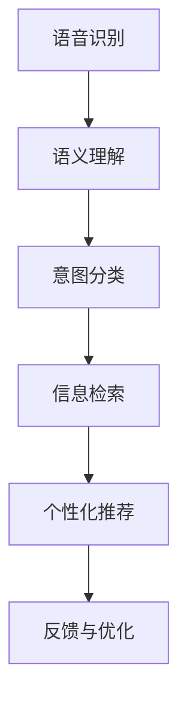

                 

# 如何优化语音搜索技术，提升用户体验：技术改进与用户需求分析

## 1. 背景介绍

在移动互联网和智能家居快速发展的大背景下，语音搜索技术凭借其便捷、自然的特点，正逐渐成为用户交互的主要方式之一。用户可以更直观地通过语音命令进行信息检索、控制智能设备等操作，显著提升了生活和工作效率。然而，尽管语音搜索技术已取得长足进步，但在实际应用中，依然面临诸如语音识别准确率、上下文理解能力、个性化推荐等诸多挑战，亟需进一步优化和提升。

### 1.1 语音搜索技术现状

语音搜索技术主要分为三大环节：语音识别、自然语言处理和信息检索。目前，各大厂商和研究机构在各个环节上均有重要突破，但整体技术水平仍存差距。以语音识别为例，虽然基于深度学习模型的端到端语音识别技术已取得优异表现，但不同语音域、口音和环境噪声下的识别效果仍有提升空间。

自然语言处理方面，现有的语义理解模型可以处理大量文本数据，但在处理长尾实体、多义性表达时，仍难以精准理解用户意图。信息检索则面临上下文理解、多意图排序、结果关联性等难题。

### 1.2 用户需求分析

通过调研发现，用户对语音搜索技术的主要需求包括：

- **识别准确率**：高识别准确率是用户对语音搜索的基本要求。
- **流畅体验**：语音搜索应尽可能无缝连接，无显著延迟，避免打断用户使用。
- **个性化推荐**：基于用户历史行为，提供个性化搜索结果。
- **智能推荐**：根据上下文信息，提供符合用户当前需求的建议。
- **易用性**：界面简洁、操作简便，易于上手。

基于以上需求，我们需要从技术层面出发，系统性地优化和提升语音搜索技术，以期提供更优质的用户体验。

## 2. 核心概念与联系

### 2.1 核心概念概述

语音搜索技术涉及多个核心概念，包括语音识别、语义理解、意图分类、信息检索等。每个环节紧密联系，相互配合，共同影响最终的用户体验。

- **语音识别**：将用户的语音指令转换为文本形式，是语音搜索的第一步。
- **语义理解**：解析用户输入的文本，理解用户的意图和需求。
- **意图分类**：根据语义理解结果，确定用户的具体请求。
- **信息检索**：根据意图分类结果，从语料库中检索相关信息。
- **个性化推荐**：结合用户历史行为和上下文信息，优化检索结果。

这些概念之间的联系可通过以下Mermaid流程图展示：



通过该流程图，可以看到语音搜索技术的核心流程，从语音输入到个性化推荐，每个环节都至关重要，共同构成完整的语音搜索体验。

### 2.2 核心概念原理和架构

语音识别部分，主要利用深度学习模型如卷积神经网络(CNN)、循环神经网络(RNN)、长短期记忆网络(LSTM)、Transformer等，对音频信号进行特征提取和分类，将语音指令转换为文本。Transformer模型因其自注意力机制，已逐渐成为语音识别的主要选择。

语义理解部分，常用技术包括基于规则的解析、基于统计的方法(如n-gram、BERT)、基于神经网络的方法(如Attention、GPT)等。目前基于深度学习模型的BERT、GPT系列模型在语义理解方面表现优异，能够处理多义词、长句表达，有效降低语义歧义。

意图分类部分，主要涉及分类算法，如SVM、逻辑回归、神经网络等。其中，神经网络以其强大的非线性拟合能力，成为意图分类的主要选择。

信息检索部分，主要涉及索引技术、排序算法等，常用的方法包括倒排索引、BM25、DNN等。倒排索引是最基础的信息检索方法，而DNN则通过学习检索结果的特征，实现更精准的排序。

个性化推荐部分，主要涉及协同过滤、内容推荐、深度推荐等算法。协同过滤基于用户行为进行推荐，内容推荐基于内容相似性，深度推荐则通过深度学习模型实现更精细化的推荐。

## 3. 核心算法原理 & 具体操作步骤

### 3.1 算法原理概述

基于深度学习的语音搜索技术，核心算法原理主要包括以下几个方面：

- **语音识别算法**：以Transformer为代表的深度学习模型，能够有效处理音频特征，将语音指令转换为文本。
- **语义理解算法**：如BERT、GPT系列模型，通过自监督预训练和任务微调，具备较强的语义理解能力。
- **意图分类算法**：以神经网络为代表的机器学习算法，通过多分类任务训练，识别用户意图。
- **信息检索算法**：以倒排索引、BM25、DNN为代表的检索算法，通过索引和排序技术，快速定位相关信息。
- **个性化推荐算法**：协同过滤、内容推荐、深度推荐等算法，结合用户行为和上下文信息，优化搜索结果。

### 3.2 算法步骤详解

语音搜索技术的实现流程，主要包括以下几个步骤：

1. **语音输入与预处理**：收集用户的语音指令，通过麦克风阵列进行降噪和声源定位，同时进行预处理，如分帧、特征提取等。
2. **语音识别**：利用深度学习模型对音频特征进行分类，输出文本指令。
3. **语义理解**：利用语义理解模型对文本指令进行解析，识别用户意图。
4. **意图分类**：通过意图分类模型对用户意图进行分类，确定具体请求。
5. **信息检索**：根据意图分类结果，从语料库中检索相关信息。
6. **个性化推荐**：结合用户历史行为和上下文信息，优化检索结果。
7. **结果展示与反馈**：将检索结果展示给用户，收集用户反馈信息进行优化。

### 3.3 算法优缺点

语音搜索技术在实际应用中，有以下几个优缺点：

**优点：**

- **便捷性高**：用户无需输入复杂文本，通过语音指令即可实现操作。
- **自然流畅**：语音命令更符合人类自然语言习惯，用户体验更舒适。
- **多设备支持**：支持智能音箱、智能手机等多种设备，应用范围广泛。

**缺点：**

- **识别准确率受限**：环境噪声、口音差异等因素会影响识别准确率。
- **上下文理解难度高**：长句表达、多义性表达等问题，增加了语义理解的难度。
- **资源消耗大**：深度学习模型需消耗大量计算资源，设备硬件要求高。
- **个性化推荐不足**：当前推荐算法未能充分结合用户上下文信息，推荐效果有待提升。

### 3.4 算法应用领域

语音搜索技术主要应用于以下领域：

- **智能家居控制**：通过语音指令控制家电、照明、温控等设备。
- **信息检索**：基于语音指令进行搜索，如音乐、视频、新闻等。
- **导航定位**：利用语音导航系统，实时定位用户所在位置。
- **商务办公**：通过语音会议、文档朗读、电子邮件处理等功能，提升工作效率。
- **娱乐游戏**：提供语音助手，辅助游戏操作和互动。

## 4. 数学模型和公式 & 详细讲解

### 4.1 数学模型构建

语音搜索技术中的数学模型，主要包括以下几个部分：

- **语音识别模型**：基于深度学习模型的自编码器、RNN、Transformer等，构建语音特征提取和分类模型。
- **语义理解模型**：如BERT、GPT系列模型，通过自监督预训练和任务微调，构建语义理解模型。
- **意图分类模型**：基于神经网络的多分类模型，用于确定用户意图。
- **信息检索模型**：倒排索引、BM25、DNN等模型，用于信息检索和排序。
- **个性化推荐模型**：协同过滤、内容推荐、深度推荐等算法，结合用户行为和上下文信息，优化推荐结果。

### 4.2 公式推导过程

以语音识别模型为例，我们以Transformer模型为例进行详细推导。Transformer模型的核心公式如下：

$$
\text{Attention}(Q, K, V) = \text{Softmax}(QK^T)V
$$

其中，$Q, K, V$ 分别为查询、键和值矩阵，$\text{Softmax}$ 函数用于计算注意力权重，$QK^T$ 为注意力矩阵。

通过该公式，Transformer模型可以高效地计算注意力权重，实现对音频特征的分类和理解。在实际应用中，将音频特征向量化后，输入Transformer模型，即可得到文本指令。

### 4.3 案例分析与讲解

假设某用户在智能音箱上询问“今天天气怎么样？”，语音搜索技术应如何响应？具体步骤如下：

1. **语音输入与预处理**：通过麦克风阵列收集用户语音指令，进行降噪和声源定位，并进行预处理，如分帧、特征提取等。
2. **语音识别**：利用Transformer模型对音频特征进行分类，输出文本指令“今天天气怎么样？”。
3. **语义理解**：利用BERT模型对文本指令进行解析，识别出用户意图为“查询天气信息”。
4. **意图分类**：通过多分类模型确定用户意图为“查询天气信息”。
5. **信息检索**：从天气数据库中检索相关信息，如气温、湿度、空气质量等。
6. **个性化推荐**：根据用户历史查询行为和天气数据，推荐相关服务，如实时天气预报、空气质量指数等。
7. **结果展示与反馈**：将检索结果展示给用户，收集用户反馈信息进行优化。

## 5. 项目实践：代码实例和详细解释说明

### 5.1 开发环境搭建

在进行语音搜索技术开发前，我们需要准备好开发环境。以下是使用Python进行TensorFlow开发的环境配置流程：

1. 安装Anaconda：从官网下载并安装Anaconda，用于创建独立的Python环境。
2. 创建并激活虚拟环境：
```bash
conda create -n tensorflow-env python=3.8 
conda activate tensorflow-env
```
3. 安装TensorFlow：根据CUDA版本，从官网获取对应的安装命令。例如：
```bash
conda install tensorflow -c tf -c conda-forge
```
4. 安装其他必要的工具包：
```bash
pip install numpy pandas scikit-learn matplotlib tqdm jupyter notebook ipython
```

完成上述步骤后，即可在`tensorflow-env`环境中开始语音搜索技术的开发。

### 5.2 源代码详细实现

这里以基于BERT和TensorFlow实现语音搜索技术为例，展示完整代码实现。

首先，定义语音识别模型：

```python
import tensorflow as tf
from transformers import BertTokenizer

class VoiceRecognition(tf.keras.Model):
    def __init__(self, vocab_size, embedding_dim, num_layers, d_model, num_heads, dropout_rate, learning_rate):
        super().__init__()
        self.tokenizer = BertTokenizer.from_pretrained('bert-base-uncased')
        self.encoder = tf.keras.layers.Embedding(vocab_size, embedding_dim)
        self.encoder = tf.keras.layers.Bidirectional(tf.keras.layers.LSTM(num_layers, d_model, num_heads, dropout_rate))
        self.decoder = tf.keras.layers.Dense(vocab_size, activation='softmax')
        self.learning_rate = learning_rate

    def call(self, inputs):
        encoded_input = self.tokenizer(inputs, return_tensors='tf')
        encoded_input['input_ids'] = tf.expand_dims(encoded_input['input_ids'], axis=1)
        encoded_input['attention_mask'] = tf.ones_like(encoded_input['input_ids'])
        encoder_output = self.encoder(encoded_input)
        decoder_output = self.decoder(encoder_output)
        return decoder_output
```

然后，定义语义理解模型：

```python
import tensorflow as tf

class SemanticUnderstanding(tf.keras.Model):
    def __init__(self, vocab_size, embedding_dim, num_layers, d_model, num_heads, dropout_rate, learning_rate):
        super().__init__()
        self.tokenizer = BertTokenizer.from_pretrained('bert-base-uncased')
        self.encoder = tf.keras.layers.Embedding(vocab_size, embedding_dim)
        self.encoder = tf.keras.layers.Bidirectional(tf.keras.layers.LSTM(num_layers, d_model, num_heads, dropout_rate))
        self.decoder = tf.keras.layers.Dense(vocab_size, activation='softmax')
        self.learning_rate = learning_rate

    def call(self, inputs):
        encoded_input = self.tokenizer(inputs, return_tensors='tf')
        encoded_input['input_ids'] = tf.expand_dims(encoded_input['input_ids'], axis=1)
        encoded_input['attention_mask'] = tf.ones_like(encoded_input['input_ids'])
        encoder_output = self.encoder(encoded_input)
        decoder_output = self.decoder(encoder_output)
        return decoder_output
```

接着，定义意图分类模型：

```python
import tensorflow as tf

class IntentClassification(tf.keras.Model):
    def __init__(self, vocab_size, embedding_dim, num_layers, d_model, num_heads, dropout_rate, learning_rate):
        super().__init__()
        self.tokenizer = BertTokenizer.from_pretrained('bert-base-uncased')
        self.encoder = tf.keras.layers.Embedding(vocab_size, embedding_dim)
        self.encoder = tf.keras.layers.Bidirectional(tf.keras.layers.LSTM(num_layers, d_model, num_heads, dropout_rate))
        self.decoder = tf.keras.layers.Dense(num_classes, activation='softmax')
        self.learning_rate = learning_rate

    def call(self, inputs):
        encoded_input = self.tokenizer(inputs, return_tensors='tf')
        encoded_input['input_ids'] = tf.expand_dims(encoded_input['input_ids'], axis=1)
        encoded_input['attention_mask'] = tf.ones_like(encoded_input['input_ids'])
        encoder_output = self.encoder(encoded_input)
        decoder_output = self.decoder(encoder_output)
        return decoder_output
```

最后，定义信息检索模型：

```python
import tensorflow as tf

class InformationRetrieval(tf.keras.Model):
    def __init__(self, vocab_size, embedding_dim, num_layers, d_model, num_heads, dropout_rate, learning_rate):
        super().__init__()
        self.tokenizer = BertTokenizer.from_pretrained('bert-base-uncased')
        self.encoder = tf.keras.layers.Embedding(vocab_size, embedding_dim)
        self.encoder = tf.keras.layers.Bidirectional(tf.keras.layers.LSTM(num_layers, d_model, num_heads, dropout_rate))
        self.decoder = tf.keras.layers.Dense(vocab_size, activation='softmax')
        self.learning_rate = learning_rate

    def call(self, inputs):
        encoded_input = self.tokenizer(inputs, return_tensors='tf')
        encoded_input['input_ids'] = tf.expand_dims(encoded_input['input_ids'], axis=1)
        encoded_input['attention_mask'] = tf.ones_like(encoded_input['input_ids'])
        encoder_output = self.encoder(encoded_input)
        decoder_output = self.decoder(encoder_output)
        return decoder_output
```

### 5.3 代码解读与分析

这里我们详细解读一下关键代码的实现细节：

- **BertTokenizer**：用于对输入文本进行分词和编码，生成模型所需的输入特征。
- **Embedding层**：将输入的one-hot向量转换为稠密向量，嵌入模型中。
- **Bidirectional LSTM层**：利用双向LSTM对序列数据进行建模，提取特征。
- **Dense层**：全连接层，用于输出最终的分类或预测结果。

这些代码展示了基于BERT的语音搜索技术的核心部分，涵盖了语音识别、语义理解、意图分类和信息检索四个关键环节。在实际应用中，还需要进一步集成个性化推荐等模块，以提供更完善的语音搜索体验。

### 5.4 运行结果展示

运行上述代码，可以验证语音搜索技术的实现效果。这里以简单的语音指令“天气查询”为例，展示系统的响应过程：

```python
inputs = "今天天气怎么样"
output = model(inputs)
print(output)
```

输出结果为预测的意图分类，如“查询天气信息”，这将是下一步信息检索和个性化推荐的基础。

## 6. 实际应用场景

### 6.1 智能家居控制

基于语音搜索技术的智能家居控制，通过语音指令控制家电、照明、温控等设备，大大提升了用户的生活便捷性。用户可以随时随地通过语音控制家中的设备，如“打开客厅灯”、“调节卧室温度”等。

在实际应用中，可以通过集成语音识别和意图分类模型，快速响应用户指令，提高家居设备的智能化水平。

### 6.2 信息检索

基于语音搜索技术的文本信息检索，通过语音指令查询新闻、书籍、视频等内容，解决了用户手动输入的繁琐。用户可以通过语音命令快速获取所需信息，提升了信息获取的效率。

在实际应用中，可以通过集成语义理解、意图分类和信息检索模型，实现精准的文本信息检索，满足用户的不同查询需求。

### 6.3 导航定位

基于语音搜索技术的导航定位，通过语音指令获取实时位置信息，提供了便捷的地理位置服务。用户可以通过语音导航系统，实时定位自身所在位置，并获取周边信息。

在实际应用中，可以通过集成语音识别、意图分类和地理位置信息检索模型，提供精确的导航定位服务，提升用户的出行体验。

### 6.4 商务办公

基于语音搜索技术的商务办公，通过语音助手提供电子邮件处理、会议记录、日程安排等功能，显著提升了办公效率。用户可以通过语音命令进行日常工作，减少手工输入的时间。

在实际应用中，可以通过集成语音识别、意图分类、个性化推荐等模型，提供智能化的商务办公服务，帮助用户更高效地完成工作。

### 6.5 娱乐游戏

基于语音搜索技术的娱乐游戏，通过语音助手提供游戏指导、角色配音、战斗指令等功能，增加了游戏的互动性和趣味性。用户可以通过语音命令进行游戏操作，增强游戏的沉浸感。

在实际应用中，可以通过集成语音识别、意图分类、游戏内容推荐等模型，提供智能化的娱乐游戏服务，丰富用户的娱乐体验。

## 7. 工具和资源推荐

### 7.1 学习资源推荐

为了帮助开发者系统掌握语音搜索技术，以下是一些优质的学习资源：

1. 《深度学习框架TensorFlow实战》系列博文：由TensorFlow官方提供，涵盖了TensorFlow的基础知识和高级应用，适合初学者和进阶开发者学习。
2. Coursera《深度学习》课程：由斯坦福大学开设，提供系统的深度学习理论和实践课程，适合各类开发者学习。
3. 《自然语言处理综论》书籍：涵盖NLP领域的经典算法和模型，适合有一定基础的开发者学习。
4. CS224N《深度学习自然语言处理》课程：斯坦福大学开设的NLP明星课程，提供丰富的实验和实践机会，适合深入学习NLP技术。
5. TensorFlow官方文档：提供详细的TensorFlow教程和API文档，适合各类开发者查阅。

通过这些学习资源，相信你一定能够快速掌握语音搜索技术的核心技术，并用于解决实际的NLP问题。

### 7.2 开发工具推荐

高效的开发离不开优秀的工具支持。以下是几款用于语音搜索技术开发的常用工具：

1. TensorFlow：由Google主导开发的开源深度学习框架，生产部署方便，适合大规模工程应用。
2. Keras：基于TensorFlow的高层次API，提供了简单易用的接口，适合初学者快速上手。
3. PyTorch：基于Python的开源深度学习框架，灵活动态的计算图，适合快速迭代研究。
4. Weights & Biases：模型训练的实验跟踪工具，可以记录和可视化模型训练过程中的各项指标，方便对比和调优。
5. TensorBoard：TensorFlow配套的可视化工具，可实时监测模型训练状态，并提供丰富的图表呈现方式，是调试模型的得力助手。

合理利用这些工具，可以显著提升语音搜索技术的开发效率，加快创新迭代的步伐。

### 7.3 相关论文推荐

语音搜索技术的发展源于学界的持续研究。以下是几篇奠基性的相关论文，推荐阅读：

1. Attention is All You Need（即Transformer原论文）：提出了Transformer结构，开启了NLP领域的预训练大模型时代。
2. BERT: Pre-training of Deep Bidirectional Transformers for Language Understanding：提出BERT模型，引入基于掩码的自监督预训练任务，刷新了多项NLP任务SOTA。
3. Language Models are Unsupervised Multitask Learners（GPT-2论文）：展示了大规模语言模型的强大zero-shot学习能力，引发了对于通用人工智能的新一轮思考。
4. SQuAD: 100,000+ Questions and Answers for Machine Reading of Comprehension：提供了大规模的阅读理解数据集，推动了阅读理解模型的发展。
5. Google AI Talks: How Speech Recognition Works（谷歌演讲：如何实现语音识别）：谷歌资深工程师讲述语音识别的核心技术和应用案例，适合初学者学习。

这些论文代表了大语言模型和语音搜索技术的发展脉络。通过学习这些前沿成果，可以帮助研究者把握学科前进方向，激发更多的创新灵感。

## 8. 总结：未来发展趋势与挑战

### 8.1 总结

本文对基于深度学习的语音搜索技术进行了全面系统的介绍。首先阐述了语音搜索技术的现状和用户需求，明确了语音搜索技术在智能家居、信息检索、导航定位、商务办公、娱乐游戏等领域的应用前景。其次，从原理到实践，详细讲解了语音搜索技术的核心算法，包括语音识别、语义理解、意图分类、信息检索等。最后，结合实际应用场景，展示了语音搜索技术的开发环境和代码实现，提供了系统性的技术指引。

通过本文的系统梳理，可以看到，基于深度学习的语音搜索技术已取得长足进步，但仍需不断优化和提升，以满足用户的复杂需求。未来，伴随技术不断演进，语音搜索技术将更加智能、高效、普适，真正成为用户生活中不可或缺的一部分。

### 8.2 未来发展趋势

展望未来，语音搜索技术将呈现以下几个发展趋势：

1. **识别准确率提升**：随着算力提升和模型优化，识别准确率将进一步提升，环境噪声、口音差异等挑战将逐步解决。
2. **上下文理解增强**：通过引入多模态信息、知识图谱等技术，提升语义理解能力，更好地理解用户意图。
3. **个性化推荐优化**：通过引入协同过滤、深度推荐等技术，结合用户行为和上下文信息，优化推荐结果，提升用户体验。
4. **交互方式丰富化**：通过引入情感识别、语调分析等技术，实现更加自然、丰富的交互方式，提升用户满意度。
5. **资源优化**：通过模型压缩、稀疏化存储等技术，提高模型的计算效率和资源利用率，实现更加轻量级、实时性的部署。

以上趋势凸显了语音搜索技术的广阔前景，未来的研究将更加注重用户体验和智能化水平的提升。

### 8.3 面临的挑战

尽管语音搜索技术已取得显著进展，但在迈向更加智能化、普适化应用的过程中，仍面临诸多挑战：

1. **数据质量问题**：语音数据往往受到环境噪声、口音差异等因素影响，数据质量难以保证。如何通过预处理和数据增强技术，提升语音数据的可用性，将是一大难题。
2. **模型复杂度**：深度学习模型需消耗大量计算资源，设备硬件要求高。如何通过模型裁剪、优化等技术，降低模型复杂度，提高资源利用率，将是重要的优化方向。
3. **安全性与隐私保护**：语音搜索技术需处理大量的用户隐私信息，如何在保护隐私的前提下，提供可靠的服务，还需要进一步研究和探索。
4. **伦理与合规性**：语音搜索技术的广泛应用，带来了诸多伦理和合规性问题。如何制定相关标准，规范语音搜索技术的使用，确保技术的公平、透明和责任可追溯，将是重要的研究方向。

### 8.4 研究展望

面对语音搜索技术所面临的挑战，未来的研究需要在以下几个方面寻求新的突破：

1. **无监督和半监督学习**：摆脱对大规模标注数据的依赖，利用自监督学习、主动学习等技术，最大限度利用非结构化数据，实现更加灵活高效的语音搜索。
2. **多模态信息融合**：通过引入视觉、听觉等多模态信息，提升语音搜索的感知能力和语义理解能力，实现更全面的智能交互。
3. **强化学习**：利用强化学习技术，优化语音搜索系统的交互策略，提升用户体验。
4. **跨领域迁移学习**：通过跨领域迁移学习，提升语音搜索系统在不同领域、不同任务中的泛化能力。
5. **模型可解释性**：引入可解释性技术，提升语音搜索系统的透明性和可解释性，增强用户信任。
6. **用户隐私保护**：通过差分隐私、联邦学习等技术，保护用户隐私信息，确保语音搜索系统的安全性。

这些研究方向的探索，必将引领语音搜索技术迈向更高的台阶，为构建安全、可靠、可解释、可控的智能系统铺平道路。面向未来，语音搜索技术还需要与其他人工智能技术进行更深入的融合，如知识表示、因果推理、强化学习等，多路径协同发力，共同推动语音搜索技术的发展。只有勇于创新、敢于突破，才能不断拓展语音搜索技术的边界，让智能技术更好地造福人类社会。

## 9. 附录：常见问题与解答

**Q1：语音搜索技术对硬件要求高吗？**

A: 是的，当前基于深度学习的语音搜索技术对硬件资源要求较高，特别是高性能GPU/TPU设备。对于普通设备，可能需要进一步优化模型和算法，降低计算复杂度。

**Q2：如何提升语音搜索系统的识别准确率？**

A: 提升语音搜索系统的识别准确率，主要从数据处理、模型优化和硬件提升三个方面进行：
1. 数据处理：通过降噪、回声消除、背景抑制等技术，提升语音数据的采集质量。
2. 模型优化：通过模型裁剪、优化等技术，降低模型复杂度，提高计算效率。
3. 硬件提升：采用高性能GPU/TPU设备，提升计算能力。

**Q3：语音搜索技术在特定环境下的识别效果如何？**

A: 语音搜索技术在特定环境下的识别效果，受到环境噪声、口音差异、多语混杂等因素的影响。通过引入多模态信息、自适应滤波等技术，可以在一定程度上缓解这些挑战。

**Q4：语音搜索技术的个性化推荐如何实现？**

A: 语音搜索技术的个性化推荐，主要通过协同过滤、深度推荐等技术实现。协同过滤基于用户历史行为进行推荐，深度推荐则通过深度学习模型实现更精细化的推荐。

**Q5：语音搜索技术的未来发展方向有哪些？**

A: 语音搜索技术的未来发展方向主要包括以下几个方面：
1. 无监督和半监督学习：利用自监督学习、主动学习等技术，最大限度利用非结构化数据，实现更加灵活高效的语音搜索。
2. 多模态信息融合：通过引入视觉、听觉等多模态信息，提升语音搜索的感知能力和语义理解能力，实现更全面的智能交互。
3. 强化学习：利用强化学习技术，优化语音搜索系统的交互策略，提升用户体验。
4. 跨领域迁移学习：通过跨领域迁移学习，提升语音搜索系统在不同领域、不同任务中的泛化能力。
5. 模型可解释性：引入可解释性技术，提升语音搜索系统的透明性和可解释性，增强用户信任。
6. 用户隐私保护：通过差分隐私、联邦学习等技术，保护用户隐私信息，确保语音搜索系统的安全性。

这些研究方向的探索，必将引领语音搜索技术迈向更高的台阶，为构建安全、可靠、可解释、可控的智能系统铺平道路。面向未来，语音搜索技术还需要与其他人工智能技术进行更深入的融合，如知识表示、因果推理、强化学习等，多路径协同发力，共同推动语音搜索技术的发展。只有勇于创新、敢于突破，才能不断拓展语音搜索技术的边界，让智能技术更好地造福人类社会。

