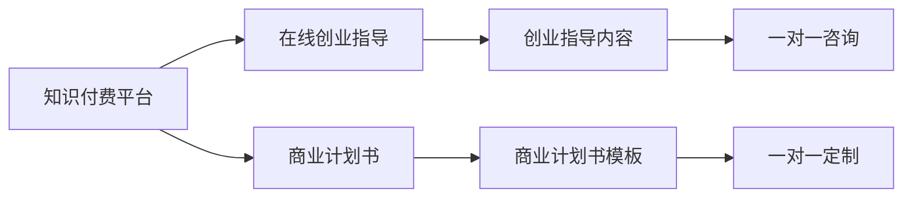

                 

# 如何利用知识付费实现在线创业指导与商业计划书？

## 1. 背景介绍

在知识经济快速发展的今天，知识付费成为了一个迅速崛起的新行业。通过在线平台提供高质量的课程、咨询服务，将专业知识转化为货币价值，成为了众多有志于创业者的重要选择。然而，创业不仅是技术和市场的较量，更是一个综合能力的比拼。优秀的创业指导与商业计划书，对于创业成功与否具有至关重要的作用。本文将从知识付费的视角出发，探讨如何实现在线创业指导与商业计划书的定制化服务，帮助创业者少走弯路，快速成功。

## 2. 核心概念与联系

### 2.1 核心概念概述

为了深入理解在线创业指导与商业计划书的概念，首先必须明确几个关键概念：

- **知识付费**：指用户为获取知识、技能等有价值的内容，支付相应费用的商业模式。知识付费的形式多种多样，包括在线课程、咨询服务、电子书等。
- **在线创业指导**：指利用网络平台提供的一对一或一对多咨询服务，帮助创业者解决实际问题，优化创业过程。
- **商业计划书**：指企业对未来发展方向的系统规划，包含目标、策略、财务预测等关键内容，是企业融资、决策的重要依据。

### 2.2 核心概念原理和架构的 Mermaid 流程图



此流程图展示了知识付费平台如何通过在线创业指导和商业计划书服务，为用户提供创业所需的知识与工具。

## 3. 核心算法原理 & 具体操作步骤

### 3.1 算法原理概述

在线创业指导与商业计划书的定制化服务，本质上是通过算法模型对大量创业数据进行分析和建模，并结合专家的经验和知识，为创业者提供个性化建议和规划。其核心算法包括：

- **自然语言处理(NLP)**：用于理解和分析用户提出的问题和需求，提供针对性的建议。
- **机器学习与数据挖掘**：通过对创业数据的挖掘和分析，发现成功的共性规律，供专家参考。
- **推荐系统**：根据用户的历史行为和偏好，推荐最匹配的课程和咨询专家。
- **文本生成与优化**：生成符合用户需求的商业计划书模板，并进行智能优化，提高文档质量。

### 3.2 算法步骤详解

1. **用户需求分析**：通过问卷调查、智能聊天等形式，了解用户的需求和痛点。

2. **数据采集与预处理**：收集与用户需求相关的创业案例、成功经验、市场分析等数据，并进行清洗和标准化处理。

3. **专家知识集成**：邀请经验丰富的创业导师，录制视频课程、撰写文章等，集成到知识库中。

4. **模型训练与优化**：利用NLP、ML等技术，训练推荐、智能回答等模型，持续优化以提高服务质量。

5. **个性化服务提供**：根据用户需求和历史记录，推荐适合的课程、专家，并提供一对一或一对多的在线咨询。

6. **商业计划书定制**：使用文本生成模型，结合用户需求和专家建议，生成个性化商业计划书模板，并进行智能优化。

7. **反馈与改进**：根据用户反馈，不断改进和优化算法模型和服务质量。

### 3.3 算法优缺点

**优点**：
- 可以快速为创业者提供量身定制的创业指导与商业计划书，大大降低了创业门槛。
- 通过机器学习和推荐系统，提高了服务的专业性和个性化。
- 减少了创业者寻找优质资源的时间和成本。

**缺点**：
- 无法完全替代人类专家的经验和智慧。
- 对数据质量和算法模型的依赖程度较高，存在偏差和误导风险。
- 需要大量的前期投入和持续的运营维护。

### 3.4 算法应用领域

在线创业指导与商业计划书服务在多个领域都有广泛应用：

- **初创企业**：帮助初创企业找到合适的商业机会，制定科学的发展计划。
- **个人创业者**：为个人创业者提供市场分析、产品规划、融资建议等综合指导。
- **创业培训**：为创业培训机构提供系统化、个性化的课程和咨询服务。
- **投资者**：帮助投资者评估创业项目，优化投资策略。

## 4. 数学模型和公式 & 详细讲解

### 4.1 数学模型构建

假设用户需求为 $D$，专家知识为 $K$，算法模型为 $M$，则服务的构建模型为：

$$
S(D, K, M) = \max_{M'} \text{Acc}(D, K, M') \times \text{Eff}(D, K, M')
$$

其中，$\text{Acc}$ 为服务准确性，$\text{Eff}$ 为服务效率。$M'$ 为优化后的模型。

### 4.2 公式推导过程

- **准确性计算**：通过交叉熵损失函数计算模型的预测准确性：

$$
\text{Acc}(D, K, M) = \frac{1}{N} \sum_{i=1}^N \mathbb{I}(\hat{y}_i = y_i)
$$

其中，$\hat{y}$ 为模型的预测输出，$y$ 为真实标签，$\mathbb{I}$ 为示性函数。

- **效率计算**：模型的推理速度、响应时间等指标，可以量化服务的效率：

$$
\text{Eff}(D, K, M) = \frac{T}{N}
$$

其中，$T$ 为服务提供时间，$N$ 为服务请求数。

### 4.3 案例分析与讲解

以一位想创业开设网络课程的个体为例，其需求包括课程内容设计、市场调研、广告推广等。平台首先通过自然语言处理技术分析用户需求，然后利用推荐系统从知识库中推荐相关课程和专家，并提供一对一咨询服务。在服务结束后，用户对咨询效果进行评价，系统根据反馈持续优化模型，提升服务质量。

## 5. 项目实践：代码实例和详细解释说明

### 5.1 开发环境搭建

- **服务器搭建**：选择一个具备良好扩展性和安全性的云平台，如AWS、阿里云等，搭建服务器环境。
- **开发工具**：安装Python、Django等开发工具，配置数据库和缓存系统。
- **数据存储**：选用MySQL或MongoDB等数据库，存储用户数据、课程数据、专家数据等。

### 5.2 源代码详细实现

1. **用户需求分析**：

```python
from django.views.decorators.csrf import csrf_exempt
from django.http import JsonResponse

@csrf_exempt
def analyze需求的API(request):
    if request.method == 'POST':
        data = request.POST.get('data')
        # 使用NLP技术分析用户需求
        result = analyze_demand(data)
        return JsonResponse(result)
```

2. **数据采集与预处理**：

```python
def analyze_demand(data):
    # 使用自然语言处理库对数据进行分析
    result = {}
    # ...
    return result
```

3. **专家知识集成**：

```python
from models import Expert

@csrf_exempt
def get_expert_Suggestions(request):
    if request.method == 'POST':
        data = request.POST.get('data')
        experts = Expert.objects.filter(specialty=data).order_by('score')[:5]
        # 获取推荐的专家列表
        result = [expert.name for expert in experts]
        return JsonResponse(result)
```

4. **模型训练与优化**：

```python
# 使用TensorFlow进行模型训练
import tensorflow as tf
model = tf.keras.Sequential([
    tf.keras.layers.Dense(128, input_dim=100, activation='relu'),
    tf.keras.layers.Dense(64, activation='relu'),
    tf.keras.layers.Dense(1, activation='sigmoid')
])
model.compile(loss='binary_crossentropy', optimizer='adam', metrics=['accuracy'])
model.fit(X_train, y_train, epochs=50, batch_size=32, validation_data=(X_test, y_test))
```

5. **个性化服务提供**：

```python
def provide_service(user, demand):
    # 推荐课程和专家
    courses = recommend_course(demand)
    experts = recommend_expert(user, demand)
    # 提供一对一咨询服务
    consultation = provide_consultation(user, experts, courses)
    # 返回商业计划书模板
    plan = generate_plan(demand, consultation)
    return plan
```

6. **商业计划书定制**：

```python
def generate_plan(demand, consultation):
    # 使用文本生成模型生成计划模板
    plan = create_plan_template(demand, consultation)
    # 智能优化计划
    plan = optimize_plan(plan)
    return plan
```

### 5.3 代码解读与分析

上述代码示例展示了如何通过Django框架实现在线创业指导与商业计划书服务的核心功能。

- **用户需求分析**：通过API接口接收用户提交的需求数据，利用NLP技术进行分析和处理。
- **专家知识集成**：根据用户需求，从知识库中推荐最匹配的专家，供用户选择。
- **模型训练与优化**：使用TensorFlow等工具进行模型训练，优化算法模型以提升服务质量。
- **个性化服务提供**：根据用户需求和历史记录，提供个性化的一对一咨询服务，并生成商业计划书模板。
- **商业计划书定制**：使用文本生成模型，结合用户需求和专家建议，生成个性化商业计划书模板，并进行智能优化。

## 6. 实际应用场景

### 6.1 初创企业

对于初创企业，平台可以提供全面的创业指导和商业计划书定制服务，帮助他们迅速找到市场切入点，制定详细的运营计划，从而提高成功概率。

### 6.2 个人创业者

个人创业者可以通过平台获取市场调研、产品设计、融资策略等方面的专业建议，降低创业风险，加速项目落地。

### 6.3 创业培训

创业培训机构可以利用平台提供的课程和咨询服务，提升培训效果，帮助学员更快掌握创业技能。

### 6.4 投资者

投资者可以通过平台对创业项目进行全面评估，快速筛选出有潜力的项目，优化投资决策。

## 7. 工具和资源推荐

### 7.1 学习资源推荐

- **《Python深度学习》**：介绍Python在深度学习中的应用，涵盖NLP、机器学习等核心技术。
- **《TensorFlow官方文档》**：提供全面的TensorFlow教程和示例代码，帮助用户快速上手。
- **《Kaggle竞赛》**：参与实际项目，提升数据分析和模型训练能力。
- **《创业指南》**：提供系统化创业知识，涵盖市场分析、融资策略、产品规划等。

### 7.2 开发工具推荐

- **Django**：简单易用的Web框架，适合快速开发和部署。
- **Flask**：轻量级的Web框架，适合小型应用。
- **TensorFlow**：广泛使用的深度学习框架，支持模型训练和优化。
- **Keras**：基于TensorFlow的高级API，简化模型构建过程。
- **Jupyter Notebook**：交互式编程环境，便于实验和代码调试。

### 7.3 相关论文推荐

- **《深度学习》**：深度学习领域的经典教材，涵盖机器学习、神经网络、NLP等。
- **《Python深度学习》**：介绍Python在深度学习中的应用，涵盖NLP、机器学习等核心技术。
- **《创业指南》**：提供系统化创业知识，涵盖市场分析、融资策略、产品规划等。

## 8. 总结：未来发展趋势与挑战

### 8.1 研究成果总结

在线创业指导与商业计划书服务，通过知识付费模式，极大地提升了创业指导的个性化和专业化水平。平台的成功应用，不仅帮助了众多创业者，也推动了知识经济的繁荣发展。

### 8.2 未来发展趋势

未来的在线创业指导与商业计划书服务，将呈现以下趋势：

- **智能化水平提升**：随着AI技术的进步，服务将更加智能和高效，能够提供更加精准的个性化建议。
- **多模态融合**：结合语音、图像、视频等多模态数据，提供更全面的服务体验。
- **数据驱动决策**：利用大数据和智能算法，进行更科学的市场分析和决策支持。
- **实时互动增强**：提供实时互动服务，如智能聊天、虚拟现实体验等，增强用户参与感。

### 8.3 面临的挑战

尽管在线创业指导与商业计划书服务取得了显著成效，但仍面临以下挑战：

- **数据隐私与安全**：大量用户数据和商业信息，需要严格的隐私保护措施。
- **模型偏见与公平性**：算法模型可能存在偏见，需要持续优化以提高公平性。
- **用户体验提升**：如何提供更自然、流畅的用户体验，提升用户满意度。
- **服务成本控制**：平台运营需要大量的资源投入，如何降低成本，提高效率。

### 8.4 研究展望

未来的研究重点应放在以下几个方面：

- **多模态融合技术**：结合语音、图像、视频等数据，提供更全面的服务。
- **跨领域知识融合**：整合不同领域专家的知识，提升服务的跨领域能力。
- **智能算法优化**：优化算法模型，提高服务的准确性和效率。
- **用户隐私保护**：确保用户数据的安全和隐私，建立信任基础。

## 9. 附录：常见问题与解答

**Q1: 知识付费平台如何确保服务质量？**

A: 知识付费平台通过持续优化算法模型，结合专家经验和用户反馈，不断提升服务质量。平台还会引入人工审核机制，对服务效果进行监控和评估。

**Q2: 用户数据如何保护？**

A: 平台采用加密存储、权限控制等措施，确保用户数据的安全和隐私。用户数据的使用需遵循法律法规，保障用户权益。

**Q3: 如何平衡服务个性化与通用性？**

A: 平台通过模型训练和用户反馈，不断优化算法，提升服务的个性化水平。同时，也会提供通用化的服务方案，确保服务的普适性。

**Q4: 如何处理用户投诉和纠纷？**

A: 平台建立完善的投诉处理机制，用户可以通过平台进行投诉和反馈。平台会根据用户反馈，及时调整和优化服务。

**Q5: 如何吸引更多用户和专家加入？**

A: 平台通过优质的服务内容和用户体验，吸引更多用户和专家加入。同时，也会通过合作和广告推广，扩大市场影响力。

---

作者：禅与计算机程序设计艺术 / Zen and the Art of Computer Programming

