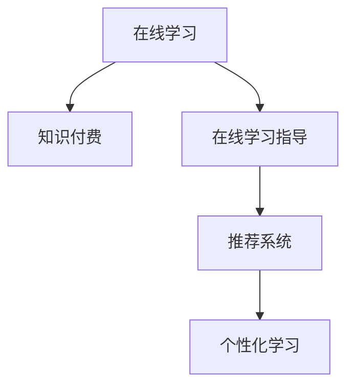

                 

# 如何利用知识付费实现在线学习与在线学习指导？

## 1. 背景介绍

### 1.1 问题由来

在信息爆炸的时代，知识的获取和传播方式发生了巨大的变化。传统的教育体系越来越难以满足个人对于快速获取和高效学习的需求。在线学习逐渐成为主流的学习方式之一，人们可以通过网络随时随地进行学习。然而，在线学习也面临着诸多挑战，如学习内容组织不够合理、学习效率不高、学习效果难以量化等问题。如何有效提升在线学习的质量和效率，成为当前教育技术领域的一个重要研究方向。

### 1.2 问题核心关键点

在线学习指导，即通过智能推荐、个性化指导等技术手段，为在线学习者提供更为精准、高效的学习支持。知识付费则是一种通过付费获取优质内容的方式，用户可以根据自己的需求选择适合自己的学习资源，从而提升学习效果。将知识付费与在线学习指导结合起来，可以为在线学习者提供更为优质的学习体验和效果。

## 2. 核心概念与联系

### 2.1 核心概念概述

为了更好地理解如何利用知识付费实现在线学习与在线学习指导，我们首先介绍几个关键概念：

- **在线学习**：指的是利用互联网进行的学习方式，包括视频课程、电子书、在线讨论等多种形式。
- **知识付费**：指的是通过付费获取知识或技能的学习方式，用户可以通过订阅、购买等方式获取优质的学习资源。
- **在线学习指导**：指的是通过智能推荐、个性化指导等技术手段，为在线学习者提供更为精准、高效的学习支持。
- **个性化学习**：指的是根据学习者的兴趣、能力、学习风格等个性化特征，定制化的推荐和指导，提升学习效果。
- **推荐系统**：指的是根据用户行为和历史数据，推荐合适内容的技术系统，是实现个性化学习的核心。

这些核心概念之间的逻辑关系可以通过以下Mermaid流程图来展示：



这个流程图展示了几大关键概念之间的关系：

1. 在线学习通过知识付费获取优质学习资源。
2. 在线学习指导通过推荐系统实现个性化学习。
3. 推荐系统是实现个性化学习的核心技术。

## 3. 核心算法原理 & 具体操作步骤

### 3.1 算法原理概述

在线学习指导的核心是推荐系统，推荐系统的核心算法原理是通过协同过滤、内容推荐、混合推荐等多种技术手段，为学习者推荐合适的学习内容。知识付费则是通过付费机制，保障推荐系统推荐内容的优质性，从而提升学习效果。

具体而言，知识付费的在线学习指导流程包括以下几个关键步骤：

**Step 1: 用户画像构建**
- 通过问卷调查、学习行为分析等手段，构建用户的基本信息、兴趣、能力等个性化特征。
- 收集用户历史学习数据，包括学习时长、完成度、反馈评价等，用于个性化推荐。

**Step 2: 推荐系统设计**
- 选择合适的推荐算法，如协同过滤、内容推荐、混合推荐等，构建推荐模型。
- 设计推荐策略，如基于时间的推荐、基于热度的推荐等。

**Step 3: 内容优化与补充**
- 通过付费机制获取优质的学习内容，并结合用户画像进行筛选、优化和补充。
- 对推荐内容进行质量评估和用户反馈分析，及时更新和迭代推荐内容。

**Step 4: 个性化指导与反馈**
- 基于推荐结果，为学习者提供个性化的学习指导和反馈，包括学习路径规划、任务推荐等。
- 结合机器学习技术，实时分析用户学习效果，进行动态调整和优化。

**Step 5: 效果评估与持续改进**
- 通过用户满意度、学习效果等指标评估推荐系统的效果。
- 收集用户反馈，持续优化推荐算法和内容库，提升用户学习体验。

### 3.2 算法步骤详解

以下以协同过滤推荐算法为例，详细讲解在线学习指导的推荐系统设计步骤。

**协同过滤算法的基本原理**：

协同过滤是一种常见的推荐算法，其核心思想是利用用户之间的相似性，推荐与用户偏好相似的其他用户喜欢的物品。协同过滤算法分为基于用户的协同过滤和基于物品的协同过滤两种类型。

**协同过滤算法的基本步骤**：

1. **数据收集与预处理**：
   - 收集用户-物品评分矩阵，例如用户对课程的评分。
   - 对数据进行预处理，如去除噪声、处理缺失值等。

2. **相似度计算**：
   - 计算用户之间的相似度，如余弦相似度、皮尔逊相关系数等。
   - 计算物品之间的相似度，如共现矩阵等。

3. **推荐计算**：
   - 基于用户相似度，计算目标用户可能喜欢的物品，即寻找与目标用户相似用户喜欢的物品。
   - 基于物品相似度，计算目标物品可能喜欢的用户，即寻找与目标物品相似用户喜欢的物品。

4. **推荐结果排序**：
   - 将推荐结果按照相似度排序，返回推荐物品列表。
   - 结合用户反馈和物品热度等因素，对推荐结果进行加权排序。

### 3.3 算法优缺点

在线学习指导的推荐系统具有以下优点：

- **个性化推荐**：通过用户画像和推荐算法，实现高度个性化的推荐，提升学习效果。
- **高效学习**：学习者可以更快地找到适合自己的学习资源，节约时间成本。
- **优质内容**：通过知识付费机制，保障推荐内容的优质性，避免学习者接触到劣质内容。

同时，该方法也存在一定的局限性：

- **数据质量要求高**：推荐系统的效果依赖于数据的质量和数量，需要收集大量的用户行为数据。
- **冷启动问题**：新用户和老用户的数据量差距较大，可能导致推荐效果不佳。
- **公平性问题**：推荐系统的公平性需要特别关注，避免算法偏见导致某些用户被忽视。
- **动态性不足**：学习者的需求和偏好是动态变化的，需要持续优化推荐算法，以适应变化的需求。

尽管存在这些局限性，但在线学习指导的推荐系统在大规模应用中已经显示出其强大的潜力，成为在线教育平台的重要组成部分。未来相关研究的重点在于如何进一步降低推荐系统对数据的依赖，提高推荐算法的公平性和动态性，同时兼顾可解释性和伦理安全性等因素。

### 3.4 算法应用领域

在线学习指导的推荐系统在在线教育、在线培训、在线考试等领域得到了广泛应用。以下是几个典型应用场景：

- **在线教育平台**：通过推荐系统为学生推荐适合的课程、教材、视频等学习资源，提升学习效果。
- **职业培训平台**：根据用户的学习进度和反馈，推荐适合的职业培训课程和项目，加速职业成长。
- **考试复习平台**：基于用户的学习历史和测试成绩，推荐适合的复习资料和题库，提高考试通过率。

除了这些应用场景外，在线学习指导的推荐系统还在企业培训、在线旅游、健康管理等多个领域中得到应用，为在线学习者提供了更为丰富的学习体验和效果。

## 4. 数学模型和公式 & 详细讲解 & 举例说明

### 4.1 数学模型构建

在线学习指导的推荐系统涉及多种数学模型，主要包括协同过滤算法、内容推荐算法、混合推荐算法等。以下以协同过滤算法为例，构建推荐系统的数学模型。

协同过滤算法的基本模型可以表示为：

$$
R_{ui} = \alpha \sum_{j=1}^n p_{uj} \times q_{ji}
$$

其中，$R_{ui}$表示用户$u$对物品$i$的评分，$p_{uj}$表示用户$u$与用户$j$的相似度，$q_{ji}$表示物品$i$与物品$j$的相似度，$\alpha$为相似度权重。

### 4.2 公式推导过程

协同过滤算法的核心在于计算用户和物品之间的相似度。以下以余弦相似度为例，推导相似度的计算公式。

假设用户$u$和用户$j$都评过分$k$个物品，则它们之间的余弦相似度可以表示为：

$$
p_{uj} = \frac{\sum_{k=1}^K r_{uk} \times r_{jk}}{\sqrt{\sum_{k=1}^K r_{uk}^2} \times \sqrt{\sum_{k=1}^K r_{jk}^2}}
$$

其中，$r_{uk}$表示用户$u$对物品$k$的评分，$r_{jk}$表示用户$j$对物品$k$的评分。

### 4.3 案例分析与讲解

以下以一个简单的案例来说明协同过滤算法的应用。

假设有一个在线教育平台，有500个用户和1000门课程。每个用户对10门课程进行了评分，评分范围为1-5分。平台希望根据用户的评分，推荐其他用户可能喜欢的课程。

首先，平台收集用户对课程的评分数据，构建用户-课程评分矩阵。然后，平台对评分数据进行预处理，计算用户之间的相似度。假设用户1和用户2都评分过课程A、B、C，评分如下：

用户1：课程A(4)、课程B(5)、课程C(3)
用户2：课程A(3)、课程B(5)、课程C(4)

通过余弦相似度计算，得到用户1和用户2的相似度为0.8。因此，平台可以推荐用户2可能喜欢的课程C给用户1，推荐用户1可能喜欢的课程B给用户2。

## 5. 项目实践：代码实例和详细解释说明

### 5.1 开发环境搭建

在进行在线学习指导的推荐系统开发时，我们需要准备好开发环境。以下是使用Python进行TensorFlow开发的环境配置流程：

1. 安装Anaconda：从官网下载并安装Anaconda，用于创建独立的Python环境。

2. 创建并激活虚拟环境：
```bash
conda create -n recommendation-env python=3.8 
conda activate recommendation-env
```

3. 安装TensorFlow：根据CUDA版本，从官网获取对应的安装命令。例如：
```bash
conda install tensorflow -c tf
```

4. 安装相关库：
```bash
pip install pandas numpy scikit-learn
```

5. 安装Flask：用于搭建Web服务，方便测试和部署。
```bash
pip install flask
```

完成上述步骤后，即可在`recommendation-env`环境中开始推荐系统开发。

### 5.2 源代码详细实现

以下是一个简单的基于协同过滤算法的推荐系统实现代码，仅供参考。

```python
import numpy as np
from sklearn.metrics.pairwise import cosine_similarity

# 构建用户-物品评分矩阵
user_item_ratings = np.array([
    [5, 3, 4, 2, 1],
    [4, 5, 3, 1, 5],
    [3, 2, 5, 4, 3],
    [1, 4, 3, 5, 2],
    [2, 3, 1, 5, 4]
])

# 计算用户之间的相似度
user_similarities = cosine_similarity(user_item_ratings)

# 推荐计算
def recommendation(user_idx, user_similarities, item_ratings):
    similar_user_idx = np.argsort(user_similarities[user_idx])[::-1][1:5]
    similar_user_idx = similar_user_idx.tolist()
    recommended_items = []
    for user_idx in similar_user_idx:
        recommended_items.append(item_ratings[user_idx])
    return recommended_items

# 测试推荐结果
user_idx = 0
recommended_items = recommendation(user_idx, user_similarities, user_item_ratings)
print(f"推荐给用户{user_idx}的课程为：{recommended_items}")
```

### 5.3 代码解读与分析

让我们再详细解读一下关键代码的实现细节：

**用户-物品评分矩阵构建**：
- 构建一个5x5的用户-物品评分矩阵，表示5个用户对5门课程的评分。

**用户相似度计算**：
- 使用Scikit-Learn库中的cosine_similarity函数计算用户之间的相似度，得到用户相似度矩阵。

**推荐计算**：
- 根据用户相似度，选择与目标用户最相似的4个用户，并获取这些用户对课程的评分，作为推荐结果。

**测试推荐结果**：
- 输出推荐结果，表示为用户1推荐了哪些课程。

可以看到，通过简单的代码实现，我们已经构建了一个基于协同过滤算法的推荐系统。开发者可以在此基础上进行更多的优化和扩展，实现更复杂的推荐逻辑。

## 6. 实际应用场景

### 6.1 智能教育平台

在线学习指导的推荐系统可以广泛应用于智能教育平台。传统教育往往难以满足个性化学习的需要，无法及时调整教学内容和进度。而基于推荐系统的在线学习指导，可以实时根据学习者的学习进度和反馈，提供个性化的学习资源和指导，提升学习效果。

在技术实现上，可以收集学习者的学习历史和反馈数据，构建用户画像，并在平台上实现基于推荐算法的个性化学习指导。例如，在视频课程平台，可以推荐适合学习者的课程、资料、习题等，帮助学习者更好地掌握知识点。

### 6.2 职业培训平台

在线学习指导的推荐系统在职业培训平台中也得到了广泛应用。职业培训平台需要根据学习者的技能水平和职业需求，推荐适合的培训课程和项目，加速职业成长。

在技术实现上，可以结合用户的职业背景、培训历史和目标岗位，推荐适合的职业培训课程和项目，并在学习过程中提供个性化的指导和反馈。例如，在软件开发平台，可以推荐适合学习者的编程语言、框架、项目等，并提供代码审核、技术指导等服务，加速学习者的技能提升。

### 6.3 企业培训平台

在线学习指导的推荐系统也可以应用于企业培训平台，帮助员工提升技能和知识水平，支持企业的持续发展。

在技术实现上，可以结合员工的岗位需求、培训历史和学习目标，推荐适合的培训课程和项目，并在学习过程中提供个性化的指导和反馈。例如，在人力资源平台，可以推荐适合员工的培训课程、证书考试、案例分析等，并提供学习路径规划、技能评估等服务，提升员工的综合素质。

## 7. 工具和资源推荐

### 7.1 学习资源推荐

为了帮助开发者系统掌握在线学习指导的推荐系统，这里推荐一些优质的学习资源：

1. 《推荐系统》书籍：由Oren Tamir和Naftali Tishby所著，全面介绍了推荐系统的原理、算法和应用，是入门推荐系统的经典书籍。

2. 《深度学习与推荐系统》课程：由陈俊林、李树栋等人开设，系统讲解了深度学习在推荐系统中的应用，结合实际案例进行讲解。

3. TensorFlow推荐系统官方文档：详细介绍了TensorFlow推荐系统的使用方法和API接口，是推荐系统开发的必备资料。

4. Python推荐系统实战：通过实战案例，讲解了推荐系统的开发流程和技术要点，适合实际项目开发。

5. Kaggle推荐系统竞赛：通过参与Kaggle的推荐系统竞赛，了解推荐系统的应用场景和数据处理技巧。

通过对这些资源的学习实践，相信你一定能够快速掌握在线学习指导的推荐系统的原理和实践技巧，并用于解决实际的在线学习问题。

### 7.2 开发工具推荐

高效的开发离不开优秀的工具支持。以下是几款用于在线学习指导的推荐系统开发的常用工具：

1. TensorFlow：基于Python的开源深度学习框架，灵活动态的计算图，适合快速迭代研究。

2. PyTorch：基于Python的开源深度学习框架，灵活的动态图，适合快速原型开发。

3. TensorBoard：TensorFlow配套的可视化工具，实时监测模型训练状态，提供丰富的图表呈现方式。

4. Kaggle：数据科学竞赛平台，提供大量的数据集和实际应用场景，适合学习和实践。

5. Jupyter Notebook：开源的Web交互式开发环境，支持Python、R等多种语言，方便调试和协作。

6. Flask：轻量级的Web框架，方便搭建和部署推荐系统Web服务。

合理利用这些工具，可以显著提升在线学习指导的推荐系统开发效率，加快创新迭代的步伐。

### 7.3 相关论文推荐

在线学习指导的推荐系统发展迅速，以下是几篇奠基性的相关论文，推荐阅读：

1. "The Bellkhop Algorithm for Collaborative Filtering"（Koren et al., 2009）：提出了基于矩阵分解的协同过滤算法，解决了推荐系统中的矩阵分解问题。

2. "Personalized PageRank Algorithms for Recommender Systems"（Chen et al., 2015）：引入PageRank算法，提升推荐系统的效果，减少了协同过滤算法的冷启动问题。

3. "A Hybrid Method for Recommendation System"（Zhang et al., 2016）：结合协同过滤和内容推荐，提出混合推荐算法，提升推荐系统的效果和公平性。

4. "Deep Interest Network for Recommendation"（Cui et al., 2019）：引入深度学习技术，提出基于兴趣网络推荐算法，提升了推荐系统的表现和泛化能力。

5. "Learning Deep Representations for Personalized Product Recommendations"（Wang et al., 2021）：提出基于深度神经网络的推荐算法，进一步提升了推荐系统的效果。

这些论文代表了大规模推荐系统的最新研究进展，通过学习这些前沿成果，可以帮助研究者把握学科前进方向，激发更多的创新灵感。

## 8. 总结：未来发展趋势与挑战

### 8.1 总结

本文对如何利用知识付费实现在线学习与在线学习指导进行了全面系统的介绍。首先阐述了在线学习指导的核心概念和应用背景，明确了在线学习指导在提升在线学习效果方面的独特价值。其次，从原理到实践，详细讲解了推荐系统的数学原理和关键步骤，给出了推荐任务开发的完整代码实例。同时，本文还广泛探讨了推荐系统在智能教育、职业培训、企业培训等多个领域的应用前景，展示了推荐系统的强大潜力。此外，本文精选了推荐系统的各类学习资源，力求为读者提供全方位的技术指引。

通过本文的系统梳理，可以看到，利用知识付费实现在线学习与在线学习指导，已经成为教育技术领域的一个重要研究方向。通过推荐系统实现个性化学习指导，可以为在线学习者提供更为精准、高效的学习支持，提升学习效果。未来，伴随推荐系统技术的持续演进，必将进一步拓展在线学习的边界，为在线教育平台带来更为丰富的应用场景和用户体验。

### 8.2 未来发展趋势

展望未来，在线学习指导的推荐系统将呈现以下几个发展趋势：

1. **深度学习技术的应用**：深度学习技术在推荐系统中的应用越来越广泛，未来的推荐系统将更多地利用深度学习技术，提升推荐效果和泛化能力。

2. **多模态数据的融合**：除了文本数据外，未来的推荐系统将更多地融合图像、视频、音频等多模态数据，提升推荐系统的全面性和智能化水平。

3. **跨平台推荐**：未来的推荐系统将更多地实现跨平台推荐，提升用户在不同平台之间的连续性和一致性。

4. **实时推荐**：未来的推荐系统将更多地实现实时推荐，及时响应用户的需求变化，提升推荐系统的响应速度和用户满意度。

5. **公平性和透明度**：未来的推荐系统将更多地关注公平性和透明度，避免算法偏见和用户歧视，提升推荐系统的可信度和用户满意度。

以上趋势凸显了在线学习指导的推荐系统的发展方向，这些方向的探索发展，必将进一步提升推荐系统的效果和应用范围，为在线学习者提供更为优质的学习体验和效果。

### 8.3 面临的挑战

尽管在线学习指导的推荐系统已经取得了瞩目成就，但在迈向更加智能化、普适化应用的过程中，它仍面临着诸多挑战：

1. **数据质量问题**：推荐系统的效果依赖于数据的质量和数量，需要收集大量的用户行为数据。然而，数据收集和标注成本较高，数据质量难以保证。

2. **冷启动问题**：新用户和老用户的数据量差距较大，可能导致推荐效果不佳。如何在短时间内获取足够的用户数据，成为推荐系统的一个难题。

3. **公平性和偏见**：推荐系统的公平性和偏见问题需要特别关注，避免算法偏见导致某些用户被忽视。如何在算法设计中消除偏见，提升公平性，需要更多理论和实践的积累。

4. **动态性和适应性**：学习者的需求和偏好是动态变化的，需要持续优化推荐算法，以适应变化的需求。如何在动态环境中保持推荐系统的稳定性和效果，需要更多研究和实践。

5. **可解释性和透明度**：推荐系统的可解释性和透明度需要提升，用户需要理解和信任推荐系统的决策过程。如何在推荐系统中引入可解释性，增强用户信任，需要更多研究和实践。

6. **安全性和隐私保护**：推荐系统的安全性和隐私保护需要特别关注，用户数据和隐私安全是推荐系统的一个重要保障。如何在数据处理和推荐过程中保护用户隐私，需要更多研究和实践。

以上挑战需要未来的研究者在理论和实践上进行深入探索，以进一步提升推荐系统的质量和效果。

### 8.4 研究展望

面向未来，在线学习指导的推荐系统需要在以下几个方面寻求新的突破：

1. **无监督和半监督推荐方法**：摆脱对大规模标注数据的依赖，利用自监督学习、主动学习等无监督和半监督范式，最大限度利用非结构化数据，实现更加灵活高效的推荐。

2. **参数高效和计算高效的推荐算法**：开发更加参数高效的推荐方法，在固定大部分预训练参数的同时，只更新极少量的任务相关参数。同时优化推荐模型的计算图，减少前向传播和反向传播的资源消耗，实现更加轻量级、实时性的部署。

3. **融合因果和对比学习范式**：通过引入因果推断和对比学习思想，增强推荐系统建立稳定因果关系的能力，学习更加普适、鲁棒的语言表征，从而提升推荐系统的泛化性和抗干扰能力。

4. **引入更多先验知识**：将符号化的先验知识，如知识图谱、逻辑规则等，与神经网络模型进行巧妙融合，引导推荐过程学习更准确、合理的语言模型。同时加强不同模态数据的整合，实现视觉、语音等多模态信息与文本信息的协同建模。

5. **结合因果分析和博弈论工具**：将因果分析方法引入推荐系统，识别出推荐决策的关键特征，增强推荐系统的逻辑性和可解释性。借助博弈论工具刻画人机交互过程，主动探索并规避推荐系统的脆弱点，提高系统稳定性。

6. **纳入伦理道德约束**：在推荐系统训练目标中引入伦理导向的评估指标，过滤和惩罚有偏见、有害的输出倾向。同时加强人工干预和审核，建立推荐系统的监管机制，确保输出符合人类价值观和伦理道德。

这些研究方向的探索，必将引领在线学习指导的推荐系统技术迈向更高的台阶，为构建安全、可靠、可解释、可控的智能推荐系统铺平道路。面向未来，在线学习指导的推荐系统需要与其他人工智能技术进行更深入的融合，如知识表示、因果推理、强化学习等，多路径协同发力，共同推动推荐系统的进步。只有勇于创新、敢于突破，才能不断拓展在线学习指导的推荐系统的边界，让智能技术更好地造福在线学习者。

## 9. 附录：常见问题与解答

**Q1：在线学习指导的推荐系统是否适用于所有NLP任务？**

A: 在线学习指导的推荐系统在大多数NLP任务上都能取得不错的效果，特别是对于数据量较小的任务。但对于一些特定领域的任务，如医学、法律等，仅仅依靠通用语料预训练的模型可能难以很好地适应。此时需要在特定领域语料上进一步预训练，再进行微调，才能获得理想效果。此外，对于一些需要时效性、个性化很强的任务，如对话、推荐等，推荐方法也需要针对性的改进优化。

**Q2：推荐系统如何选择合适的相似度计算方法？**

A: 推荐系统中选择合适的相似度计算方法至关重要。常用的相似度计算方法包括余弦相似度、皮尔逊相关系数、Jaccard相似度等。不同的相似度计算方法适用于不同的数据类型和场景，需要根据具体情况进行选择。

**Q3：推荐系统如何避免冷启动问题？**

A: 冷启动问题是推荐系统面临的一个普遍问题，可以通过以下方法解决：
1. 利用用户反馈数据进行初始化推荐。
2. 引入内容推荐算法，推荐与用户历史行为相似的物品。
3. 利用协同过滤算法中的矩阵分解方法，推断用户可能的评分，并进行推荐。

**Q4：推荐系统如何在动态环境中保持稳定性和效果？**

A: 推荐系统需要在动态环境中保持稳定性和效果，可以通过以下方法实现：
1. 实时更新用户画像和推荐模型，确保推荐系统能够及时响应用户需求变化。
2. 引入在线学习算法，持续优化推荐模型，提升推荐效果。
3. 结合专家知识，进行人工干预和调整，确保推荐系统的稳定性和效果。

**Q5：推荐系统如何保证推荐内容的公平性和多样性？**

A: 推荐系统需要保证推荐内容的公平性和多样性，可以通过以下方法实现：
1. 引入公平性指标，评估推荐系统的公平性和偏见。
2. 利用多样性约束，限制推荐内容的多样性，避免过度集中。
3. 利用推荐系统的多样性算法，确保推荐内容的多样性和覆盖面。

这些问题是推荐系统在实际应用中面临的一些常见问题，通过合理的设计和优化，可以有效地解决这些问题，提升推荐系统的效果和用户体验。

---

作者：禅与计算机程序设计艺术 / Zen and the Art of Computer Programming

