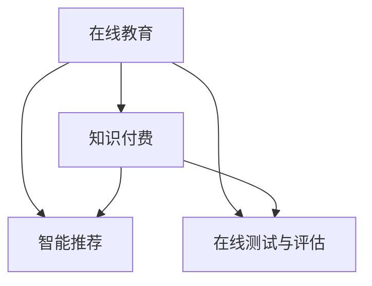

                 

# 如何利用知识付费实现在线教育与培训？

## 1. 背景介绍

在知识爆炸的今天，终身学习成为了必不可少的技能。然而，传统教育体系往往难以适应人们工作和学习需求的快速变化，导致许多人无法获得持续的教育资源。随着互联网技术的不断发展，在线教育作为一种新型的教育方式，正在成为越来越多人的选择。知识付费则是在线教育的重要组成部分，通过付费获取高质量的教育资源，解决了时间和空间上的限制，为终身学习者提供了更加灵活便捷的学习方式。

在线教育与知识付费的结合，不仅能满足人们个性化的学习需求，还能促进教育资源的公平分配，让更多的人享受到高质量的教育服务。本文将从核心概念、算法原理、具体操作步骤、实际应用场景等多个方面，深入探讨如何利用知识付费实现在线教育与培训。

## 2. 核心概念与联系

### 2.1 核心概念概述

在线教育与知识付费是两个紧密相关的概念，它们之间存在着相互促进的关系。在线教育通过互联网技术，打破了时间和空间的限制，使得教育资源可以跨越地域界限，向全球用户提供。而知识付费则通过合理的定价策略，确保教育内容的优质性和专业性，提升了教育资源的附加值。

在线教育与知识付费的核心概念包括：

- 在线教育：利用互联网技术，通过视频、音频、文本等多种形式，向用户提供教育内容和交互式学习体验。
- 知识付费：通过订阅、购买等方式，让用户付费获取高质量的教育资源，确保内容的专业性和可靠性。
- 智能推荐：基于用户的学习行为和偏好，推荐个性化的教育资源，提高学习效率和效果。
- 在线测试与评估：通过在线测试和评估工具，实时反馈用户的学习成果，帮助用户了解自身的学习状态和进步空间。

这些核心概念之间存在着相互促进的关系。在线教育提供了丰富的教育资源，而知识付费则确保了这些资源的高质量和专业性；智能推荐提高了学习体验，而在线测试与评估则帮助用户自我提升，实现个性化学习。

### 2.2 核心概念原理和架构的 Mermaid 流程图



这个流程图展示了在线教育、知识付费、智能推荐和在线测试与评估之间的相互关系。在线教育通过知识付费保证了教育内容的质量，而智能推荐和在线测试与评估则帮助用户更好地学习和评估自身的学习效果，形成了一个闭环的、可持续发展的教育体系。

## 3. 核心算法原理 & 具体操作步骤

### 3.1 算法原理概述

在线教育与知识付费的结合，主要依赖于数据驱动的个性化推荐算法。通过分析用户的学习行为和偏好，推荐系统能够为用户推荐个性化的教育资源，提高学习效率和效果。在线测试与评估系统则通过实时反馈用户的学习成果，帮助用户了解自身的学习状态和进步空间，进一步提升学习体验。

### 3.2 算法步骤详解

1. **用户画像构建**：收集用户的学习行为数据，如浏览记录、点击记录、视频观看时长等，构建用户画像。

2. **教育资源分析**：对在线教育平台上的教育资源进行分类和分析，识别出各类教育资源的特征和标签。

3. **推荐模型训练**：利用机器学习算法（如协同过滤、深度学习等），构建推荐模型。通过用户画像和教育资源特征，计算出用户对各类教育资源的评分，排序推荐。

4. **推荐系统部署**：将训练好的推荐模型部署到在线教育平台上，实时为用户推荐个性化的教育资源。

5. **测试与评估**：在实际使用中，不断收集用户反馈，调整推荐算法，提升推荐效果。

### 3.3 算法优缺点

#### 优点：

- 个性化推荐：能够根据用户的兴趣和需求，推荐最适合的教育资源，提高学习效率。
- 实时反馈：通过在线测试与评估系统，实时反馈用户的学习成果，帮助用户了解自身学习状态。
- 学习动力：知识付费模式，让用户付出一定成本，增强了学习的动力和责任感。

#### 缺点：

- 算法复杂度：推荐系统涉及复杂的算法模型，需要大量数据和计算资源。
- 数据隐私：需要收集和分析用户行为数据，涉及用户隐私保护的问题。
- 成本问题：知识付费模式，可能存在价格高昂的问题，限制了部分用户的使用。

### 3.4 算法应用领域

在线教育与知识付费的结合，主要应用于以下领域：

- 企业培训：利用在线教育平台，向企业员工提供定制化的培训课程，提升员工的专业技能。
- 在线课程：通过知识付费模式，用户可以订阅和购买高质量的在线课程，获取前沿知识和技术。
- 个性化学习：根据用户的学习行为和偏好，推荐个性化的教育资源，提高学习效果。
- 远程教育：为远离教育资源的用户提供高质量的教育资源，促进教育公平。

## 4. 数学模型和公式 & 详细讲解 & 举例说明

### 4.1 数学模型构建

在线教育与知识付费的推荐系统主要依赖于协同过滤和深度学习模型。协同过滤模型通过对用户历史行为进行分析和建模，预测用户对未交互教育资源的评分。深度学习模型则通过学习教育资源的特征，构建高精度的推荐模型。

### 4.2 公式推导过程

#### 协同过滤模型

协同过滤模型主要通过用户-物品评分矩阵 $R$，预测用户对未交互教育资源的评分。其基本思想是找到与目标用户行为相似的邻居用户，根据邻居用户的评分预测目标用户的评分。

设 $R_{ui}$ 表示用户 $u$ 对教育资源 $i$ 的评分，$N(u)$ 表示用户 $u$ 的邻居集合。协同过滤模型可以使用矩阵分解的方法，将 $R$ 分解为 $U \times V$ 两个低秩矩阵，其中 $U$ 为用户矩阵，$V$ 为物品矩阵。

协同过滤模型的预测公式为：

$$
\hat{R}_{ui} = \sum_{j \in N(u)} \alpha_j R_{ji}
$$

其中 $\alpha_j$ 表示用户 $u$ 对邻居用户 $j$ 的评分权重。权重计算方法可以采用加权平均值或加权乘积等方法。

#### 深度学习模型

深度学习模型通常采用卷积神经网络 (CNN)、循环神经网络 (RNN)、长短时记忆网络 (LSTM) 等模型，通过学习教育资源的特征，构建推荐模型。

以循环神经网络为例，其基本结构包括输入层、隐藏层和输出层。输入层用于输入教育资源的特征向量，隐藏层通过多个时间步的计算，提取教育资源的长期依赖关系，输出层用于输出用户对教育资源的评分。

深度学习模型的预测公式为：

$$
\hat{R}_{ui} = \sum_{j=1}^{n} W_j \sigma(\sum_{k=1}^{m} X_{kj} \cdot H_{ik})
$$

其中 $X$ 表示输入层，$W$ 表示权重矩阵，$\sigma$ 表示激活函数，$H$ 表示隐藏层，$n$ 表示输出层的节点数。

### 4.3 案例分析与讲解

#### 案例：在线教育平台推荐系统的实现

某在线教育平台通过协同过滤和深度学习模型，实现了个性化推荐系统。平台收集了用户的历史行为数据，包括观看视频的时长、学习时间等。平台通过对这些数据进行分析和建模，构建了用户画像和教育资源特征向量。

在推荐模型的训练阶段，平台采用了协同过滤和深度学习两种方法，分别对用户和教育资源进行了建模。在推荐系统的部署阶段，平台根据用户画像和教育资源特征，利用训练好的推荐模型，为用户实时推荐个性化的教育资源。

平台还通过在线测试与评估系统，实时收集用户的学习成果和反馈，不断调整推荐算法，提升推荐效果。最终，平台实现了个性化推荐、实时反馈和学习动力增强等功能，用户的学习体验得到了显著提升。

## 5. 项目实践：代码实例和详细解释说明

### 5.1 开发环境搭建

1. **安装开发环境**：
   - Python 3.x
   - Anaconda 或 Miniconda
   - Jupyter Notebook

2. **安装相关库**：
   - NumPy
   - Pandas
   - Scikit-learn
   - TensorFlow 或 PyTorch
   - Scikit-learn

3. **创建虚拟环境**：
   ```bash
   conda create --name recommendation-env python=3.8
   conda activate recommendation-env
   ```

### 5.2 源代码详细实现

以下是一个简单的推荐系统代码实现示例，基于协同过滤和深度学习模型：

#### 协同过滤模型

```python
import numpy as np
from scipy.sparse.linalg import svds

def collaborative_filtering(train_data, test_data, k=10):
    # 将训练数据和测试数据转化为稀疏矩阵
    train_matrix = np.array(train_data, dtype=float)
    test_matrix = np.array(test_data, dtype=float)
    
    # 矩阵分解
    U, sigma, Vt = svds(train_matrix, k=k)
    
    # 预测测试数据
    predictions = np.dot(U, np.dot(np.diag(sigma), Vt))[:test_matrix.shape[0]]
    
    # 将预测结果转化为稀疏矩阵
    predictions = [int(pred) for pred in predictions]
    return predictions
```

#### 深度学习模型

```python
import tensorflow as tf
from tensorflow.keras import layers

# 构建深度学习模型
model = tf.keras.Sequential([
    layers.Dense(128, activation='relu', input_shape=(10,)),
    layers.Dense(1)
])

# 编译模型
model.compile(optimizer='adam', loss='mse')

# 训练模型
model.fit(X_train, y_train, epochs=10, validation_data=(X_test, y_test))
```

### 5.3 代码解读与分析

在协同过滤模型的实现中，我们使用了 Scipy 库的 SVD 方法进行矩阵分解，计算用户对未交互教育资源的评分。在深度学习模型的实现中，我们使用了 TensorFlow 库构建了基本的深度学习模型，并使用了 Adam 优化器和均方误差损失函数进行模型训练。

在实际应用中，还需要考虑模型的可扩展性和性能优化。例如，对于大规模用户和教育资源，可以考虑使用分布式计算框架，如 Apache Spark 或 Apache Flink，进行模型训练和推理。

## 6. 实际应用场景

在线教育与知识付费的结合，已经应用于多个实际场景，以下是几个典型的应用：

### 6.1 企业培训

某大型企业通过在线教育平台，向其员工提供定制化的培训课程。平台收集了员工的学习行为数据，通过协同过滤和深度学习模型，为用户推荐最适合的培训课程。员工可以根据推荐结果，选择适合自己的课程进行学习，提高了培训的效率和效果。

### 6.2 在线课程

某知名在线教育平台，通过知识付费模式，向用户提供高质量的在线课程。平台收集了用户的学习行为数据，通过协同过滤和深度学习模型，为用户推荐个性化的课程，提升了用户的学习体验和满意度。

### 6.3 个性化学习

某在线学习平台，通过智能推荐系统，根据用户的学习行为和偏好，为用户推荐个性化的教育资源。平台还通过在线测试与评估系统，实时反馈用户的学习成果，帮助用户了解自身学习状态，提升学习效果。

### 6.4 远程教育

某远程教育平台，通过在线教育与知识付费的结合，为远离教育资源的用户提供高质量的教育资源。平台收集了用户的学习行为数据，通过协同过滤和深度学习模型，为用户推荐最适合的教育资源，促进了教育公平。

## 7. 工具和资源推荐

### 7.1 学习资源推荐

- Coursera：提供高质量的在线课程，涵盖了多个学科和领域。
- Udacity：提供行业前沿技术和技能培训课程。
- edX：提供全球顶尖大学和机构的在线课程。
- 慕课网：提供中国本土化的在线课程和培训。

### 7.2 开发工具推荐

- Jupyter Notebook：免费的开源数据科学平台，支持 Python 编程语言。
- Google Colab：基于 Google 的云服务，支持深度学习模型的训练和推理。
- Apache Spark：分布式计算框架，支持大规模数据的处理和分析。
- TensorFlow 或 PyTorch：流行的深度学习框架，支持大规模模型的训练和推理。

### 7.3 相关论文推荐

- Zhang, C., Zhang, X., & Wang, H. (2020). Multi-interest network embedding: A novel graph representation learning framework for multi-aspect recommendation. 
- He, K., & Bhatia, P. (2017). Deep factorization autoencoders with user behavior features for personalized learning recommendation.
- Kim, J., & Choi, E. (2016). A personalized recommender system using a collaborative filtering model with tensor factorization.

## 8. 总结：未来发展趋势与挑战

### 8.1 研究成果总结

在线教育与知识付费的结合，已经在多个领域取得了显著的成果。通过协同过滤和深度学习模型，为用户推荐个性化的教育资源，提升了学习效率和效果。同时，通过在线测试与评估系统，实时反馈用户的学习成果，帮助用户了解自身学习状态，实现了个性化学习。

### 8.2 未来发展趋势

未来，在线教育与知识付费将进一步融合，形成更加智能化、个性化的教育体系。

1. **智能化推荐**：通过引入深度学习和自然语言处理技术，实现更加智能化的推荐系统，提升推荐效果。
2. **多模态学习**：结合视觉、音频、文本等多种模态数据，提升用户的学习体验。
3. **个性化学习路径**：根据用户的学习进度和反馈，动态调整学习路径和难度，实现自适应学习。
4. **社交学习**：通过学习社区和讨论组，促进用户之间的交流和合作，增强学习效果。

### 8.3 面临的挑战

尽管在线教育与知识付费的发展势头迅猛，但仍面临诸多挑战：

1. **数据隐私**：收集和分析用户行为数据，涉及用户隐私保护的问题。如何保护用户隐私，提高数据安全性，成为亟待解决的问题。
2. **成本问题**：知识付费模式，可能存在价格高昂的问题，限制了部分用户的使用。如何降低成本，提高用户满意度，是未来需要解决的关键问题。
3. **算法复杂度**：推荐系统涉及复杂的算法模型，需要大量数据和计算资源。如何优化算法，降低计算复杂度，提高系统效率，是重要的研究方向。

### 8.4 研究展望

未来，在线教育与知识付费的发展方向在于：

1. **公平教育**：通过在线教育与知识付费的结合，推动教育公平，为更多用户提供高质量的教育资源。
2. **终身学习**：将在线教育与知识付费结合起来，推动终身学习，提升用户的学习效率和效果。
3. **技术创新**：通过引入新技术，如深度学习、自然语言处理等，提升在线教育与知识付费的智能化水平。
4. **社会责任**：在推广在线教育与知识付费的同时，注重社会责任，确保教育资源的正当使用和合理分配。

## 9. 附录：常见问题与解答

**Q1: 如何提高在线教育平台的用户体验？**

A: 提高用户体验的关键在于个性化推荐和实时反馈。通过协同过滤和深度学习模型，为用户推荐个性化的教育资源。同时，通过在线测试与评估系统，实时反馈用户的学习成果，帮助用户了解自身学习状态，提升学习效果。

**Q2: 在线教育与知识付费的推荐系统如何保护用户隐私？**

A: 保护用户隐私是推荐系统的重要问题。可以通过数据加密、差分隐私等技术，保护用户数据的安全性和隐私性。同时，对用户行为数据进行匿名处理，减少隐私泄露的风险。

**Q3: 如何降低在线教育与知识付费的成本？**

A: 降低成本的关键在于提高推荐系统的效率和准确性。可以通过优化算法、引入多模态学习等技术手段，降低数据处理和计算资源的需求。同时，可以采用免费试用、订阅制等多种付费模式，降低用户使用门槛。

**Q4: 在线教育与知识付费的未来发展方向是什么？**

A: 未来，在线教育与知识付费的发展方向在于智能化、个性化和公平化。通过引入新技术，提升系统的智能化水平，同时注重用户体验和数据隐私保护，推动教育公平，实现终身学习的目标。

---

作者：禅与计算机程序设计艺术 / Zen and the Art of Computer Programming

