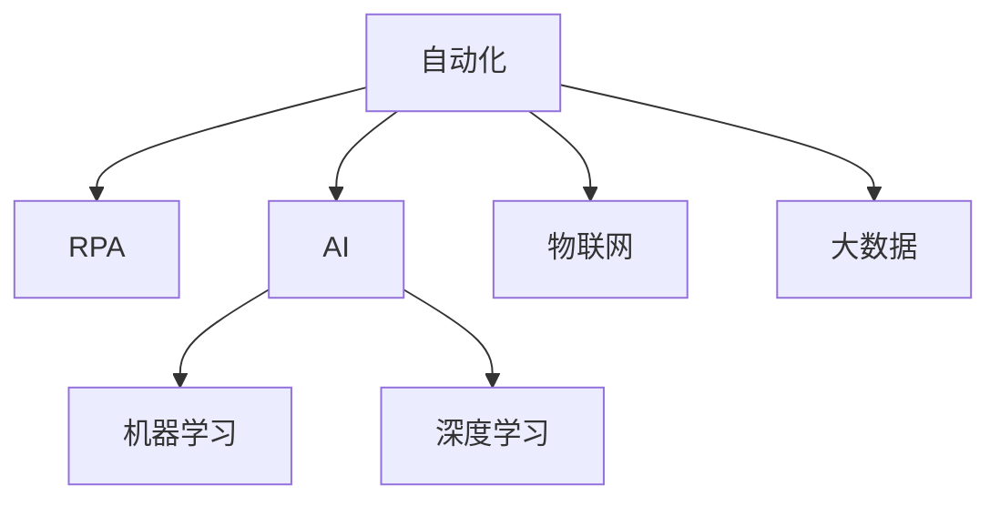

                 

# 如何在自动化创业中实现规模化增长

## 1. 背景介绍

随着技术的飞速发展，自动化创业成为了许多企业新的增长引擎。无论是制造业、服务业，还是软件行业，自动化不仅能大幅提高生产效率、降低运营成本，还能快速响应市场需求，推动业务持续增长。然而，自动化创业并非易事，需要企业在技术、业务、管理等多个方面进行协同创新。本文将围绕自动化创业中的核心问题进行探讨，包括自动化流程的构建、智能决策系统的部署、组织管理与人力资源的优化，以及未来技术发展的趋势。

### 1.1 问题由来

自动化创业的成功与否，很大程度上取决于企业在技术落地、业务适配和管理协调方面的能力。当前，自动化技术已经渗透到各行各业，但如何将这些技术应用到具体的业务场景中，并在快速变化的市场环境中保持竞争优势，依然是许多企业的难题。为此，本文将从技术、业务和管理三个维度，探讨自动化创业的实施策略，并分析其中面临的挑战和应对措施。

## 2. 核心概念与联系

### 2.1 核心概念概述

为更好地理解自动化创业的过程，本节将介绍几个密切相关的核心概念：

- 自动化(Automation)：指利用各种技术手段，自动完成原本由人工完成的任务，以提高效率和降低成本。
- 机器人流程自动化(Robotic Process Automation, RPA)：通过软件机器人模拟人工操作，自动执行重复性、规则性强的工作。
- 人工智能(Artificial Intelligence, AI)：赋予计算机系统感知、学习、推理和决策能力的技术。
- 机器学习(Machine Learning, ML)：使计算机通过数据训练，自动优化模型参数，实现预测和决策能力。
- 深度学习(Deep Learning, DL)：一种特殊的机器学习，通过多层神经网络模型，学习数据中的复杂模式。
- 物联网(IoT)：通过传感器、网络等手段，将物理设备连接起来，实现信息的自动采集和传输。
- 大数据(Big Data)：指规模大、多样化的数据集合，通过数据分析和处理，提取有价值的信息。

这些核心概念之间的逻辑关系可以通过以下Mermaid流程图来展示：



这个流程图展示了一个自动化创业的基本框架，其中：

1. 自动化是自动化创业的起点，涵盖了从流程自动化到智能决策的多个层面。
2. RPA是自动化创业的基础，适合处理规则明确的重复任务。
3. AI和机器学习则是自动化创业的高级形式，通过智能算法提升决策的准确性和效率。
4. 深度学习是大数据和AI结合的产物，能够处理更复杂的数据模式。
5. 物联网和大数据为自动化创业提供了丰富的数据来源和处理平台，进一步支持AI和机器学习的训练和应用。

## 3. 核心算法原理 & 具体操作步骤

### 3.1 算法原理概述

自动化创业的核心在于将各种技术手段集成到业务流程中，实现自动化和智能化。其基本原理是通过数据驱动，构建自动化流程和智能决策系统，从而提升业务效率和竞争力。

具体而言，自动化创业包括以下几个关键步骤：

1. 流程分析与设计：通过业务流程分析，识别可自动化处理的环节，设计自动化流程。
2. 技术选择与集成：根据自动化需求，选择合适的技术手段，集成到业务系统中。
3. 数据采集与处理：通过传感器、网络等手段，收集业务数据，并进行预处理。
4. 模型训练与优化：利用机器学习或深度学习算法，训练模型并进行参数优化。
5. 系统部署与监控：将自动化流程和智能决策系统部署到生产环境，并进行实时监控和调优。

### 3.2 算法步骤详解

以一家制造企业的自动化创业为例，下面详细介绍各个步骤的详细步骤：

**Step 1: 流程分析与设计**

通过对制造企业的生产流程进行详细分析，识别出可以自动化的环节，如物料搬运、设备监控、质量检测等。在设计自动化流程时，需要考虑以下因素：

- 自动化程度：判断哪些任务适合自动化处理，哪些任务需要人工干预。
- 技术成熟度：评估现有技术手段的可用性和成熟度，选择合适的技术方案。
- 成本效益：分析自动化的成本和收益，确保自动化投资回报率合理。

**Step 2: 技术选择与集成**

根据流程分析结果，选择合适的技术手段，进行集成部署。例如，对于物料搬运任务，可以选择基于机器人的自动化方案；对于设备监控任务，可以选择基于传感器和物联网的自动化方案。集成过程中需要注意：

- 数据接口：确保各系统间的数据接口开放和互通。
- 兼容性：确保新系统与现有系统的兼容性，避免数据和功能冲突。
- 安全性：确保自动化系统的数据安全和隐私保护。

**Step 3: 数据采集与处理**

自动化创业需要大量数据支撑，因此需要构建数据采集和处理机制。例如，通过传感器采集设备运行数据，通过物联网采集环境数据，通过大数据分析平台进行数据清洗和处理。在数据采集和处理过程中，需要注意：

- 数据质量：确保数据准确、完整、一致，避免数据噪声和缺失。
- 数据安全：确保数据采集和处理过程中的安全防护，防止数据泄露和篡改。
- 数据存储：选择合适的数据存储方案，支持大规模数据存储和查询。

**Step 4: 模型训练与优化**

基于采集到的数据，训练机器学习或深度学习模型，并进行参数优化。例如，对于质量检测任务，可以训练一个基于卷积神经网络的检测模型，进行图像识别和质量判定。在模型训练和优化过程中，需要注意：

- 数据标注：确保训练数据标注准确，避免模型过拟合和欠拟合。
- 模型选择：选择合适的模型架构和算法，根据任务需求进行调整。
- 超参数调优：通过交叉验证等方法，优化模型的超参数，提升模型性能。

**Step 5: 系统部署与监控**

将自动化流程和智能决策系统部署到生产环境，并进行实时监控和调优。例如，在设备监控系统中，部署自动化的传感器和控制系统，实时监测设备运行状态，并根据实时数据进行决策和控制。在部署和监控过程中，需要注意：

- 系统可靠性：确保自动化系统稳定运行，避免单点故障。
- 性能优化：优化系统性能，确保数据处理和决策响应速度。
- 用户培训：对操作人员进行培训，确保其能够熟练使用自动化系统。

### 3.3 算法优缺点

自动化创业的算法有以下优点：

1. 提高效率：自动化流程和智能决策系统能够大幅提高业务处理效率，降低人工成本。
2. 降低错误率：通过机器学习或深度学习算法，减少人为错误和决策偏差。
3. 灵活性强：可以根据业务需求灵活调整自动化流程和算法，快速适应市场变化。
4. 数据驱动：自动化创业能够利用数据进行智能决策，提升业务决策的科学性和准确性。

但同时也存在以下缺点：

1. 初始投入高：自动化创业需要大量资金和技术投入，初期成本较高。
2. 技术门槛高：自动化创业涉及多种技术手段，对技术团队要求较高。
3. 数据依赖性强：自动化创业依赖大量数据支持，数据采集和处理需要时间和资源投入。
4. 系统复杂度高：自动化创业需要构建复杂的系统架构，系统维护和升级难度较大。

### 3.4 算法应用领域

自动化创业的应用领域非常广泛，包括但不限于以下几个方面：

- 制造业：通过机器人流程自动化和智能制造系统，提高生产效率和产品质量。
- 服务业：通过聊天机器人、客户服务系统等，提升客户体验和运营效率。
- 金融业：通过算法交易、风险管理等系统，提高金融决策的准确性和效率。
- 零售业：通过库存管理系统、推荐系统等，优化供应链管理和客户推荐。
- 物流业：通过智能仓储、智能运输等系统，提高物流效率和成本控制。

## 4. 数学模型和公式 & 详细讲解 & 举例说明

### 4.1 数学模型构建

假设某制造企业有一个自动化生产线，其生产流程包括物料搬运、设备监控和质量检测三个环节。我们需要构建一个基于机器学习的自动化系统，实现对物料搬运的自动化控制，设备监控的智能决策，以及质量检测的自动化检测。

- 物料搬运：使用机器人流程自动化技术，通过传感器和控制系统，自动搬运物料。
- 设备监控：使用物联网技术，通过传感器采集设备运行数据，训练机器学习模型进行实时监控和预警。
- 质量检测：使用卷积神经网络进行图像识别，检测产品质量。

### 4.2 公式推导过程

以设备监控为例，推导基于机器学习模型的设备监控系统的构建过程。

假设设备监控系统的输入为设备运行数据 $x$，输出为设备状态 $y$。可以使用以下线性回归模型进行训练和预测：

$$
y = wx + b
$$

其中 $w$ 为模型参数，$b$ 为截距，$x$ 为输入特征向量，$y$ 为输出状态。

通过最小二乘法，求解最优参数 $w$ 和 $b$：

$$
\min_{w,b} \frac{1}{N}\sum_{i=1}^N (y_i - wx_i - b)^2
$$

采用梯度下降法进行参数优化：

$$
w \leftarrow w - \eta \nabla_{w} \frac{1}{N}\sum_{i=1}^N (y_i - wx_i - b)^2
$$
$$
b \leftarrow b - \eta \nabla_{b} \frac{1}{N}\sum_{i=1}^N (y_i - wx_i - b)^2
$$

其中 $\eta$ 为学习率，$\nabla_{w}$ 和 $\nabla_{b}$ 分别为 $w$ 和 $b$ 的梯度。

### 4.3 案例分析与讲解

以一家制造企业的设备监控系统为例，详细讲解模型的构建和优化过程。

假设制造企业有100台设备，每天采集1000个运行数据。我们选择了其中10台设备的数据作为训练集，剩余90台设备的数据作为测试集。通过随机梯度下降法，对模型进行训练，并使用测试集进行验证。

首先，进行数据预处理，将原始数据标准化，去除噪声和异常值。然后，利用线性回归模型进行训练，求解最优参数 $w$ 和 $b$。最后，使用测试集验证模型性能，并根据验证结果调整参数。

## 5. 项目实践：代码实例和详细解释说明

### 5.1 开发环境搭建

在进行自动化创业实践前，我们需要准备好开发环境。以下是使用Python进行Scikit-learn开发的环境配置流程：

1. 安装Anaconda：从官网下载并安装Anaconda，用于创建独立的Python环境。

2. 创建并激活虚拟环境：
```bash
conda create -n automate_env python=3.8 
conda activate automate_env
```

3. 安装Scikit-learn和其他必要的依赖：
```bash
conda install scikit-learn numpy pandas matplotlib
```

完成上述步骤后，即可在`automate_env`环境中开始自动化创业的开发实践。

### 5.2 源代码详细实现

下面我们以设备监控系统为例，给出使用Scikit-learn库对机器学习模型进行开发的PyTorch代码实现。

```python
import numpy as np
from sklearn.linear_model import LinearRegression

# 假设设备运行数据
x = np.array([[0.1, 0.2, 0.3], [0.4, 0.5, 0.6], [0.7, 0.8, 0.9]])
y = np.array([0.2, 0.4, 0.6])

# 构建线性回归模型
model = LinearRegression()

# 训练模型
model.fit(x, y)

# 预测设备状态
new_data = np.array([[0.5, 0.6, 0.7]])
prediction = model.predict(new_data)

print(prediction)
```

在这个代码示例中，我们使用Scikit-learn库构建了一个线性回归模型，并利用设备运行数据进行了训练。最后，使用训练好的模型对新的设备运行数据进行预测。

### 5.3 代码解读与分析

让我们再详细解读一下关键代码的实现细节：

- 首先，我们使用NumPy库创建了一个假设的设备运行数据集。
- 然后，利用Scikit-learn库中的`LinearRegression`类，构建了一个线性回归模型。
- 通过`fit`方法，使用设备运行数据对模型进行了训练。
- 最后，利用训练好的模型对新的设备运行数据进行预测，并输出预测结果。

## 6. 实际应用场景

### 6.1 制造业

自动化创业在制造业中的应用非常广泛，可以帮助企业提升生产效率和产品质量，降低生产成本。例如，某机械制造企业通过自动化系统实现了生产线上的物料搬运和质量检测，大幅提高了生产效率和产品质量。具体实现步骤如下：

1. 分析生产流程，识别自动化环节，如物料搬运、设备监控、质量检测等。
2. 选择合适的自动化技术手段，如机器人流程自动化、传感器监测、图像识别等。
3. 采集和处理生产数据，构建数据存储和处理平台。
4. 训练和部署机器学习模型，实现自动化决策和控制。
5. 实时监控和调优自动化系统，确保生产过程稳定运行。

### 6.2 服务业

自动化创业在服务业中的应用也非常广泛，可以帮助企业提升客户体验和运营效率。例如，某金融服务公司通过自动化系统实现了客户服务聊天机器人，提高了客户满意度和服务效率。具体实现步骤如下：

1. 分析客户服务流程，识别自动化环节，如客户咨询、投诉处理等。
2. 选择合适的自动化技术手段，如自然语言处理、语音识别等。
3. 采集和处理客户服务数据，构建数据存储和处理平台。
4. 训练和部署机器学习模型，实现自动化回答和决策。
5. 实时监控和调优自动化系统，确保客户服务质量。

### 6.3 未来应用展望

未来，自动化创业的应用领域还将不断扩展，涉及更多的行业和场景。以下是一些潜在的应用场景：

1. 医疗行业：通过自动化系统实现电子病历管理、智能诊断等，提升医疗服务效率和诊断准确性。
2. 教育行业：通过自动化系统实现智能教学、作业批改等，提升教育资源利用率和教学质量。
3. 交通行业：通过自动化系统实现智能交通管理、自动驾驶等，提升交通运行效率和安全。
4. 农业行业：通过自动化系统实现智能农业管理、农产品质量检测等，提升农业生产效率和产品质量。

## 7. 工具和资源推荐

### 7.1 学习资源推荐

为了帮助开发者系统掌握自动化创业的理论基础和实践技巧，这里推荐一些优质的学习资源：

1. 《Python深度学习》系列书籍：全面介绍深度学习和机器学习的基本概念和实践技巧。
2. Udacity《机器人流程自动化》课程：讲解RPA技术的原理和实践方法，适合初学者入门。
3. Coursera《人工智能导论》课程：由斯坦福大学教授讲解，涵盖AI和机器学习的基本概念和前沿技术。
4. Kaggle数据科学竞赛平台：提供大量的数据集和竞赛任务，适合练习数据处理和机器学习模型训练。
5. ArXiv论文库：涵盖AI和机器学习领域的最新研究成果，适合深入学习和研究。

通过对这些资源的学习实践，相信你一定能够快速掌握自动化创业的精髓，并用于解决实际的业务问题。

### 7.2 开发工具推荐

高效的开发离不开优秀的工具支持。以下是几款用于自动化创业开发的常用工具：

1. Python：基于Python的自动化创业工具，易用性强，库资源丰富。
2. Scikit-learn：用于机器学习和数据处理的工具库，适合构建自动化决策系统。
3. TensorFlow：用于深度学习和模型训练的工具库，支持大规模数据处理和模型优化。
4. Jupyter Notebook：交互式的开发环境，支持代码编写、数据可视化等，适合原型设计和实验。
5. Ansible：用于自动化系统部署和配置的工具，适合大规模自动化系统的部署和维护。

合理利用这些工具，可以显著提升自动化创业任务的开发效率，加快创新迭代的步伐。

### 7.3 相关论文推荐

自动化创业的研究源于学界的持续研究。以下是几篇奠基性的相关论文，推荐阅读：

1. "A Survey on Robotic Process Automation"：总结了RPA技术的发展现状和应用场景，适合了解RPA的基本概念和实践。
2. "Machine Learning Yearning"：深入讲解了机器学习项目开发和实践中的关键问题，适合深入学习和理解机器学习技术的实施细节。
3. "Towards Explanation and Generalization of Deep Learning in Clinical Diagnosis"：探讨了深度学习在医疗诊断中的应用，并提出了提升模型可解释性的方法，适合理解AI技术在实际应用中的挑战和解决方案。
4. "AlphaGo Zero"：介绍了AlphaGo Zero算法，利用深度强化学习实现了高水平的围棋对弈，展示了AI技术的最新进展和潜力。
5. "AutoML: Opportunities and Challenges"：探讨了自动机器学习(AutoML)的发展现状和未来方向，适合了解自动化创业技术的前沿进展。

这些论文代表了大自动化创业技术的发展脉络。通过学习这些前沿成果，可以帮助研究者把握学科前进方向，激发更多的创新灵感。

## 8. 总结：未来发展趋势与挑战

### 8.1 总结

本文对自动化创业中的核心问题进行了详细探讨，涵盖流程分析、技术选择、数据处理、模型训练和系统部署等方面。通过对这些环节的深入分析，可以看出，自动化创业的核心在于通过数据驱动，构建自动化流程和智能决策系统，从而提升业务效率和竞争力。

通过本文的系统梳理，可以看到，自动化创业的实施策略涵盖了技术、业务和管理多个方面，需要企业在不同维度上进行协同创新。未来，随着自动化技术的不断发展和成熟，自动化创业将在更多的行业和场景中得到应用，为经济发展和社会进步带来深远影响。

### 8.2 未来发展趋势

展望未来，自动化创业的发展趋势将呈现以下几个方面：

1. 自动化水平不断提高：随着技术进步和应用场景的拓展，自动化创业将逐步实现全业务链条的高水平自动化。
2. 智能化程度不断提升：通过引入AI和机器学习技术，自动化创业将实现更精准、更灵活的决策和控制。
3. 数据驱动的决策：自动化创业将更加依赖于数据驱动，通过数据挖掘和分析，提升决策的科学性和准确性。
4. 多模态融合：未来的自动化创业将更多地融合多种数据模态，如图像、语音、文本等，实现多模态数据协同建模。
5. 持续学习和优化：自动化创业将具备持续学习的能力，能够根据业务需求和市场变化，不断优化自动化流程和决策模型。
6. 边缘计算的应用：未来的自动化创业将更多地应用边缘计算技术，提升数据处理和决策的速度和效率。

### 8.3 面临的挑战

尽管自动化创业的发展前景广阔，但仍面临诸多挑战：

1. 技术成熟度：目前自动化创业中的许多技术手段还不够成熟，需要进一步研发和完善。
2. 数据质量和数量：数据质量和数量不足，可能影响自动化创业的效果。
3. 成本和收益：自动化创业需要大量资金和技术投入，如何平衡成本和收益是一个重要问题。
4. 标准化和规范：自动化创业需要建立统一的标准和规范，避免不同系统间的互操作性问题。
5. 安全和隐私：自动化创业涉及大量数据，需要加强数据安全和隐私保护。
6. 人才需求：自动化创业需要大量具有技术背景的人才，如何吸引和培养人才是一个重要问题。

### 8.4 研究展望

面对自动化创业所面临的挑战，未来的研究需要在以下几个方面寻求新的突破：

1. 研发新型自动化技术：开发更加高效、灵活和智能的自动化技术手段，提升自动化创业的效果。
2. 加强数据采集和处理：建立更完善的数据采集和处理机制，提升数据的可用性和质量。
3. 优化自动化创业模型：通过算法优化和模型改进，提升自动化创业的决策准确性和效率。
4. 提升系统安全性和可靠性：加强系统安全防护，确保自动化创业系统的稳定运行。
5. 建立统一的标准和规范：制定自动化创业的标准和规范，促进自动化系统的互操作性。
6. 培养自动化创业人才：通过教育和培训，培养具备技术背景和业务理解的专业人才，支持自动化创业的发展。

这些研究方向将为自动化创业技术的不断演进提供新的动力，推动自动化创业在更多行业和场景中得到应用，为社会和经济带来深远影响。

## 9. 附录：常见问题与解答

**Q1：自动化创业的初始投入是否过高？**

A: 是的，自动化创业的初始投入较高，需要大量的资金和技术资源。但长期来看，自动化创业能够大幅提升效率和降低成本，带来更高的收益。因此，在决策时需要平衡初始投入和长远效益，确保自动化创业的可行性和可持续性。

**Q2：如何选择合适的自动化技术手段？**

A: 选择合适的自动化技术手段需要综合考虑以下因素：
1. 业务需求：根据业务需求，选择适合的自动化技术，如RPA、传感器监测、图像识别等。
2. 技术成熟度：选择成熟度较高的技术手段，确保技术实施的可靠性和稳定性。
3. 成本效益：考虑技术的成本效益，避免过度投入。

**Q3：数据采集和处理需要注意哪些问题？**

A: 数据采集和处理需要注意以下问题：
1. 数据质量：确保数据的准确性、完整性和一致性，避免数据噪声和缺失。
2. 数据安全：保护数据隐私和安全，避免数据泄露和篡改。
3. 数据存储：选择合适的数据存储方案，确保数据的高效读写和长期保存。

**Q4：自动化创业的系统部署和维护需要注意哪些问题？**

A: 系统部署和维护需要注意以下问题：
1. 系统可靠性：确保系统稳定运行，避免单点故障。
2. 性能优化：优化系统性能，确保数据处理和决策响应速度。
3. 用户培训：对操作人员进行培训，确保其能够熟练使用自动化系统。
4. 系统监控：实时监控系统运行状态，及时发现和解决问题。

**Q5：自动化创业的未来发展方向是什么？**

A: 自动化创业的未来发展方向包括但不限于以下几个方面：
1. 全业务链条自动化：实现从订单接收、生产制造到售后服务的全业务链条自动化。
2. 智能化决策：引入AI和机器学习技术，提升决策的精准性和效率。
3. 多模态融合：实现图像、语音、文本等多种数据模态的协同建模。
4. 持续学习和优化：具备持续学习的能力，能够根据业务需求和市场变化，不断优化自动化流程和决策模型。
5. 边缘计算应用：引入边缘计算技术，提升数据处理和决策的速度和效率。

这些方向将推动自动化创业技术不断演进，为更多行业和场景带来变革性影响。

