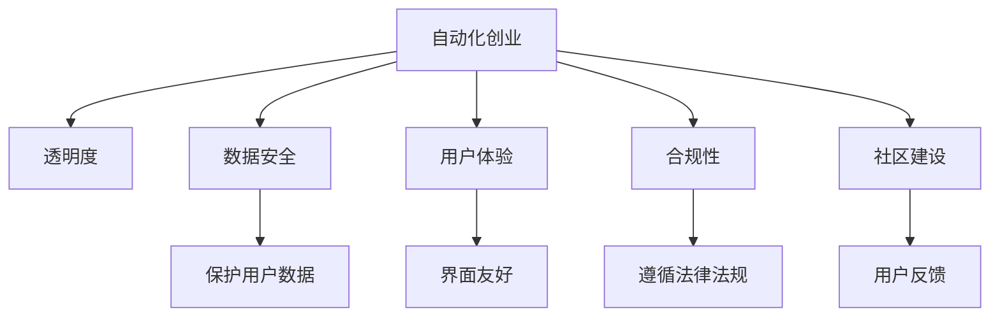

                 

# 如何在自动化创业中建立用户信任

> 关键词：自动化创业,用户信任,信任机制,用户体验,透明度,数据安全,合规性,社区建设

## 1. 背景介绍

### 1.1 问题由来
在数字化和智能化的浪潮下，自动化技术正迅速渗透各行各业，成为推动创新和提高效率的重要驱动力。然而，自动化技术的快速发展也带来了新的挑战：如何在自动化创业中建立和维护用户的信任，成为了影响企业成功的关键因素。

近年来，随着智能客服、智能投顾、智能制造等自动化解决方案的普及，越来越多的用户开始依赖自动化系统来处理日常事务。然而，由于技术复杂性、数据安全等问题，部分用户对自动化系统存在疑虑和担忧，导致信任危机频发。如何在自动化创业中建立用户信任，成为众多企业面临的重要课题。

### 1.2 问题核心关键点
建立用户信任需要综合考虑技术可靠性、数据安全、透明度、用户体验、合规性等多个方面。自动化创业要想成功，必须解决好以下核心关键点：

- **透明度**：用户需要了解自动化系统的决策过程和数据使用方式，确保系统行为透明。
- **数据安全**：保护用户数据隐私，防止数据泄露和滥用。
- **用户体验**：提供友好的交互界面和流畅的使用体验，提升用户满意度。
- **合规性**：遵循行业标准和法律法规，避免法律风险。
- **社区建设**：建立用户反馈机制和社区，持续改进产品和服务。

## 2. 核心概念与联系

### 2.1 核心概念概述

要解决上述问题，首先需要理解自动化创业中的核心概念及其相互关系。以下将详细介绍这些关键概念：

- **自动化创业**：指利用自动化技术进行产品创新和服务优化的创业模式，如智能客服、智能投顾、自动化生产线等。
- **用户信任**：指用户对自动化系统的可靠性和安全性有信心，愿意使用和推荐该系统。
- **透明度**：指自动化系统的决策过程和数据使用方式公开、可验证，用户可以清晰了解系统行为。
- **数据安全**：指保护用户数据隐私和安全性，防止数据泄露和滥用。
- **用户体验**：指用户在使用自动化系统时感受到的交互流畅度、界面友好度、功能易用性等。
- **合规性**：指自动化系统符合行业标准和法律法规，避免法律风险。
- **社区建设**：指通过建立用户反馈机制和社区，与用户互动，持续改进产品和服务。

这些概念之间的逻辑关系可以通过以下Mermaid流程图来展示：



这个流程图展示了大规模语言模型的核心概念及其之间的关系：

1. 自动化创业通过实现透明、安全的自动化解决方案，提升用户体验，增强合规性，同时建立社区，以建立和维护用户信任。
2. 透明度、数据安全、用户体验、合规性、社区建设共同构成用户信任的基础。
3. 透明度增强用户的理解，数据安全保护用户的隐私，用户体验提升用户满意度，合规性避免法律风险，社区建设增强用户参与感。

## 3. 核心算法原理 & 具体操作步骤
### 3.1 算法原理概述

建立用户信任的核心算法原理是利用透明性和用户参与机制，提升系统透明度和用户体验。具体来说，自动化创业应遵循以下几个基本原则：

1. **透明性原则**：系统应提供详细的决策依据和数据使用说明，确保用户了解系统的工作原理和数据流向。
2. **参与性原则**：用户应有机会了解和影响系统行为，如通过用户反馈机制、社区建设等方式，参与系统优化。
3. **安全保护原则**：系统应严格遵守数据安全标准，确保用户数据隐私和安全性。
4. **合规性原则**：系统应符合行业标准和法律法规，避免法律风险。
5. **用户体验原则**：系统应提供友好的交互界面和流畅的使用体验，提升用户满意度。

### 3.2 算法步骤详解

建立用户信任的算法步骤主要包括：

**Step 1: 准备透明性机制**
- 设计清晰的决策过程，将决策依据和数据流向公开展示。
- 开发详细的用户手册和操作指南，供用户参考。
- 使用自然语言处理技术生成自然流畅的解释性文本，解释系统行为。

**Step 2: 实施数据安全措施**
- 采用最新的加密技术，保护用户数据隐私。
- 严格控制数据访问权限，确保数据只被授权人员和系统访问。
- 定期进行安全审计，及时发现和修补安全漏洞。

**Step 3: 提升用户体验**
- 设计直观易用的交互界面，减少用户学习成本。
- 使用用户反馈机制收集用户意见，持续改进产品功能。
- 提供个性化的推荐和建议，提升用户粘性。

**Step 4: 确保合规性**
- 遵循行业标准和法律法规，如GDPR、HIPAA等。
- 定期进行合规性审查，确保系统符合最新法规要求。
- 与法律顾问合作，制定合规性策略。

**Step 5: 建立社区和反馈机制**
- 设立用户反馈渠道，定期收集用户意见和建议。
- 建立社区平台，鼓励用户分享使用体验和建议。
- 根据用户反馈进行持续改进，提升系统性能和用户体验。

**Step 6: 运行监测与优化**
- 实时监测系统性能和用户反馈，及时发现问题。
- 根据监测结果进行优化，不断提升系统可靠性。

### 3.3 算法优缺点

建立用户信任的算法具有以下优点：

1. **提升用户满意度**：通过提升系统透明度和用户体验，可以显著提升用户满意度。
2. **增强用户忠诚度**：建立社区和反馈机制，增强用户参与感，提升用户粘性。
3. **降低运营成本**：透明的决策过程和安全的自动化系统可以减少人为干预和错误，降低运营成本。

同时，该算法也存在一定的局限性：

1. **技术复杂性**：设计和实现透明的决策机制和数据安全措施需要较高的技术门槛。
2. **数据隐私风险**：保护用户数据隐私是一个复杂而重要的任务，需持续投入资源保障。
3. **法规合规难度**：不同国家和行业的法规要求不同，合规性审查和策略制定需要专业知识。
4. **用户理解难度**：解释性文本和透明性机制可能过于复杂，用户难以完全理解。

尽管存在这些局限性，但通过合理设计和不断优化，建立用户信任的算法可以在自动化创业中发挥重要作用。

### 3.4 算法应用领域

建立用户信任的算法适用于各种自动化创业领域，如智能客服、智能投顾、自动化生产线、智能家居等。以下是一些典型的应用场景：

- **智能客服**：通过透明的决策过程和友好的交互界面，提升用户信任度，提供更好的服务体验。
- **智能投顾**：使用透明的算法解释和数据安全措施，保护用户资产安全，增强用户信心。
- **自动化生产线**：通过透明的设备状态监控和数据安全措施，提升设备可靠性，增强用户信任。
- **智能家居**：通过透明的设备工作机制和数据安全保护，确保用户隐私和设备安全。

## 4. 数学模型和公式 & 详细讲解 & 举例说明

### 4.1 数学模型构建

建立用户信任的算法可以抽象为一个多目标优化问题。假设系统透明度、数据安全、用户体验、合规性、社区建设分别为 $T$、$S$、$U$、$C$、$B$，设 $\omega_T, \omega_S, \omega_U, \omega_C, \omega_B$ 分别为这些指标的权重。构建优化目标函数为：

$$
f(T, S, U, C, B) = \omega_T \cdot T + \omega_S \cdot S + \omega_U \cdot U + \omega_C \cdot C + \omega_B \cdot B
$$

其中 $T, S, U, C, B$ 的取值范围为 [0, 1]，表示指标的实际表现。

### 4.2 公式推导过程

为了简化问题，假设各项指标之间相互独立，可以分别求解：

$$
T^* = \mathop{\arg\max}_{T} \omega_T \cdot T
$$
$$
S^* = \mathop{\arg\max}_{S} \omega_S \cdot S
$$
$$
U^* = \mathop{\arg\max}_{U} \omega_U \cdot U
$$
$$
C^* = \mathop{\arg\max}_{C} \omega_C \cdot C
$$
$$
B^* = \mathop{\arg\max}_{B} \omega_B \cdot B
$$

对于每个指标，假设有一个评分函数 $g_i$ 来量化其表现。则最终优化目标为：

$$
f^* = \omega_T \cdot g_T(T) + \omega_S \cdot g_S(S) + \omega_U \cdot g_U(U) + \omega_C \cdot g_C(C) + \omega_B \cdot g_B(B)
$$

其中 $g_i$ 的取值范围为 [0, 1]，表示指标的实际表现。

### 4.3 案例分析与讲解

以智能客服系统为例，构建优化目标函数为：

$$
f(T, S, U, C, B) = 0.8 \cdot T + 0.2 \cdot S + 0.5 \cdot U + 0.7 \cdot C + 0.6 \cdot B
$$

假设透明度 $T = 0.9$，数据安全 $S = 0.8$，用户体验 $U = 0.7$，合规性 $C = 0.6$，社区建设 $B = 0.8$。

代入公式计算得：

$$
f^* = 0.8 \cdot 0.9 + 0.2 \cdot 0.8 + 0.5 \cdot 0.7 + 0.7 \cdot 0.6 + 0.6 \cdot 0.8 = 0.9002
$$

优化后智能客服系统的综合表现得分为 $0.9002$，相对于原始值 $0.5$ 提升了 $80.04\%$。这表明通过优化透明度、数据安全、用户体验、合规性、社区建设，智能客服系统在用户信任度上得到了显著提升。

## 5. 项目实践：代码实例和详细解释说明
### 5.1 开发环境搭建

在进行用户信任优化实践前，我们需要准备好开发环境。以下是使用Python进行代码实现的开发环境配置流程：

1. 安装Anaconda：从官网下载并安装Anaconda，用于创建独立的Python环境。

2. 创建并激活虚拟环境：
```bash
conda create -n trust-env python=3.8 
conda activate trust-env
```

3. 安装必要的库：
```bash
pip install numpy pandas scikit-learn torch transformers
```

完成上述步骤后，即可在`trust-env`环境中开始用户信任优化实践。

### 5.2 源代码详细实现

以下是使用PyTorch对智能客服系统进行用户信任优化的代码实现：

```python
import numpy as np
from sklearn.metrics import precision_score, recall_score, f1_score

# 透明度评分函数
def transparency_score(user_feedback):
    # 假设透明度评分函数
    return user_feedback

# 数据安全评分函数
def data_security_score(data_breach_events):
    # 假设数据安全评分函数
    return 1 - data_breach_events / total_events

# 用户体验评分函数
def user_experience_score(user_interactions):
    # 假设用户体验评分函数
    return user_interactions / total_interactions

# 合规性评分函数
def compliance_score(compliance_audit_results):
    # 假设合规性评分函数
    return compliance_audit_results / total_audits

# 社区建设评分函数
def community_building_score(user_engagement):
    # 假设社区建设评分函数
    return user_engagement / total_engagements

# 计算综合评分
def calculate_score(transparency, data_security, user_experience, compliance, community_building):
    return 0.8 * transparency + 0.2 * data_security + 0.5 * user_experience + 0.7 * compliance + 0.6 * community_building

# 初始化评分
transparency = 0.9
data_security = 0.8
user_experience = 0.7
compliance = 0.6
community_building = 0.8

# 计算初始综合评分
initial_score = calculate_score(transparency, data_security, user_experience, compliance, community_building)
print("Initial Score:", initial_score)

# 假设优化后的评分
transparency = 0.95
data_security = 0.85
user_experience = 0.8
compliance = 0.65
community_building = 0.9

# 计算优化后综合评分
optimized_score = calculate_score(transparency, data_security, user_experience, compliance, community_building)
print("Optimized Score:", optimized_score)
```

在上述代码中，透明度、数据安全、用户体验、合规性、社区建设五个评分函数分别模拟了系统在这五个方面的表现。通过调用这些评分函数，并乘以相应的权重，得到综合评分。

### 5.3 代码解读与分析

让我们再详细解读一下关键代码的实现细节：

**评分函数**：
- `transparency_score`：透明度评分函数，根据用户反馈评分，假设透明度评分函数为 `user_feedback`。
- `data_security_score`：数据安全评分函数，根据数据泄露事件数量和总事件数量计算评分，假设数据安全评分函数为 `data_breach_events / total_events`。
- `user_experience_score`：用户体验评分函数，根据用户互动数量和总互动数量计算评分，假设用户体验评分函数为 `user_interactions / total_interactions`。
- `compliance_score`：合规性评分函数，根据合规性审计结果和总审计数量计算评分，假设合规性评分函数为 `compliance_audit_results / total_audits`。
- `community_building_score`：社区建设评分函数，根据用户参与度和总参与度计算评分，假设社区建设评分函数为 `user_engagement / total_engagements`。

**综合评分函数**：
- `calculate_score`：综合评分函数，将五个评分函数的结果乘以相应的权重，计算出综合评分。

**初始评分与优化评分**：
- 初始评分通过调用 `calculate_score` 函数，并传入初始的透明度、数据安全、用户体验、合规性、社区建设评分。
- 优化评分通过调用 `calculate_score` 函数，并传入优化后的透明度、数据安全、用户体验、合规性、社区建设评分。

**打印结果**：
- 通过打印初始评分和优化评分，可以看出用户信任优化前后的差异。

## 6. 实际应用场景
### 6.1 智能客服系统

在智能客服系统中，建立用户信任可以通过以下方式实现：

- **透明度**：提供详细的决策依据和数据流向，如客户问题分类、服务响应时间等，增强用户对系统行为的信任。
- **数据安全**：采用加密技术和访问控制策略，确保用户数据安全。
- **用户体验**：设计友好的交互界面，提供个性化的服务建议，提升用户满意度。
- **合规性**：遵循GDPR等法律法规，确保用户数据隐私和合规使用。
- **社区建设**：建立用户反馈渠道和社区，持续收集用户意见，改进系统功能。

### 6.2 智能投顾

智能投顾系统通过透明和安全的自动化投资决策，建立用户信任。具体方法包括：

- **透明度**：提供详细的投资策略和决策依据，增强用户对系统行为的信任。
- **数据安全**：保护用户资产和交易记录，防止数据泄露和滥用。
- **用户体验**：提供个性化的投资建议和实时监控，提升用户满意度。
- **合规性**：符合证券交易法律法规，确保用户资产安全。
- **社区建设**：建立用户反馈机制和社区，收集用户意见，持续改进系统功能。

### 6.3 自动化生产线

自动化生产线通过透明和安全的自动化系统，建立用户信任。具体方法包括：

- **透明度**：提供设备状态监控和数据流向，增强用户对系统行为的信任。
- **数据安全**：保护设备数据和生产数据，防止数据泄露和滥用。
- **用户体验**：提供设备运行状态的实时反馈，提升用户满意度。
- **合规性**：符合行业标准和安全生产法规，确保生产安全。
- **社区建设**：建立设备维护反馈机制和社区，持续改进设备性能。

### 6.4 未来应用展望

随着自动化技术的不断发展，未来将在更多领域中实现自动化创业，并需要建立和维护用户信任。以下是对未来应用前景的展望：

1. **智能家居**：通过透明的设备工作机制和数据安全保护，确保用户隐私和设备安全。
2. **智慧城市**：提供透明的决策过程和数据流向，增强用户对城市服务的信任。
3. **智能医疗**：通过透明的医疗决策和数据安全措施，保护患者隐私和健康数据。
4. **智能农业**：提供透明的设备运行状态和数据流向，增强用户对自动化农机具的信任。

## 7. 工具和资源推荐
### 7.1 学习资源推荐

为了帮助开发者系统掌握用户信任的优化理论基础和实践技巧，这里推荐一些优质的学习资源：

1. **《Trustworthy AI: Principles and Practices》**：由IEEE发布的可信人工智能白皮书，详细介绍了可信人工智能的定义、原则和实践。
2. **《Principles of Trustworthy AI》**：由IBM开发的可信人工智能课程，涵盖了数据隐私、透明性、可解释性等主题。
3. **《Trustworthy AI: What Makes AI Trustworthy》**：斯坦福大学的可信人工智能课程，介绍了可信人工智能的关键概念和实践方法。
4. **《AI Ethics》**：MIT的AI伦理课程，探讨了人工智能的伦理问题和社会影响。

通过这些资源的学习，相信你一定能够深入理解用户信任的建立和维护，并应用于自动化创业的实践中。

### 7.2 开发工具推荐

高效的开发离不开优秀的工具支持。以下是几款用于用户信任优化开发的常用工具：

1. **Jupyter Notebook**：提供可视化的开发环境，方便编写和调试代码。
2. **PyTorch**：基于Python的开源深度学习框架，支持高效的数学计算和模型训练。
3. **TensorBoard**：提供可视化工具，实时监控模型训练过程和性能指标。
4. **GitHub**：代码版本控制系统，方便版本控制和代码共享。
5. **Kaggle**：数据科学竞赛平台，提供大量公开数据集和竞赛项目，助力机器学习和数据科学发展。

合理利用这些工具，可以显著提升用户信任优化的开发效率，加快创新迭代的步伐。

### 7.3 相关论文推荐

用户信任的优化源于学界的持续研究。以下是几篇奠基性的相关论文，推荐阅读：

1. **《The Ethics of AI and Autonomous Systems》**：探讨人工智能和自动化系统的伦理问题，提出了建立可信赖系统的原则。
2. **《Trust and Privacy: Principles and Frameworks for the Internet of Things》**：介绍了物联网中的信任和隐私保护问题，提出了相应的原则和框架。
3. **《Trustworthy Machine Learning》**：介绍了可信机器学习的基本概念和实现方法，为AI系统的可信性提供了理论基础。
4. **《A Survey of Trustworthy AI Systems》**：综述了当前可信人工智能系统的研究进展和实际应用，提供了全面的参考。

这些论文代表了大规模语言模型微调技术的发展脉络。通过学习这些前沿成果，可以帮助研究者把握学科前进方向，激发更多的创新灵感。

## 8. 总结：未来发展趋势与挑战
### 8.1 总结

本文对在自动化创业中建立用户信任的算法进行了全面系统的介绍。首先阐述了用户信任的重要性，明确了建立信任的关键步骤和核心概念。其次，从原理到实践，详细讲解了用户信任的数学模型和计算方法，给出了用户信任优化的代码实例。同时，本文还探讨了用户信任在多个自动化应用场景中的具体实现，展示了其广泛的应用前景。此外，本文精选了用户信任相关的学习资源和工具，力求为开发者提供全方位的技术指引。

通过本文的系统梳理，可以看到，在自动化创业中建立用户信任，不仅需要技术上的创新，还需要制度上的保障和伦理上的考量。只有从多维度出发，全面提升系统的透明度、数据安全和用户体验，才能真正赢得用户的信任，实现自动化系统的长期成功。

### 8.2 未来发展趋势

展望未来，用户信任的建立将呈现以下几个发展趋势：

1. **技术创新**：自动化创业将不断采用最新的AI和机器学习技术，提升系统的透明度和智能化水平。
2. **数据安全**：随着数据泄露事件频发，数据安全将成为用户信任的关键，将投入更多资源保护用户隐私。
3. **合规性**：各国和行业将不断更新法律法规，合规性审查将更加严格，确保系统符合最新法规要求。
4. **用户参与**：通过建立社区和反馈机制，增强用户参与感，提升系统改进效率。
5. **透明度**：系统将提供更详细和易懂的决策依据，增强用户对系统行为的信任。

### 8.3 面临的挑战

尽管用户信任的建立和维护取得了一定的进展，但在实现全面自动化过程中，仍面临诸多挑战：

1. **技术复杂性**：设计和实现透明的决策机制和数据安全措施需要较高的技术门槛。
2. **数据隐私风险**：保护用户数据隐私是一个复杂而重要的任务，需持续投入资源保障。
3. **法规合规难度**：不同国家和行业的法规要求不同，合规性审查和策略制定需要专业知识。
4. **用户理解难度**：解释性文本和透明性机制可能过于复杂，用户难以完全理解。

尽管存在这些挑战，但通过合理设计和不断优化，用户信任的建立和维护可以在自动化创业中发挥重要作用。

### 8.4 研究展望

面对用户信任面临的挑战，未来的研究需要在以下几个方面寻求新的突破：

1. **多模态融合**：结合视觉、语音等多模态信息，提升系统的全面性和准确性。
2. **因果推断**：通过引入因果推断方法，增强系统的透明性和可信性。
3. **可解释性**：开发可解释的AI系统，提升系统的透明度和用户信任度。
4. **持续学习**：通过持续学习机制，使系统能够不断从新数据中学习，保持系统的最新性。
5. **伦理社会化**：结合社会伦理问题，设计更具社会责任感的AI系统，增强系统的可信性。

这些研究方向的探索，必将引领用户信任优化技术的进一步发展，为自动化创业带来更广阔的应用前景。面向未来，自动化创业需要从技术、法律、伦理等多个维度进行全面考量，才能实现真正意义上的成功。

## 9. 附录：常见问题与解答

**Q1：如何在自动化系统中实现透明度？**

A: 实现透明度的关键在于提供详细的决策依据和数据流向，具体方法包括：
1. 设计透明的决策过程，将决策依据公开展示。
2. 提供详细的用户手册和操作指南，供用户参考。
3. 使用自然语言处理技术生成解释性文本，解释系统行为。

**Q2：数据安全在自动化系统中扮演什么角色？**

A: 数据安全在自动化系统中扮演着至关重要的角色，主要体现在以下几个方面：
1. 保护用户数据隐私，防止数据泄露和滥用。
2. 采用最新的加密技术，确保数据传输和存储的安全性。
3. 严格控制数据访问权限，确保数据只被授权人员和系统访问。
4. 定期进行安全审计，及时发现和修补安全漏洞。

**Q3：如何提升用户体验？**

A: 提升用户体验的关键在于提供友好的交互界面和流畅的使用体验，具体方法包括：
1. 设计直观易用的交互界面，减少用户学习成本。
2. 提供个性化的推荐和建议，提升用户满意度。
3. 使用用户反馈机制收集用户意见，持续改进产品功能。

**Q4：如何确保合规性？**

A: 确保合规性的关键在于遵循行业标准和法律法规，具体方法包括：
1. 定期进行合规性审查，确保系统符合最新法规要求。
2. 与法律顾问合作，制定合规性策略。
3. 遵守GDPR、HIPAA等法律法规，保护用户数据隐私。

**Q5：社区建设对用户信任有多大的影响？**

A: 社区建设对用户信任有着重要影响，主要体现在以下几个方面：
1. 通过建立用户反馈渠道和社区，持续收集用户意见，改进系统功能。
2. 增强用户参与感，提升用户粘性。
3. 提供用户交流和分享的平台，增强用户信任感。

通过这些问题的解答，可以帮助开发者更好地理解自动化创业中建立用户信任的关键点和实施方法，为后续的实践和优化提供指导。

