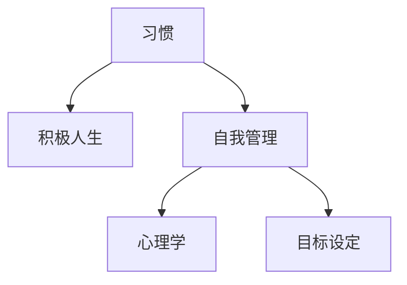

                 

# 如何培养良好的习惯：如何养成积极向上的人生态度？

> 关键词：习惯培养,积极人生,自我管理,心理学,目标设定

## 1. 背景介绍

在人生的道路上，每个人都在不断学习和成长。良好的习惯不仅是通往成功的重要桥梁，也是构建积极向上人生态度的关键。心理学研究表明，行为习惯的培养与改变具有深远的影响，能够在多个层面上提升生活质量和个人成就感。本文将从核心概念、算法原理、操作步骤等多个维度，探讨如何通过科学方法培养良好习惯，养成积极向上的人生态度。

## 2. 核心概念与联系

### 2.1 核心概念概述

为更好地理解习惯的培养和心态的转变，本节将介绍几个关键概念：

- 习惯(Habit)：重复的行为模式，通过不断重复某一行为，从而使其成为一种自动化的行为。
- 积极人生(Positive Mindset)：一种对未来充满希望和乐观的态度，能够帮助人们克服困难，提升幸福感。
- 自我管理(Self-Management)：个人通过自律和自我监督，管理自己的行为和情感，以达到预定目标的过程。
- 心理学(Psychology)：研究人类行为、思想和情感的科学，提供了培养良好习惯的理论基础。
- 目标设定(Goal Setting)：设定明确、具体、可实现的目标，作为推动行为改变的强大动力。

这些概念之间的联系可以通过以下Mermaid流程图来展示：



这个流程图展示了好习惯、积极人生、自我管理、心理学以及目标设定之间的相互关系：

1. 自我管理是培养好习惯的基础，通过自律和自我监督，个人能够有意识地重复某些行为，形成习惯。
2. 心理学提供了关于行为动机和改变的理论依据，帮助人们理解习惯的形成机制。
3. 目标设定为习惯的培养提供了明确的方向和动力，帮助个人专注于实现自我提升。
4. 积极人生态度能够提升自我管理的效率和效果，增强面对挑战的韧性。

## 3. 核心算法原理 & 具体操作步骤

### 3.1 算法原理概述

习惯的培养和心态的转变，本质上是一个自我管理的过程。其核心思想是通过设定目标、设计行为路径、逐步实现目标，从而改变个人的生活习惯和行为模式。具体而言，一个完整的过程包括：

1. **目标设定**：明确你想要达成的具体目标。
2. **行为设计**：设计实现目标的具体行为和路径。
3. **逐步实施**：按照设计好的路径逐步实施行为。
4. **定期反馈**：对实施过程中的进展进行记录和评估，根据反馈调整策略。
5. **长期坚持**：将实施中的行为固化为习惯，长期坚持以实现最终目标。

### 3.2 算法步骤详解

基于上述原理，习惯培养的算法步骤可以详细分为：

**Step 1: 目标设定**
- **明确目标**：设定具体、可量化、可实现的目标，如“每天读书30分钟”、“每周锻炼3次”。
- **分解目标**：将大目标分解为多个小目标，如“每天读书30分钟”可以进一步分解为“每天早上读书15分钟，晚上读书15分钟”。

**Step 2: 行为设计**
- **设计具体行为**：明确每日需要执行的具体行为，如“每天早上7点-7点15分读书”、“每周二、四、六健身房锻炼”。
- **安排执行时间**：选择合适的执行时间，确保行为能够持续实施，如“早上起床后读书”、“下班后直接去健身房”。

**Step 3: 逐步实施**
- **逐步执行**：从最小习惯开始，逐步增加复杂度，如“最初每天只读5分钟，逐步增加到15分钟”。
- **记录进展**：通过日记、习惯追踪工具等记录每日的实施情况，确保行为持续进行。

**Step 4: 定期反馈**
- **定期评估**：每周或每月对进展进行评估，分析成功和失败的原因，调整策略。
- **调整目标**：根据评估结果，调整目标和行为路径，使其更加符合实际情况。

**Step 5: 长期坚持**
- **固化习惯**：将每日的行为固化为习惯，逐渐减少对意志力的依赖。
- **不断优化**：根据实际情况不断优化目标和行为路径，保持长期的积极效果。

### 3.3 算法优缺点

习惯培养算法具有以下优点：
1. 系统性：通过明确的目标和计划，将习惯的培养过程系统化，降低了随意性。
2. 可操作性：具体、可执行的行为设计，使得习惯的培养变得更加容易实施。
3. 持续性：通过逐步实施和定期反馈，确保习惯能够长期坚持。

但该算法也存在以下局限性：
1. 对动机要求高：需要持续的自我激励，一旦动力不足，习惯培养效果将大打折扣。
2. 缺乏灵活性：固定的行为路径可能不适合突发情况，需要灵活调整。
3. 初始阻力大：改变原有行为习惯，往往需要克服初始的抵抗心理。

### 3.4 算法应用领域

习惯培养和心态转变的算法原理，不仅适用于个人的自我管理，还可以应用于组织管理、教育、健康等领域：

- **组织管理**：通过设定企业目标和行为规范，提升团队效率和协作能力。
- **教育**：通过设定学习目标和行为路径，帮助学生养成良好的学习习惯，提升学业成绩。
- **健康**：通过设定健康目标和行为路径，改善生活方式，提高生活质量。

## 4. 数学模型和公式 & 详细讲解

### 4.1 数学模型构建

本节将使用数学语言对习惯培养和心态转变的算法进行更严谨的描述。

设目标为 $G$，行为路径为 $\{B_1, B_2, ..., B_n\}$，其中 $B_i$ 表示第 $i$ 天的行为。我们希望通过逐步实施行为路径，最终实现目标 $G$。则习惯培养的过程可以表示为：

$$
G = \sum_{i=1}^{n} B_i
$$

### 4.2 公式推导过程

以阅读习惯为例，假设目标为 $G=30$ 分钟，行为路径为 $B_1=5$ 分钟，$B_2=10$ 分钟，$B_3=15$ 分钟。则目标的实现过程可以表示为：

$$
G = B_1 + B_2 + B_3 = 5 + 10 + 15 = 30 \text{ 分钟}
$$

在实际应用中，目标 $G$ 和行为路径 $\{B_1, B_2, ..., B_n\}$ 需要根据具体情况进行调整。通过逐步增加行为路径中的复杂度，最终实现总目标 $G$。

### 4.3 案例分析与讲解

以健身习惯为例，假设目标为每周锻炼3次，每次30分钟。行为路径可以设计为：

- 第一天，进行10分钟的慢跑；
- 第二天，进行15分钟的瑜伽；
- 第三天，进行10分钟的深蹲；
- 第四天，进行10分钟的力量训练。

通过这样的行为路径设计，逐步增加锻炼的复杂度和时长，最终实现每周锻炼3次，每次30分钟的目标。

## 5. 项目实践：代码实例和详细解释说明

### 5.1 开发环境搭建

为了实践习惯培养的算法，我们可以使用Python和相关的习惯追踪工具。以下是开发环境搭建的步骤：

1. 安装Python环境：选择适合自己的Python版本，如Python 3.8，使用Anaconda或Miniconda进行安装。
2. 安装习惯追踪工具：如Habitica、HabitBull等，这些工具可以帮助我们记录和评估习惯的实施情况。
3. 设置目标和行为路径：在习惯追踪工具中设定具体目标和行为路径，如每天读书30分钟。

### 5.2 源代码详细实现

以下是使用Python实现习惯追踪的代码示例：

```python
import habitica_api

def create_habit(habit_name, frequency, start_date):
    habitica_api.init()
    habitica_api.create_habit(habit_name, frequency, start_date)
    return True

def update_habit_progress(habit_name, progress):
    habitica_api.init()
    habitica_api.update_habit_progress(habit_name, progress)
    return True
```

这个示例中，我们使用了Habitica API来创建和更新习惯的实施进度。通过设置目标和行为路径，我们可以使用习惯追踪工具来记录和评估习惯的实施情况，确保习惯的持续进行。

### 5.3 代码解读与分析

**Habitica API**：
- 提供了一个简单易用的接口，可以与习惯追踪工具进行交互，实现习惯的创建和进度更新。

**create_habit和update_habit_progress函数**：
- 用于创建习惯和更新习惯进度，确保习惯的实施情况能够被记录和评估。

**代码实现细节**：
- 初始化Habitica API，通过API接口创建和更新习惯的实施进度。
- 使用Python的自定义函数，方便开发者进行习惯追踪。

**实际应用**：
- 使用Habitica等工具，通过API接口进行习惯的创建和进度更新，记录和评估习惯的实施情况。

### 5.4 运行结果展示

运行上述代码后，可以在Habitica等工具中看到习惯的实施进度，如每天读书30分钟的进度记录。通过定期评估和反馈，不断调整策略，确保习惯的长期坚持。

## 6. 实际应用场景

### 6.1 个人自我管理

通过习惯培养的算法，个人可以更有效地管理自己的行为和生活，提升自我效能感和幸福感。例如，通过设定每天读书30分钟、每周锻炼3次等目标，逐步培养良好的生活习惯，增强自我管理能力。

### 6.2 组织管理

在组织管理中，习惯培养算法可以帮助团队提升协作效率和工作质量。通过设定团队目标和行为规范，如每日站会、每周进度汇报等，形成团队内部的良好习惯，提升整体工作效率。

### 6.3 教育

在教育领域，习惯培养算法可以帮助学生养成良好的学习习惯，提升学业成绩。通过设定学习目标和行为路径，如每天复习30分钟、每周完成2个项目等，帮助学生逐步实现学习目标，提升自我管理能力。

## 7. 工具和资源推荐

### 7.1 学习资源推荐

为了帮助读者系统掌握习惯培养和心态转变的理论基础和实践技巧，以下是一些优质的学习资源：

1. 《习惯的力量》(The Power of Habit)：查尔斯·杜希格(Cheles Duhigg)所著，详细阐述了习惯的形成机制和改变方法，提供了丰富的实践案例。
2. 《心理学与生活》(Psychology and Life)：菲利普·津巴多(Philip Zimbardo)所著，介绍了心理学的基本原理和应用，提供了丰富的心理学知识。
3. 《目标设定与自我管理》(Goal Setting and Self-Management)：由行为科学家所著，详细介绍了目标设定和自我管理的理论和方法，提供了实用的行动指南。
4. Coursera《心理学与幸福》课程：由宾夕法尼亚大学开设，通过在线视频和作业，帮助学习者理解习惯和心态转变的科学原理。
5. 《成功心理学》(Success Psychology)：由著名心理学家所著，提供了成功心理学的理论和实践方法，帮助读者培养积极向上的人生态度。

### 7.2 开发工具推荐

习惯培养的算法实现，需要依赖一系列的开发工具和环境。以下是一些常用的工具和资源：

1. Python：简单易用的编程语言，适用于开发习惯追踪等应用。
2. Habitica：在线习惯追踪工具，支持API接口，方便开发者进行习惯管理。
3. Google Sheets：表格工具，可以用于记录习惯的实施进度和评估结果。
4. Jupyter Notebook：开发环境，支持Python代码的交互式执行，便于开发和调试。
5. Visual Studio Code：开发工具，支持Python语言的集成开发环境，便于代码编写和管理。

### 7.3 相关论文推荐

习惯培养和心态转变的算法原理，源于众多心理学和行为科学的研究。以下是一些经典的研究论文：

1. James Clear. (2019). "Atomic Habits: An Easy & Proven Way to Build Good Habits & Break Bad Ones." Viking Press.
2. BJ Fogg. (2006). "Creating Habit Success Through Behavioral Engineering." New York: Crown Business.
3. William James. (1890). "The Psychology of Habit." In William James and Henry E. Parker, eds., The Heart of Wisdom. New York: Holt.
4. Carol S. Dweck. (2006). "Mindset: The New Psychology of Success." Random House.
5. K�ra Knight. (2010). "The Secret of Self-Discipline: The Practice of Personal Accountability." Simon & Schuster.

## 8. 总结：未来发展趋势与挑战

### 8.1 研究成果总结

本文系统介绍了习惯培养和心态转变的算法原理和操作步骤，通过数学模型和代码实例，帮助读者理解和实践习惯培养的过程。通过学习资源和工具推荐，提供了系统的学习和实践路径。

### 8.2 未来发展趋势

未来，习惯培养和心态转变的算法将呈现以下几个发展趋势：

1. **个性化定制**：根据个人特点和需求，定制化的习惯培养方案，提升实施效果。
2. **数据分析应用**：利用大数据和AI技术，分析习惯培养过程的各项指标，提供科学的反馈和调整建议。
3. **跨领域应用**：习惯培养算法将逐步应用于更多领域，如健康管理、教育、社交等，帮助人们提升生活质量。
4. **科技融合**：结合智能设备和AI技术，通过智能穿戴设备、智能家居等手段，辅助习惯培养和心态转变。
5. **跨文化适应**：开发适应不同文化背景的习惯培养方案，提升跨文化适应能力和国际竞争力。

### 8.3 面临的挑战

尽管习惯培养和心态转变的算法已经取得了一定的成果，但在实践中仍面临诸多挑战：

1. **动机维持**：如何长期保持自我激励，克服惰性和习惯的固化。
2. **行为偏差**：如何在复杂和多变的环境中，保持行为的稳定性和一致性。
3. **环境影响**：如何应对外界环境变化，调整习惯培养策略。
4. **科技依赖**：如何避免过度依赖技术手段，保持习惯培养的自然性和人性化。
5. **文化差异**：如何在不同文化背景下，推广和应用习惯培养算法。

### 8.4 研究展望

面对习惯培养和心态转变所面临的挑战，未来的研究需要在以下几个方面寻求新的突破：

1. **动机激发技术**：开发动机激发技术，如游戏化激励、正向反馈等，增强行为持续性。
2. **行为适应算法**：研究行为适应算法，根据环境变化和个体差异，动态调整行为路径。
3. **跨文化研究**：进行跨文化研究，探索不同文化背景下习惯培养的最佳实践。
4. **综合干预策略**：结合心理学、行为科学、社会学等多个学科，开发综合干预策略，提升习惯培养效果。
5. **AI辅助指导**：利用AI技术，提供实时反馈和建议，辅助习惯培养过程。

通过以上研究和探索，习惯培养和心态转变算法将能够更好地服务于个人和社会的福祉，推动社会的全面进步。

## 9. 附录：常见问题与解答

**Q1：如何设定合理的目标？**

A: 设定合理的目标需要考虑SMART原则，即具体(Specific)、可衡量(Measurable)、可实现(Achievable)、相关性(Relevant)、时限性(Time-bound)。例如，设定“每天跑步30分钟”比“减肥”更具可操作性。

**Q2：如何应对突发情况？**

A: 在行为设计中，考虑到突发情况的存在，可以设计备选方案或灵活调整策略。例如，如果某天无法按时跑步，可以选择在家进行替代性运动。

**Q3：如何保持持续动力？**

A: 通过设定小目标和及时反馈，逐步增加难度和复杂度，保持持续动力。同时，与朋友或社区分享进展，获得外部支持，也能增强动力。

**Q4：如何应对失败和挫折？**

A: 习惯培养过程中难免会遇到失败和挫折。关键在于快速调整策略，找到失败原因，并继续前进。可以记录失败的原因和解决方案，作为未来改进的参考。

通过以上问题的解答，希望能够帮助读者更好地理解习惯培养和心态转变的算法原理，并应用到实际生活中，实现自我提升和积极向上的人生态度。

---

作者：禅与计算机程序设计艺术 / Zen and the Art of Computer Programming

