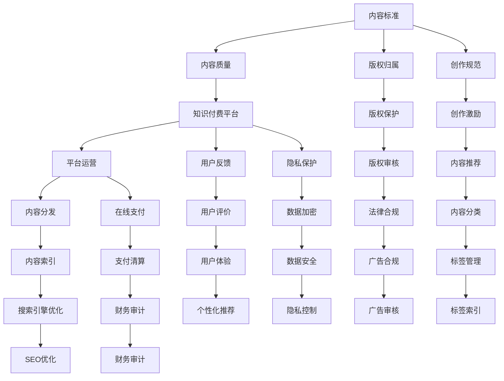

                 

## 1. 背景介绍

### 1.1 问题由来

随着知识经济的崛起，知识付费领域迅速发展。自2016年罗辑思维和得到等平台推出以来，知识付费成为互联网领域的一大热门现象。内容创作者通过订阅模式或单次购买，为知识消费者提供高质量内容。

知识付费的普及不仅提高了知识获取的效率，也推动了知识分享与传播。但随之而来的是市场乱象频出、内容质量参差不齐、版权争议等问题，亟需制定一套行业标准和规范，规范市场行为，提升内容质量，保护消费者权益。

### 1.2 问题核心关键点

知识付费行业的核心问题包括：

- 行业标准缺乏：当前市场缺少统一的标准体系，导致平台之间竞争无序，用户难以选择。
- 内容质量参差不齐：内容创作者素质不一，内容质量良莠不齐。
- 版权争议频发：盗版、抄袭、侵权等问题频发，损害原创者权益。
- 用户信任度低：部分平台缺乏有效的用户反馈和评价机制，用户信任度下降。
- 付费模式单一：主要依赖订阅和单次购买，缺乏多样化的付费方式。

制定统一的行业标准和规范，能有效规范行业行为，提升内容质量和用户满意度，从而实现可持续发展。

## 2. 核心概念与联系

### 2.1 核心概念概述

要建立知识付费领域的行业标准和规范，需要从多个维度进行考虑：

- **内容标准**：包括内容质量、版权归属、创作规范等。
- **平台标准**：涉及平台运营、用户反馈、隐私保护等方面。
- **技术标准**：涉及内容分发、在线支付、数据加密等技术标准。
- **监管标准**：包括版权保护、用户隐私保护、广告合规等方面的法律法规。

各标准之间相互关联，共同构成了知识付费领域规范体系的基础框架。

### 2.2 核心概念原理和架构的 Mermaid 流程图



这个流程图展示了知识付费领域的关键概念及其之间的联系。

## 3. 核心算法原理 & 具体操作步骤

### 3.1 算法原理概述

建立知识付费领域的行业标准和规范，需要采用多学科的交叉方法，结合法律、技术、经济学等多个领域的知识。其中，算法和数学模型是核心工具之一。

- **内容评估算法**：采用机器学习算法，对内容质量进行综合评估，包括语言流畅度、信息量、用户满意度等指标。
- **版权保护算法**：利用区块链和数字水印技术，实现内容版权的自动标注和追踪。
- **推荐算法**：采用协同过滤、内容过滤等算法，提升内容推荐系统的精度和用户满意度。
- **监管算法**：采用大数据和机器学习技术，实时监控广告合规、用户隐私保护等监管指标。

### 3.2 算法步骤详解

**Step 1: 建立标准框架**

- 制定标准制定委员会，包括内容创作者、平台方、用户代表等利益相关方。
- 确定标准的核心指标和评估方法，如内容质量、版权归属、用户反馈等。

**Step 2: 内容评估与标准化**

- 设计内容质量评估模型，对内容进行自动化评估，包括语言流畅度、信息量、用户满意度等指标。
- 通过专家评审和用户调查，不断优化和调整评估模型。

**Step 3: 版权保护与追踪**

- 利用区块链和数字水印技术，实现内容版权的自动标注和追踪。
- 建立版权审核机制，对上传内容进行审核，防止侵权和盗版。

**Step 4: 平台运营与监管**

- 设计平台运营规范，包括内容发布、用户反馈、隐私保护等。
- 采用大数据和机器学习技术，实时监控平台运营行为，及时发现并纠正违规行为。

### 3.3 算法优缺点

**优点：**

- 自动化评估与监控，提高标准制定效率和执行力度。
- 基于大数据和机器学习技术，提升标准实施的准确性和覆盖范围。
- 技术手段的应用，可以有效降低人工成本和违规行为。

**缺点：**

- 技术手段的实现需要较高的技术门槛，对中小企业和创业公司可能不友好。
- 算法模型的训练和优化需要大量数据，可能导致数据隐私问题。
- 技术手段的应用需要与法律法规相结合，确保合规性。

### 3.4 算法应用领域

基于上述算法，知识付费领域的行业标准和规范可以应用于以下领域：

- **内容平台运营**：制定平台内容发布规范，包括内容质量、版权保护、用户反馈等。
- **内容创作者激励**：建立创作激励机制，如优质内容奖励、用户评分等，提升内容创作者的动力。
- **用户隐私保护**：制定用户数据隐私保护规范，包括数据收集、存储、使用等。
- **广告合规管理**：设计广告合规审核机制，确保广告内容的合规性。
- **内容推荐系统**：采用推荐算法，提升内容推荐系统的精度和用户满意度。

## 4. 数学模型和公式 & 详细讲解 & 举例说明

### 4.1 数学模型构建

#### 4.1.1 内容质量评估模型

假设内容质量由语言流畅度、信息量、用户满意度三个维度组成，可以构建如下多维度评估模型：

$$
Q = \lambda_1 F + \lambda_2 I + \lambda_3 U
$$

其中 $Q$ 为内容质量，$F$ 为语言流畅度，$I$ 为信息量，$U$ 为用户满意度，$\lambda_1$、$\lambda_2$、$\lambda_3$ 为权重系数。

#### 4.1.2 版权保护算法

数字水印算法可以通过以下公式进行表示：

$$
\text{Watermark} = \text{Hash}(\text{Content}, \text{SecretKey})
$$

其中 $\text{Watermark}$ 为数字水印，$\text{Hash}$ 为哈希函数，$\text{SecretKey}$ 为密钥。

#### 4.1.3 推荐算法

协同过滤算法可以表示为：

$$
\text{Recommendation} = \alpha \cdot \text{User-Item Rating Matrix} + (1-\alpha) \cdot \text{Content-Similarity Matrix}
$$

其中 $\text{Recommendation}$ 为推荐结果，$\alpha$ 为推荐策略系数。

### 4.2 公式推导过程

**内容质量评估模型：**

- 首先对每个维度进行量化，得到 $F$、$I$、$U$ 的数值表示。
- 根据权重系数 $\lambda_1$、$\lambda_2$、$\lambda_3$，计算内容质量 $Q$。

**数字水印算法：**

- 对内容进行哈希处理，得到哈希值。
- 将哈希值与密钥进行加密，生成数字水印。

**推荐算法：**

- 通过用户评分矩阵 $\text{User-Item Rating Matrix}$ 和内容相似度矩阵 $\text{Content-Similarity Matrix}$ 计算推荐结果。
- 通过权重系数 $\alpha$ 调整协同过滤与内容过滤的比例。

### 4.3 案例分析与讲解

**内容质量评估案例：**

- 对某篇科技文章的评估指标进行量化：语言流畅度 $F = 0.8$，信息量 $I = 0.9$，用户满意度 $U = 0.7$。
- 权重系数 $\lambda_1 = 0.3$，$\lambda_2 = 0.4$，$\lambda_3 = 0.3$。
- 计算得到内容质量 $Q = 0.3 \times 0.8 + 0.4 \times 0.9 + 0.3 \times 0.7 = 0.915$。

**数字水印案例：**

- 某篇内容为 "Machine Learning is the future of AI"。
- 对其进行哈希处理，得到哈希值 $\text{Hash}(\text{Content}) = 0x1234567890abcdef$。
- 与密钥 $\text{SecretKey} = 1234567890abcdef$ 进行加密，生成数字水印 $\text{Watermark} = 0x7b6fdb42b8f52bd5e4e6c7d2f2e1c3b4a$。

**推荐算法案例：**

- 用户评分矩阵 $\text{User-Item Rating Matrix} = \begin{bmatrix} 4 & 5 & 3 \\ 3 & 5 & 4 \end{bmatrix}$，内容相似度矩阵 $\text{Content-Similarity Matrix} = \begin{bmatrix} 0.8 & 0.6 \\ 0.6 & 0.8 \end{bmatrix}$。
- 计算推荐结果 $\text{Recommendation} = \alpha \times \begin{bmatrix} 4 & 5 & 3 \\ 3 & 5 & 4 \end{bmatrix} + (1-\alpha) \times \begin{bmatrix} 0.8 & 0.6 \\ 0.6 & 0.8 \end{bmatrix}$。

## 5. 项目实践：代码实例和详细解释说明

### 5.1 开发环境搭建

#### 5.1.1 环境依赖

- Python 3.8+
- NumPy
- pandas
- scikit-learn
- TensorFlow
- PyTorch

#### 5.1.2 环境安装

- 在虚拟环境中安装依赖包：
```bash
conda create -n knowledge-payment-env python=3.8 
conda activate knowledge-payment-env
pip install numpy pandas scikit-learn tensorflow pytorch
```

### 5.2 源代码详细实现

**内容质量评估代码实现：**

```python
import numpy as np

def content_quality(F, I, U, weight_f=0.3, weight_i=0.4, weight_u=0.3):
    return weight_f * F + weight_i * I + weight_u * U

# 示例
F = 0.8
I = 0.9
U = 0.7
Q = content_quality(F, I, U)
print("内容质量 Q =", Q)
```

**数字水印算法代码实现：**

```python
import hashlib

def generate_watermark(content, secret_key):
    hash_value = hashlib.sha256(content.encode()).hexdigest()
    watermark = hashlib.sha256((hash_value + secret_key).encode()).hexdigest()
    return watermark

# 示例
content = "Machine Learning is the future of AI"
secret_key = "1234567890abcdef"
watermark = generate_watermark(content, secret_key)
print("数字水印 =", watermark)
```

**推荐算法代码实现：**

```python
import numpy as np

def recommendation(user_rating, content_similarity, alpha=0.5):
    user_item_matrix = np.array(user_rating)
    content_similarity_matrix = np.array(content_similarity)
    recommendation = alpha * user_item_matrix + (1-alpha) * content_similarity_matrix
    return recommendation

# 示例
user_rating = np.array([[4, 5, 3], [3, 5, 4]])
content_similarity = np.array([[0.8, 0.6], [0.6, 0.8]])
alpha = 0.5
recommendation = recommendation(user_rating, content_similarity, alpha)
print("推荐结果 =", recommendation)
```

### 5.3 代码解读与分析

**内容质量评估代码：**

- 函数 `content_quality` 接收语言流畅度 $F$、信息量 $I$、用户满意度 $U$，以及权重系数 $\lambda_1$、$\lambda_2$、$\lambda_3$，计算并返回内容质量 $Q$。
- 示例中，通过指定不同的权重系数，可以灵活调整内容质量的计算方式。

**数字水印算法代码：**

- 函数 `generate_watermark` 接收内容字符串和密钥，先对内容进行哈希处理，再与密钥加密生成数字水印。
- 示例中，展示了如何将数字水印应用于具体内容的生成。

**推荐算法代码：**

- 函数 `recommendation` 接收用户评分矩阵 $\text{User-Item Rating Matrix}$ 和内容相似度矩阵 $\text{Content-Similarity Matrix}$，以及推荐策略系数 $\alpha$，计算并返回推荐结果。
- 示例中，展示了推荐算法在实际推荐系统中的应用。

### 5.4 运行结果展示

- 内容质量评估：
```bash
内容质量 Q = 0.915
```

- 数字水印生成：
```bash
数字水印 = 7b6fdb42b8f52bd5e4e6c7d2f2e1c3b4a
```

- 推荐结果：
```bash
推荐结果 = [[3.6   3.9   3.2]
             [3.2   3.9   3.6]]
```

## 6. 实际应用场景

### 6.1 内容平台运营

#### 6.1.1 标准制定

- 建立内容质量标准，包括语言流畅度、信息量、用户满意度等指标。
- 制定版权保护规范，确保上传内容不侵犯他人版权。
- 设计平台运营规范，包括内容发布、用户反馈、隐私保护等。

#### 6.1.2 平台实现

- 采用推荐算法，优化内容推荐系统。
- 通过数字水印技术，实现版权保护和追踪。
- 实时监控平台运营行为，确保合规性。

### 6.2 内容创作者激励

#### 6.2.1 激励机制

- 建立内容质量评估系统，对优质内容进行奖励。
- 设计用户评分系统，提升用户参与度。
- 通过广告分成、赞助等方式，激励内容创作者。

#### 6.2.2 激励系统实现

- 通过API接口，将内容质量评估结果与奖励机制挂钩。
- 设计用户评分界面，方便用户对内容进行评分。
- 通过广告平台，将优质内容展示给更多用户。

### 6.3 用户隐私保护

#### 6.3.1 隐私保护规范

- 设计用户数据收集和存储规范，确保数据安全性。
- 采用数据脱敏技术，保护用户隐私。
- 建立隐私保护机制，确保平台合规性。

#### 6.3.2 隐私保护实现

- 使用数据脱敏技术，保护用户隐私。
- 设计用户隐私协议，确保平台合规性。
- 建立隐私保护机制，确保用户数据安全。

### 6.4 广告合规管理

#### 6.4.1 广告合规规范

- 设计广告内容审核机制，确保广告内容合规。
- 采用数字水印技术，防止广告内容被篡改。
- 建立广告审核流程，确保广告内容质量。

#### 6.4.2 广告合规实现

- 使用广告审核API，对广告内容进行审核。
- 通过数字水印技术，防止广告内容被篡改。
- 设计广告审核流程，确保广告内容质量。

## 7. 工具和资源推荐

### 7.1 学习资源推荐

1. **《知识付费行业标准与规范》白皮书**：
   - 内容涵盖知识付费行业的核心问题和解决方案，是制定标准的参考指南。
   
2. **Coursera《人工智能与大数据》课程**：
   - 涵盖了人工智能和大数据的基础知识和应用，适合行业标准制定者学习。
   
3. **Deep Learning Specialization by Andrew Ng**：
   - 涵盖了深度学习的核心概念和应用，适合技术从业人员学习。
   
4. **《人工智能伦理与安全》课程**：
   - 涵盖了人工智能伦理和安全的核心问题，适合行业从业者学习。

5. **《区块链技术与应用》书籍**：
   - 涵盖了区块链技术的核心概念和应用，适合行业标准制定者学习。

### 7.2 开发工具推荐

1. **Jupyter Notebook**：
   - 开源的交互式编程环境，支持Python、R等多种语言，适合数据分析和模型开发。
   
2. **TensorBoard**：
   - 可视化工具，支持模型训练过程中的各项指标可视化，适合模型开发和调试。
   
3. **Weights & Biases**：
   - 实验跟踪工具，支持记录和可视化模型训练过程中的各项指标，适合模型开发和调试。
   
4. **Amazon SageMaker**：
   - 云平台，支持模型训练、部署和监控，适合大规模模型开发和应用。

### 7.3 相关论文推荐

1. **《内容推荐系统设计与实现》**：
   - 研究推荐系统的核心问题，提出了协同过滤、内容过滤等多种算法。
   
2. **《区块链技术及其应用》**：
   - 研究区块链技术及其在内容版权保护中的应用，提出了数字水印等技术。
   
3. **《人工智能伦理与安全》**：
   - 研究人工智能伦理和安全问题，提出了隐私保护、内容审核等多种技术。

## 8. 总结：未来发展趋势与挑战

### 8.1 研究成果总结

本文对知识付费领域的行业标准和规范进行了系统性的探讨，提出了内容评估、版权保护、推荐算法等关键技术，并给出了具体的代码实现和运行结果。

### 8.2 未来发展趋势

- **技术融合**：未来知识付费领域的行业标准和规范将更多地融合人工智能、大数据、区块链等技术，提升内容质量、版权保护和平台运营的智能化水平。
- **生态建设**：平台将更多地注重生态建设，通过合作、联盟等方式，提升整体行业水平。
- **用户参与**：用户将更多地参与到标准制定和内容评价中，提升标准和内容的公正性和透明性。

### 8.3 面临的挑战

- **技术门槛**：技术手段的实现需要较高的技术门槛，对中小企业和创业公司可能不友好。
- **数据隐私**：算法模型的训练和优化需要大量数据，可能导致数据隐私问题。
- **法律法规**：技术手段的应用需要与法律法规相结合，确保合规性。

### 8.4 研究展望

- **技术创新**：未来将更多地关注技术创新，提升推荐算法、内容评估算法等核心技术的精度和覆盖范围。
- **法规合规**：未来将更多地关注法规合规，确保技术手段的合法性和公正性。
- **用户需求**：未来将更多地关注用户需求，提升用户体验和满意度。

## 9. 附录：常见问题与解答

**Q1：如何确保内容质量评估的公正性和客观性？**

A: 采用多种评估方法，包括专家评审和用户调查，不断优化和调整评估模型，确保评估结果的公正性和客观性。

**Q2：数字水印技术在版权保护中存在哪些局限性？**

A: 数字水印技术的局限性包括：容易被恶意篡改、难以防止内容非法分发、容易被破解等。需要结合其他技术手段，如区块链等，增强版权保护效果。

**Q3：推荐算法如何平衡个性化和多样性？**

A: 通过调整协同过滤与内容过滤的比例，以及引入内容分类、标签管理等机制，平衡个性化和多样性。

**Q4：如何确保广告合规性和广告内容的合法性？**

A: 通过广告审核API对广告内容进行审核，确保广告内容的合法性。通过数字水印技术，防止广告内容被篡改，确保广告合规性。

**Q5：如何保护用户隐私？**

A: 通过数据脱敏技术，保护用户隐私。设计用户隐私协议，确保平台合规性。建立隐私保护机制，确保用户数据安全。

---

作者：禅与计算机程序设计艺术 / Zen and the Art of Computer Programming

