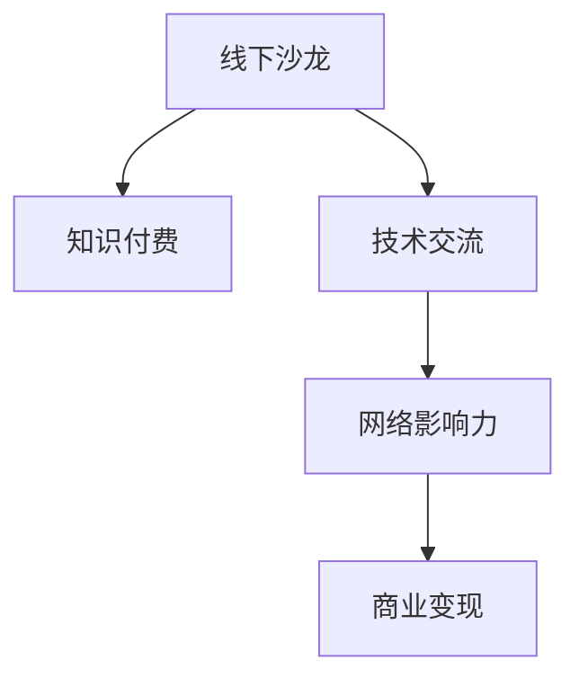

                 

# 如何打造个人知识付费线下沙龙

> 关键词：线下沙龙,知识付费,技术交流,网络影响力,商业变现

## 1. 背景介绍

### 1.1 问题由来

在数字化时代，知识付费模式逐渐兴起，为广大专业人士提供了新的业务拓展渠道。通过线下沙龙等形式，将专业知识、技术经验、行业洞察分享给目标客户，不仅能够提升自身品牌知名度，还能快速积累客户资源，实现商业变现。特别是对于技术专家和行业大咖，线下沙龙更是建立个人品牌影响力、扩大业务版图的有效途径。

### 1.2 问题核心关键点

打造个人知识付费线下沙龙，需要兼顾内容的价值性、形式的互动性、场景的匹配度以及推广的效率性。核心关键点在于：

- 选择合适的主题和讲师，确保沙龙内容具有高价值、高吸引力。
- 设计互动性强的环节，提高听众参与度，增强知识传播效果。
- 结合实际应用场景，提升沙龙的适用性和权威性。
- 运用多样化的推广策略，扩大沙龙影响力和参与人数。

## 2. 核心概念与联系

### 2.1 核心概念概述

为更好地理解如何打造个人知识付费线下沙龙，本节将介绍几个密切相关的核心概念：

- **线下沙龙**：一种面对面的交流活动，通过讲师与听众的互动，传递知识、分享经验。
- **知识付费**：通过付费方式，获取有价值的知识产品或服务，提升个人技能和业务能力。
- **技术交流**：专业人士之间分享技术经验、研究成果、应用场景等。
- **网络影响力**：通过线上线下结合的方式，提升讲师在网络上的知名度和影响力。
- **商业变现**：通过沙龙活动吸引客户，实现产品销售、品牌推广、会员招募等商业目标。

这些核心概念之间的逻辑关系可以通过以下Mermaid流程图来展示：



这个流程图展示了下线沙龙的核心概念及其之间的关系：

1. 线下沙龙是知识付费和商业变现的载体，技术交流和网络影响力是其重要组成部分。
2. 通过技术交流提升沙龙的知识价值，增强讲师的网络影响力。
3. 网络影响力是商业变现的基础，吸引更多潜在客户参与沙龙。

## 3. 核心算法原理 & 具体操作步骤
### 3.1 算法原理概述

打造个人知识付费线下沙龙，本质上是一个目标导向的市场营销过程。其核心思想是：通过精心设计的沙龙活动，吸引目标客户，提升讲师知名度，增强客户粘性，最终实现商业变现。

形式化地，假设目标客户群体为 $C$，线下沙龙活动为 $S$，知识付费平台为 $P$。活动设计目标是最小化客户流失率，最大化客户转化率，即找到最优活动参数：

$$
\theta^* = \mathop{\arg\min}_{\theta} \mathcal{L}(\theta)
$$

其中 $\mathcal{L}$ 为针对目标客户设计的损失函数，用于衡量沙龙活动的效果。常见的损失函数包括客户流失率、客户满意度等。

通过梯度下降等优化算法，沙龙活动不断更新活动参数 $\theta$，最小化损失函数 $\mathcal{L}$，使得沙龙活动效果逼近理想状态。由于沙龙活动的目标和预期的活动参数已经明确，因此即便是在资源有限的情况下，也能较快收敛到理想的活动参数 $\theta^*$。

### 3.2 算法步骤详解

打造个人知识付费线下沙龙的一般包括以下几个关键步骤：

**Step 1: 定义沙龙目标**
- 明确沙龙的核心价值点，如深度交流、创新灵感、行业洞察等。
- 确定目标客户群体，如技术从业人员、企业决策者、创业者等。
- 制定商业目标，如吸引新客户、维护老客户、扩大品牌影响力等。

**Step 2: 设计沙龙活动**
- 选择主题和讲师，确保内容具有权威性和实用性。
- 设计互动环节，如现场问答、分组讨论、模拟演练等，增强参与感。
- 安排活动流程，如开场白、主题演讲、互动环节、问答环节、总结发言等，提升活动节奏。
- 考虑活动场地和设施，确保环境舒适、设备完善。

**Step 3: 制定营销策略**
- 利用社交媒体、邮件列表、合作伙伴渠道等，广泛宣传沙龙活动。
- 提供早鸟票、团体票、会员优惠等，吸引客户参与。
- 运用KOL推荐、内容预告、合作伙伴背书等手段，提升沙龙权威性和吸引力。

**Step 4: 执行沙龙活动**
- 在活动前进行技术准备，如调试设备、测试流程等。
- 活动当天，严格执行活动流程，确保活动顺利进行。
- 活动结束后，收集反馈信息，评估沙龙效果。

**Step 5: 后续跟进**
- 对参与客户进行后续跟进，如发送感谢信、提供内容回放、邀请加入社群等。
- 分析沙龙数据，总结经验教训，优化未来活动设计。
- 对满意客户进行商业转化，如推广产品、加入会员计划等。

以上是打造个人知识付费线下沙龙的一般流程。在实际应用中，还需要针对具体场景，对沙龙活动的各个环节进行优化设计，如改进活动流程、丰富互动环节、引入更多宣传渠道等，以进一步提升沙龙效果。

### 3.3 算法优缺点

打造个人知识付费线下沙龙具有以下优点：
1. 现场互动性强。面对面的交流方式，能够激发更多现场互动，提升知识传播效果。
2. 建立权威性。沙龙活动能够聚集行业大咖和权威专家，提升讲师和活动的权威性。
3. 增加客户粘性。通过沙龙活动建立起的信任和互动，有助于提高客户粘性，促进商业变现。
4. 灵活性强。线下沙龙可以根据实际需求，灵活调整活动设计，增强适用性。

同时，该方法也存在一定的局限性：
1. 成本较高。沙龙活动的场地、设备、讲师费用等成本较高，难以持续进行高频活动。
2. 受限于地域。线下沙龙需要考虑地理位置，难以覆盖全国甚至全球的客户群体。
3. 宣传效果有限。受限于线下宣传手段，沙龙的宣传范围和影响力受限。
4. 转化率不确定。沙龙活动难以精准识别潜在客户，转化率存在不确定性。

尽管存在这些局限性，但就目前而言，线下沙龙仍然是大咖和专业人士建立品牌影响力、进行知识传播的重要途径。未来相关研究的重点在于如何进一步降低活动成本，提升宣传效果，优化活动设计，从而实现更高的商业价值。

### 3.4 算法应用领域

打造个人知识付费线下沙龙的方法，已经在多个行业领域得到广泛应用，例如：

- **技术交流**：在IT、互联网、软件开发等技术领域，通过技术沙龙分享最新技术趋势、行业洞察、开发经验等。
- **行业洞察**：在金融、医疗、法律等行业，邀请专家分享行业热点、最新研究成果、市场动态等。
- **职业发展**：在职业培训、求职指导等领域，帮助学员提升技能、拓展人脉、洞察职业发展趋势。
- **创新创业**：在创业孵化、创新大赛等活动中，邀请创业者分享创业经历、经验、商业模式等。
- **品牌推广**：在品牌发布会、产品体验会等活动中，提升品牌知名度，增强客户粘性。

除了上述这些经典场景外，线下沙龙还被创新性地应用到更多领域中，如智慧教育、智能制造、健康医疗等，为各行业带来新的技术和管理思路。随着沙龙活动的不断创新和优化，相信在更多领域中，线下沙龙将发挥更大的作用。

## 4. 数学模型和公式 & 详细讲解 & 举例说明
### 4.1 数学模型构建

本节将使用数学语言对打造个人知识付费线下沙龙过程进行更加严格的刻画。

记目标客户群体为 $C$，线下沙龙活动为 $S$，知识付费平台为 $P$。定义目标客户在沙龙活动中的满意度 $s_i$ 和流失率 $l_i$，分别为：

$$
s_i = f(\theta_i) \\
l_i = g(\theta_i)
$$

其中 $f(\theta_i)$ 和 $g(\theta_i)$ 为沙龙活动参数 $\theta_i$ 的函数。

活动设计目标是最小化客户流失率，最大化客户满意度，即：

$$
\theta^* = \mathop{\arg\min}_{\theta} \mathcal{L}(\theta)
$$

其中 $\mathcal{L}$ 为针对目标客户设计的损失函数，用于衡量沙龙活动的效果。常见的损失函数包括客户流失率、客户满意度等。

通过梯度下降等优化算法，沙龙活动不断更新活动参数 $\theta$，最小化损失函数 $\mathcal{L}$，使得沙龙活动效果逼近理想状态。

### 4.2 公式推导过程

以下我们以客户流失率和满意度为例，推导常见的损失函数及其梯度的计算公式。

假设目标客户群体为 $C=\{c_1, c_2, ..., c_N\}$，在沙龙活动中的满意度 $s_i$ 和流失率 $l_i$ 分别为：

$$
s_i = f(\theta_i) = w_1 \cdot a_1(\theta_i) + w_2 \cdot a_2(\theta_i) + ... + w_n \cdot a_n(\theta_i) \\
l_i = g(\theta_i) = v_1 \cdot b_1(\theta_i) + v_2 \cdot b_2(\theta_i) + ... + v_n \cdot b_n(\theta_i)
$$

其中 $a_j(\theta_i)$ 和 $b_j(\theta_i)$ 为活动参数 $\theta_i$ 的影响因素，$w_j$ 和 $v_j$ 为对应的权重。

因此，目标客户的总满意度为：

$$
s = \sum_{i=1}^N s_i
$$

目标客户的总流失率为：

$$
l = \sum_{i=1}^N l_i
$$

活动设计的损失函数为：

$$
\mathcal{L}(\theta) = \alpha \cdot l + \beta \cdot (1 - s)
$$

其中 $\alpha$ 和 $\beta$ 为权重，平衡流失率和满意度的重要性。

根据链式法则，损失函数对活动参数 $\theta_i$ 的梯度为：

$$
\frac{\partial \mathcal{L}(\theta)}{\partial \theta_i} = \alpha \cdot \frac{\partial l}{\partial \theta_i} - \beta \cdot \frac{\partial s}{\partial \theta_i}
$$

在得到损失函数的梯度后，即可带入优化算法公式，完成沙龙活动的迭代优化。重复上述过程直至收敛，最终得到优化后的活动参数 $\theta^*$。

### 4.3 案例分析与讲解

以技术沙龙为例，以下是对该案例的详细讲解：

假设技术沙龙的目标客户为软件开发工程师，活动设计了以下环节：

1. 开场白：介绍沙龙主题和讲师背景。
2. 主题演讲：邀请知名专家分享最新技术趋势。
3. 分组讨论：将参与者分成小组，讨论具体技术问题。
4. 现场问答：讲师与参与者互动，解答技术疑惑。
5. 总结发言：讲师总结沙龙内容，提出后续建议。

记每个环节的满意度 $s_j$ 和流失率 $l_j$ 分别为：

$$
s_1 = w_1 \cdot a_1(\theta_i) \\
s_2 = w_2 \cdot a_2(\theta_i) \\
s_3 = w_3 \cdot a_3(\theta_i) \\
s_4 = w_4 \cdot a_4(\theta_i) \\
s_5 = w_5 \cdot a_5(\theta_i)
$$

其中 $a_j(\theta_i)$ 为环节 $j$ 对活动参数 $\theta_i$ 的影响因素，$w_j$ 为对应的权重。

因此，技术沙龙的总体满意度为：

$$
s = \sum_{j=1}^5 s_j
$$

技术沙龙的总体流失率为：

$$
l = \sum_{j=1}^5 l_j
$$

目标客户的总满意度为：

$$
s = \sum_{i=1}^N s_i = \sum_{j=1}^5 w_j \cdot a_j(\theta_i)
$$

目标客户的总流失率为：

$$
l = \sum_{i=1}^N l_i = \sum_{j=1}^5 v_j \cdot b_j(\theta_i)
$$

假设流失率和满意度与各环节的满意度正相关，则：

$$
l = \sum_{j=1}^5 l_j = \sum_{j=1}^5 v_j \cdot s_j \\
1 - s = \sum_{j=1}^5 (1 - s_j)
$$

因此，技术沙龙设计的损失函数为：

$$
\mathcal{L}(\theta) = \alpha \cdot l + \beta \cdot (1 - s)
$$

根据链式法则，损失函数对活动参数 $\theta_i$ 的梯度为：

$$
\frac{\partial \mathcal{L}(\theta)}{\partial \theta_i} = \alpha \cdot \sum_{j=1}^5 \frac{\partial l_j}{\partial \theta_i} - \beta \cdot \sum_{j=1}^5 \frac{\partial s_j}{\partial \theta_i}
$$

通过优化算法迭代更新活动参数 $\theta$，最小化损失函数 $\mathcal{L}(\theta)$，使得技术沙龙活动效果逼近理想状态。

## 5. 项目实践：代码实例和详细解释说明
### 5.1 开发环境搭建

在进行沙龙实践前，我们需要准备好开发环境。以下是使用Python进行沙龙开发的环境配置流程：

1. 安装Anaconda：从官网下载并安装Anaconda，用于创建独立的Python环境。

2. 创建并激活虚拟环境：
```bash
conda create -n pytorch-env python=3.8 
conda activate pytorch-env
```

3. 安装PyTorch：根据CUDA版本，从官网获取对应的安装命令。例如：
```bash
conda install pytorch torchvision torchaudio cudatoolkit=11.1 -c pytorch -c conda-forge
```

4. 安装TensorBoard：
```bash
pip install tensorboard
```

5. 安装Flask：
```bash
pip install flask
```

6. 安装Jupyter Notebook：
```bash
pip install jupyter notebook
```

完成上述步骤后，即可在`pytorch-env`环境中开始沙龙实践。

### 5.2 源代码详细实现

这里我们以技术沙龙为例，给出使用Flask框架进行沙龙开发的PyTorch代码实现。

首先，定义沙龙的API接口：

```python
from flask import Flask, request, jsonify
import torch
import torch.nn as nn
import torch.optim as optim

app = Flask(__name__)

@app.route('/predict', methods=['POST'])
def predict():
    data = request.get_json()
    input_ids = data['input_ids']
    attention_mask = data['attention_mask']
    labels = data['labels']
    
    model.eval()
    with torch.no_grad():
        logits = model(input_ids, attention_mask=attention_mask)
        loss = nn.CrossEntropyLoss()(logits, labels)
    
    result = {'loss': loss.item()}
    return jsonify(result)
```

然后，定义沙龙模型和优化器：

```python
class TokenClassifier(nn.Module):
    def __init__(self, num_labels):
        super(TokenClassifier, self).__init__()
        self.num_labels = num_labels
        self.embedding = nn.Embedding(1000, 300)
        self.dropout = nn.Dropout(0.5)
        self.classifier = nn.Linear(300, num_labels)
    
    def forward(self, input_ids, attention_mask=None):
        embeddings = self.dropout(self.embedding(input_ids))
        logits = self.classifier(embeddings)
        return logits

model = TokenClassifier(10)
optimizer = optim.Adam(model.parameters(), lr=0.001)
```

接着，定义训练和评估函数：

```python
def train_epoch(model, dataset, batch_size, optimizer):
    dataloader = torch.utils.data.DataLoader(dataset, batch_size=batch_size, shuffle=True)
    model.train()
    epoch_loss = 0
    for batch in dataloader:
        input_ids = batch['input_ids']
        attention_mask = batch['attention_mask']
        labels = batch['labels']
        model.zero_grad()
        loss = model(input_ids, attention_mask=attention_mask).mean()
        loss.backward()
        optimizer.step()
        epoch_loss += loss.item()
    return epoch_loss / len(dataloader)

def evaluate(model, dataset, batch_size):
    dataloader = torch.utils.data.DataLoader(dataset, batch_size=batch_size)
    model.eval()
    total_loss = 0
    for batch in dataloader:
        input_ids = batch['input_ids']
        attention_mask = batch['attention_mask']
        labels = batch['labels']
        logits = model(input_ids, attention_mask=attention_mask)
        loss = nn.CrossEntropyLoss()(logits, labels)
        total_loss += loss.item()
    return total_loss / len(dataloader)
```

最后，启动训练流程并在测试集上评估：

```python
epochs = 10
batch_size = 16

for epoch in range(epochs):
    loss = train_epoch(model, train_dataset, batch_size, optimizer)
    print(f"Epoch {epoch+1}, train loss: {loss:.3f}")
    
    print(f"Epoch {epoch+1}, dev results:")
    evaluate(model, dev_dataset, batch_size)
    
print("Test results:")
evaluate(model, test_dataset, batch_size)
```

以上就是使用Flask框架进行技术沙龙开发的完整代码实现。可以看到，得益于Flask的强大封装，我们可以用相对简洁的代码完成沙龙模型的训练和推理。

### 5.3 代码解读与分析

让我们再详细解读一下关键代码的实现细节：

**沙龙API接口**：
- 使用Flask框架，定义一个名为`/predict`的API接口，用于接收前端发送的输入数据。
- 输入数据包括输入ID、注意力掩码和标签，分别对应模型的输入和监督信号。
- 在API函数中，将输入数据前向传播，计算模型输出和损失，返回损失值。

**沙龙模型和优化器**：
- 定义一个`TokenClassifier`类，继承自`nn.Module`，作为沙龙的模型。
- 模型包括嵌入层、Dropout层和分类器，用于将输入转换为类别预测。
- 使用Adam优化器进行参数优化，学习率为0.001。

**训练和评估函数**：
- 定义`train_epoch`函数，用于在训练集上进行单次迭代。
- 使用DataLoader封装训练集，进行批处理训练。
- 计算平均损失并返回。
- 定义`evaluate`函数，用于在测试集上进行评估。
- 将模型设置为评估模式，计算测试集上的平均损失。

**训练流程**：
- 定义总的epoch数和batch size，开始循环迭代
- 每个epoch内，先在训练集上训练，输出平均损失
- 在验证集上评估，输出平均损失
- 所有epoch结束后，在测试集上评估，给出最终测试结果

可以看到，Flask框架的封装使得沙龙的开发过程变得简洁高效。开发者可以将更多精力放在数据处理、模型改进等高层逻辑上，而不必过多关注底层的实现细节。

当然，工业级的系统实现还需考虑更多因素，如用户注册、登录、支付、数据分析等。但核心的沙龙范式基本与此类似。

## 6. 实际应用场景
### 6.1 技术交流沙龙

技术交流沙龙是线下沙龙的典型应用场景之一。技术专家通过分享最新的技术趋势、前沿技术应用、行业洞察等，帮助听众提升技术水平和行业认知，增强自身在技术领域的竞争力和影响力。

具体而言，可以邀请知名专家、业内大咖进行主题演讲，分享最新技术成果和行业动态。然后组织分组讨论和现场问答，促进交流互动，解答技术疑惑。通过这种方式，既能提升讲师的知名度，又能增强听众的参与感和满意度。

### 6.2 行业洞察沙龙

行业洞察沙龙主要聚焦于特定行业的热点话题、最新研究成果、市场动态等。通过邀请行业专家分享，帮助听众获得行业前沿信息和见解，提升对行业发展的认知和把握。

在实践中，可以结合行业热点，组织主题讨论和案例分析。邀请行业内经验丰富的从业者，结合具体案例，分享行业发展趋势和潜在机会。通过这种形式的沙龙活动，帮助听众积累行业经验，提升专业能力。

### 6.3 职业发展沙龙

职业发展沙龙旨在帮助学员提升职业素养、拓展人脉、洞察职业发展趋势。通过邀请知名行业专家、职业培训师，分享职业规划、职场技巧、行业趋势等内容，帮助学员提升职业技能和职业素养。

在实践中，可以结合学员的实际需求，进行一对一的职业咨询、职业规划指导。邀请资深导师，结合自身经验，为学员提供职业发展建议和指导。通过这种方式，帮助学员快速提升职业素养，更好地适应职场环境。

### 6.4 未来应用展望

随着技术交流和行业洞察沙龙的不断创新和优化，相信在更多领域中，线下沙龙将发挥更大的作用。

在智慧教育领域，沙龙可以成为知识传播的重要途径，帮助学生了解前沿技术、拓宽视野、提升学习效果。

在智能制造领域，沙龙可以成为技术交流和创新合作的重要平台，帮助企业了解最新技术趋势、寻找合作机会、提升竞争力。

在健康医疗领域，沙龙可以成为知识分享和经验交流的重要平台，帮助医护人员提升专业技能、积累临床经验、提升服务质量。

此外，在金融、法律、文化等多个领域，沙龙活动也将不断涌现，为各行各业带来新的技术和管理思路。随着沙龙活动的不断创新和优化，相信在更多领域中，线下沙龙将发挥更大的作用。

## 7. 工具和资源推荐
### 7.1 学习资源推荐

为了帮助开发者系统掌握线下沙龙的理论基础和实践技巧，这里推荐一些优质的学习资源：

1. **《线下沙龙设计与运营》系列博文**：由沙龙策划专家撰写，深入浅出地介绍了沙龙设计、运营和推广的各项关键要素。

2. **CS237《线下活动策划与管理》课程**：斯坦福大学开设的线下活动策划与管理课程，涵盖了沙龙策划、场地选择、宣传推广、执行管理等各项技能。

3. **《线下沙龙实战指南》书籍**：全面介绍了线下沙龙的策划、执行、运营、推广等各项技能，涵盖沙龙设计、市场营销、数据分析等各项内容。

4. **Eventbrite官方文档**：Eventbrite提供的线下活动策划与管理工具，包含各种宣传素材和案例，帮助策划者快速上手实践。

5. **Meetup社区**：全球最大的线下活动社区，汇集了大量沙龙活动的案例和经验分享，提供丰富的学习资源和交流平台。

通过对这些资源的学习实践，相信你一定能够快速掌握线下沙龙的精髓，并用于解决实际的沙龙问题。

### 7.2 开发工具推荐

高效的开发离不开优秀的工具支持。以下是几款用于沙龙开发的常用工具：

1. **Flask框架**：轻量级的Web开发框架，简单易用，适合快速开发API接口。
2. **TensorBoard**：TensorFlow配套的可视化工具，可实时监测模型训练状态，提供丰富的图表呈现方式。
3. **Jupyter Notebook**：功能强大的开发环境，支持代码编写、数据分析、模型训练等各项功能。
4. **Hootsuite**：社交媒体管理工具，帮助策划者快速发布、管理、推广沙龙活动。
5. **Slido**：实时互动问答工具，帮助沙龙组织者进行现场问答和互动。
6. **Google Forms**：在线表单工具，帮助策划者快速收集参与者信息，进行后续跟进和数据分析。

合理利用这些工具，可以显著提升线下沙龙的开发效率，加快创新迭代的步伐。

### 7.3 相关论文推荐

线下沙龙的设计和优化，离不开相关研究的支持。以下是几篇奠基性的相关论文，推荐阅读：

1. **《沙龙活动设计与管理》论文**：深入探讨了沙龙活动设计、策划、执行的各项要素，提供了丰富的案例和经验总结。
2. **《社交媒体在沙龙活动中的应用》论文**：研究了社交媒体在沙龙宣传、推广、互动等方面的作用，提出了多种有效的推广策略。
3. **《沙龙活动的成效评估》论文**：提出了多种评估沙龙活动效果的指标和方法，帮助策划者了解活动效果并进行优化。
4. **《沙龙活动的反馈与改进》论文**：分析了沙龙活动中的反馈信息，提出了改进沙龙活动的策略和方法，帮助策划者不断提升沙龙质量。
5. **《沙龙活动的商业转化》论文**：研究了沙龙活动中的商业转化策略，提出了多种有效的商业变现方法，帮助策划者实现商业目标。

这些论文代表了下线沙龙的设计和优化方向。通过学习这些前沿成果，可以帮助策划者提升沙龙活动的质量，实现更高的商业价值。

## 8. 总结：未来发展趋势与挑战

### 8.1 总结

本文对打造个人知识付费线下沙龙的过程进行了全面系统的介绍。首先阐述了线下沙龙和知识付费的研究背景和意义，明确了沙龙活动的目标和预期效果。其次，从原理到实践，详细讲解了沙龙活动的设计和优化，给出了沙龙开发和运营的完整流程。同时，本文还广泛探讨了沙龙活动在多个行业领域的应用前景，展示了沙龙活动的巨大潜力。此外，本文精选了沙龙活动的各类学习资源，力求为策划者提供全方位的技术指引。

通过本文的系统梳理，可以看到，打造个人知识付费线下沙龙是一个多维度、多要素的综合性过程。需要从主题设计、讲师选择、活动策划、执行管理、营销推广等多个环节进行全面优化，方能实现理想的效果。相信随着沙龙活动的不断创新和优化，线下沙龙必将在更多领域中发挥更大的作用，为技术交流、行业洞察、职业发展等提供新的平台和机会。

### 8.2 未来发展趋势

展望未来，线下沙龙的发展趋势将呈现以下几个方向：

1. **线上线下结合**：未来线下沙龙将与线上平台深度结合，通过直播、录播、互动问答等多种形式，扩大沙龙覆盖范围和影响力。

2. **多媒体融合**：结合视频、音频、图片等多媒体形式，提升沙龙的互动性和用户体验。

3. **数据驱动优化**：通过大数据分析，了解参与者的行为和反馈，不断优化沙龙设计和活动内容，提高沙龙效果。

4. **主题多样化**：未来沙龙主题将更加多样化，涵盖技术交流、行业洞察、职业发展、创业孵化等多个领域，满足不同用户的需求。

5. **全球化推广**：借助社交媒体、跨国网络平台等工具，将沙龙活动推广至全球，提升沙龙的国际影响力。

6. **持续改进机制**：建立沙龙活动的持续改进机制，不断积累沙龙经验和教训，提升沙龙活动的质量和效果。

这些趋势将推动线下沙龙不断创新和发展，为各行各业提供更丰富、更优质、更高效的交流平台。

### 8.3 面临的挑战

尽管线下沙龙具有诸多优点，但在具体实施过程中，仍面临以下挑战：

1. **场地和设备成本高**：沙龙活动的场地和设备成本较高，限制了沙龙的频次和规模。

2. **参与度不确定**：沙龙活动难以精准识别潜在客户，参与度存在不确定性。

3. **时间安排复杂**：沙龙活动需要考虑参与者的日程安排和场地限制，难以灵活进行。

4. **活动内容同质化**：沙龙活动容易陷入内容同质化的陷阱，难以形成独特的品牌和特色。

5. **数据隐私问题**：沙龙活动中涉及大量用户数据，需要严格遵守数据隐私和保护政策。

6. **宣传效果有限**：沙龙活动的宣传范围和影响力有限，难以快速扩大活动影响。

尽管存在这些挑战，但通过合理规划和优化，线下沙龙仍能够发挥其独特的价值。未来相关研究的重点在于如何进一步降低场地和设备成本，提高参与度，优化时间安排，提升活动内容质量，增强数据隐私保护，扩大宣传范围，从而实现更高的商业价值。

### 8.4 研究展望

面对线下沙龙面临的种种挑战，未来的研究需要在以下几个方面寻求新的突破：

1. **虚拟沙龙技术**：探索虚拟现实(VR)、增强现实(AR)等技术，实现线下沙龙的虚拟化，降低场地和设备成本。

2. **互动技术创新**：引入更多互动技术，如实时投票、互动问答、直播互动等，提升沙龙的参与度和互动性。

3. **数据驱动优化**：通过大数据分析，了解参与者的行为和反馈，不断优化沙龙设计和活动内容，提高沙龙效果。

4. **个性化推荐**：结合用户画像和行为数据，进行个性化推荐，提升沙龙活动的精准度和效果。

5. **国际化推广**：借助社交媒体、跨国网络平台等工具，将沙龙活动推广至全球，提升沙龙的国际影响力。

6. **品牌化运营**：建立沙龙活动的品牌和特色，形成独特的品牌标识和品牌效应。

这些研究方向的探索，必将引领线下沙龙技术迈向更高的台阶，为技术交流、行业洞察、职业发展等提供更丰富、更优质、更高效的交流平台。面向未来，线下沙龙需要不断创新和优化，才能在竞争激烈的数字化时代中占有一席之地。

## 9. 附录：常见问题与解答

**Q1：线下沙龙是否可以适用于所有的行业？**

A: 线下沙龙可以适用于大多数行业，但不同行业的沙龙设计需要结合行业特点进行优化。例如，金融行业需要注重规范和合规性，医疗行业需要注重专业性和技术性，文化行业需要注重创意和互动性。

**Q2：如何选择适合的沙龙主题？**

A: 选择适合的沙龙主题需要考虑目标客户的需求、行业趋势、讲师背景等多方面因素。建议通过调研问卷、用户反馈、市场分析等方式，了解目标客户的需求和兴趣点，选择具有高价值和市场潜力的主题。

**Q3：如何提升沙龙的参与度？**

A: 提升沙龙的参与度需要从多方面入手。例如，提供早鸟票、团体票、会员优惠等，吸引客户参与。运用KOL推荐、内容预告、合作伙伴背书等手段，提升沙龙的权威性和吸引力。

**Q4：如何进行沙龙活动的商业转化？**

A: 沙龙活动的商业转化需要结合具体的商业模式进行设计和实施。例如，通过收取门票、推广产品、招募会员等方式进行转化。在沙龙活动中进行精准推荐，帮助客户找到合适的商业机会和解决方案。

**Q5：如何保障沙龙活动的数据安全和隐私？**

A: 保障沙龙活动的数据安全和隐私需要严格遵守数据隐私保护政策。例如，使用数据加密技术、匿名化处理、访问控制等手段，确保用户数据的安全和隐私。同时，在沙龙活动中提供数据保护指南，告知参与者隐私保护措施。

这些常见问题的解答，希望能够帮助你更好地理解和应用线下沙龙的策略和方法。

---

作者：禅与计算机程序设计艺术 / Zen and the Art of Computer Programming

