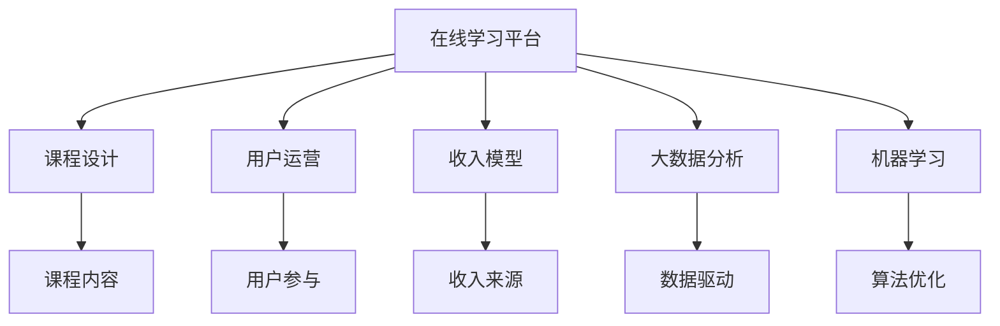

                 

# 如何打造知识付费的在线学习社区

## 1. 背景介绍

### 1.1 问题由来

在现代社会，知识付费已经成为一种流行趋势，人们在追求自我提升和职业发展的过程中，愿意为高质量的课程和资料付费。然而，传统的高校教育和在线教育平台存在诸多问题：内容质量参差不齐、学习效率低下、用户体验不佳等。因此，打造一个高质量、高效率、高体验的知识付费在线学习社区，已成为众多教育机构的共同目标。

### 1.2 问题核心关键点

打造一个成功的知识付费在线学习社区，需要从多个维度进行思考和设计：

- 课程设计：根据用户需求，设计高质量、科学合理的课程内容。
- 平台搭建：开发高效、稳定、易用的在线学习平台，提供良好的用户体验。
- 用户运营：通过有效的内容运营和社区管理，吸引并留住用户。
- 收入模型：建立多样化的收入模型，保障平台可持续运营。
- 技术支撑：提供必要的技术保障，如大数据分析、机器学习等。

## 2. 核心概念与联系

### 2.1 核心概念概述

为更好地理解知识付费在线学习社区的建设，本节将介绍几个密切相关的核心概念：

- 在线学习平台(Online Learning Platform)：通过网络提供课程、资料、社区交流等学习资源的平台。
- 知识付费(Knowledge-Based Pricing)：用户为获取高质量课程和资料，通过付费方式支付的费用。
- 用户运营(User Engagement)：通过内容运营、社区管理、个性化推荐等方式，吸引用户并提升其参与度。
- 收入模型(Income Model)：包括课程销售、订阅服务、广告投放、知识付费等多种形式，是平台可持续运营的关键。
- 大数据分析(Big Data Analytics)：通过数据挖掘和分析，优化课程内容、提升用户体验、预测市场趋势。
- 机器学习(Machine Learning)：利用算法和模型，提升推荐系统、智能客服、内容审核等系统的精准度和效率。

这些核心概念之间的逻辑关系可以通过以下Mermaid流程图来展示：



这个流程图展示了大语言模型的核心概念及其之间的关系：

1. 在线学习平台作为基础，通过课程设计提供高质量内容，吸引用户。
2. 用户运营提升用户参与度，促进用户留存。
3. 收入模型确保平台可持续发展。
4. 大数据分析为决策提供支持。
5. 机器学习提升系统精准度。

## 3. 核心算法原理 & 具体操作步骤

### 3.1 算法原理概述

知识付费在线学习社区的建设，本质上是一个多层次、多维度的数据驱动和算法优化的过程。其核心思想是：通过科学合理的课程设计、高效便捷的在线平台、多样化的收入模型和丰富的数据资源，吸引并留住用户，实现平台的可持续运营。

具体来说，社区平台通过以下步骤实现：

1. 课程设计：从用户需求出发，设计高质量课程内容。
2. 平台搭建：开发高效、稳定、易用的在线平台，提供良好的用户体验。
3. 用户运营：通过内容运营、社区管理等方式，提升用户参与度。
4. 收入模型：建立多样化的收入模型，确保平台可持续运营。
5. 技术支撑：提供必要的技术保障，如大数据分析、机器学习等。

### 3.2 算法步骤详解

以下我们将详细讲解知识付费在线学习社区的核心算法步骤：

**Step 1: 课程设计**
- 需求调研：通过问卷调查、市场分析等方式，了解目标用户的需求和痛点。
- 课程规划：根据调研结果，制定科学合理的课程规划，设计高质量的课程内容。
- 课程录制：邀请行业专家或课程制作团队，录制高质量的视频、音频或文字课程。
- 内容审核：建立完善的课程审核机制，确保课程内容的质量和适宜性。

**Step 2: 平台搭建**
- 界面设计：设计简洁、美观、易用的平台界面，提升用户体验。
- 功能开发：开发课程发布、订阅、购买、学习、互动等核心功能，支持多样化的学习场景。
- 性能优化：通过代码优化、缓存、负载均衡等技术手段，提升平台的稳定性和响应速度。
- 安全保障：实现用户认证、数据加密、访问控制等安全措施，保护用户数据安全。

**Step 3: 用户运营**
- 内容运营：定期发布优质课程内容，通过社区活动、互动问答等方式，提升用户参与度。
- 社区管理：建立完善的社区管理机制，及时处理用户反馈，维护良好的社区氛围。
- 个性化推荐：利用推荐算法，向用户推荐感兴趣和有价值的课程内容，提升学习效率。
- 用户留存：通过积分奖励、成就系统等方式，提升用户粘性，促进长期留存。

**Step 4: 收入模型**
- 课程销售：通过课程销售模式，让用户付费获取课程内容。
- 订阅服务：提供月度、年度订阅服务，让用户按月或按年付费。
- 广告投放：在平台上投放广告，获取广告收入。
- 知识付费：通过文章、视频、音频等形式的知识付费，让用户为高质量内容付费。

**Step 5: 技术支撑**
- 大数据分析：通过数据分析技术，挖掘用户行为数据，优化课程内容，提升推荐系统精准度。
- 机器学习：利用算法和模型，提升推荐系统、智能客服、内容审核等系统的精准度和效率。

### 3.3 算法优缺点

知识付费在线学习社区的算法有其独特的优点：

1. 高效提升学习效率：通过科学合理的课程设计、个性化推荐等技术手段，提升用户的学习效率。
2. 提升用户体验：通过简洁易用的平台界面、丰富的课程内容和互动方式，提升用户的学习体验。
3. 优化收入模型：通过多样化的收入模式，确保平台的可持续运营。

同时，该算法也存在一些局限性：

1. 课程质量参差不齐：课程设计需要高水平的专业知识和经验，课程质量难以完全保证。
2. 用户参与度依赖内容质量：高质量的内容是提升用户参与度的关键，但内容的制作和审核成本较高。
3. 平台运营成本较高：平台搭建、用户运营、广告投放等成本较高，需要大量资金投入。

尽管存在这些局限性，但知识付费在线学习社区的建设仍然是大势所趋，市场潜力巨大。未来相关研究的重点在于如何进一步提升课程质量、降低运营成本、提高用户参与度，同时兼顾可解释性和伦理安全性等因素。

### 3.4 算法应用领域

知识付费在线学习社区的算法已经广泛应用于多个领域，包括但不限于：

- 职业培训：如IT编程、金融分析、市场营销等。通过课程设计、在线平台和用户运营，帮助用户提升职业技能。
- 学历教育：如中小学在线教育、高等教育在线课程等。通过课程内容、互动学习、个性化推荐，提升学习效果。
- 语言学习：如英语、日语、韩语等语言学习课程。通过课程录制、平台搭建、用户运营，帮助用户掌握目标语言。
- 职业技能：如摄影、音乐、舞蹈等。通过课程设计、在线平台、用户运营，帮助用户提升职业技能。
- 技术学习：如软件开发、网络安全、大数据分析等。通过课程内容、在线平台、用户运营，帮助用户掌握技术技能。

## 4. 数学模型和公式 & 详细讲解 & 举例说明

### 4.1 数学模型构建

本节将使用数学语言对知识付费在线学习社区的建设进行更加严格的刻画。

记课程设计为 $C$，平台搭建为 $P$，用户运营为 $U$，收入模型为 $I$，技术支撑为 $T$。假设社区平台在 $T$ 和 $I$ 的共同作用下，实现了用户参与度 $G$。则社区平台的总体模型可以表示为：

$$
G = f(C, P, U, I, T)
$$

其中 $f$ 为综合优化函数，考虑了课程设计、平台搭建、用户运营、收入模型和技术支撑等多个因素。

### 4.2 公式推导过程

以下我们以用户参与度 $G$ 为例，推导其计算公式。

用户参与度 $G$ 受多个因素影响，包括课程质量、平台体验、内容推荐、用户反馈等。因此，用户参与度 $G$ 可以表示为：

$$
G = g(C, P, U, I, T) = \alpha C + \beta P + \gamma U + \delta I + \epsilon T
$$

其中 $\alpha, \beta, \gamma, \delta, \epsilon$ 为权重系数，反映各个因素对用户参与度的影响程度。

课程质量 $C$ 可以通过用户满意度、课程评价、课程完成率等指标来衡量。

平台体验 $P$ 可以通过页面加载速度、交互流畅度、用户留存率等指标来衡量。

内容推荐 $U$ 可以通过推荐系统算法精度、个性化推荐效果、用户粘性等指标来衡量。

收入模型 $I$ 可以通过课程销售量、订阅用户数、广告收入等指标来衡量。

技术支撑 $T$ 可以通过大数据分析、机器学习算法、平台安全等指标来衡量。

通过上述公式，我们可以清晰地理解用户参与度的各个影响因素，从而进行有针对性的优化和改进。

### 4.3 案例分析与讲解

以下以在线教育平台Coursera为例，进行案例分析与讲解。

Coursera 作为全球领先的在线教育平台，通过科学合理的课程设计、高效便捷的在线平台、多样化的收入模型和丰富的数据资源，吸引了大量用户，取得了显著的商业成功。

- 课程设计：Coursera 的课程设计严格遵循SCSM模型，即科学性(Scientific)、清晰度(Clarity)、系统性(Systematic)、可行性(Practical)，确保课程质量。
- 平台搭建：Coursera 采用自适应学习技术，通过互动式学习、视频讲解、测验等方式，提升用户体验。
- 用户运营：Coursera 定期发布优质课程内容，通过社区活动、互动问答等方式，提升用户参与度。
- 收入模型：Coursera 通过课程销售、订阅服务、广告投放、知识付费等多种方式，确保平台可持续运营。
- 技术支撑：Coursera 利用大数据分析和机器学习技术，提升推荐系统精准度和平台稳定性。

通过上述分析，我们可以看到，Coursera 的成功不仅得益于其优质的课程内容和高效的平台搭建，更离不开科学合理的用户运营、多样化的收入模型和完善的技术支撑。这些因素共同作用，推动了 Coursera 的持续发展和市场扩展。

## 5. 项目实践：代码实例和详细解释说明

### 5.1 开发环境搭建

在进行知识付费在线学习社区的开发前，我们需要准备好开发环境。以下是使用Python进行Flask开发的环境配置流程：

1. 安装Anaconda：从官网下载并安装Anaconda，用于创建独立的Python环境。

2. 创建并激活虚拟环境：
```bash
conda create -n course-env python=3.8 
conda activate course-env
```

3. 安装Flask：
```bash
pip install flask
```

4. 安装Flask-RESTful：
```bash
pip install flask-restful
```

5. 安装SQLAlchemy：
```bash
pip install sqlalchemy
```

6. 安装Flask-SQLAlchemy：
```bash
pip install flask-sqlalchemy
```

完成上述步骤后，即可在`course-env`环境中开始开发实践。

### 5.2 源代码详细实现

下面我们以用户管理模块为例，给出使用Flask进行在线学习平台开发的PyTorch代码实现。

首先，定义用户模型：

```python
from flask_sqlalchemy import SQLAlchemy

db = SQLAlchemy()

class User(db.Model):
    id = db.Column(db.Integer, primary_key=True)
    username = db.Column(db.String(64), unique=True)
    password_hash = db.Column(db.String(128))
    email = db.Column(db.String(120), unique=True)

    def __repr__(self):
        return '<User %r>' % self.username
```

然后，定义用户注册和登录视图：

```python
from flask import Blueprint, render_template, request, redirect, url_for, flash
from flask_login import login_user, login_required, logout_user

user = Blueprint('user', __name__)

@user.route('/register', methods=['GET', 'POST'])
def register():
    if request.method == 'POST':
        username = request.form.get('username')
        password = request.form.get('password')
        email = request.form.get('email')
        user = User(username=username, password_hash=hash_password(password), email=email)
        db.session.add(user)
        db.session.commit()
        flash('注册成功，请登录！')
        return redirect(url_for('login'))
    return render_template('register.html')

@user.route('/login', methods=['GET', 'POST'])
def login():
    if request.method == 'POST':
        username = request.form.get('username')
        password = request.form.get('password')
        user = User.query.filter_by(username=username).first()
        if user and check_password_hash(user.password_hash, password):
            login_user(user)
            flash('登录成功！')
            return redirect(url_for('home'))
        flash('用户名或密码错误！')
    return render_template('login.html')

@user.route('/logout')
@login_required
def logout():
    logout_user()
    flash('已退出登录！')
    return redirect(url_for('home'))
```

最后，启动服务器并测试用户管理模块：

```python
from flask import Flask
from flask_sqlalchemy import SQLAlchemy
from flask_login import LoginManager

app = Flask(__name__)
app.config['SQLALCHEMY_DATABASE_URI'] = 'sqlite:///site.db'
db = SQLAlchemy(app)
login_manager = LoginManager()
login_manager.init_app(app)

@app.route('/')
@login_required
def home():
    return '欢迎访问在线学习社区！'

if __name__ == '__main__':
    app.run(debug=True)
```

以上代码实现了基本的用户注册、登录和退出功能，是Flask在线学习平台开发的良好起点。

### 5.3 代码解读与分析

让我们再详细解读一下关键代码的实现细节：

**User模型定义**：
- `db.Column` 用于定义数据库字段，`Integer` 表示整型，`String` 表示字符串型，`unique=True` 表示唯一性约束。

**用户注册视图**：
- `request.form.get()` 用于获取表单提交的字段数据。
- `hash_password()` 函数用于对密码进行哈希处理，确保密码安全。
- `User.query.filter_by()` 用于从数据库中查询用户，`first()` 表示查询结果取第一个。

**用户登录视图**：
- `check_password_hash()` 函数用于验证密码是否正确。
- `login_user()` 函数用于登录用户，`redirect()` 用于重定向到主页。

**用户退出视图**：
- `logout_user()` 函数用于退出登录。

在实际开发中，还需要进一步扩展用户管理模块，如密码修改、用户信息完善等。同时，还需要引入身份验证、权限管理、用户反馈等模块，构建完整的在线学习社区。

## 6. 实际应用场景

### 6.1 智能在线教育

知识付费在线学习社区在智能在线教育中有着广泛的应用。通过科学合理的课程设计、高效便捷的在线平台和多样化的收入模型，可以为学生提供高质量、个性化的学习体验。

具体来说，智能在线教育平台可以根据学生的学习进度和兴趣，推荐相应的课程和资料，提升学习效率。同时，平台还可以提供智能辅导、作业批改、学习分析等服务，帮助学生更好地掌握知识。

### 6.2 知识付费市场

知识付费在线学习社区也适用于知识付费市场，为知识创作者提供变现渠道。通过平台搭建、内容运营和用户运营，创作者可以积累大量粉丝和付费用户，实现知识变现。

知识创作者可以通过发布课程、开设会员、提供咨询和培训等服务，获取稳定的收入。平台还可以利用大数据分析，帮助创作者进行市场定位和内容优化，提升创作质量。

### 6.3 企业培训

知识付费在线学习社区在企业培训中也具有重要价值。通过在线学习平台，企业可以为员工提供多样化的培训课程，提升其职业技能和工作效率。

企业可以根据员工的工作需求和职业发展路径，定制个性化的培训计划，通过在线课程和互动学习，提升员工的技能水平。同时，企业还可以通过课程评价和反馈，了解员工的学习效果，优化培训效果。

### 6.4 未来应用展望

随着技术的发展，知识付费在线学习社区的未来应用将更加广泛。以下是一些可能的应用场景：

- 虚拟课堂：通过虚拟现实技术，提供沉浸式的学习体验，提升用户参与度。
- 社交学习：构建知识社区，用户可以相互交流和讨论，提升学习效果。
- 实时互动：引入实时互动技术，如视频会议、在线问答等，提升学习效果。
- 个性化推荐：利用大数据和机器学习技术，提供更加精准的个性化推荐，提升用户满意度。

总之，知识付费在线学习社区将成为未来教育和学习的重要形态，通过科学合理的课程设计、高效便捷的在线平台和多样化的收入模型，为学生、知识创作者和企业提供优质、高效、个性化的学习体验。

## 7. 工具和资源推荐

### 7.1 学习资源推荐

为了帮助开发者系统掌握知识付费在线学习社区的理论基础和实践技巧，这里推荐一些优质的学习资源：

1. 《在线教育系统开发指南》：详细讲解在线教育系统的搭建和开发，涵盖课程设计、平台搭建、用户运营等多个方面。

2. 《Flask Web开发实战》：讲解Flask框架的开发实践，涵盖Flask-RESTful、SQLAlchemy等常用工具的使用。

3. 《知识付费市场分析报告》：分析知识付费市场的发展趋势和用户需求，提供课程设计和运营优化建议。

4. 《知识付费平台成功案例》：介绍国内外成功的知识付费平台案例，提供实际经验和学习借鉴。

5. 《知识付费用户行为研究》：研究知识付费用户的心理和行为特点，提供用户运营优化建议。

通过对这些资源的学习实践，相信你一定能够快速掌握知识付费在线学习社区的精髓，并用于解决实际的在线教育问题。

### 7.2 开发工具推荐

高效的开发离不开优秀的工具支持。以下是几款用于知识付费在线学习社区开发的常用工具：

1. Flask：基于Python的开源Web框架，灵活性强，适合快速迭代研究。

2. SQLAlchemy：强大的ORM框架，支持关系型数据库和SQL查询，方便数据管理。

3. Flask-RESTful：基于Flask的RESTful接口开发工具，支持API开发和数据交互。

4. Flask-Login：用于用户身份验证和会话管理，提供登录、登出、用户权限管理等功能。

5. Flask-WTF：用于表单处理和验证，支持Flask开发中的表单处理和数据校验。

6. Scrapy：基于Python的爬虫框架，支持数据抓取和存储，方便数据收集和清洗。

合理利用这些工具，可以显著提升知识付费在线学习社区的开发效率，加快创新迭代的步伐。

### 7.3 相关论文推荐

知识付费在线学习社区的研究源于学界的持续研究。以下是几篇奠基性的相关论文，推荐阅读：

1. Designing and Evaluating Online Learning Systems（在线学习系统的设计与评估）：详细介绍了在线学习系统的设计方法和评估指标，为知识付费在线学习社区的搭建提供了理论基础。

2. User Engagement in Online Learning Systems（在线学习系统的用户参与）：研究用户参与在线学习系统的各种因素，为知识付费在线学习社区的用户运营提供了理论指导。

3. Machine Learning for Online Learning（在线学习系统的机器学习）：探讨机器学习在在线学习系统中的应用，为知识付费在线学习社区的技术支撑提供了理论依据。

4. Revenue Models for Online Learning Systems（在线学习系统的收入模型）：分析在线学习系统的多种收入模型，为知识付费在线学习社区的收入优化提供了理论指导。

这些论文代表了大语言模型微调技术的发展脉络。通过学习这些前沿成果，可以帮助研究者把握学科前进方向，激发更多的创新灵感。

## 8. 总结：未来发展趋势与挑战

### 8.1 总结

本文对知识付费在线学习社区的建设进行了全面系统的介绍。首先阐述了知识付费在线学习社区的背景和核心关键点，明确了课程设计、平台搭建、用户运营、收入模型和技术支撑的重要性。其次，从原理到实践，详细讲解了知识付费在线学习社区的算法步骤，提供了完整的代码实例和详细解释说明。同时，本文还探讨了知识付费在线学习社区在智能在线教育、知识付费市场、企业培训等领域的实际应用场景，展示了其巨大的市场潜力。此外，本文精选了知识付费在线学习社区的学习资源、开发工具和相关论文，力求为读者提供全方位的技术指引。

通过本文的系统梳理，可以看到，知识付费在线学习社区正在成为在线教育和知识付费的重要形态，通过科学合理的课程设计、高效便捷的在线平台和多样化的收入模型，为学生、知识创作者和企业提供优质、高效、个性化的学习体验。未来，伴随技术的发展，知识付费在线学习社区必将迎来更加广泛的应用，为教育和学习带来深远影响。

### 8.2 未来发展趋势

展望未来，知识付费在线学习社区的发展将呈现以下几个趋势：

1. 智能技术应用广泛。通过引入人工智能技术，如自然语言处理、推荐系统等，提升学习体验和个性化推荐效果。

2. 多样化收入模型兴起。除了传统的课程销售、订阅服务外，知识付费在线学习社区还将探索更多的收入模式，如知识付费、会员服务、广告投放等。

3. 社会化学习普及。通过构建知识社区，促进用户之间的互动和交流，提升学习效果。

4. 虚拟现实技术应用。通过虚拟现实技术，提供沉浸式的学习体验，提升用户参与度。

5. 实时互动技术普及。引入实时互动技术，如视频会议、在线问答等，提升学习效果。

6. 个性化推荐提升。利用大数据和机器学习技术，提供更加精准的个性化推荐，提升用户满意度。

以上趋势凸显了知识付费在线学习社区的广阔前景。这些方向的探索发展，必将进一步提升在线教育的学习效果和用户体验，为教育和学习带来深远影响。

### 8.3 面临的挑战

尽管知识付费在线学习社区已经取得了一定的成就，但在迈向更加智能化、普适化应用的过程中，仍面临诸多挑战：

1. 课程质量难以保证。高质量课程的开发和制作成本较高，难以保证全部课程的质量。

2. 用户参与度依赖内容。优质内容是提升用户参与度的关键，但内容的制作和审核成本较高。

3. 平台运营成本较高。平台搭建、用户运营、广告投放等成本较高，需要大量资金投入。

4. 用户粘性难以提升。用户留存率是平台可持续运营的关键，但如何提升用户粘性，仍然是一大难题。

5. 平台安全性问题。用户数据安全是平台建设的重要保障，但如何防止数据泄露和攻击，仍然需要进一步加强。

6. 用户隐私保护。平台需要处理大量的用户数据，如何保护用户隐私，是平台建设的重要课题。

正视知识付费在线学习社区面临的这些挑战，积极应对并寻求突破，将是大语言模型微调走向成熟的必由之路。相信随着学界和产业界的共同努力，这些挑战终将一一被克服，知识付费在线学习社区必将在构建人机协同的智能时代中扮演越来越重要的角色。

### 8.4 研究展望

面对知识付费在线学习社区所面临的种种挑战，未来的研究需要在以下几个方面寻求新的突破：

1. 探索低成本高品质的课程制作方式。通过自动化和半自动化技术，降低课程制作成本，提高课程质量。

2. 引入更多实时互动技术。通过视频会议、在线问答等方式，提升用户互动体验，增强学习效果。

3. 融合更多社会化学习元素。通过构建知识社区，促进用户之间的互动和交流，提升学习效果。

4. 引入更多个性化推荐技术。利用大数据和机器学习技术，提供更加精准的个性化推荐，提升用户满意度。

5. 引入更多社会化学习元素。通过构建知识社区，促进用户之间的互动和交流，提升学习效果。

6. 引入更多个性化推荐技术。利用大数据和机器学习技术，提供更加精准的个性化推荐，提升用户满意度。

这些研究方向的探索，必将引领知识付费在线学习社区技术迈向更高的台阶，为教育和学习带来深远影响。面向未来，知识付费在线学习社区需要与其他人工智能技术进行更深入的融合，如知识表示、因果推理、强化学习等，多路径协同发力，共同推动教育和学习技术的进步。只有勇于创新、敢于突破，才能不断拓展在线教育的技术边界，让智能技术更好地造福人类社会。

## 9. 附录：常见问题与解答

**Q1：知识付费在线学习社区的课程设计有哪些关键要素？**

A: 知识付费在线学习社区的课程设计需要考虑多个关键要素，包括但不限于：

- 目标受众：了解目标受众的需求和痛点，设计符合其需求的课程内容。
- 内容深度：确保课程内容具有足够的深度和广度，能够满足用户的学习需求。
- 内容结构：设计科学合理的课程结构，避免内容冗余或过于复杂。
- 多媒体形式：采用多种多媒体形式，如视频、音频、文字、图片等，提升学习效果。
- 互动环节：设计互动环节，如在线答疑、互动讨论等，提升用户参与度。
- 考核机制：建立科学的考核机制，确保用户学习效果。

**Q2：知识付费在线学习社区的平台搭建需要考虑哪些因素？**

A: 知识付费在线学习社区的平台搭建需要考虑以下因素：

- 界面设计：设计简洁、美观、易用的平台界面，提升用户体验。
- 功能开发：开发课程发布、订阅、购买、学习、互动等核心功能，支持多样化的学习场景。
- 性能优化：通过代码优化、缓存、负载均衡等技术手段，提升平台的稳定性和响应速度。
- 安全保障：实现用户认证、数据加密、访问控制等安全措施，保护用户数据安全。

**Q3：知识付费在线学习社区的用户运营需要哪些策略？**

A: 知识付费在线学习社区的用户运营需要以下策略：

- 内容运营：定期发布优质课程内容，通过社区活动、互动问答等方式，提升用户参与度。
- 社区管理：建立完善的社区管理机制，及时处理用户反馈，维护良好的社区氛围。
- 个性化推荐：利用推荐算法，向用户推荐感兴趣和有价值的课程内容，提升学习效率。
- 用户留存：通过积分奖励、成就系统等方式，提升用户粘性，促进长期留存。

**Q4：知识付费在线学习社区的收入模型有哪些形式？**

A: 知识付费在线学习社区的收入模型包括多种形式，如：

- 课程销售：通过课程销售模式，让用户付费获取课程内容。
- 订阅服务：提供月度、年度订阅服务，让用户按月或按年付费。
- 广告投放：在平台上投放广告，获取广告收入。
- 知识付费：通过文章、视频、音频等形式的知识付费，让用户为高质量内容付费。

**Q5：知识付费在线学习社区如何引入机器学习技术？**

A: 知识付费在线学习社区可以引入机器学习技术，提升推荐系统、智能客服、内容审核等系统的精准度和效率。具体来说，可以：

- 引入推荐算法，提供更加精准的个性化推荐，提升用户满意度。
- 利用自然语言处理技术，进行文本分析和情感分析，提升智能客服的准确性和效率。
- 利用图像识别技术，进行内容审核，确保平台内容的适宜性和合法性。

通过引入机器学习技术，知识付费在线学习社区可以提升系统的智能化水平，更好地服务于用户。

