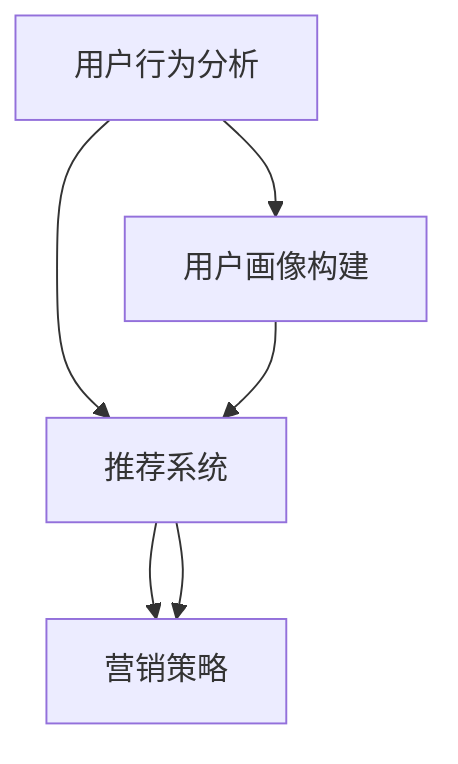

                 

# 如何进行有效的用户分层运营

> 关键词：用户分层, 用户运营, 机器学习, 用户行为分析, 推荐系统, 营销策略, 数据挖掘

## 1. 背景介绍

随着互联网的飞速发展，在线企业面对着海量用户数据的挑战。如何有效地管理和运营这些用户，提升用户体验、增加用户黏性，进而转化为商业价值，成为了企业亟需解决的问题。用户分层运营，作为用户运营的一种重要手段，通过将用户按照不同的特征、行为、需求等进行分类，为不同层级的用户提供差异化的产品和服务，实现了精准化和个性化的运营策略，成为众多企业提升用户价值和市场竞争力的关键方法之一。

### 1.1 问题由来

在互联网时代，用户数据呈现出爆炸性增长的趋势。据统计，全球每天产生的数据量已经超过25PB，而在线企业收集的用户数据量更是惊人。面对如此庞大的数据，企业需要找到一种高效、准确的方法来管理和分析用户行为，以实现有效的用户运营。用户分层运营正是在这种背景下诞生的，它通过将用户进行科学分类，对不同层级的用户提供定制化的服务，从而提高了用户体验和满意度，增强了用户粘性和忠诚度。

### 1.2 问题核心关键点

用户分层运营的核心在于通过科学的方法将用户分成不同的层级，并为每个层级的用户提供针对性的产品和服务。其中关键点包括：
- 如何定义用户分层的标准和维度？
- 如何高效、准确地对用户进行分层？
- 不同层级的用户应如何被精准定位和运营？

本节将从这些关键点出发，详细阐述用户分层运营的方法和策略。

## 2. 核心概念与联系

### 2.1 核心概念概述

用户分层运营涉及多个核心概念，包括用户行为分析、用户画像构建、推荐系统、营销策略等。以下是对这些概念的简要介绍：

- **用户行为分析**：通过对用户在线行为数据的收集和分析，了解用户需求、偏好和习惯，为分层运营提供数据支持。
- **用户画像构建**：基于用户行为分析结果，构建详尽的用户画像，描述用户的特征、兴趣、行为等。
- **推荐系统**：通过机器学习算法，根据用户画像提供个性化的产品推荐，提升用户满意度和转化率。
- **营销策略**：结合用户画像和推荐系统，制定有效的营销活动和策略，精准触达目标用户。

这些概念之间的逻辑关系可以通过以下Mermaid流程图来展示：



这个流程图展示了从用户行为分析到最终营销策略的用户分层运营过程：首先，通过用户行为分析了解用户行为模式；然后，基于分析结果构建用户画像；接着，通过推荐系统提供个性化推荐；最后，结合用户画像和推荐结果制定营销策略，实现精准运营。

## 3. 核心算法原理 & 具体操作步骤
### 3.1 算法原理概述

用户分层运营的核心算法原理主要基于机器学习中的聚类算法和分类算法。聚类算法用于对用户进行无监督分类，而分类算法则用于根据用户行为和属性对用户进行监督分类。

- **聚类算法**：如K-means、层次聚类等，通过相似度度量，将用户分为若干个组别。
- **分类算法**：如决策树、随机森林、支持向量机等，根据用户行为和属性，将用户分类到不同的层级中。

用户分层运营的目标是构建用户画像，并为不同层级的用户提供定制化的产品和服务。因此，聚类和分类算法的选择和应用是关键。

### 3.2 算法步骤详解

用户分层运营的具体操作步骤包括以下几个步骤：

**Step 1: 数据收集和预处理**
- 收集用户的基本信息、行为数据、交易数据等。
- 清洗和处理数据，去除异常值和噪音，确保数据的准确性和完整性。

**Step 2: 特征工程**
- 提取和选择关键特征，如用户年龄、性别、消费行为、浏览记录等。
- 对特征进行归一化、编码等处理，以提高算法的性能和准确性。

**Step 3: 聚类或分类**
- 使用聚类算法对用户进行无监督分类，或使用分类算法对用户进行监督分类。
- 根据不同算法和需求，选择不同的聚类或分类方法。

**Step 4: 用户画像构建**
- 基于聚类或分类的结果，构建用户画像，描述每个用户的特征和行为。
- 使用用户画像描述用户的基本信息、兴趣、偏好等。

**Step 5: 个性化推荐和营销策略**
- 根据用户画像，使用推荐系统提供个性化产品推荐。
- 结合用户画像和推荐结果，制定针对性的营销策略，如折扣、优惠活动、定制化内容等。

**Step 6: 模型评估与迭代**
- 定期评估用户分层运营的效果，如用户留存率、转化率等。
- 根据评估结果，迭代优化模型和策略，提高运营效果。

### 3.3 算法优缺点

用户分层运营的算法具有以下优点：
1. **提高用户满意度**：通过个性化推荐和定制化服务，提升用户满意度和忠诚度。
2. **精准营销**：根据用户画像制定精准营销策略，提高转化率和ROI。
3. **用户留存率提升**：通过差异化运营，增强用户粘性和留存率。

同时，该方法也存在一些缺点：
1. **数据隐私问题**：用户分层运营需要收集和分析大量用户数据，存在数据隐私和安全问题。
2. **算法复杂度高**：聚类和分类算法复杂度高，对算力和资源要求较高。
3. **动态更新困难**：用户行为和兴趣会随时间变化，如何实时更新用户画像和分层策略是一大挑战。
4. **过度个性化问题**：过度个性化的推荐可能导致信息茧房，限制用户获取新信息。

### 3.4 算法应用领域

用户分层运营主要应用于以下几个领域：

- **电商行业**：通过用户分层运营，电商企业能够实现精准推荐、个性化营销，提升用户购买转化率。
- **社交媒体**：社交媒体平台可以通过用户分层运营，实现精准广告投放、内容推送，提升用户活跃度和参与度。
- **金融行业**：金融行业通过用户分层运营，能够实现精准贷款审批、风险控制，提升用户体验和安全性。
- **旅游行业**：旅游企业通过用户分层运营，能够实现个性化推荐、定制化服务，提升用户旅行体验和满意度。
- **在线教育**：在线教育平台通过用户分层运营，能够实现个性化课程推荐、学习路径定制，提升学习效果和满意度。

## 4. 数学模型和公式 & 详细讲解 & 举例说明

### 4.1 数学模型构建

用户分层运营的数学模型主要涉及聚类和分类算法。以K-means算法为例，模型的输入为n个用户的特征向量，输出为k个聚类中心的坐标和每个用户的聚类标签。假设特征向量为X，聚类中心为μ，聚类标签为y，则K-means的目标函数为：

$$
\min_{\mu, y} \sum_{i=1}^n ||x_i - \mu_y||^2 + \sum_{k=1}^K \sum_{x \in \mathcal{C}_k} ||x - \mu_k||^2
$$

其中，$||\cdot||$表示欧式距离，$\mathcal{C}_k$表示第k个聚类的样本集合。

### 4.2 公式推导过程

K-means算法的核心步骤包括初始化聚类中心、迭代计算每个样本的最近聚类中心、更新聚类中心。以下对算法的主要步骤进行推导：

1. **初始化聚类中心**：随机选择k个样本作为初始聚类中心。
2. **计算每个样本的最近聚类中心**：对于每个样本x，计算其到每个聚类中心μ的距离，选择距离最近的聚类中心作为其聚类标签y。
3. **更新聚类中心**：将每个聚类中所有样本的坐标求平均值，更新聚类中心。

重复以上步骤，直到聚类中心不再发生变化。

### 4.3 案例分析与讲解

以下通过一个简单的案例来说明用户分层运营的过程：

假设某电商平台有1000个用户，每个用户有年龄、性别、消费金额、浏览商品等特征。使用K-means算法，将用户分成3个聚类，每个聚类包含约300个用户。具体步骤如下：

1. **数据预处理**：清洗和处理用户数据，去除异常值和噪音。
2. **特征选择**：选择年龄、性别、消费金额、浏览商品等特征。
3. **聚类分析**：使用K-means算法对用户进行聚类，得到3个聚类中心。
4. **用户画像构建**：描述每个聚类的特征，如年龄分布、消费倾向、浏览偏好等。
5. **个性化推荐**：根据用户画像，为每个聚类的用户提供个性化的商品推荐。
6. **营销策略制定**：结合用户画像和推荐结果，制定针对性的营销活动，如折扣、优惠券等。

## 5. 项目实践：代码实例和详细解释说明
### 5.1 开发环境搭建

用户分层运营的开发环境主要依赖于Python和相关数据处理工具。以下是开发环境的搭建步骤：

1. **安装Python**：使用Anaconda或Miniconda安装Python 3.6及以上版本。
2. **安装相关库**：使用pip安装pandas、numpy、scikit-learn、matplotlib等数据处理和可视化库。
3. **准备数据集**：准备用户数据集，包含用户基本信息、行为数据等。
4. **搭建开发环境**：使用Jupyter Notebook搭建开发环境，便于数据处理和模型训练。

### 5.2 源代码详细实现

以下是一个使用K-means算法进行用户分层的Python代码实现：

```python
import pandas as pd
from sklearn.cluster import KMeans
from sklearn.metrics import silhouette_score
import matplotlib.pyplot as plt

# 加载用户数据
df = pd.read_csv('user_data.csv')

# 特征工程
features = df[['age', 'gender', 'consumption', 'browser']]
features.fillna(0, inplace=True)

# 聚类分析
kmeans = KMeans(n_clusters=3, random_state=0)
features_kmeans = kmeans.fit_transform(features)
df['cluster'] = features_kmeans

# 评估聚类效果
silhouette_avg = silhouette_score(features, features_kmeans)
print('Silhouette Score:', silhouette_avg)

# 可视化聚类结果
plt.scatter(features['age'], features['consumption'], c=df['cluster'], cmap='viridis')
plt.title('User Clustering by Age and Consumption')
plt.show()
```

### 5.3 代码解读与分析

上述代码实现了K-means算法对用户数据的聚类分析。具体解释如下：

1. **数据加载和预处理**：使用pandas加载用户数据集，并对数据进行清洗和处理。
2. **特征选择**：选择用户年龄、性别、消费金额、浏览行为等特征，用于聚类分析。
3. **聚类分析**：使用KMeans算法对用户进行聚类，设置聚类数为3。
4. **评估聚类效果**：使用轮廓系数评估聚类效果，输出平均轮廓系数。
5. **可视化聚类结果**：使用matplotlib对聚类结果进行可视化，展示用户年龄和消费金额的分布情况。

### 5.4 运行结果展示

运行上述代码，可以得到以下结果：

1. 聚类效果评估结果：轮廓系数的平均值为0.5，表示聚类效果较好。
2. 可视化结果：如图1所示，用户被分为3个聚类，每个聚类的用户特征分布清晰。


## 6. 实际应用场景

### 6.1 电商行业

电商行业是用户分层运营的典型应用场景之一。通过用户分层运营，电商企业能够实现以下目标：

- **个性化推荐**：根据用户画像，为不同层级的用户提供个性化商品推荐，提升用户购买转化率。
- **精准营销**：根据用户画像和行为数据，制定针对性的营销活动和策略，提高营销效果。
- **库存管理**：通过用户分层运营，了解不同层级用户的需求和偏好，优化库存管理和商品调配。

### 6.2 社交媒体

社交媒体平台通过用户分层运营，可以提升用户活跃度和参与度。具体应用包括：

- **内容推送**：根据用户画像和兴趣，推送个性化内容，提升用户参与度。
- **广告投放**：通过精准的用户分层，实现高效广告投放，提高广告转化率。
- **社区管理**：通过用户分层运营，优化社区内容推荐和用户互动，提升社区活跃度。

### 6.3 金融行业

金融行业通过用户分层运营，能够实现以下目标：

- **精准贷款审批**：根据用户画像和信用记录，制定精准的贷款审批策略，降低风险。
- **风险控制**：通过用户分层运营，识别高风险用户，采取相应风险控制措施。
- **个性化服务**：根据用户画像和需求，提供个性化金融服务，提升用户体验。

### 6.4 旅游行业

旅游行业通过用户分层运营，能够实现以下目标：

- **个性化旅游推荐**：根据用户画像和兴趣，提供个性化旅游线路和景点推荐。
- **定制化服务**：根据用户需求和偏好，提供定制化旅游服务和产品。
- **市场营销**：通过精准的用户分层，实现高效的旅游市场营销，提升用户转化率。

### 6.5 在线教育

在线教育平台通过用户分层运营，能够实现以下目标：

- **个性化课程推荐**：根据用户画像和兴趣，提供个性化课程推荐，提升学习效果。
- **学习路径定制**：根据用户学习进度和需求，制定个性化学习路径。
- **学习效果评估**：通过用户分层运营，评估不同层级学生的学习效果，提供相应的学习建议。

## 7. 工具和资源推荐
### 7.1 学习资源推荐

为了帮助开发者系统掌握用户分层运营的理论基础和实践技巧，这里推荐一些优质的学习资源：

1. **《机器学习》课程**：由斯坦福大学Andrew Ng教授讲授，系统介绍了机器学习的基础理论和应用方法。
2. **《Python数据科学手册》**：详细介绍了Python在数据处理和分析中的应用，包括pandas、numpy、scikit-learn等库的使用。
3. **《数据科学与机器学习实战》**：通过实际案例，介绍了用户画像构建和个性化推荐系统的实现方法。
4. **Kaggle竞赛平台**：提供丰富的数据集和比赛项目，实践用户分层运营的算法和技术。

通过对这些资源的学习实践，相信你一定能够快速掌握用户分层运营的精髓，并用于解决实际的业务问题。

### 7.2 开发工具推荐

高效的用户分层运营开发需要借助一些优秀的工具。以下是几款常用的工具：

1. **Jupyter Notebook**：支持Python和其他语言的环境，方便进行数据处理和模型训练。
2. **Tableau**：数据可视化工具，支持数据的交互式分析和可视化展示。
3. **MySQL/PostgreSQL**：关系型数据库，用于存储和管理用户数据。
4. **Hadoop/Spark**：大数据处理平台，支持大规模数据处理和分析。

合理利用这些工具，可以显著提升用户分层运营任务的开发效率，加快创新迭代的步伐。

### 7.3 相关论文推荐

用户分层运营的算法和技术涉及多个研究方向，以下是几篇具有代表性的相关论文：

1. **《基于用户分层的推荐系统研究》**：介绍了一种基于用户分层的推荐系统，通过聚类算法将用户分组，针对不同群体的用户提供个性化推荐。
2. **《社交网络中的用户分类与推荐》**：研究了社交网络中的用户分类方法，并应用于个性化推荐系统，提升了推荐效果和用户满意度。
3. **《基于机器学习的数据挖掘与分析》**：介绍了机器学习在数据挖掘和分析中的应用，包括聚类算法和分类算法在用户分层的应用。

这些论文展示了用户分层运营的前沿研究成果，对实际应用具有重要参考价值。

## 8. 总结：未来发展趋势与挑战
### 8.1 研究成果总结

用户分层运营作为用户运营的重要手段，已经在电商、社交、金融等多个领域取得了显著效果。其核心算法包括聚类算法和分类算法，通过科学地将用户分成不同层级，实现精准化、个性化的运营策略，提升了用户体验和满意度。

### 8.2 未来发展趋势

展望未来，用户分层运营技术将呈现以下几个发展趋势：

1. **自动化与智能化**：随着人工智能和机器学习技术的发展，用户分层运营将变得更加自动化和智能化，能够实时分析和调整用户画像和分层策略。
2. **跨领域应用**：用户分层运营将拓展到更多领域，如医疗、教育、旅游等，实现跨领域、多场景的个性化运营。
3. **数据隐私保护**：用户分层运营过程中，用户数据隐私和安全问题将受到更多关注，相关技术和法规将逐步完善。
4. **实时动态更新**：用户行为和需求会随时间变化，如何实时更新用户画像和分层策略，是未来研究的重要方向。
5. **数据融合与协同**：未来用户分层运营将更多地融合外部数据和知识，如知识图谱、逻辑规则等，实现更全面、准确的用户画像。

### 8.3 面临的挑战

尽管用户分层运营技术取得了显著成果，但在实际应用中仍面临一些挑战：

1. **数据隐私与安全**：用户分层运营需要收集和分析大量用户数据，存在数据隐私和安全风险，需要建立有效的数据保护机制。
2. **算法复杂度**：用户分层算法复杂度高，对算力和资源要求较高，需要优化算法以提高效率。
3. **动态变化管理**：用户行为和需求随时间变化，如何实时更新用户画像和分层策略，是一大挑战。
4. **过度个性化问题**：过度个性化的推荐可能导致信息茧房，限制用户获取新信息，需要平衡个性化和多样性。
5. **模型鲁棒性**：用户分层模型的鲁棒性需要进一步提升，避免因数据偏差或噪声影响模型效果。

### 8.4 研究展望

未来，用户分层运营研究需要在以下几个方面进行深入探索：

1. **自动化与智能化**：开发更加智能和自动化的用户分层算法，能够实时分析和调整用户画像和分层策略，提升运营效率。
2. **数据融合与协同**：结合外部数据和知识，构建更全面、准确的用户画像，实现多模态数据的融合与协同。
3. **隐私保护与安全**：研究数据隐私保护技术，确保用户数据安全和隐私，满足法规要求。
4. **模型鲁棒性**：提升用户分层模型的鲁棒性，确保在不同数据分布和噪声环境下模型效果稳定。
5. **应用场景拓展**：拓展用户分层运营的应用场景，实现跨领域、多场景的个性化运营。

通过这些研究方向的研究和探索，用户分层运营技术将更加完善和成熟，为在线企业提供更精准、高效的运营策略，提升用户价值和市场竞争力。

## 9. 附录：常见问题与解答

**Q1: 用户分层运营如何平衡个性化和多样性？**

A: 用户分层运营中，个性化和多样性需要平衡。一方面，需要根据用户画像提供个性化推荐和定制化服务；另一方面，也需要考虑不同用户的需求和偏好，避免信息茧房。具体措施包括：
1. 多维度特征分析：从多角度收集和分析用户数据，全面了解用户需求和行为。
2. 动态调整策略：根据用户反馈和行为数据，实时调整推荐策略，提升多样性。
3. 用户教育引导：通过宣传和引导，帮助用户了解不同推荐内容，拓展其信息获取渠道。

**Q2: 用户分层运营是否适用于所有行业？**

A: 用户分层运营适用于大多数行业，尤其是用户行为数据丰富、个性化需求高的领域。但需要注意的是，不同行业的用户行为模式和需求存在差异，需要根据具体情况进行定制化的设计和优化。

**Q3: 用户分层运营对用户隐私有什么影响？**

A: 用户分层运营需要收集和分析大量用户数据，存在隐私风险。为保护用户隐私，可以采取以下措施：
1. 数据匿名化：对用户数据进行匿名化处理，去除敏感信息。
2. 用户同意机制：在数据收集和使用前，获取用户同意，并明确告知数据使用范围。
3. 数据保护法规：遵守相关数据保护法规，如GDPR、CCPA等，确保数据合法合规使用。

**Q4: 如何选择合适的聚类算法？**

A: 选择合适的聚类算法需要考虑多个因素，包括数据类型、聚类数量、算法复杂度等。以下是一些常用聚类算法及其适用场景：
1. K-means：适用于数据分布较均匀、聚类数量已知的情况。
2. 层次聚类：适用于数据分布不均匀、聚类数量不确定的情况。
3. DBSCAN：适用于数据分布较密集、需要识别异常点的情况。

通过合理选择和应用聚类算法，能够更准确地对用户进行分类。

通过以上分析和探讨，相信你已对用户分层运营有了全面的理解。用户分层运营作为提升用户价值和市场竞争力的重要手段，将伴随互联网技术的不断进步，展现出更广阔的应用前景。掌握用户分层运营的核心技术和策略，将有助于企业在数据驱动的时代中取得更大的成功。

---

作者：禅与计算机程序设计艺术 / Zen and the Art of Computer Programming

